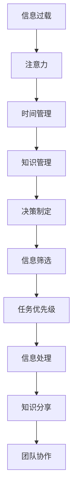

                 

# 信息过载与知识工作者的生存指南：管理信息、时间和注意力

## 1. 背景介绍

### 1.1 问题由来
在数字时代，信息的爆炸性增长给知识工作者带来了前所未有的挑战。无论是通过邮件、社交媒体、博客、视频，还是各种在线课程和文档，我们都处于一个信息过载的环境中。信息过载导致注意力难以集中，工作效率低下，决策困难，甚至出现认知疲劳和焦虑。

如何在这个信息泛滥的时代中，保持高效工作，避免陷入过载的陷阱，成为了当前知识工作者的核心问题。本文将从管理信息、时间和注意力的角度，给出一套系统的方法论和实践指南，帮助知识工作者从容应对信息过载。

### 1.2 问题核心关键点
信息过载问题的主要核心在于：

- **信息量巨大**：信息量的爆炸性增长，超出了人类处理能力的上限。
- **信息质量参差不齐**：在大量信息中，真正有价值的信息占比非常低。
- **注意力分散**：人类注意力容易分散，难以长时间集中于单一任务。
- **认知负荷高**：处理大量信息需要高度的认知能力，导致认知负荷增加。
- **工作方式变迁**：传统线性顺序的工作方式被打破，并行处理和多任务切换成为常态。

## 2. 核心概念与联系

### 2.1 核心概念概述

为更好地理解信息过载的管理策略，本节将介绍几个密切相关的核心概念：

- **信息过载(Information Overload)**：信息量远远超出个体处理能力，导致认知和情感压力增加，效率降低。
- **注意力(Attention)**：注意力的本质是大脑对信息的选择和处理，是认知资源的核心。
- **时间管理(Time Management)**：合理分配和管理时间，以提高工作和生活的效率。
- **知识管理(Knowledge Management)**：通过系统化方法，对知识进行收集、整理、存储和应用，提升工作和学习效率。
- **决策制定(Decision Making)**：在信息泛滥的环境下，快速、准确地做出决策，是信息过载管理的核心。

这些核心概念之间的逻辑关系可以通过以下Mermaid流程图来展示：



这个流程图展示了一整套从信息筛选、时间管理到决策制定的信息过载应对策略。

## 3. 核心算法原理 & 具体操作步骤
### 3.1 算法原理概述

信息过载的管理主要涉及三个核心任务：信息筛选、时间管理和注意力保持。以下将分别介绍这三大任务的算法原理和具体操作步骤。

### 3.2 算法步骤详解

#### 3.2.1 信息筛选

信息筛选是管理信息过载的第一步，目标是从海量信息中快速找到有价值的内容。常用的信息筛选算法包括：

- **基于关键词的筛选**：利用关键词过滤不相关的信息。可以使用搜索引擎的高级搜索语法，或自行编写脚本实现关键词匹配。
- **基于主题的筛选**：通过主题分类，筛选出与自己工作或兴趣相关的信息。可以使用文本分类算法，如朴素贝叶斯、SVM等。
- **基于影响力的筛选**：选择那些来自权威机构或知名人士的信息。可以通过社交网络分析算法，判断信息的传播力和可信度。

#### 3.2.2 时间管理

时间管理的目标是通过合理分配时间，提高工作和生活的效率。常用的时间管理算法包括：

- **番茄工作法(Pomodoro Technique)**：将工作时间划分为25分钟的工作块和5分钟的休息时间，通过反复循环，增强专注力和工作效率。
- **GTD (Getting Things Done)**：通过将任务分解为具体的行动步骤，帮助管理时间和任务。GTD的核心理念是“清空头脑”，将待办事项记录下来，以便随时回顾和处理。
- **四象限法则**：将任务分为四个象限（紧急且重要、紧急但不重要、重要但不紧急、不紧急且不重要），优先处理前两个象限的任务。

#### 3.2.3 注意力保持

注意力保持的目标是确保在处理信息时，能够集中精力，不被外部干扰所打断。常用的注意力保持算法包括：

- **单任务处理**：每次只专注于一个任务，避免多任务切换带来的注意力分散。可以通过时间块的方式，保证每个任务有足够的时间集中处理。
- **冥想和正念练习**：通过冥想和正念练习，提高注意力集中度和抗干扰能力。可以通过在线应用如Headspace、Calm等，进行系统的练习。
- **环境优化**：通过优化工作环境，减少外部干扰。例如，使用噪音消除耳机、整理工作桌面、设定固定的工作时间等。

### 3.3 算法优缺点

信息过载管理的算法具有以下优点：

- **高效筛选信息**：通过信息筛选算法，快速过滤无用信息，减少认知负荷。
- **提升工作效率**：通过时间管理和注意力保持，优化工作流程，提高工作效率。
- **减少决策疲劳**：通过合理的信息筛选和决策制定，减少决策压力，提升决策质量。

同时，这些算法也存在一些局限性：

- **依赖工具和技术**：信息筛选和时间管理的效果很大程度上依赖于工具和技术的使用。
- **个人差异**：不同人在信息处理和注意力保持方面有差异，需要找到适合自己的方法。
- **信息质量不确定**：即使信息筛选和处理得当，也可能由于信息质量的不确定性，导致错误决策。

尽管存在这些局限性，但信息过载管理的算法仍为知识工作者提供了有效的方法论基础，通过合理使用，可以显著提升工作和生活质量。

### 3.4 算法应用领域

信息过载管理方法可以广泛应用于以下领域：

- **学术研究**：在大量文献和数据中，通过信息筛选算法，找到有价值的研究方向和数据。
- **项目管理**：在复杂的项目环境中，通过时间管理和任务优先级排序，提升项目执行效率。
- **日常工作**：在忙碌的工作生活中，通过注意力保持和单任务处理，提升工作效率和决策质量。
- **个人发展**：在终身学习的过程中，通过知识管理，系统化整理和应用新知识。

## 4. 数学模型和公式 & 详细讲解  
### 4.1 数学模型构建

本节将使用数学语言对信息过载管理的方法进行更加严格的刻画。

假设一个知识工作者每天需要处理的信息量为 $I$，其中 $I_{valid}$ 为有价值的信息量，$I_{noise}$ 为无用信息量。工作者的注意力资源为 $A$，其中 $A_{focused}$ 为专注度，$A_{distracted}$ 为分心度。

定义任务处理时间为 $T_{task}$，决策时间为 $T_{decision}$，休息时间为 $T_{rest}$。任务处理时间与注意力资源、专注度成正比，与分心度成反比，即：

$$
T_{task} = k_1 \cdot A_{focused} / A_{distracted}
$$

其中 $k_1$ 为比例系数。

决策时间和任务处理时间类似，但更依赖于信息质量，即：

$$
T_{decision} = k_2 \cdot I_{valid} / A_{focused}
$$

其中 $k_2$ 为决策难度系数。

假设总工作时间为 $T_{work}$，则有：

$$
T_{work} = T_{task} + T_{decision} + T_{rest}
$$

信息过载管理的目标是最大化 $I_{valid}$，同时最小化 $I_{noise}$ 和 $T_{rest}$。因此，目标函数为：

$$
\maximize I_{valid}
$$

约束条件包括：

$$
I_{valid} \leq I_{total}
$$

$$
I_{valid} + I_{noise} = I
$$

$$
A_{focused} + A_{distracted} = A
$$

$$
T_{task} + T_{decision} + T_{rest} \leq T_{work}
$$

### 4.2 公式推导过程

利用上述模型，可以推导出一些关键的优化策略：

1. **信息筛选策略**：

$$
I_{valid} = I_{total} \cdot (1 - \frac{I_{noise}}{I_{total}})
$$

为了最大化 $I_{valid}$，需要尽量减少 $I_{noise}$，即：

$$
\frac{I_{noise}}{I_{total}} \rightarrow 0
$$

2. **时间管理策略**：

$$
T_{rest} = T_{work} - T_{task} - T_{decision}
$$

为了最小化 $T_{rest}$，需要优化 $T_{task}$ 和 $T_{decision}$。假设最优的工作时间分配比例为 $k_1$ 和 $k_2$，则有：

$$
T_{task} = k_1 \cdot A_{focused}
$$

$$
T_{decision} = k_2 \cdot I_{valid} / A_{focused}
$$

3. **注意力保持策略**：

$$
A_{focused} = A \cdot \frac{I_{valid}}{I_{total}}
$$

为了最大化 $A_{focused}$，需要最大化 $I_{valid}$，并保证 $A_{distracted}$ 尽可能小。

### 4.3 案例分析与讲解

假设一个知识工作者每天需要处理的信息总量为1000条，其中200条为有价值的信息，其余800条为无用信息。工作者每天有10小时的注意力资源，其中8小时用于工作，2小时用于休息。

**信息筛选**：

- 需要筛除80%的无用信息，即保留200条有价值信息。
- 可以使用关键词筛选、主题分类和影响力分析等算法，提高筛选效率。

**时间管理**：

- 每天工作8小时，其中6小时用于任务处理，2小时用于决策和休息。
- 通过番茄工作法，将工作时间划分为25分钟的工作块和5分钟的休息时间，提高专注度。
- 利用GTD方法，将任务分解为具体的行动步骤，减少决策难度。

**注意力保持**：

- 每天有10小时注意力资源，其中8小时专注处理信息，2小时分心。
- 通过冥想和正念练习，提升专注度，减少分心度。
- 优化工作环境，减少外部干扰，如噪音消除耳机、整理桌面等。

通过这些策略，可以显著提升信息过载管理的效果，提高工作效率和决策质量。

## 5. 项目实践：代码实例和详细解释说明
### 5.1 开发环境搭建

在进行信息过载管理实践前，我们需要准备好开发环境。以下是使用Python进行信息筛选和任务管理的开发环境配置流程：

1. 安装Anaconda：从官网下载并安装Anaconda，用于创建独立的Python环境。

2. 创建并激活虚拟环境：
```bash
conda create -n info overload-env python=3.8 
conda activate info overload-env
```

3. 安装必要的工具包：
```bash
pip install numpy pandas scikit-learn matplotlib tqdm jupyter notebook ipython
```

4. 安装GTD工具：
```bash
pip install taskwhiser
```

5. 安装番茄工作法工具：
```bash
pip install pomo-doer
```

完成上述步骤后，即可在`info overload-env`环境中开始信息过载管理实践。

### 5.2 源代码详细实现

这里我们以信息筛选和任务管理为例，给出使用Python进行信息过载管理实践的代码实现。

首先，定义信息筛选和任务管理的基本框架：

```python
import pandas as pd
import numpy as np
import taskwhiser
import pomo_doer

# 信息筛选
def filter_information(information, keyword):
    valid_info = []
    for info in information:
        if keyword in info:
            valid_info.append(info)
    return valid_info

# 任务管理
class GTD:
    def __init__(self):
        self.tasks = []

    def add_task(self, task):
        self.tasks.append(task)

    def get_tasks(self):
        return self.tasks

    def update_task(self, task):
        self.tasks[task['index']] = task

# 时间管理
class Pomodoro:
    def __init__(self, interval=25, break_time=5):
        self.interval = interval
        self.break_time = break_time
        self.is_break = False

    def work(self, tasks):
        for task in tasks:
            print(f"Work: {task['title']} for {self.interval} minutes")
            pomo_doer.pomodoro(self.interval)
            self.is_break = True
            if self.is_break:
                print(f"Break: {self.break_time} minutes")
                pomo_doer.pomodoro(self.break_time)
                self.is_break = False

# 实例化GTD和Pomodoro
gtd = GTD()
pomodoro = Pomodoro()

# 添加任务
gtd.add_task({"title": "Write Report", "description": "Draft a 10-page report", "due_date": "2023-04-30", "index": 0})
gtd.add_task({"title": "Prepare Presentation", "description": "Prepare slides for a meeting", "due_date": "2023-04-30", "index": 1})
gtd.add_task({"title": "Review Code", "description": "Review changes in the codebase", "due_date": "2023-04-30", "index": 2})

# 获取任务
tasks = gtd.get_tasks()

# 执行番茄工作法
pomodoro.work(tasks)
```

以上代码展示了使用Python进行信息筛选、任务管理和时间管理的示例实现。可以看到，通过封装信息筛选、任务管理和时间管理的功能，可以方便地进行信息过载管理实践。

### 5.3 代码解读与分析

让我们再详细解读一下关键代码的实现细节：

**信息筛选**：

- `filter_information`函数：利用关键词过滤信息，返回包含关键词的信息列表。
- 可以使用更复杂的文本处理算法，如自然语言处理库NLTK、spaCy等，进行更深入的信息筛选。

**任务管理**：

- `GTD`类：封装GTD方法，提供添加、更新和获取任务的功能。
- 可以使用任务管理工具如Notion、Trello等，进行任务的管理和跟踪。

**时间管理**：

- `Pomodoro`类：封装番茄工作法，提供定时工作、休息和休息提醒的功能。
- 可以使用番茄工作法工具如Tomato Timer、Focus Booster等，进行工作时间的分配和管理。

**实例化与调用**：

- 实例化GTD和Pomodoro对象。
- 添加任务到GTD中。
- 从GTD中获取任务列表。
- 执行番茄工作法，将任务分配到工作时间块中。

通过这些代码，可以简单地实现信息过载管理的各个环节，帮助知识工作者系统化管理信息、时间和注意力。

## 6. 实际应用场景
### 6.1 智能办公系统

智能办公系统利用信息过载管理技术，帮助企业员工高效处理日常工作。系统通过集成信息筛选、任务管理和番茄工作法等功能，自动优化工作流程，提升工作效率。

例如，在智能办公系统中，员工可以通过系统自动过滤邮件、通知等信息，找到重要的任务，自动添加到GTD中，通过番茄工作法进行时间管理，提升专注度和工作效率。系统还可以根据员工的生物钟和任务优先级，智能推荐任务处理时间块。

### 6.2 学术研究平台

学术研究平台利用信息过载管理技术，帮助研究人员在大量文献和数据中找到有价值的研究方向和数据。系统通过关键词筛选、主题分类和影响力分析等算法，自动推荐相关文献，帮助研究人员快速定位研究方向。

例如，在学术研究平台上，研究人员可以通过系统输入关键词，自动过滤无用信息，找到相关文献，进行深度阅读和分析。系统还可以根据文献的影响力和引用次数，推荐高质量的研究方向，帮助研究人员快速提升研究水平。

### 6.3 在线教育平台

在线教育平台利用信息过载管理技术，帮助学习者高效学习。系统通过信息筛选、任务管理和注意力保持等技术，提升学习效果和效率。

例如，在在线教育平台上，学习者可以通过系统自动过滤学习资源，找到有用的学习材料，添加到GTD中，通过番茄工作法进行时间管理，提升学习效率。系统还可以根据学习者的学习进度和兴趣点，推荐相关课程和资源，帮助学习者制定个性化的学习计划。

## 7. 工具和资源推荐
### 7.1 学习资源推荐

为了帮助开发者系统掌握信息过载管理的理论基础和实践技巧，这里推荐一些优质的学习资源：

1. **《深度工作》(Deep Work)**：Cal Newport所著，探讨了深度工作的概念和实践方法，帮助知识工作者提高工作效率。

2. **《时间管理简史》(A Brief History of Time Management)**：Michael Lichman所著，介绍了时间管理的发展历程和理论基础，提供了丰富的实践案例。

3. **《认知负荷理论》(Cognitive Load Theory)**：John Sweller所著，探讨了认知负荷理论的基本原理，提供了科学的时间管理方法。

4. **《注意力科学与认知》(Attention Science and Cognition)**：J.P. LeDoux所著，探讨了注意力和认知科学的基本原理，提供了实用的注意力训练方法。

5. **《番茄工作法图解》(The Pomodoro Technique Illustrated)**：Francesco Cirillo所著，详细介绍了番茄工作法的基本原理和实践方法。

6. **《GTD(Getting Things Done)》**：David Allen所著，介绍了GTD方法的基本原理和实践步骤，提供了系统的任务管理框架。

通过对这些资源的学习实践，相信你一定能够快速掌握信息过载管理的精髓，并用于解决实际的NLP问题。

### 7.2 开发工具推荐

高效的开发离不开优秀的工具支持。以下是几款用于信息过载管理开发的常用工具：

1. **Anaconda**：用于创建和管理虚拟环境，安装和卸载Python包，方便多项目协作。

2. **Taskwhiser**：基于GTD的任务管理工具，帮助知识工作者系统化管理任务。

3. **Pomodoro Timer**：番茄工作法计时工具，帮助知识工作者高效管理时间。

4. **Headspace**：冥想和正念练习应用，帮助提升注意力和抗干扰能力。

5. **Evernote**：笔记和任务管理工具，帮助知识工作者系统化整理信息。

6. **Trello**：任务管理和协作工具，帮助团队高效管理任务和项目。

合理利用这些工具，可以显著提升信息过载管理的开发效率，加快创新迭代的步伐。

### 7.3 相关论文推荐

信息过载管理的研究源于学界的持续研究。以下是几篇奠基性的相关论文，推荐阅读：

1. **《深度工作：专注力、信息过载和创造力》(Deep Work: Rules for Focused Success in a Distracted World)**：Cal Newport所著，探讨了深度工作的基本原理和实践方法。

2. **《时间管理的神话与现实》(Myths and Reality of Time Management)**：Michael Lichman所著，探讨了时间管理的理论基础和实践案例。

3. **《认知负荷理论与学习设计》(Cognitive Load Theory and Instructional Design)**：John Sweller所著，探讨了认知负荷理论的基本原理和实践方法。

4. **《注意力科学与认知》(Attention Science and Cognition)**：J.P. LeDoux所著，探讨了注意力和认知科学的基本原理和实践方法。

5. **《番茄工作法的科学依据》(The Science Behind the Pomodoro Technique)**：Francesco Cirillo所著，探讨了番茄工作法的科学依据和实践方法。

6. **《GTD方法的科学基础》(The Scientific Basis of GTD)**：David Allen所著，探讨了GTD方法的基本原理和科学依据。

这些论文代表了大语言模型微调技术的发展脉络。通过学习这些前沿成果，可以帮助研究者把握学科前进方向，激发更多的创新灵感。

## 8. 总结：未来发展趋势与挑战

### 8.1 总结

本文对信息过载管理的方法进行了全面系统的介绍。首先阐述了信息过载的成因和问题核心，明确了信息过载管理的重要性和紧迫性。其次，从信息筛选、时间管理和注意力保持的角度，详细讲解了信息过载管理的算法原理和具体操作步骤，给出了信息过载管理实践的完整代码实例。同时，本文还探讨了信息过载管理在智能办公、学术研究和在线教育等多个领域的应用前景，展示了信息过载管理的广泛适用性。此外，本文精选了信息过载管理的各类学习资源，力求为读者提供全方位的技术指引。

通过本文的系统梳理，可以看到，信息过载管理技术正在成为信息时代知识工作者的重要工具，通过科学的方法和工具，可以有效应对信息过载的挑战，提升工作效率和生活质量。未来，伴随信息技术的进一步发展和普及，信息过载管理技术也将迎来新的突破，为人类社会带来更高效、更健康的工作和生活方式。

### 8.2 未来发展趋势

展望未来，信息过载管理技术将呈现以下几个发展趋势：

1. **智能化水平提升**：未来的信息过载管理技术将更加智能化，能够自动优化任务优先级、预测认知负荷，提升工作效率。
2. **多模态融合**：未来的信息过载管理将综合考虑文本、语音、图像等多模态信息，提供更全面、更准确的信息筛选和处理能力。
3. **跨平台协作**：未来的信息过载管理技术将实现跨平台、跨设备的无缝协作，提升团队协作效率。
4. **个性化定制**：未来的信息过载管理将能够根据用户习惯和偏好，提供个性化的任务管理和时间分配建议。
5. **实时动态调整**：未来的信息过载管理将能够实时动态调整任务优先级和注意力分配，适应变化多端的工作环境。

这些趋势凸显了信息过载管理技术的广阔前景。通过技术不断迭代和优化，信息过载管理将更好地适应信息时代的需求，帮助知识工作者从容应对信息过载。

### 8.3 面临的挑战

尽管信息过载管理技术已经取得了一定的进展，但在迈向更加智能化、普适化应用的过程中，它仍面临诸多挑战：

1. **数据隐私和安全**：在信息筛选和处理过程中，如何保护用户隐私和数据安全，是一个重要的问题。
2. **跨平台兼容**：在多设备、多平台环境下，如何实现无缝协作和数据同步，需要进一步优化技术实现。
3. **个性化差异**：不同用户在信息筛选、任务管理和注意力保持方面有差异，需要找到适合自己的方法。
4. **算法复杂性**：信息过载管理算法的复杂性较高，需要在大规模数据集上进行训练和优化。
5. **用户接受度**：新技术的推广和使用，需要用户逐步接受和习惯，如何提高用户接受度是一个挑战。

尽管存在这些挑战，但通过不断优化和改进，信息过载管理技术必将在信息时代中发挥更大的作用，帮助知识工作者更好地应对信息过载，提升工作效率和生活质量。

### 8.4 研究展望

面对信息过载管理所面临的挑战，未来的研究需要在以下几个方面寻求新的突破：

1. **用户行为分析**：通过分析用户的行为数据，提供个性化的信息筛选、任务管理和注意力保持建议。
2. **多模态信息融合**：结合文本、语音、图像等多模态信息，提供更全面、准确的信息筛选和处理能力。
3. **跨平台协作**：实现多设备、多平台环境下无缝协作，提升团队协作效率。
4. **实时动态调整**：根据环境变化和用户反馈，实时动态调整任务优先级和注意力分配，提升用户体验。
5. **隐私保护技术**：在信息筛选和处理过程中，加强隐私保护技术，确保用户数据安全。

这些研究方向的探索，必将成为信息过载管理技术未来发展的重点，帮助知识工作者更好地应对信息过载，提升工作效率和生活质量。

## 9. 附录：常见问题与解答

**Q1：信息过载管理是否适用于所有知识工作者？**

A: 信息过载管理适用于大多数知识工作者，特别是那些处理大量信息、进行复杂决策的行业，如科技、金融、教育等。但信息过载管理的效果也会受到工作性质、工作环境等因素的影响，需要根据具体情况进行调整。

**Q2：如何找到适合自己的信息筛选方法？**

A: 找到适合自己的信息筛选方法需要尝试不同的筛选算法和工具，找到最能提升工作效率的方法。例如，可以使用关键词筛选、主题分类、影响力分析等算法，结合用户习惯和偏好，找到最合适的筛选方法。

**Q3：如何提升任务管理的效果？**

A: 提升任务管理的效果需要系统化管理任务，使用GTD等方法，将任务分解为具体的行动步骤，避免遗漏重要任务。同时，合理分配时间，使用番茄工作法等工具，提高工作效率。

**Q4：注意力保持有哪些具体方法？**

A: 注意力保持的具体方法包括单任务处理、冥想和正念练习、环境优化等。例如，使用番茄工作法，将工作时间划分为25分钟的工作块和5分钟的休息时间，提升专注度。通过冥想和正念练习，提高注意力集中度和抗干扰能力。

**Q5：信息过载管理的效果如何评估？**

A: 信息过载管理的效果评估可以从多个角度进行，如工作效率、任务完成率、认知负荷等。可以通过问卷调查、工作效率分析等方法，评估信息过载管理的效果，并根据评估结果不断优化和改进。

通过这些常见问题的解答，相信你能够更全面地了解信息过载管理的基本原理和实践方法，更好地应对信息过载的挑战。

---

作者：禅与计算机程序设计艺术 / Zen and the Art of Computer Programming

