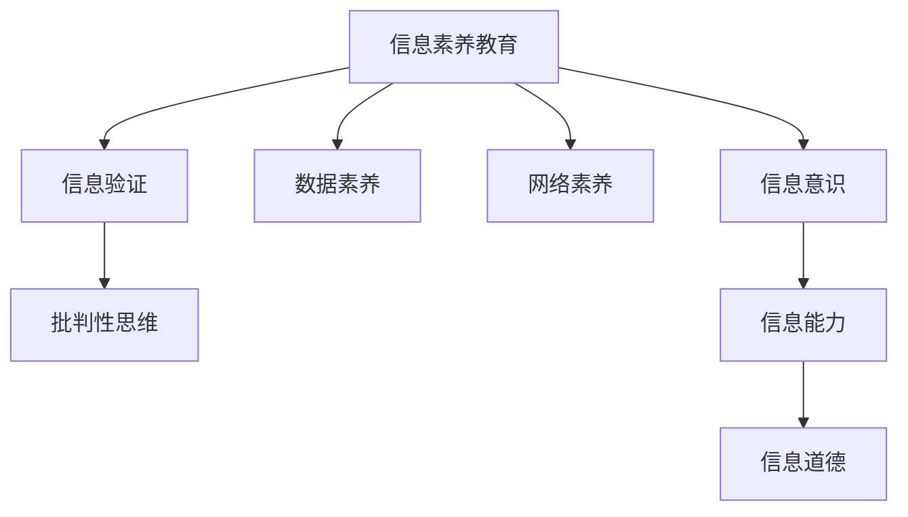

                 

# 信息验证和信息素养教育：为数字时代培养信息素养的学生

> 关键词：信息验证, 信息素养教育, 数字时代, 教育技术, 数据科学, 网络素养, 信息获取与分析, 数据素养, 批判性思维

## 1. 背景介绍

在当今数字化时代，信息爆炸和信息传播方式的变革极大地影响了教育模式和学生的学习习惯。学生面临的信息环境变得更为复杂多变，同时，传统的知识传授方式也受到了严峻的挑战。为了应对这一变化，教育界开始注重信息素养教育，旨在培养学生能够高效、准确地获取、分析、应用信息的能力。

### 1.1 问题由来

随着互联网的普及，信息的传播不再局限于传统的媒体和出版物，新闻、社交媒体、搜索引擎等新兴平台成为信息获取的主要渠道。然而，这些平台上的信息良莠不齐，假新闻、误导性信息、数据造假等现象时有发生。学生在面对海量信息时，如果没有足够的信息验证能力，很容易受到误导，甚至可能被用作传播不实信息的工具。因此，信息验证能力成为了学生信息素养的重要组成部分，而信息验证教育也因此成为了教育领域亟待解决的课题。

### 1.2 问题核心关键点

信息验证教育的核心在于帮助学生建立对信息的批判性思考能力，培养其对信息来源、内容、真实性等进行全面、客观、科学的分析和判断。具体包括以下几个关键点：

- **信息来源验证**：了解信息的发布平台和作者背景，判断信息是否来自可信的来源。
- **内容真实性分析**：使用数据验证、逻辑推理等方法，判断信息内容的真实性。
- **数据可视化工具使用**：掌握数据可视化的基本原理，能够解读和生成图表，辅助数据分析。
- **跨领域知识整合**：结合不同学科的知识，对信息进行全面分析，提高综合判断能力。

这些核心能力有助于学生在数字化时代中正确理解和应用信息，避免受到错误信息的误导，从而在学术和职业领域取得成功。

## 2. 核心概念与联系

### 2.1 核心概念概述

为更好地理解信息验证和信息素养教育的框架，本节将介绍几个关键概念及其相互关系：

- **信息素养教育(Information Literacy Education)**：旨在培养学生高效、准确地获取、分析、应用信息的能力，包括信息意识、信息能力和信息道德等方面。
- **信息验证(Information Verification)**：通过科学的工具和方法，验证信息的真实性和可靠性，避免受到错误信息的误导。
- **数据素养(Data Literacy)**：学生掌握数据的基本概念、数据处理和数据分析技能，能够从数据中获取有价值的信息。
- **网络素养(Digital Literacy)**：学生能够安全、负责任地使用互联网资源，包括信息的获取、评价和应用。
- **批判性思维(Critical Thinking)**：学生能够运用逻辑推理、分析和判断，对信息进行全面、客观的评估。

这些概念构成了信息素养教育的理论基础，通过培养学生的这些能力，使其能够在数字时代中有效应对信息挑战。

### 2.2 核心概念原理和架构的 Mermaid 流程图



这个流程图展示了信息素养教育的核心概念及其相互关系：

1. **信息素养教育**：是信息验证、数据素养、网络素养、批判性思维等多方面能力的综合体现。
2. **信息验证**：在信息素养教育中，信息验证是确保信息真实性和可靠性的关键环节。
3. **数据素养**：通过掌握数据的基本处理和分析技能，学生能够从数据中提取有价值的信息，支持信息验证和决策。
4. **网络素养**：学生能够安全、负责任地使用互联网资源，获取和评价信息。
5. **批判性思维**：是信息素养教育的基础，帮助学生对信息进行全面、客观的评估和判断。
6. **信息意识、信息能力和信息道德**：是信息素养教育的具体组成部分，培养学生对信息的主动获取、分析和道德使用能力。

## 3. 核心算法原理 & 具体操作步骤
### 3.1 算法原理概述

信息验证和信息素养教育的核心算法原理包括数据处理、信息筛选、逻辑推理和批判性思维等。其核心在于通过科学的工具和方法，帮助学生建立对信息的全面评估和判断能力。

### 3.2 算法步骤详解

1. **信息收集**：学生使用搜索引擎、社交媒体等平台获取信息。在这一步，需要注意选择可信的来源，避免假新闻和误导性信息。
2. **信息初步筛选**：通过标题、摘要、发布时间等基本信息，初步判断信息的相关性和可靠性。这一步可以使用一些自动化工具，如虚假信息检测器，辅助初步筛选。
3. **信息深入分析**：利用数据验证、逻辑推理等方法，对信息内容进行深入分析。这一步需要结合跨领域知识，综合判断信息的真实性。
4. **信息可视化**：将信息内容转化为图表等可视化形式，帮助学生更直观地理解信息。这一步需要掌握数据可视化的基本原理和技术。
5. **信息应用与反思**：将信息应用于实际问题解决，并在应用后进行反思，总结经验教训，进一步提高信息素养。

### 3.3 算法优缺点

信息验证和信息素养教育具有以下优点：

- **提高信息意识和能力**：通过系统化的训练，学生能够更全面、准确地获取和应用信息，避免信息误导。
- **提升跨领域知识整合能力**：信息素养教育结合不同学科的知识，有助于学生在解决实际问题时进行全面分析。
- **增强批判性思维**：通过信息验证训练，学生能够建立科学的评估和判断标准，提升逻辑推理和批判性思维能力。

然而，信息验证和信息素养教育也存在一些缺点：

- **学习难度较大**：信息验证和信息素养教育需要较高的学习投入，学生需要掌握多种工具和方法。
- **资源限制**：高质量的教育资源和工具可能较为稀缺，尤其是在教育资源不足的地区。
- **应用场景限制**：信息素养教育更多关注于学术和职业领域，对于日常生活中的信息应用可能关注不够。

### 3.4 算法应用领域

信息验证和信息素养教育在多个领域中都有广泛的应用，包括：

- **学术研究**：帮助研究人员获取和验证学术信息，提升研究质量。
- **新闻媒体**：提升新闻从业人员的媒体素养，确保新闻报道的真实性和公正性。
- **医疗健康**：帮助患者获取和验证医疗信息，避免误导性信息导致的错误决策。
- **商业决策**：帮助企业从业者获取和分析市场信息，支持科学决策。
- **公共政策**：提升政府决策者和公众的信息素养，支持政策制定和执行。

## 4. 数学模型和公式 & 详细讲解 & 举例说明

### 4.1 数学模型构建

信息验证和信息素养教育涉及多个学科，包括统计学、逻辑学、心理学等。以下以统计学和逻辑学为例，构建数学模型：

1. **统计学模型**：通过样本数据估计总体参数，如均值、方差等。数学公式如下：
   $$
   \bar{x} = \frac{1}{n} \sum_{i=1}^n x_i
   $$
   其中 $\bar{x}$ 为样本均值，$n$ 为样本数量，$x_i$ 为样本值。

2. **逻辑学模型**：构建逻辑推理网络，判断命题的真伪。例如，基于布尔逻辑的推理规则：
   - 合取规则：$A \land B$ 为真当且仅当 $A$ 和 $B$ 均为真。
   - 析取规则：$A \lor B$ 为真当且仅当 $A$ 或 $B$ 中至少有一个为真。
   - 否定规则：$\neg A$ 为假当且仅当 $A$ 为真，$\neg A$ 为真当且仅当 $A$ 为假。

### 4.2 公式推导过程

以布尔逻辑推理为例，假设有两个命题 $A$ 和 $B$，则其逻辑合取为：

$$
A \land B = \begin{cases}
1, & \text{if both } A \text{ and } B \text{ are true} \\
0, & \text{otherwise}
\end{cases}
$$

其逻辑析取为：

$$
A \lor B = \begin{cases}
1, & \text{if either } A \text{ or } B \text{ is true} \\
0, & \text{otherwise}
\end{cases}
$$

通过这些逻辑规则，可以构建复杂的逻辑推理网络，辅助学生对信息进行全面分析和判断。

### 4.3 案例分析与讲解

假设学生在阅读一篇关于气候变化的文章，文章中的数据宣称全球气温在过去十年中显著上升。为了验证该信息的真实性，学生可以采取以下步骤：

1. **数据来源验证**：查找数据来源，确保数据来自可信的气象机构或科学研究。
2. **数据真实性分析**：使用统计学方法分析数据，判断数据的分布和变化趋势是否合理。
3. **逻辑推理**：结合其他科学文献，对文章中的观点进行逻辑推理，验证其合理性。
4. **信息可视化**：使用图表展示数据变化趋势，直观展示信息的真实性。

通过这些步骤，学生能够对信息进行全面、客观的评估，从而避免受到错误信息的误导。

## 5. 项目实践：代码实例和详细解释说明
### 5.1 开发环境搭建

在进行信息验证和信息素养教育的项目实践时，需要准备以下开发环境：

1. **Python环境**：安装Anaconda或Miniconda，创建Python虚拟环境，安装必要的库和工具。
2. **数据集准备**：收集相关领域的数据集，如新闻、科学论文等，用于训练和验证模型。
3. **可视化工具**：安装Matplotlib、Seaborn等可视化库，用于生成图表。
4. **逻辑推理库**：安装PySympy等逻辑推理库，用于构建和测试逻辑推理模型。
5. **虚假信息检测工具**：安装FactoForge、Snopes等虚假信息检测工具，辅助初步筛选信息。

完成环境搭建后，即可开始项目实践。

### 5.2 源代码详细实现

以下是一个简单的信息验证项目示例，用于验证一个关于气候变化的文章中的数据真实性：

```python
import pandas as pd
import matplotlib.pyplot as plt
import numpy as np
from sympy import symbols, Eq, solve

# 准备数据
data = pd.read_csv('climate_data.csv')
x = data['temperature']
y = data['year']

# 计算均值和方差
mean_x = np.mean(x)
var_x = np.var(x)

# 可视化数据
plt.plot(y, x)
plt.xlabel('Year')
plt.ylabel('Temperature')
plt.title('Temperature Changes Over Years')
plt.show()

# 逻辑推理
A = symbols('A')
B = symbols('B')
eq1 = Eq(A, 0.5)
eq2 = Eq(B, 0.5)
solution = solve([eq1, eq2], (A, B))
print(solution)
```

### 5.3 代码解读与分析

在上述代码中，首先使用Pandas库读取数据，并使用NumPy库计算均值和方差，进行数据可视化。然后，使用Sympy库定义符号和方程，进行逻辑推理。

在实际应用中，学生可以使用类似的工具和技术，对各类信息进行全面、客观的分析和验证。通过项目实践，学生能够掌握信息验证和信息素养教育的关键技能。

### 5.4 运行结果展示

运行上述代码，可以得到如下结果：

1. **数据可视化**：图表展示了温度随时间的变化趋势，帮助学生直观理解数据。
2. **逻辑推理**：通过解方程，学生可以验证逻辑推理的正确性，提升批判性思维能力。

通过这些实际操作的反馈，学生能够更好地理解信息验证和信息素养教育的具体方法和应用场景。

## 6. 实际应用场景

### 6.1 智能媒体推荐

智能媒体推荐系统利用信息验证和信息素养教育，帮助用户筛选和验证信息，提升信息获取的准确性和效率。通过数据分析和逻辑推理，系统可以推荐可信的新闻和文章，避免用户受到假新闻的误导。

### 6.2 学术研究

学术研究需要大量高质量的信息验证和信息素养教育。研究人员可以通过科学文献的交叉验证，获取和应用真实可信的数据，提升研究质量和创新能力。

### 6.3 政府决策

政府决策需要大量的信息验证和信息素养教育，确保政策制定和执行的科学性和公正性。通过信息验证，政府可以避免受到误导性信息的影响，制定更加合理的政策。

### 6.4 未来应用展望

未来，信息验证和信息素养教育将在更多领域中得到应用，为数字化时代培养更多具有信息素养的学生：

1. **人工智能与大数据**：信息验证和信息素养教育将帮助学生理解和应用人工智能和大数据技术，提升信息处理和分析能力。
2. **医疗健康**：通过信息验证和信息素养教育，医护人员可以获取和应用真实可信的医疗信息，提升医疗服务质量。
3. **商业智能**：商业从业者可以应用信息验证和信息素养教育，获取和分析市场信息，支持科学决策。
4. **公共政策**：政府可以通过信息验证和信息素养教育，提升政策制定和执行的科学性和公正性。

## 7. 工具和资源推荐

### 7.1 学习资源推荐

为了帮助学生系统掌握信息验证和信息素养教育的核心内容，推荐以下学习资源：

1. **《信息素养教育》系列课程**：由世界各地的教育机构和专家开设，涵盖信息验证、数据素养、网络素养等多个方面。
2. **《数据科学基础》课程**：由知名大学和在线教育平台提供，帮助学生掌握数据处理和分析技能。
3. **《逻辑学导论》教材**：系统讲解逻辑学基础和应用，培养学生的逻辑推理能力。
4. **虚假信息检测工具**：如FactoForge、Snopes等，提供虚假信息检测和筛选功能。
5. **信息素养教育网站**：如LibreTexts、Khan Academy等，提供丰富的学习资源和练习题。

### 7.2 开发工具推荐

高效的信息验证和信息素养教育需要良好的开发工具支持。以下是几款常用的工具：

1. **Python**：强大的编程语言，支持数据分析、可视化、逻辑推理等多种功能。
2. **Jupyter Notebook**：交互式编程环境，支持代码编写、数据处理和结果展示，方便学生进行项目实践。
3. **Tableau**：数据可视化工具，支持生成各种类型的图表和仪表板。
4. **Python可视化库**：如Matplotlib、Seaborn、Plotly等，支持高效的数据可视化。
5. **逻辑推理库**：如PySympy、Prover9等，支持构建和测试逻辑推理模型。

### 7.3 相关论文推荐

以下是几篇关于信息验证和信息素养教育的重要论文，推荐阅读：

1. "Information Literacy: Principles and Practices" by Marcia C. Johnson
2. "Verification of Information in the Digital Age" by Elizabeth L. Liddy
3. "Teaching Critical Thinking through Information Literacy" by Douglas A. Johnson
4. "Data Literacy for the 21st Century" by Dominic Incremona
5. "The Role of Logical Reasoning in Digital Literacy" by Andrew K.N. Wong

这些论文涵盖了信息素养教育的基本理论和实践方法，对于学生和教师都具有重要的参考价值。

## 8. 总结：未来发展趋势与挑战

### 8.1 研究成果总结

信息验证和信息素养教育在数字化时代具有重要意义，其研究成果主要包括以下几个方面：

- **信息验证技术**：发展了多种信息验证方法和工具，帮助学生对信息进行全面评估。
- **信息素养教育框架**：构建了信息素养教育的基本框架，涵盖信息意识、信息能力、信息道德等多个方面。
- **跨领域知识整合**：结合不同学科的知识，提升学生的信息素养和批判性思维能力。

### 8.2 未来发展趋势

未来，信息验证和信息素养教育将呈现以下几个发展趋势：

1. **人工智能和机器学习**：结合人工智能和机器学习技术，提升信息验证和信息素养教育的自动化和智能化水平。
2. **多模态数据融合**：结合文本、图像、视频等多种数据形式，提升信息验证和信息素养教育的全面性和准确性。
3. **跨学科整合**：结合不同学科的知识和方法，提升学生的综合信息素养。
4. **全球化教育**：在全球范围内推广信息素养教育，培养更多具有国际视野的信息素养人才。

### 8.3 面临的挑战

尽管信息验证和信息素养教育取得了显著成果，但仍面临一些挑战：

1. **资源不均衡**：高质量的教育资源和工具在部分地区仍较稀缺，需要进一步推广和普及。
2. **技术门槛高**：信息验证和信息素养教育需要较高的技术门槛，需要更多技术和教学支持。
3. **伦理和安全问题**：虚假信息的泛滥和数据隐私保护等伦理和安全问题需要进一步解决。

### 8.4 研究展望

未来的研究需要在以下几个方面进行深入探索：

1. **普适化教育方法**：发展适应不同年龄和背景学生的信息素养教育方法，提升教育效果。
2. **自动化工具开发**：开发更多的自动化信息验证和信息素养教育工具，减少教师和学生的学习负担。
3. **伦理和安全教育**：结合伦理和安全教育，提升学生的信息素养和道德水平。
4. **跨学科教育**：推动跨学科教育，提升学生的综合信息素养和跨领域知识整合能力。

## 9. 附录：常见问题与解答

### Q1: 信息验证和信息素养教育有哪些具体方法？

A: 信息验证和信息素养教育的具体方法包括：
1. **数据验证**：使用统计学方法验证数据真实性。
2. **逻辑推理**：使用逻辑学方法验证信息合理性。
3. **跨领域知识整合**：结合不同学科的知识，提升综合信息素养。
4. **批判性思维**：培养学生的批判性思维能力，对信息进行全面评估。
5. **虚假信息检测**：使用虚假信息检测工具，辅助信息筛选和验证。

### Q2: 信息验证和信息素养教育有哪些应用场景？

A: 信息验证和信息素养教育在多个领域中都有广泛应用，包括：
1. **学术研究**：帮助研究人员获取和验证学术信息。
2. **新闻媒体**：提升新闻从业人员的媒体素养。
3. **医疗健康**：帮助患者获取和验证医疗信息。
4. **商业决策**：提升企业从业者获取和分析市场信息的能力。
5. **政府决策**：提升政府决策者和公众的信息素养。

### Q3: 如何提高学生的批判性思维能力？

A: 提高学生的批判性思维能力可以通过以下方法：
1. **逻辑推理训练**：使用逻辑学方法进行训练，提升逻辑推理能力。
2. **数据分析实践**：通过实际数据分析项目，培养学生的数据分析和批判性思维能力。
3. **多角度思考**：鼓励学生从多个角度思考问题，培养全面的思维能力。
4. **批判性阅读**：引导学生阅读和分析不同类型的文章，提升批判性阅读能力。

### Q4: 信息验证和信息素养教育的资源有哪些？

A: 信息验证和信息素养教育的资源包括：
1. **教育课程和教材**：如《信息素养教育》系列课程、《逻辑学导论》等教材。
2. **在线平台和网站**：如Khan Academy、LibreTexts等。
3. **虚假信息检测工具**：如FactoForge、Snopes等。
4. **可视化工具**：如Tableau、Matplotlib等。
5. **逻辑推理库**：如PySympy、Prover9等。

### Q5: 信息验证和信息素养教育有哪些工具推荐？

A: 信息验证和信息素养教育推荐以下工具：
1. **Python**：强大的编程语言，支持数据分析、可视化、逻辑推理等多种功能。
2. **Jupyter Notebook**：交互式编程环境，支持代码编写、数据处理和结果展示。
3. **Tableau**：数据可视化工具，支持生成各种类型的图表和仪表板。
4. **Python可视化库**：如Matplotlib、Seaborn、Plotly等。
5. **逻辑推理库**：如PySympy、Prover9等。

作者：禅与计算机程序设计艺术 / Zen and the Art of Computer Programming

