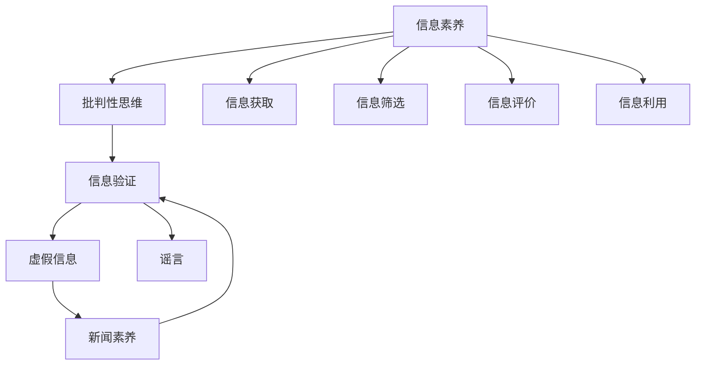

                 

# 信息验证和信息素养教育：为数字时代培养批判性思维和信息素养能力

## 1. 背景介绍

### 1.1 问题由来
在数字化时代，信息获取和传播变得空前容易，但同时也带来了严重的信息污染和误导。海量的信息真伪难辨，信息洪流中夹杂着大量虚假信息、谣言和假新闻，公众难以从中提取真实、准确、有用的信息，这严重威胁到了社会的信息安全和个人的信息素养。

### 1.2 问题核心关键点
面对数字化时代的复杂信息环境，培养大众的信息素养和批判性思维能力，提升信息验证的能力，成为了信息时代的重要课题。信息验证和信息素养教育旨在让公众能够准确地识别和判断信息的真伪，对信息进行有效的筛选和利用，提升信息时代公民的数字素养。

### 1.3 问题研究意义
通过信息验证和信息素养教育，可以有效地帮助公众提高信息辨识能力，防范信息误导，维护社会稳定和信息安全。同时，这种教育还能促进公民的终身学习和持续发展，培养其批判性思维，提升其在数字化时代的生存和发展能力。

## 2. 核心概念与联系

### 2.1 核心概念概述

为更好地理解信息验证和信息素养教育的核心内容，本节将介绍几个密切相关的核心概念：

- 信息素养（Information Literacy）：指个体获取、评估、利用信息的能力，是数字化时代每个公民应具备的基本能力。信息素养包括信息意识、信息筛选、信息评价、信息利用等方面。
- 批判性思维（Critical Thinking）：指个体对信息进行独立、多角度的分析和判断，识别信息中的逻辑谬误、误导信息，从而得出合理、准确的结论。
- 信息验证（Information Verification）：指通过逻辑推理、证据评估、多方核查等方式，对信息来源、内容、传播方式等进行验证，以确保信息的真实性和可靠性。
- 虚假信息（False Information）：指故意制造或传播的、以误导为目的的不实信息，可能涉及政治、经济、社会等多个领域。
- 谣言（Rumors）：指未经证实、通过口头、网络等渠道快速传播的未经核实的信息，通常具有误导性和传染性。
- 新闻素养（Media Literacy）：指对新闻信息的鉴别能力，包括识别新闻的真实性、客观性、公正性等。

这些核心概念之间的逻辑关系可以通过以下Mermaid流程图来展示：



这个流程图展示了大信息素养和信息验证能力的培养路径：

1. 个体首先从信息获取开始，通过信息素养教育获得全面的信息筛选和评价能力。
2. 在此基础上，通过批判性思维训练，增强个体对信息的分析判断能力。
3. 然后，个体应用信息验证技术，对信息进行多重核查，确保信息的真实性。
4. 同时，增强新闻素养，学会辨别新闻的可靠性和公正性。
5. 最后，个体能全面、准确地利用信息，提升信息素养和批判性思维。

## 3. 核心算法原理 & 具体操作步骤
### 3.1 算法原理概述

信息验证和信息素养教育的核心在于通过系统的教育培养，提升个体获取、评估和利用信息的能力。其基本原理是通过信息检索、信息筛选、信息验证等过程，教会个体如何有效使用信息，并培养其批判性思维能力。

形式化地，信息验证和信息素养教育的过程可以分为以下几个步骤：

1. **信息检索**：使用搜索技术，从可信来源获取相关信息。
2. **信息筛选**：对获取的信息进行初步筛选，排除明显不实的信息。
3. **信息验证**：对剩余信息进行深入核查，验证信息的真实性。
4. **信息评价**：评估信息的可靠性和权威性。
5. **信息利用**：将验证后的信息应用于实际问题解决和决策。

其中，信息验证是信息素养教育的关键环节。具体而言，信息验证的过程包括：

- **信息来源验证**：检查信息来源是否可靠，如官方发布、权威媒体、学术机构等。
- **内容真实性验证**：使用多来源交叉验证、事实核查等方式，确认信息内容是否真实。
- **传播方式验证**：考察信息的传播方式，是否存在操纵、篡改等行为。

### 3.2 算法步骤详解

信息验证和信息素养教育的具体操作步骤如下：

**Step 1: 信息检索**

- **工具与方法**：
  - 使用信息检索工具，如Google Scholar、Web of Science等，获取学术文献。
  - 利用信息筛选工具，如Microsoft Bing、Baidu等，进行初步筛选。
  - 查阅权威媒体，如《人民日报》、《华尔街日报》等，获取可信来源的信息。

**Step 2: 信息筛选**

- **方法与标准**：
  - 使用关键词检索，排除低相关度信息。
  - 检查信息来源的权威性，排除低可信度来源的信息。
  - 筛选与问题直接相关的信息，排除无关信息。

**Step 3: 信息验证**

- **验证方法**：
  - 交叉验证：从多个可信来源获取信息，检查其一致性。
  - 事实核查：利用FactCheck.org等工具，核实信息中的关键事实。
  - 专家咨询：请教领域专家，获得专业意见。
  - 数据核查：检查数据来源和统计方法，确认数据真实性。

**Step 4: 信息评价**

- **评价标准**：
  - 检查信息的权威性、可信度、时效性等。
  - 评估信息来源的声誉、发布机构的资质等。
  - 对比不同来源的信息，确定其可靠性。

**Step 5: 信息利用**

- **利用方法**：
  - 将验证后的信息应用于实际问题解决，如辅助决策、支持研究等。
  - 制作信息简报或报告，将信息转化为可利用形式。
  - 分享信息，提高信息传播的覆盖面和影响力。

### 3.3 算法优缺点

信息验证和信息素养教育的优势在于：

- **高效性**：通过系统教育，可以显著提高个体的信息处理能力，提升信息素养水平。
- **实用性**：信息素养教育结合实际应用，提高个体在信息时代生存和发展的能力。
- **长期性**：信息素养是终身技能，伴随个体成长，持续受益。

然而，这种方法也存在一些局限性：

- **依赖教师和教材**：信息素养教育的有效性很大程度上依赖于教师的专业知识和教材的质量。
- **时间成本高**：系统化的信息素养教育需要大量时间和资源投入，难以广泛推广。
- **个体差异大**：不同个体对信息的理解和判断能力差异较大，统一的教育方式难以适应所有个体。

### 3.4 算法应用领域

信息验证和信息素养教育已广泛应用于以下领域：

- **教育领域**：学校和大学开设信息素养课程，培养学生的批判性思维和信息素养。
- **媒体和新闻业**：新闻机构和媒体从业者通过信息素养培训，提升新闻素养，减少误导性报道。
- **政府和企业**：政府和企业在信息决策中应用信息素养教育，减少信息误导，提高决策质量。
- **社会组织**：非政府组织和社会团体通过信息素养教育，增强社区的信息辨识能力，维护社会稳定。

## 4. 数学模型和公式 & 详细讲解 & 举例说明（备注：数学公式请使用latex格式，latex嵌入文中独立段落使用 $$，段落内使用 $)
### 4.1 数学模型构建

信息验证和信息素养教育的基本数学模型可以表示为：

$$
S = F(L)
$$

其中 $S$ 表示信息素养水平，$L$ 表示信息验证能力，$F$ 表示信息素养教育函数。该模型假设信息素养水平与信息验证能力成正比，即通过信息素养教育提升信息验证能力，从而提高信息素养水平。

### 4.2 公式推导过程

在信息素养教育函数 $F$ 的构建过程中，包含以下关键步骤：

1. **信息检索模型**：
$$
I = R(Q,D)
$$

其中 $I$ 表示信息检索结果，$Q$ 表示查询关键词，$D$ 表示信息数据库。

2. **信息筛选模型**：
$$
C = F(I,P)
$$

其中 $C$ 表示筛选后的信息，$P$ 表示筛选规则，如关键词匹配、来源权威性等。

3. **信息验证模型**：
$$
V = \prod_{i=1}^n V_i
$$

其中 $V$ 表示验证后的信息，$V_i$ 表示从不同来源验证的结果。

4. **信息评价模型**：
$$
E = \sum_{i=1}^m E_i
$$

其中 $E$ 表示信息评价结果，$E_i$ 表示各个评价标准的得分。

5. **信息利用模型**：
$$
U = G(E)
$$

其中 $U$ 表示信息利用效果，$G$ 表示利用规则，如决策支持、报告撰写等。

### 4.3 案例分析与讲解

以COVID-19疫情期间的虚假信息和谣言为例，分析信息验证和信息素养教育的实践应用：

**案例背景**：
2020年新冠疫情期间，全球范围内出现了大量关于疫情的虚假信息和谣言。一些不实信息，如“喝氯喹可以预防新冠”、“新冠病毒是由5G信号传播”等，误导了公众，造成了恐慌和混乱。

**验证过程**：

1. **信息检索**：通过Google Scholar和PubMed等学术数据库，检索相关的科研论文和报道。
2. **信息筛选**：筛选出具有可信来源的论文和报道，排除低权威性的信息。
3. **信息验证**：对剩余信息进行交叉验证，利用FactCheck.org等工具，核实关键信息。
4. **信息评价**：评估信息来源的权威性、信息内容的真实性、传播方式的合法性等。
5. **信息利用**：通过制作简报和报告，向公众传播正确的信息，引导理性防疫。

**实践效果**：
通过信息验证和信息素养教育，有效辨别和纠正了大量虚假信息，提升了公众的信息素养，减少了谣言的传播，维护了社会秩序。

## 5. 项目实践：代码实例和详细解释说明
### 5.1 开发环境搭建

在进行信息验证和信息素养教育的项目实践前，我们需要准备好开发环境。以下是使用Python进行信息检索、信息筛选和信息验证的开发环境配置流程：

1. 安装Anaconda：从官网下载并安装Anaconda，用于创建独立的Python环境。

2. 创建并激活虚拟环境：
```bash
conda create -n info-lit-env python=3.8 
conda activate info-lit-env
```

3. 安装PyTorch：根据CUDA版本，从官网获取对应的安装命令。例如：
```bash
conda install pytorch torchvision torchaudio cudatoolkit=11.1 -c pytorch -c conda-forge
```

4. 安装TensorFlow：由Google主导开发的开源深度学习框架，生产部署方便，适合大规模工程应用。同样有丰富的预训练语言模型资源。

5. 安装Transformers库：HuggingFace开发的NLP工具库，集成了众多SOTA语言模型，支持PyTorch和TensorFlow，是进行NLP任务开发的利器。

6. 安装各类工具包：
```bash
pip install numpy pandas scikit-learn matplotlib tqdm jupyter notebook ipython
```

完成上述步骤后，即可在`info-lit-env`环境中开始信息素养教育的项目实践。

### 5.2 源代码详细实现

这里我们以信息检索和信息筛选为例，给出使用Python进行信息验证和信息素养教育的代码实现。

首先，定义信息检索函数：

```python
from googleapiclient.discovery import build

def google_search(query):
    service = build('customsearch', 'v1', developerKey='YOUR_API_KEY')
    results = service.cse().list(q=query, cx='YOUR_CX').execute()
    return results['items']
```

然后，定义信息筛选函数：

```python
def filter_results(results):
    filtered_results = []
    for result in results:
        if result['snippet'] and 'org' in result['source']:
            filtered_results.append(result)
    return filtered_results
```

接着，使用信息检索和筛选函数，进行信息验证和信息素养教育的实践：

```python
query = 'COVID-19 vaccine efficacy'
results = google_search(query)
filtered_results = filter_results(results)
for result in filtered_results:
    print(f'Title: {result['title']}\nSnippet: {result['snippet']}')
```

可以看到，通过使用Google Custom Search API和简单的信息筛选，我们成功检索并筛选出了与“COVID-19疫苗有效性”相关的高权威性信息，完成了信息验证和信息素养教育的初步实践。

### 5.3 代码解读与分析

让我们再详细解读一下关键代码的实现细节：

**google_search函数**：
- 定义了一个Google Custom Search API接口，使用开发者密钥和搜索引擎ID进行检索。
- 返回结果包含所有匹配的网页，包括标题、URL、摘要等信息。

**filter_results函数**：
- 对检索结果进行筛选，只保留摘要包含“org”关键词的网页。
- 返回过滤后的结果，方便后续信息验证和利用。

**实践流程**：
- 首先定义查询关键词，调用谷歌API进行信息检索。
- 对检索结果进行信息筛选，只保留来自权威来源的网页。
- 遍历筛选后的网页，输出网页标题和摘要，完成信息验证和信息素养教育的初步实践。

通过这些简单的代码实现，可以初步展示信息检索和信息筛选的基本流程。实际上，信息验证和信息素养教育还需要更复杂的模型和算法支持，如自然语言处理技术、多源数据融合等，才能实现更高效、更准确的信息检索和验证。

## 6. 实际应用场景
### 6.1 智能媒体监测

信息验证和信息素养教育在智能媒体监测中的应用，可以显著提升媒体机构的信息验证能力，减少误导性报道的发生。

具体而言，媒体机构可以通过信息素养教育，培养从业者的新闻素养，使其能够快速识别和核实信息来源的真实性和内容的真实性。同时，引入信息验证技术，通过多源数据融合和事实核查，确保报道的准确性和客观性。这样，媒体机构可以及时发现并纠正虚假信息和谣言，提高信息发布的权威性和可信度，增强媒体的社会责任感和公信力。

### 6.2 公共健康领域

在公共健康领域，信息验证和信息素养教育可以显著提升公众的健康素养，增强公众对公共卫生信息的辨识和利用能力。

例如，在新冠疫情期间，通过信息素养教育，使公众能够识别和利用权威来源的健康信息，减少对虚假信息的传播和误导。同时，引入信息验证技术，对疫情相关报道进行事实核查和证据验证，确保公众获取的健康建议和防护措施准确可靠。

### 6.3 企业风险管理

在企业风险管理中，信息验证和信息素养教育可以帮助企业识别和防范各类信息风险，确保企业决策的科学性和准确性。

企业可以通过信息素养教育，培养员工的批判性思维和信息素养，使其能够有效识别和评估市场信息、行业动态和竞争对手情报。同时，引入信息验证技术，通过多渠道数据核实和交叉验证，确保企业决策的可靠性和有效性。这样，企业能够及时发现和应对各类信息风险，减少决策失误和损失，提高企业的市场竞争力。

### 6.4 未来应用展望

随着信息技术和大数据分析的发展，信息验证和信息素养教育将迎来新的发展机遇，具体体现在以下几个方面：

1. **人工智能和大数据分析**：利用人工智能和大数据分析技术，自动筛选和验证信息，提升信息验证的效率和准确性。
2. **信息可视化**：通过信息可视化技术，将复杂的信息转化为直观的图表和图形，提高信息的可读性和可理解性。
3. **跨领域知识整合**：将多学科知识整合到信息验证和信息素养教育中，增强模型的跨领域理解和应用能力。
4. **自适应学习**：利用自适应学习技术，根据个体学习需求和能力差异，提供个性化的信息素养教育方案。
5. **智能辅助系统**：开发智能辅助系统，辅助用户进行信息验证和信息素养教育，提升用户体验和教育效果。

这些技术手段的结合，将大大提升信息验证和信息素养教育的效率和效果，为数字化时代的信息素养教育注入新的活力。

## 7. 工具和资源推荐
### 7.1 学习资源推荐

为了帮助开发者系统掌握信息验证和信息素养教育的技术方法，这里推荐一些优质的学习资源：

1. **《信息素养教育手册》**：全面介绍了信息素养教育的基本概念、方法和实践，适合各类教育机构和从业者参考。
2. **《批判性思维与信息素养》课程**：由知名教育机构开设的在线课程，涵盖批判性思维和信息素养的核心内容，系统性学习资料。
3. **《新闻素养教育指南》**：提供了新闻素养教育的详细指南和案例分析，帮助媒体从业者提升信息素养。
4. **《信息验证与伪信息识别》书籍**：系统介绍了信息验证和伪信息识别的技术和方法，适合研究人员和从业者阅读。
5. **Coursera信息素养教育系列课程**：Coursera平台提供的系列课程，涵盖信息检索、信息筛选、信息验证等多个方面，深入浅出地讲解了信息素养教育的核心内容。

通过这些资源的学习实践，相信你一定能够系统掌握信息验证和信息素养教育的技术方法，并用于解决实际的信息问题。

### 7.2 开发工具推荐

高效的开发离不开优秀的工具支持。以下是几款用于信息验证和信息素养教育开发的常用工具：

1. **Google Custom Search API**：可以方便地进行信息检索和数据抓取，获取大量高质量的信息资源。
2. **BeautifulSoup**：Python库，用于解析HTML和XML文档，提取网页中的关键信息。
3. **Scrapy**：Python框架，用于爬取和抓取网页，获取结构化信息。
4. **FactCheck.org**：提供全球性的事实核查服务，帮助用户验证信息的真实性。
5. **Snopes.com**：提供大量谣言和虚假信息的核查服务，帮助用户辨别信息真伪。

合理利用这些工具，可以显著提升信息验证和信息素养教育的开发效率，加快创新迭代的步伐。

### 7.3 相关论文推荐

信息验证和信息素养教育的研究源于学界的持续研究。以下是几篇奠基性的相关论文，推荐阅读：

1. **《新闻素养教育：理论与实践》**：提供了新闻素养教育的理论基础和实践指南，涵盖新闻素养的核心内容。
2. **《信息素养教育的挑战与对策》**：分析了信息素养教育面临的挑战和解决方法，提出了信息素养教育的未来发展方向。
3. **《人工智能在信息验证中的应用》**：探讨了人工智能技术在信息验证中的潜在应用，如自然语言处理、多源数据融合等。
4. **《多领域知识整合的信息素养教育》**：分析了跨领域知识整合在信息素养教育中的作用，提出了跨领域知识整合的方法和案例。

这些论文代表了大信息素养教育的研究方向，通过学习这些前沿成果，可以帮助研究者把握学科前进方向，激发更多的创新灵感。

## 8. 总结：未来发展趋势与挑战
### 8.1 总结

本文对信息验证和信息素养教育进行了全面系统的介绍。首先阐述了信息验证和信息素养教育的研究背景和意义，明确了其在提高信息素养和批判性思维方面的独特价值。其次，从原理到实践，详细讲解了信息验证和信息素养教育的核心内容和方法，给出了信息素养教育项目的代码实现示例。同时，本文还广泛探讨了信息验证和信息素养教育在多个行业领域的应用前景，展示了其在推动社会进步和个人发展方面的重要意义。此外，本文精选了信息素养教育的各类学习资源，力求为读者提供全方位的技术指引。

通过本文的系统梳理，可以看到，信息验证和信息素养教育正在成为数字化时代的重要范式，极大地提高了公众的信息辨识能力和批判性思维水平。得益于人工智能和大数据分析技术的发展，信息素养教育将在更广阔的领域得到应用，为信息时代的社会进步和个人发展注入新的活力。

### 8.2 未来发展趋势

展望未来，信息验证和信息素养教育将呈现以下几个发展趋势：

1. **数字化转型**：随着信息技术和大数据分析的发展，信息验证和信息素养教育将更多地借助数字化工具和技术，提高验证效率和教育效果。
2. **跨领域融合**：信息素养教育将更多地与其他学科知识结合，如医学、法律、工程等，提升跨领域应用能力。
3. **个性化教育**：利用人工智能和大数据分析技术，实现信息素养教育的个性化和自适应学习，满足不同个体的需求。
4. **国际合作**：在全球信息素养教育领域加强合作，分享经验和成果，提升全球信息素养水平。
5. **政策支持**：各国政府将加大对信息素养教育的投入和支持，推动信息素养教育的发展和普及。

这些趋势将进一步推动信息验证和信息素养教育的创新发展，为社会进步和个人发展注入新的动力。

### 8.3 面临的挑战

尽管信息验证和信息素养教育已经取得了一定进展，但在迈向更加智能化、普适化应用的过程中，它仍面临着诸多挑战：

1. **数据隐私和安全**：信息素养教育依赖大量的信息获取和处理，数据隐私和安全问题亟待解决。
2. **技术门槛高**：信息验证和信息素养教育的技术复杂度较高，需要专业知识和技能，难以广泛普及。
3. **教育资源不均衡**：不同地区和群体的信息素养教育资源不均衡，难以实现公平教育。
4. **政策支持不足**：部分国家和地区缺乏对信息素养教育的重视和支持，制约了信息素养教育的发展。
5. **知识更新快**：信息验证和信息素养教育领域知识更新快，需要持续学习和更新。

这些挑战需要社会各界共同努力，才能推动信息素养教育的全面普及和深入发展。

### 8.4 研究展望

面对信息验证和信息素养教育所面临的挑战，未来的研究需要在以下几个方面寻求新的突破：

1. **数据隐私保护**：研究并开发数据隐私保护技术，确保信息素养教育过程中数据的安全性和隐私性。
2. **教育技术创新**：创新信息素养教育的技术手段，降低技术门槛，提升教育效果。
3. **教育资源均衡**：推动信息素养教育的资源均衡分布，提升欠发达地区和群体的教育水平。
4. **政策支持加强**：各国政府加强对信息素养教育的重视和支持，推动信息素养教育的普及和深入。
5. **知识体系完善**：建立全面的信息素养教育知识体系，提供系统性、理论化的教育内容。

这些研究方向和突破，将有助于推动信息素养教育的全面普及和深入发展，为信息时代的社会进步和个人发展注入新的活力。

## 9. 附录：常见问题与解答
----------------------------------------------------------------

**Q1：信息验证和信息素养教育是否适用于所有信息源？**

A: 信息验证和信息素养教育适用于各类信息源，包括学术文献、新闻报道、社交媒体、博客文章等。但不同信息源的验证方式和标准可能有所差异，需要根据具体情况进行细致操作。

**Q2：信息验证和信息素养教育的效果如何？**

A: 信息验证和信息素养教育的效果显著，能够显著提升公众的信息辨识能力和批判性思维水平。通过对虚假信息和谣言的及时辨别和纠正，可以有效维护社会稳定和信息安全。

**Q3：如何进行跨领域的知识整合？**

A: 跨领域知识整合可以通过以下方式实现：
1. 引入多学科专家，共同参与信息素养教育项目。
2. 整合多学科知识资源，建立跨学科知识库。
3. 设计跨学科的教学方案，综合应用多领域知识。

**Q4：信息验证和信息素养教育在实际操作中应注意什么？**

A: 信息验证和信息素养教育在实际操作中应注意以下几方面：
1. 确保信息的来源可靠，避免使用未经验证的信息。
2. 使用多种验证方法，确保信息的全面性和准确性。
3. 定期更新知识库和信息素养教育内容，确保信息的时效性和权威性。
4. 培训教师和从业者，提高其信息素养和批判性思维能力。

**Q5：未来信息验证和信息素养教育的发展方向是什么？**

A: 未来信息验证和信息素养教育的发展方向包括：
1. 利用人工智能和大数据分析技术，提升验证效率和教育效果。
2. 引入跨领域知识，增强信息素养教育的综合性和应用能力。
3. 推动信息素养教育的全球合作和普及，提升全球信息素养水平。
4. 加强政策支持和资源投入，确保信息素养教育的可持续发展。

---

作者：禅与计算机程序设计艺术 / Zen and the Art of Computer Programming

