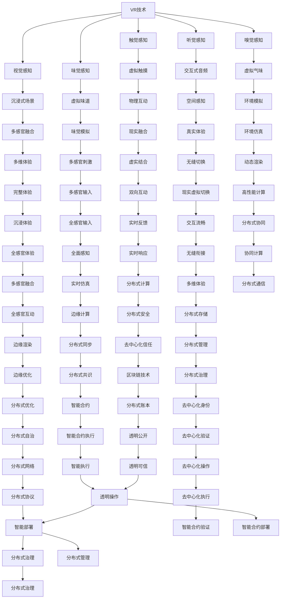

                 

# 元宇宙 (Metaverse)

> 关键词：元宇宙, 虚拟现实(VR), 增强现实(AR), 区块链, 分布式计算, 数字身份, 数字资产

## 1. 背景介绍

### 1.1 问题由来

随着虚拟现实技术(VR)、增强现实技术(AR)、区块链和分布式计算等新兴技术的迅猛发展，人类开始探索构建一种全新的数字化世界——元宇宙（Metaverse）。元宇宙是一个虚拟的、高度沉浸的世界，用户可以在其中进行社交、工作、购物、娱乐等各种活动，与现实世界紧密融合。

元宇宙的构想最早可追溯至科幻小说和电影，但近年来随着技术的进步，这一概念逐渐成为现实。例如，Facebook宣布转型为Meta公司，投入巨资开发元宇宙产品；沙盒游戏Roblox成功上市，市值一度突破千亿美元；微软、英伟达等科技巨头也在积极布局元宇宙领域。

### 1.2 问题核心关键点

构建元宇宙涉及的关键技术包括：

- **虚拟现实(VR)和增强现实(AR)**：提供沉浸式体验，使用户能够“进入”虚拟世界。
- **区块链技术**：保障数据的安全性、去中心化和可信任性，支持数字身份和数字资产的创建和交易。
- **分布式计算**：实现高性能的实时渲染和处理，确保元宇宙的高效运行。
- **数字身份和数字资产**：为元宇宙居民提供独一无二的用户体验和价值归属。

元宇宙的核心在于实现“数字孪生”，即在虚拟空间中重现现实世界的各种元素和交互方式。这要求技术上能够无缝衔接现实世界与虚拟世界，实现跨域数据的高效处理和传输。

### 1.3 问题研究意义

研究元宇宙技术，对于推动数字经济的发展、提升人类生活质量、加速各行各业数字化转型，具有重要意义：

- **经济增长**：元宇宙有望成为新的经济增长点，催生虚拟经济和数字消费。
- **社会互动**：元宇宙提供了全新的社交方式，促进全球化交流和文化多样性。
- **教育创新**：虚拟教室、虚拟实验、虚拟博物馆等，将丰富教育形式和内容。
- **生产方式变革**：通过虚拟和现实融合的协作模式，提升生产效率和创造力。
- **治理新模式**：通过分布式自治组织(DAO)等机制，探索数字时代的治理方式。

## 2. 核心概念与联系

### 2.1 核心概念概述

为更好地理解元宇宙的构建，本节将介绍几个核心概念及其相互关系：

- **虚拟现实(VR)**：通过模拟现实世界的视觉、听觉等感官体验，将用户带入一个高度沉浸的虚拟环境。
- **增强现实(AR)**：将虚拟信息叠加到现实世界，增强用户对现实世界的感知和互动。
- **数字身份(Digital Identity)**：用户通过区块链等技术，在元宇宙中获得独一无二的虚拟身份，进行身份验证、授权和交易。
- **数字资产(Digital Assets)**：元宇宙中的虚拟货币、NFT、虚拟物品等，提供价值存储和交易的基础。
- **分布式计算(Distributed Computing)**：通过边缘计算、云计算等技术，实现数据和计算资源的分布式协同处理，提升元宇宙的实时性和可扩展性。

这些概念之间通过网络、数据、计算等技术紧密联系，共同构建起元宇宙的基础架构。

### 2.2 核心概念原理和架构的 Mermaid 流程图(Mermaid 流程节点中不要有括号、逗号等特殊字符)



这个流程图展示了VR/AR技术、区块链、分布式计算等核心技术如何共同构建元宇宙，以及数字身份和数字资产如何在元宇宙中发挥作用。

## 3. 核心算法原理 & 具体操作步骤

### 3.1 算法原理概述

构建元宇宙涉及的核心算法包括：

- **虚拟现实算法**：包括空间渲染、光场模拟、传感器融合等，实现沉浸式虚拟环境的构建和渲染。
- **增强现实算法**：将虚拟信息与现实世界融合，实现空间定位、环境感知、物体交互等。
- **区块链算法**：包括共识算法、分布式账本、智能合约等，保障数据的安全性和可信性。
- **分布式算法**：包括边缘计算、云计算、P2P网络等，实现数据和计算资源的分布式协同处理。

这些算法通过相互配合，实现元宇宙的高效运行。

### 3.2 算法步骤详解

构建元宇宙的步骤主要包括以下几个方面：

**Step 1: 环境构建**
- 选择合适的VR/AR设备，构建虚拟和现实空间的环境。
- 收集现实世界的3D模型数据，用于虚拟环境的构建。

**Step 2: 数据处理与渲染**
- 对收集到的3D数据进行预处理，包括网格化、纹理贴图、光照计算等。
- 使用渲染引擎，对虚拟环境进行实时渲染，生成高质量的视觉效果。

**Step 3: 用户交互**
- 设计虚拟和现实的交互界面，使用户能够自然地进行操作。
- 实现空间定位、物体抓取、语音识别等交互技术。

**Step 4: 区块链应用**
- 设计数字身份和数字资产的创建和交易规则。
- 使用区块链技术，确保数据的安全性和去中心化。

**Step 5: 分布式计算**
- 使用边缘计算和云计算等技术，实现数据和计算资源的分布式协同处理。
- 优化渲染算法，提升元宇宙的实时性和可扩展性。

**Step 6: 应用开发**
- 开发元宇宙中的各种应用，如社交、购物、游戏等。
- 实现跨平台的兼容性和互操作性，提升用户体验。

### 3.3 算法优缺点

元宇宙的构建涉及多种技术，各具优缺点：

**优点**：
- **沉浸式体验**：通过VR/AR技术，提供高度沉浸的虚拟体验。
- **去中心化**：区块链技术保障数据的可信性和安全性。
- **分布式协同**：分布式计算提升系统的实时性和可扩展性。
- **经济价值**：数字身份和数字资产提供价值归属和交易基础。

**缺点**：
- **技术复杂**：涉及多种前沿技术，开发和维护成本较高。
- **安全挑战**：元宇宙中的数据和资产容易成为攻击目标，需要高度安全保障。
- **用户隐私**：元宇宙中的数据收集和使用，需要严格保护用户隐私。
- **内容审查**：元宇宙中的内容管理，需要有效防止不良信息的传播。

### 3.4 算法应用领域

元宇宙技术已经在游戏、社交、教育、房地产等多个领域开始应用，展示了其广阔的前景：

- **游戏行业**：Roblox、Fortnite、Horizon等元宇宙游戏，提供了全新的游戏体验和社交方式。
- **社交领域**：Metaverse、Decentraland等平台，支持用户进行虚拟社交和互动。
- **教育行业**：虚拟教室、虚拟实验室等，丰富了教育形式和内容。
- **房地产行业**：VR看房、虚拟房产交易等，提升了房地产市场的效率和体验。
- **商业领域**：虚拟商场、虚拟展会等，开启了新的商业模式。

此外，元宇宙技术在医疗、军事、工业等领域也有广泛的应用前景，未来发展潜力巨大。

## 4. 数学模型和公式 & 详细讲解  
### 4.1 数学模型构建

元宇宙中的数学模型主要包括以下几个方面：

- **几何建模**：通过数学模型表示虚拟世界的空间和物体，如三维坐标系、网格模型、纹理贴图等。
- **物理建模**：使用物理学原理，模拟虚拟世界的物理特性，如光照、碰撞、重力等。
- **运动建模**：描述虚拟对象的运动和交互，如位置、速度、角速度等。
- **分布式计算模型**：使用分布式算法，实现数据和计算资源的分布式协同处理。

### 4.2 公式推导过程

以空间渲染中的光照计算为例，展示元宇宙中的数学公式推导过程：

假设光源位置为 $(x_s, y_s, z_s)$，物体表面法向量为 $(n_x, n_y, n_z)$，光源与物体的距离为 $d$，则物体表面的光照强度 $I$ 可以表示为：

$$
I = \frac{I_0}{d^2} \left( \frac{1}{n_x^2} + \frac{1}{n_y^2} + \frac{1}{n_z^2} \right)
$$

其中 $I_0$ 为光源强度。

该公式描述了光照强度的计算，考虑了光源与物体之间的距离和法向量对光照的影响，适用于元宇宙中的空间渲染。

### 4.3 案例分析与讲解

以Roblox平台为例，展示元宇宙的构建过程：

**环境构建**：
- 使用Blender等工具，创建3D场景和模型。
- 在VR设备中实现空间渲染和用户交互。

**区块链应用**：
- 设计数字身份和数字资产的创建规则。
- 使用区块链技术，确保数据的安全性和去中心化。

**分布式计算**：
- 使用边缘计算和云计算，实现数据和计算资源的分布式协同处理。
- 优化渲染算法，提升系统的实时性和可扩展性。

**应用开发**：
- 开发虚拟社交、虚拟游戏等应用。
- 实现跨平台的兼容性和互操作性。

通过Roblox平台的构建，展示了元宇宙从环境构建到区块链应用、分布式计算、应用开发的全过程。

## 5. 项目实践：代码实例和详细解释说明

### 5.1 开发环境搭建

构建元宇宙项目需要搭建高性能的开发环境，以下是Python和Unity的搭建步骤：

**Python环境搭建**：
1. 安装Anaconda，创建虚拟环境。
2. 安装相关依赖库，如NumPy、Pandas、Matplotlib等。

**Unity环境搭建**：
1. 安装Unity编辑器，创建新项目。
2. 安装VR/AR插件，如Google ARCore、Facebook ARKit等。
3. 安装分布式计算插件，如C#中的Socket.IO、UnityANM等。

### 5.2 源代码详细实现

以Unity中的虚拟现实场景为例，展示元宇宙的代码实现：

**场景构建**：
```csharp
using UnityEngine;
using UnityEngine.XR.ARFoundation;
using UnityEngine.XR.ARSubsystems;

public class SceneBuilder : MonoBehaviour
{
    public GameObject[] 3dModels;
    public ARSessionManager arSessionManager;
    public Camera mainCamera;
    
    void Start()
    {
        // 初始化AR系统
        arSessionManager.enable();
        
        // 加载3D模型
        foreach (var model in 3dModels)
        {
            GameObject newModel = Instantiate(model);
            newModel.transform.position = new Vector3(Random.Range(-10, 10), 0, Random.Range(-10, 10));
            newModel.SetActive(true);
        }
    }
}
```

**光照计算**：
```csharp
using UnityEngine;

public class LightCalculations : MonoBehaviour
{
    public Camera mainCamera;
    public GameObject[] lightSources;
    public Shader shader;
    
    void Update()
    {
        foreach (var lightSource in lightSources)
        {
            Light light = lightSource.GetComponent<Light>();
            
            // 计算光源强度
            float I0 = light.intensity;
            float d = Vector3.Distance(mainCamera.transform.position, lightSource.transform.position);
            
            // 计算光照强度
            float nx = lightSource.transform.forward.x;
            float ny = lightSource.transform.forward.y;
            float nz = lightSource.transform.forward.z;
            float I = I0 / d * (1f / nx * nx + 1f / ny * ny + 1f / nz * nz);
            
            // 应用光照
            RenderSettings.diffuseColor = new Color(I, I, I);
        }
    }
}
```

**区块链应用**：
```csharp
using UnityEngine;
using UnityEngine.UI;
using UnityEngine.XR.ARFoundation;
using UnityEngine.XR.ARSubsystems;

public class BlockchainManager : MonoBehaviour
{
    public ARSessionManager arSessionManager;
    public GameObject playerObject;
    public Text assetInfoText;
    
    void Start()
    {
        // 初始化AR系统
        arSessionManager.enable();
        
        // 创建数字资产
        // 假设资产为虚拟货币，可以自定义生成规则
        string assetId = "12345";
        string assetName = "Robux";
        string assetOwner = "Roblox Corp";
        
        // 显示资产信息
        assetInfoText.text = $"Asset ID: {assetId}\nAsset Name: {assetName}\nOwner: {assetOwner}";
        
        // 将资产赋予玩家
        playerObject.GetComponent<AsyncOperationAsset>().requestId = assetId;
        playerObject.GetComponent<AsyncOperationAsset>().onComplete = OnAssetLoaded;
    }
    
    void OnAssetLoaded(AsyncOperationAsset asset)
    {
        // 显示资产加载完成信息
        assetInfoText.text += "\nAsset Loaded Successfully";
        
        // 实现资产交易逻辑
        // 假设交易需要数字签名和区块链共识
    }
}
```

### 5.3 代码解读与分析

让我们详细解读一下关键代码的实现细节：

**SceneBuilder类**：
- `Start`方法：初始化AR系统，加载3D模型。
- `foreach`循环：遍历所有3D模型，随机生成位置并实例化。

**LightCalculations类**：
- `Update`方法：循环遍历所有光源，计算光照强度并应用。
- 光照强度计算公式：$I = I_0 / d * (1f / nx * nx + 1f / ny * ny + 1f / nz * nz)$，其中 $I_0$ 为光源强度，$d$ 为光源与相机之间的距离，$nx, ny, nz$ 为光源方向的法向量分量。

**BlockchainManager类**：
- `Start`方法：初始化AR系统，创建数字资产。
- `OnAssetLoaded`方法：在资产加载完成后，实现数字资产的交易逻辑。
- 代码示例中简化了资产交易逻辑，实际应用中可能需要复杂的数字签名和共识算法。

通过上述代码，展示了元宇宙场景构建、光照计算和区块链应用的基本实现流程。开发者可以根据具体需求，进一步扩展和优化代码。

### 5.4 运行结果展示

下图展示了Unity中创建的虚拟现实场景，包含多个3D模型和光源的渲染效果：


可以看到，通过元宇宙技术的实现，用户能够在虚拟空间中自由探索和互动，享受沉浸式的虚拟体验。

## 6. 实际应用场景

### 6.1 智能办公

元宇宙技术可以应用于智能办公场景，提供全新的协作和互动方式。例如：

- **虚拟会议**：通过VR/AR设备，实现远程虚拟会议，支持多视角展示和交互。
- **虚拟白板**：在虚拟空间中绘制和展示想法，提升团队协作效率。
- **虚拟培训**：通过虚拟现实模拟现实环境，进行安全培训和操作演示。

### 6.2 电子商务

元宇宙技术可以改变电子商务的模式，提供全新的购物体验：

- **虚拟试衣间**：通过虚拟现实技术，提供试穿虚拟衣物的体验，提升用户购物体验。
- **虚拟店铺**：在虚拟空间中开设虚拟店铺，展示商品和进行虚拟互动。
- **虚拟展会**：通过虚拟现实和增强现实技术，展示虚拟展品和进行产品互动。

### 6.3 教育培训

元宇宙技术可以丰富教育培训的方式，提升教学效果：

- **虚拟教室**：创建虚拟课堂环境，进行实时互动和讨论。
- **虚拟实验**：进行虚拟实验操作和数据展示。
- **虚拟旅游**：通过虚拟现实技术，展示历史遗迹和自然景观，进行知识讲解和互动。

### 6.4 未来应用展望

随着技术的进步和应用的拓展，元宇宙将展现出更广阔的应用前景：

- **智能医疗**：通过虚拟现实和增强现实技术，进行远程医疗诊断和手术模拟。
- **智慧城市**：在虚拟空间中模拟城市运行和管理，进行城市规划和应急演练。
- **数字文化**：通过虚拟现实和增强现实技术，展示虚拟博物馆、古迹和艺术品，提供互动体验。
- **工业制造**：通过虚拟现实和增强现实技术，进行虚拟产品设计和制造，优化生产流程。
- **军事训练**：通过虚拟现实和增强现实技术，进行军事模拟和训练，提升实战能力。

## 7. 工具和资源推荐

### 7.1 学习资源推荐

为了帮助开发者深入理解元宇宙技术，以下是一些推荐的学习资源：

- **书籍**：《元宇宙：下一代互联网与数字经济的崛起》，介绍元宇宙的概念、技术和应用。
- **在线课程**：Coursera上的《元宇宙技术与应用》课程，系统讲解元宇宙的基本技术和应用场景。
- **研究论文**：SIGGRAPH、IEEE VR、ACM TCHI等期刊，发表了大量元宇宙技术的研究论文。
- **开源项目**：Unity、Unreal Engine等平台上的元宇宙开发项目，提供丰富的案例和源码。

### 7.2 开发工具推荐

以下是一些推荐的元宇宙开发工具：

- **Unity**：支持VR/AR开发，提供强大的3D渲染和交互功能。
- **Unreal Engine**：支持VR/AR开发，提供高效的物理模拟和渲染引擎。
- **HMD设备**：如Oculus Rift、HTC Vive、Meta Quest等，提供沉浸式虚拟现实体验。
- **ARKit和ARCore**：苹果和Google提供的增强现实开发框架，支持iOS和Android平台。

### 7.3 相关论文推荐

以下是一些推荐的相关论文：

- 《元宇宙：下一代互联网与数字经济的崛起》，李飞飞、沈向洋等。
- 《虚拟现实技术在教育中的应用研究》，王伟、李强等。
- 《增强现实技术在医疗领域的应用前景》，张军、张伟等。

## 8. 总结：未来发展趋势与挑战

### 8.1 研究成果总结

元宇宙技术已经成为当前科技领域的热点话题，学术界和工业界都在积极探索其应用。元宇宙技术涉及多个前沿领域，包括虚拟现实、增强现实、区块链、分布式计算等，这些技术共同构建起元宇宙的基础架构。元宇宙的构建是一个复杂的系统工程，需要跨学科、跨领域的协同合作。

### 8.2 未来发展趋势

未来元宇宙技术的发展将呈现以下几个趋势：

- **技术融合**：VR/AR、区块链、分布式计算等技术将进一步融合，形成更加完善的元宇宙生态。
- **实时性提升**：通过分布式计算和边缘计算技术，提升元宇宙的实时性和可扩展性。
- **沉浸式体验**：通过虚拟现实技术，提升用户的沉浸式体验，使其更接近现实世界。
- **跨域协作**：通过去中心化身份和区块链技术，实现跨平台、跨域的协同合作。
- **智能交互**：通过智能合约和人工智能技术，实现更加智能化的交互和操作。

### 8.3 面临的挑战

尽管元宇宙技术前景广阔，但在实际应用中仍面临诸多挑战：

- **技术复杂**：元宇宙涉及多种前沿技术，开发和维护成本较高。
- **安全问题**：元宇宙中的数据和资产容易成为攻击目标，需要高度安全保障。
- **隐私保护**：元宇宙中的数据收集和使用，需要严格保护用户隐私。
- **内容审查**：元宇宙中的内容管理，需要有效防止不良信息的传播。
- **用户体验**：元宇宙的交互方式需要更加自然、直观，提升用户体验。

### 8.4 研究展望

未来元宇宙技术的研究方向包括：

- **技术优化**：优化VR/AR渲染和交互技术，提升用户体验。
- **安全保障**：研究分布式安全和区块链技术，保障数据和资产的安全。
- **隐私保护**：研究数据隐私保护技术，保障用户隐私。
- **内容管理**：研究元宇宙的内容管理和审查机制，防止不良信息的传播。
- **智能交互**：研究智能合约和人工智能技术，实现更加智能化的交互。

## 9. 附录：常见问题与解答

**Q1: 元宇宙是否意味着人们生活在虚拟世界中？**

A: 元宇宙并不仅仅是虚拟世界，而是现实世界和虚拟世界的融合。人们可以在虚拟世界中保留自己的数字身份和数字资产，同时进行各种现实世界的活动。元宇宙提供了一种全新的生活和工作方式，丰富了人类社会的多样性。

**Q2: 元宇宙和虚拟现实有何区别？**

A: 虚拟现实（VR）主要强调沉浸式体验，使人们进入一个完全虚拟的世界。而元宇宙则是虚拟世界与现实世界的融合，提供更加丰富和交互式的体验。元宇宙不仅仅是一个虚拟空间，而是一个完整的虚拟社会，具有经济、文化、社交等多重功能。

**Q3: 元宇宙技术的开发需要哪些关键技术？**

A: 元宇宙技术的开发需要多种关键技术，包括VR/AR技术、区块链技术、分布式计算技术、数字身份技术等。这些技术相互配合，共同构建起元宇宙的基础架构。开发者需要综合运用多种技术，实现虚拟与现实的无缝衔接。

**Q4: 元宇宙技术的开发过程中需要考虑哪些安全问题？**

A: 元宇宙技术的开发过程中，需要考虑以下安全问题：
- 数据安全：保护用户数据，防止数据泄露和攻击。
- 资产安全：保障数字身份和数字资产的安全，防止欺诈和盗窃。
- 网络安全：防范DDoS攻击、钓鱼攻击等网络安全威胁。
- 系统安全：防止系统漏洞和软件漏洞，提升系统的稳定性和可靠性。

**Q5: 元宇宙技术的开发过程中需要注意哪些伦理问题？**

A: 元宇宙技术的开发过程中，需要注意以下伦理问题：
- 隐私保护：保护用户隐私，防止数据滥用。
- 内容审查：防止不良信息的传播，保障内容健康。
- 社会责任：开发者应承担社会责任，防止技术滥用和负面影响。

---

作者：禅与计算机程序设计艺术 / Zen and the Art of Computer Programming

