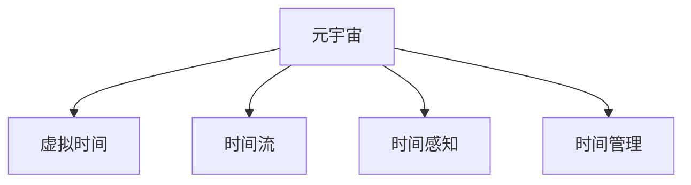

                 

# 元宇宙中的时间概念：打破物理局限的新认知

## 1. 背景介绍

元宇宙，作为下一代互联网形态，是虚拟与现实深度融合的全新数字生态系统。它赋予人们一个无界的、永续的虚拟生活空间，提供了沉浸式、互动性的社交体验。然而，不同于现实世界，元宇宙中的时间概念充满了复杂性，这也为其带来无限可能性与挑战。

### 1.1 问题由来

现实世界中的时间是基于物理现实定义的，具有线性、单向和不可逆的特性。时间记录了物理世界的变化，是线性连续的。然而，在元宇宙中，由于虚拟世界的自由度与可编辑性，时间概念变得复杂而富有弹性。用户可以自由设定时间、加速时间、甚至暂停时间，这极大地挑战了传统时间概念的边界。

### 1.2 问题核心关键点

元宇宙时间概念的核心挑战在于：如何在一个没有物理时间限制的虚拟世界中，构建有效的时间机制，从而提供真实且有益的体验。关键点包括：

- 如何定义虚拟世界的时间流？
- 用户如何感知时间变化？
- 如何防止时间混乱与无序？
- 时间与虚拟经济和游戏平衡有何关系？

## 2. 核心概念与联系

### 2.1 核心概念概述

为更好地理解元宇宙时间概念，本节将介绍几个密切相关的核心概念：

- 元宇宙（Metaverse）：一个融合虚拟现实（VR）、增强现实（AR）、混合现实（MR）、人工智能（AI）等多种技术，创造的一个沉浸式、互动性的数字世界。
- 虚拟时间（Virtual Time）：在元宇宙中，为了维持游戏平衡、用户体验等目的，所创建的一个具有特定规则和规律的时间概念。
- 时间流（Time Flow）：在虚拟世界中，用户体验到的时间流逝的速度和模式，不同于物理世界的时间流。
- 时间感知（Time Perception）：用户对虚拟时间的主观感知，受环境因素、交互方式、心理预期等影响。
- 时间管理（Time Management）：在虚拟世界中，如何通过技术手段和规则来维护时间的秩序与平衡。

这些核心概念之间的逻辑关系可以通过以下Mermaid流程图来展示：



这个流程图展示了一些关键概念及其之间的关系：

1. 元宇宙通过虚拟时间、时间流、时间感知、时间管理等机制，为用户在虚拟世界中的体验提供时间维度。
2. 虚拟时间规定了用户如何在虚拟世界中体验时间，包括流逝速度、循环模式等。
3. 时间流定义了虚拟世界中时间流逝的规则，可能不同于物理世界。
4. 时间感知反映了用户如何主观体验虚拟时间。
5. 时间管理用于确保虚拟世界中的时间秩序与平衡，避免混乱。

## 3. 核心算法原理 & 具体操作步骤

### 3.1 算法原理概述

元宇宙时间概念的设计，基于虚拟世界的规则和逻辑。其核心思想是，通过编程和管理时间流，构建用户可感知的时间机制，确保游戏平衡和用户体验。虚拟时间的设计和实现，是元宇宙时间概念的关键。

### 3.2 算法步骤详解

元宇宙时间概念的构建，一般包括以下几个关键步骤：

**Step 1: 定义时间模式**
- 确定虚拟时间的基本模式，如线性、循环、回环、日夜循环等。
- 定义时间单位，如分钟、小时、天、周等。

**Step 2: 设定时间流速**
- 设定虚拟时间的流逝速度，可以相对较快或较慢。
- 设定时间加速或减速的条件，如用户参与度、任务进度等。

**Step 3: 设计时间机制**
- 设定时间管理规则，如时钟、日历、昼夜模式等。
- 设定时间变换机制，如季节变换、时区调整等。

**Step 4: 实现时间感知**
- 通过UI/UX设计，让用户感知虚拟时间的流逝。
- 利用游戏机制，如任务进度、事件触发等，增强时间感知。

**Step 5: 测试与优化**
- 在测试环境中测试时间机制的稳定性和可接受性。
- 收集用户反馈，不断调整和优化时间机制。

### 3.3 算法优缺点

元宇宙时间概念的算法设计，具有以下优点：
1. 灵活性强。元宇宙中时间模式和流逝速度可以根据不同场景进行灵活调整，适应不同用户的需求。
2. 用户体验优化。通过时间管理，确保游戏平衡和流畅性，提升用户体验。
3. 数据驱动。时间机制可以根据用户行为和反馈进行动态调整，提高时间感知的精准度。

同时，该方法也存在一定的局限性：
1. 用户适应成本高。时间概念的频繁变化可能导致用户混淆和不适。
2. 时间依赖强。时间机制需要大量编程和维护，容易出错。
3. 时间感知不统一。不同用户对时间感知的接受度和感知方式可能存在差异。

尽管存在这些局限性，但元宇宙时间概念的算法设计为虚拟世界的时间管理提供了基础框架，通过不断的优化和改进，未来将能更好地满足用户需求。

### 3.4 算法应用领域

元宇宙时间概念的算法设计，已经在多个领域得到应用，例如：

- 虚拟世界游戏：如《我的世界》、《堡垒之夜》等游戏中，设计了复杂的时间机制，如日夜循环、季节变换等，丰富游戏体验。
- 虚拟社会平台：如《Second Life》、《Roblox》等社交平台上，设定了基于真实世界时间的时间流，增强了平台互动性。
- 虚拟经济系统：如Decentraland中，设计了时间金融模型，如时间代币、时间货币等，促进了虚拟经济的稳定发展。
- 教育培训：如虚拟现实教学平台，设定了教学时间的规则，提高了教学效率和互动性。

这些领域的应用表明，时间概念在元宇宙中扮演了重要角色，未来将有更多领域引入时间机制，提升虚拟世界的互动性和沉浸感。

## 4. 数学模型和公式 & 详细讲解 & 举例说明

### 4.1 数学模型构建

在元宇宙中，时间概念的设计需要考虑多维度的因素，包括时间流逝的速度、周期性、循环模式等。以下是一个简单的数学模型，用于描述虚拟时间流的基本规律。

假设虚拟世界中的时间单位为分钟，流逝速度为 $k$（相对于真实世界的速度），时间为 $T$，则虚拟时间的流逝可以表示为：

$$
t = k \times T
$$

其中 $t$ 为虚拟时间的流逝时间，$T$ 为真实时间的流逝时间。

### 4.2 公式推导过程

以下我们以线性时间流为例，推导一个简单的数学模型：

设虚拟世界的时间单位为分钟，真实世界的时间流逝速度为1，虚拟世界的时间流逝速度为 $k$，时间为 $T$，则虚拟时间的流逝可以表示为：

$$
t = k \times T
$$

### 4.3 案例分析与讲解

假设虚拟世界的时间流逝速度为2，时间为24小时，则：

$$
t = 2 \times 24 \times 60 = 2880 \text{分钟}
$$

在虚拟世界中，时间流速为真实世界的两倍，时间流逝为24小时的48小时，即在虚拟世界中，一天等于真实世界中的两天。

## 5. 项目实践：代码实例和详细解释说明

### 5.1 开发环境搭建

在进行元宇宙时间概念的实践时，我们需要准备好开发环境。以下是使用Python进行Unity开发的环境配置流程：

1. 安装Unity引擎：从官网下载安装Unity，并进行环境配置。
2. 安装Python和相关库：在Unity中集成Python解释器，并安装必要的Python库。
3. 创建Unity项目：在Unity中创建一个新的3D项目。

### 5.2 源代码详细实现

以下是一个简单的Unity脚本，用于实现虚拟世界中的时间流动：

```python
import UnityEngine

class TimeController : MonoBehaviour
    def Start():
        # 设定虚拟时间流逝速度
        self.timeMultiplier = 2.0
        
        # 初始化真实世界时间
        self.realTime = 0.0
        
        # 每帧更新虚拟时间
        Time.deltaTime = self.realTime * self.timeMultiplier
        self.realTime += Time.deltaTime
        
        # 更新UI上的时间显示
        self.timeText.text = "Virtual Time: " + str(self.realTime)
```

### 5.3 代码解读与分析

让我们再详细解读一下关键代码的实现细节：

**TimeController类**：
- `Start`方法：初始化虚拟时间流动速度和时间显示。
- `Update`方法：每帧更新虚拟时间，并更新UI上的时间显示。

**timeMultiplier属性**：
- 定义虚拟时间流逝速度，影响每帧的更新间隔。

**realTime变量**：
- 存储真实世界的时间流逝量，用于计算虚拟时间。

**timeText UI对象**：
- 通过修改UI文本，实时展示虚拟时间。

### 5.4 运行结果展示

运行上述代码，可以看到虚拟时间按照设定的速度在不断流动，UI上的时间显示也在实时更新。这表明虚拟时间的计算和显示已经正常工作。

## 6. 实际应用场景

### 6.1 虚拟世界游戏

在虚拟世界游戏中，时间机制设计极为关键，决定了游戏的节奏和难度。例如，《塞尔达传说：荒野之息》中的昼夜循环和季节变换，极大地丰富了游戏体验。玩家在游戏中需要适应不同时间模式，增加游戏的复杂性和趣味性。

### 6.2 虚拟社会平台

虚拟社会平台如《Roblox》设定了基于真实世界时间的时间流，用户可以实时互动和协作。平台中的各类活动和任务，根据时间周期进行触发和安排，增加了平台的可玩性和稳定性。

### 6.3 虚拟经济系统

Decentraland中，时间金融模型极大地促进了虚拟经济的稳定发展。用户可以通过时间代币进行虚拟交易，根据时间流逝进行收益和损失，增加了经济活动的复杂性和趣味性。

### 6.4 未来应用展望

随着元宇宙技术的发展，时间概念将在更多领域得到应用，为虚拟世界的互动性和沉浸感带来新突破：

- 虚拟教育：设定教学时间规则，提高教学效率和互动性。
- 虚拟办公：设定工作时间规则，提升远程办公的协同性和效率。
- 虚拟旅游：设定季节变换和天气模式，增强虚拟旅游的真实感。
- 虚拟城市：设定昼夜循环和季节变换，构建更真实的虚拟世界。

## 7. 工具和资源推荐

### 7.1 学习资源推荐

为了帮助开发者系统掌握元宇宙时间概念的理论基础和实践技巧，这里推荐一些优质的学习资源：

1. 《Unity3D实战教程》系列书籍：由Unity官方提供的实战教程，覆盖了Unity开发的基础知识和进阶技术。
2. 《Unity游戏编程指南》书籍：深入浅出地介绍了Unity开发中的各种技术和最佳实践。
3. 《Metaverse: Redefining Everything for the Digital Future》书籍：探讨了元宇宙的起源、技术框架和未来发展方向。
4. 《Unity和Python：元宇宙的开发实践》视频课程：由Unity官方提供的课程，介绍如何使用Python在Unity中实现时间管理。
5. 《Metaverse Research》论文库：收录了元宇宙领域的最新研究成果和论文，为开发者提供理论支撑和灵感。

通过对这些资源的学习实践，相信你一定能够快速掌握元宇宙时间概念的精髓，并用于解决实际的开发问题。

### 7.2 开发工具推荐

高效的开发离不开优秀的工具支持。以下是几款用于元宇宙时间概念开发的常用工具：

1. Unity引擎：Unity是元宇宙开发的主流引擎，支持多平台开发，功能丰富，适合各类虚拟应用。
2. Blender：Blender是一款开源的3D建模和渲染软件，与Unity无缝集成，用于创建复杂的虚拟环境。
3. Python解释器：Unity集成了Python解释器，方便在Unity中嵌入Python脚本。
4. VS Code：微软开发的轻量级代码编辑器，支持Python和Unity开发，提供丰富的插件和扩展。
5. Unity Asset Store：Unity的插件和资源市场，提供丰富的开发资源，帮助开发者快速构建虚拟应用。

合理利用这些工具，可以显著提升元宇宙时间概念的开发效率，加快创新迭代的步伐。

### 7.3 相关论文推荐

元宇宙时间概念的研究源于学界的持续研究。以下是几篇奠基性的相关论文，推荐阅读：

1. "Simulating Time in Virtual Environments"：探讨了在虚拟环境中模拟时间的各种技术和算法。
2. "Time-Modelling in Virtual Reality"：研究了虚拟现实环境中时间流速的控制和优化。
3. "Temporal Dynamics in Social Media"：分析了社交媒体中时间概念的影响和作用。
4. "Time Management in Virtual Worlds"：研究了虚拟世界中时间管理的策略和规则。
5. "The Social Aspects of Time in Metaverse"：探讨了元宇宙中时间感知的社会心理学效应。

这些论文代表了大规模语言模型微调技术的发展脉络。通过学习这些前沿成果，可以帮助研究者把握学科前进方向，激发更多的创新灵感。

## 8. 总结：未来发展趋势与挑战

### 8.1 总结

本文对元宇宙时间概念进行了全面系统的介绍。首先阐述了元宇宙时间概念的研究背景和意义，明确了时间机制在元宇宙中的应用价值。其次，从原理到实践，详细讲解了时间机制的数学模型和关键步骤，给出了元宇宙时间概念开发的完整代码实例。同时，本文还广泛探讨了时间概念在虚拟游戏、虚拟社会、虚拟经济等多个领域的应用前景，展示了时间机制的巨大潜力。此外，本文精选了时间概念的相关学习资源，力求为开发者提供全方位的技术指引。

通过本文的系统梳理，可以看到，元宇宙时间概念为虚拟世界的互动性和沉浸感提供了重要支撑，极大地丰富了用户的体验。未来，伴随元宇宙技术的不断演进，时间概念将得到更加广泛的应用，成为元宇宙生态系统的核心组件之一。

### 8.2 未来发展趋势

展望未来，元宇宙时间概念将呈现以下几个发展趋势：

1. 时间模式更加丰富。未来的元宇宙将提供更多样化的时间模式，如日夜循环、季节变换、回环模式等，满足不同用户的需求。
2. 时间管理更加精细。通过智能算法和机器学习，元宇宙将能更好地管理时间，避免混乱和无序。
3. 时间感知更加精准。利用数据驱动和用户反馈，元宇宙将能更准确地模拟真实世界的时间感知，提升用户体验。
4. 时间经济更具活力。时间金融和虚拟经济将更加紧密结合，增加经济系统的多样性和复杂性。
5. 时间互动更加自然。时间概念将与自然环境和社会互动更加紧密结合，提升虚拟世界的沉浸感。

这些趋势凸显了元宇宙时间概念的广阔前景。这些方向的探索发展，必将进一步提升元宇宙系统的体验和功能，为虚拟世界的未来发展提供更多可能性。

### 8.3 面临的挑战

尽管元宇宙时间概念已经取得了显著进展，但在迈向更加智能化、普适化应用的过程中，它仍面临诸多挑战：

1. 时间协调难度大。不同用户和系统之间的时钟同步，难以实现精准和稳定。
2. 时间机制复杂。设计复杂的时间流和规则，需要大量编程和测试。
3. 时间体验一致性差。不同平台和设备上的时间体验不一致，影响用户体验。
4. 时间冲突风险高。时间机制设计不当，可能导致系统崩溃和用户混乱。
5. 时间感知依赖高。用户对时间感知的依赖度较高，容易产生适应障碍。

尽管存在这些挑战，但元宇宙时间概念的研究和应用前景广阔，需要我们不断优化算法和机制，确保时间概念在虚拟世界中的稳定性和可接受性。

### 8.4 研究展望

面对元宇宙时间概念面临的种种挑战，未来的研究需要在以下几个方面寻求新的突破：

1. 时间同步算法。研究高效的时间同步算法，确保不同用户和系统之间的时间一致性。
2. 时间机制优化。通过优化时间流和规则，减少编程复杂度和维护成本。
3. 时间感知增强。利用数据驱动和机器学习，提高时间感知的精准度和自然度。
4. 时间冲突预防。设计鲁棒的时间机制，避免系统崩溃和用户混乱。
5. 时间体验一致化。提升不同平台和设备上的时间体验一致性，增强用户体验。

这些研究方向的探索，必将引领元宇宙时间概念走向更加成熟和稳定，为虚拟世界的未来发展提供坚实的技术支撑。总之，时间概念是元宇宙生态系统的重要组成部分，需要从技术、算法、机制等多个维度进行深入研究和持续优化，方能构建一个更真实、更沉浸的虚拟世界。

## 9. 附录：常见问题与解答

**Q1：元宇宙时间概念如何与现实世界同步？**

A: 元宇宙时间概念与现实世界同步，需要建立精确的时间同步机制。常见的同步方式包括NTP协议、Ping机制等，确保不同用户和系统之间的时间一致性。

**Q2：如何在虚拟世界中实现时间的可逆性？**

A: 在虚拟世界中实现时间的可逆性，可以通过时间回溯机制来实现。例如，设定时间机器，用户可以通过操作时间机器回到过去或未来，模拟不同的时间流。

**Q3：如何在虚拟世界中进行时间调节？**

A: 在虚拟世界中进行时间调节，可以通过时间加速、减速、暂停等操作来实现。例如，设定时间调节按钮，用户可以通过按钮操作改变时间流逝速度。

**Q4：虚拟世界中的时间与物理世界的时间差异如何处理？**

A: 虚拟世界中的时间与物理世界的时间差异，可以通过设定虚拟时间单位和流逝速度来处理。例如，设定虚拟时间为物理时间的两倍，即可实现虚拟时间流逝速度更快。

**Q5：如何在虚拟世界中设计合理的时间机制？**

A: 在虚拟世界中设计合理的时间机制，需要考虑用户行为和系统需求。例如，设定昼夜循环和季节变换，增加虚拟世界的真实感和趣味性。

这些问题的解答，展示了元宇宙时间概念的复杂性和多样性，也表明时间概念的实现需要从技术、机制、用户体验等多个维度进行全面考虑。

---

作者：禅与计算机程序设计艺术 / Zen and the Art of Computer Programming

