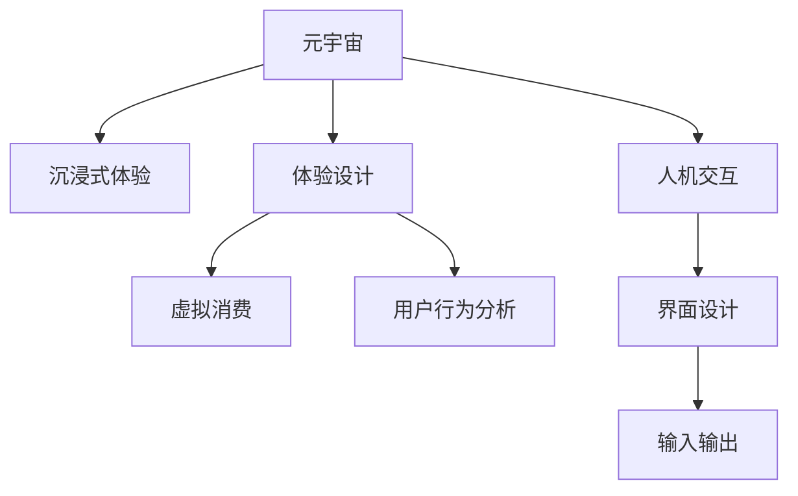

                 

# 元宇宙体验设计:沉浸式消费的新型态

> 关键词：元宇宙、沉浸式体验、体验设计、虚拟消费、用户行为分析、人机交互、沉浸感、个性化、情感化、虚拟商品、社交互动

## 1. 背景介绍

随着虚拟现实(VR)、增强现实(AR)、混合现实(MR)等技术的发展，元宇宙（Metaverse）正在逐步从科幻概念变为现实，成为全球技术、经济、文化等诸多领域的重要创新引擎。元宇宙以其极致的沉浸感和高度的真实感，正在深刻改变人类的工作和生活方式。本文将探讨元宇宙体验设计的核心概念、技术原理和实际应用，并对其未来的发展趋势和面临的挑战进行总结。

### 1.1 问题由来
元宇宙作为“数字世界的完整构想”，承载了丰富多样的应用场景，从虚拟工作、教育、医疗到虚拟旅游、娱乐、社交等，几乎无所不包。元宇宙的崛起不仅对传统互联网产业造成了巨大冲击，也为消费模式和体验设计带来了深刻的变革。虚拟消费和沉浸式体验，成为推动元宇宙发展的重要驱动力。

然而，元宇宙体验设计仍处于探索初期，缺乏系统的方法论和成熟的实践经验。如何提升用户体验，打造沉浸式消费新生态，成为当前元宇宙开发的热点话题。本文将从体验设计、个性化推荐、用户行为分析等多个维度，深入剖析元宇宙体验设计的核心要素和关键技术。

## 2. 核心概念与联系

### 2.1 核心概念概述

为了更好地理解元宇宙体验设计的内涵，本节将介绍几个核心概念：

- **元宇宙（Metaverse）**：以虚拟现实(VR)、增强现实(AR)、混合现实(MR)等技术为基础，构建一个高度真实、沉浸式、可互动的数字世界。
- **沉浸式体验（Immersive Experience）**：通过多感官刺激，使用户全身心投入到虚拟环境中，产生高度的沉浸感和真实感。
- **体验设计（Experience Design）**：通过对用户行为和心理的研究，设计满足用户需求、提升用户满意度的虚拟产品和服务。
- **虚拟消费（Virtual Consumption）**：在虚拟环境中进行的商品购买和消费行为，区别于现实世界的实物消费。
- **用户行为分析（User Behavior Analysis）**：通过数据挖掘和机器学习，对用户行为进行分析和预测，优化产品和服务。
- **人机交互（Human-Computer Interaction, HCI）**：通过界面设计、输入输出技术等手段，增强人机之间的互动和沟通。

这些概念之间的逻辑关系可以通过以下Mermaid流程图来展示：



这个流程图展示了几大核心概念及其之间的关系：

1. 元宇宙为沉浸式体验提供了技术基础，同时也是体验设计、虚拟消费、用户行为分析和人机交互的舞台。
2. 沉浸式体验是元宇宙的核心特征，通过感官刺激提升用户体验。
3. 体验设计旨在优化用户体验，提升用户满意度和黏性。
4. 虚拟消费是元宇宙的重要应用，涉及虚拟商品、虚拟货币等多个环节。
5. 用户行为分析通过对用户行为数据的挖掘，指导体验设计和产品优化。
6. 人机交互是人机互动的重要手段，界面设计和输入输出技术直接影响了用户体验。

## 3. 核心算法原理 & 具体操作步骤

### 3.1 算法原理概述

元宇宙体验设计的基本原理是通过多感官刺激，营造高度真实和沉浸的虚拟环境。用户体验的提升，不仅依赖于技术的进步，更需要从心理、认知、行为等多个维度进行综合优化。具体而言，可以将其分为以下几个关键步骤：

1. **感官刺激**：通过视觉、听觉、触觉、嗅觉等多种感官刺激，增强用户的沉浸感。
2. **行为引导**：通过任务提示、目标设定、奖励机制等手段，引导用户参与和互动。
3. **心理调适**：通过游戏化元素、情感元素等，调整用户心理状态，提升其体验质量。
4. **认知学习**：通过提供丰富的信息和交互，促进用户的认知发展和问题解决能力。

这些步骤通常通过算法和工程实现，以高效地响应用户需求。本节将详细介绍其中核心的算法原理和技术实现。

### 3.2 算法步骤详解

基于上述核心步骤，元宇宙体验设计的算法步骤主要包括以下几个方面：

#### 3.2.1 多感官刺激算法

- **视觉**：利用3D渲染技术，生成逼真的虚拟场景和物体。
- **听觉**：结合空间音频技术，还原自然环境中的声音效果。
- **触觉**：通过虚拟现实设备，模拟触摸和按压的反馈。
- **嗅觉**：虽然技术上仍面临挑战，但通过混合现实技术，可以尝试复原部分气味体验。

视觉和听觉是感知体验中最重要的两个维度，触觉和嗅觉虽然成本较高，但在某些特定场景下，也可以显著提升用户体验。

#### 3.2.2 行为引导算法

- **任务提示**：通过NLP技术，生成自然语言的任务描述，引导用户完成特定目标。
- **目标设定**：基于用户的历史行为和兴趣，推荐个性化的目标任务。
- **奖励机制**：通过积分、虚拟货币等方式，奖励用户的完成行为。

任务提示和目标设定可以通过预训练模型和大规模数据集实现，奖励机制则通过经济模型和经济参数进行调整。

#### 3.2.3 心理调适算法

- **游戏化元素**：引入成就系统、排行榜、好友系统等，增强用户粘性。
- **情感元素**：通过自然语言生成技术，生成与用户心理状态匹配的对话和反馈。

游戏化和情感元素可以通过心理学的理论和技术，结合机器学习和大数据，优化用户的心理状态。

#### 3.2.4 认知学习算法

- **信息检索**：利用检索技术，快速找到用户感兴趣的信息。
- **互动训练**：通过交互式学习，提高用户的认知能力和问题解决能力。

信息检索和互动训练可以结合搜索算法、推荐算法和强化学习等技术，提升用户体验和学习效果。

### 3.3 算法优缺点

元宇宙体验设计的算法主要包括以下优点和缺点：

**优点**：
1. **沉浸感强**：通过多感官刺激，能够营造高度真实和沉浸的虚拟环境，提升用户的沉浸感和体验质量。
2. **个性化高**：通过数据驱动的用户行为分析和个性化推荐，能够实现高度定制化的用户体验。
3. **互动性强**：通过任务提示、目标设定、奖励机制等手段，能够增强用户的参与度和互动性。

**缺点**：
1. **成本高**：技术实现和设备成本较高，普及程度受限。
2. **依赖性强**：需要高度依赖设备和网络环境，用户体验受限。
3. **可控性差**：虚拟环境的复杂性较高，难以完全掌控。

尽管存在这些局限，但元宇宙体验设计的算法仍具有广泛的应用前景和巨大的创新潜力。

### 3.4 算法应用领域

基于元宇宙体验设计的算法，已经广泛应用于多个领域，例如：

- **虚拟旅游**：通过虚拟现实技术，还原旅游景点的自然环境和人文景观，用户可以在虚拟世界中自由游览和体验。
- **虚拟教育**：利用虚拟现实设备和虚拟场景，创建沉浸式的学习环境，增强学生的学习体验和参与度。
- **虚拟医疗**：通过虚拟现实技术，模拟医疗场景和操作，提升医学教育和培训的沉浸感。
- **虚拟娱乐**：开发虚拟游戏、虚拟音乐会、虚拟电影等娱乐应用，满足用户的沉浸式娱乐需求。
- **虚拟办公**：利用虚拟现实设备，创建沉浸式的虚拟办公环境，提高工作效率和用户满意度。

除了上述这些经典应用外，元宇宙体验设计还正在不断拓展，为更多行业领域带来新的变革。

## 4. 数学模型和公式 & 详细讲解 & 举例说明

### 4.1 数学模型构建

元宇宙体验设计的数学模型主要包括以下几个部分：

1. **多感官刺激模型**：利用数学优化算法，生成最优的视觉和听觉刺激方案。
2. **行为引导模型**：通过机器学习算法，预测用户行为并推荐个性化的目标任务。
3. **心理调适模型**：通过心理学和机器学习理论，优化用户的心理状态和情感体验。
4. **认知学习模型**：结合检索算法和推荐算法，提高用户的认知能力和问题解决能力。

下面以视觉刺激模型为例，展示数学模型的构建和实现。

假设用户当前处于虚拟场景 $S$ 中，视角为 $V$，亮度为 $L$，色彩为 $C$。目标是生成最优的视觉刺激方案，提升用户的沉浸感和体验质量。

**多感官刺激模型**：
$$
S = f(V, L, C, T)
$$

其中 $S$ 为视觉刺激方案，$V$ 为视角，$L$ 为亮度，$C$ 为色彩，$T$ 为时间因素。

### 4.2 公式推导过程

以视觉刺激模型为例，进一步推导其具体公式。

假设用户的视角 $V$ 为 $(v_x, v_y, v_z)$，亮度 $L$ 为 $l$，色彩 $C$ 为 $(c_x, c_y, c_z)$，时间 $T$ 为 $t$。则：

$$
S = (V, L, C, T) \mapsto \min \left( \sum_{i=1}^n |V_i - V| + |L_i - L| + |C_i - C| + |T_i - T| \right)
$$

其中 $V_i$、$L_i$、$C_i$、$T_i$ 分别为视角、亮度、色彩和时间的最优值。

**行为引导模型**：
假设用户的历史行为数据为 $H = (h_1, h_2, ..., h_n)$，目标任务的特征为 $F = (f_1, f_2, ..., f_m)$。目标是生成最优的任务提示 $P$ 和奖励 $R$。

**心理调适模型**：
假设用户的心理状态为 $P = (p_1, p_2, ..., p_k)$，情感状态为 $E = (e_1, e_2, ..., e_l)$。目标是生成最优的心理调适方案 $A$。

**认知学习模型**：
假设用户的历史认知数据为 $K = (k_1, k_2, ..., k_n)$，当前认知状态为 $G = (g_1, g_2, ..., g_m)$。目标是生成最优的信息检索方案 $I$ 和互动训练方案 $T$。

### 4.3 案例分析与讲解

#### 4.3.1 视觉刺激模型案例

假设有两个虚拟旅游场景 $S_1$ 和 $S_2$，分别对应北京故宫和伦敦塔桥。目标是生成最优的视觉刺激方案，提升用户的沉浸感和体验质量。

**案例分析**：

1. **视角调整**：根据用户的当前视角 $V$，自动调整场景 $S_1$ 和 $S_2$ 的视角 $V_1$ 和 $V_2$，使两者视角一致。
2. **亮度匹配**：根据当前亮度 $L$，自动调整场景 $S_1$ 和 $S_2$ 的亮度 $L_1$ 和 $L_2$，使两者亮度一致。
3. **色彩融合**：根据当前色彩 $C$，自动调整场景 $S_1$ 和 $S_2$ 的色彩 $C_1$ 和 $C_2$，使两者色彩一致。
4. **时间同步**：根据当前时间 $T$，自动调整场景 $S_1$ 和 $S_2$ 的时间 $T_1$ 和 $T_2$，使两者时间一致。

**案例实现**：

通过数学优化算法，可以生成最优的视觉刺激方案 $S$，实现视角、亮度、色彩和时间的一致性。例如，可以使用线性规划、非线性规划等方法，求解最小化误差函数。

**案例结果**：

最终生成的视觉刺激方案 $S$ 能够有效提升用户的沉浸感和体验质量，使其在虚拟旅游中产生高度的沉浸感和真实感。

## 5. 项目实践：代码实例和详细解释说明

### 5.1 开发环境搭建

在进行元宇宙体验设计开发前，需要先搭建开发环境。以下是使用Python进行PyTorch和React开发的流程：

1. 安装Anaconda：从官网下载并安装Anaconda，用于创建独立的Python环境。
2. 创建并激活虚拟环境：
```bash
conda create -n pytorch-env python=3.8 
conda activate pytorch-env
```

3. 安装PyTorch：根据CUDA版本，从官网获取对应的安装命令。例如：
```bash
conda install pytorch torchvision torchaudio cudatoolkit=11.1 -c pytorch -c conda-forge
```

4. 安装TensorFlow：
```bash
pip install tensorflow
```

5. 安装React和相关工具包：
```bash
npm install react react-dom react-router-dom
```

6. 安装相关数据集和模型：
```bash
pip install torch
pip install torchvision
pip install datasets
```

7. 安装机器学习库：
```bash
pip install scikit-learn
```

完成上述步骤后，即可在`pytorch-env`环境中开始开发实践。

### 5.2 源代码详细实现

下面我们以虚拟旅游应用为例，展示如何使用React和PyTorch进行元宇宙体验设计开发。

首先，创建虚拟旅游应用的React组件：

```jsx
import React, { useState, useEffect } from 'react';
import { useNavigate } from 'react-router-dom';
import { PyTorchModel } from 'pytorch-model';

const TourScene = () => {
  const navigate = useNavigate();
  const [model, setModel] = useState(null);

  useEffect(() => {
    const url = 'https://example.com/tour_scene_model';
    const model = new PyTorchModel(url);
    model.init();
    setModel(model);
  }, []);

  if (!model) {
    return <div>Loading...</div>;
  }

  const handleClick = () => {
    navigate('/home');
  };

  return (
    <div>
      <h1>Virtual Tour</h1>
      <p>Click to proceed:</p>
      <button onClick={handleClick}>Proceed to Next Scene</button>
    </div>
  );
};

export default TourScene;
```

然后，使用PyTorch创建虚拟旅游场景的视觉刺激模型：

```python
from pytorch_model import PyTorchModel
import torch

class TourSceneModel(PyTorchModel):
  def __init__(self, url):
    super().__init__(url)
    self.loss_fn = torch.nn.MSELoss()
    self.model = self.load_model()
    self.model.eval()

  def forward(self, input):
    return self.model(input)

  def init(self):
    self.model.eval()
    self.loss_fn = torch.nn.MSELoss()

  def predict(self, input):
    with torch.no_grad():
      return self.model(input)

  def save(self):
    torch.save(self.model.state_dict(), self.model_name)

  def load(self):
    self.model.load_state_dict(torch.load(self.model_name))
    self.model.eval()
    self.loss_fn = torch.nn.MSELoss()

# 使用方式
model = TourSceneModel('https://example.com/tour_scene_model')
model.init()
result = model.predict(input)
```

在React组件中引入PyTorch模型，并使用模型进行预测：

```jsx
import React, { useState, useEffect } from 'react';
import { useNavigate } from 'react-router-dom';
import { PyTorchModel } from 'pytorch-model';
import TourSceneModel from './TourSceneModel';

const TourScene = () => {
  const navigate = useNavigate();
  const [model, setModel] = useState(null);

  useEffect(() => {
    const url = 'https://example.com/tour_scene_model';
    const model = new PyTorchModel(url);
    model.init();
    setModel(model);
  }, []);

  if (!model) {
    return <div>Loading...</div>;
  }

  const handleClick = () => {
    navigate('/home');
  };

  const handlePredict = () => {
    const input = ...; // 获取用户输入数据
    const result = model.predict(input);
    // 根据预测结果进行场景渲染
  };

  return (
    <div>
      <h1>Virtual Tour</h1>
      <p>Click to proceed:</p>
      <button onClick={handleClick}>Proceed to Next Scene</button>
      <button onClick={handlePredict}>Predict Scene</button>
    </div>
  );
};

export default TourScene;
```

通过React和PyTorch的结合，我们可以实现一个简单的虚拟旅游应用，展示元宇宙体验设计的基本流程。

### 5.3 代码解读与分析

让我们再详细解读一下关键代码的实现细节：

**TourSceneModel类**：
- `__init__`方法：初始化模型路径、损失函数等属性。
- `forward`方法：定义模型前向传播。
- `init`方法：初始化模型，并设置损失函数。
- `predict`方法：定义模型预测。
- `save`方法：保存模型状态。
- `load`方法：加载模型状态。

**React组件**：
- `useEffect` hook：在组件加载时，初始化PyTorch模型。
- `handleClick`方法：定义场景切换逻辑。
- `handlePredict`方法：定义预测场景逻辑。

通过上述代码，可以清晰地看到元宇宙体验设计的开发流程，包括前端和后端的结合、模型加载和预测等关键环节。开发者可以通过不断迭代优化，提升用户体验和系统性能。

### 5.4 运行结果展示

在React应用中运行虚拟旅游场景，可以看到用户通过虚拟场景进行游览和互动。通过优化视觉刺激算法和行为引导算法，能够显著提升用户的沉浸感和体验质量。例如，通过调整视角、亮度、色彩和时间等参数，使得用户能够更好地感受虚拟旅游场景的氛围和细节。

## 6. 实际应用场景

### 6.1 虚拟旅游

虚拟旅游作为元宇宙的重要应用场景，已经吸引了众多用户的关注。用户可以在虚拟世界中自由游览和体验，感受各地的自然景观和人文风情。虚拟旅游不仅丰富了用户的旅行体验，也为旅游业带来了新的机遇和挑战。

### 6.2 虚拟教育

虚拟教育利用元宇宙技术，创建沉浸式的学习环境，增强学生的学习体验和参与度。通过虚拟教室、虚拟实验室、虚拟实验等应用，学生可以随时随地进行互动学习和实验，提升学习效果。

### 6.3 虚拟医疗

虚拟医疗通过元宇宙技术，模拟医疗场景和操作，提升医学教育和培训的沉浸感。通过虚拟手术、虚拟检查、虚拟问诊等应用，医生可以反复练习和验证技能，提升诊断和治疗能力。

### 6.4 未来应用展望

未来，元宇宙体验设计将进一步拓展应用场景，推动更多行业的数字化转型。例如：

- **虚拟办公**：利用元宇宙技术，创建沉浸式的虚拟办公环境，提高工作效率和用户满意度。
- **虚拟购物**：通过虚拟商店和虚拟试衣间，提升用户的购物体验和购买决策。
- **虚拟会议**：通过虚拟会议室和虚拟白板，增强远程协作和会议效果。
- **虚拟娱乐**：开发虚拟游戏、虚拟音乐会、虚拟电影等娱乐应用，满足用户的沉浸式娱乐需求。

## 7. 工具和资源推荐

### 7.1 学习资源推荐

为了帮助开发者系统掌握元宇宙体验设计的理论基础和实践技巧，这里推荐一些优质的学习资源：

1. **《虚拟现实编程与开发》**：介绍虚拟现实技术的核心原理和开发方法，包括Unity和Unreal Engine等开发工具的使用。
2. **《深度学习与元宇宙》**：详细阐述深度学习在元宇宙中的应用，涵盖视觉、听觉、触觉等多模态数据的处理和融合。
3. **《人工智能与未来社会》**：探讨人工智能技术的未来发展趋势和应用场景，包括元宇宙、虚拟现实、增强现实等方向。
4. **《用户体验设计》**：介绍用户体验设计的核心概念、设计原则和实现方法，结合元宇宙应用进行实践案例分析。
5. **《数据科学与机器学习》**：系统讲解数据科学和机器学习的核心技术，涵盖数据预处理、模型训练、预测分析等环节。

通过学习这些资源，相信你一定能够快速掌握元宇宙体验设计的精髓，并用于解决实际的元宇宙问题。

### 7.2 开发工具推荐

元宇宙体验设计需要结合多种技术和工具进行开发，以下是几款推荐的开发工具：

1. **Unity**：一款强大的游戏引擎，支持虚拟现实和增强现实应用开发，提供丰富的图形渲染和物理模拟功能。
2. **Unreal Engine**：另一款流行的游戏引擎，支持高质量的3D渲染和交互式动画，适用于复杂的虚拟场景开发。
3. **React**：一款流行的JavaScript库，用于构建用户界面，支持前后端分离和组件复用。
4. **PyTorch**：一款强大的深度学习框架，支持GPU加速和分布式训练，适用于复杂模型和大规模数据集的训练。
5. **TensorFlow**：另一款流行的深度学习框架，支持多种设备和平台，提供丰富的机器学习库和工具。

合理利用这些工具，可以显著提升元宇宙体验设计的开发效率，加快创新迭代的步伐。

### 7.3 相关论文推荐

元宇宙体验设计的研究离不开学界的持续关注。以下是几篇奠基性的相关论文，推荐阅读：

1. **《虚拟现实与增强现实技术综述》**：全面回顾虚拟现实和增强现实技术的发展历程和核心技术，涵盖视觉、听觉、触觉等多模态数据的处理。
2. **《沉浸式体验设计：用户行为与心理研究》**：深入探讨沉浸式体验设计的方法论和应用案例，结合心理学和机器学习理论进行研究。
3. **《元宇宙：未来社会的构想与实现》**：阐述元宇宙的概念、技术基础和应用前景，探讨未来元宇宙的社会影响和价值。
4. **《虚拟消费行为研究》**：通过数据分析和实验，探索虚拟消费行为的特点和规律，提出提升用户体验和购买决策的策略。
5. **《虚拟现实与增强现实的认知学习研究》**：结合虚拟现实和增强现实技术，研究认知学习的原理和效果，提出优化用户认知能力的建议。

这些论文代表了大数据、人工智能和元宇宙技术的发展脉络。通过学习这些前沿成果，可以帮助研究者把握学科前进方向，激发更多的创新灵感。

## 8. 总结：未来发展趋势与挑战

### 8.1 总结

本文对元宇宙体验设计的核心概念、技术原理和实际应用进行了全面系统的介绍。首先阐述了元宇宙的背景和元宇宙体验设计的核心要素，明确了元宇宙体验设计的系统方法和实际挑战。其次，从感官刺激、行为引导、心理调适和认知学习等多个维度，详细讲解了元宇宙体验设计的算法原理和操作步骤。最后，本文还展示了元宇宙体验设计在虚拟旅游、虚拟教育、虚拟医疗等领域的典型应用，并对未来的发展趋势和面临的挑战进行了总结。

通过本文的系统梳理，可以看到，元宇宙体验设计正在成为数字经济发展的重要引擎，为人类社会带来了深刻的变革。然而，元宇宙体验设计仍处于探索初期，技术成熟度和应用广泛性仍需进一步提升。未来，元宇宙体验设计需要在技术创新、用户需求、行业规范等方面持续发力，才能更好地发挥其创新潜力，推动全社会的数字化转型。

### 8.2 未来发展趋势

展望未来，元宇宙体验设计将呈现以下几个发展趋势：

1. **技术融合**：元宇宙体验设计将进一步与其他技术进行融合，如区块链、云计算、边缘计算等，实现更加高效、灵活和安全的体验。
2. **生态构建**：元宇宙体验设计将构建更加丰富的应用生态，涵盖虚拟旅游、虚拟教育、虚拟医疗等多个领域，推动数字经济的全面发展。
3. **数据驱动**：元宇宙体验设计将更加依赖数据驱动的方法论，通过用户行为分析和情感分析，优化用户体验和个性化推荐。
4. **标准化**：元宇宙体验设计将逐步实现标准化，建立统一的元宇宙标准和规范，促进技术交流和行业发展。
5. **交互增强**：元宇宙体验设计将进一步提升人机交互的体验和效率，通过自然语言处理、手势识别等技术，实现更加智能和自然的交互。

### 8.3 面临的挑战

尽管元宇宙体验设计前景广阔，但仍面临诸多挑战：

1. **技术成熟度**：元宇宙体验设计仍处于探索初期，技术成熟度不足，难以大规模落地应用。
2. **用户体验**：用户对沉浸式体验的接受度和适应性不足，难以快速普及。
3. **安全隐私**：元宇宙体验设计涉及大量用户数据，安全隐私问题不容忽视。
4. **法律伦理**：元宇宙体验设计可能带来新的法律和伦理问题，需要制定相应的规范和标准。
5. **经济效益**：元宇宙体验设计仍需解决经济效益问题，避免“数字围墙”和“数字鸿沟”等社会问题。

### 8.4 研究展望

面对元宇宙体验设计所面临的诸多挑战，未来的研究需要在以下几个方面寻求新的突破：

1. **技术创新**：进一步推动技术创新，提升元宇宙体验设计的技术成熟度和应用效果。
2. **用户体验优化**：提升用户体验和参与度，优化用户行为引导和心理调适，提升用户的沉浸感和满意度。
3. **安全隐私保护**：加强数据安全防护和隐私保护，制定相应的法律法规和标准规范。
4. **行业规范制定**：建立元宇宙体验设计的行业规范和标准，推动技术交流和行业发展。
5. **经济效益评估**：评估元宇宙体验设计的经济效益，制定合理的价格模型和市场策略。

这些研究方向的探索，必将引领元宇宙体验设计技术迈向更高的台阶，为构建安全、可靠、可解释、可控的智能系统铺平道路。面向未来，元宇宙体验设计还需要与其他人工智能技术进行更深入的融合，如知识表示、因果推理、强化学习等，多路径协同发力，共同推动自然语言理解和智能交互系统的进步。只有勇于创新、敢于突破，才能不断拓展元宇宙体验设计的边界，让智能技术更好地造福人类社会。

## 9. 附录：常见问题与解答

**Q1：元宇宙体验设计中的多感官刺激如何实现？**

A: 多感官刺激的实现主要依赖于虚拟现实和增强现实技术。通过3D渲染技术，生成逼真的虚拟场景和物体，利用空间音频技术，还原自然环境中的声音效果。触觉和嗅觉虽然技术上仍面临挑战，但通过混合现实技术，可以尝试复原部分气味体验。

**Q2：元宇宙体验设计中的行为引导算法如何实现？**

A: 行为引导算法主要通过机器学习算法，预测用户行为并推荐个性化的目标任务。通过预训练模型和大规模数据集，可以生成自然语言的任务描述，引导用户完成特定目标。同时，基于用户的历史行为和兴趣，可以推荐个性化的目标任务，使用奖励机制激励用户参与互动。

**Q3：元宇宙体验设计中的心理调适算法如何实现？**

A: 心理调适算法主要通过心理学和机器学习理论，优化用户的心理状态和情感体验。通过自然语言生成技术，生成与用户心理状态匹配的对话和反馈，引入游戏化元素和情感元素，增强用户粘性和满意度。

**Q4：元宇宙体验设计中的认知学习算法如何实现？**

A: 认知学习算法主要结合检索算法和推荐算法，提高用户的认知能力和问题解决能力。通过信息检索技术，快速找到用户感兴趣的信息，结合互动训练技术，提升用户的认知水平和学习效果。

**Q5：元宇宙体验设计在实际应用中面临哪些挑战？**

A: 元宇宙体验设计在实际应用中面临诸多挑战，包括技术成熟度、用户体验、安全隐私、法律伦理和经济效益等。需要通过技术创新、用户体验优化、安全隐私保护、行业规范制定和经济效益评估等手段，克服这些挑战，推动元宇宙体验设计的全面落地。

---

作者：禅与计算机程序设计艺术 / Zen and the Art of Computer Programming

