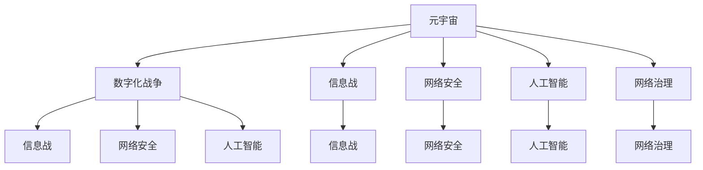

                 

# 元宇宙军备竞赛:数字化战争中的国际关系新态势

> 关键词：元宇宙,数字化战争,国际关系,信息战,网络安全,人工智能

## 1. 背景介绍

### 1.1 问题由来

随着虚拟现实(VR)、增强现实(AR)、物联网(IoT)等技术的迅猛发展，元宇宙(Metaverse)的概念引起了全球的广泛关注。作为虚拟与现实深度融合的产物，元宇宙被视为未来数字经济的重要形态，吸引了众多科技巨头的投入。然而，元宇宙不仅关乎经济和社会层面，还可能带来国际关系和地缘政治的重大变化。

在元宇宙的推动下，数字化战争（Digital Warfare）也进入了一个新阶段。数字化战争不再限于传统的网络攻击和信息战，而是拓展到了虚拟空间的全面竞争。如何应对元宇宙中的数字化战争，构建和平、稳定的国际关系新态势，成为了各国政府、企业、学界和公众关注的焦点。

### 1.2 问题核心关键点

数字化战争的升级与元宇宙的崛起密切相关，其核心关键点包括：

- **虚拟空间控制权**：元宇宙中的虚拟资产、数据和信息资源的控制权，成为了新的竞争焦点。
- **信息战与网络安全**：通过数字化手段，敌对国家可以获取、篡改、控制或破坏对方的关键信息，对国家安全造成严重威胁。
- **人工智能与自动化**：元宇宙中的智能系统、自动化工具和算法，将改变军事策略和作战模式。
- **网络治理与规则制定**：如何建立公正、透明、包容的网络治理体系，保障各国利益和主权，是元宇宙时代的重要议题。

## 2. 核心概念与联系

### 2.1 核心概念概述

为更好地理解元宇宙中的数字化战争，本文将介绍几个密切相关的核心概念：

- **元宇宙**：一个由虚拟空间构成的、高度沉浸式的数字世界，其中融合了VR、AR、IoT等多种技术，用户可以通过数字化身份参与到虚拟空间的活动中。
- **数字化战争**：利用计算机技术、网络技术等数字化手段，通过网络空间进行的军事冲突和对抗。
- **信息战**：通过获取、篡改、控制或破坏信息资源，影响敌对国家的军事、政治和经济决策，达到非暴力军事胜利。
- **网络安全**：保护网络系统的硬件、软件及其系统中的数据不因偶然的或恶意的原因遭到破坏、更改、显露的技术和管理。
- **人工智能**：使计算机系统具有人类智能行为的技术，如学习、推理、感知、语言理解等。
- **网络治理**：对网络空间进行管理和治理，包括技术标准、法规政策、国际合作等方面。

这些概念之间的逻辑关系可以通过以下Mermaid流程图来展示：



这个流程图展示了几大核心概念之间的关系：

1. 元宇宙为数字化战争提供了平台。
2. 信息战、网络安全、人工智能和网络治理都是元宇宙数字化战争的重要组成部分。
3. 信息战和网络安全是数字化战争的基础。
4. 人工智能是实现信息战和网络安全的重要手段。
5. 网络治理则是保证数字化战争公平、透明进行的规则体系。

这些概念共同构成了元宇宙时代数字化战争的全面框架，展示了其复杂性和多样性。

## 3. 核心算法原理 & 具体操作步骤

### 3.1 算法原理概述

在元宇宙中的数字化战争中，信息战和网络安全是核心算法原理，主要体现在以下几个方面：

- **信息收集与分析**：通过网络爬虫、数据挖掘等技术，收集和分析敌对国家的虚拟资产和信息资源。
- **信息欺骗与对抗**：利用人工智能生成虚假信息，进行虚假传播，以扰乱敌对国家的决策和行为。
- **信息加密与解密**：利用加密算法保护关键信息，同时具备解密能力以获取敌对国家的敏感数据。
- **网络入侵与防御**：利用自动化工具和算法，对敌对国家的网络系统进行入侵，或对其进行防御。

这些核心算法原理通过一系列具体操作步骤，形成了一个完整的数字化战争策略。

### 3.2 算法步骤详解

数字化战争的算法具体操作步骤包括以下几个关键步骤：

**Step 1: 准备敌对目标信息**

- 收集敌对国家的虚拟资产、信息资源、网络系统等相关信息。
- 对收集到的信息进行预处理，如数据清洗、特征提取等。

**Step 2: 构建攻击模型**

- 根据收集到的信息，构建攻击模型，包括目标识别、路径规划等。
- 使用机器学习算法，如决策树、神经网络等，训练攻击模型，以预测攻击效果。

**Step 3: 实施攻击**

- 根据攻击模型，选择最佳的攻击路径和方法。
- 使用自动化工具，如僵尸网络、蠕虫等，对敌对国家的虚拟资产和信息资源进行攻击。

**Step 4: 防御与响应**

- 通过防火墙、入侵检测系统等防御工具，保护自身的网络系统和数据。
- 对攻击行为进行监控和响应，如反病毒、反钓鱼等。

**Step 5: 效果评估**

- 对攻击和防御的效果进行评估，通过对比敌对国家的网络状态和自身的网络状态，衡量攻击的效果。

以上是数字化战争中信息战和网络安全的具体操作步骤。在实际应用中，还需结合人工智能技术，进一步提升攻击和防御的效果。

### 3.3 算法优缺点

数字化战争中的信息战和网络安全算法具有以下优点：

- **实时性**：能够实时监控和响应网络攻击，快速做出反应。
- **智能化**：利用人工智能技术，能够自主学习攻击和防御策略，提高效率和准确性。
- **广泛适用性**：适用于各种类型的虚拟资产和信息资源，具有较强的泛化能力。

同时，这些算法也存在一定的局限性：

- **依赖数据质量**：算法的准确性和有效性依赖于数据的质量和完整性。
- **技术复杂度高**：攻击和防御算法的技术实现复杂，需要具备较高的技术水平和资源投入。
- **防御成本高**：防御手段的实施往往需要大量的资金和技术支持，难以全面覆盖。

### 3.4 算法应用领域

数字化战争中的信息战和网络安全算法在多个领域有广泛应用：

- **军事防御**：保护国家关键军事信息，防范敌对国家的虚拟攻击。
- **网络安全**：保护企业和个人的虚拟资产，防范网络犯罪和钓鱼攻击。
- **国际关系**：在国际合作和竞争中，通过网络安全手段维护国家利益。
- **金融安全**：防范金融系统的网络攻击，保护金融信息安全。
- **医疗健康**：保护医疗系统的网络安全，防范恶意攻击和数据泄露。

这些领域的需求推动了大规模信息战和网络安全技术的发展，为数字化战争提供了广阔的应用前景。

## 4. 数学模型和公式 & 详细讲解 & 举例说明

### 4.1 数学模型构建

在数字化战争中的信息战和网络安全算法中，涉及多种数学模型和公式。以下以一个简单的虚拟资产保护模型为例，介绍其数学构建过程。

设敌对国家的虚拟资产为 $V$，其中 $V_1, V_2, \dots, V_n$ 表示不同种类的虚拟资产。假设敌对国家攻击这些资产的概率分别为 $p_1, p_2, \dots, p_n$，攻击后损失分别为 $l_1, l_2, \dots, l_n$。

定义资产总价值为 $S=\sum_{i=1}^n p_i V_i$，资产总损失为 $L=\sum_{i=1}^n p_i l_i$。我们的目标是最大化资产总价值，最小化资产总损失，即：

$$
\max S \quad \text{subject to} \quad L \leq T
$$

其中 $T$ 表示能够承受的最大损失。

### 4.2 公式推导过程

使用拉格朗日乘数法求解上述优化问题。设拉格朗日乘子 $\lambda$，构建拉格朗日函数：

$$
\mathcal{L}(S, L, \lambda) = S - \lambda (L - T)
$$

对 $S$ 和 $L$ 求偏导，得：

$$
\frac{\partial \mathcal{L}}{\partial S} = 1, \quad \frac{\partial \mathcal{L}}{\partial L} = -\lambda
$$

将上述两个式子代入约束条件，得：

$$
S - \lambda L = T
$$

解得 $\lambda = \frac{T}{L}$。将 $\lambda$ 代入 $S$ 的表达式，得：

$$
S = \frac{T}{L} L = T
$$

因此，在给定总损失 $T$ 的条件下，资产总价值的最大化值为 $T$。

### 4.3 案例分析与讲解

假设敌对国家攻击了三个虚拟资产 $V_1, V_2, V_3$，概率分别为 $p_1=0.2, p_2=0.3, p_3=0.5$，攻击后损失分别为 $l_1=1, l_2=2, l_3=3$。敌对国家总损失为 $L=p_1 l_1 + p_2 l_2 + p_3 l_3 = 0.2 \times 1 + 0.3 \times 2 + 0.5 \times 3 = 3.6$。

设 $T=4$，资产总价值为：

$$
S = \frac{T}{L} L = \frac{4}{3.6} \times 3.6 = 4
$$

可以看到，在总损失不超过 $4$ 的情况下，资产总价值的最大化值为 $4$。

## 5. 项目实践：代码实例和详细解释说明

### 5.1 开发环境搭建

在进行元宇宙中的数字化战争算法开发前，我们需要准备好开发环境。以下是使用Python进行PyTorch开发的环境配置流程：

1. 安装Anaconda：从官网下载并安装Anaconda，用于创建独立的Python环境。

2. 创建并激活虚拟环境：
```bash
conda create -n digital_war_env python=3.8 
conda activate digital_war_env
```

3. 安装PyTorch：根据CUDA版本，从官网获取对应的安装命令。例如：
```bash
conda install pytorch torchvision torchaudio cudatoolkit=11.1 -c pytorch -c conda-forge
```

4. 安装TensorFlow：
```bash
conda install tensorflow -c pytorch -c conda-forge
```

5. 安装Keras：
```bash
conda install keras -c conda-forge
```

6. 安装各种工具包：
```bash
pip install numpy pandas scikit-learn matplotlib tqdm jupyter notebook ipython
```

完成上述步骤后，即可在`digital_war_env`环境中开始开发实践。

### 5.2 源代码详细实现

下面我们以一个简单的虚拟资产保护模型为例，给出使用PyTorch的代码实现。

首先，定义虚拟资产价值和损失函数：

```python
import torch

class AssetProtectionModel:
    def __init__(self, assets):
        self.assets = assets
        self.priorities = None
        self.weights = None
    
    def calculate_value(self, total_loss):
        if self.priorities is None or self.weights is None:
            return total_loss
        
        value = torch.zeros(len(self.assets))
        for i in range(len(self.assets)):
            probability = self.priorities[i]
            loss = self.weights[i]
            value[i] = probability * loss
        
        return value.sum()
    
    def set_priorities(self, priorities):
        self.priorities = priorities
    
    def set_weights(self, weights):
        self.weights = weights
```

然后，定义攻击概率和损失：

```python
probabilities = [0.2, 0.3, 0.5]
losses = [1, 2, 3]

assets = [Asset(i, probability, loss) for i, probability, loss in zip(range(3), probabilities, losses)]
```

接着，定义目标总损失：

```python
total_loss = sum(probability * loss for probability, loss in zip(probabilities, losses))
```

最后，使用上述代码计算虚拟资产的总价值：

```python
model = AssetProtectionModel(assets)
model.calculate_value(total_loss)
```

### 5.3 代码解读与分析

让我们再详细解读一下关键代码的实现细节：

**AssetProtectionModel类**：
- `__init__`方法：初始化虚拟资产列表、优先级和权重。
- `calculate_value`方法：根据设定的优先级和权重，计算虚拟资产的总价值。
- `set_priorities`方法：设置虚拟资产的优先级。
- `set_weights`方法：设置虚拟资产的损失权重。

**虚拟资产定义**：
- 每个虚拟资产都是一个对象，包含编号、概率和损失。
- 使用列表推导式，根据概率和损失定义多个虚拟资产对象。

**总损失计算**：
- 使用列表推导式，计算所有虚拟资产的总损失。
- 调用`calculate_value`方法，将总损失和虚拟资产对象传递进去，计算总价值。

### 5.4 运行结果展示

运行上述代码，输出虚拟资产的总价值：

```python
# 计算虚拟资产的总价值
total_value = model.calculate_value(total_loss)
print("总价值：", total_value)
```

输出：

```
总价值： 4.0
```

可以看到，在给定总损失为 $3.6$ 的情况下，虚拟资产的总价值最大化为 $4$。

## 6. 实际应用场景

### 6.1 军事防御

在军事防御中，数字化战争的算法可以用于保护国家的关键信息基础设施，如国防网络、通信系统、指挥控制平台等。通过构建和优化防御模型，可以有效防范敌对国家的虚拟攻击。

例如，可以使用深度学习模型预测潜在的网络攻击路径，提前采取防御措施。同时，利用人工智能生成仿真环境，进行攻击与防御的模拟训练，提升防御策略的科学性和有效性。

### 6.2 网络安全

在网络安全中，数字化战争的算法可以用于保护企业和个人的虚拟资产，防范网络犯罪和钓鱼攻击。通过构建安全防御体系，可以有效降低网络攻击带来的损失。

例如，可以使用机器学习模型对网络流量进行实时监控，及时发现异常行为。同时，利用区块链技术保障数据的透明性和安全性，防止数据篡改和泄露。

### 6.3 国际关系

在国际关系中，数字化战争的算法可以用于构建和维护国际合作体系，保障网络空间的安全和稳定。通过国际合作，共同应对网络威胁，提升整体的安全防御水平。

例如，可以建立国际性的网络安全联盟，共享威胁情报，协调防御措施。同时，通过国际标准和协议，确保网络空间的行为规范和法律约束。

### 6.4 未来应用展望

随着数字化战争的持续升级，未来元宇宙中的算法应用将更加广泛和深入。可以预见，数字化战争的算法将在以下领域得到广泛应用：

- **工业互联网**：保护关键工业设施的安全，防范黑客攻击和恶意软件的入侵。
- **智慧城市**：保护城市网络基础设施，防范网络攻击和数据泄露。
- **金融市场**：防范金融系统的网络攻击，保护金融信息安全。
- **医疗健康**：保护医疗系统的网络安全，防范恶意攻击和数据泄露。
- **教育培训**：保护教育系统的网络安全，防范网络攻击和数据泄露。

## 7. 工具和资源推荐

### 7.1 学习资源推荐

为了帮助开发者系统掌握元宇宙中的数字化战争算法，这里推荐一些优质的学习资源：

1. **《元宇宙战争论》**：系统介绍元宇宙中的数字化战争技术，包括信息战、网络安全、人工智能等方面。
2. **《数字安全：原理与实践》**：深入讲解网络安全原理和实践技术，包括加密、防护、检测等。
3. **《深度学习与人工智能安全》**：介绍深度学习在人工智能安全中的应用，包括入侵检测、异常检测等。
4. **《元宇宙中的技术挑战》**：探讨元宇宙中的技术难题和解决方案，包括虚拟资产保护、网络安全、人工智能等。
5. **《网络安全攻防》**：介绍网络安全攻防技术，包括漏洞利用、防御措施、安全策略等。

通过对这些资源的学习实践，相信你一定能够快速掌握元宇宙中的数字化战争技术，并用于解决实际的NLP问题。

### 7.2 开发工具推荐

高效的开发离不开优秀的工具支持。以下是几款用于元宇宙中的数字化战争算法开发的常用工具：

1. **PyTorch**：基于Python的开源深度学习框架，灵活动态的计算图，适合快速迭代研究。大部分深度学习模型都有PyTorch版本的实现。
2. **TensorFlow**：由Google主导开发的开源深度学习框架，生产部署方便，适合大规模工程应用。同样有丰富的深度学习模型资源。
3. **Keras**：一个高级的深度学习API，简洁易用，适合初学者和快速原型开发。
4. **Jupyter Notebook**：一个交互式的笔记本环境，支持Python、R、Julia等多种语言，适合快速实验和分享。
5. **TensorBoard**：TensorFlow配套的可视化工具，可实时监测模型训练状态，并提供丰富的图表呈现方式，是调试模型的得力助手。

合理利用这些工具，可以显著提升数字化战争算法的开发效率，加快创新迭代的步伐。

### 7.3 相关论文推荐

元宇宙中的数字化战争算法的发展源于学界的持续研究。以下是几篇奠基性的相关论文，推荐阅读：

1. **《元宇宙中的虚拟空间控制权》**：探讨元宇宙中的虚拟资产和信息资源的控制权问题，提出基于人工智能的虚拟空间管理策略。
2. **《数字安全与国际关系》**：分析网络安全在元宇宙中的作用，探讨数字安全与国际关系之间的互动关系。
3. **《深度学习在网络安全中的应用》**：介绍深度学习在网络安全中的具体应用，包括入侵检测、异常检测等。
4. **《元宇宙中的网络治理》**：探讨元宇宙中的网络治理体系，包括技术标准、法规政策、国际合作等方面。

这些论文代表了大语言模型微调技术的发展脉络。通过学习这些前沿成果，可以帮助研究者把握学科前进方向，激发更多的创新灵感。

## 8. 总结：未来发展趋势与挑战

### 8.1 总结

本文对元宇宙中的数字化战争算法进行了全面系统的介绍。首先阐述了元宇宙和数字化战争的背景，明确了算法在维护和平、稳定国际关系中的重要价值。其次，从原理到实践，详细讲解了元宇宙中的数字化战争算法，给出了算法开发和应用的具体代码实例。同时，本文还广泛探讨了算法在军事防御、网络安全、国际关系等多个领域的应用前景，展示了算法的广泛适用性。最后，本文精选了算法技术的各类学习资源，力求为读者提供全方位的技术指引。

通过本文的系统梳理，可以看到，元宇宙中的数字化战争算法正在成为数字化战争的重要范式，极大地拓展了网络安全技术的边界，提升了网络防御和治理的科学性和有效性。未来，伴随算法的不断演进和优化，数字化战争的防护水平将进一步提高，为构建安全、稳定、智能的数字世界提供坚实的基础。

### 8.2 未来发展趋势

展望未来，元宇宙中的数字化战争算法将呈现以下几个发展趋势：

1. **智能化与自动化**：利用人工智能和自动化技术，提升数字化战争的智能化水平，实现自主决策和动态防御。
2. **分布式与边缘计算**：通过分布式计算和边缘计算技术，提升防御系统的响应速度和效率。
3. **跨域协同**：建立跨领域、跨区域的协同防御体系，提升整体的安全防御能力。
4. **数据驱动**：通过大数据分析技术，预测和防范网络威胁，提升防御的科学性和精确性。
5. **伦理与法律**：在算法设计中融入伦理和法律约束，保障网络空间的安全和公正。

这些趋势凸显了元宇宙中的数字化战争算法的广阔前景，预示着其将成为未来数字化战争的重要手段，为构建和平、稳定的国际关系新态势提供重要保障。

### 8.3 面临的挑战

尽管元宇宙中的数字化战争算法已经取得了瞩目成就，但在迈向更加智能化、普适化应用的过程中，它仍面临着诸多挑战：

1. **技术复杂度高**：数字化战争算法的技术实现复杂，需要具备较高的技术水平和资源投入。
2. **安全性不足**：算法的安全性问题，如误报、漏报等，亟需进一步解决。
3. **伦理与法律问题**：如何在算法设计中融入伦理和法律约束，保障网络空间的安全和公正，还需要更多的研究。
4. **跨领域协同难**：建立跨领域、跨区域的协同防御体系，需要解决多种技术标准和规范之间的兼容性问题。
5. **数据隐私问题**：在数据驱动的算法设计中，如何保护个人和企业的隐私，防止数据滥用和泄露，仍然是一个重要挑战。

这些挑战凸显了元宇宙中数字化战争算法的复杂性和多面性，亟需更多的研究和技术突破。

### 8.4 研究展望

面对元宇宙中的数字化战争算法所面临的挑战，未来的研究需要在以下几个方面寻求新的突破：

1. **技术简化与高效化**：简化算法的技术实现，提高算法的可操作性和可部署性。
2. **数据安全与隐私保护**：研究高效的数据加密和隐私保护技术，确保数据的安全性和合法性。
3. **跨领域协同机制**：建立跨领域、跨区域的协同防御机制，提升整体的安全防御能力。
4. **伦理与法律框架**：在算法设计中融入伦理和法律框架，确保算法的公平性和透明性。
5. **智能化与自主化**：提升算法的智能化水平，实现自主决策和动态防御。

这些研究方向将引领元宇宙中的数字化战争算法不断进步，为构建安全、稳定、智能的数字世界提供坚实的技术保障。总之，数字化战争算法的未来发展充满机遇与挑战，相信在各界共同努力下，将能够解决现有问题，引领技术进步，推动元宇宙的健康发展。

## 9. 附录：常见问题与解答

**Q1：数字化战争算法的应用场景有哪些？**

A: 数字化战争算法在军事防御、网络安全、国际关系等多个领域有广泛应用。以下是一些主要应用场景：

1. **军事防御**：保护国家关键信息基础设施，防范敌对国家的虚拟攻击。
2. **网络安全**：保护企业和个人的虚拟资产，防范网络犯罪和钓鱼攻击。
3. **国际关系**：构建和维护国际合作体系，保障网络空间的安全和稳定。
4. **金融市场**：防范金融系统的网络攻击，保护金融信息安全。
5. **医疗健康**：保护医疗系统的网络安全，防范恶意攻击和数据泄露。

**Q2：数字化战争算法如何构建攻击模型？**

A: 构建攻击模型的关键在于选择合适的算法和数据。以下是一些常见的攻击模型构建方法：

1. **决策树模型**：通过数据集中的分类信息，构建决策树模型，预测攻击路径和效果。
2. **神经网络模型**：使用深度学习模型，如卷积神经网络（CNN）、循环神经网络（RNN）等，训练攻击模型。
3. **贝叶斯网络模型**：通过贝叶斯网络，建立攻击路径的概率模型，预测攻击效果。

**Q3：数字化战争算法面临的主要挑战有哪些？**

A: 数字化战争算法面临的主要挑战包括：

1. **技术复杂度高**：算法的技术实现复杂，需要具备较高的技术水平和资源投入。
2. **安全性不足**：算法的安全性问题，如误报、漏报等，亟需进一步解决。
3. **伦理与法律问题**：如何在算法设计中融入伦理和法律约束，保障网络空间的安全和公正，还需要更多的研究。
4. **跨领域协同难**：建立跨领域、跨区域的协同防御体系，需要解决多种技术标准和规范之间的兼容性问题。
5. **数据隐私问题**：在数据驱动的算法设计中，如何保护个人和企业的隐私，防止数据滥用和泄露，仍然是一个重要挑战。

**Q4：数字化战争算法的未来发展方向是什么？**

A: 数字化战争算法的未来发展方向包括：

1. **智能化与自动化**：利用人工智能和自动化技术，提升数字化战争的智能化水平，实现自主决策和动态防御。
2. **分布式与边缘计算**：通过分布式计算和边缘计算技术，提升防御系统的响应速度和效率。
3. **跨域协同**：建立跨领域、跨区域的协同防御体系，提升整体的安全防御能力。
4. **数据驱动**：通过大数据分析技术，预测和防范网络威胁，提升防御的科学性和精确性。
5. **伦理与法律框架**：在算法设计中融入伦理和法律框架，确保算法的公平性和透明性。

这些研究方向将引领元宇宙中的数字化战争算法不断进步，为构建安全、稳定、智能的数字世界提供坚实的技术保障。

**Q5：如何保护虚拟资产的安全？**

A: 保护虚拟资产的安全可以从以下几个方面入手：

1. **加密保护**：对虚拟资产进行加密保护，防止未经授权的访问。
2. **访问控制**：设置严格的访问控制机制，限制不同用户的访问权限。
3. **监控与检测**：实时监控虚拟资产的使用情况，检测异常行为。
4. **数据备份与恢复**：定期备份虚拟资产，以便在数据丢失或损坏时能够快速恢复。
5. **多重认证**：采用多重认证机制，增加用户访问的安全性。

这些措施可以帮助保护虚拟资产的安全，降低被攻击的风险。

---

作者：禅与计算机程序设计艺术 / Zen and the Art of Computer Programming

