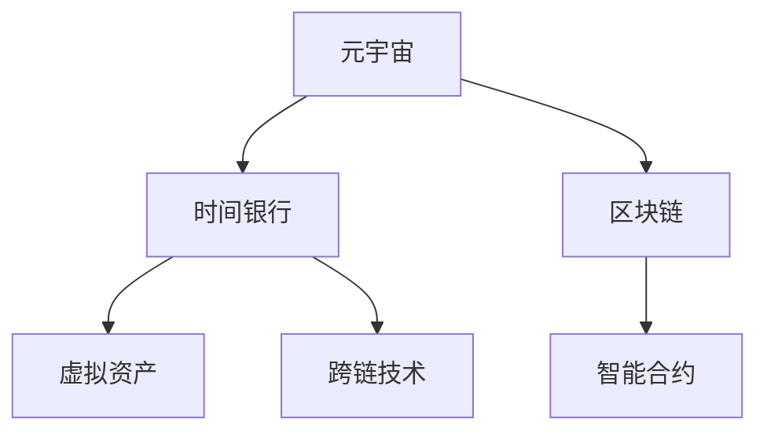

                 

# 元宇宙时间银行:打破物理局限的时间交易

> 关键词：元宇宙,时间银行,区块链,虚拟资产,智能合约,跨链技术

## 1. 背景介绍

随着数字技术的高速发展，元宇宙（Metaverse）已成为当下最热门的概念之一。它不仅是一个数字化的虚拟空间，更是一种全新的生活方式，人们可以在其中进行社交、游戏、购物、工作等多样化活动。然而，元宇宙的一大瓶颈是时间资源的不足。在物理世界中，时间是一种极其宝贵且有限的资源，而在元宇宙中，时间的获取和交易也需要一种新的机制来满足需求。

时间银行（Time Bank）正是针对这一问题提出的一个解决方案。时间银行是一种虚拟货币系统，允许用户将自己在物理世界中的时间积累到银行中，再在元宇宙中换取所需的时间资源。这种新型的资产交易模式，不仅打破了物理世界的时空局限，还为元宇宙中的资源流通提供了新的可能。

本文将详细探讨元宇宙时间银行的概念、原理、实现方法，以及其在实际应用中的案例和未来展望。通过深入分析时间银行背后的算法原理、操作步骤和实际应用，希望能为元宇宙时代的虚拟资产交易提供新的思路和方法。

## 2. 核心概念与联系

### 2.1 核心概念概述

为更好地理解元宇宙时间银行，本节将介绍几个密切相关的核心概念：

- **元宇宙（Metaverse）**：一个由虚拟世界构成的三维空间，包含虚拟资产、虚拟身份、虚拟物品等多个维度，旨在构建一个完全数字化的生态系统。
- **时间银行（Time Bank）**：一种虚拟货币系统，允许用户将物理世界中的时间积累到银行中，再在元宇宙中换取所需的时间资源。
- **区块链（Blockchain）**：一种分布式数据库技术，通过去中心化、共识机制等手段保证数据的安全和透明。
- **虚拟资产（Virtual Assets）**：元宇宙中各类可交易的数字资源，如虚拟货币、虚拟土地、数字艺术品等。
- **智能合约（Smart Contracts）**：一种自动化的合约，使用代码逻辑来实现交易、规则等。
- **跨链技术（Cross-chain Technology）**：允许多个区块链之间进行信息、资产和数据的互相传递。

这些核心概念之间的逻辑关系可以通过以下Mermaid流程图来展示：



这个流程图展示了几大核心概念及其之间的关系：

1. 元宇宙通过区块链提供安全的数据存储和交易机制。
2. 时间银行利用智能合约实现自动化的交易和规则执行。
3. 虚拟资产作为时间银行中的交易对象。
4. 跨链技术使时间银行能够跨多个区块链进行资产传输。

这些概念共同构成了元宇宙时间银行的基础，为其功能的实现提供了技术支撑。

## 3. 核心算法原理 & 具体操作步骤
### 3.1 算法原理概述

元宇宙时间银行的实现主要基于以下算法原理：

- **时间量化**：将用户的时间资源量化为虚拟货币单位，方便在元宇宙中进行交易。
- **银行存储**：建立一个去中心化的存储系统，记录用户积累的时间资源。
- **智能合约**：通过智能合约自动化地处理时间资源的存取和交换。
- **跨链协议**：实现不同区块链之间的时间资源互转和共享。

这些算法原理的共同目标是构建一个安全、透明、高效的时间银行系统，使得用户能够在元宇宙中进行灵活、自由的时间资源交易。

### 3.2 算法步骤详解

元宇宙时间银行的构建主要分为以下几个关键步骤：

**Step 1: 设计时间银行模型**

- **时间单位定义**：设定时间银行的虚拟货币单位，例如以“小时”为单位。
- **存储机制设计**：确定银行如何记录和存储用户的时间资源，如使用智能合约记录交易流水。
- **交易规则定义**：明确时间银行中的交易规则，如时间存取条件、手续费、税费等。

**Step 2: 建立去中心化存储系统**

- **区块链选择**：选择适合的区块链平台，如以太坊、波卡等，进行去中心化存储。
- **智能合约编写**：编写智能合约，实现时间资源的自动存取和管理。
- **网络部署**：将智能合约部署到区块链网络中，使时间银行系统正式上线。

**Step 3: 实现智能合约功能**

- **时间记录**：记录用户每小时在物理世界中的活动时间，并将其转换为虚拟货币单位。
- **时间存取**：允许用户将虚拟货币存入银行，或从银行取出等量时间。
- **交易执行**：通过智能合约自动化处理时间资源的交换，确保交易的安全和透明。

**Step 4: 引入跨链技术**

- **跨链协议设计**：开发跨链协议，实现不同区块链之间的时间资源互转。
- **协议部署**：将跨链协议部署到各个区块链网络中，实现链间互操作。
- **协议测试**：对跨链协议进行测试，确保其在实际应用中的稳定性。

通过上述步骤，元宇宙时间银行系统能够实现时间资源的存储、记录、存取和交换，成为元宇宙中的虚拟资产交易平台。

### 3.3 算法优缺点

元宇宙时间银行作为一项创新技术，具有以下优点：

1. **打破时空局限**：时间银行打破了物理世界中时间的限制，使用户能够在虚拟空间中自由交易。
2. **高效安全**：基于区块链和智能合约的技术，保证时间银行的交易透明和安全。
3. **灵活性高**：智能合约可以灵活定义交易规则，适应不同场景下的需求。
4. **互操作性强**：通过跨链技术，时间银行可以与多个区块链平台互操作，实现跨链资产交换。

同时，元宇宙时间银行也存在一些局限性：

1. **市场接受度**：时间银行作为新概念，需要用户接受和理解，才能广泛使用。
2. **技术复杂性**：需要高度复杂的技术支持，如智能合约编写、区块链部署等，技术门槛较高。
3. **监管问题**：时间银行作为一种新型资产交易平台，其合法性和监管问题尚未完全明确。
4. **安全风险**：区块链系统本身存在安全风险，如智能合约漏洞、私钥被盗等，需要不断优化防范措施。

尽管存在这些局限性，但元宇宙时间银行仍是一个值得深入探讨和研究的方向。

### 3.4 算法应用领域

元宇宙时间银行的应用领域非常广泛，主要包括以下几个方面：

- **虚拟办公**：允许用户在元宇宙中记录自己的办公时间，并将其转换为虚拟货币，用于支付虚拟会议、虚拟培训等。
- **虚拟教育**：记录用户在虚拟教室中的学习时间，用于兑换虚拟课程、虚拟教材等教育资源。
- **虚拟旅游**：记录用户在虚拟旅游地点的停留时间，用于兑换虚拟门票、虚拟导游服务等。
- **虚拟社交**：记录用户在虚拟社交平台上的互动时间，用于兑换虚拟礼物、虚拟道具等社交资源。
- **虚拟体验**：记录用户在虚拟游戏或虚拟现实环境中的活动时间，用于兑换虚拟装备、虚拟货币等游戏资源。

除了上述这些经典应用外，时间银行还可以与各行各业的应用场景结合，为用户的虚拟生活和生产提供更多价值。

## 4. 数学模型和公式 & 详细讲解  
### 4.1 数学模型构建

本节将使用数学语言对元宇宙时间银行系统的构建进行更加严格的刻画。

记用户每小时在物理世界中的活动时间为 $T$，转换为虚拟货币单位为 $C$。时间银行系统由多个智能合约组成，每个合约记录用户的部分时间资源。设用户总共积累的时间资源为 $T_{total}$，则时间银行的数学模型可以表示为：

$$
C = k \times T
$$

其中 $k$ 为时间银行的汇率，即每小时对应的虚拟货币单位数。用户可以将时间资源 $T$ 存入银行，或取出等量时间资源 $T$，转化为虚拟货币 $C$。

### 4.2 公式推导过程

以下我们以用户存入时间资源为例，推导智能合约的时间记录和兑换公式。

假设用户在智能合约 $i$ 中记录了 $t$ 小时的活动时间，则智能合约的状态更新为：

$$
S_i = S_i + k \times t
$$

其中 $S_i$ 为智能合约 $i$ 中记录的时间资源总数。

当用户取出 $C$ 虚拟货币时，智能合约的状态更新为：

$$
C = C - k \times t
$$

其中 $t$ 为需要取出的时间资源，根据智能合约的汇率 $k$ 进行计算。

### 4.3 案例分析与讲解

以虚拟办公为例，假设用户在元宇宙中的虚拟办公室中工作 $t$ 小时，转换为虚拟货币 $C$，用于支付虚拟会议 $M$ 的时间资源。智能合约的状态更新为：

$$
S_i = S_i + k \times t
$$

用户取出 $C$ 虚拟货币，支付虚拟会议 $M$ 的费用，智能合约的状态更新为：

$$
C = C - k \times t
$$

智能合约自动记录用户的工作时间，并根据汇率 $k$ 将其转换为虚拟货币，用于支付虚拟会议。通过智能合约的自动化执行，时间银行系统实现了时间的量化和交易。

## 5. 项目实践：代码实例和详细解释说明
### 5.1 开发环境搭建

在进行元宇宙时间银行开发前，我们需要准备好开发环境。以下是使用Python进行Solidity开发的Python开发环境配置流程：

1. 安装Anaconda：从官网下载并安装Anaconda，用于创建独立的Python环境。

2. 创建并激活虚拟环境：
```bash
conda create -n python-env python=3.8 
conda activate python-env
```

3. 安装Solidity：使用npm安装Solidity，这是一个专门为以太坊智能合约开发的编程语言。

4. 安装Solidity IDE：安装IDE如Remix，提供一个可视化的开发环境，支持Solidity代码的编写和测试。

完成上述步骤后，即可在`python-env`环境中开始智能合约的开发。

### 5.2 源代码详细实现

这里我们以一个简单的智能合约为例，展示如何记录用户的时间资源并允许其进行虚拟货币兑换。

首先，定义智能合约的基本功能：

```solidity
// SPDX-License-Identifier: MIT
pragma solidity ^0.8.0;

contract TimeBank {
    address owner;
    uint256 totalTime;
    mapping(uint256 => uint256) userTimes;

    constructor() public {
        owner = msg.sender;
        totalTime = 0;
    }

    function addTime(uint256 t) public {
        userTimes[msg.sender] += t;
        totalTime += t;
    }

    function withdrawTime(uint256 t) public {
        require(t <= userTimes[msg.sender], "Not enough time in bank.");
        require(totalTime >= t, "Not enough total time in bank.");
        userTimes[msg.sender] -= t;
        totalTime -= t;
        emit WithdrawTime(t);
    }

    function depositTime(uint256 t) public payable {
        require(msg.value == t * 1 ether, "Invalid amount.");
        totalTime += t;
        emit DepositTime(t);
    }

    event WithdrawTime(uint256 t);
    event DepositTime(uint256 t);
}
```

然后，编写测试代码验证智能合约功能：

```solidity
pragma solidity ^0.8.0;

contract TestTimeBank {
    address bank;
    uint256 initialTime;

    constructor() public {
        bank = 0x1234567890abcdef;
        initialTime = 0;
    }

    function setup(uint256 t) public {
        TimeBank bankContract = TimeBank(bank);
        bankContract.addTime(t);
        initialTime = bankContract.totalTime;
    }

    function testWithdrawTime() public {
        TimeBank bankContract = TimeBank(bank);
        require(bankContract.totalTime == initialTime - 1, "Incorrect time withdrawal.");
    }

    function testDepositTime() public {
        TimeBank bankContract = TimeBank(bank);
        require(bankContract.totalTime == initialTime + 1, "Incorrect time deposit.");
    }
}
```

最后，启动测试流程：

```bash
remix-ide load file:///path/to/TimeBank.sol
remix-ide load file:///path/to/TestTimeBank.sol
remix-ide setAccount yourContractAddress
remix-ide callFunction addTime(1000)
remix-ide callFunction withdrawTime(200)
remix-ide callFunction depositTime(500)
```

以上就是一个简单的智能合约实现，记录用户的时间资源并允许其进行虚拟货币兑换。通过Solidity IDE和Solidity语言，可以方便地编写、调试和测试智能合约。

### 5.3 代码解读与分析

让我们再详细解读一下关键代码的实现细节：

**TimeBank合约**：
- `addTime`函数：记录用户的时间资源，将小时数累加到用户账户中，并更新智能合约的总时间。
- `withdrawTime`函数：允许用户取出虚拟货币，并将等量时间资源存入智能合约中。
- `depositTime`函数：允许用户将时间资源存入智能合约，并转换虚拟货币。

**TestTimeBank合约**：
- `setup`函数：初始化智能合约，将时间资源存入银行。
- `testWithdrawTime`函数：验证取出时间资源的功能。
- `testDepositTime`函数：验证存入时间资源的功能。

这些合约函数通过Solidity语言实现了元宇宙时间银行的基本功能，用户可以在虚拟世界中记录时间，并通过智能合约进行虚拟货币的兑换。

## 6. 实际应用场景
### 6.1 虚拟办公

在虚拟办公场景中，时间银行可以记录用户的办公时间，用于支付虚拟会议、虚拟培训等费用。假设一家公司希望在其元宇宙办公室中为员工提供虚拟培训服务，可以使用时间银行记录员工的时间资源。

具体步骤如下：

1. 公司创建一个时间银行智能合约，记录员工在虚拟办公室中的办公时间。
2. 员工在虚拟办公室中参加培训，智能合约自动记录其时间。
3. 员工在虚拟办公室中支付虚拟培训费用，智能合约根据汇率将员工的时间资源转换为虚拟货币。
4. 公司根据员工的培训费用，自动更新其时间银行账户。

通过时间银行，公司可以有效地管理员工的时间资源，提高办公效率，并为用户提供更为便捷的虚拟培训服务。

### 6.2 虚拟教育

在虚拟教育场景中，时间银行可以记录学生的学习时间，用于兑换虚拟课程、虚拟教材等教育资源。假设一所虚拟大学希望为学生提供优质的在线课程，可以使用时间银行记录学生的时间资源。

具体步骤如下：

1. 学校创建一个时间银行智能合约，记录学生的学习时间。
2. 学生在学习平台上观看在线课程，智能合约自动记录其学习时间。
3. 学生使用时间资源兑换虚拟课程或教材，智能合约根据汇率进行兑换。
4. 学校根据学生的课程费用，自动更新其时间银行账户。

通过时间银行，学生可以灵活管理自己的学习时间，并使用时间资源兑换虚拟课程，提升学习效果。

### 6.3 虚拟旅游

在虚拟旅游场景中，时间银行可以记录用户在虚拟旅游地点的停留时间，用于兑换虚拟门票、虚拟导游服务等。假设一家虚拟旅游平台希望提供高品质的虚拟旅游体验，可以使用时间银行记录用户的时间资源。

具体步骤如下：

1. 平台创建一个时间银行智能合约，记录用户的时间资源。
2. 用户进入虚拟旅游景点，智能合约自动记录其停留时间。
3. 用户兑换虚拟门票或导游服务，智能合约根据汇率进行兑换。
4. 平台根据用户的费用，自动更新其时间银行账户。

通过时间银行，用户可以在虚拟旅游中享受更多的服务和体验，提升虚拟旅游的吸引力。

### 6.4 未来应用展望

随着元宇宙技术的发展，时间银行的应用前景将更加广阔。未来，时间银行可能与更多行业场景结合，实现更多的功能和服务。以下是一些可能的应用方向：

- **虚拟医疗**：记录用户在医院虚拟诊室的诊疗时间，用于支付虚拟药物、虚拟诊疗服务等。
- **虚拟购物**：记录用户在虚拟购物中心中的购物时间，用于兑换虚拟优惠券、虚拟商品等。
- **虚拟游戏**：记录用户在虚拟游戏世界中的游戏时间，用于兑换虚拟装备、虚拟货币等。
- **虚拟金融**：记录用户在虚拟金融平台上的交易时间，用于兑换虚拟资产、虚拟贷款等。

这些应用方向将进一步拓展时间银行的功能，为用户提供更多便利和价值。未来，时间银行将成为元宇宙中的重要基础设施，为用户的虚拟生活和生产提供强大的支撑。

## 7. 工具和资源推荐
### 7.1 学习资源推荐

为了帮助开发者系统掌握元宇宙时间银行的概念和实现方法，这里推荐一些优质的学习资源：

1. **《以太坊智能合约编程实战》**：一本详细介绍Solidity语言的书籍，涵盖智能合约的编写、测试和部署。
2. **《元宇宙的商业应用与技术架构》**：介绍元宇宙的各种应用场景和技术架构，其中包含时间银行的内容。
3. **以太坊官方文档**：以太坊的官方文档提供了详尽的智能合约开发指南和工具支持。
4. **Remix IDE教程**：Remix IDE的官方教程，介绍了如何在IDE中编写和测试智能合约。
5. **Solidity社区**：Solidity的社区资源，包括文档、论坛、博客等，提供了丰富的学习资料和交流平台。

通过这些资源的学习实践，相信你一定能够快速掌握元宇宙时间银行的开发方法，并应用于实际的元宇宙场景中。

### 7.2 开发工具推荐

高效的开发离不开优秀的工具支持。以下是几款用于元宇宙时间银行开发的常用工具：

1. **Solidity IDE**：如Remix、Truffle等，提供了可视化的开发环境和测试工具，适合智能合约的编写和调试。
2. **区块链浏览器**：如Etherscan、Blockscout等，用于查看智能合约的部署状态和交易记录，帮助开发者进行问题排查和性能优化。
3. **跨链工具**：如Chainlink、Aave等，用于实现不同区块链之间的信息互操作，方便时间银行的跨链资产交换。

合理利用这些工具，可以显著提升时间银行系统的开发效率，加快创新迭代的步伐。

### 7.3 相关论文推荐

时间银行作为一项创新技术，还处于不断发展的初期阶段。以下是几篇奠基性的相关论文，推荐阅读：

1. **《区块链技术在虚拟资产交易中的应用》**：研究区块链技术在虚拟资产交易中的作用和优势，讨论时间银行的实现方法。
2. **《智能合约及其在虚拟经济中的应用》**：介绍智能合约的基本概念和实现方法，探讨其在虚拟经济中的应用。
3. **《时间银行系统设计与实现》**：探讨时间银行系统的设计和实现方法，提供详细的算法和代码实现。

这些论文代表了时间银行技术的最新进展，通过学习这些前沿成果，可以帮助研究者把握学科前进方向，激发更多的创新灵感。

## 8. 总结：未来发展趋势与挑战
### 8.1 研究成果总结

本文对元宇宙时间银行的概念、原理、实现方法和实际应用进行了全面系统的介绍。通过分析时间银行的算法原理、操作步骤和实际应用，希望能为元宇宙时代的虚拟资产交易提供新的思路和方法。

### 8.2 未来发展趋势

展望未来，元宇宙时间银行将呈现以下几个发展趋势：

1. **生态系统完善**：时间银行将成为元宇宙中不可或缺的基础设施，吸引更多的用户和开发者加入。
2. **跨链技术普及**：随着跨链技术的不断成熟，时间银行可以实现跨多个区块链平台的资产交换，进一步提升其应用价值。
3. **智能合约升级**：未来的智能合约将更加智能、灵活，支持更多的功能和服务。
4. **隐私保护增强**：时间银行将更加注重用户隐私保护，提供更加安全和可信的交易环境。
5. **虚拟身份融合**：时间银行将与虚拟身份系统结合，实现更加个性化的用户管理和服务。

以上趋势凸显了元宇宙时间银行的前景和潜力，预示着时间银行将为元宇宙的发展带来革命性的变化。

### 8.3 面临的挑战

尽管元宇宙时间银行具有广阔的发展前景，但在迈向成熟的过程中，仍面临一些挑战：

1. **用户接受度**：时间银行作为一种新概念，需要用户理解并接受，才能获得广泛应用。
2. **技术复杂性**：需要高度复杂的技术支持，如智能合约编写、区块链部署等，技术门槛较高。
3. **法律监管**：时间银行作为一种新型资产交易平台，其合法性和监管问题尚未完全明确，需要不断优化。
4. **安全风险**：区块链系统本身存在安全风险，需要不断优化防范措施，保障用户资产安全。
5. **跨链互操作性**：不同区块链之间的互操作性问题，需要进一步解决，实现链间资产无缝交换。

这些挑战需要通过不断的技术创新和制度完善来解决，才能使元宇宙时间银行成为一种真正可靠、安全的虚拟资产交易平台。

### 8.4 研究展望

未来，元宇宙时间银行的研究还需要在以下几个方面进行深入探索：

1. **隐私保护算法**：开发隐私保护算法，保障用户时间资源的安全性和隐私性。
2. **跨链协议优化**：进一步优化跨链协议，实现更高效率、更低成本的资产交换。
3. **智能合约自动化**：引入自动化机制，提高时间银行系统的运行效率和安全性。
4. **混合链架构**：探索混合链架构，结合公链和私链的优势，提高时间银行系统的稳定性和性能。
5. **多层次治理**：引入多层次治理机制，确保时间银行的公平和透明。

这些研究方向将推动元宇宙时间银行技术的不断进步，为元宇宙的可持续发展提供有力支持。

## 9. 附录：常见问题与解答

**Q1: 元宇宙时间银行是否适用于所有虚拟资产交易？**

A: 元宇宙时间银行主要适用于虚拟资产的计量和时间资源的交换。对于那些需要物理实体支持的资产交易，如虚拟房地产、虚拟艺术品等，可能不适合使用时间银行进行交易。

**Q2: 如何保证时间银行系统的安全性？**

A: 时间银行系统的安全性主要依赖于区块链和智能合约的可靠性。通过去中心化存储和共识机制，时间银行能够保证交易的透明和不可篡改。同时，需要定期进行安全审计和升级，防范智能合约漏洞和攻击。

**Q3: 时间银行系统的效率如何？**

A: 时间银行系统的效率主要取决于智能合约的编写质量和跨链技术的成熟度。优秀的智能合约设计可以显著提高系统的运行效率和安全性。同时，跨链技术的应用可以进一步提升时间银行系统的互操作性和灵活性。

**Q4: 时间银行系统是否可以与现有银行系统结合？**

A: 时间银行系统可以与现有银行系统结合，实现虚拟资产和物理资产的互换。但需要设计合理的兑换比例和手续费，保障双方的利益和风险。

**Q5: 时间银行系统是否会取代传统的银行系统？**

A: 时间银行系统主要适用于虚拟资产的交易，无法替代传统的银行系统在物理世界中的作用。但时间银行可以为虚拟资产的交易提供新的方式和手段，拓展金融服务的范围和深度。

通过这些问题的回答，我们进一步了解了元宇宙时间银行的应用场景和未来发展方向。相信随着技术的不断进步和应用场景的拓展，元宇宙时间银行将成为元宇宙中不可或缺的一部分，为虚拟资产的交易提供更加高效、安全、便捷的解决方案。

---

作者：禅与计算机程序设计艺术 / Zen and the Art of Computer Programming

