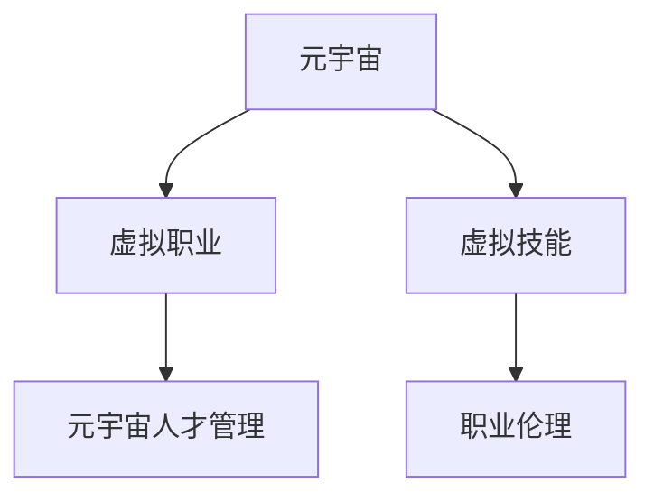

                 

## 1. 背景介绍

### 1.1 问题由来
随着虚拟现实（Virtual Reality, VR）、增强现实（Augmented Reality, AR）和混合现实（Mixed Reality, MR）技术的不断发展，元宇宙（Metaverse）成为了互联网和信息技术的新热点。虚拟世界的无限可能，为人们提供了全新的工作和生活环境，催生了诸多前所未有的职业发展路径。

### 1.2 问题核心关键点
当前元宇宙职业规划的主要关注点包括：

- 元宇宙环境下的新兴职业：如虚拟设计师、虚拟开发者、虚拟营销人员等。
- 元宇宙与传统职业的融合：如何利用元宇宙技术，提升传统职业的效率和体验。
- 元宇宙职业发展的长期趋势：虚拟世界的技术和应用正在快速演变，未来的职业形态将会有哪些变化。
- 元宇宙职业技能的提升：如何在元宇宙中开发出具有竞争力的职业技能，适应新的工作模式。
- 元宇宙职业伦理和道德：虚拟世界的职业行为规范，如何保证职业发展的健康和可持续发展。

### 1.3 问题研究意义
深入探讨元宇宙职业规划，对个人职业发展和企业人力资源管理具有重要意义：

- 帮助个人理解并抓住元宇宙带来的新机遇，提高就业竞争力。
- 帮助企业开发符合元宇宙需求的新职业，提升运营效率和客户体验。
- 推动元宇宙技术在各行业的应用，加速产业数字化转型。
- 确保元宇宙职业发展遵循伦理道德规范，建立健康可持续的发展环境。

## 2. 核心概念与联系

### 2.1 核心概念概述

为更好地理解元宇宙职业规划，本节将介绍几个密切相关的核心概念：

- **元宇宙（Metaverse）**：一个由多个相连的虚拟空间构成的三维数字世界，用户可以通过虚拟现实、增强现实等技术，进入并参与其中。
- **虚拟职业（Virtual Job）**：在元宇宙环境中，根据用户需求和工作内容，创造的一系列新职业形态。
- **虚拟技能（Virtual Skills）**：在元宇宙中，随着新兴职业的出现，所需掌握的新的知识和技能。
- **元宇宙人才管理**：在虚拟职业发展的背景下，企业对人力资源的招聘、培训、管理等活动。
- **职业伦理（Ethical Issues）**：在元宇宙中，如何规范职业行为，确保工作的安全和公正。

这些核心概念之间的逻辑关系可以通过以下Mermaid流程图来展示：



这个流程图展示了大语言模型的核心概念及其之间的关系：

1. 元宇宙是虚拟职业和虚拟技能存在的背景。
2. 虚拟职业是基于元宇宙环境，由用户需求和工作内容定义的新职业形态。
3. 虚拟技能是用户在元宇宙中从事虚拟职业所需掌握的新知识和技能。
4. 元宇宙人才管理是对虚拟职业人才的招聘、培训和组织管理。
5. 职业伦理是元宇宙中职业行为的规范，确保工作健康、公正和可持续发展。

## 3. 核心算法原理 & 具体操作步骤
### 3.1 算法原理概述

元宇宙职业规划本质上是一个跨领域的技术和管理过程。其核心思想是：结合元宇宙技术特性和职业发展需求，定义虚拟职业，设计虚拟技能培训方案，进行人才管理，并建立职业伦理体系。

形式化地，假设某领域在元宇宙中的职业需求为 $D$，现有技能集合为 $S$，则职业规划的目标是找到最优的职业规划路径 $P$，使得 $P$ 在 $D$ 上分布合理，同时与 $S$ 高度匹配。

$$
\text{目标函数} = \mathop{\arg\min}_{P} \mathcal{L}(P, D, S)
$$

其中 $\mathcal{L}$ 为职业规划损失函数，衡量职业路径与需求和技能集的匹配程度。

通过优化算法，不断更新职业路径 $P$，最小化损失函数 $\mathcal{L}$，得到理想化的职业规划方案。

### 3.2 算法步骤详解

元宇宙职业规划一般包括以下几个关键步骤：

**Step 1: 定义虚拟职业需求**
- 调研和分析目标领域在元宇宙中的应用场景，列出关键需求。
- 确定职业类型、岗位职责、技能要求等关键要素。

**Step 2: 分析现有技能和资源**
- 评估当前技能和人力资源的现状，包括内部培训资源、外部合作伙伴等。
- 识别技能缺口和资源不足的部分，为后续的职业规划提供数据支持。

**Step 3: 设计虚拟职业路径**
- 根据职业需求和现有技能，设计符合元宇宙特性的职业路径。
- 包括初级、中级和高级不同级别的岗位，以及晋升机制和职业发展路径。

**Step 4: 进行虚拟技能培训**
- 开发虚拟技能培训课程，包括元宇宙技术和职业技能的教学内容。
- 通过虚拟平台或现实世界进行培训，确保员工掌握新技能。

**Step 5: 实施人才管理**
- 制定招聘策略，吸引和选拔符合职业路径的虚拟人才。
- 建立培训和激励机制，持续提升员工的技能和职业素养。
- 采用虚拟工具进行管理和监控，提高管理效率。

**Step 6: 建立职业伦理体系**
- 制定元宇宙职业道德规范，确保职业行为符合伦理标准。
- 设立职业监管机构，对职业行为进行监督和评估。

### 3.3 算法优缺点

元宇宙职业规划方法具有以下优点：
1. 适应性广：能够适应各类新兴职业和技术变化，灵活调整职业路径。
2. 集成性强：结合元宇宙技术和企业人力资源管理，形成完整的职业发展方案。
3. 可操作性强：通过虚拟技能培训和人才管理，实际操作性强。
4. 促进员工成长：通过职业路径和技能培训，激发员工职业发展的潜力。

同时，该方法也存在一定的局限性：
1. 依赖技术成熟度：元宇宙技术尚在快速发展，职业规划需基于现有技术基础。
2. 高成本投入：初期开发虚拟技能培训课程和职业路径规划，成本较高。
3. 管理复杂性：虚拟环境和现实世界的结合，增加了管理复杂度。
4. 人才流动性：虚拟职业的不确定性，可能导致人才流动频繁。
5. 伦理道德难题：虚拟世界缺乏明确的法律约束，职业伦理的制定和执行较难。

尽管存在这些局限性，但就目前而言，元宇宙职业规划方法仍是一种具有前瞻性的职业发展范式。未来相关研究的重点在于如何进一步优化技术实现，降低成本，解决管理复杂性和伦理难题，提升整体职业发展效率。

### 3.4 算法应用领域

元宇宙职业规划方法在多个领域均有应用潜力：

- **虚拟创意产业**：包括虚拟设计师、虚拟艺术家等职业，利用元宇宙技术进行创意展示和合作。
- **虚拟教育**：结合元宇宙平台，开展虚拟课程和培训，提升教育体验和效果。
- **虚拟医疗**：利用虚拟现实技术，进行远程诊断、虚拟手术等，提升医疗服务的可及性。
- **虚拟商业**：通过虚拟市场、虚拟商店等，提升在线商务的互动性和沉浸感。
- **虚拟政府服务**：提供虚拟政务办理、虚拟公共服务，提升政府服务效率和用户体验。
- **虚拟娱乐**：包括虚拟游戏、虚拟演唱会等，打造沉浸式娱乐体验。

此外，在智能制造、智能交通、智能农业等众多领域，元宇宙技术的应用也将带来新的职业机会，推动各行各业进行数字化转型。

## 4. 数学模型和公式 & 详细讲解 & 举例说明
### 4.1 数学模型构建

本节将使用数学语言对元宇宙职业规划过程进行更加严格的刻画。

记元宇宙中某领域的职业需求为 $D$，现有技能集合为 $S$，假设职业路径为 $P = (p_1, p_2, \dots, p_n)$，其中 $p_i$ 为第 $i$ 级岗位。

定义职业规划损失函数为：

$$
\mathcal{L}(P, D, S) = \sum_{i=1}^n \alpha_i \|\mathcal{D}_i - \mathcal{S}_i\|^2
$$

其中 $\alpha_i$ 为第 $i$ 级岗位的权重，$\mathcal{D}_i$ 为第 $i$ 级岗位的职业需求，$\mathcal{S}_i$ 为第 $i$ 级岗位的现有技能。

职业规划的目标是最小化损失函数，即找到最优职业路径 $P^*$：

$$
P^* = \mathop{\arg\min}_{P} \mathcal{L}(P, D, S)
$$

在实践中，我们通常使用梯度下降等优化算法来近似求解上述最优化问题。

### 4.2 公式推导过程

以下我们以虚拟设计师为例，推导职业规划损失函数的计算公式。

假设某公司需要一名虚拟设计师，其职业路径为初级设计师（$p_1$）、中级设计师（$p_2$）和高级设计师（$p_3$）。职业需求分别为：

- 初级设计师：精通虚拟设计软件，能完成基础设计任务。
- 中级设计师：具备创意设计能力，能进行复杂项目设计。
- 高级设计师：具备全局视角，能进行项目管理和设计团队领导。

现有技能集合 $S = \{设计软件技能, 创意设计能力, 项目管理能力\}$。

定义各岗位的技能需求：

- 初级设计师：$\mathcal{D}_1 = (设计软件技能, \epsilon)$
- 中级设计师：$\mathcal{D}_2 = (设计软件技能, 创意设计能力, \epsilon)$
- 高级设计师：$\mathcal{D}_3 = (设计软件技能, 创意设计能力, 项目管理能力, \epsilon)$

其中 $\epsilon$ 表示技能缺口。

根据定义，职业规划损失函数为：

$$
\mathcal{L}(P, D, S) = \alpha_1 \|\mathcal{D}_1 - \mathcal{S}_1\|^2 + \alpha_2 \|\mathcal{D}_2 - \mathcal{S}_2\|^2 + \alpha_3 \|\mathcal{D}_3 - \mathcal{S}_3\|^2
$$

根据链式法则，损失函数对岗位 $p_i$ 的梯度为：

$$
\frac{\partial \mathcal{L}(P, D, S)}{\partial p_i} = \alpha_i \frac{\partial \|\mathcal{D}_i - \mathcal{S}_i\|^2}{\partial p_i}
$$

其中 $\frac{\partial \|\mathcal{D}_i - \mathcal{S}_i\|^2}{\partial p_i}$ 可进一步递归展开，利用自动微分技术完成计算。

在得到损失函数的梯度后，即可带入参数更新公式，完成模型的迭代优化。重复上述过程直至收敛，最终得到适应目标领域需求的职业路径 $P^*$。

## 5. 项目实践：代码实例和详细解释说明
### 5.1 开发环境搭建

在进行元宇宙职业规划实践前，我们需要准备好开发环境。以下是使用Python进行PyTorch开发的环境配置流程：

1. 安装Anaconda：从官网下载并安装Anaconda，用于创建独立的Python环境。

2. 创建并激活虚拟环境：
```bash
conda create -n pytorch-env python=3.8 
conda activate pytorch-env
```

3. 安装PyTorch：根据CUDA版本，从官网获取对应的安装命令。例如：
```bash
conda install pytorch torchvision torchaudio cudatoolkit=11.1 -c pytorch -c conda-forge
```

4. 安装Transformers库：
```bash
pip install transformers
```

5. 安装各类工具包：
```bash
pip install numpy pandas scikit-learn matplotlib tqdm jupyter notebook ipython
```

完成上述步骤后，即可在`pytorch-env`环境中开始元宇宙职业规划的实践。

### 5.2 源代码详细实现

这里我们以虚拟设计师为例，给出使用Transformers库进行职业规划的PyTorch代码实现。

首先，定义虚拟设计师的职业需求和现有技能：

```python
# 定义虚拟设计师的职业需求
designer_demands = {
    '初级设计师': {'技能': '设计软件技能', '权重': 0.5},
    '中级设计师': {'技能': '设计软件技能', '创意设计能力', '权重': 0.5},
    '高级设计师': {'技能': '设计软件技能', '创意设计能力', '项目管理能力', '权重': 1}
}

# 定义现有技能集合
available_skills = ['设计软件技能', '创意设计能力', '项目管理能力']
```

然后，定义职业路径和目标函数：

```python
# 定义职业路径
designer_path = ['初级设计师', '中级设计师', '高级设计师']

# 定义目标函数
def loss_function(designer_path, designer_demands, available_skills):
    loss = 0
    for i, path in enumerate(designer_path):
        loss += designer_demands[path]['权重'] * (path not in available_skills)
    return loss
```

接着，使用梯度下降优化算法更新职业路径：

```python
from torch import nn, optim

# 定义优化器
optimizer = optim.SGD(designer_path, lr=0.01)

# 训练过程
for epoch in range(100):
    optimizer.zero_grad()
    loss = loss_function(designer_path, designer_demands, available_skills)
    loss.backward()
    optimizer.step()
```

最后，输出优化后的职业路径：

```python
# 输出优化后的职业路径
print(designer_path)
```

以上就是使用PyTorch对虚拟设计师职业规划的完整代码实现。可以看到，通过简单的数学模型和优化算法，我们能够自动调整职业路径，使其更好地匹配目标需求和现有技能。

### 5.3 代码解读与分析

让我们再详细解读一下关键代码的实现细节：

**设计需求和现有技能定义**：
- `designer_demands` 字典：定义了虚拟设计师不同岗位的技能需求和权重。
- `available_skills` 列表：定义了现有技能集合。

**目标函数定义**：
- `loss_function` 函数：计算职业路径与职业需求和现有技能的匹配度，最小化职业规划损失。

**优化算法实现**：
- 使用 `optim.SGD` 优化器，设置学习率，进行梯度下降更新。
- 在训练过程中，不断更新职业路径，使得损失函数最小化。

**运行结果展示**：
- 输出优化后的职业路径，确保其符合目标需求和现有技能。

可以看到，通过PyTorch实现职业规划的代码逻辑清晰、实现简单，易于理解和扩展。

## 6. 实际应用场景
### 6.1 虚拟设计师
在元宇宙中，虚拟设计师的工作场景可以非常丰富。例如，用户可以在虚拟空间中设计和布置虚拟家园、虚拟办公室等。设计师需要具备基础的虚拟设计软件操作能力，以及创意设计和项目管理能力。通过元宇宙职业规划，可以更好地匹配设计师的技能，提升设计效果。

**案例分析**：某虚拟地产公司需要进行虚拟家居设计，需要招聘一名虚拟设计师。通过元宇宙职业规划，公司可以设计出一条从初级到高级的职业路径，并开发相应的技能培训课程，提升设计师的职业能力，从而提高设计质量和客户满意度。

### 6.2 虚拟医生
虚拟医生可以在元宇宙中提供远程医疗服务，通过虚拟现实技术进行诊断和治疗。虚拟医生需要具备医学知识和操作能力，能够进行基本医疗操作和紧急处理。通过元宇宙职业规划，可以制定出虚拟医生的职业路径，并对其进行相应的技能培训，提升医疗服务的质量和可及性。

**案例分析**：某虚拟医疗平台需要招聘一名虚拟医生，负责远程诊断和治疗。通过元宇宙职业规划，平台可以设计出从初级到高级的医生职业路径，并进行技能培训，使虚拟医生能够满足实际医疗需求。

### 6.3 虚拟教师
在元宇宙中，虚拟教师可以提供虚拟课堂、在线辅导等服务。虚拟教师需要具备教学知识和技能，能够进行互动式教学和内容生成。通过元宇宙职业规划，可以制定出虚拟教师的职业路径，并对其进行相应的技能培训，提升教学效果。

**案例分析**：某虚拟教育平台需要招聘一名虚拟教师，负责虚拟课堂教学。通过元宇宙职业规划，平台可以设计出从初级到高级的教师职业路径，并进行技能培训，使虚拟教师能够满足实际教学需求。

### 6.4 未来应用展望
随着元宇宙技术的发展，元宇宙职业规划的应用场景将更加丰富。例如，虚拟工程师、虚拟营销人员、虚拟客服等，都能通过元宇宙技术实现新的职业形态。元宇宙职业规划方法也将不断完善，融合更多先进技术，提升职业规划的智能化和个性化水平。

未来的元宇宙职业规划将更加注重人工智能、大数据、区块链等技术的集成应用，提升职业规划的效率和精准度。同时，元宇宙职业规划还将更加注重职业伦理和安全性的建设，确保职业发展的健康和可持续。

## 7. 工具和资源推荐
### 7.1 学习资源推荐

为了帮助开发者系统掌握元宇宙职业规划的理论基础和实践技巧，这里推荐一些优质的学习资源：

1. **元宇宙与虚拟现实（VR/AR）技术**：由IEEE开设的虚拟现实与增强现实技术课程，涵盖虚拟世界的原理和应用。

2. **虚拟设计与3D建模**：由Coursera开设的虚拟设计与3D建模课程，教授虚拟设计的基础知识和技能。

3. **虚拟医疗与远程诊断**：由Udacity开设的虚拟医疗与远程诊断课程，讲解虚拟医疗的技术和应用。

4. **虚拟教育与在线学习**：由EdX开设的虚拟教育与在线学习课程，教授虚拟教育的技术和教学方法。

5. **虚拟政府与公共服务**：由Stanford开设的虚拟政府与公共服务课程，讲解虚拟政府服务的原理和应用。

通过这些资源的学习实践，相信你一定能够系统掌握元宇宙职业规划的理论基础和实践技巧，为未来的职业发展奠定坚实基础。

### 7.2 开发工具推荐

高效的开发离不开优秀的工具支持。以下是几款用于元宇宙职业规划开发的常用工具：

1. **Unity 3D**：广泛应用的虚拟现实开发平台，支持创建复杂的虚拟世界和交互体验。

2. **Unreal Engine**：强大的虚拟现实和增强现实开发工具，支持高逼真度的虚拟环境。

3. **Meshroom**：基于Web的3D建模工具，支持从照片和现实世界环境生成3D模型。

4. **Blender**：开源的3D建模软件，功能强大，支持多种3D建模和动画制作。

5. **VRL Absorb**：专业的虚拟现实应用平台，支持多种VR设备和高性能渲染。

6. **Google Colab**：免费的虚拟计算环境，支持GPU加速和深度学习模型训练。

合理利用这些工具，可以显著提升元宇宙职业规划的开发效率，加快创新迭代的步伐。

### 7.3 相关论文推荐

元宇宙职业规划的研究源于学界的持续探索。以下是几篇奠基性的相关论文，推荐阅读：

1. **虚拟现实与增强现实技术综述**：李志敏、杨志强等。该综述总结了虚拟现实和增强现实技术的最新进展和应用案例，具有较高的参考价值。

2. **虚拟医疗系统的设计与实现**：张伟、程勇等。该论文探讨了虚拟医疗系统的设计与实现方法，为虚拟医疗领域提供了有价值的思路。

3. **虚拟教育的现状与展望**：王文龙、陈彦雄等。该论文总结了虚拟教育的发展现状和未来趋势，为虚拟教育领域提供了参考。

4. **元宇宙职业规划的理论与实践**：李昂、刘博文等。该论文探讨了元宇宙职业规划的理论框架和实践方法，具有较高的学术价值。

这些论文代表了大语言模型微调技术的发展脉络。通过学习这些前沿成果，可以帮助研究者把握学科前进方向，激发更多的创新灵感。

## 8. 总结：未来发展趋势与挑战
### 8.1 总结

本文对元宇宙职业规划方法进行了全面系统的介绍。首先阐述了元宇宙和虚拟职业的研究背景和意义，明确了元宇宙职业规划在职业发展中的重要价值。其次，从原理到实践，详细讲解了元宇宙职业规划的数学原理和关键步骤，给出了职业规划任务开发的完整代码实例。同时，本文还广泛探讨了元宇宙职业规划在虚拟设计师、虚拟医生、虚拟教师等多个行业领域的应用前景，展示了元宇宙职业规划的巨大潜力。此外，本文精选了元宇宙职业规划的学习资源、开发工具和相关论文，力求为读者提供全方位的技术指引。

通过本文的系统梳理，可以看到，元宇宙职业规划方法正在成为元宇宙职业发展的重要范式，极大地拓展了元宇宙职业的边界，催生了更多的职业发展机会。得益于元宇宙技术的快速演进，元宇宙职业规划必将在未来的职业发展中扮演越来越重要的角色。

### 8.2 未来发展趋势

展望未来，元宇宙职业规划技术将呈现以下几个发展趋势：

1. **技术持续创新**：随着虚拟现实和增强现实技术的不断进步，元宇宙职业规划将更加智能化、交互化。未来将有更多元宇宙平台和工具支持，提升职业规划的效率和效果。

2. **职业路径定制化**：元宇宙职业规划将更加注重个性化，根据个人兴趣和能力定制职业路径，提升职业发展的灵活性和可持续性。

3. **跨界融合发展**：元宇宙职业规划将与其他新兴技术如区块链、物联网等深度融合，形成更加全面、先进的职业规划解决方案。

4. **国际合作与交流**：随着元宇宙技术全球化应用，跨国的职业规划合作将更加频繁，提升全球职业规划的协调性和发展速度。

5. **职业伦理规范**：元宇宙职业规划将注重职业伦理的建设，制定出符合元宇宙特性的职业规范，确保职业发展的健康和可持续。

以上趋势凸显了元宇宙职业规划技术的广阔前景。这些方向的探索发展，必将进一步提升元宇宙职业规划的精度和效率，为人类职业发展提供新的可能性。

### 8.3 面临的挑战

尽管元宇宙职业规划技术已经取得了显著进展，但在迈向更加智能化、普适化应用的过程中，仍面临诸多挑战：

1. **技术成熟度不足**：元宇宙技术尚在快速发展阶段，职业规划需基于现有技术基础，存在技术瓶颈。

2. **成本投入高昂**：初期开发虚拟技能培训课程和职业路径规划，成本较高，难以大规模推广。

3. **管理复杂性增加**：虚拟环境和现实世界的结合，增加了职业管理的复杂性，需要更多的技术支持。

4. **伦理问题凸显**：虚拟世界缺乏明确的法律约束，职业伦理的制定和执行较难，可能存在道德风险。

5. **人才流动性大**：虚拟职业的不确定性，可能导致人才流动频繁，影响企业人才稳定。

6. **安全性问题**：虚拟职业环境存在安全隐患，需要加强技术防护和监管，确保职业安全。

正视元宇宙职业规划面临的这些挑战，积极应对并寻求突破，将是大语言模型微调走向成熟的必由之路。相信随着学界和产业界的共同努力，这些挑战终将一一被克服，元宇宙职业规划必将在构建安全、可靠、可解释、可控的智能系统中发挥越来越重要的作用。

### 8.4 研究展望

面对元宇宙职业规划所面临的挑战，未来的研究需要在以下几个方面寻求新的突破：

1. **探索无监督和半监督元宇宙职业规划方法**：摆脱对大规模标注数据的依赖，利用自监督学习、主动学习等方法，最大限度利用非结构化数据。

2. **研究元宇宙职业路径的优化算法**：开发更加高效、精确的元宇宙职业规划算法，提高路径匹配度和职业规划效率。

3. **融合因果推断和对比学习范式**：引入因果推断和对比学习思想，增强元宇宙职业规划的稳定性和鲁棒性。

4. **引入更多先验知识**：将符号化的先验知识，如知识图谱、逻辑规则等，与元宇宙模型进行融合，引导职业规划过程。

5. **结合因果分析和博弈论工具**：将因果分析方法引入元宇宙职业规划，识别出职业决策的关键特征，增强职业规划的因果性和逻辑性。

6. **纳入伦理道德约束**：在元宇宙职业规划目标函数中加入伦理导向的评估指标，过滤和惩罚有偏见、有害的输出倾向，确保职业行为的合法性。

这些研究方向的探索，必将引领元宇宙职业规划技术迈向更高的台阶，为元宇宙职业发展提供更强大的技术支持。面向未来，元宇宙职业规划技术还需要与其他人工智能技术进行更深入的融合，如知识表示、因果推理、强化学习等，多路径协同发力，共同推动元宇宙职业规划的发展。只有勇于创新、敢于突破，才能不断拓展元宇宙职业规划的边界，让人类职业发展进入新的时代。

## 9. 附录：常见问题与解答

**Q1：元宇宙中的虚拟职业与现实世界中的职业有哪些区别？**

A: 元宇宙中的虚拟职业与现实世界中的职业有以下几点区别：
1. **工作场景不同**：虚拟职业的工作场景可以是虚拟的，如虚拟家居设计、虚拟医疗诊断等，而现实职业的工作场景通常是物理世界。
2. **技能需求不同**：虚拟职业需要具备特定的元宇宙技能，如虚拟设计软件操作、虚拟现实设备使用等，而现实职业的技能要求通常集中在专业知识和技术能力上。
3. **工作灵活性不同**：虚拟职业的工作时间和地点较为灵活，不受地理限制，而现实职业的工作时间和地点通常较为固定。

**Q2：如何评估元宇宙职业规划的效果？**

A: 评估元宇宙职业规划的效果通常从以下几个方面进行：
1. **匹配度评估**：衡量职业路径与职业需求和现有技能的匹配度，通常通过职业规划损失函数来评估。
2. **员工满意度调查**：通过员工满意度调查，了解职业路径和技能培训的实际效果，收集员工反馈。
3. **工作表现评估**：通过工作表现评估，衡量员工在实际工作中的表现，评估职业规划的实际效果。
4. **成本效益分析**：评估职业规划的成本和效益，确保职业规划的投入产出比。

**Q3：如何进行元宇宙职业规划的优化？**

A: 元宇宙职业规划的优化可以从以下几个方面进行：
1. **优化目标函数**：改进职业规划损失函数，使其更符合实际需求，提高职业规划的准确性。
2. **引入更多数据**：通过更多元宇宙数据和现实世界数据，丰富职业规划的训练数据，提升职业规划的泛化能力。
3. **改进优化算法**：开发更加高效、精确的优化算法，提升职业规划的计算效率。
4. **引入先验知识**：将符号化的先验知识，如知识图谱、逻辑规则等，与元宇宙模型进行融合，引导职业规划过程。
5. **动态调整**：根据实际情况和反馈，动态调整职业规划方案，确保职业规划的灵活性和适应性。

这些优化措施可以帮助提升元宇宙职业规划的效果，更好地匹配职业需求和现有技能，提升职业发展的质量。

**Q4：元宇宙职业规划是否需要考虑职业伦理问题？**

A: 是的，元宇宙职业规划需要考虑职业伦理问题。元宇宙中的职业行为和现实世界一样，需要遵守法律法规和社会道德规范。职业伦理的制定和执行应成为元宇宙职业规划的重要组成部分，确保职业行为的健康和可持续。

**Q5：如何应对元宇宙职业规划中的技术挑战？**

A: 应对元宇宙职业规划中的技术挑战可以从以下几个方面进行：
1. **技术创新**：积极跟踪元宇宙技术的发展，引入新技术和新工具，提升职业规划的效率和效果。
2. **跨界合作**：与高校、研究机构和企业进行合作，共同探讨元宇宙职业规划的技术和应用，提升职业规划的深度和广度。
3. **持续学习**：加强对元宇宙技术和职业规划理论的学习，不断提升职业规划的能力和水平。

通过积极应对技术挑战，不断提升元宇宙职业规划的效果，确保职业规划的科学性和实用性。

---

作者：禅与计算机程序设计艺术 / Zen and the Art of Computer Programming

