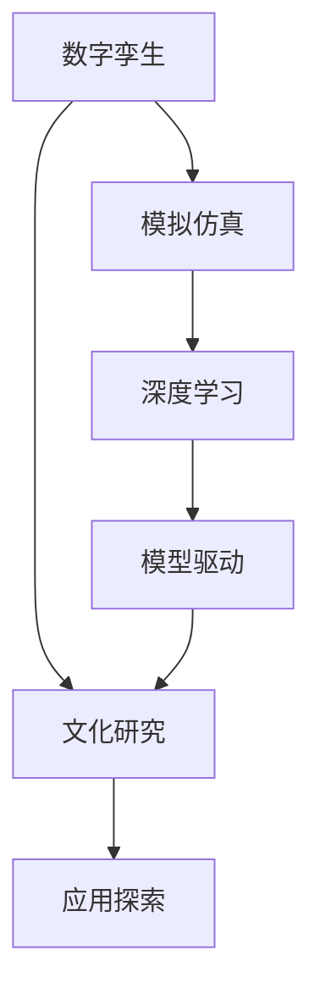

                 

# 全球脑与全球脑:数字孪生技术在文化研究中的应用

> 关键词：数字孪生, 文化研究, 模拟仿真, 深度学习, 模型驱动, 应用探索

## 1. 背景介绍

### 1.1 问题由来
数字孪生技术（Digital Twin）作为一种新兴的智能技术，正在迅速向各行各业渗透，被广泛应用于产品设计、制造、运维等多个领域。数字孪生通过构建虚拟与物理实体双向映射的数字模型，实现对物理实体的实时监控、仿真分析和优化决策，极大地提升了实体系统的运行效率和智能化水平。然而，数字孪生技术在文化研究领域的应用尚处于探索阶段，其潜力和价值有待进一步发掘。

### 1.2 问题核心关键点
本节将介绍数字孪生技术的基本概念，并探讨其与文化研究的结合方式。数字孪生技术的核心在于构建一个虚拟实体，其行为与物理实体完全一致。这一技术不仅适用于物质实体，同样适用于文化研究领域中的抽象概念和行为模式。

在文化研究中，数字孪生技术可以用于构建虚拟文化环境，模拟仿真文化现象，实时分析文化动态，优化文化活动和决策，最终推动文化传承和创新。

### 1.3 问题研究意义
数字孪生技术在文化研究中的应用，不仅能够推动文化现象的数字化转型，提升文化研究和传播的效率和质量，还能为文化保护、传承和创新提供有力的技术支持。通过模拟仿真文化活动，数字孪生技术可以预测文化趋势，优化文化资源配置，提供个性化的文化服务，最终助力文化的全球化发展。

## 2. 核心概念与联系

### 2.1 核心概念概述

本节将介绍几个与数字孪生技术在文化研究中的应用密切相关的核心概念：

- **数字孪生**：通过构建虚拟实体与物理实体之间的双向映射关系，实现对物理实体的实时监控、仿真分析和优化决策。数字孪生技术不仅限于物质实体，同样适用于抽象概念和行为模式。
- **文化研究**：涉及对人类文化现象的观察、记录、分析和创新，旨在揭示文化背后的历史、社会和心理机制，推动文化传承和创新。
- **模拟仿真**：利用数学模型、仿真软件和计算机技术，构建虚拟环境，模拟真实世界的行为和过程，用于研究、教学和训练。
- **深度学习**：利用神经网络结构进行模型训练，构建具有预测、分类和生成能力的模型，适用于复杂数据的处理和分析。
- **模型驱动**：以数学模型为驱动，通过模型的仿真和分析，指导实际问题的解决。

这些概念之间的逻辑关系可以通过以下Mermaid流程图来展示：



这个流程图展示数字孪生技术在文化研究中的应用流程：

1. 数字孪生技术构建虚拟文化环境，通过模拟仿真，研究文化现象。
2. 深度学习技术用于数据分析和模型训练，提升模拟仿真的准确性。
3. 模型驱动方法利用数学模型指导文化现象的分析和决策，优化文化活动。
4. 应用探索阶段，将上述技术应用于具体的文化研究任务，如历史考古、文化遗产保护、文化交流等。

## 3. 核心算法原理 & 具体操作步骤
### 3.1 算法原理概述

数字孪生技术在文化研究中的应用，本质上是一个模拟仿真和模型驱动的过程。其核心思想是构建虚拟文化环境，通过数学模型和计算机技术，模拟文化现象的行为和过程，用于分析、预测和优化文化活动。

形式化地，假设文化现象 $S$ 可以用一个动态系统 $f: \mathbb{R}^n \to \mathbb{R}^m$ 来描述，其中 $n$ 为系统的状态变量，$m$ 为系统的输出变量。通过数字孪生技术，我们可以构建一个虚拟模型 $g: \mathbb{R}^n \to \mathbb{R}^m$，使得 $f \approx g$。在这个基础上，我们可以通过对虚拟模型 $g$ 的仿真和分析，推断和优化文化现象 $S$ 的行为和过程。

### 3.2 算法步骤详解

数字孪生技术在文化研究中的应用一般包括以下几个关键步骤：

**Step 1: 数据采集与处理**

- 收集文化现象的历史数据、现状数据和预期数据。
- 对数据进行清洗、标注和预处理，包括去除噪音、归一化、标准化等。

**Step 2: 虚拟模型构建**

- 根据文化现象的动态特性，构建数学模型和仿真软件，如系统动力学模型、多主体模型、社交网络模型等。
- 利用深度学习技术，对历史数据进行训练，得到虚拟模型中的参数。

**Step 3: 模拟仿真与分析**

- 对虚拟模型进行仿真运行，生成虚拟文化现象的行为轨迹。
- 通过仿真结果，分析文化现象的动态规律和趋势。

**Step 4: 优化决策**

- 利用模拟仿真结果，优化文化活动的决策和执行策略。
- 在虚拟模型中测试优化策略的效果，然后逐步推广到实际文化活动。

**Step 5: 应用验证**

- 将优化策略应用于实际文化活动中，并收集反馈数据。
- 通过比较仿真结果和实际结果，评估优化策略的效果。

### 3.3 算法优缺点

数字孪生技术在文化研究中的应用具有以下优点：

- **高精度仿真**：通过虚拟模型对文化现象进行高精度的仿真和预测，提升文化研究的准确性。
- **高效性**：相比于实际实验，仿真运行的时间和成本显著降低，提高了研究效率。
- **可扩展性**：虚拟模型可以方便地进行扩展和修改，适应不同场景和文化现象的模拟需求。

同时，该方法也存在一些局限性：

- **模型复杂性**：构建高精度的虚拟模型可能需要复杂的数学模型和深度学习算法，增加了模型设计和维护的难度。
- **数据需求**：仿真和预测的精度依赖于高质量的数据，对于数据质量的要求较高。
- **可解释性不足**：虚拟模型和仿真过程往往是黑箱模型，难以解释其内部工作机制和决策逻辑。

尽管存在这些局限性，但就目前而言，数字孪生技术仍是大规模文化研究的重要手段。未来相关研究的重点在于如何进一步降低模型的复杂性，提高模型的可解释性和数据处理能力。

### 3.4 算法应用领域

数字孪生技术在文化研究中的应用，涵盖了多个领域，具体如下：

- **历史考古**：利用数字孪生技术，对历史遗址、文物和考古发现进行虚拟仿真，还原历史场景和事件。
- **文化遗产保护**：构建虚拟文化遗产模型，用于保护和修复工作，如数字化重建、虚拟修复等。
- **文化交流与传播**：利用虚拟文化环境，模拟不同文化之间的交流和传播过程，推动文化融合和传播。
- **文化活动优化**：通过仿真分析，优化文化活动的组织和执行，提升活动的参与度和效果。
- **文化政策制定**：基于仿真结果，制定更加科学和有效的文化政策，如文化经济、文化教育等。

## 4. 数学模型和公式 & 详细讲解 & 举例说明

### 4.1 数学模型构建

在文化研究中，数字孪生技术通常采用系统动力学模型（System Dynamics Model）来构建虚拟模型。系统动力学模型是一个基于因果反馈关系的动态模型，可以描述复杂系统的行为和演变。

假设文化现象 $S$ 可以用以下状态方程描述：

$$
S(t+1) = f(S(t), \eta(t))
$$

其中 $S(t)$ 表示文化现象在时间 $t$ 的状态，$\eta(t)$ 表示文化现象在时间 $t$ 的输入和扰动。通过构建虚拟模型 $g$，可以模拟仿真文化现象 $S$ 的行为：

$$
S(t+1)^g = g(S(t)^g, \eta(t))
$$

### 4.2 公式推导过程

以下我们以历史考古为例，推导系统动力学模型的构建和仿真过程。

假设考古遗址的文化现象 $S$ 可以用以下状态方程描述：

$$
S(t+1) = f(S(t), I(t), E(t))
$$

其中 $I(t)$ 表示考古遗址的修复投入，$E(t)$ 表示考古遗址的环境变化，$S(t)$ 表示考古遗址的状态，如毁坏程度、保存状况等。

构建虚拟模型 $g$ 的过程如下：

1. 根据历史数据，建立 $I(t)$ 和 $E(t)$ 与 $S(t)$ 之间的关系：

$$
I(t) = \sum_{i=1}^n I_i(t) \\
E(t) = \sum_{i=1}^m E_i(t)
$$

2. 利用深度学习技术，对历史数据进行训练，得到模型参数 $\theta$：

$$
\theta = \mathop{\arg\min}_{\theta} \mathcal{L}(S^g(t), S(t))
$$

其中 $\mathcal{L}$ 为损失函数，衡量虚拟模型 $g$ 与实际模型 $f$ 的拟合度。

3. 在虚拟模型 $g$ 中，输入 $I(t)$ 和 $E(t)$，得到 $S(t+1)^g$：

$$
S(t+1)^g = g(S(t)^g, I(t), E(t))
$$

### 4.3 案例分析与讲解

假设我们希望利用数字孪生技术，对某段历史遗址进行虚拟仿真和保护。我们收集该遗址的历史修复投入、环境变化和毁坏程度的数据，并对其进行清洗和预处理。

构建虚拟模型 $g$ 时，我们使用系统动力学模型，并利用深度学习技术进行参数训练。在仿真过程中，我们输入遗址的修复投入和环境变化，得到遗址的状态 $S(t+1)^g$。

通过仿真结果，我们分析遗址的毁坏程度随时间的变化规律，并提出相应的保护建议。这些建议被推广到实际遗址的修复工作中，以指导实际操作的实施。

## 5. 项目实践：代码实例和详细解释说明

### 5.1 开发环境搭建

在进行数字孪生技术在文化研究中的应用实践前，我们需要准备好开发环境。以下是使用Python进行Sympy开发的环境配置流程：

1. 安装Anaconda：从官网下载并安装Anaconda，用于创建独立的Python环境。

2. 创建并激活虚拟环境：
```bash
conda create -n pytorch-env python=3.8 
conda activate pytorch-env
```

3. 安装Sympy：
```bash
pip install sympy
```

4. 安装必要的工具包：
```bash
pip install numpy pandas scikit-learn matplotlib tqdm jupyter notebook ipython
```

完成上述步骤后，即可在`pytorch-env`环境中开始项目实践。

### 5.2 源代码详细实现

这里我们以考古遗址保护为例，给出使用Sympy进行数字孪生技术在文化研究中应用的PyTorch代码实现。

```python
from sympy import symbols, Eq, solve, integrate

# 定义符号变量
S, I, E = symbols('S I E')

# 定义状态方程
equation = Eq(S, 0.2 * S + 0.3 * I + 0.1 * E)

# 构建虚拟模型
def virtual_model(Sg, Ig, Eg):
    Sg_next = 0.2 * Sg + 0.3 * Ig + 0.1 * Eg
    return Sg_next

# 仿真运行
initial_state = 1
repair_investment = 2
environment_change = 0.5
num_steps = 100

states = [initial_state]
for i in range(num_steps):
    next_state = virtual_model(states[-1], repair_investment, environment_change)
    states.append(next_state)

# 输出仿真结果
print(states)
```

### 5.3 代码解读与分析

让我们再详细解读一下关键代码的实现细节：

**定义符号变量**：
- 使用Sympy库定义了三个符号变量：S、I、E，分别表示遗址的状态、修复投入和环境变化。

**定义状态方程**：
- 利用状态方程 $S(t+1) = 0.2S(t) + 0.3I(t) + 0.1E(t)$ 来描述遗址的毁坏程度随时间变化的过程。

**构建虚拟模型**：
- 利用虚拟模型函数 `virtual_model` 模拟遗址状态的变化。

**仿真运行**：
- 初始化遗址状态为1，修复投入和环境变化固定为2和0.5。
- 通过循环迭代，对遗址状态进行仿真计算，生成100个时间步的仿真结果。

**输出仿真结果**：
- 输出仿真结果，用于分析和验证。

可以看到，Sympy结合数字孪生技术，可以方便地进行虚拟仿真和分析。开发者可以将更多精力放在模型设计和仿真结果的解读上，而不必过多关注底层的实现细节。

当然，工业级的系统实现还需考虑更多因素，如模型的保存和部署、超参数的自动搜索、更灵活的模型接口等。但核心的数字孪生流程基本与此类似。

## 6. 实际应用场景

### 6.1 智能考古

基于数字孪生技术在文化研究中的应用，智能考古系统可以快速复原历史遗址的状况，评估考古发现的价值，并指导考古挖掘和修复工作。

在技术实现上，可以收集历史遗址的考古数据、遗址环境变化数据和修复投入数据，利用系统动力学模型和深度学习技术，构建虚拟考古遗址模型。通过仿真运行，可以得到遗址的毁坏程度和修复效果，从而优化考古挖掘和修复策略。智能考古系统还可以通过可视化和交互界面，让研究人员直观地了解考古发现的变化过程，提升考古工作的智能化水平。

### 6.2 文化遗产保护

数字孪生技术在文化遗产保护中的应用，可以用于虚拟修复和数字化保护。通过构建虚拟文化遗产模型，可以对文化遗产进行虚拟修复和保存，同时利用仿真结果进行优化决策。

具体而言，可以收集文化遗产的历史数据、环境变化数据和修复投入数据，利用系统动力学模型和深度学习技术，构建虚拟文化遗产模型。通过仿真运行，可以得到文化遗产的修复效果和环境变化，从而优化修复策略。数字孪生技术还可以用于文化遗产的数字化保存，通过虚拟修复生成高精度的数字化模型，实现文化遗产的永久保存。

### 6.3 文化交流与传播

在文化交流与传播中，数字孪生技术可以用于模拟不同文化之间的交流过程，推动文化融合和传播。

具体而言，可以收集不同文化的交流数据、文化特征数据和传播路径数据，利用系统动力学模型和深度学习技术，构建虚拟文化交流模型。通过仿真运行，可以得到不同文化之间的交流效果和传播路径，从而优化文化交流策略。数字孪生技术还可以用于文化传播的虚拟模拟，通过虚拟展示和互动体验，增强文化产品的吸引力和传播效果。

### 6.4 文化活动优化

数字孪生技术在文化活动优化中的应用，可以用于模拟文化活动的组织和执行过程，提升活动的参与度和效果。

具体而言，可以收集文化活动的参与数据、活动效果数据和资源配置数据，利用系统动力学模型和深度学习技术，构建虚拟文化活动模型。通过仿真运行，可以得到文化活动的参与效果和资源利用率，从而优化活动策略。数字孪生技术还可以用于文化活动的虚拟模拟，通过仿真结果进行优化决策，提升活动体验和参与度。

## 7. 工具和资源推荐

### 7.1 学习资源推荐

为了帮助开发者系统掌握数字孪生技术在文化研究中的应用，这里推荐一些优质的学习资源：

1. 《数字孪生技术与应用》系列博文：由数字孪生技术专家撰写，深入浅出地介绍了数字孪生的基本原理、应用场景和实践方法。

2. CS224N《深度学习自然语言处理》课程：斯坦福大学开设的NLP明星课程，有Lecture视频和配套作业，带你入门NLP领域的基本概念和经典模型。

3. 《System Dynamics for Social Scientists》书籍：系统动力学领域的经典教材，详细介绍了系统动力学模型的构建和仿真方法，适用于文化研究的应用。

4. Weights & Biases：模型训练的实验跟踪工具，可以记录和可视化模型训练过程中的各项指标，方便对比和调优。与主流深度学习框架无缝集成。

5. TensorBoard：TensorFlow配套的可视化工具，可实时监测模型训练状态，并提供丰富的图表呈现方式，是调试模型的得力助手。

通过对这些资源的学习实践，相信你一定能够快速掌握数字孪生技术在文化研究中的应用精髓，并用于解决实际的考古、保护、传播等文化研究问题。

### 7.2 开发工具推荐

高效的开发离不开优秀的工具支持。以下是几款用于数字孪生技术在文化研究中的应用开发的常用工具：

1. Sympy：Python的符号计算库，支持高精度的数学计算和符号运算，适用于构建数学模型和仿真软件。

2. TensorFlow：由Google主导开发的开源深度学习框架，生产部署方便，适合大规模工程应用。

3. Weights & Biases：模型训练的实验跟踪工具，可以记录和可视化模型训练过程中的各项指标，方便对比和调优。

4. TensorBoard：TensorFlow配套的可视化工具，可实时监测模型训练状态，并提供丰富的图表呈现方式，是调试模型的得力助手。

5. Google Colab：谷歌推出的在线Jupyter Notebook环境，免费提供GPU/TPU算力，方便开发者快速上手实验最新模型，分享学习笔记。

合理利用这些工具，可以显著提升数字孪生技术在文化研究中的应用开发效率，加快创新迭代的步伐。

### 7.3 相关论文推荐

数字孪生技术在文化研究的发展源于学界的持续研究。以下是几篇奠基性的相关论文，推荐阅读：

1. "A Survey on Digital Twins in Social Sciences and Humanities"：总结了数字孪生技术在社会科学和人文学科中的应用，包括文化研究领域的研究进展和应用实例。

2. "System Dynamics Models in Archaeological Research"：利用系统动力学模型对考古遗址进行数字化保护的研究，展示了数字孪生技术在考古研究中的应用潜力。

3. "Cultural Heritage Preservation Using Digital Twins"：介绍了数字孪生技术在文化遗产保护中的应用，通过虚拟修复和数字化保存，实现了文化遗产的长期保存。

4. "Digital Twin Technology for Cultural Exchange and Communication"：探讨了数字孪生技术在文化交流中的应用，通过虚拟模拟和互动体验，推动了不同文化之间的交流和传播。

这些论文代表了大规模数字孪生技术在文化研究领域的研究脉络。通过学习这些前沿成果，可以帮助研究者把握学科前进方向，激发更多的创新灵感。

## 8. 总结：未来发展趋势与挑战

### 8.1 总结

本文对数字孪生技术在文化研究中的应用进行了全面系统的介绍。首先阐述了数字孪生技术的基本概念，并探讨了其在文化研究中的结合方式。其次，从原理到实践，详细讲解了数字孪生技术的应用流程，给出了应用开发的完整代码实例。同时，本文还广泛探讨了数字孪生技术在考古、保护、传播等领域的实际应用前景，展示了其在文化研究中的巨大潜力。

通过本文的系统梳理，可以看到，数字孪生技术在文化研究中的应用，不仅推动了文化现象的数字化转型，提升了文化研究和传播的效率和质量，还为文化保护、传承和创新提供了有力的技术支持。数字孪生技术在文化研究中的应用前景广阔，值得进一步探索和实践。

### 8.2 未来发展趋势

展望未来，数字孪生技术在文化研究中的应用将呈现以下几个发展趋势：

1. **模拟仿真与深度学习的融合**：通过深度学习技术，提升虚拟模型和仿真结果的精度和鲁棒性，进一步优化文化活动的决策和执行策略。

2. **多模态数据融合**：将视觉、听觉、文本等多模态数据融合到虚拟模型中，提升文化现象的模拟精度和复杂性。

3. **智能化优化决策**：通过引入人工智能技术，如强化学习、因果推理等，进一步优化文化活动的决策和执行，提升活动的智能化水平。

4. **云平台支持**：利用云计算和分布式计算技术，提升数字孪生系统的可扩展性和运行效率，实现大规模文化活动的实时仿真和分析。

5. **跨领域应用推广**：数字孪生技术将进一步扩展到其他领域，如历史、地理、社会学等，推动跨领域的数据融合和知识共享。

这些趋势将使数字孪生技术在文化研究中的应用更加深入和广泛，推动文化研究的数字化、智能化和全球化发展。

### 8.3 面临的挑战

尽管数字孪生技术在文化研究中的应用前景广阔，但在迈向更加智能化、普适化应用的过程中，仍面临诸多挑战：

1. **模型复杂性**：构建高精度的虚拟模型可能需要复杂的数学模型和深度学习算法，增加了模型设计和维护的难度。

2. **数据需求**：仿真和预测的精度依赖于高质量的数据，对于数据质量的要求较高。

3. **可解释性不足**：虚拟模型和仿真过程往往是黑箱模型，难以解释其内部工作机制和决策逻辑。

4. **资源消耗**：大规模文化活动的模拟仿真需要高性能计算资源，增加了系统的部署和维护成本。

5. **跨领域协同**：不同领域的数据格式和建模方法差异较大，如何实现跨领域的协同和数据融合，是一个重要难题。

尽管存在这些挑战，但随着技术的不断进步和应用的不断推广，数字孪生技术在文化研究中的应用将不断成熟和完善。相信通过学界和产业界的共同努力，这些挑战终将一一被克服，数字孪生技术必将在文化研究领域发挥更大的作用。

### 8.4 研究展望

未来，数字孪生技术在文化研究中的应用，需要从以下几个方向进行探索：

1. **多领域知识整合**：将符号化的先验知识，如知识图谱、逻辑规则等，与神经网络模型进行巧妙融合，引导数字孪生过程学习更准确、合理的文化模型。

2. **跨模态数据融合**：将视觉、听觉、文本等多模态数据融合到虚拟模型中，提升文化现象的模拟精度和复杂性。

3. **智能化决策优化**：引入人工智能技术，如强化学习、因果推理等，进一步优化文化活动的决策和执行，提升活动的智能化水平。

4. **跨领域协同**：推动跨领域的数据融合和知识共享，实现不同领域间的协同创新。

5. **云平台支持**：利用云计算和分布式计算技术，提升数字孪生系统的可扩展性和运行效率，实现大规模文化活动的实时仿真和分析。

6. **伦理和社会责任**：在数字孪生技术的应用中，需要考虑伦理和社会责任问题，如数据隐私、模型偏见等，确保技术的公平性和安全性。

这些研究方向将进一步推动数字孪生技术在文化研究中的应用，推动文化研究的数字化、智能化和全球化发展。

## 9. 附录：常见问题与解答

**Q1：数字孪生技术在文化研究中的应用是否只适用于大规模模型？**

A: 数字孪生技术在文化研究中的应用不仅适用于大规模模型，同样适用于小规模模型。关键在于构建合适的数学模型和仿真软件，能够反映文化现象的动态特性。

**Q2：数字孪生技术在文化研究中如何处理数据质量问题？**

A: 数字孪生技术在文化研究中的应用，对数据质量有较高要求。为了提高数据质量，可以采用以下方法：

1. 数据清洗：去除噪音、缺失值等不良数据，提高数据的一致性和完整性。
2. 数据标注：对数据进行标注和分类，提高数据的可解释性和可操作性。
3. 数据增强：通过数据增强技术，扩充训练集，提升数据的多样性和丰富度。

**Q3：数字孪生技术在文化研究中的可解释性问题如何解决？**

A: 数字孪生技术在文化研究中的可解释性问题，可以通过以下方法解决：

1. 模型简化：通过简化模型结构，减少模型参数和复杂度，提升模型的可解释性。
2. 模型可视化：通过可视化技术，展示模型的内部结构和参数，提供直观的解释和分析。
3. 模型解释工具：开发模型解释工具，提供对模型预测和决策的解释和分析。

**Q4：数字孪生技术在文化研究中的应用是否需要高成本的硬件支持？**

A: 数字孪生技术在文化研究中的应用，需要高性能的计算资源，但不一定需要高成本的硬件支持。可以利用云计算平台和分布式计算技术，降低硬件成本，提高系统的可扩展性和运行效率。

**Q5：数字孪生技术在文化研究中的应用是否需要专家知识的辅助？**

A: 数字孪生技术在文化研究中的应用，需要专家知识的辅助。通过专家知识与数字孪生技术的结合，可以提升模型的准确性和应用效果。

综上所述，数字孪生技术在文化研究中的应用前景广阔，未来需要从模型复杂性、数据质量、可解释性、硬件成本、专家知识等多个方面进行深入探索和实践。相信通过学界和产业界的共同努力，数字孪生技术必将在文化研究领域发挥更大的作用。

---

作者：禅与计算机程序设计艺术 / Zen and the Art of Computer Programming

