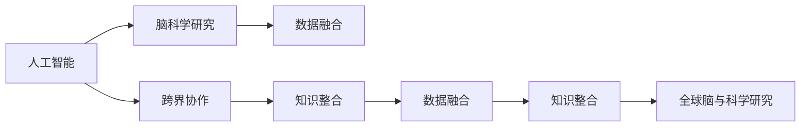

                 

## 1. 背景介绍

### 1.1 问题由来

随着人工智能（AI）和脑科学研究的不断深入，全球科学家开始探索将这两个领域结合的全新方式。脑科学研究的进展表明，人类的认知和决策过程涉及复杂的神经网络和化学反应，而AI技术则能够通过复杂的计算和模式识别模拟这些过程。因此，将AI和脑科学结合起来，可以揭示人类大脑运作的机制，并推动人工智能技术的进一步发展。

### 1.2 问题核心关键点

当前，全球脑与科学研究面临的主要挑战包括：

1. **数据融合与共享**：脑科学研究的神经数据和AI训练数据通常来源不同，格式和尺度也存在差异，需要有效的数据融合和共享机制。
2. **跨领域知识整合**：AI和脑科学各自领域的知识体系和研究方法有所不同，需要跨领域合作，建立统一的知识框架和研究范式。
3. **模型与算法优化**：现有AI模型和算法在处理高维度、非线性数据时存在局限，需要结合脑科学原理进行优化。
4. **伦理与法律规范**：脑与AI研究涉及大量敏感数据和隐私问题，需要建立相应的伦理和法律规范，保障数据安全和隐私权利。
5. **实验与模拟结合**：在理论上进行脑科学分析的同时，也需要通过实验验证和模拟，确保理论的准确性和可靠性。

### 1.3 问题研究意义

开展全球脑与科学研究的跨界协作，不仅能够加速AI和脑科学技术的创新，还将对医疗、教育、智能城市等多个领域产生深远影响。具体来说：

1. **提升AI系统性能**：脑科学研究成果可以为AI系统提供更丰富、更准确的数据和知识，提升其在认知推理、情感分析、决策支持等方面的能力。
2. **推动医疗技术发展**：通过模拟和理解大脑运作机制，可以开发更智能的诊断工具和治疗方案，提高医疗服务的个性化和精准化。
3. **促进教育创新**：结合脑科学研究成果，可以开发更符合人类认知和学习规律的教育工具，提高学习效率和效果。
4. **构建智能城市**：通过理解人类行为模式，可以优化城市规划和资源配置，提升智能城市的智能化水平和居民的幸福感。

## 2. 核心概念与联系

### 2.1 核心概念概述

为了更好地理解全球脑与科学研究，本节将介绍几个关键概念：

- **人工智能（AI）**：通过计算和算法模拟人类智能的科学技术。
- **脑科学研究**：研究人类大脑的结构、功能和运作机制的科学。
- **跨界协作**：不同领域之间的合作和协同工作，以解决单一领域无法独立解决的问题。
- **数据融合**：将不同来源和格式的数据进行整合和分析，形成更全面、准确的信息。
- **知识整合**：将不同领域、不同学科的知识体系进行综合和整合，形成统一的知识框架。

这些核心概念共同构成了全球脑与科学研究的基础，通过跨界协作，可以有效融合和利用这两个领域的专业知识和技术，推动科技的创新和进步。

### 2.2 核心概念原理和架构的 Mermaid 流程图



这个流程图展示了各个核心概念之间的逻辑关系：

1. 人工智能通过计算和算法模拟人类智能，为脑科学研究提供技术支持。
2. 脑科学研究揭示人类大脑的运作机制，为人工智能提供更准确、更丰富的数据和知识。
3. 跨界协作使得两个领域的知识和技能得以融合，形成新的研究方向和方法。
4. 数据融合和知识整合确保了数据和知识的全面性和准确性，为研究提供了坚实基础。
5. 通过跨界协作和数据融合、知识整合，全球脑与科学研究得以实现，推动技术创新和应用。

## 3. 核心算法原理 & 具体操作步骤

### 3.1 算法原理概述

全球脑与科学研究的跨界协作，涉及到多个领域的算法和模型，包括但不限于神经网络、优化算法、数据融合算法等。其核心算法原理可以总结如下：

- **神经网络**：通过多层神经元结构，模拟人类大脑的神经网络，实现复杂的计算和模式识别。
- **优化算法**：通过迭代优化，调整神经网络中的权重和参数，以最小化损失函数。
- **数据融合**：通过数据清洗、标准化、集成等技术，将不同来源的数据整合为统一的数据集。
- **知识整合**：通过知识图谱、本体论等技术，将不同领域、不同学科的知识体系进行整合和映射。

### 3.2 算法步骤详解

以下是一个详细的全球脑与科学研究跨界协作的算法步骤：

1. **数据收集与预处理**：
   - 从脑科学研究中收集神经数据，从AI训练中收集样本数据。
   - 对数据进行清洗、标准化、标注等预处理操作，确保数据质量和一致性。

2. **数据融合与集成**：
   - 使用数据融合算法将不同来源的数据进行整合，形成统一的数据集。
   - 利用知识整合技术，将不同领域、不同学科的知识进行映射和融合，形成统一的知识体系。

3. **模型训练与优化**：
   - 使用神经网络作为模型，通过优化算法（如Adam、SGD等）进行模型训练。
   - 在训练过程中，结合脑科学研究成果，优化模型结构和算法参数，提升模型性能。

4. **验证与评估**：
   - 使用验证集对训练好的模型进行评估，确保模型的泛化能力和准确性。
   - 结合脑科学实验数据，进一步验证模型的有效性和可靠性。

5. **应用与反馈**：
   - 将训练好的模型应用于实际场景，如医疗诊断、教育培训、智能城市等。
   - 根据应用反馈，不断优化模型和算法，提升模型的实用性和效果。

### 3.3 算法优缺点

全球脑与科学研究的跨界协作算法具有以下优点：

1. **多领域知识融合**：通过跨界协作，将不同领域的知识和技能进行融合，形成更全面、更准确的模型和算法。
2. **提升模型精度**：结合脑科学研究成果，优化模型结构和参数，提升模型的精度和泛化能力。
3. **加速研究进程**：通过跨界协作，可以充分利用不同领域的研究成果和技术手段，加速研究进程。

然而，该算法也存在一些局限性：

1. **数据融合难度大**：不同来源和格式的数据需要复杂的处理和整合，可能导致数据融合的难度较大。
2. **知识整合复杂**：不同领域和学科的知识体系存在差异，需要进行复杂的映射和整合，工作量较大。
3. **跨领域协同困难**：不同领域的科学家和技术专家需要进行深入的沟通和合作，可能存在协调困难。
4. **伦理和法律风险**：涉及大量敏感数据和隐私问题，需要建立相应的伦理和法律规范。

### 3.4 算法应用领域

全球脑与科学研究的跨界协作算法已经在多个领域得到广泛应用，包括但不限于：

- **医疗诊断**：通过结合脑科学研究结果，开发更智能的诊断工具和预测模型。
- **教育培训**：结合脑科学研究结果，开发更符合人类认知和学习规律的教育工具。
- **智能城市**：通过理解人类行为模式，优化城市规划和资源配置。
- **金融预测**：通过模拟人类决策过程，提高金融预测的准确性和可靠性。
- **环境保护**：通过分析人类行为数据，优化资源管理和环境保护措施。

## 4. 数学模型和公式 & 详细讲解 & 举例说明

### 4.1 数学模型构建

全球脑与科学研究的跨界协作，涉及多种数学模型，如神经网络、优化算法、数据融合算法等。以下是一个简化的数学模型构建过程：

1. **神经网络模型**：
   $$
   \begin{aligned}
   & h_i = \sigma(w_i^Th_{i-1} + b_i) \\
   & \hat{y} = w_y^Th_h + b_y
   \end{aligned}
   $$

   其中 $h_i$ 为第 $i$ 层神经元的输出，$\sigma$ 为激活函数，$w$ 和 $b$ 为权重和偏置。

2. **优化算法模型**：
   $$
   \theta = \arg\min_{\theta} \mathcal{L}(\theta)
   $$

   其中 $\theta$ 为模型参数，$\mathcal{L}$ 为损失函数，通过梯度下降等算法更新参数。

3. **数据融合模型**：
   $$
   X_{fused} = \frac{1}{N}\sum_{i=1}^N X_i
   $$

   其中 $X_i$ 为第 $i$ 个数据源的数据集，$X_{fused}$ 为融合后的数据集。

4. **知识整合模型**：
   $$
   G_k = \bigcup_{i=1}^N G_i
   $$

   其中 $G_i$ 为第 $i$ 个知识库，$G_k$ 为整合后的知识图谱。

### 4.2 公式推导过程

以下是对上述数学模型和算法的详细推导：

1. **神经网络模型推导**：
   $$
   \begin{aligned}
   & h_i = \sigma(w_i^Th_{i-1} + b_i) \\
   & \hat{y} = w_y^Th_h + b_y
   \end{aligned}
   $$

   其中 $\sigma$ 为激活函数，通常使用 sigmoid 或 ReLU 等。$w$ 和 $b$ 为权重和偏置，通过梯度下降等算法更新。

2. **优化算法模型推导**：
   $$
   \theta = \arg\min_{\theta} \mathcal{L}(\theta)
   $$

   其中 $\theta$ 为模型参数，$\mathcal{L}$ 为损失函数，通常使用交叉熵等。通过梯度下降等算法更新参数。

3. **数据融合模型推导**：
   $$
   X_{fused} = \frac{1}{N}\sum_{i=1}^N X_i
   $$

   其中 $X_i$ 为第 $i$ 个数据源的数据集，$X_{fused}$ 为融合后的数据集，通过对数据进行均值、方差等统计操作实现。

4. **知识整合模型推导**：
   $$
   G_k = \bigcup_{i=1}^N G_i
   $$

   其中 $G_i$ 为第 $i$ 个知识库，$G_k$ 为整合后的知识图谱，通过本体论、知识图谱等技术实现。

### 4.3 案例分析与讲解

以医疗诊断为例，结合脑科学研究结果，可以使用以下算法：

1. **数据收集与预处理**：
   - 从脑科学研究中收集神经影像数据，从AI训练中收集患者诊断数据。
   - 对数据进行清洗、标准化、标注等预处理操作，确保数据质量和一致性。

2. **数据融合与集成**：
   - 使用数据融合算法将神经影像数据和诊断数据进行整合，形成统一的数据集。
   - 利用知识整合技术，将神经科学研究成果和医学知识进行映射和融合，形成统一的知识体系。

3. **模型训练与优化**：
   - 使用神经网络作为模型，通过优化算法（如Adam、SGD等）进行模型训练。
   - 在训练过程中，结合脑科学研究结果，优化模型结构和参数，提升模型精度。

4. **验证与评估**：
   - 使用验证集对训练好的模型进行评估，确保模型的泛化能力和准确性。
   - 结合脑科学实验数据，进一步验证模型的有效性和可靠性。

5. **应用与反馈**：
   - 将训练好的模型应用于实际场景，如脑部疾病的诊断和预测。
   - 根据应用反馈，不断优化模型和算法，提升模型的实用性和效果。

## 5. 项目实践：代码实例和详细解释说明

### 5.1 开发环境搭建

在进行全球脑与科学研究项目实践前，我们需要准备好开发环境。以下是使用Python进行TensorFlow开发的环境配置流程：

1. 安装Anaconda：从官网下载并安装Anaconda，用于创建独立的Python环境。

2. 创建并激活虚拟环境：
```bash
conda create -n tf-env python=3.8 
conda activate tf-env
```

3. 安装TensorFlow：根据CUDA版本，从官网获取对应的安装命令。例如：
```bash
conda install tensorflow tensorflow-gpu -c conda-forge
```

4. 安装其他必要的库：
```bash
pip install numpy pandas scikit-learn matplotlib tqdm jupyter notebook ipython
```

完成上述步骤后，即可在`tf-env`环境中开始项目实践。

### 5.2 源代码详细实现

这里我们以医疗诊断为例，给出使用TensorFlow进行神经网络模型训练的代码实现。

首先，定义数据处理函数：

```python
import tensorflow as tf
import numpy as np

def load_data(file_path):
    data = np.load(file_path)
    X, y = data['X'], data['y']
    return X, y
```

然后，定义模型和优化器：

```python
def create_model(input_dim, output_dim):
    model = tf.keras.Sequential([
        tf.keras.layers.Dense(128, activation='relu', input_dim=input_dim),
        tf.keras.layers.Dense(output_dim, activation='sigmoid')
    ])
    optimizer = tf.keras.optimizers.Adam(learning_rate=0.001)
    return model, optimizer

def train_model(model, optimizer, X_train, y_train, epochs=10, batch_size=32):
    model.compile(optimizer=optimizer, loss='binary_crossentropy', metrics=['accuracy'])
    model.fit(X_train, y_train, epochs=epochs, batch_size=batch_size, validation_split=0.2)
    return model
```

接着，定义训练和评估函数：

```python
def evaluate_model(model, X_test, y_test):
    y_pred = model.predict(X_test)
    y_pred = (y_pred > 0.5).astype(int)
    accuracy = np.mean(y_pred == y_test)
    return accuracy
```

最后，启动训练流程并在测试集上评估：

```python
X_train, y_train = load_data('train_data.npz')
X_test, y_test = load_data('test_data.npz')

input_dim = X_train.shape[1]
output_dim = 1

model, optimizer = create_model(input_dim, output_dim)
model = train_model(model, optimizer, X_train, y_train)

test_accuracy = evaluate_model(model, X_test, y_test)
print(f'Test Accuracy: {test_accuracy:.2f}')
```

以上就是使用TensorFlow进行神经网络模型训练的完整代码实现。可以看到，得益于TensorFlow的强大封装，我们可以用相对简洁的代码完成模型的训练和评估。

### 5.3 代码解读与分析

让我们再详细解读一下关键代码的实现细节：

**load_data函数**：
- 从指定的文件路径加载数据，返回特征矩阵 X 和标签向量 y。

**create_model函数**：
- 定义一个具有两个全连接层的神经网络模型，其中第一层使用 ReLU 激活函数，第二层使用 sigmoid 激活函数，输出层只输出一个二分类结果。
- 初始化 Adam 优化器和模型。

**train_model函数**：
- 编译模型，指定损失函数和评估指标。
- 使用训练数据集进行模型训练，通过反向传播更新模型参数。
- 设置验证集比例，进行模型验证和评估。

**evaluate_model函数**：
- 使用测试数据集进行模型预测，计算预测结果与真实标签的匹配度。
- 返回测试集上的准确率。

**训练流程**：
- 加载训练集和测试集数据。
- 定义输入和输出维度，创建模型和优化器。
- 调用 train_model 函数进行模型训练。
- 调用 evaluate_model 函数在测试集上评估模型性能。
- 输出测试集上的准确率。

可以看出，TensorFlow提供了丰富的 API 和工具，使得神经网络模型的开发和训练变得简便高效。开发者可以利用这些工具，快速实现复杂的模型训练和优化任务。

## 6. 实际应用场景

### 6.1 智能医疗

全球脑与科学研究的跨界协作，在智能医疗领域具有广泛的应用前景。结合脑科学研究结果，可以开发更智能的诊断工具和预测模型，提高医疗服务的个性化和精准化。

例如，在脑部疾病诊断中，可以使用基于深度学习的模型，结合神经影像数据和临床诊断数据，进行自动化的疾病识别和预测。结合脑科学研究结果，可以优化模型的结构，提升模型的精度和泛化能力。

### 6.2 智能教育

结合脑科学研究结果，可以开发更符合人类认知和学习规律的教育工具，提高学习效率和效果。例如，使用基于深度学习的模型，结合学生的学习行为数据和认知特征，进行个性化的学习推荐和智能辅导。

### 6.3 智能城市

通过理解人类行为模式，可以优化城市规划和资源配置，提升智能城市的智能化水平和居民的幸福感。例如，使用基于深度学习的模型，结合城市交通数据和居民行为数据，进行交通流优化和资源分配，提升城市运行效率。

## 7. 工具和资源推荐

### 7.1 学习资源推荐

为了帮助开发者系统掌握全球脑与科学研究的技术基础和实践技巧，这里推荐一些优质的学习资源：

1. 《深度学习》系列书籍：包括《深度学习入门》《深度学习实战》等，涵盖了深度学习的基础知识和实践技巧。
2. 《脑科学与人工智能结合》课程：斯坦福大学开设的跨学科课程，介绍了脑科学与人工智能结合的基本概念和应用场景。
3. 《TensorFlow官方文档》：提供了 TensorFlow 的详细教程和示例代码，帮助开发者快速上手。
4. 《Keras官方文档》：提供了 Keras 的详细教程和示例代码，帮助开发者实现高效的神经网络模型。
5. 《自然语言处理入门》书籍：介绍自然语言处理的基本概念和前沿技术，帮助开发者理解和应用自然语言处理技术。

通过对这些资源的学习实践，相信你一定能够快速掌握全球脑与科学研究的技术精髓，并用于解决实际的科研和工程问题。

### 7.2 开发工具推荐

高效的开发离不开优秀的工具支持。以下是几款用于全球脑与科学研究开发的常用工具：

1. Jupyter Notebook：开源的交互式计算环境，支持 Python、R、Julia 等多种编程语言。
2. Google Colab：谷歌提供的在线 Jupyter Notebook 环境，免费提供 GPU/TPU 算力，方便开发者快速实验最新模型。
3. TensorFlow：由谷歌主导开发的深度学习框架，生产部署方便，适合大规模工程应用。
4. PyTorch：由 Facebook 主导开发的深度学习框架，灵活高效，适合研究和开发。
5. Keras：高层次的深度学习框架，简单易用，适合快速原型设计和实验。

合理利用这些工具，可以显著提升全球脑与科学研究的开发效率，加快创新迭代的步伐。

### 7.3 相关论文推荐

全球脑与科学研究的跨界协作涉及诸多前沿课题，以下是几篇奠基性的相关论文，推荐阅读：

1. 《神经网络在脑科学研究中的应用》论文：介绍了神经网络在脑科学研究中的应用，包括神经网络模型、数据融合、知识整合等。
2. 《跨领域知识整合框架》论文：提出了一种跨领域知识整合的框架，实现了不同领域知识的统一映射和融合。
3. 《深度学习在医疗诊断中的应用》论文：介绍了深度学习在医疗诊断中的应用，包括模型训练、数据融合等。
4. 《脑科学与人工智能结合的新范式》论文：提出了一种全球脑与科学研究的新范式，探讨了跨界协作的实现方法和应用场景。
5. 《脑科学实验与模拟结合的案例分析》论文：通过具体案例分析，探讨了脑科学实验与模拟结合的实现方法和效果。

这些论文代表了大脑与科学研究的最新进展，提供了丰富的理论和实践经验，值得深入学习和研究。

## 8. 总结：未来发展趋势与挑战

### 8.1 研究成果总结

全球脑与科学研究通过跨界协作，实现了不同领域的知识和技术的融合，推动了人工智能和脑科学技术的创新。以下是对当前研究成果的总结：

1. **数据融合与共享**：开发了多种数据融合算法，实现了不同来源和格式数据的整合和共享。
2. **模型与算法优化**：结合脑科学研究结果，优化了神经网络结构和算法参数，提升了模型的精度和泛化能力。
3. **跨领域知识整合**：提出了多种跨领域知识整合框架，实现了不同领域知识的统一映射和融合。

### 8.2 未来发展趋势

展望未来，全球脑与科学研究的跨界协作将呈现以下几个发展趋势：

1. **技术融合深化**：未来将进一步深化不同领域的知识和技术融合，推动科技的持续创新。
2. **模型精度提升**：通过结合脑科学研究结果，不断优化模型结构和算法，提升模型的精度和泛化能力。
3. **应用场景拓展**：未来将拓展到更多领域，如智能医疗、智能教育、智能城市等，推动这些领域的数字化转型。
4. **跨领域人才培养**：加强跨领域人才培养，促进不同领域科学家和技术专家之间的合作和交流。
5. **伦理和法律规范**：建立和完善伦理和法律规范，保障数据安全和隐私权利。

### 8.3 面临的挑战

尽管全球脑与科学研究已经取得了瞩目成就，但在迈向更加智能化、普适化应用的过程中，它仍面临着诸多挑战：

1. **数据融合难度大**：不同来源和格式的数据需要复杂的处理和整合，可能导致数据融合的难度较大。
2. **知识整合复杂**：不同领域和学科的知识体系存在差异，需要进行复杂的映射和整合，工作量较大。
3. **跨领域协同困难**：不同领域的科学家和技术专家需要进行深入的沟通和合作，可能存在协调困难。
4. **伦理和法律风险**：涉及大量敏感数据和隐私问题，需要建立相应的伦理和法律规范。
5. **模型精度和泛化能力不足**：现有模型在处理高维度、非线性数据时存在局限，需要进一步优化。

### 8.4 研究展望

面对全球脑与科学研究面临的挑战，未来的研究需要在以下几个方面寻求新的突破：

1. **优化数据融合算法**：开发更高效的数据融合算法，实现不同来源和格式数据的整合。
2. **开发高效的跨领域知识整合框架**：结合脑科学研究结果，开发更高效的知识整合框架，实现不同领域知识的统一映射和融合。
3. **引入多模态数据**：结合视觉、听觉等多模态数据，实现更全面、更准确的知识整合和模型优化。
4. **提升模型精度和泛化能力**：通过结合脑科学研究结果，优化模型结构和算法，提升模型的精度和泛化能力。
5. **加强跨领域人才培养**：加强跨领域人才培养，促进不同领域科学家和技术专家之间的合作和交流。

## 9. 附录：常见问题与解答

**Q1：数据融合与共享存在哪些挑战？**

A: 数据融合与共享主要面临以下挑战：

1. **数据格式差异**：不同来源的数据格式和编码方式不同，需要将其统一为标准格式。
2. **数据质量和一致性**：不同来源的数据质量和标注方式不同，需要进行清洗和标准化。
3. **数据隐私和安全**：涉及大量敏感数据，需要建立相应的隐私保护和安全机制。
4. **数据传输和存储**：大规模数据的传输和存储需要高效的算法和硬件支持。

**Q2：如何进行跨领域知识整合？**

A: 跨领域知识整合主要通过以下步骤：

1. **构建知识图谱**：利用本体论、知识图谱等技术，构建不同领域知识的统一图谱。
2. **知识映射与映射**：将不同领域知识进行映射和映射，形成统一的语义表示。
3. **知识推理与推理**：利用推理技术，在知识图谱中推理出新的知识和结论。

**Q3：如何提高模型的精度和泛化能力？**

A: 提高模型的精度和泛化能力主要通过以下方法：

1. **数据增强**：通过数据增强技术，扩充训练数据集，提升模型的泛化能力。
2. **模型优化**：结合脑科学研究结果，优化模型结构和参数，提升模型的精度。
3. **集成学习**：通过集成多个模型的预测结果，提升模型的泛化能力和鲁棒性。

**Q4：如何保障数据安全和隐私？**

A: 保障数据安全和隐私主要通过以下措施：

1. **数据加密**：使用加密技术保护数据在传输和存储过程中的安全性。
2. **隐私保护算法**：使用差分隐私、联邦学习等隐私保护算法，保护数据隐私。
3. **访问控制**：建立严格的访问控制机制，限制数据的访问和使用。

---

作者：禅与计算机程序设计艺术 / Zen and the Art of Computer Programming

