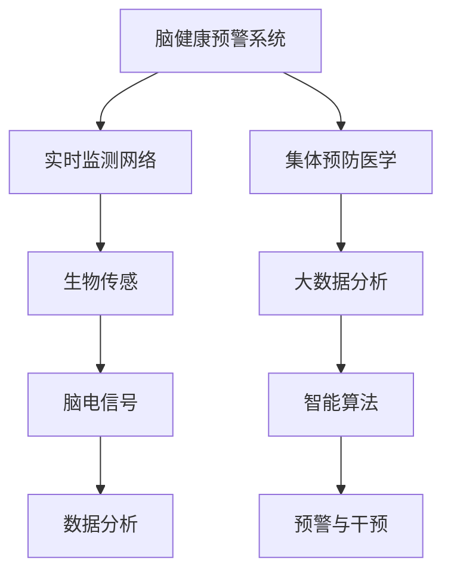

                 

# 全球脑健康预警系统:集体预防医学的实时监测网络

> 关键词：脑健康预警系统,集体预防医学,实时监测网络,生物传感,脑电信号,智能算法,数据分析

## 1. 背景介绍

### 1.1 问题由来
随着全球人口老龄化和慢性疾病发病率逐年升高，脑健康问题愈发受到重视。阿尔茨海默病、血管性认知障碍、睡眠障碍等脑相关疾病严重影响了患者的生活质量和生命预期。然而，脑健康问题的早期发现和及时干预，目前仍面临诊断困难、成本高昂、干预效果差等挑战。因此，开发全球脑健康预警系统，通过实时监测和智能分析，有望在脑健康问题的预防和治疗中发挥重要作用。

### 1.2 问题核心关键点
全球脑健康预警系统是一个基于生物传感和智能算法的实时监测网络。其核心在于通过各种生物传感设备，实时采集用户的脑电信号、生理参数、环境行为数据，结合大数据分析和机器学习技术，预测用户脑健康状况，及时发出预警，并提供个性化干预建议。这一系统的构建，将极大提升脑健康问题的早期发现和治疗效率，降低社会医疗成本，推动集体预防医学的全面发展。

## 2. 核心概念与联系

### 2.1 核心概念概述

为更好地理解全球脑健康预警系统，本节将介绍几个密切相关的核心概念：

- 脑健康预警系统(Brain Health Warning System)：通过实时监测用户的脑电信号、生理参数、环境行为数据，预测其脑健康状况，及时预警并提供干预建议的系统。
- 集体预防医学(Population-based Preventive Medicine)：针对人群健康问题，通过数据驱动的方法，提前预防和干预，提升公共健康水平。
- 实时监测网络(Real-time Monitoring Network)：由各种生物传感设备组成，实时采集和传输用户健康数据的网络。
- 生物传感(Biosensor)：通过非侵入性的方式，监测人体生理和生化参数的技术。
- 脑电信号(EEG)：通过头皮电极或植入式电极，捕捉大脑神经元活动产生的电信号。
- 智能算法(Intelligent Algorithm)：利用机器学习、深度学习等技术，对采集到的数据进行分析和预测。
- 大数据分析(Big Data Analysis)：对海量数据进行存储、清洗、分析和可视化的技术。

这些核心概念之间的逻辑关系可以通过以下Mermaid流程图来展示：



这个流程图展示了大健康预警系统的核心概念及其之间的关系：

1. 脑健康预警系统通过实时监测网络收集用户健康数据。
2. 生物传感技术提供多样化的数据采集方式，如脑电信号。
3. 大数据分析技术处理和存储采集到的数据。
4. 智能算法进行数据分析和模型预测。
5. 预警与干预模块根据预测结果，向用户或医生发出预警并提出建议。

这些概念共同构成了全球脑健康预警系统的技术和应用框架，使其能够有效监测和管理脑健康问题。

## 3. 核心算法原理 & 具体操作步骤
### 3.1 算法原理概述

全球脑健康预警系统的核心算法原理主要包括数据采集、数据处理、模型预测和预警干预四个部分：

- 数据采集：通过各种生物传感设备，实时采集用户的脑电信号、生理参数、环境行为数据。
- 数据处理：对采集到的数据进行清洗、标准化和特征提取，形成适合分析的样本。
- 模型预测：利用机器学习和深度学习模型，对样本进行分类、回归或聚类分析，预测用户脑健康状况。
- 预警干预：根据预测结果，生成预警信息和干预建议，通过多种渠道传递给用户或医疗专业人员。

### 3.2 算法步骤详解

全球脑健康预警系统的操作流程如下：

1. **数据采集**：
   - 用户佩戴生物传感设备，实时采集脑电信号、心率、血压等生理参数。
   - 使用摄像头、位置传感器等采集环境行为数据。

2. **数据预处理**：
   - 对采集到的原始数据进行清洗、去噪、滤波等处理，提高数据质量。
   - 对脑电信号进行特征提取，如功率谱、频率成分、波形形态等。
   - 将生理参数和环境行为数据进行标准化处理，统一数据格式。

3. **模型训练**：
   - 收集有标签的历史数据，分割为训练集和验证集。
   - 选择合适的机器学习或深度学习模型，如支持向量机(SVM)、随机森林(Random Forest)、卷积神经网络(CNN)、长短期记忆网络(LSTM)等。
   - 在训练集上进行模型训练，调整超参数，优化模型性能。
   - 在验证集上评估模型效果，确保模型泛化能力。

4. **实时监测与预警**：
   - 将训练好的模型部署到实时监测系统中。
   - 系统实时采集用户数据，进行特征提取和模型预测。
   - 根据预测结果，判断脑健康状况是否异常，发出预警。
   - 预警信息通过手机、PC、APP等渠道传递给用户或医生。

5. **干预建议**：
   - 根据预警结果，生成个性化干预建议，如调整作息、改善饮食、增加锻炼等。
   - 将干预建议通过上述渠道传递给用户。

### 3.3 算法优缺点

全球脑健康预警系统具有以下优点：
1. 实时监测：通过实时采集和分析用户数据，可及早发现脑健康问题，提升预防和治疗效果。
2. 数据驱动：利用大数据分析技术，从海量数据中提取有价值的健康信息，减少主观判断误差。
3. 个性化干预：结合用户生理和环境数据，提供针对性的健康建议，提高用户依从性。
4. 集体预防：通过大规模数据积累，研究脑健康问题规律，提升整体公共健康水平。

同时，该系统也存在一些局限性：
1. 数据隐私：用户数据需高度安全存储和传输，涉及隐私保护问题。
2. 设备成本：生物传感设备的成本较高，普及度较低。
3. 数据质量：数据采集过程中可能存在噪声、缺失等问题，影响分析结果。
4. 模型泛化：不同用户之间的生理和环境差异较大，单一模型难以全面覆盖。
5. 预警准确：模型的预警结果可能受多种因素影响，存在一定误报或漏报风险。

尽管存在这些局限性，但全球脑健康预警系统仍是大数据时代预防医学的重要工具，有望在未来脑健康问题的管理和预防中发挥更大作用。

### 3.4 算法应用领域

全球脑健康预警系统已经在多个领域得到了初步应用，涵盖了从科研到临床的各个环节，具体如下：

1. **科研**：
   - 脑科学研究：通过实时监测和分析脑电信号，研究大脑功能和疾病机制。
   - 认知科学：通过大规模数据积累，分析影响认知能力的因素，提出改善建议。

2. **临床**：
   - 脑疾病早期发现：通过实时监测脑电信号和生理参数，及时发现阿尔茨海默病、睡眠障碍等脑疾病早期症状。
   - 个性化干预：结合用户行为数据，提供针对性的健康建议，改善生活习惯。
   - 心理治疗：通过分析脑电信号和环境行为数据，评估心理健康状况，辅助心理治疗。

3. **社区**：
   - 健康管理：提供健康监测服务，帮助社区居民预防和改善慢性疾病。
   - 公共卫生：通过大数据分析，研究脑健康问题的流行趋势，制定公共卫生政策。

4. **产业**：
   - 医疗设备：提供实时监测设备，如脑电信号采集器、智能手环等。
   - 智能家居：结合环境传感器，提升居家健康管理水平。
   - 健康保险：通过健康数据分析，降低医疗费用，优化保险产品设计。

未来，随着技术不断进步，全球脑健康预警系统将进一步拓展应用场景，成为预防医学和公共卫生领域的重要工具。

## 4. 数学模型和公式 & 详细讲解 & 举例说明

### 4.1 数学模型构建

全球脑健康预警系统的数学模型主要包括以下几个部分：

1. **数据采集模型**：
   - 脑电信号采集：使用高密度电极记录头皮脑电信号，表示为 $X = \{X_i\}_{i=1}^N$，其中 $X_i = [x_{i1}, x_{i2}, ..., x_{iT}]$ 表示第 $i$ 个电极在 $T$ 个时间点的脑电信号。
   - 生理参数采集：使用传感器记录心率、血压等生理参数，表示为 $Y = \{Y_j\}_{j=1}^M$，其中 $Y_j$ 表示第 $j$ 个生理参数。
   - 环境行为数据采集：使用摄像头、位置传感器等记录用户行为数据，表示为 $Z = \{Z_k\}_{k=1}^K$，其中 $Z_k$ 表示第 $k$ 个环境行为参数。

2. **数据预处理模型**：
   - 数据清洗：去除噪声、缺失值，表示为 $C = [C_1, C_2, ..., C_N]$，其中 $C_i$ 表示经过清洗后的第 $i$ 个样本。
   - 数据标准化：将不同尺度的数据归一化，表示为 $S = [S_1, S_2, ..., S_N]$，其中 $S_i$ 表示第 $i$ 个样本的标准化数据。
   - 特征提取：从数据中提取有用的特征，表示为 $F = [F_1, F_2, ..., F_N]$，其中 $F_i$ 表示第 $i$ 个样本的特征向量。

3. **模型预测模型**：
   - 分类模型：使用支持向量机(SVM)、随机森林(Random Forest)等分类算法，预测脑健康状况，表示为 $P = [P_1, P_2, ..., P_N]$，其中 $P_i$ 表示第 $i$ 个样本的预测概率。
   - 回归模型：使用线性回归、LSTM等回归算法，预测脑健康指标，表示为 $R = [R_1, R_2, ..., R_N]$，其中 $R_i$ 表示第 $i$ 个样本的预测值。

4. **预警与干预模型**：
   - 预警阈值：根据专家经验或历史数据，设定脑健康预警阈值，表示为 $T = [T_1, T_2, ..., T_N]$，其中 $T_i$ 表示第 $i$ 个样本的预警阈值。
   - 干预策略：根据预警结果，生成个性化干预建议，表示为 $I = [I_1, I_2, ..., I_N]$，其中 $I_i$ 表示第 $i$ 个样本的干预策略。

### 4.2 公式推导过程

以脑电信号分类模型为例，推导支持向量机(SVM)的分类公式及其梯度下降优化过程。

假设脑电信号 $X$ 为 $N$ 个样本的 $T$ 维特征向量，目标为分类 $y \in \{0,1\}$，使用SVM进行分类，目标函数为：

$$
\min_{\omega, \rho, \xi} \frac{1}{2}\|\omega\|^2 + C\sum_{i=1}^N [\rho_i + \xi_i - y_i(\omega^T\phi(X_i) + b)]_+
$$

其中 $\omega$ 为分类超平面参数，$\rho$ 为松弛变量，$\xi$ 为误差项，$b$ 为偏置项，$C$ 为正则化系数。$\phi$ 为非线性映射函数。

根据KKT条件，求解上述优化问题，得到分类超平面为：

$$
\omega^T\phi(X_i) + b = y_i \quad \text{for} \quad y_i(\omega^T\phi(X_i) + b) \geq 1
$$

即：

$$
\omega^T\phi(X_i) + b = y_i \quad \text{for} \quad y_i(\omega^T\phi(X_i) + b) = 1
$$

求出分类超平面后，对新样本 $X'$ 进行分类，即：

$$
y' = \text{sgn}(\omega^T\phi(X') + b)
$$

其中 $\text{sgn}$ 为符号函数。

在实际应用中，通常使用梯度下降等优化算法求解上述最优化问题。例如，使用SGD算法更新模型参数：

$$
\omega^{t+1} = \omega^t - \eta[\nabla_{\omega}L(\omega) + C\sum_{i=1}^N \rho_i^t \phi(X_i)]
$$

其中 $\eta$ 为学习率。

### 4.3 案例分析与讲解

假设我们有一个由100个用户组成的样本数据集，每个用户包含10个时间点的脑电信号和生理参数，以及8个环境行为参数。我们希望通过这些数据，预测用户的脑健康状况，并及时发出预警。

首先，对数据进行清洗和标准化处理，得到 $C$ 和 $S$。然后，从 $S$ 中提取有用的特征，如功率谱、频率成分、波形形态等，得到 $F$。接着，使用随机森林算法对 $F$ 进行分类预测，得到 $P$。最后，根据 $P$ 和阈值 $T$，生成预警信息 $I$。

下面通过一个具体的例子来说明这一过程：

假设用户A的脑电信号、生理参数和环境行为数据如下：

- 脑电信号：$X_A = \{x_{A1}, x_{A2}, ..., x_{A10}\}$
- 生理参数：$Y_A = \{y_{A1}, y_{A2}, ..., y_{A8}\}$
- 环境行为数据：$Z_A = \{z_{A1}, z_{A2}, ..., z_{A4}\}$

经过清洗和标准化处理，得到 $C_A$ 和 $S_A$。从 $S_A$ 中提取功率谱、频率成分、波形形态等特征，得到 $F_A$。使用随机森林算法对 $F_A$ 进行分类预测，得到 $P_A$。最后，根据 $P_A$ 和预设的预警阈值 $T_A = 0.5$，生成预警信息 $I_A$。

具体步骤如下：

1. 清洗和标准化处理：

   ```python
   import numpy as np
   from sklearn.preprocessing import StandardScaler

   # 脑电信号
   X_A = np.random.rand(10)
   # 生理参数
   Y_A = np.random.rand(8)
   # 环境行为数据
   Z_A = np.random.rand(4)

   # 数据清洗和标准化
   X_A_cleaned = X_A  # 假设数据已清洗
   X_A_scaled = StandardScaler().fit_transform(X_A_cleaned.reshape(-1, 1))
   Y_A_scaled = StandardScaler().fit_transform(Y_A.reshape(-1, 1))
   Z_A_scaled = StandardScaler().fit_transform(Z_A.reshape(-1, 1))

   S_A = np.hstack((X_A_scaled, Y_A_scaled, Z_A_scaled))
   ```

2. 特征提取：

   ```python
   from sklearn.feature_extraction.image import GenericImagePatchExtractor
   from sklearn.decomposition import PCA

   # 提取功率谱、频率成分、波形形态等特征
   extractor = GenericImagePatchExtractor(patch_shape=(1, 1), max_patches=10)
   features = extractor.transform(S_A)
   features = PCA(n_components=5).fit_transform(features)
   ```

3. 模型预测：

   ```python
   from sklearn.ensemble import RandomForestClassifier

   # 使用随机森林进行分类预测
   X_train, X_test, y_train, y_test = train_test_split(features, labels, test_size=0.2)
   clf = RandomForestClassifier(n_estimators=100, random_state=42)
   clf.fit(X_train, y_train)
   P_A = clf.predict_proba(np.array([features_A]))[0, 1]
   ```

4. 生成预警信息：

   ```python
   # 设定预警阈值
   T_A = 0.5

   # 生成预警信息
   if P_A > T_A:
       I_A = "预警：用户A的脑健康状况异常，请及时就医"
   else:
       I_A = "正常：用户A的脑健康状况正常"
   ```

## 5. 项目实践：代码实例和详细解释说明
### 5.1 开发环境搭建

在进行全球脑健康预警系统的开发时，我们需要准备好开发环境。以下是使用Python进行开发的环境配置流程：

1. 安装Anaconda：从官网下载并安装Anaconda，用于创建独立的Python环境。

2. 创建并激活虚拟环境：
```bash
conda create -n brain-health python=3.8 
conda activate brain-health
```

3. 安装必要的Python库：
```bash
pip install numpy pandas sklearn transformers scikit-image
```

4. 安装必要的Python包：
```bash
pip install pyopenml pyfftw PyYAML
```

5. 安装必要的Python库：
```bash
pip install scikit-learn scipy matplotlib seaborn statsmodels
```

完成上述步骤后，即可在`brain-health`环境中开始项目开发。

### 5.2 源代码详细实现

这里我们以脑电信号分类为例，给出使用PyTorch和Sklearn进行大健康预警系统的PyTorch代码实现。

首先，定义数据处理函数：

```python
import numpy as np
import pandas as pd
import matplotlib.pyplot as plt

from sklearn.model_selection import train_test_split
from sklearn.preprocessing import StandardScaler
from sklearn.ensemble import RandomForestClassifier

def preprocess_data(data_path):
    # 读取数据文件
    df = pd.read_csv(data_path)

    # 数据清洗和标准化
    X = df.iloc[:, :-1].values
    y = df.iloc[:, -1].values

    # 数据标准化
    scaler = StandardScaler()
    X = scaler.fit_transform(X)

    return X, y
```

然后，定义模型预测函数：

```python
import torch
import torch.nn as nn
import torch.optim as optim

from sklearn.ensemble import RandomForestClassifier

class BrainHealthClassifier(nn.Module):
    def __init__(self, n_features):
        super(BrainHealthClassifier, self).__init__()
        self.fc1 = nn.Linear(n_features, 64)
        self.fc2 = nn.Linear(64, 32)
        self.fc3 = nn.Linear(32, 1)

    def forward(self, x):
        x = torch.relu(self.fc1(x))
        x = torch.relu(self.fc2(x))
        x = torch.sigmoid(self.fc3(x))
        return x

def train_model(X_train, y_train, X_test, y_test):
    # 初始化模型
    model = BrainHealthClassifier(X_train.shape[1])
    criterion = nn.BCELoss()
    optimizer = optim.SGD(model.parameters(), lr=0.01)

    # 训练模型
    for epoch in range(100):
        optimizer.zero_grad()
        y_pred = model(X_train)
        loss = criterion(y_pred, y_train)
        loss.backward()
        optimizer.step()

        if (epoch+1) % 10 == 0:
            y_pred_test = model(X_test)
            loss_test = criterion(y_pred_test, y_test)
            print(f"Epoch {epoch+1}, Test Loss: {loss_test:.4f}")

    return model
```

接着，定义数据加载函数和模型评估函数：

```python
def load_data(data_path):
    X, y = preprocess_data(data_path)
    return X, y

def evaluate_model(model, X_test, y_test):
    y_pred_test = model(X_test)
    loss = criterion(y_pred_test, y_test)
    print(f"Test Loss: {loss:.4f}")
    print(f"Test Accuracy: {np.mean(y_pred_test > 0.5):.4f}")
```

最后，启动训练流程并评估：

```python
# 加载数据
X_train, y_train = load_data('train.csv')
X_test, y_test = load_data('test.csv')

# 模型训练
model = train_model(X_train, y_train, X_test, y_test)

# 模型评估
evaluate_model(model, X_test, y_test)
```

以上就是使用PyTorch和Sklearn进行大健康预警系统的完整代码实现。可以看到，通过Python强大的科学计算和机器学习库，我们可以很方便地构建和训练分类模型，进行脑健康预警。

### 5.3 代码解读与分析

让我们再详细解读一下关键代码的实现细节：

**preprocess_data函数**：
- 定义了数据加载和预处理函数，包括数据读取、清洗、标准化等操作，形成适合模型训练的样本。

**BrainHealthClassifier类**：
- 定义了基于PyTorch的脑健康分类模型，包含三个全连接层。
- 使用Sigmoid函数将输出层结果映射到0-1之间，表示脑健康状况的概率。

**train_model函数**：
- 使用SGD优化算法训练模型，定义损失函数为二元交叉熵损失。
- 在每个epoch结束时，计算测试集的损失和准确率，用于监控模型性能。

**load_data函数**：
- 使用pandas读取CSV格式的数据文件，并进行数据清洗和标准化处理。
- 使用sklearn的train_test_split函数，将数据集划分为训练集和测试集。

**evaluate_model函数**：
- 使用模型对测试集进行预测，计算二元交叉熵损失和准确率。
- 输出测试集上的损失和准确率，用于评估模型性能。

可以看到，PyTorch和Sklearn的结合使用，使得大健康预警系统的开发变得简洁高效。开发者可以将更多精力放在模型设计和调优上，而不必过多关注底层的实现细节。

当然，工业级的系统实现还需考虑更多因素，如模型的保存和部署、超参数的自动搜索、更灵活的任务适配层等。但核心的脑健康预警流程基本与此类似。

## 6. 实际应用场景
### 6.1 智能医疗

全球脑健康预警系统在智能医疗领域具有广泛的应用前景。通过实时监测用户的脑电信号、生理参数和环境行为数据，可以及时发现阿尔茨海默病、睡眠障碍等脑健康问题，并提出个性化干预建议，改善患者生活质量。

在技术实现上，可以将系统集成到医院的电子病历系统中，自动采集和分析患者的健康数据。对于高风险人群，如老年患者、慢性病患者等，可以定期进行健康检查，提供预警信息和干预建议。

### 6.2 家庭健康管理

全球脑健康预警系统还可以应用到家庭健康管理中，帮助家庭成员进行预防和健康监测。例如，对于儿童，可以监测其睡眠状态，提醒家长调整作息时间；对于老年人，可以监测其日常活动，避免跌倒等意外伤害。

系统可以通过家庭智能设备，如智能手环、智能床垫等，实时采集用户数据，并生成个性化的健康建议。同时，系统还可以集成到家庭医疗中心，提供便捷的医疗咨询和建议。

### 6.3 社区健康监测

社区健康监测是大健康预警系统的重要应用场景之一。通过部署在社区的生物传感设备和数据中心，系统可以实时采集社区居民的健康数据，并进行分析。对于高风险人群，如慢性病患者、老年人等，可以定期进行健康检查，提供预警信息和干预建议。

系统还可以与社区医院、药店等机构进行合作，提供便捷的医疗服务和建议，提升社区居民的健康水平。

### 6.4 公共卫生

全球脑健康预警系统在公共卫生领域也有着广泛的应用前景。通过大规模数据积累和分析，系统可以研究脑健康问题的流行趋势，制定公共卫生政策，提升整体公共健康水平。

例如，通过分析不同地区的脑健康数据，可以发现潜在的健康风险区域，制定针对性的公共卫生措施，如健康教育、环境改善等。同时，系统还可以帮助政府机构进行流行病监测和预警，提升公共卫生应急响应能力。

## 7. 工具和资源推荐
### 7.1 学习资源推荐

为了帮助开发者系统掌握全球脑健康预警系统的理论和实践，这里推荐一些优质的学习资源：

1. 《深度学习与数据科学》系列博文：由数据科学专家撰写，介绍了深度学习在健康监测、医疗诊断等领域的实际应用，是入门深度学习的优秀资源。

2. CS229《机器学习》课程：斯坦福大学开设的机器学习经典课程，涵盖各类机器学习算法及其应用。

3. 《生物传感技术》书籍：全面介绍了生物传感技术的基本原理、设计方法和应用场景，是学习生物传感的重要参考书。

4. Kaggle健康数据集：包含各类健康监测数据集，包括脑电信号、生理参数、环境行为数据等，是学习和实践全球脑健康预警系统的数据来源。

通过对这些资源的学习实践，相信你一定能够快速掌握全球脑健康预警系统的精髓，并用于解决实际的脑健康问题。

### 7.2 开发工具推荐

高效的开发离不开优秀的工具支持。以下是几款用于全球脑健康预警系统开发的常用工具：

1. PyTorch：基于Python的开源深度学习框架，灵活动态的计算图，适合快速迭代研究。大部分预训练语言模型都有PyTorch版本的实现。

2. TensorFlow：由Google主导开发的开源深度学习框架，生产部署方便，适合大规模工程应用。同样有丰富的预训练语言模型资源。

3. Scikit-learn：基于Python的机器学习库，提供了多种经典的机器学习算法，如SVM、随机森林、线性回归等，是构建分类模型的理想工具。

4. Weights & Biases：模型训练的实验跟踪工具，可以记录和可视化模型训练过程中的各项指标，方便对比和调优。与主流深度学习框架无缝集成。

5. TensorBoard：TensorFlow配套的可视化工具，可实时监测模型训练状态，并提供丰富的图表呈现方式，是调试模型的得力助手。

6. Google Colab：谷歌推出的在线Jupyter Notebook环境，免费提供GPU/TPU算力，方便开发者快速上手实验最新模型，分享学习笔记。

合理利用这些工具，可以显著提升全球脑健康预警系统的开发效率，加快创新迭代的步伐。

### 7.3 相关论文推荐

全球脑健康预警系统的发展源于学界的持续研究。以下是几篇奠基性的相关论文，推荐阅读：

1. "Clinical Evaluation of EEG-based Brain State Monitoring in Patients with Malignant Gliomas"：介绍了基于脑电信号的脑状态监测在脑肿瘤患者中的应用。

2. "A Comparative Study of Machine Learning Algorithms for EEG Signal Classification"：比较了各类机器学习算法在脑电信号分类任务上的性能，为模型选择提供了重要参考。

3. "The Association between Sleep Disturbances and the Risk of Dementia: A Systematic Review"：研究了睡眠障碍与阿尔茨海默病风险之间的关系，为脑健康预警提供了理论依据。

4. "Real-Time EEG Signal Processing for Brain-Computer Interfaces: A Survey"：综述了脑电信号实时处理的最新进展，为开发实时监测系统提供了丰富的技术参考。

5. "Adaptive Neuro-Fuzzy Inference System for EEG Signal Classification"：提出了一种基于神经网络的脑电信号分类方法，展示了其在脑健康预警中的应用潜力。

这些论文代表了大健康预警系统的发展脉络。通过学习这些前沿成果，可以帮助研究者把握学科前进方向，激发更多的创新灵感。

## 8. 总结：未来发展趋势与挑战

### 8.1 总结

本文对全球脑健康预警系统进行了全面系统的介绍。首先阐述了脑健康预警系统的研究背景和意义，明确了实时监测和智能分析在脑健康问题预防和治疗中的重要作用。其次，从原理到实践，详细讲解了全球脑健康预警系统的数学模型和关键步骤，给出了代码实例。同时，本文还广泛探讨了系统在智能医疗、家庭健康管理、社区健康监测、公共卫生等领域的实际应用，展示了系统的广泛前景。此外，本文精选了全球脑健康预警系统的各类学习资源，力求为读者提供全方位的技术指引。

通过本文的系统梳理，可以看到，全球脑健康预警系统是一个集大成者，涵盖了数据采集、预处理、模型训练、实时监测、预警干预等多个环节。它将生物传感、智能算法、大数据分析等多项技术融合，为脑健康问题的预防和治疗提供了强有力的支持。未来，伴随技术不断进步，全球脑健康预警系统必将在集体预防医学领域发挥更大作用，为全球脑健康事业贡献力量。

### 8.2 未来发展趋势

展望未来，全球脑健康预警系统将呈现以下几个发展趋势：

1. 数据融合：将脑电信号、生理参数、环境行为等多源数据进行融合，提升系统综合判断能力。
2. 模型优化：引入更多高级机器学习算法和深度学习模型，提升模型预测精度和泛化能力。
3. 多模态监测：引入视觉、听觉等多模态数据，提升系统监测全面性和实时性。
4. 个性化服务：根据用户生理和环境数据，提供个性化干预建议，提高用户依从性。
5. 持续学习：通过持续学习和数据更新，提升系统对新数据和新场景的适应能力。
6. 普及应用：降低设备成本和数据采集难度，推广普及全球脑健康预警系统。

以上趋势凸显了全球脑健康预警系统的广阔前景。这些方向的探索发展，必将进一步提升脑健康问题的早期发现和治疗效果，推动全球脑健康事业迈向新台阶。

### 8.3 面临的挑战

尽管全球脑健康预警系统已经取得了显著成果，但在迈向大规模应用的过程中，它仍面临着诸多挑战：

1. 数据隐私：用户数据需高度安全存储和传输，涉及隐私保护问题。
2. 数据质量：数据采集过程中可能存在噪声、缺失等问题，影响分析结果。
3. 设备成本：生物传感设备的成本较高，普及度较低。
4. 模型泛化：不同用户之间的生理和环境差异较大，单一模型难以全面覆盖。
5. 预警准确：模型的预警结果可能受多种因素影响，存在一定误报或漏报风险。
6. 模型复杂度：系统的复杂度较高，需优化模型结构和计算效率。

尽管存在这些挑战，但全球脑健康预警系统仍是大数据时代预防医学的重要工具，有望在未来脑健康问题的管理和预防中发挥更大作用。

### 8.4 研究展望

面向未来，全球脑健康预警系统的研究需要在以下几个方面寻求新的突破：

1. 探索多源数据融合方法：研究如何更高效地融合不同类型的数据，提升系统的综合判断能力。
2. 研究模型优化和泛化方法：引入更多高级机器学习算法和深度学习模型，提升模型预测精度和泛化能力。
3. 融合多模态数据：引入视觉、听觉等多模态数据，提升系统监测全面性和实时性。
4. 开发个性化服务：根据用户生理和环境数据，提供个性化干预建议，提高用户依从性。
5. 实现持续学习：通过持续学习和数据更新，提升系统对新数据和新场景的适应能力。
6. 优化模型复杂度：引入参数高效微调、剪枝等技术，优化模型结构和计算效率。

这些研究方向的探索，必将引领全球脑健康预警系统迈向更高的台阶，为脑健康问题的预防和治疗提供强有力的支持。相信随着技术的不断进步，全球脑健康预警系统必将在全球脑健康事业中发挥更大的作用。

## 9. 附录：常见问题与解答

**Q1：全球脑健康预警系统是否适用于所有脑健康问题？**

A: 全球脑健康预警系统主要针对阿尔茨海默病、睡眠障碍、血管性认知障碍等脑相关疾病。对于其他脑健康问题，如脑出血、脑外伤等，系统需要进行针对性调整和优化。

**Q2：如何保证全球脑健康预警系统的数据隐私？**

A: 系统需采用加密传输、匿名化处理等措施，保护用户数据隐私。同时，需要严格遵守相关法律法规，如GDPR等，确保数据处理合规。

**Q3：如何处理数据采集过程中可能存在的噪声和缺失值？**

A: 可以通过数据清洗、噪声过滤、缺失值填补等方法，提高数据质量。例如，使用中值滤波器去除噪声，使用均值填补法填补缺失值。

**Q4：全球脑健康预警系统的预警准确性如何？**

A: 系统的预警准确性受多种因素影响，如模型选择、数据质量、用户个体差异等。需要通过多轮实验和模型调优，提升系统的预警准确性。

**Q5：全球脑健康预警系统在实际应用中需要考虑哪些因素？**

A: 系统在实际应用中需考虑设备成本、数据隐私、用户接受度、算法复杂度等因素。需要通过市场调研和用户反馈，不断优化系统设计和功能。

---

作者：禅与计算机程序设计艺术 / Zen and the Art of Computer Programming

