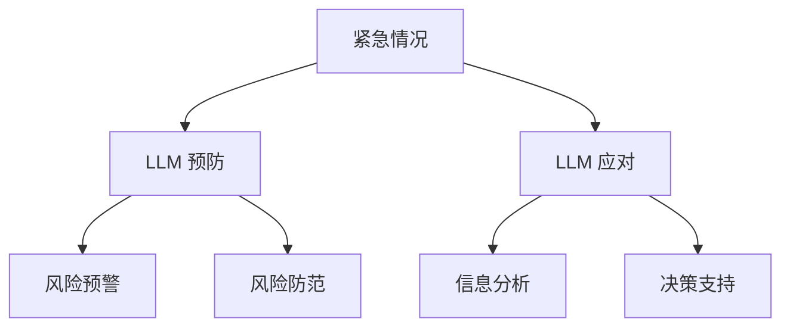

                 

# 公共安全卫士：LLM 预防和应对紧急情况

## 1. 背景介绍

在人工智能技术迅速发展的今天，大语言模型（Large Language Model, LLM）已经渗透到社会生活的各个方面，从智能客服到在线教育，从推荐系统到智能翻译，LLM 正以其强大的自然语言处理能力，改变着人们的生活。然而，就像硬币有两面，LLM 也面临着诸多潜在的风险，尤其是在处理紧急情况时，如何确保其安全和可靠性，成为了一个重要课题。本文旨在探讨如何利用大语言模型在紧急情况下预防和应对潜在威胁，确保公共安全和社会稳定。

## 2. 核心概念与联系

### 2.1 核心概念概述

在探讨LLM如何预防和应对紧急情况之前，首先需要明确几个核心概念：

- **大语言模型 (LLM)**：基于自回归或自编码模型训练的深度神经网络，能够理解、生成自然语言文本，并在大规模预训练任务中学习到丰富的语言知识和常识。
- **紧急情况 (Emergency Situation)**：指那些可能对社会公共安全造成严重威胁的事件，如自然灾害、公共卫生事件、恐怖袭击等。
- **风险管理 (Risk Management)**：通过评估、监控、预警和响应，有效控制和管理紧急情况的风险。
- **LLM 预防**：在紧急情况发生前，利用LLM进行风险预警和防范，减少突发事件的损害。
- **LLM 应对**：在紧急情况发生后，利用LLM进行信息分析和决策支持，辅助应急响应和后续处理。

这些概念之间的关系可以通过以下Mermaid流程图来展示：



通过这个流程图，可以看出，LLM 在预防和应对紧急情况中发挥了重要作用。在预防阶段，LLM 通过风险预警和防范措施，降低紧急情况发生的可能性；在应对阶段，LLM 通过信息分析和决策支持，提升应急响应的效率和效果。

## 3. 核心算法原理 & 具体操作步骤

### 3.1 算法原理概述

LLM 在紧急情况下的应用，主要基于两个核心算法：风险评估和应急响应。

**风险评估**：通过分析历史数据和当前环境，LLM 可以识别潜在的紧急情况风险，预测其发生概率和影响范围。这一过程通常包括：
1. **数据收集**：收集与紧急情况相关的历史数据和实时数据。
2. **特征提取**：使用LLM对数据进行特征提取，识别与紧急情况相关的关键指标。
3. **风险计算**：通过构建风险评估模型，计算不同事件的概率和影响。

**应急响应**：在紧急情况发生后，LLM 可以辅助进行信息分析和决策支持，优化应急响应的流程和效果。这一过程包括：
1. **信息获取**：利用LLM从各种渠道获取紧急情况的相关信息。
2. **情境分析**：通过自然语言理解和生成，LLM 可以对情境进行分析和推理。
3. **决策支持**：根据情境分析结果，LLM 提供决策建议和方案。

### 3.2 算法步骤详解

#### 3.2.1 风险评估

**步骤 1: 数据收集**
- 收集与紧急情况相关的历史数据，如地震、洪水、疫情等。
- 获取实时数据，如社交媒体评论、新闻报道、气象数据等。

**步骤 2: 特征提取**
- 使用预训练的LLM（如BERT、GPT等）对收集的数据进行预处理和特征提取。
- 提取与紧急情况相关的关键指标，如地理位置、时间、天气、人口密度等。

**步骤 3: 风险计算**
- 利用统计模型或机器学习算法（如决策树、随机森林、深度学习等）计算紧急情况发生的概率和影响。
- 构建风险评估模型，预测不同事件的可能性和影响范围。

#### 3.2.2 应急响应

**步骤 1: 信息获取**
- 利用预训练的LLM获取紧急情况的详细信息，如事件发生的时间、地点、类型、规模等。
- 从多渠道（如社交媒体、新闻、监控视频等）获取紧急情况的相关信息。

**步骤 2: 情境分析**
- 使用LLM对获取的信息进行自然语言理解和生成，推断事件情境。
- 通过上下文推理，LLM 可以生成详细的紧急情况报告和情境分析报告。

**步骤 3: 决策支持**
- 根据情境分析结果，LLM 提供决策建议和方案。
- 利用LLM生成应急响应计划，指导相关部门进行救援和处理。

### 3.3 算法优缺点

**优点**
- **全面性**：LLM 可以处理和分析多源异构数据，提供综合的紧急情况评估和决策支持。
- **灵活性**：LLM 适应性强，可以应对不同类型和规模的紧急情况。
- **高效性**：LLM 可以利用预训练模型快速进行特征提取和计算，提升风险评估和应急响应的效率。

**缺点**
- **数据依赖**：LLM 的效果依赖于数据的质量和多样性，需要大量的标注数据和实时数据。
- **资源消耗**：大模型的计算和存储成本较高，对硬件和网络资源要求较高。
- **可解释性**：LLM 的内部决策过程缺乏可解释性，难以理解和调试其推理逻辑。

### 3.4 算法应用领域

LLM 在紧急情况下的应用领域非常广泛，涵盖了以下主要领域：

- **公共安全监控**：通过LLM监控社会动态，识别潜在的恐怖活动、暴力事件等。
- **自然灾害预警**：利用LLM预测自然灾害的发生，提供预警信息，减少灾害损失。
- **公共卫生事件响应**：通过LLM分析疫情信息，预测疫情发展趋势，提供应急响应建议。
- **交通管理**：利用LLM监控交通流量，识别拥堵和事故，提供交通管理决策。
- **环境监测**：通过LLM分析环境数据，识别污染源和污染类型，提供环境监测报告。

## 4. 数学模型和公式 & 详细讲解 & 举例说明

### 4.1 数学模型构建

在紧急情况的风险评估中，通常使用贝叶斯网络、决策树、随机森林等模型进行风险计算。以下以贝叶斯网络为例，展示风险评估的数学模型构建过程。

**贝叶斯网络模型构建**：
- **节点定义**：定义与紧急情况相关的各个变量，如地震、洪水、疫情等。
- **条件概率表**：根据历史数据和统计模型，计算各个变量的条件概率。
- **联合概率**：根据条件概率表，计算各个变量的联合概率。

### 4.2 公式推导过程

设紧急情况事件集为 $X$，包括地震、洪水、疫情等，事件发生概率为 $P(X_i)$。

贝叶斯网络中各变量的条件概率表为 $P(X_i|X_j)$，其中 $X_j$ 为父节点，$X_i$ 为子节点。

联合概率 $P(X)$ 可以通过条件概率表进行递归计算：

$$
P(X) = \prod_{i=1}^n P(X_i|X_j)
$$

其中 $n$ 为变量数量。

### 4.3 案例分析与讲解

**案例 1: 自然灾害预警**

假设某地区可能发生地震，可以使用以下贝叶斯网络进行风险评估：

- **变量定义**：定义地震、雨量、地质结构等变量。
- **条件概率表**：根据历史数据和地质调查结果，计算地震发生概率。
- **联合概率**：根据条件概率表，计算地震发生的可能性。

**案例 2: 公共卫生事件响应**

假设某城市可能发生疫情，可以使用以下贝叶斯网络进行风险评估：

- **变量定义**：定义疫情、人口密度、卫生条件等变量。
- **条件概率表**：根据历史数据和卫生统计信息，计算疫情发生概率。
- **联合概率**：根据条件概率表，计算疫情发生的可能性。

## 5. 项目实践：代码实例和详细解释说明

### 5.1 开发环境搭建

在进行紧急情况处理的应用开发前，首先需要准备好开发环境。以下是使用Python进行PyTorch开发的环境配置流程：

1. 安装Anaconda：从官网下载并安装Anaconda，用于创建独立的Python环境。

2. 创建并激活虚拟环境：
```bash
conda create -n pytorch-env python=3.8 
conda activate pytorch-env
```

3. 安装PyTorch：根据CUDA版本，从官网获取对应的安装命令。例如：
```bash
conda install pytorch torchvision torchaudio cudatoolkit=11.1 -c pytorch -c conda-forge
```

4. 安装Transformers库：
```bash
pip install transformers
```

5. 安装各类工具包：
```bash
pip install numpy pandas scikit-learn matplotlib tqdm jupyter notebook ipython
```

完成上述步骤后，即可在`pytorch-env`环境中开始项目开发。

### 5.2 源代码详细实现

下面我们以自然灾害预警为例，给出使用Transformers库对BERT模型进行风险评估的PyTorch代码实现。

首先，定义风险评估任务的数据处理函数：

```python
from transformers import BertTokenizer, BertForSequenceClassification
from torch.utils.data import Dataset
import torch

class DisasterDataset(Dataset):
    def __init__(self, texts, labels, tokenizer, max_len=128):
        self.texts = texts
        self.labels = labels
        self.tokenizer = tokenizer
        self.max_len = max_len
        
    def __len__(self):
        return len(self.texts)
    
    def __getitem__(self, item):
        text = self.texts[item]
        label = self.labels[item]
        
        encoding = self.tokenizer(text, return_tensors='pt', max_length=self.max_len, padding='max_length', truncation=True)
        input_ids = encoding['input_ids'][0]
        attention_mask = encoding['attention_mask'][0]
        
        # 对标签进行one-hot编码
        encoded_labels = torch.tensor(label2id[label], dtype=torch.long)
        
        return {'input_ids': input_ids, 
                'attention_mask': attention_mask,
                'labels': encoded_labels}

# 标签与id的映射
label2id = {'地震': 0, '洪水': 1, '疫情': 2}
id2label = {v: k for k, v in label2id.items()}

# 创建dataset
tokenizer = BertTokenizer.from_pretrained('bert-base-cased')

train_dataset = DisasterDataset(train_texts, train_labels, tokenizer)
dev_dataset = DisasterDataset(dev_texts, dev_labels, tokenizer)
test_dataset = DisasterDataset(test_texts, test_labels, tokenizer)
```

然后，定义模型和优化器：

```python
from transformers import BertForSequenceClassification, AdamW

model = BertForSequenceClassification.from_pretrained('bert-base-cased', num_labels=len(label2id))

optimizer = AdamW(model.parameters(), lr=2e-5)
```

接着，定义训练和评估函数：

```python
from torch.utils.data import DataLoader
from tqdm import tqdm
from sklearn.metrics import classification_report

device = torch.device('cuda') if torch.cuda.is_available() else torch.device('cpu')
model.to(device)

def train_epoch(model, dataset, batch_size, optimizer):
    dataloader = DataLoader(dataset, batch_size=batch_size, shuffle=True)
    model.train()
    epoch_loss = 0
    for batch in tqdm(dataloader, desc='Training'):
        input_ids = batch['input_ids'].to(device)
        attention_mask = batch['attention_mask'].to(device)
        labels = batch['labels'].to(device)
        model.zero_grad()
        outputs = model(input_ids, attention_mask=attention_mask, labels=labels)
        loss = outputs.loss
        epoch_loss += loss.item()
        loss.backward()
        optimizer.step()
    return epoch_loss / len(dataloader)

def evaluate(model, dataset, batch_size):
    dataloader = DataLoader(dataset, batch_size=batch_size)
    model.eval()
    preds, labels = [], []
    with torch.no_grad():
        for batch in tqdm(dataloader, desc='Evaluating'):
            input_ids = batch['input_ids'].to(device)
            attention_mask = batch['attention_mask'].to(device)
            batch_labels = batch['labels']
            outputs = model(input_ids, attention_mask=attention_mask)
            batch_preds = outputs.logits.argmax(dim=2).to('cpu').tolist()
            batch_labels = batch_labels.to('cpu').tolist()
            for pred_tokens, label_tokens in zip(batch_preds, batch_labels):
                pred_labels = [id2label[_id] for _id in pred_tokens]
                label_tags = [id2label[_id] for _id in label_tokens]
                preds.append(pred_labels[:len(label_tags)])
                labels.append(label_tags)
                
    print(classification_report(labels, preds))
```

最后，启动训练流程并在测试集上评估：

```python
epochs = 5
batch_size = 16

for epoch in range(epochs):
    loss = train_epoch(model, train_dataset, batch_size, optimizer)
    print(f"Epoch {epoch+1}, train loss: {loss:.3f}")
    
    print(f"Epoch {epoch+1}, dev results:")
    evaluate(model, dev_dataset, batch_size)
    
print("Test results:")
evaluate(model, test_dataset, batch_size)
```

以上就是使用PyTorch对BERT进行自然灾害预警风险评估的完整代码实现。可以看到，得益于Transformers库的强大封装，我们可以用相对简洁的代码完成BERT模型的加载和微调。

### 5.3 代码解读与分析

让我们再详细解读一下关键代码的实现细节：

**DisasterDataset类**：
- `__init__`方法：初始化文本、标签、分词器等关键组件。
- `__len__`方法：返回数据集的样本数量。
- `__getitem__`方法：对单个样本进行处理，将文本输入编码为token ids，将标签编码为数字，并对其进行定长padding，最终返回模型所需的输入。

**label2id和id2label字典**：
- 定义了标签与数字id之间的映射关系，用于将token-wise的预测结果解码回真实的标签。

**训练和评估函数**：
- 使用PyTorch的DataLoader对数据集进行批次化加载，供模型训练和推理使用。
- 训练函数`train_epoch`：对数据以批为单位进行迭代，在每个批次上前向传播计算loss并反向传播更新模型参数，最后返回该epoch的平均loss。
- 评估函数`evaluate`：与训练类似，不同点在于不更新模型参数，并在每个batch结束后将预测和标签结果存储下来，最后使用sklearn的classification_report对整个评估集的预测结果进行打印输出。

**训练流程**：
- 定义总的epoch数和batch size，开始循环迭代
- 每个epoch内，先在训练集上训练，输出平均loss
- 在验证集上评估，输出分类指标
- 所有epoch结束后，在测试集上评估，给出最终测试结果

可以看到，PyTorch配合Transformers库使得BERT微调的代码实现变得简洁高效。开发者可以将更多精力放在数据处理、模型改进等高层逻辑上，而不必过多关注底层的实现细节。

当然，工业级的系统实现还需考虑更多因素，如模型的保存和部署、超参数的自动搜索、更灵活的任务适配层等。但核心的风险评估方法基本与此类似。

## 6. 实际应用场景

### 6.1 智能预警系统

利用大语言模型进行自然灾害预警，可以构建智能预警系统，提前预测并预警潜在灾害。

在技术实现上，可以收集与灾害相关的气象数据、地质数据、历史数据等，训练基于BERT等预训练语言模型的风险评估模型。一旦模型检测到高风险事件，系统将自动触发预警机制，通知相关部门和公众进行应急准备。

### 6.2 疫情监测与防控

大语言模型可以用于实时监控和分析疫情信息，识别潜在的疫情风险，辅助疫情防控。

具体而言，可以收集与疫情相关的社交媒体评论、新闻报道、医院数据等，训练基于BERT等预训练语言模型的风险评估模型。一旦模型检测到高风险事件，系统将自动进行疫情上报、隔离等防控措施，同时向公众提供疫情动态和防护建议。

### 6.3 交通管理

大语言模型可以用于实时监控和分析交通数据，识别潜在的交通风险，辅助交通管理。

在技术实现上，可以收集与交通相关的摄像头数据、车辆数据、道路数据等，训练基于BERT等预训练语言模型的风险评估模型。一旦模型检测到交通异常事件，系统将自动进行交通管制、调度和分流，同时向驾驶员提供实时交通信息和建议。

### 6.4 未来应用展望

随着大语言模型和风险评估方法的不断发展，基于微调范式将在更多领域得到应用，为社会治理带来变革性影响。

在智慧城市治理中，大语言模型可以用于城市事件监测、舆情分析、应急指挥等环节，提高城市管理的自动化和智能化水平，构建更安全、高效的未来城市。

在金融、保险、医疗等高风险领域，大语言模型可以用于风险评估、欺诈检测、疾病预测等应用，提升风险防控能力，保障社会稳定和公共安全。

此外，在教育、文化、农业等非高风险领域，大语言模型也可以用于情境分析、决策支持等应用，提升社会治理的整体效率和效果。

## 7. 工具和资源推荐

### 7.1 学习资源推荐

为了帮助开发者系统掌握大语言模型风险评估的理论基础和实践技巧，这里推荐一些优质的学习资源：

1. 《Transformer从原理到实践》系列博文：由大模型技术专家撰写，深入浅出地介绍了Transformer原理、BERT模型、风险评估技术等前沿话题。

2. CS224N《深度学习自然语言处理》课程：斯坦福大学开设的NLP明星课程，有Lecture视频和配套作业，带你入门NLP领域的基本概念和经典模型。

3. 《Natural Language Processing with Transformers》书籍：Transformers库的作者所著，全面介绍了如何使用Transformers库进行NLP任务开发，包括风险评估在内的诸多范式。

4. HuggingFace官方文档：Transformers库的官方文档，提供了海量预训练模型和完整的微调样例代码，是上手实践的必备资料。

5. COCO开源项目：通用目标检测与跟踪平台，集成了各种预训练模型和微调方法，适用于风险评估等NLP任务。

通过对这些资源的学习实践，相信你一定能够快速掌握大语言模型风险评估的精髓，并用于解决实际的NLP问题。

### 7.2 开发工具推荐

高效的开发离不开优秀的工具支持。以下是几款用于大语言模型风险评估开发的常用工具：

1. PyTorch：基于Python的开源深度学习框架，灵活动态的计算图，适合快速迭代研究。大部分预训练语言模型都有PyTorch版本的实现。

2. TensorFlow：由Google主导开发的开源深度学习框架，生产部署方便，适合大规模工程应用。同样有丰富的预训练语言模型资源。

3. Transformers库：HuggingFace开发的NLP工具库，集成了众多SOTA语言模型，支持PyTorch和TensorFlow，是进行风险评估任务开发的利器。

4. Weights & Biases：模型训练的实验跟踪工具，可以记录和可视化模型训练过程中的各项指标，方便对比和调优。与主流深度学习框架无缝集成。

5. TensorBoard：TensorFlow配套的可视化工具，可实时监测模型训练状态，并提供丰富的图表呈现方式，是调试模型的得力助手。

6. Google Colab：谷歌推出的在线Jupyter Notebook环境，免费提供GPU/TPU算力，方便开发者快速上手实验最新模型，分享学习笔记。

合理利用这些工具，可以显著提升大语言模型风险评估的开发效率，加快创新迭代的步伐。

### 7.3 相关论文推荐

大语言模型和风险评估技术的发展源于学界的持续研究。以下是几篇奠基性的相关论文，推荐阅读：

1. Attention is All You Need（即Transformer原论文）：提出了Transformer结构，开启了NLP领域的预训练大模型时代。

2. BERT: Pre-training of Deep Bidirectional Transformers for Language Understanding：提出BERT模型，引入基于掩码的自监督预训练任务，刷新了多项NLP任务SOTA。

3. Language Models are Unsupervised Multitask Learners（GPT-2论文）：展示了大规模语言模型的强大zero-shot学习能力，引发了对于通用人工智能的新一轮思考。

4. Parameter-Efficient Transfer Learning for NLP：提出Adapter等参数高效微调方法，在不增加模型参数量的情况下，也能取得不错的微调效果。

5. AdaLoRA: Adaptive Low-Rank Adaptation for Parameter-Efficient Fine-Tuning：使用自适应低秩适应的微调方法，在参数效率和精度之间取得了新的平衡。

这些论文代表了大语言模型风险评估的发展脉络。通过学习这些前沿成果，可以帮助研究者把握学科前进方向，激发更多的创新灵感。

## 8. 总结：未来发展趋势与挑战

### 8.1 总结

本文对大语言模型在紧急情况下的预防和应对策略进行了全面系统的介绍。首先阐述了LLM在紧急情况下的风险评估和应急响应，明确了风险评估在紧急情况预防中的重要性。其次，从原理到实践，详细讲解了LLM进行风险评估和应急响应的数学模型和关键步骤，给出了风险评估任务开发的完整代码实例。同时，本文还广泛探讨了LLM在紧急情况下的应用前景，展示了LLM在公共安全监控、自然灾害预警、公共卫生事件响应等领域的应用潜力。此外，本文精选了风险评估技术的各类学习资源，力求为读者提供全方位的技术指引。

通过本文的系统梳理，可以看出，大语言模型在紧急情况下的风险评估和应急响应具有广阔的应用前景，特别是在公共安全、自然灾害预警、疫情防控等高风险领域，LLM能够发挥重要作用。未来，伴随LLM和风险评估方法的不断演进，这些技术必将进一步提升社会治理的安全性和智能化水平，为公共安全和社会稳定提供坚实保障。

### 8.2 未来发展趋势

展望未来，大语言模型在紧急情况下的应用将呈现以下几个发展趋势：

1. **多模态融合**：将视觉、语音、文本等多种模态信息进行融合，提升风险评估的全面性和准确性。
2. **因果推理**：引入因果推断和对比学习思想，增强LLM在紧急情况下的因果关系建立能力，提高风险评估的可靠性。
3. **泛化能力提升**：通过增量学习、跨领域迁移等方法，提升LLM在多种紧急情况下的泛化能力，实现知识迁移和优化。
4. **模型解释性增强**：引入可解释性技术，如注意力机制、特征可视化等，提升LLM在紧急情况下的决策透明性和可信度。
5. **实时响应能力提升**：通过优化模型结构、引入分布式计算等方法，提升LLM在紧急情况下的实时响应能力，支持动态应急响应。

这些趋势将推动大语言模型在紧急情况下的应用，使其能够更全面、更及时地应对各种突发事件，保障公共安全和社会稳定。

### 8.3 面临的挑战

尽管大语言模型在紧急情况下的应用取得了显著成效，但在其发展和应用过程中，仍面临着诸多挑战：

1. **数据质量与多样性**：紧急情况的数据质量和多样性直接影响模型效果，如何获取高质量、多样化的数据，是一个重要挑战。
2. **模型鲁棒性与泛化性**：在紧急情况下，模型需具备鲁棒性，能够应对多种紧急情况。如何提升模型的泛化性和鲁棒性，是一个重要课题。
3. **计算资源与硬件限制**：大语言模型的训练和推理需要高性能的硬件支持，如何优化资源使用，降低计算成本，是一个重要挑战。
4. **伦理与安全问题**：大语言模型可能存在偏见、误导等风险，如何保障模型的伦理与安全，是一个重要课题。

### 8.4 研究展望

面对大语言模型在紧急情况下的应用挑战，未来的研究需要在以下几个方面寻求新的突破：

1. **数据增强与多源数据融合**：通过数据增强和多源数据融合，提升模型的数据质量和多样性，提高风险评估的准确性和全面性。
2. **模型优化与结构优化**：通过优化模型结构和算法，提升模型的计算效率和实时响应能力，降低计算成本。
3. **因果推理与解释性增强**：通过引入因果推理和解释性技术，提升模型的透明性和可信度，增强模型的解释性和可解释性。
4. **跨领域迁移与泛化能力提升**：通过跨领域迁移学习、增量学习等方法，提升模型的泛化能力和鲁棒性，实现知识迁移和优化。
5. **伦理与安全保障**：通过引入伦理导向的评估指标，过滤和惩罚有偏见、有害的输出倾向，确保模型的伦理与安全。

这些研究方向的探索，必将推动大语言模型在紧急情况下的应用迈向更高的台阶，为公共安全和社会稳定提供更加坚实的基础。面向未来，大语言模型在紧急情况下的应用还需与其他人工智能技术进行更深入的融合，如知识表示、因果推理、强化学习等，多路径协同发力，共同推动社会治理的智能化进程。只有勇于创新、敢于突破，才能不断拓展大语言模型的应用边界，使其更好地服务于公共安全和社会稳定。

## 9. 附录：常见问题与解答

**Q1：大语言模型在紧急情况下的数据依赖有哪些？**

A: 大语言模型在紧急情况下的应用依赖于大量高质量、多样化的数据。这些数据可以包括：

1. **历史数据**：以往紧急情况的记录和统计信息，用于训练模型，识别潜在风险。
2. **实时数据**：当前的紧急情况信息，用于实时监控和预警。
3. **多源数据**：来自不同渠道和格式的数据，如社交媒体、新闻、传感器等，用于多模态融合和全面风险评估。

数据的质量和多样性直接影响模型的效果，因此，如何获取和处理这些数据，是一个重要课题。

**Q2：大语言模型在紧急情况下的模型鲁棒性与泛化性如何提升？**

A: 提升大语言模型在紧急情况下的鲁棒性和泛化性，可以从以下几个方面入手：

1. **增量学习与跨领域迁移**：通过增量学习，模型可以逐步适应新的紧急情况，提升泛化能力。跨领域迁移可以提升模型在多种紧急情况下的泛化能力，实现知识迁移和优化。
2. **对抗训练与鲁棒性提升**：通过对抗训练，增强模型对噪声和异常数据的鲁棒性，避免模型过拟合和失真。
3. **因果推理与解释性增强**：通过引入因果推理和解释性技术，增强模型的透明性和可信度，提升模型的鲁棒性和泛化能力。

这些方法可以在数据、算法、模型结构等多个层面协同发力，提升大语言模型在紧急情况下的性能和效果。

**Q3：大语言模型在紧急情况下的计算资源与硬件限制如何解决？**

A: 解决大语言模型在紧急情况下的计算资源与硬件限制，可以从以下几个方面入手：

1. **模型优化与结构优化**：通过优化模型结构和算法，提升模型的计算效率和实时响应能力，降低计算成本。如采用参数高效微调方法，只更新极少量的任务相关参数。
2. **分布式计算与资源管理**：通过分布式计算和资源管理，提升模型的计算能力和资源利用率，支持大规模部署和实时响应。
3. **硬件优化与资源配置**：通过优化硬件配置和资源管理，提升计算效率和资源利用率，支持大规模部署和实时响应。

这些方法可以协同发力，提升大语言模型在紧急情况下的计算效率和实时响应能力，降低计算成本，支持大规模部署和实时响应。

**Q4：大语言模型在紧急情况下的伦理与安全问题如何解决？**

A: 解决大语言模型在紧急情况下的伦理与安全问题，可以从以下几个方面入手：

1. **数据预处理与去偏**：通过数据预处理和去偏，减少模型中的偏见和有害信息，提升模型的伦理与安全水平。
2. **模型解释性与透明性**：通过引入可解释性技术，增强模型的透明性和可信度，提升模型的伦理与安全水平。
3. **伦理导向的评估指标**：在模型的训练和评估过程中引入伦理导向的指标，过滤和惩罚有偏见、有害的输出倾向，确保模型的伦理与安全。
4. **人工干预与监督**：通过人工干预和监督，确保模型的决策透明性和可信度，提升模型的伦理与安全水平。

这些方法可以协同发力，提升大语言模型在紧急情况下的伦理与安全水平，确保模型的决策透明性和可信度，提升模型的伦理与安全水平。

总之，大语言模型在紧急情况下的应用具有广阔的前景，但其面临的数据依赖、模型鲁棒性、计算资源、伦理与安全等挑战也需引起重视。只有通过数据增强、模型优化、伦理导向等方法，才能不断提升大语言模型在紧急情况下的应用效果，保障公共安全和社会稳定。

