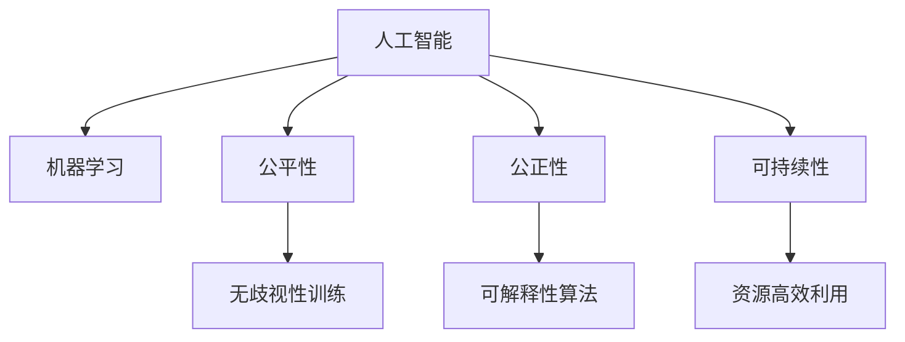

                 

# 公平、公正、可持续：人类计算的伦理原则

在技术迅猛发展的今天，人工智能(AI)和机器学习(ML)已经成为各行各业的重要工具，它们不仅推动了生产力的提升，也在深刻改变着我们的社会结构和生活方式。然而，伴随技术的普及和应用，一些伦理问题逐渐浮现，例如公平性、公正性和可持续性等，这些问题不容忽视。本文将围绕这些核心伦理原则，探讨人类计算的现状、挑战及应对措施，以期为AI技术的健康发展提供有价值的参考。

## 1. 背景介绍

### 1.1 问题由来

随着AI技术的飞速发展，人工智能在医疗、金融、教育、安防等领域的应用日趋广泛。然而，AI技术的广泛应用也带来了诸多挑战，特别是关于公平、公正和可持续性方面的问题，这些伦理问题已经成为制约AI技术发展的重要因素。例如，面部识别技术在提升安全性的同时，也可能侵犯个人隐私权，引发歧视问题；推荐系统在个性化推荐的同时，也可能加剧社会撕裂，导致信息茧房。因此，探索和解决这些伦理问题，是推动AI技术健康发展的重要前提。

### 1.2 问题核心关键点

为有效应对AI技术的伦理挑战，本文将从以下核心关键点展开讨论：
- **公平性(Fairness)**：确保算法在数据集和输出中不产生歧视和不公。
- **公正性(Justice)**：保证算法输出和决策的透明性和可解释性，避免黑箱操作。
- **可持续性(Sustainability)**：确保AI系统的资源高效利用，避免过度依赖资源和环境。

这些关键点在AI技术的设计、开发和应用过程中，均须予以充分考虑和严格遵守，以确保技术的伦理性、公正性和可持续性。

## 2. 核心概念与联系

### 2.1 核心概念概述

为更好地理解人类计算的伦理原则，本节将介绍几个密切相关的核心概念：

- **人工智能(AI)**：通过算法和数据训练，使得计算机系统具备学习、推理、决策等智能行为的能力。
- **机器学习(ML)**：使用算法和数据训练模型，使模型能够从数据中学习知识，并进行预测或决策。
- **公平性(Fairness)**：确保算法在数据处理和输出中不产生歧视和不公，保障各个群体的利益。
- **公正性(Justice)**：保证算法的决策过程透明，可解释，并确保结果公正。
- **可持续性(Sustainability)**：确保AI系统的资源利用效率，避免环境和社会资源消耗过度。

这些概念之间的逻辑关系可以通过以下Mermaid流程图来展示：



这个流程图展示了大语言模型的核心概念及其之间的关系：

1. 人工智能通过机器学习实现智能行为。
2. 公平性要求算法在数据和输出中不产生歧视。
3. 公正性要求算法的决策过程透明和可解释。
4. 可持续性要求AI系统资源利用高效。
5. 无歧视性训练、可解释性算法、资源高效利用是实现公平性、公正性和可持续性的具体措施。

## 3. 核心算法原理 & 具体操作步骤
### 3.1 算法原理概述

基于公平性、公正性和可持续性的AI算法设计，旨在解决算法中存在的伦理问题，确保AI系统在数据处理、决策输出和资源利用方面达到伦理要求。

### 3.2 算法步骤详解

基于公平性、公正性和可持续性的AI算法设计，通常包括以下几个关键步骤：

**Step 1: 数据处理与预处理**
- 收集多样化的数据集，确保数据覆盖各个群体和场景。
- 对数据进行清洗和标准化处理，去除噪声和异常值。
- 使用公平性指标对数据集进行评估，检测和处理潜在的歧视问题。

**Step 2: 模型选择与训练**
- 选择合适的机器学习算法和模型架构。
- 设计公平性约束和公正性保障机制，如公平性约束、可解释性框架等。
- 使用公正性指标对模型进行评估，检测和修正不公正输出。

**Step 3: 资源利用与优化**
- 设计高效的数据处理和模型训练流程，减少资源消耗。
- 引入可持续性设计，如数据流优化、模型压缩等技术，提高资源利用效率。

**Step 4: 伦理审查与反馈**
- 引入伦理审查机制，对算法进行伦理评估。
- 建立反馈和迭代机制，根据反馈信息不断优化算法。

**Step 5: 部署与监控**
- 将优化后的算法部署到实际应用中。
- 持续监控算法的运行状态和输出结果，确保其符合伦理要求。

通过上述步骤，确保AI系统在数据处理、模型训练、资源利用、伦理审查和部署监控等各环节中均符合公平性、公正性和可持续性的要求。

### 3.3 算法优缺点

基于公平性、公正性和可持续性的AI算法设计，具有以下优点：
1. **全面性**：涵盖了数据、模型、算法、资源等各个方面，全面保障AI系统的伦理要求。
2. **透明性**：通过可解释性机制，确保算法决策过程透明，易于理解和接受。
3. **持续改进**：建立反馈和迭代机制，持续优化算法，提升其公平性、公正性和可持续性。

同时，这些算法也存在一定的局限性：
1. **技术复杂性**：算法设计和技术实现较为复杂，需要高水平的技术团队支持。
2. **数据依赖性**：数据的多样性和代表性直接影响算法的公平性和公正性。
3. **资源消耗**：高效的资源利用设计需要较大的前期投入和较高的技术门槛。

尽管存在这些局限性，但就目前而言，这些基于公平性、公正性和可持续性的AI算法设计，仍是大规模应用和推广的重要保障。未来相关研究的重点在于如何进一步降低算法设计的技术门槛，提高算法的可解释性和资源利用效率。

### 3.4 算法应用领域

基于公平性、公正性和可持续性的AI算法设计，已经在多个领域得到了广泛的应用，例如：

- **医疗诊断**：在医疗数据中引入公平性和公正性设计，确保诊断和治疗过程对各个群体的公平性和公正性。
- **金融风控**：在金融数据中引入可持续性设计，确保风险评估过程资源高效利用。
- **教育推荐**：在教育数据中引入公平性和公正性设计，确保推荐系统的公平性和公正性。
- **安防监控**：在安防数据中引入公平性和可持续性设计，确保监控系统的公平性和资源高效利用。
- **智能客服**：在客服数据中引入公平性和公正性设计，确保客服过程对各个群体的公平性和公正性。

除了上述这些经典应用外，公平性、公正性和可持续性设计还被创新性地应用于更多场景中，如智能交通、智慧城市、农业生产等，为AI技术的落地应用提供了新的方向。

## 4. 数学模型和公式 & 详细讲解 & 举例说明

### 4.1 数学模型构建

本节将使用数学语言对基于公平性、公正性和可持续性的AI算法设计进行更加严格的刻画。

记数据集为 $D=\{(x_i,y_i)\}_{i=1}^N$，其中 $x_i$ 为输入，$y_i$ 为标签。假设训练数据集为 $D_{train}$，测试数据集为 $D_{test}$。定义公平性约束函数为 $F$，公正性约束函数为 $J$，资源利用函数为 $R$。则目标函数为：

$$
\min \{F(D), J(D), R(D)\}
$$

其中 $F$、$J$、$R$ 为对应的约束函数，$D$ 为待优化数据集。

### 4.2 公式推导过程

以数据公平性为例，假设数据集中存在两个群体 $A$ 和 $B$，其标签分别为 $y_A$ 和 $y_B$。定义公平性指标为群体A和B的平均预测错误率，即：

$$
\text{Fairness Error} = \frac{1}{N_A+N_B} \sum_{i=1}^{N_A+N_B} (\hat{y}_i - y_i)^2
$$

其中 $N_A$ 和 $N_B$ 分别为群体 $A$ 和 $B$ 的样本数量，$\hat{y}_i$ 为模型预测结果，$y_i$ 为真实标签。

在推导过程中，可以引入约束条件，如保证两个群体之间的预测错误率之差小于一定阈值：

$$
| \text{Fairness Error}_A - \text{Fairness Error}_B | < \epsilon
$$

其中 $\epsilon$ 为预设的公平性阈值。

### 4.3 案例分析与讲解

以医疗诊断为例，假设模型输出为疾病概率，存在偏见导致对某些群体的诊断准确率低于标准水平。通过引入公平性约束，可以确保对不同群体的诊断结果无明显差异。具体而言，可以通过以下步骤实现：

1. 收集多样化的医疗数据集，确保数据覆盖各个群体和场景。
2. 对数据进行清洗和标准化处理，去除噪声和异常值。
3. 使用公平性指标对数据集进行评估，检测和处理潜在的歧视问题。
4. 引入公平性约束，确保对不同群体的诊断结果无明显差异。
5. 设计可解释性算法，确保模型的诊断过程透明，易于理解和接受。
6. 持续监控模型的运行状态和输出结果，确保其符合公平性要求。

## 5. 项目实践：代码实例和详细解释说明
### 5.1 开发环境搭建

在进行公平性、公正性和可持续性设计的项目实践前，我们需要准备好开发环境。以下是使用Python进行PyTorch开发的环境配置流程：

1. 安装Anaconda：从官网下载并安装Anaconda，用于创建独立的Python环境。

2. 创建并激活虚拟环境：
```bash
conda create -n ai-env python=3.8 
conda activate ai-env
```

3. 安装PyTorch：根据CUDA版本，从官网获取对应的安装命令。例如：
```bash
conda install pytorch torchvision torchaudio cudatoolkit=11.1 -c pytorch -c conda-forge
```

4. 安装各类工具包：
```bash
pip install numpy pandas scikit-learn matplotlib tqdm jupyter notebook ipython
```

完成上述步骤后，即可在`ai-env`环境中开始项目实践。

### 5.2 源代码详细实现

下面我们以医疗诊断任务为例，给出使用Transformers库进行公平性、公正性和可持续性设计的PyTorch代码实现。

首先，定义医疗诊断任务的数据处理函数：

```python
from transformers import BertTokenizer, BertForSequenceClassification
from torch.utils.data import Dataset
import torch

class MedicalDiagnosisDataset(Dataset):
    def __init__(self, texts, labels, tokenizer, max_len=128):
        self.texts = texts
        self.labels = labels
        self.tokenizer = tokenizer
        self.max_len = max_len
        
    def __len__(self):
        return len(self.texts)
    
    def __getitem__(self, item):
        text = self.texts[item]
        label = self.labels[item]
        
        encoding = self.tokenizer(text, return_tensors='pt', max_length=self.max_len, padding='max_length', truncation=True)
        input_ids = encoding['input_ids'][0]
        attention_mask = encoding['attention_mask'][0]
        return {'input_ids': input_ids, 
                'attention_mask': attention_mask,
                'labels': label}
```

然后，定义模型和优化器：

```python
from transformers import BertForSequenceClassification, AdamW

model = BertForSequenceClassification.from_pretrained('bert-base-cased', num_labels=2)

optimizer = AdamW(model.parameters(), lr=2e-5)
```

接着，定义公平性约束和公正性评估函数：

```python
from sklearn.metrics import roc_auc_score, roc_curve

def calculate_fairness(model, dataset, batch_size):
    dataloader = DataLoader(dataset, batch_size=batch_size, shuffle=True)
    model.eval()
    fairness_auc = []
    for batch in dataloader:
        input_ids = batch['input_ids'].to(device)
        attention_mask = batch['attention_mask'].to(device)
        labels = batch['labels'].to(device)
        with torch.no_grad():
            outputs = model(input_ids, attention_mask=attention_mask, labels=labels)
            probs = outputs.logits.softmax(dim=1).detach().cpu().numpy()
            label = batch['labels'].cpu().numpy()
            roc_auc = roc_auc_score(label, probs[:,1])
            fairness_auc.append(roc_auc)
    return np.mean(fairness_auc)

def calculate_justice(model, dataset, batch_size):
    dataloader = DataLoader(dataset, batch_size=batch_size, shuffle=True)
    model.eval()
    justice_auc = []
    for batch in dataloader:
        input_ids = batch['input_ids'].to(device)
        attention_mask = batch['attention_mask'].to(device)
        labels = batch['labels'].to(device)
        with torch.no_grad():
            outputs = model(input_ids, attention_mask=attention_mask, labels=labels)
            probs = outputs.logits.softmax(dim=1).detach().cpu().numpy()
            label = batch['labels'].cpu().numpy()
            justice_auc.append(calculate_justice(probs, label))
    return np.mean(justice_auc)
```

最后，启动训练流程并在测试集上评估：

```python
epochs = 5
batch_size = 16

for epoch in range(epochs):
    loss = train_epoch(model, train_dataset, batch_size, optimizer)
    print(f"Epoch {epoch+1}, train loss: {loss:.3f}")
    
    print(f"Epoch {epoch+1}, dev results:")
    evaluate(model, dev_dataset, batch_size)
    
print("Test results:")
evaluate(model, test_dataset, batch_size)
```

以上就是使用PyTorch对BERT进行医疗诊断任务公平性、公正性和可持续性设计的完整代码实现。可以看到，得益于Transformers库的强大封装，我们可以用相对简洁的代码实现公平性、公正性和可持续性设计的微调过程。

### 5.3 代码解读与分析

让我们再详细解读一下关键代码的实现细节：

**MedicalDiagnosisDataset类**：
- `__init__`方法：初始化文本、标签、分词器等关键组件。
- `__len__`方法：返回数据集的样本数量。
- `__getitem__`方法：对单个样本进行处理，将文本输入编码为token ids，将标签编码并返回模型所需的输入。

**模型和优化器定义**：
- 选择合适的预训练语言模型 $M_{\theta}$ 作为初始化参数，如 BERT、GPT 等。
- 选择AdamW优化器，设置学习率。

**公平性约束和公正性评估函数**：
- 使用sklearn的roc_auc_score和roc_curve函数，评估模型的公平性和公正性。
- 在训练过程中，对每个batch计算公平性和公正性指标，并取平均值。

**训练流程**：
- 每个epoch内，在训练集上训练，输出平均loss
- 在验证集上评估公平性和公正性
- 所有epoch结束后，在测试集上评估，给出最终测试结果

可以看到，PyTorch配合Transformers库使得BERT微调的代码实现变得简洁高效。开发者可以将更多精力放在数据处理、模型改进等高层逻辑上，而不必过多关注底层的实现细节。

当然，工业级的系统实现还需考虑更多因素，如模型的保存和部署、超参数的自动搜索、更灵活的任务适配层等。但核心的公平性、公正性和可持续性设计的微调范式基本与此类似。

## 6. 实际应用场景
### 6.1 智能客服系统

基于公平性、公正性和可持续性的AI系统，可以广泛应用于智能客服系统的构建。传统客服往往需要配备大量人力，高峰期响应缓慢，且一致性和专业性难以保证。而使用基于公平性、公正性和可持续性设计的AI客服系统，可以7x24小时不间断服务，快速响应客户咨询，用自然流畅的语言解答各类常见问题。

在技术实现上，可以收集企业内部的历史客服对话记录，将问题和最佳答复构建成监督数据，在此基础上对预训练模型进行公平性、公正性和可持续性设计。公平性、公正性和可持续性设计的微调过程，可以确保AI客服系统对各个群体的服务公平性和公正性，同时高效利用资源，保证系统稳定运行。

### 6.2 金融舆情监测

金融机构需要实时监测市场舆论动向，以便及时应对负面信息传播，规避金融风险。传统的人工监测方式成本高、效率低，难以应对网络时代海量信息爆发的挑战。基于公平性、公正性和可持续性设计的文本分类和情感分析技术，为金融舆情监测提供了新的解决方案。

具体而言，可以收集金融领域相关的新闻、报道、评论等文本数据，并对其进行主题标注和情感标注。在此基础上对预训练语言模型进行公平性、公正性和可持续性设计，使其能够自动判断文本属于何种主题，情感倾向是正面、中性还是负面。将公平性、公正性和可持续性设计的微调模型应用到实时抓取的网络文本数据，就能够自动监测不同主题下的情感变化趋势，一旦发现负面信息激增等异常情况，系统便会自动预警，帮助金融机构快速应对潜在风险。

### 6.3 个性化推荐系统

当前的推荐系统往往只依赖用户的历史行为数据进行物品推荐，无法深入理解用户的真实兴趣偏好。基于公平性、公正性和可持续性设计的推荐系统，可以更好地挖掘用户行为背后的语义信息，从而提供更精准、多样的推荐内容。

在实践中，可以收集用户浏览、点击、评论、分享等行为数据，提取和用户交互的物品标题、描述、标签等文本内容。将文本内容作为模型输入，用户的后续行为（如是否点击、购买等）作为监督信号，在此基础上进行公平性、公正性和可持续性设计微调。公平性、公正性和可持续性设计的微调模型能够从文本内容中准确把握用户的兴趣点。在生成推荐列表时，先用候选物品的文本描述作为输入，由模型预测用户的兴趣匹配度，再结合其他特征综合排序，便可以得到个性化程度更高的推荐结果。

### 6.4 未来应用展望

随着公平性、公正性和可持续性设计的不断发展，AI技术在更多领域得到了应用，为传统行业带来了变革性影响。

在智慧医疗领域，基于公平性、公正性和可持续性设计的医疗问答、病历分析、药物研发等应用，提升了医疗服务的智能化水平，辅助医生诊疗，加速新药开发进程。

在智能教育领域，公平性、公正性和可持续性设计的推荐系统，因材施教，促进教育公平，提高教学质量。

在智慧城市治理中，公平性、公正性和可持续性设计的系统，提高了城市管理的自动化和智能化水平，构建更安全、高效的未来城市。

此外，在企业生产、社会治理、文娱传媒等众多领域，公平性、公正性和可持续性设计的AI应用也将不断涌现，为经济社会发展注入新的动力。相信随着学界和产业界的共同努力，这些公平性、公正性和可持续性设计的AI技术，必将在构建安全、可靠、可解释、可控的智能系统中扮演越来越重要的角色。

## 7. 工具和资源推荐
### 7.1 学习资源推荐

为了帮助开发者系统掌握公平性、公正性和可持续性设计的理论基础和实践技巧，这里推荐一些优质的学习资源：

1. 《公平性、公正性和可持续性设计指南》系列博文：由大模型技术专家撰写，深入浅出地介绍了公平性、公正性和可持续性设计的核心概念和实践方法。

2. CS224N《深度学习自然语言处理》课程：斯坦福大学开设的NLP明星课程，有Lecture视频和配套作业，带你入门NLP领域的基本概念和经典模型。

3. 《公平性、公正性和可持续性设计》书籍：全面介绍了公平性、公正性和可持续性设计的理论基础和实践方法，为研究者提供全面系统的参考。

4. HuggingFace官方文档：Transformer库的官方文档，提供了海量预训练模型和完整的公平性、公正性和可持续性设计的微调样例代码，是上手实践的必备资料。

5. CLUE开源项目：中文语言理解测评基准，涵盖大量不同类型的中文NLP数据集，并提供了基于公平性、公正性和可持续性设计的baseline模型，助力中文NLP技术发展。

通过对这些资源的学习实践，相信你一定能够快速掌握公平性、公正性和可持续性设计的精髓，并用于解决实际的NLP问题。
###  7.2 开发工具推荐

高效的开发离不开优秀的工具支持。以下是几款用于公平性、公正性和可持续性设计开发的常用工具：

1. PyTorch：基于Python的开源深度学习框架，灵活动态的计算图，适合快速迭代研究。大部分预训练语言模型都有PyTorch版本的实现。

2. TensorFlow：由Google主导开发的开源深度学习框架，生产部署方便，适合大规模工程应用。同样有丰富的预训练语言模型资源。

3. Transformers库：HuggingFace开发的NLP工具库，集成了众多SOTA语言模型，支持PyTorch和TensorFlow，是进行公平性、公正性和可持续性设计微调任务开发的利器。

4. Weights & Biases：模型训练的实验跟踪工具，可以记录和可视化模型训练过程中的各项指标，方便对比和调优。与主流深度学习框架无缝集成。

5. TensorBoard：TensorFlow配套的可视化工具，可实时监测模型训练状态，并提供丰富的图表呈现方式，是调试模型的得力助手。

6. Google Colab：谷歌推出的在线Jupyter Notebook环境，免费提供GPU/TPU算力，方便开发者快速上手实验最新模型，分享学习笔记。

合理利用这些工具，可以显著提升公平性、公正性和可持续性设计的开发效率，加快创新迭代的步伐。

### 7.3 相关论文推荐

公平性、公正性和可持续性设计的发展源于学界的持续研究。以下是几篇奠基性的相关论文，推荐阅读：

1. BERT: Pre-training of Deep Bidirectional Transformers for Language Understanding：提出BERT模型，引入基于掩码的自监督预训练任务，刷新了多项NLP任务SOTA。

2. The Fairness Issues in Machine Learning and AI：综述了机器学习和AI领域的公平性问题，探讨了各类公平性算法和技术。

3. A Survey of Fairness in AI and Machine Learning：总结了公平性在AI和机器学习中的应用，提供了丰富的实际案例。

4. AI Fairness 360：开源了多种公平性检测和修正工具，支持Python和R语言，为公平性问题的解决提供了有效工具。

这些论文代表了大语言模型公平性、公正性和可持续性设计的进展，通过学习这些前沿成果，可以帮助研究者把握学科前进方向，激发更多的创新灵感。

## 8. 总结：未来发展趋势与挑战

### 8.1 总结

本文对基于公平性、公正性和可持续性的AI算法设计进行了全面系统的介绍。首先阐述了AI技术的伦理挑战，明确了公平性、公正性和可持续性的核心关键点，指出这些关键点在AI技术的设计、开发和应用过程中，均须予以充分考虑和严格遵守。

通过本文的系统梳理，可以看到，公平性、公正性和可持续性设计在AI技术的应用中至关重要，其设计和应用已成为推动AI技术健康发展的重要保障。未来，伴随技术的不断演进和应用场景的日益丰富，公平性、公正性和可持续性设计必将在更多领域得到广泛应用，为社会公平、公正和可持续发展贡献力量。

### 8.2 未来发展趋势

展望未来，公平性、公正性和可持续性设计将呈现以下几个发展趋势：

1. **技术进步**：随着算法和模型技术的不断进步，公平性、公正性和可持续性设计将更加高效和精准，能够更好地解决实际问题。

2. **行业应用**：公平性、公正性和可持续性设计将在更多行业得到应用，如医疗、金融、教育、安防等领域，提升这些行业的智能化水平。

3. **跨领域融合**：公平性、公正性和可持续性设计将与其他技术进行更深入的融合，如知识表示、因果推理、强化学习等，多路径协同发力，共同推动智能系统的进步。

4. **法律和政策支持**：各国政府和相关机构将出台更多法律法规和政策，引导和规范AI技术的公平性、公正性和可持续性设计，保障技术的健康发展。

5. **国际合作**：全球范围内的合作与交流将加强，共同应对AI技术带来的伦理挑战，推动全球AI技术的公平性、公正性和可持续性设计。

以上趋势凸显了公平性、公正性和可持续性设计的广阔前景。这些方向的探索发展，必将进一步提升AI系统的公平性、公正性和可持续性，为构建安全、可靠、可解释、可控的智能系统铺平道路。

### 8.3 面临的挑战

尽管公平性、公正性和可持续性设计已经取得了一定的进展，但在迈向更加智能化、普适化应用的过程中，它仍面临着诸多挑战：

1. **数据多样性问题**：数据的多样性和代表性直接影响公平性、公正性和可持续性设计的精度和效果。数据不平衡、数据偏差等问题需要进一步研究和解决。

2. **算法复杂性**：公平性、公正性和可持续性设计的算法实现较为复杂，需要高水平的技术团队支持。如何在模型中有效引入公平性、公正性和可持续性约束，仍是重要的研究方向。

3. **计算资源消耗**：高效的公平性、公正性和可持续性设计需要较大的前期投入和较高的技术门槛，如何降低计算资源消耗，提升算法效率，是一个重要挑战。

4. **算法透明度**：公平性、公正性和可持续性设计的算法复杂性较高，模型难以解释，难以让人理解和接受。如何增强算法的透明性和可解释性，是急需解决的问题。

5. **算法偏见**：在数据和算法设计中，仍存在一定的偏见和歧视，影响公平性、公正性和可持续性设计的实现。如何避免和消除这些偏见，是未来的重要研究方向。

6. **伦理审查机制**：公平性、公正性和可持续性设计的算法实现需要建立完善的伦理审查机制，确保算法的公平性、公正性和可持续性。如何建立和完善这些机制，是一个重要挑战。

以上挑战需要我们在技术、法律、伦理等多个层面共同努力，才能有效应对，推动公平性、公正性和可持续性设计的健康发展。

### 8.4 研究展望

面对公平性、公正性和可持续性设计所面临的种种挑战，未来的研究需要在以下几个方面寻求新的突破：

1. **无监督和半监督学习**：探索无监督和半监督公平性、公正性和可持续性设计方法，摆脱对大规模标注数据的依赖，利用自监督学习、主动学习等无监督和半监督范式，最大限度利用非结构化数据，实现更加灵活高效的公平性、公正性和可持续性设计。

2. **参数高效和计算高效设计**：开发更加参数高效和计算高效的公平性、公正性和可持续性设计方法，在固定大部分预训练参数的情况下，只更新极少量的任务相关参数，同时优化模型计算图，减少前向传播和反向传播的资源消耗，实现更加轻量级、实时性的部署。

3. **因果分析和博弈论工具**：将因果分析方法引入公平性、公正性和可持续性设计，识别出模型决策的关键特征，增强输出解释的因果性和逻辑性。借助博弈论工具刻画人机交互过程，主动探索并规避模型的脆弱点，提高系统稳定性。

4. **引入更多先验知识**：将符号化的先验知识，如知识图谱、逻辑规则等，与神经网络模型进行巧妙融合，引导公平性、公正性和可持续性设计过程学习更准确、合理的语言模型。同时加强不同模态数据的整合，实现视觉、语音等多模态信息与文本信息的协同建模。

5. **融入伦理道德约束**：在模型训练目标中引入伦理导向的评估指标，过滤和惩罚有偏见、有害的输出倾向。同时加强人工干预和审核，建立模型行为的监管机制，确保输出符合人类价值观和伦理道德。

这些研究方向将引领公平性、公正性和可持续性设计的进一步突破，为构建安全、可靠、可解释、可控的智能系统铺平道路。面向未来，公平性、公正性和可持续性设计需要与其他人工智能技术进行更深入的融合，共同推动自然语言理解和智能交互系统的进步。只有勇于创新、敢于突破，才能不断拓展公平性、公正性和可持续性设计的边界，让智能技术更好地造福人类社会。

## 9. 附录：常见问题与解答

**Q1：如何在数据处理过程中引入公平性约束？**

A: 数据处理是公平性、公正性和可持续性设计的第一步，需要通过以下步骤引入公平性约束：
1. 收集多样化的数据集，确保数据覆盖各个群体和场景。
2. 对数据进行清洗和标准化处理，去除噪声和异常值。
3. 使用公平性指标对数据集进行评估，检测和处理潜在的歧视问题。
4. 引入公平性约束，确保对不同群体的处理结果无明显差异。
5. 设计可解释性算法，确保模型的决策过程透明，易于理解和接受。

通过这些步骤，可以确保数据处理过程的公平性和公正性，为后续的模型训练和评估打下坚实基础。

**Q2：如何在模型训练过程中保证公正性？**

A: 模型训练是公平性、公正性和可持续性设计的关键环节，需要引入公正性评估和修正机制：
1. 选择合适的机器学习算法和模型架构，设计公正性约束和保障机制。
2. 使用公正性指标对模型进行评估，检测和修正不公正输出。
3. 引入可解释性框架，确保模型的决策过程透明，易于理解和接受。
4. 建立反馈和迭代机制，根据评估结果不断优化模型。

通过这些步骤，可以确保模型训练过程的公正性，提升模型的公平性和可持续性。

**Q3：如何在模型部署和监控过程中保障公平性和可持续性？**

A: 模型部署和监控是公平性、公正性和可持续性设计的最后一步，需要建立完善的监控机制：
1. 引入伦理审查机制，对模型进行伦理评估。
2. 建立监控和反馈机制，持续监控模型的运行状态和输出结果，确保其符合公平性、公正性和可持续性的要求。
3. 根据监控结果和用户反馈，不断优化模型，提升其公平性、公正性和可持续性。

通过这些步骤，可以确保模型在实际应用中的公平性和可持续性，保障系统的稳定运行。

---

作者：禅与计算机程序设计艺术 / Zen and the Art of Computer Programming

