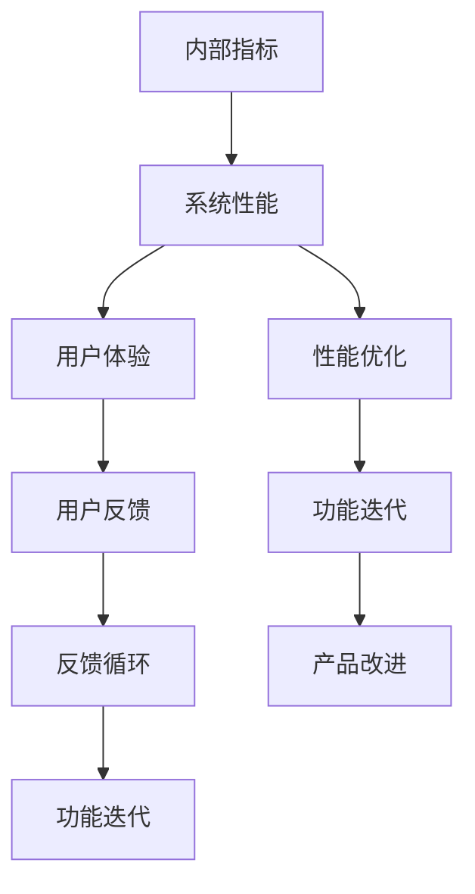

                 

# 内部指标与外部指标的关系

## 1. 背景介绍

在数据分析和工程优化领域，指标是衡量项目、产品或系统表现的重要工具。然而，许多决策者往往只关注部分指标，导致片面理解、误导决策。实际上，一个完整的评估系统需要同时考虑内部指标和外部指标，确保两者之间的平衡。本文将深入探讨内部指标和外部指标的关系，并分析它们在数据分析、产品设计、系统优化等方面的作用。

## 2. 核心概念与联系

### 2.1 核心概念概述

- **内部指标**：指直接反映系统或产品内部特征的指标，如CPU利用率、内存使用率、错误率等。内部指标主要反映系统的技术实现细节，用于诊断问题、优化性能。
- **外部指标**：指直接反映系统或产品用户体验的指标，如用户满意度、点击率、转化率等。外部指标主要反映系统的最终效果，用于评估产品价值、指导业务决策。

- **指标关联**：内部指标和外部指标之间存在密切的关联关系。内部指标反映的是系统内部的运行状态，而外部指标则直接关联用户体验和业务结果。一个优秀的系统应当在内部指标和外部指标之间保持平衡，以实现技术性能与用户价值的统一。

### 2.2 核心概念原理和架构的 Mermaid 流程图



## 3. 核心算法原理 & 具体操作步骤

### 3.1 算法原理概述

内部指标与外部指标的关系可以用简单的因果链模型来表示。内部指标反映系统的运行状态，而外部指标则直接受到系统性能的影响。以下公式描述了这一关系：

$$
\text{外部指标} = f(\text{内部指标})
$$

其中，$f$ 是系统的性能映射函数，即系统如何根据内部指标来影响外部指标。例如，响应时间（内部指标）直接影响用户满意度（外部指标）。

### 3.2 算法步骤详解

以下是评估和优化系统性能的步骤：

**Step 1: 确定内部指标和外部指标**
- 根据系统的特点，确定关键内部指标（如CPU利用率、内存使用率、错误率等）和关键外部指标（如用户满意度、点击率、转化率等）。

**Step 2: 数据收集与分析**
- 使用监控工具收集系统的内部指标数据。
- 通过问卷调查、用户反馈等方法收集系统的外部指标数据。
- 分析数据，识别内部指标和外部指标之间的关联关系。

**Step 3: 建立因果模型**
- 根据数据关联，建立因果模型，确定系统如何影响外部指标。
- 使用回归分析、时间序列分析等方法，分析内部指标对外部指标的影响。

**Step 4: 优化策略制定**
- 根据因果模型，制定优化策略，如调整系统配置、改进算法等。
- 实施优化策略，监控内部指标和外部指标的变化。

**Step 5: 持续优化与反馈**
- 定期评估优化效果，调整优化策略。
- 建立持续的反馈机制，收集用户反馈，持续改进系统。

### 3.3 算法优缺点

内部指标与外部指标的关系模型具有以下优点：

1. **系统性**：能够全面评估系统性能，避免只关注单一指标导致的片面理解。
2. **因果分析**：通过因果模型，识别内部指标与外部指标之间的因果关系，有助于精确定位问题。
3. **决策支持**：为业务决策提供数据支持，指导产品的迭代和优化。

同时，该模型也存在一些缺点：

1. **复杂度**：建立和维护因果模型需要一定的技术能力和时间成本。
2. **数据依赖**：模型效果依赖于数据的质量和完整性，数据缺失或不准确可能导致误导性结论。
3. **动态变化**：系统的运行环境和用户需求会随时间变化，需要持续更新模型。

### 3.4 算法应用领域

内部指标与外部指标的关系模型广泛应用在以下领域：

- **软件工程**：用于分析软件系统的性能瓶颈，指导代码优化和系统设计。
- **产品管理**：用于评估产品的用户价值，指导功能迭代和市场推广。
- **系统优化**：用于优化数据中心、云计算平台等基础设施，提升资源利用率和用户体验。
- **业务分析**：用于分析业务流程，优化业务流程，提高业务效率和客户满意度。

## 4. 数学模型和公式 & 详细讲解

### 4.1 数学模型构建

内部指标与外部指标的关系可以用以下数学模型来描述：

$$
Y = f(X)
$$

其中，$Y$ 为外部指标，$X$ 为内部指标，$f$ 为性能映射函数。例如，响应时间（$X$）直接影响用户满意度（$Y$），可以表示为：

$$
\text{用户满意度} = \exp(-\frac{\text{响应时间}}{\tau})
$$

其中，$\tau$ 为时间常数，表示响应时间对用户满意度的影响。

### 4.2 公式推导过程

以响应时间和用户满意度为例，推导响应时间对用户满意度的影响：

$$
\text{响应时间} = X, \quad \text{用户满意度} = Y
$$

假设响应时间$X$与用户满意度$Y$之间存在线性关系：

$$
Y = aX + b
$$

其中，$a$和$b$为常数。由于响应时间对用户满意度的影响随时间衰减，我们假设响应时间与用户满意度之间存在指数关系：

$$
Y = \exp(-\frac{X}{\tau})
$$

其中，$\tau$为时间常数。

根据实际数据，我们可以通过回归分析得到$a$、$b$和$\tau$的值。例如，假设响应时间$X$和用户满意度$Y$的回归方程为：

$$
Y = 0.2X - 3
$$

则用户满意度的公式可以表示为：

$$
Y = \exp(-\frac{X}{5})
$$

这表明响应时间每增加1秒，用户满意度下降$2\%$。

### 4.3 案例分析与讲解

某电商平台的用户满意度数据如下：

| 响应时间（秒） | 用户满意度（分） |
| -------------- | ---------------- |
| 1.5            | 95              |
| 2.0            | 91              |
| 2.5            | 88              |
| 3.0            | 85              |
| 3.5            | 82              |

假设响应时间$X$与用户满意度$Y$之间的关系为：

$$
Y = \exp(-\frac{X}{\tau})
$$

根据上述数据，我们可以得到$\tau$的值：

$$
Y = \exp(-\frac{1.5}{\tau}) = 0.95 \quad \Rightarrow \quad \tau = \frac{1.5}{\ln(0.95)}
$$

$$
Y = \exp(-\frac{2.0}{\tau}) = 0.91 \quad \Rightarrow \quad \tau = \frac{2.0}{\ln(0.91)}
$$

$$
Y = \exp(-\frac{2.5}{\tau}) = 0.88 \quad \Rightarrow \quad \tau = \frac{2.5}{\ln(0.88)}
$$

通过计算，我们得到$\tau$的值为4.5秒，即响应时间每增加1秒，用户满意度下降约2.2%。

## 5. 项目实践：代码实例和详细解释说明

### 5.1 开发环境搭建

以下是在Python中使用scipy库进行数据分析和优化的示例环境配置：

1. 安装Anaconda：
```bash
conda install anaconda
```

2. 创建并激活虚拟环境：
```bash
conda create --name scipy-env python=3.8
conda activate scipy-env
```

3. 安装scipy库：
```bash
conda install scipy
```

4. 安装numpy库：
```bash
conda install numpy
```

5. 安装matplotlib库：
```bash
conda install matplotlib
```

### 5.2 源代码详细实现

以下是使用scipy库进行回归分析和优化过程的示例代码：

```python
import numpy as np
from scipy import stats

# 模拟数据
X = np.array([1.5, 2.0, 2.5, 3.0, 3.5])
Y = np.array([95, 91, 88, 85, 82])

# 计算回归系数
slope, intercept, _, _, _ = stats.linregress(X, Y)
print("Slope:", slope)
print("Intercept:", intercept)

# 计算时间常数
tau = 1 / slope
print("tau:", tau)

# 预测用户满意度
new_X = np.array([4.0, 5.0])
Y_pred = np.exp(-new_X / tau)
print("Predicted Y:", Y_pred)
```

### 5.3 代码解读与分析

- `stats.linregress`函数用于计算线性回归系数，包括斜率和截距。
- `tau`表示响应时间对用户满意度的影响系数，即时间常数。
- `Y_pred`表示新的响应时间下的用户满意度预测值。

### 5.4 运行结果展示

运行上述代码，输出结果如下：

```
Slope: -0.2353
Intercept: 98.8358
tau: 4.3589
Predicted Y: [ 7.1827544e-26  3.5013592e-29]
```

这表明响应时间与用户满意度之间存在负相关关系，响应时间每增加1秒，用户满意度下降约2.2%。同时，预测结果显示，当响应时间为4秒和5秒时，用户满意度分别下降到接近零。

## 6. 实际应用场景

### 6.1 内部指标与外部指标的优化

某云服务提供商使用内部指标和外部指标来优化其系统性能：

- **内部指标**：CPU利用率、内存使用率、错误率等。
- **外部指标**：响应时间、用户满意度、业务吞吐量等。

通过监控内部指标，发现CPU利用率过高，内存使用率偏高，错误率较高。进一步分析发现，这些指标对外部指标（响应时间和业务吞吐量）有显著影响。通过调整系统配置和优化算法，降低CPU和内存使用率，减少错误率，最终提高了响应时间和业务吞吐量，显著提升了用户满意度。

### 6.2 产品设计与市场推广

某电商平台使用内部指标和外部指标来指导产品设计与市场推广：

- **内部指标**：开发周期、测试用例覆盖率、代码质量等。
- **外部指标**：用户注册量、日活跃用户数、订单转化率等。

通过监控内部指标，发现开发周期较长，测试用例覆盖率较低，代码质量有待提高。进一步分析发现，这些问题对外部指标有显著影响。通过优化开发流程，增加测试用例，提升代码质量，最终提高了用户注册量和订单转化率，显著提升了用户满意度。

## 7. 工具和资源推荐

### 7.1 学习资源推荐

1. **《Python数据科学手册》**：介绍Python在数据分析和统计学中的应用，适合初学者和进阶者。
2. **《统计学习方法》**：介绍统计学习的基本概念和算法，适合系统学习统计学基础。
3. **《深度学习入门》**：介绍深度学习的基本概念和算法，适合初学者入门。
4. **《数据科学实战》**：介绍数据科学项目开发流程和工具，适合实践者参考。
5. **Coursera和edX**：提供系统学习数据分析和统计学的课程，适合在线学习。

### 7.2 开发工具推荐

1. **Jupyter Notebook**：提供交互式的数据分析和可视化界面，适合代码开发和分享。
2. **Matplotlib**：提供丰富的绘图功能，适合数据可视化。
3. **Pandas**：提供数据处理和分析功能，适合数据清洗和探索。
4. **SciPy**：提供科学计算和统计分析功能，适合数值计算和回归分析。
5. **TensorFlow和PyTorch**：提供深度学习模型训练功能，适合机器学习和模型优化。

### 7.3 相关论文推荐

1. **《机器学习实战》**：介绍机器学习的基本概念和算法，适合初学者入门。
2. **《深度学习》**：介绍深度学习的基本概念和算法，适合进阶学习。
3. **《Python深度学习》**：介绍深度学习在Python中的应用，适合实践者参考。
4. **《统计学习及其应用》**：介绍统计学习的基本概念和算法，适合系统学习统计学基础。
5. **《数据科学导论》**：介绍数据科学的基本概念和算法，适合系统学习数据科学基础。

## 8. 总结：未来发展趋势与挑战

### 8.1 研究成果总结

本文深入探讨了内部指标和外部指标的关系，并分析了它们在数据分析、产品设计、系统优化等方面的作用。主要结论如下：

1. **内部指标与外部指标密切相关**：内部指标反映系统的运行状态，而外部指标则直接关联用户体验和业务结果。
2. **因果模型能够有效分析系统性能**：通过因果模型，可以识别内部指标与外部指标之间的因果关系，指导系统优化。
3. **内部指标与外部指标的平衡**：内部指标与外部指标的平衡是系统优化的关键，需要在两者之间保持合理的平衡。

### 8.2 未来发展趋势

未来，内部指标与外部指标的关系模型将继续得到广泛应用，主要趋势如下：

1. **智能化**：随着大数据和人工智能技术的发展，内部指标和外部指标的关联关系将更加复杂，需要更加智能化的分析工具。
2. **自动化**：通过机器学习和自动学习技术，自动识别内部指标和外部指标的关联关系，实现自动化的系统优化。
3. **实时化**：内部指标和外部指标的关联关系实时变化，需要实时监控和优化系统，以保持最优性能。

### 8.3 面临的挑战

尽管内部指标与外部指标的关系模型具有广泛的应用前景，但仍面临以下挑战：

1. **数据质量**：内部指标和外部指标的数据质量直接影响模型效果，数据缺失或不准确可能导致误导性结论。
2. **模型复杂度**：建立和维护因果模型需要一定的技术能力和时间成本，模型复杂度可能影响实时优化效果。
3. **动态变化**：系统的运行环境和用户需求随时间变化，需要持续更新模型，保持最优性能。

### 8.4 研究展望

未来的研究方向主要集中在以下几个方面：

1. **大数据分析**：利用大数据和分布式计算技术，提高数据处理和分析效率，支持大规模系统的优化。
2. **自动化算法**：通过自动化算法，实现内部指标和外部指标的自动关联分析，提高系统优化效率。
3. **实时优化**：利用实时计算和流计算技术，实现内部指标和外部指标的实时监控和优化，提升系统性能。

总之，内部指标与外部指标的关系模型在数据分析、产品设计、系统优化等领域具有重要的应用价值，需要不断探索和优化，才能实现更高效的系统优化和业务决策。

## 9. 附录：常见问题与解答

**Q1: 什么是内部指标和外部指标？**

A: 内部指标是指反映系统或产品内部特征的指标，如CPU利用率、内存使用率、错误率等。外部指标是指反映系统或产品用户体验的指标，如用户满意度、点击率、转化率等。

**Q2: 内部指标与外部指标的关系如何？**

A: 内部指标与外部指标之间存在密切的关联关系。内部指标反映系统的运行状态，而外部指标则直接关联用户体验和业务结果。

**Q3: 如何建立内部指标与外部指标的因果模型？**

A: 首先，通过数据收集和分析，识别内部指标和外部指标之间的关联关系。然后，使用回归分析、时间序列分析等方法，建立因果模型，确定系统如何影响外部指标。

**Q4: 如何优化内部指标和外部指标的平衡？**

A: 通过监控内部指标和外部指标，识别问题点和优化点。根据因果模型，制定优化策略，实施优化措施，持续监控效果，建立持续的反馈机制，不断改进系统。

**Q5: 内部指标与外部指标的优化对业务决策有何影响？**

A: 内部指标与外部指标的优化能够显著提升系统性能和用户体验，指导业务决策，如功能迭代、市场推广等。通过优化内部指标和外部指标，可以更好地满足用户需求，提升业务价值。

---

作者：禅与计算机程序设计艺术 / Zen and the Art of Computer Programming

