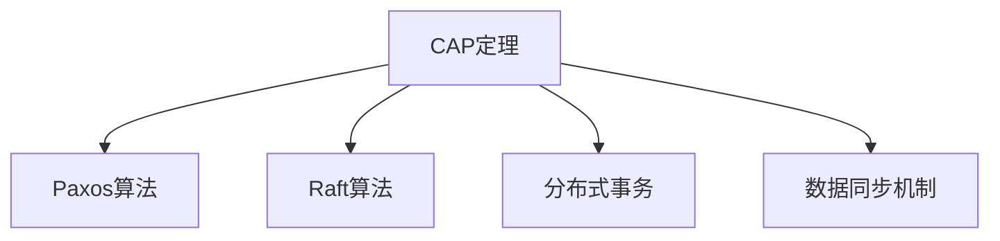

                 

## 1. 背景介绍

### 1.1 问题由来

在现代互联网时代，分布式系统已经成为了核心基础设施。无论是电商平台、社交网络、在线游戏，还是云服务、大数据处理系统，都高度依赖于分布式计算架构。然而，分布式系统设计充满挑战，尤其是一致性和可用性问题，一直困扰着系统开发者和运维人员。

一致性是指分布式系统中的多个节点能保持数据一致的状态。在多个节点协作的情况下，数据的写操作必须保证同步和持久性，否则可能导致数据丢失或状态不一致。可用性则关注系统在高负载和异常情况下的服务可用性，即在网络中断、机器故障等情况下，系统仍能正常提供服务。这两个目标在分布式系统中通常是矛盾的，因为保证一致性往往需要更严格的数据同步机制，但会增加系统的复杂性和可用性风险。

## 2. 核心概念与联系

### 2.1 核心概念概述

为了更好地理解一致性和可用性问题，首先需要介绍几个核心概念：

- **CAP定理**：一致性、可用性、分区容错性（Partition Tolerance）的简称，是分布式系统设计的基本原则之一。CAP定理指出，一个分布式系统只能同时保证这三者中的两项，无法同时保证全部三项。具体来说，一致性和分区容错性要求在数据一致性和网络分区情况下保持操作一致，而可用性则要求在网络故障时仍然提供服务。
- **Paxos和Raft算法**：是两种常用的分布式一致性算法，用于解决分布式系统中的拜占庭故障问题。它们通过一组共识协议，确保在分布式节点中达成一致意见。Paxos主要应用于较高的容错率场景，而Raft适用于较低的容错率环境。
- **分布式事务**：是对多个数据库操作的组合，在分布式系统中确保事务的一致性和原子性。常见的分布式事务解决方案包括2PC（两阶段提交）和SAGA。
- **数据同步机制**：如两阶段提交（2PC）、分布式事务（SAGA）、CQRS等，用于在分布式系统中保持数据一致性。

这些概念之间的逻辑关系可以通过以下Mermaid流程图来展示：



这个流程图展示了大规模分布式系统设计的基本原理和相关概念，一致性和可用性是系统设计中必须权衡的核心目标。

## 3. 核心算法原理 & 具体操作步骤

### 3.1 算法原理概述

一致性和可用性问题的解决通常涉及多个核心算法：

- **2PC算法**：两阶段提交协议，用于在分布式系统中协调多个数据库的事务处理。在两阶段提交中，事务管理器协调所有相关数据库，确保所有数据库操作要么全部成功，要么全部失败。
- **SAGA算法**：松散的事务模型，为分布式事务提供了一种更灵活的解决方案。SAGA允许在事务执行过程中回滚部分操作，实现更高效的事务管理。
- **Raft算法**：一种分布式共识算法，用于在多个节点中达成一致意见。Raft通过轮询投票机制，确保在网络故障和节点宕机情况下，系统仍能保持一致性。
- **Zookeeper**：用于分布式系统的协同服务，提供一致性服务、节点管理和配置中心等功能。

这些算法通过不同的机制，共同实现一致性和可用性目标。在实际应用中，常常需要根据具体场景选择最合适的算法和机制。

### 3.2 算法步骤详解

以2PC算法为例，其基本步骤如下：

1. **事务启动**：事务管理器（如数据库系统）启动一个事务，并向所有相关数据库节点发出事务请求。
2. **数据预处理**：各个节点接收事务请求，并进行数据预处理，如锁定资源等。
3. **事务投票**：各个节点在处理完数据预处理后，向事务管理器投票表示同意提交或回滚。
4. **提交/回滚**：如果所有节点都投票同意提交，则事务管理器向所有节点发出提交指令，否则回滚操作。
5. **确认**：节点在收到提交指令后，执行数据提交，并将提交状态返回给事务管理器。

这些步骤展示了2PC协议的基本流程，其中每一步都需要严格执行，否则可能导致数据不一致。

### 3.3 算法优缺点

一致性和可用性算法具有以下优点：

- **一致性保证**：通过严格的同步机制，确保分布式系统中数据的一致性，减少数据丢失的风险。
- **可用性保证**：在网络故障或节点宕机情况下，通过冗余机制和容错策略，保证系统服务的连续性和稳定性。

然而，这些算法也存在一定的局限性：

- **性能开销**：一致性和可用性算法的执行过程较为复杂，增加了系统的延迟和资源消耗。
- **系统复杂性**：实现一致性和可用性算法需要设计复杂的协议和数据同步机制，增加了系统设计和维护的难度。
- **单点故障风险**：一些算法如2PC依赖于事务管理器作为单点服务，一旦故障可能导致整个系统不可用。

### 3.4 算法应用领域

一致性和可用性算法广泛应用于各种分布式系统，包括：

- **金融系统**：在金融交易系统中，一致性算法如Paxos用于确保账目数据的一致性，可用性算法如SAGA用于在网络故障情况下保证交易的连续性。
- **云存储**：云存储系统如Hadoop、MongoDB等，通过一致性和可用性算法，确保数据的高可用性和一致性。
- **在线交易**：电子商务平台如淘宝、京东等，通过一致性和可用性算法，保证交易操作的原子性和一致性。
- **分布式数据库**：如Google Spanner、Amazon DynamoDB等分布式数据库系统，通过一致性和可用性算法，确保数据的分布式一致性和高可用性。

## 4. 数学模型和公式 & 详细讲解

### 4.1 数学模型构建

在分布式系统中，一致性和可用性问题的数学模型通常基于概率图模型构建。假设系统中有$n$个节点，每个节点都有$k$个副本，则系统的可用性和一致性可以用以下概率模型表示：

- **可用性**：$P_u = 1 - P(f) - P(n)$，其中$P(f)$表示单个节点的故障概率，$P(n)$表示网络中断的概率。
- **一致性**：$P_c = 1 - P(c)$，其中$P(c)$表示数据不一致的概率。

### 4.2 公式推导过程

以两阶段提交（2PC）为例，其一致性和可用性可以用以下公式推导：

1. **可用性**：
   $$
   P_u = (1 - P(f))^{n} \times (1 - P(n))
   $$

2. **一致性**：
   $$
   P_c = 1 - (1 - P(c_1))^{n} \times (1 - P(c_2))
   $$
   其中$c_1$和$c_2$分别表示一致性算法中第一阶段和第二阶段的错误概率。

这些公式展示了2PC算法在分布式系统中的可用性和一致性保证。

### 4.3 案例分析与讲解

假设一个分布式数据库系统有3个节点，每个节点有3个副本。每个节点的故障概率为0.1，网络中断的概率为0.01。假设第一阶段和第二阶段的错误概率分别为0.1和0.05，则系统的可用性和一致性可以计算如下：

- **可用性**：
  $$
  P_u = (1 - 0.1)^3 \times (1 - 0.01) \approx 0.997
  $$

- **一致性**：
  $$
  P_c = 1 - (1 - 0.01)^3 \times (1 - 0.05) \approx 0.995
  $$

这些计算展示了在上述环境下，系统的可用性和一致性水平。

## 5. 项目实践：代码实例和详细解释说明

### 5.1 开发环境搭建

在进行一致性和可用性实践前，我们需要准备好开发环境。以下是使用Python进行Apache Kafka开发的环境配置流程：

1. 安装Apache Kafka：从官网下载并安装Kafka，用于搭建分布式消息队列。
2. 创建Kafka集群：配置多个Kafka节点，确保每个节点都有足够的内存和处理器资源。
3. 安装Kafka Python API：通过pip安装kafka-python模块，用于与Kafka进行交互。
4. 安装Zookeeper：Kafka依赖于Zookeeper进行集群管理和配置，安装并启动Zookeeper服务。
5. 配置Kafka集群：通过kafka-topic.sh创建和配置Kafka主题。

完成上述步骤后，即可在Kafka集群上搭建分布式系统，进行一致性和可用性的实践。

### 5.2 源代码详细实现

这里以使用Kafka和Zookeeper实现一致性为例，展示基于Kafka的分布式系统实现。

1. 创建Kafka主题：
```bash
kafka-topics.sh --create --bootstrap-server localhost:9092 --topic my-topic --partitions 3 --replication-factor 3 --config acknowledgments=all
```

2. 配置Zookeeper：
```bash
kafka-console-producer.sh --topic my-topic --bootstrap-server localhost:9092 --broker-list localhost:9092
```

3. 生产数据：
```bash
kafka-console-producer.sh --topic my-topic --bootstrap-server localhost:9092 --broker-list localhost:9092 --topic my-topic --partitions 3 --replication-factor 3 --config acknowledgments=all
```

4. 消费数据：
```bash
kafka-console-consumer.sh --topic my-topic --bootstrap-server localhost:9092 --from-beginning --partitions 3 --enable-auto-commit --auto-commit-interval-ms 1000 --auto-offset-request-max-size 1
```

### 5.3 代码解读与分析

代码部分展示了Kafka和Zookeeper的配置和数据交互过程。其中，Kafka用于分布式消息队列，Zookeeper用于集群管理和配置。通过设置多个节点和副本，可以确保数据的高可用性和一致性。

1. **Kafka配置**：
   - 创建主题：使用kafka-topics.sh创建主题，并设置分区和副本数量。
   - 启动生产者和消费者：使用kafka-console-producer.sh和kafka-console-consumer.sh分别启动生产者和消费者。

2. **Zookeeper配置**：
   - 配置Kafka集群：通过kafka-topics.sh配置Kafka集群，确保每个节点都有足够的资源。
   - 启动Zookeeper服务：安装并启动Zookeeper服务，确保集群正常运行。

通过以上步骤，可以构建一个简单的分布式系统，并展示一致性和可用性的基本原理和实现方法。

### 5.4 运行结果展示

通过运行上述代码，可以观察到Kafka集群和Zookeeper集群正常工作，并能够进行数据的生产、消费和记录。这展示了分布式系统的一致性和可用性特性，通过数据同步机制确保了数据的可靠性和系统的高可用性。

## 6. 实际应用场景

### 6.1 智能电网

智能电网系统需要处理大量的数据流，包括能源消费、电网状态、气象数据等。这些数据在分布式系统中进行存储和处理，需要保证数据的一致性和系统的可用性。

在智能电网系统中，一致性算法如Raft和Paxos用于确保电网数据的一致性，可用性算法如Kafka和Zookeeper用于保证数据的高可用性和系统的稳定运行。通过分布式数据库和消息队列，智能电网系统能够高效地处理和传输数据，实现电网的智能化管理。

### 6.2 物联网

物联网设备通过互联网进行连接和通信，需要处理大量的数据和事务操作。一致性算法如2PC和SAGA用于确保物联网系统的数据一致性，可用性算法如Kafka和Zookeeper用于保证系统的稳定运行。

在物联网系统中，分布式数据库和消息队列用于处理和存储设备数据，一致性和可用性算法确保数据的一致性和系统的可靠性。通过分布式计算架构，物联网系统能够高效地处理海量数据，实现智能化的设备管理和监控。

### 6.3 金融交易

金融交易系统需要保证交易的原子性和一致性，避免数据丢失和状态不一致。一致性算法如Raft和Paxos用于确保金融交易系统的一致性，可用性算法如Kafka和Zookeeper用于保证系统的稳定运行。

在金融交易系统中，分布式数据库和消息队列用于处理和存储交易数据，一致性和可用性算法确保交易的原子性和一致性。通过分布式计算架构，金融交易系统能够高效地处理海量交易数据，实现交易的实时化和自动化。

### 6.4 未来应用展望

未来，一致性和可用性算法将继续在各种分布式系统中发挥重要作用，以下是一些未来应用展望：

1. **边缘计算**：边缘计算在网络边缘进行数据处理和存储，需要一致性和可用性算法确保数据的可靠性和系统的稳定性。
2. **区块链**：区块链系统通过分布式账本实现数据一致性，需要一致性和可用性算法确保账本的安全性和可靠性。
3. **云计算**：云计算平台需要一致性和可用性算法确保数据的一致性和系统的稳定性，支持大规模的分布式计算和存储。
4. **自动驾驶**：自动驾驶系统需要处理大量的传感器数据和决策信息，需要一致性和可用性算法确保系统的可靠性和安全性。

## 7. 工具和资源推荐

### 7.1 学习资源推荐

为了帮助开发者系统掌握一致性和可用性问题的理论基础和实践技巧，这里推荐一些优质的学习资源：

1. **《分布式系统设计与实践》**：由多届Google软件架构师撰写，深入浅出地介绍了分布式系统的设计原则、算法和工具。
2. **《分布式一致性算法》**：介绍了Raft、Paxos等一致性算法的原理和实现方法，适合系统开发者和架构师深入学习。
3. **《分布式系统基础》**：涵盖分布式系统的核心概念和经典算法，适合系统架构师和研究人员参考。
4. **Kafka官方文档**：详细介绍了Kafka的安装、配置和使用方法，适合开发者学习使用。
5. **Zookeeper官方文档**：介绍了Zookeeper的安装、配置和使用方法，适合开发者学习使用。

通过对这些资源的学习实践，相信你一定能够快速掌握一致性和可用性的精髓，并用于解决实际的分布式系统问题。

### 7.2 开发工具推荐

高效的开发离不开优秀的工具支持。以下是几款用于分布式系统一致性和可用性开发的常用工具：

1. **Kafka**：Apache开源的分布式消息队列，支持高吞吐量和低延迟的数据传输。
2. **Zookeeper**：Apache开源的分布式协同服务，提供集群管理和配置中心等功能。
3. **Hadoop**：Apache开源的分布式计算框架，支持大规模数据处理和存储。
4. **Spark**：Apache开源的分布式计算框架，支持高并发和低延迟的数据处理。
5. **Elasticsearch**：开源的分布式搜索引擎，支持高可用性和高可扩展性。

合理利用这些工具，可以显著提升分布式系统的一致性和可用性，加快创新迭代的步伐。

### 7.3 相关论文推荐

一致性和可用性算法的发展源于学界的持续研究。以下是几篇奠基性的相关论文，推荐阅读：

1. **《分布式系统中的CAP定理》**：由Alistair Cargill和Werner Vogels撰写，介绍了CAP定理的基本概念和应用场景。
2. **《Raft一致性算法》**：由Diego Ombúa和Christopher Stocker撰写，介绍了Raft算法的原理和实现方法。
3. **《两阶段提交协议》**：由Gary Koster和A. J. Maloney撰写，介绍了2PC协议的原理和实现方法。
4. **《SAGA算法》**：由Ivan Deseni等撰写，介绍了SAGA算法的原理和实现方法。

这些论文代表了一致性和可用性算法的进展，通过学习这些前沿成果，可以帮助研究者把握学科前进方向，激发更多的创新灵感。

## 8. 总结：未来发展趋势与挑战

### 8.1 研究成果总结

一致性和可用性算法是分布式系统设计的重要组成部分，经过多年的研究和实践，已经形成了较为成熟的理论基础和实现方法。这些算法在实际应用中表现良好，保障了分布式系统的可靠性和稳定性。

### 8.2 未来发展趋势

未来，一致性和可用性算法将继续在分布式系统中发挥重要作用，以下是一些发展趋势：

1. **去中心化**：去中心化技术如区块链、分布式账本等，将进一步推动分布式系统的分布式架构和一致性算法的发展。
2. **多租户支持**：多租户支持是分布式系统的重要特性，一致性和可用性算法需要适应不同租户的需求。
3. **边缘计算**：边缘计算在网络边缘进行数据处理和存储，需要一致性和可用性算法确保数据的可靠性和系统的稳定性。
4. **微服务架构**：微服务架构需要高效一致性和可用性算法，支持分布式系统的微服务化和模块化设计。

### 8.3 面临的挑战

尽管一致性和可用性算法已经取得了不少进展，但在迈向更加智能化、普适化应用的过程中，仍面临诸多挑战：

1. **复杂性增加**：一致性和可用性算法的复杂性随着系统的规模和需求的增加而增加。如何设计更加简单、高效的算法，是未来的研究方向。
2. **性能瓶颈**：一致性和可用性算法在处理大量数据和高并发请求时，可能出现性能瓶颈。如何优化算法实现，提高系统性能，是未来的研究方向。
3. **数据一致性问题**：在分布式系统中，数据一致性问题依然是一个挑战。如何保证数据的一致性和系统的可靠性，是未来的研究方向。
4. **单点故障风险**：一致性和可用性算法通常依赖于中心化服务，存在单点故障风险。如何设计更加鲁棒的算法，避免单点故障，是未来的研究方向。

### 8.4 研究展望

面对一致性和可用性算法面临的挑战，未来的研究需要在以下几个方面寻求新的突破：

1. **去中心化算法**：研究去中心化算法，如区块链、分布式账本等，以适应分布式系统的需求。
2. **微服务架构**：研究微服务架构中的分布式事务和一致性算法，支持分布式系统的微服务化和模块化设计。
3. **边缘计算**：研究边缘计算中的数据一致性和系统可靠性，支持分布式系统的边缘计算架构。
4. **分布式共识**：研究新的分布式共识算法，如拜占庭容错算法等，提高系统的鲁棒性和可靠性。

这些研究方向的探索，必将引领一致性和可用性算法迈向更高的台阶，为构建安全、可靠、可控的分布式系统铺平道路。面向未来，一致性和可用性算法还需要与其他人工智能技术进行更深入的融合，如因果分析、强化学习等，共同推动分布式系统的进步。

## 9. 附录：常见问题与解答

**Q1：一致性和可用性算法如何选择？**

A: 一致性和可用性算法的选择需要根据具体场景进行权衡。一般来说，如果数据一致性要求较高，可以选择一致性较强的算法，如Raft和Paxos；如果系统可用性要求较高，可以选择可用性较强的算法，如2PC和SAGA。在实际应用中，通常需要综合考虑数据一致性、系统可用性和系统复杂性，选择最适合的算法。

**Q2：如何优化一致性和可用性算法？**

A: 一致性和可用性算法的优化可以从以下几个方面入手：

1. **分布式数据存储**：通过分布式数据存储技术，如Hadoop和Spark，可以提高数据处理效率，减少单点故障风险。
2. **去中心化技术**：通过区块链和分布式账本等去中心化技术，可以提高系统的鲁棒性和可扩展性。
3. **微服务架构**：通过微服务架构，可以支持分布式系统的模块化和可扩展性，提高系统的可用性和性能。
4. **负载均衡和调度**：通过负载均衡和调度算法，可以提高系统的并发处理能力和稳定性。

**Q3：一致性和可用性算法在实际应用中需要注意什么？**

A: 一致性和可用性算法在实际应用中需要注意以下几点：

1. **数据同步机制**：一致性算法需要设计有效的数据同步机制，确保数据的一致性和可靠性。
2. **网络中断处理**：在网络中断情况下，一致性和可用性算法需要保证系统的稳定性和可靠性。
3. **故障恢复机制**：在系统故障情况下，一致性和可用性算法需要保证系统的快速恢复和数据的一致性。
4. **单点故障风险**：一致性和可用性算法通常依赖于中心化服务，需要设计鲁棒的算法，避免单点故障。

通过系统设计和管理，可以在实际应用中充分发挥一致性和可用性算法的优势，保障分布式系统的可靠性和稳定性。

---

作者：禅与计算机程序设计艺术 / Zen and the Art of Computer Programming

