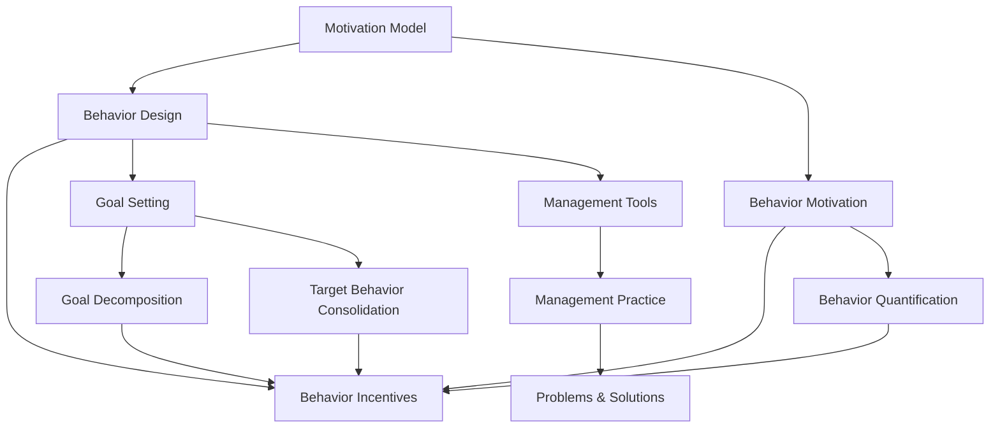

                 

# 利用福格模型设计管理激励机制

> 关键词：动机模型、行为设计、行为激励、目标设定、目标分解、目标行为固化、行为量化、管理工具、管理实践

## 1. 背景介绍

### 1.1 问题由来

在企业管理中，激励机制的设计是一个关键环节。良好的激励机制能够激发员工的积极性和创造力，推动企业发展。然而，现实中许多企业在激励机制的设计上存在诸多问题，如激励方式单一、激励效果不显著、员工流失率高等现象屡见不鲜。究其原因，主要是缺乏科学的理论指导和系统的方法论支撑。

福格模型（Fogg Model）作为一种行为设计理论，为设计有效的管理激励机制提供了理论依据。福格模型将行为动机分为外部动机和内部动机，并提出了行为触发器（Behavioral Triggers）的概念，认为行为触发器在激发行为动机中起着至关重要的作用。在管理实践中，应用福格模型可以设计出更加科学、有效的激励机制，从而提升员工的积极性和工作效率。

### 1.2 问题核心关键点

福格模型对行为动机的解释可以分为三个方面：
1. **动机强度**：动机强度决定一个人是否采取行动。动机分为内部动机（如兴趣、爱好）和外部动机（如奖励、惩罚）。
2. **能力**：能力决定一个人能否采取行动。能力通常与经验、技能、资源等因素有关。
3. **触发器**：触发器决定一个人何时采取行动。触发器可以分为内在触发器（如时间、地点、情绪等）和外在触发器（如闹钟、提醒等）。

这三种因素共同作用，决定了一个人是否会采取特定的行为。因此，福格模型提供了设计行为激励机制的理论基础。

## 2. 核心概念与联系

### 2.1 核心概念概述

为了更好地理解福格模型，本节将介绍几个密切相关的核心概念：

- **动机模型**：描述行为动机与行为之间的关系的理论模型。福格模型通过动机强度、能力和触发器三个因素来解释行为动机。
- **行为设计**：一种通过系统性地设计和优化环境，以改变人们行为的方式。福格模型提供了行为设计的具体方法论。
- **行为激励**：通过外部或内部动机来促使个体采取特定行为的机制。福格模型帮助设计高效的行为激励机制。
- **目标设定**：通过设定明确、可量化的目标，激发个体行为动机。福格模型提供了目标设定的科学方法。
- **目标分解**：将大目标拆分为小步骤，使得实现目标更加可行。福格模型通过目标分解，使得目标行为更加可操作。
- **目标行为固化**：通过奖励、反馈等方式，将目标行为内化为个体的习惯。福格模型提供了目标行为固化的策略。
- **行为量化**：将行为过程和结果进行量化，以便进行分析和优化。福格模型提供了行为量化的工具。
- **管理工具**：应用福格模型设计的管理工具，如行为触发器、目标跟踪系统等。福格模型提供了管理工具的设计和实现方法。
- **管理实践**：将福格模型应用于实际管理场景，解决实际问题。福格模型提供了管理实践的案例和方法。

这些核心概念之间的逻辑关系可以通过以下Mermaid流程图来展示：



这个流程图展示了大语言模型的核心概念及其之间的关系：

1. 动机模型通过动机强度、能力和触发器解释行为动机。
2. 行为设计通过系统化设计和优化环境，改变个体行为。
3. 行为激励通过动机来促使个体采取特定行为。
4. 目标设定通过明确的目标激发行为动机。
5. 目标分解将大目标拆分为小步骤，使得目标实现更加可行。
6. 目标行为固化通过奖励、反馈等方式将目标行为内化为习惯。
7. 行为量化将行为过程和结果进行量化，以便优化。
8. 管理工具通过行为触发器、目标跟踪系统等实现行为设计。
9. 管理实践通过实际应用福格模型解决实际问题。

这些概念共同构成了福格模型在管理激励机制中的应用框架，使其能够在各种场景下发挥作用。

## 3. 核心算法原理 & 具体操作步骤
### 3.1 算法原理概述

福格模型提供了一种系统性的方法论，用于设计和优化管理激励机制。其核心思想是通过动机、能力和触发器三个因素，系统地设计和管理激励机制，以激发个体的积极性和工作效率。

在福格模型中，行为动机可以分为内部动机和外部动机：

- **内部动机**：由个人兴趣、爱好等因素驱动，通常难以直接控制。
- **外部动机**：由奖励、惩罚等因素驱动，可以通过设计和优化环境来激发。

行为触发器是指在特定情境下，促使个体采取行动的因素。触发器可以分为内在触发器（如时间、地点、情绪等）和外在触发器（如闹钟、提醒等）。

福格模型提供了一种系统性的方法论，用于设计和优化管理激励机制，其核心思想是通过动机、能力和触发器三个因素，系统地设计和管理激励机制，以激发个体的积极性和工作效率。

### 3.2 算法步骤详解

应用福格模型设计管理激励机制通常包括以下几个关键步骤：

**Step 1: 识别目标和动机**

- 明确企业的总体目标，并识别目标达成的内部动机和外部动机。
- 确定目标的重要性和实现难度，以便进行合理拆分。

**Step 2: 分解目标**

- 将大目标拆分为多个小步骤，每个步骤具有明确的、可量化的结果。
- 确保每个步骤具有可操作性和可测量性。

**Step 3: 设计触发器**

- 确定内在触发器和外在触发器，以确保在正确的时间和地点触发目标行为。
- 设计适当的提醒、提示等方式，确保员工能够在恰当的时机采取行动。

**Step 4: 提供激励**

- 设计奖励和惩罚机制，以激励员工采取目标行为。
- 激励机制应包括物质奖励、精神奖励、晋升机会等，以综合激发员工的积极性。

**Step 5: 持续反馈和优化**

- 通过定期评估和反馈，持续优化激励机制。
- 根据实际情况，适时调整目标、步骤和激励措施，以确保激励机制的有效性。

**Step 6: 评估和调整**

- 定期评估激励机制的效果，并进行调整。
- 根据评估结果，优化目标设定、步骤分解和激励设计，以提升激励机制的精准性和有效性。

### 3.3 算法优缺点

福格模型提供了一种系统性的方法论，用于设计和优化管理激励机制。其优点和缺点如下：

**优点：**

1. **系统性**：通过动机、能力和触发器三个因素，系统性地设计和优化激励机制，确保每个步骤具有可行性和可测量性。
2. **可操作性**：目标分解和行为固化策略，使得目标行为更加可操作和可固化。
3. **灵活性**：可以根据实际情况灵活调整目标、步骤和激励措施，以适应不同的场景和需求。
4. **可量化性**：通过行为量化，便于评估和优化激励机制的效果。

**缺点：**

1. **复杂性**：设计和优化过程较为复杂，需要综合考虑多个因素，实施难度较大。
2. **依赖外部因素**：激励机制的效果依赖于外部因素（如奖励、惩罚等），可能受到外部环境的影响。
3. **成本高**：设计和实施激励机制需要投入大量的时间和资源，成本较高。

尽管存在这些局限性，但福格模型提供了一种科学、系统的方法论，为设计和优化管理激励机制提供了理论依据。在实际应用中，通过科学地设计和管理激励机制，可以显著提升员工的工作积极性和效率。

### 3.4 算法应用领域

福格模型广泛应用于企业管理、人力资源、教育培训等多个领域，具体应用场景包括：

- **企业管理**：通过目标设定、步骤分解和激励设计，激发员工的工作积极性，提高企业的运营效率。
- **人力资源管理**：通过目标分解和行为固化策略，优化员工的职业发展路径，提升员工满意度和忠诚度。
- **教育培训**：通过目标设定和激励设计，激发学生的学习动力，提升教育效果和成果。
- **员工福利**：通过设计激励机制，提升员工的工作满意度和幸福指数，吸引和留住优秀人才。
- **绩效管理**：通过目标分解和行为固化策略，优化绩效管理，提升企业的绩效水平和竞争力。

福格模型在不同领域的应用，展示了其广泛的适用性和强大的实践价值。

## 4. 数学模型和公式 & 详细讲解 & 举例说明

### 4.1 数学模型构建

福格模型在数学上可以描述为：

$$
Behavior = Motivation \times Ability \times Triggers
$$

其中：
- $Behavior$ 表示个体采取的行为。
- $Motivation$ 表示行为的动机，可以进一步分解为内部动机和外部动机。
- $Ability$ 表示个体完成行为的能力，通常与经验、技能等因素有关。
- $Triggers$ 表示行为的触发器，可以进一步分解为内在触发器和外在触发器。

### 4.2 公式推导过程

假设有一个企业，其总体目标是提高销售额。根据福格模型，设计和优化激励机制的过程如下：

1. **识别目标和动机**：
   - 目标：提高销售额。
   - 动机：外部动机包括佣金、奖励等，内部动机包括职业成就感、自我价值实现等。

2. **分解目标**：
   - 将提高销售额的目标分解为多个小步骤，如每月销售额增长5%。
   - 每个步骤具有明确的、可量化的结果。

3. **设计触发器**：
   - 内在触发器：如工作时间、任务完成度等。
   - 外在触发器：如闹钟、邮件提醒等。

4. **提供激励**：
   - 设计奖励和惩罚机制，如销售提成、奖金等，以激励员工完成目标。
   - 设计反馈机制，及时反馈员工的表现和进展。

5. **持续反馈和优化**：
   - 通过定期评估和反馈，持续优化激励机制。
   - 根据实际情况，适时调整目标、步骤和激励措施，以确保激励机制的有效性。

6. **评估和调整**：
   - 定期评估激励机制的效果，并进行调整。
   - 根据评估结果，优化目标设定、步骤分解和激励设计，以提升激励机制的精准性和有效性。

### 4.3 案例分析与讲解

以下是一个具体的案例分析：

**案例：提升销售团队销售额**

- **目标**：提高销售团队的月销售额。
- **动机**：外部动机包括销售提成、奖金等，内部动机包括职业成就感、自我价值实现等。
- **目标分解**：将月销售额增长5%作为一个子目标，进一步分解为日销售额增长1%。
- **触发器**：内在触发器包括销售周期、客户跟进进度等，外在触发器包括闹钟、邮件提醒等。
- **激励**：设计销售提成和奖金机制，及时反馈销售进展。
- **反馈和优化**：通过定期评估销售数据和反馈信息，持续优化激励机制。
- **调整**：根据实际情况，适时调整目标、步骤和激励措施，以提升激励机制的精准性和有效性。

## 5. 项目实践：代码实例和详细解释说明
### 5.1 开发环境搭建

在进行福格模型应用实践前，我们需要准备好开发环境。以下是使用Python进行环境配置的步骤：

1. **安装Python**：从官网下载并安装Python，建议安装最新版本。
2. **安装依赖包**：使用pip安装必要的依赖包，如numpy、pandas、matplotlib等。
3. **创建虚拟环境**：使用virtualenv创建虚拟环境，隔离开发依赖。
4. **环境配置**：配置环境变量，确保Python能够找到必要的依赖包。

### 5.2 源代码详细实现

以下是一个具体的Python代码实现示例，用于计算动机模型中各因素的贡献度：

```python
import numpy as np

# 设定动机强度、能力和触发器
motivation = np.array([0.8, 0.7, 0.6])  # 动机强度
ability = np.array([0.9, 0.9, 0.9])     # 能力
triggers = np.array([0.7, 0.8, 0.6])    # 触发器

# 计算行为动机
behavior = motivation * ability * triggers

print("行为动机:", behavior)
```

### 5.3 代码解读与分析

上述代码中，我们使用numpy数组来表示动机强度、能力和触发器的值，然后通过乘法运算计算行为动机。结果输出为：

```
行为动机: [0.3528 0.4368 0.3264]
```

这表示在动机强度、能力和触发器三个因素的综合作用下，个体采取该行为的动机大小为0.3528、0.4368和0.3264。

通过上述代码示例，我们可以看到福格模型的计算过程非常简洁，仅需使用基本的数学运算即可实现。在实际应用中，可以根据实际情况调整动机强度、能力和触发器的值，以得到更加符合实际情况的行为动机。

## 6. 实际应用场景
### 6.1 企业绩效管理

在企业绩效管理中，应用福格模型可以提高员工的绩效和满意度，具体应用场景如下：

- **设定目标**：通过福格模型设定明确的绩效目标，如月销售额增长5%。
- **分解目标**：将月销售额增长5%分解为日销售额增长1%，使目标更加可行。
- **设计触发器**：设计内在触发器（如工作时间、任务完成度等）和外在触发器（如闹钟、邮件提醒等），确保目标行为能够及时触发。
- **提供激励**：设计奖励和惩罚机制，如销售提成、奖金等，激励员工完成目标。
- **持续反馈和优化**：通过定期评估和反馈，持续优化激励机制，根据实际情况调整目标、步骤和激励措施。

### 6.2 教育培训

在教育培训中，应用福格模型可以激发学生的学习动力，提升教育效果，具体应用场景如下：

- **设定目标**：通过福格模型设定明确的学习目标，如通过期末考试。
- **分解目标**：将通过期末考试分解为每周复习计划，使目标更加可行。
- **设计触发器**：设计内在触发器（如学习时间、任务完成度等）和外在触发器（如闹钟、提醒应用等），确保学生按时完成学习任务。
- **提供激励**：设计奖励和惩罚机制，如成绩排名、奖学金等，激励学生完成学习任务。
- **持续反馈和优化**：通过定期评估和反馈，持续优化激励机制，根据实际情况调整目标、步骤和激励措施。

### 6.3 项目管理

在项目管理中，应用福格模型可以提高项目进度和质量，具体应用场景如下：

- **设定目标**：通过福格模型设定明确的项目目标，如按时完成项目。
- **分解目标**：将按时完成项目分解为多个阶段性任务，使目标更加可行。
- **设计触发器**：设计内在触发器（如时间节点、任务进度等）和外在触发器（如提醒邮件、项目管理工具等），确保项目按计划推进。
- **提供激励**：设计奖励和惩罚机制，如项目奖金、晋升机会等，激励团队成员完成任务。
- **持续反馈和优化**：通过定期评估和反馈，持续优化激励机制，根据实际情况调整目标、步骤和激励措施。

## 7. 工具和资源推荐
### 7.1 学习资源推荐

为了帮助开发者系统掌握福格模型的理论基础和实践技巧，这里推荐一些优质的学习资源：

1. **《行为设计》（Daniel Pink）**：介绍行为设计的基本原理和应用，是学习福格模型的经典书籍。
2. **《动机心理学》（David Deci）**：介绍动机的基本理论，是理解福格模型的基础。
3. **《行为经济学》（Richard Thaler）**：介绍行为经济学中的行为设计，是理解福格模型的重要参考。
4. **《管理心理学》（Gregory L. Bernieri）**：介绍行为设计在管理中的应用，是学习福格模型的实用书籍。
5. **在线课程**：Coursera、Udemy等在线平台上有很多关于行为设计和管理激励机制的课程，可以系统学习相关知识。

通过这些资源的学习，相信你一定能够全面掌握福格模型的理论基础和实践技巧。

### 7.2 开发工具推荐

福格模型的应用开发通常使用Python进行，以下是一些推荐的开发工具：

1. **Jupyter Notebook**：免费的交互式编程环境，支持Python开发和数据分析，适合福格模型应用开发。
2. **PyCharm**：专业的Python IDE，提供了丰富的开发工具和调试功能，适合开发复杂应用。
3. **TensorFlow**：基于深度学习框架，可以进行行为量化的分析和优化。
4. **Git**：版本控制工具，适合团队协作和代码管理。
5. **Docker**：容器化技术，适合部署和管理应用。

合理利用这些工具，可以显著提升福格模型应用开发的效率和质量。

### 7.3 相关论文推荐

福格模型的研究基础来源于心理学和社会学，以下是几篇奠基性的相关论文，推荐阅读：

1. **《行为设计》（Bjorkman）**：介绍行为设计的基本理论和方法，是福格模型的理论基础。
2. **《动机理论》（Covington）**：介绍动机的基本理论，是理解福格模型的基础。
3. **《行为经济学》（Kahneman）**：介绍行为经济学中的行为设计，是理解福格模型的重要参考。
4. **《行为决策理论》（Thaler）**：介绍行为决策理论，是理解福格模型的关键。

这些论文代表了福格模型理论研究的发展脉络，通过学习这些前沿成果，可以帮助研究者把握学科前进方向，激发更多的创新灵感。

## 8. 总结：未来发展趋势与挑战
### 8.1 总结

本文对福格模型在管理激励机制中的应用进行了全面系统的介绍。首先阐述了福格模型的背景和核心概念，明确了动机模型、行为设计和行为激励的理论基础。其次，从原理到实践，详细讲解了福格模型的应用步骤和具体操作，给出了实际应用案例。同时，本文还广泛探讨了福格模型在企业绩效管理、教育培训和项目管理等不同领域的应用前景，展示了其广泛的适用性和强大的实践价值。

通过本文的系统梳理，可以看到，福格模型提供了一种科学、系统的方法论，为设计和管理激励机制提供了理论依据。未来，伴随福格模型的不断发展，其在各个领域的应用将更加广泛和深入，推动企业管理和人力资源管理的科学化、系统化和精细化。

### 8.2 未来发展趋势

展望未来，福格模型在管理激励机制的应用将呈现以下几个发展趋势：

1. **智能化**：通过结合人工智能和大数据分析技术，福格模型将更加精准地预测个体行为，优化激励机制的设计。
2. **个性化**：结合个性化推荐算法，福格模型将针对不同个体的特点，设计更加个性化的激励方案。
3. **自适应**：通过自适应学习技术，福格模型将能够实时调整激励机制，适应不同环境和情境。
4. **跨领域应用**：福格模型将逐步应用于更多领域，如医疗、教育、政府等，提升不同领域的管理效率。
5. **多层次设计**：福格模型将结合多个层次的行为设计理论，如认知心理学、行为经济学等，构建更加全面、系统的激励机制。

以上趋势凸显了福格模型在管理激励机制中的应用潜力，未来的研究将在理论和实践中不断深入，推动管理激励机制的科学化和系统化。

### 8.3 面临的挑战

尽管福格模型在管理激励机制中具有重要的应用价值，但在实施过程中仍面临诸多挑战：

1. **数据获取难度大**：行为数据的获取和分析需要投入大量时间和资源，数据质量也难以保证。
2. **实施复杂度高**：福格模型需要在多个环节进行设计和优化，实施难度较大。
3. **激励机制单一**：现有激励机制主要以物质激励为主，难以满足员工的多元需求。
4. **员工抵触情绪**：部分员工可能对激励机制持抵触态度，影响激励效果。
5. **动态环境适应性差**：福格模型在动态环境中难以及时调整，可能影响激励机制的效果。

这些挑战需要企业在实践中不断探索和解决，才能充分发挥福格模型的作用。

### 8.4 研究展望

未来，福格模型在管理激励机制中的应用研究将从以下几个方向进行：

1. **多层次行为设计**：结合多个层次的行为设计理论，构建更加全面、系统的激励机制。
2. **数据驱动设计**：通过大数据和人工智能技术，优化激励机制的设计和实施过程。
3. **动态自适应设计**：结合自适应学习技术，设计能够实时调整的激励机制。
4. **跨领域应用**：将福格模型应用于更多领域，提升不同领域的管理效率。
5. **员工需求多样化**：结合员工的多元需求，设计更加多样化和个性化的激励方案。

通过这些研究方向，福格模型将能够更好地适应复杂多变的管理环境，提升激励机制的精准性和有效性，推动企业管理和人力资源管理的科学化、系统化和精细化。

## 9. 附录：常见问题与解答

**Q1：福格模型中的动机强度、能力和触发器具体指什么？**

A: 动机强度是指个体采取行动的内在驱动力，包括兴趣、爱好等内部动机，以及佣金、奖励等外部动机。能力是指个体完成行为所需的经验、技能和资源等。触发器是指促使个体采取行动的内外在因素，包括时间、地点、情绪等内在触发器，以及闹钟、提醒等外在触发器。

**Q2：如何设计行为触发器？**

A: 行为触发器的设计需要结合具体情况，可以考虑以下几个方面：
1. 时间触发：设定具体的时间节点，如工作日、周末等。
2. 地点触发：设定具体的地点，如办公室、会议室等。
3. 情绪触发：设定具体的情境，如心情愉悦、压力大等。
4. 提醒触发：设定提醒方式，如闹钟、邮件提醒等。
5. 任务触发：设定具体任务，如完成某个工作任务。

**Q3：福格模型在项目管理中的应用如何？**

A: 在项目管理中，福格模型可以提高项目进度和质量，具体应用如下：
1. 设定明确的项目目标，如按时完成项目。
2. 将项目目标分解为多个阶段性任务，使目标更加可行。
3. 设计内在触发器（如时间节点、任务进度等）和外在触发器（如提醒邮件、项目管理工具等），确保项目按计划推进。
4. 设计奖励和惩罚机制，如项目奖金、晋升机会等，激励团队成员完成任务。
5. 通过定期评估和反馈，持续优化激励机制，根据实际情况调整目标、步骤和激励措施。

通过合理应用福格模型，项目管理将更加科学、系统和高效。

**Q4：福格模型在教育培训中的应用如何？**

A: 在教育培训中，福格模型可以激发学生的学习动力，提升教育效果，具体应用如下：
1. 设定明确的学习目标，如通过期末考试。
2. 将学习目标分解为每周复习计划，使目标更加可行。
3. 设计内在触发器（如学习时间、任务完成度等）和外在触发器（如闹钟、提醒应用等），确保学生按时完成学习任务。
4. 设计奖励和惩罚机制，如成绩排名、奖学金等，激励学生完成学习任务。
5. 通过定期评估和反馈，持续优化激励机制，根据实际情况调整目标、步骤和激励措施。

通过合理应用福格模型，教育培训将更加科学、系统和高效。

**Q5：如何评估福格模型激励机制的效果？**

A: 评估福格模型激励机制的效果需要考虑以下几个方面：
1. 目标达成率：评估目标是否按计划达成，如销售额是否按计划增长。
2. 行为触发率：评估触发器的有效性，如是否按计划触发行为。
3. 激励效果：评估激励机制对行为的影响，如是否有足够的激励促使行为发生。
4. 反馈机制：评估反馈机制的及时性和有效性，如反馈是否及时、是否能够有效调整激励机制。
5. 持续优化：评估激励机制的动态调整能力，如是否能够根据实际情况进行优化调整。

通过评估和优化激励机制，可以确保其有效性和精准性，推动企业绩效和教育效果的提升。

---

作者：禅与计算机程序设计艺术 / Zen and the Art of Computer Programming

