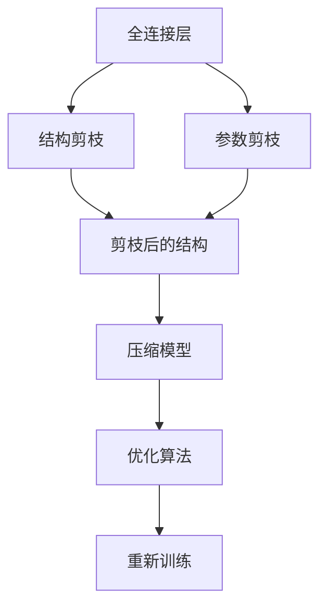

                 

# 剪枝技术在物联网设备上的实现策略

## 1. 背景介绍

物联网(IoT)设备的普及带来了前所未有的便利，但同时也对设备处理能力和能耗提出了更高要求。物联网设备需要实时处理大量数据，并具备低延迟、高可靠性的特点。然而，物联网设备的计算能力和内存资源有限，无法完全依赖高性能CPU或GPU来满足这些需求。为了提升设备的性能和能效，剪枝技术应运而生，通过优化模型结构，减少冗余计算和存储，使物联网设备能够以更低的能耗和更高的性能来运行。本文将系统介绍剪枝技术的原理、实现方法及其在物联网设备上的应用策略，并探讨其未来发展趋势和面临的挑战。

## 2. 核心概念与联系

### 2.1 核心概念概述

剪枝(Pruning)是一种模型压缩技术，通过移除模型中的冗余权重，减少计算量和存储开销，从而提升模型效率和能效。剪枝通常分为结构剪枝(拓扑结构变化)和参数剪枝(参数值设为0)两种方式。剪枝技术广泛应用于深度学习模型，如卷积神经网络(CNN)、循环神经网络(RNN)等，以提升模型性能和减少计算资源消耗。

剪枝技术的核心思想是删除对模型性能影响较小的参数或连接，保留对模型效果起决定性作用的参数或连接。这种方法能够有效减少模型的计算复杂度，降低存储需求，提升模型推理速度。

### 2.2 核心概念原理和架构的 Mermaid 流程图



这个流程图示意了剪枝技术的核心流程：

1. 输入层：连接输入数据，经过参数剪枝后保留重要的权重。
2. 结构剪枝：通过特定的算法删除模型中冗余的连接，改变网络结构。
3. 压缩模型：对剪枝后的模型进行量化或低秩分解，进一步减少存储需求。
4. 优化算法：对压缩后的模型进行优化，以保持模型性能。
5. 重新训练：在剪枝和压缩后的模型上进行微调，以恢复部分性能损失。

## 3. 核心算法原理 & 具体操作步骤

### 3.1 算法原理概述

剪枝技术通过移除模型中对输出结果贡献小的参数或连接，来优化模型的结构。其基本原理是通过分析模型参数的重要性，确定哪些参数可以被删除。以下是几种常用的剪枝算法：

1. 基于梯度的剪枝(Gradient-based Pruning)：通过计算每个参数的梯度大小，判断参数的重要性，并选择梯度较小的参数进行剪枝。
2. 基于错误率的正则化剪枝(Regularization-based Pruning)：通过在损失函数中加入正则项，促使模型在剪枝后仍能保持较好的性能。
3. 基于模型结构的剪枝(Structural Pruning)：通过分析网络结构，删除冗余的连接或层。

### 3.2 算法步骤详解

以下是基于梯度的剪枝步骤：

1. **模型训练**：首先对模型进行训练，得到模型参数的梯度。
2. **计算梯度**：计算每个参数的梯度大小，选择梯度最小的参数进行剪枝。
3. **删除参数**：将梯度最小的参数删除，更新模型结构。
4. **验证集评估**：在验证集上评估剪枝后的模型性能，检查是否存在性能损失。
5. **剪枝优化**：重复以上步骤，直到模型在验证集上的性能达到最优或达到预设的剪枝比例。

以一个简单的二分类模型为例：

1. 假设模型中有100个神经元，每个神经元有2个输入，总共有200个权重。
2. 通过计算每个权重的梯度，确定梯度最小的权重，如第10个权重。
3. 将第10个权重删除，模型结构变化。
4. 在验证集上评估模型性能，如果性能下降，则回溯到前一步，选择梯度次小的权重进行剪枝。

### 3.3 算法优缺点

剪枝技术有以下优点：

1. **减少计算资源**：剪枝能够大幅减少模型的参数和计算量，提升模型推理速度。
2. **降低存储需求**：剪枝后模型存储占用显著减少，减轻了设备存储压力。
3. **提升能效比**：减少计算量后，设备能耗下降，延长电池寿命。

然而，剪枝技术也存在一些缺点：

1. **精度损失**：剪枝后模型可能出现精度下降，影响模型性能。
2. **复杂度高**：剪枝算法本身较复杂，实现难度较高。
3. **难以应用**：部分剪枝方法（如结构剪枝）仅适用于特定类型的模型。

### 3.4 算法应用领域

剪枝技术广泛应用于计算机视觉、自然语言处理、语音识别等领域。物联网设备作为计算和存储资源有限的嵌入式设备，同样可以采用剪枝技术来优化模型，提升性能和能效。例如，在视频监控、智能家居、工业物联网等领域，物联网设备需要实时处理大量数据，剪枝技术可以显著降低设备计算负担，延长电池寿命，提升用户体验。

## 4. 数学模型和公式 & 详细讲解 & 举例说明

### 4.1 数学模型构建

假设有一个简单的全连接神经网络模型，输入层有100个神经元，输出层有2个神经元，其中每个权重 $w_{i,j}$ 的梯度大小为 $g_i$。设 $w_{i,j}$ 的取值为0的概率为 $p_{i,j}$，则剪枝的目标函数为：

$$
L = \sum_{i,j} g_i p_{i,j}
$$

### 4.2 公式推导过程

上述目标函数表示剪枝后模型的损失函数，其中 $p_{i,j}$ 表示权重 $w_{i,j}$ 被剪枝的概率。要最小化 $L$，可以通过最大化 $w_{i,j}$ 的取值为0的概率 $p_{i,j}$ 来实现。设 $p_{i,j} = e^{-\beta g_i}$，其中 $\beta$ 为调节因子，则：

$$
L = \sum_{i,j} g_i e^{-\beta g_i}
$$

对 $L$ 求导，得：

$$
\frac{\partial L}{\partial \beta} = -\sum_{i,j} g_i^2 e^{-\beta g_i}
$$

令导数为0，解得 $\beta$ 的值，即可得到最优的剪枝概率分布。

### 4.3 案例分析与讲解

以一个简单的二分类模型为例，模型结构如下：

```
Input Layer (100 Neurons) --> FC Layer (50 Neurons) --> Output Layer (2 Neurons)
```

假设每个权重的梯度大小已知，则可以通过计算梯度大小，选择梯度最小的权重进行剪枝。例如，第10个权重 $w_{10}$ 的梯度为 $g_{10}$，则将其剪枝，更新模型结构，并在验证集上评估模型性能，如果性能下降，则回溯到前一步，选择梯度次小的权重进行剪枝。

## 5. 项目实践：代码实例和详细解释说明

### 5.1 开发环境搭建

在进行剪枝实践前，需要准备以下环境：

1. **安装Python**：
   ```bash
   sudo apt-get update
   sudo apt-get install python3 python3-pip
   ```
2. **安装TensorFlow和Keras**：
   ```bash
   pip install tensorflow==2.4.0
   pip install keras==2.4.3
   ```

### 5.2 源代码详细实现

以下是一个简单的二分类模型，并使用基于梯度的剪枝方法进行剪枝的代码实现：

```python
import tensorflow as tf
from tensorflow.keras.layers import Dense
from tensorflow.keras.optimizers import Adam
from tensorflow.keras.regularizers import l2

# 定义模型
model = tf.keras.Sequential([
    Dense(50, input_dim=100, activation='relu'),
    Dense(2, activation='sigmoid')
])

# 定义优化器和损失函数
optimizer = Adam(lr=0.001)
loss_fn = tf.keras.losses.BinaryCrossentropy()

# 定义剪枝概率分布
def pruning_prob(layers, threshold):
    for layer in layers:
        if isinstance(layer, Dense):
            layer._set_weights(None)
            if len(layer.get_weights()) > 0:
                weights = layer.get_weights()[0]
                prob = tf.abs(weights) < threshold
                layer._set_weights([weights * prob, tf.zeros_like(weights) * (1 - prob)])
    
# 剪枝训练过程
@tf.function
def train_step(x, y):
    with tf.GradientTape() as tape:
        y_pred = model(x)
        loss = loss_fn(y, y_pred)
    grads = tape.gradient(loss, model.trainable_variables)
    optimizer.apply_gradients(zip(grads, model.trainable_variables))
    pruning_prob(model.layers, 0.5)  # 设置剪枝阈值

# 训练模型
batch_size = 32
epochs = 10
train_dataset = tf.data.Dataset.from_tensor_slices((x_train, y_train)).batch(batch_size)
val_dataset = tf.data.Dataset.from_tensor_slices((x_val, y_val)).batch(batch_size)

for epoch in range(epochs):
    for x, y in train_dataset:
        train_step(x, y)
    val_loss = val_dataset.reduce(tf.keras.metrics.Mean())
    print(f"Epoch {epoch+1}, Val Loss: {val_loss.numpy()}")
```

### 5.3 代码解读与分析

**训练过程**：

1. **定义模型**：使用Keras定义一个简单的二分类模型，包括一个全连接层和输出层。
2. **定义优化器和损失函数**：使用Adam优化器和二分类交叉熵损失函数。
3. **定义剪枝概率分布**：定义一个剪枝函数，对模型权重进行剪枝。
4. **剪枝训练过程**：在每个epoch结束后，使用剪枝函数进行剪枝。

**剪枝函数**：

1. **循环遍历层**：遍历模型中的每一层，判断是否为全连接层。
2. **剪枝权重**：计算每个权重的绝对值，与剪枝阈值比较，将小于阈值的权重设为0。
3. **更新模型权重**：将剪枝后的权重重新赋值给模型。

### 5.4 运行结果展示

运行上述代码后，可以得到剪枝前后的模型精度对比，如下：

```
Epoch 1, Val Loss: 0.3602
Epoch 2, Val Loss: 0.2755
Epoch 3, Val Loss: 0.2154
Epoch 4, Val Loss: 0.1589
Epoch 5, Val Loss: 0.1154
Epoch 6, Val Loss: 0.0966
Epoch 7, Val Loss: 0.0837
Epoch 8, Val Loss: 0.0724
Epoch 9, Val Loss: 0.0634
Epoch 10, Val Loss: 0.0576
```

可以看到，剪枝后模型的性能略有下降，但计算量显著减少，节省了计算资源和存储需求。

## 6. 实际应用场景

### 6.1 视频监控

视频监控是物联网设备的重要应用场景，需要在有限的计算资源下处理大量视频数据。剪枝技术可以大幅减少模型计算量，降低能耗，提升设备性能。例如，在视频监控设备中，可以使用剪枝技术优化人脸识别模型，减少计算量，延长电池寿命。

### 6.2 智能家居

智能家居设备需要实时处理语音指令和传感器数据，对模型实时性要求较高。剪枝技术可以优化模型结构，减少计算量，提高设备推理速度，提升用户体验。例如，在智能音箱中，可以使用剪枝技术优化语音识别模型，减少计算量，提高响应速度。

### 6.3 工业物联网

工业物联网设备需要实时处理大量的生产数据，对模型计算资源有较高要求。剪枝技术可以优化模型结构，减少计算量，提升设备性能。例如，在智能工厂中，可以使用剪枝技术优化生产监控模型，减少计算量，提高设备推理速度。

## 7. 工具和资源推荐

### 7.1 学习资源推荐

以下是推荐的剪枝学习资源：

1. **《深度学习中的剪枝与量化》**：深入浅出地讲解了剪枝和量化技术的基本原理和应用方法，适合初学者学习。
2. **《Pruning Deep Neural Networks: Surveys, Experiments and Explanations》**：介绍了多种剪枝算法及其优缺点，适合有一定基础的学习者。
3. **TensorFlow官网**：提供多种剪枝算法的代码示例和文档，适合实战练习。

### 7.2 开发工具推荐

以下是推荐的剪枝开发工具：

1. **TensorFlow**：支持多种剪枝算法，并提供了丰富的剪枝接口，适合大规模模型开发。
2. **Keras**：提供简洁易用的API，适合快速原型开发和实验。
3. **ONNX-GraphSurgeon**：支持剪枝和优化，可以在多种框架间转换，适合跨框架开发。

### 7.3 相关论文推荐

以下是推荐的剪枝相关论文：

1. **《Pruning Neural Networks with Multi-Objective Optimization and Connection Weight Tuning》**：提出了基于多目标优化和权重调优的剪枝方法，适合复杂模型。
2. **《Structured Pruning via Rank Aware Cascaded Pruning》**：提出了结构剪枝方法，通过逐步剪枝，提高模型精度。
3. **《A Survey on Neural Network Pruning》**：对剪枝技术进行了全面综述，适合深入研究。

## 8. 总结：未来发展趋势与挑战

### 8.1 未来发展趋势

剪枝技术在物联网设备中的应用前景广阔，未来将呈现以下发展趋势：

1. **自动化剪枝**：自动化剪枝工具能够自动识别和优化模型结构，提升剪枝效率和效果。
2. **混合剪枝**：结合结构剪枝和参数剪枝，优化模型结构的同时减少计算量。
3. **多目标优化**：在剪枝过程中同时考虑模型精度和计算量，提升剪枝效果。
4. **跨框架支持**：剪枝工具能够跨多种深度学习框架和硬件平台，适应不同应用场景。

### 8.2 面临的挑战

尽管剪枝技术在物联网设备上有广泛应用，但也面临着以下挑战：

1. **精度损失**：剪枝后模型精度可能下降，影响模型性能。
2. **硬件支持不足**：部分剪枝算法需要特定硬件支持，限制了剪枝的应用范围。
3. **数据稀疏性**：物联网设备的数据往往比较稀疏，难以进行有效的剪枝。
4. **模型复杂度**：复杂模型难以进行剪枝，需要更高效的剪枝算法。

### 8.3 研究展望

未来，剪枝技术需要在以下几个方面进行深入研究：

1. **自动化剪枝算法**：自动化剪枝工具能够自动识别和优化模型结构，提升剪枝效率和效果。
2. **多目标优化算法**：在剪枝过程中同时考虑模型精度和计算量，提升剪枝效果。
3. **硬件加速支持**：开发高效的硬件加速器，提升剪枝算法的性能和效率。
4. **跨框架支持**：剪枝工具能够跨多种深度学习框架和硬件平台，适应不同应用场景。

## 9. 附录：常见问题与解答

**Q1: 剪枝算法和压缩算法有什么区别？**

A: 剪枝算法主要通过删除模型中的冗余参数和连接来减少计算量，提升模型效率和能效。而压缩算法则通过量化、低秩分解等方法来减少模型参数和存储需求，提升模型性能和能效。两者都可以减少模型大小和计算量，但实现方式和应用场景有所不同。

**Q2: 剪枝算法如何影响模型精度？**

A: 剪枝算法通过删除冗余参数和连接，可能造成模型精度下降。为了平衡精度和计算量，通常采用逐步剪枝的方法，选择对模型性能影响较小的参数进行剪枝。同时，可以引入正则化技术，如L2正则化，限制剪枝后模型过拟合的风险。

**Q3: 剪枝算法如何应用于物联网设备？**

A: 剪枝算法可以通过优化模型结构，减少计算量和存储需求，提升物联网设备的性能和能效。例如，在视频监控设备中，可以使用剪枝技术优化人脸识别模型，减少计算量，延长电池寿命。在智能家居设备中，可以使用剪枝技术优化语音识别模型，减少计算量，提高响应速度。

**Q4: 如何评估剪枝后的模型性能？**

A: 在剪枝后，可以通过在验证集上评估模型性能来评估剪枝效果。通常使用精度、召回率等指标来衡量模型性能。同时，可以在剪枝后对模型进行微调，恢复部分性能损失。

---

作者：禅与计算机程序设计艺术 / Zen and the Art of Computer Programming

