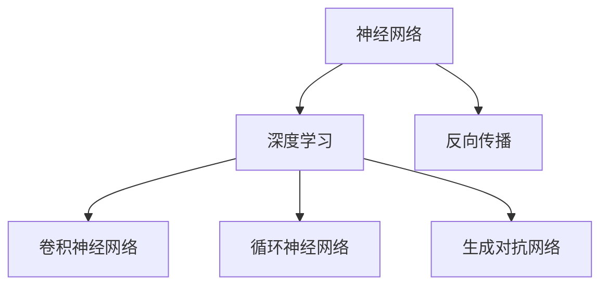
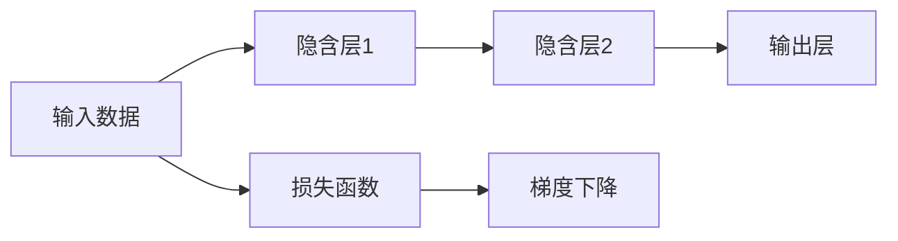

                 

# 原理与代码实战案例讲解

> 关键词：算法原理,代码实现,实战案例,深度学习,人工智能

## 1. 背景介绍

人工智能(AI)正成为推动世界进步的重要力量。在AI的众多分支中，深度学习(Deep Learning)无疑是最为耀眼的明珠之一。深度学习通过模拟人脑的神经网络结构，赋予机器强大的数据分析与处理能力。本文将深入探讨深度学习的算法原理，并通过实战案例讲解深度学习的代码实现，帮助读者全面理解深度学习在实际应用中的潜力和挑战。

## 2. 核心概念与联系

### 2.1 核心概念概述

深度学习是一类基于神经网络的机器学习技术，它通过多个层次的神经元组成模型，模仿人脑的信息处理方式，实现了对复杂数据的自动学习和高效处理。其主要概念包括：

- 神经网络(Neural Network)：由多层神经元组成的网络结构，通过反向传播算法训练学习模型参数。
- 深度学习(Deep Learning)：指使用多层神经网络构建的模型，包括卷积神经网络(CNN)、循环神经网络(RNN)、生成对抗网络(GAN)等。
- 反向传播(Backpropagation)：一种基于梯度的优化算法，用于更新神经网络中的权重，最小化模型损失函数。
- 卷积神经网络(Convolutional Neural Network, CNN)：适用于图像、视频等数据类型的神经网络，通过卷积和池化操作提取特征。
- 循环神经网络(Recurrent Neural Network, RNN)：适用于时间序列数据，通过隐藏状态捕捉时间依赖性。
- 生成对抗网络(Generative Adversarial Network, GAN)：由生成器和判别器组成，通过对抗学习生成逼真样本。

这些概念之间的逻辑关系可以通过以下Mermaid流程图来展示：



这个流程图展示了深度学习的核心概念及其之间的关系：

1. 神经网络是深度学习的基础。
2. 深度学习通过多层神经网络实现对复杂数据的处理。
3. 卷积神经网络、循环神经网络和生成对抗网络是深度学习的几种主要类型。
4. 反向传播是深度学习模型的训练核心算法。

这些核心概念构成了深度学习的基础框架，为其实际应用提供了技术支撑。

## 3. 核心算法原理 & 具体操作步骤

### 3.1 算法原理概述

深度学习的核心算法原理包括前向传播和反向传播。在训练过程中，深度学习模型通过前向传播计算预测结果，并根据损失函数计算误差；然后通过反向传播算法更新模型参数，使得误差最小化。

前向传播是指将输入数据依次传递通过多个神经网络层，每个神经元计算其输入的加权和并激活，最终输出预测结果。

反向传播是指通过计算预测结果与真实标签之间的误差，反向计算误差对每个神经元权重的偏导数，并通过梯度下降算法更新权重。

以下是深度学习模型的一般前向传播和反向传播过程的示意图：



### 3.2 算法步骤详解

深度学习的模型训练通常包括以下几个关键步骤：

**Step 1: 数据准备**

- 收集和预处理训练数据集。
- 将数据集划分为训练集、验证集和测试集。
- 对数据进行归一化、数据增强等预处理操作。

**Step 2: 模型设计**

- 选择适当的神经网络结构，如卷积神经网络(CNN)、循环神经网络(RNN)等。
- 定义网络层数、每层神经元数量等超参数。
- 设计损失函数，如交叉熵、均方误差等。

**Step 3: 模型训练**

- 将训练集数据逐批次输入模型，前向传播计算预测结果。
- 计算预测结果与真实标签之间的误差。
- 反向传播计算误差对每个权重参数的偏导数。
- 使用梯度下降算法更新权重参数。
- 在验证集上评估模型性能，避免过拟合。

**Step 4: 模型测试**

- 在测试集上评估模型性能。
- 对模型进行调优，如调整学习率、增加正则化等。
- 保存最优模型参数。

**Step 5: 模型应用**

- 加载最优模型参数。
- 对新数据进行预测。
- 集成到实际应用系统中。

### 3.3 算法优缺点

深度学习的优势在于其强大的数据处理能力和泛化性能。通过多层神经网络，深度学习能够捕捉数据中的复杂模式，适应各种类型的输入数据。此外，深度学习算法通常通过大规模数据训练，能够自动学习数据中的内在规律，从而提高模型的准确性和鲁棒性。

然而，深度学习也存在一些缺点：

1. 数据需求高：深度学习模型通常需要大量的标注数据进行训练，数据获取成本较高。
2. 训练复杂度高：深度学习模型参数较多，训练过程需要消耗大量的计算资源。
3. 可解释性差：深度学习模型被视为"黑盒"，难以解释其内部决策过程。
4. 易过拟合：在数据集较小的情况下，深度学习模型容易过拟合。
5. 计算资源要求高：深度学习模型计算量较大，对硬件要求较高。

## 4. 数学模型和公式 & 详细讲解 & 举例说明

### 4.1 数学模型构建

深度学习的数学模型通常基于优化问题的构建，目标是最大化或最小化某个损失函数。以下是一个典型的多层神经网络模型：


该模型包含多个隐含层，每层包含若干个神经元。每个神经元接收前一层的输出，并计算加权和，通过激活函数输出结果。

### 4.2 公式推导过程

以一个简单的单层神经网络为例，公式推导过程如下：


设输入为 $x$，权重矩阵为 $W$，偏置向量为 $b$，激活函数为 $f$，输出为 $y$。根据神经元计算规则，有：

$$
z = Wx + b
$$

$$
y = f(z)
$$

其中 $z$ 为线性变换结果，$f(z)$ 为激活函数输出。在训练过程中，通过反向传播算法计算损失函数对权重 $W$ 的偏导数：

$$
\frac{\partial L}{\partial W} = \frac{\partial L}{\partial y} \frac{\partial y}{\partial z} \frac{\partial z}{\partial W}
$$

其中 $L$ 为损失函数，$\frac{\partial L}{\partial y}$ 为输出误差，$\frac{\partial y}{\partial z}$ 为激活函数的导数，$\frac{\partial z}{\partial W}$ 为线性变换的偏导数。

通过链式法则，可以递归计算每个权重参数的偏导数，从而使用梯度下降算法更新权重。

### 4.3 案例分析与讲解

以图像分类为例，使用卷积神经网络(CNN)进行模型训练。CNN通过卷积和池化操作提取图像特征，然后通过全连接层进行分类。


假设输入图像为 $x$，卷积核为 $k$，池化窗口为 $s$，激活函数为 $f$，输出特征图为 $y$。卷积操作定义为：

$$
y = f(k * x + b)
$$

其中 $*$ 为卷积运算符。通过多个卷积和池化层，最终输出分类结果。训练过程类似单层神经网络，通过反向传播算法更新卷积核和偏置参数。

## 5. 项目实践：代码实例和详细解释说明

### 5.1 开发环境搭建

在项目实践前，需要搭建深度学习开发环境。以下是在Python中使用TensorFlow进行深度学习开发的环境配置流程：

1. 安装Anaconda：从官网下载并安装Anaconda，用于创建独立的Python环境。

2. 创建并激活虚拟环境：
```bash
conda create -n tensorflow-env python=3.8 
conda activate tensorflow-env
```

3. 安装TensorFlow：根据CUDA版本，从官网获取对应的安装命令。例如：
```bash
conda install tensorflow==2.6 -c tf
```

4. 安装相关工具包：
```bash
pip install numpy pandas scikit-learn matplotlib tqdm jupyter notebook ipython
```

完成上述步骤后，即可在`tensorflow-env`环境中开始深度学习开发。

### 5.2 源代码详细实现

下面以手写数字识别为例，使用TensorFlow实现卷积神经网络(CNN)的训练和预测。

```python
import tensorflow as tf
from tensorflow.keras import layers, models
from tensorflow.keras.datasets import mnist
import matplotlib.pyplot as plt

# 加载数据集
(train_images, train_labels), (test_images, test_labels) = mnist.load_data()

# 数据预处理
train_images = train_images / 255.0
test_images = test_images / 255.0

# 定义模型
model = models.Sequential([
    layers.Conv2D(32, (3, 3), activation='relu', input_shape=(28, 28, 1)),
    layers.MaxPooling2D((2, 2)),
    layers.Conv2D(64, (3, 3), activation='relu'),
    layers.MaxPooling2D((2, 2)),
    layers.Conv2D(64, (3, 3), activation='relu'),
    layers.Flatten(),
    layers.Dense(64, activation='relu'),
    layers.Dense(10)
])

# 编译模型
model.compile(optimizer='adam',
              loss=tf.keras.losses.SparseCategoricalCrossentropy(from_logits=True),
              metrics=['accuracy'])

# 训练模型
history = model.fit(train_images.reshape(-1, 28, 28, 1), train_labels, epochs=10, 
                    validation_data=(test_images.reshape(-1, 28, 28, 1), test_labels))

# 评估模型
test_loss, test_acc = model.evaluate(test_images.reshape(-1, 28, 28, 1), test_labels, verbose=2)
print('Test accuracy:', test_acc)

# 可视化训练过程
plt.plot(history.history['accuracy'], label='accuracy')
plt.plot(history.history['val_accuracy'], label='val_accuracy')
plt.xlabel('Epoch')
plt.ylabel('Accuracy')
plt.legend()
plt.show()
```

代码中，首先使用TensorFlow加载MNIST数据集，并对图像进行归一化处理。然后定义了一个包含3个卷积层和2个全连接层的CNN模型，并进行编译。在训练过程中，使用Adam优化器和SparseCategoricalCrossentropy损失函数，并在每个epoch结束时评估模型性能。最后，使用测试集评估模型准确率，并可视化训练过程。

### 5.3 代码解读与分析

**卷积层和池化层**

卷积层和池化层是CNN的核心组件，用于提取图像特征。卷积层通过滑动卷积核提取局部特征，池化层则通过降采样操作减少特征图大小，提高模型的计算效率。

**全连接层**

全连接层是CNN的最后一层，用于将特征图转换为分类结果。全连接层通常包含若干个神经元，通过激活函数实现非线性变换。

**优化器**

Adam优化器是一种常用的优化算法，能够自动调整学习率，收敛速度快，适合大规模深度学习模型训练。

**损失函数**

SparseCategoricalCrossentropy损失函数用于多分类问题，能够直接输出预测结果的logits，而不需要进行softmax操作。

通过以上代码实现，我们完成了手写数字识别任务的CNN模型训练和评估，实现了深度学习模型的完整流程。

## 6. 实际应用场景

### 6.1 图像识别

图像识别是深度学习在计算机视觉领域的重要应用。通过卷积神经网络，深度学习能够自动提取图像特征，实现对物体的分类、定位和检测。

在实际应用中，可以将深度学习模型应用于医疗影像分析、自动驾驶、安防监控等领域。例如，使用CNN模型对医学影像进行肿瘤检测、自动驾驶车辆进行目标检测、安防系统进行人脸识别等。

### 6.2 自然语言处理

自然语言处理(NLP)是深度学习在语言学领域的核心应用。通过循环神经网络(RNN)和长短期记忆网络(LSTM)，深度学习能够捕捉文本数据中的时序依赖性，实现文本分类、情感分析、机器翻译等任务。

在实际应用中，可以将深度学习模型应用于智能客服、智能翻译、智能推荐等场景。例如，使用RNN模型进行情感分析，使用LSTM模型进行机器翻译，使用GAN模型生成自然语言文本等。

### 6.3 语音识别

语音识别是深度学习在音频信号处理领域的重要应用。通过卷积神经网络(CNN)和循环神经网络(RNN)，深度学习能够从音频信号中提取特征，实现语音识别和语音合成。

在实际应用中，可以将深度学习模型应用于语音助手、智能家居、电话客服等领域。例如，使用CNN模型进行语音特征提取，使用RNN模型进行语音识别，使用GAN模型生成自然语音等。

## 7. 工具和资源推荐

### 7.1 学习资源推荐

深度学习涉及的知识点广泛，学习资源也非常丰富。以下是几本经典书籍和几个在线课程推荐：

- 《深度学习》（Deep Learning）：由Ian Goodfellow等著，深入浅出地介绍了深度学习的理论和实践，是学习深度学习的必读经典。
- 《Python深度学习》（Python Deep Learning）：由Francois Chollet等著，介绍了如何使用TensorFlow和Keras实现深度学习项目。
- 《动手学深度学习》（Dive into Deep Learning）：由李沐等著，使用动手实践的方式介绍深度学习基础和应用。
- Coursera《深度学习专项课程》：由斯坦福大学教授Andrew Ng等授课，系统学习深度学习的基础理论和实践技巧。
- Udacity《深度学习纳米学位》：提供系统性、实战性强的深度学习项目训练。

通过以上学习资源，可以全面掌握深度学习的理论和实践技能。

### 7.2 开发工具推荐

深度学习开发离不开优秀的工具支持。以下是几款常用的深度学习开发工具：

- TensorFlow：由Google主导开发的深度学习框架，生产部署方便，支持多种编程语言和平台。
- PyTorch：Facebook开发的深度学习框架，灵活高效，适合研究和大规模工程应用。
- Keras：由Francois Chollet开发的高级深度学习框架，易于上手，适合快速迭代开发。
- Jupyter Notebook：交互式编程环境，支持多语言编程，适合进行深度学习实验和数据分析。

合理利用这些工具，可以显著提升深度学习模型的开发效率，加速创新迭代的步伐。

### 7.3 相关论文推荐

深度学习的发展离不开学界的不懈努力。以下是几篇具有里程碑意义的深度学习论文推荐：

- 《ImageNet分类》（ImageNet Classification with Deep Convolutional Neural Networks）：由Alex Krizhevsky等著，提出了卷积神经网络(CNN)，用于大规模图像分类任务。
- 《Google的Deep & Wide Learning for Display Advertising》：由Chen & Gupta等著，提出了深度宽学习模型，用于广告点击率预测任务。
- 《Attention is All You Need》：由Vaswani等著，提出了Transformer模型，用于机器翻译任务。
- 《Towards End-to-End Speech Recognition with Recurrent Neural Networks》：由Bahdanau等著，提出了序列到序列模型，用于语音识别任务。
- 《Generative Adversarial Nets》：由Goodfellow等著，提出了生成对抗网络(GAN)，用于生成逼真样本。

这些论文展示了深度学习在图像分类、广告推荐、机器翻译、语音识别等领域的强大能力，为深度学习技术的不断发展提供了坚实基础。

## 8. 总结：未来发展趋势与挑战

### 8.1 总结

本文对深度学习的算法原理和代码实现进行了全面系统的介绍。深度学习通过多层神经网络对复杂数据进行自动学习和处理，在图像识别、自然语言处理、语音识别等领域展现了强大的应用潜力。然而，深度学习也面临着数据需求高、训练复杂度高、可解释性差等挑战。未来，深度学习需要进一步优化算法模型，提升模型的可解释性和鲁棒性，才能更好地应对实际应用中的问题。

### 8.2 未来发展趋势

深度学习的未来发展趋势包括以下几个方向：

1. 模型架构的创新：未来的深度学习模型将更加注重模型架构的创新和优化，如可解释性更强的模型、更高效的计算模型等。
2. 多模态融合：深度学习将更多地与其他人工智能技术结合，实现多模态数据的融合，提高系统的综合表现。
3. 自监督学习：通过自监督学习任务，深度学习能够自动学习数据中的内在规律，减少对标注数据的依赖。
4. 分布式计算：深度学习模型将越来越多地利用分布式计算技术，提高计算效率和模型训练速度。
5. 边缘计算：深度学习模型将越来越多地部署在边缘设备上，提高模型的实时性。

### 8.3 面临的挑战

尽管深度学习在众多领域取得了巨大成功，但未来仍需解决以下挑战：

1. 数据获取成本高：深度学习模型需要大量的标注数据进行训练，数据获取成本高，且难以满足多样性和复杂性要求。
2. 模型可解释性差：深度学习模型通常被视为"黑盒"，难以解释其内部决策过程，缺乏可解释性。
3. 计算资源要求高：深度学习模型计算量较大，对硬件资源要求较高，限制了其在大规模数据上的应用。
4. 模型鲁棒性不足：深度学习模型在面对域外数据时，泛化性能往往较差，容易出现过拟合现象。
5. 模型安全性有待提升：深度学习模型可能被恶意利用，需要加强模型安全性设计和隐私保护。

### 8.4 研究展望

未来的深度学习研究需要在以下几个方向寻求新的突破：

1. 开发更加高效的模型结构：通过模型架构的创新和优化，实现模型参数更小、训练速度更快、效果更好的目标。
2. 引入更多先验知识：通过知识图谱、逻辑规则等符号化知识与深度学习模型的融合，提高模型的综合表现。
3. 增强模型的可解释性：通过可解释性技术，提高深度学习模型的透明性，增强模型应用的可信度。
4. 提高模型的鲁棒性和安全性：通过对抗训练、数据增强等方法，提高深度学习模型的鲁棒性和安全性，避免过拟合和滥用。
5. 推动深度学习与其他技术的融合：通过与自然语言处理、计算机视觉、智能推荐等技术的结合，实现深度学习技术在更多领域的应用。

通过在以上方向进行深入研究，深度学习必将在未来的发展中取得更大的突破，为人工智能技术的全面普及提供坚实基础。

## 9. 附录：常见问题与解答

**Q1: 深度学习模型是否适用于所有问题？**

A: 深度学习模型在处理图像、文本、语音等结构化数据时表现出色，但在处理非结构化数据（如文本的情感分析、语音的情感识别）时效果不尽如人意。此外，深度学习模型通常需要大量的标注数据进行训练，在数据量较小的情况下，模型可能难以取得理想效果。

**Q2: 如何选择合适的深度学习框架？**

A: 深度学习框架的选择应根据项目需求和团队技术栈来决定。TensorFlow和PyTorch是目前最流行的深度学习框架，两者都具有强大的功能和灵活性。TensorFlow适合大规模工程应用，PyTorch则更适合研究开发。此外，Keras和Caffe等框架也值得考虑。

**Q3: 深度学习模型的可解释性如何提高？**

A: 深度学习模型的可解释性可以通过多种方式提高，如：
1. 可视化技术：使用可视化工具展示模型内部的特征提取过程，帮助理解模型决策。
2. 可解释性模型：使用可解释性较强的模型架构，如决策树、线性模型等。
3. 特征重要性分析：通过分析模型特征重要性，了解模型对输入数据的依赖关系。

**Q4: 如何避免深度学习模型的过拟合？**

A: 深度学习模型的过拟合可以通过以下方式避免：
1. 数据增强：通过对训练数据进行扩充，增加模型泛化能力。
2. 正则化：使用L2正则、Dropout等方法，减少模型过拟合。
3. 早停法：在模型训练过程中，根据验证集性能决定是否停止训练。
4. 批标准化：使用批标准化技术，提高模型训练的稳定性。

**Q5: 深度学习模型在实际应用中需要注意哪些问题？**

A: 深度学习模型在实际应用中需要注意以下问题：
1. 模型训练需要大量标注数据，数据获取成本较高。
2. 模型计算资源要求高，硬件配置需要足够支持。
3. 模型需要持续优化，避免过拟合和性能下降。
4. 模型需要集成到实际应用系统，保证模型实时性和稳定性。
5. 模型需要考虑隐私和安全问题，避免数据泄露和滥用。

通过以上问题解答，可以更好地理解深度学习模型的应用和挑战，为深度学习技术的实际应用提供指导。

---

作者：禅与计算机程序设计艺术 / Zen and the Art of Computer Programming

