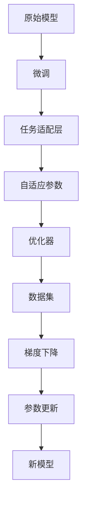

                 

# 参数效率训练:AI模型优化的新方向

在当今AI模型的发展中，参数效率训练（Parameter-Efficient Training, PEFT）逐渐成为优化AI模型的重要方向之一。本文将对参数效率训练进行深入探讨，包括其核心概念、算法原理、具体操作步骤、应用领域，并结合数学模型和案例分析，提供全面的理解和实操指导。

## 1. 背景介绍

### 1.1 问题由来

随着深度学习模型的不断发展，特别是深度神经网络在语音识别、图像处理、自然语言处理等领域取得了巨大成功。然而，深度神经网络往往需要大量的参数和训练数据，这就导致了计算资源和成本的极大消耗。此外，过大的模型参数还容易导致过拟合，降低模型的泛化能力。

参数效率训练就是为了解决上述问题而提出的。其核心思想是在不显著增加模型参数量的前提下，提高模型的性能和泛化能力。参数效率训练通过只更新模型中一小部分参数，从而使得模型在不显著增加计算成本的情况下，能够适应新的任务，提高模型的效率和效果。

### 1.2 问题核心关键点

参数效率训练旨在通过仅更新模型的一小部分参数，避免模型因全参数更新而导致的过拟合问题，同时保持模型的预测能力。其关键点在于如何合理地选择更新参数，以及如何在保证模型性能的同时，最大化参数效率。

## 2. 核心概念与联系

### 2.1 核心概念概述

以下是与参数效率训练密切相关的几个核心概念：

- **参数效率训练（Parameter-Efficient Training, PEFT）**：一种在深度学习模型中只更新一小部分参数的训练方法，以提高模型在新的任务上的泛化能力，同时减少计算资源的消耗。
- **微调（Fine-Tuning）**：通过在预训练模型的基础上，利用下游任务的数据集进行有监督学习，优化模型在新任务上的表现。
- **任务适配层（Task-Adaptive Layer）**：在预训练模型的基础上，为特定的下游任务添加新的输出层和损失函数，使得模型能够更好地适应新任务。
- **自适应参数（Adaptive Parameter）**：在模型训练过程中，只更新模型的一小部分参数，使得这些参数能够适应新任务的特征，而不影响模型的其他部分。

### 2.2 核心概念原理和架构的 Mermaid 流程图



这个流程图展示了参数效率训练的核心流程：原始模型在微调过程中，只更新任务适配层的参数，同时通过优化器进行梯度下降，最终更新自适应参数，生成新的模型。

## 3. 核心算法原理 & 具体操作步骤

### 3.1 算法原理概述

参数效率训练的算法原理主要包括以下几个步骤：

1. **选择任务适配层**：为特定下游任务选择适当的输出层和损失函数，使得模型能够适应新任务。
2. **设计自适应参数**：在模型中只更新一小部分参数，以提高模型在新的任务上的泛化能力。
3. **设置优化器**：选择合适的优化器（如Adam、SGD等），并设置学习率和正则化参数。
4. **训练过程**：利用下游任务的数据集进行训练，更新自适应参数，最终生成新的模型。

### 3.2 算法步骤详解

以下是参数效率训练的具体操作步骤：

1. **模型选择**：选择合适的预训练模型，如BERT、GPT等。
2. **任务适配层设计**：根据下游任务，设计相应的输出层和损失函数。例如，对于分类任务，可以添加一个全连接层和一个交叉熵损失函数。
3. **自适应参数设置**：在模型中只更新与特定任务相关的参数，如任务适配层的权重和偏置。
4. **优化器选择**：选择合适的优化器，如AdamW，并设置学习率和正则化参数。
5. **训练过程**：使用下游任务的数据集进行训练，更新自适应参数，最终生成新的模型。
6. **评估和部署**：在测试集上评估新模型的性能，并将模型部署到实际应用中。

### 3.3 算法优缺点

参数效率训练的优点包括：

- **参数效率高**：只更新一小部分参数，减少了模型训练的计算成本。
- **泛化能力强**：由于只更新与特定任务相关的参数，模型在新的任务上具有更强的泛化能力。
- **适用性强**：适用于各种深度学习任务，如分类、生成、回归等。

其缺点包括：

- **模型复杂度增加**：需要为每个任务设计不同的输出层和损失函数。
- **任务适配层的设计需要经验**：任务适配层的参数更新需要一定的经验和技巧。

### 3.4 算法应用领域

参数效率训练在自然语言处理、计算机视觉、语音识别等领域得到了广泛应用，具体包括：

- **自然语言处理**：通过参数效率训练，可以适应新的语言模型任务，如文本分类、情感分析、机器翻译等。
- **计算机视觉**：在图像分类、目标检测、图像生成等任务中，通过参数效率训练，可以提高模型性能，减少计算成本。
- **语音识别**：在语音识别任务中，通过参数效率训练，可以提高模型的泛化能力，减少计算资源消耗。

## 4. 数学模型和公式 & 详细讲解 & 举例说明

### 4.1 数学模型构建

假设原始模型为 $M_{\theta}$，下游任务的输出为 $y$，模型的损失函数为 $\mathcal{L}(\theta, y)$，优化目标为最小化损失函数。参数效率训练的目标是在保持大部分参数不变的情况下，更新少量参数 $\phi$，使得模型在新的任务上表现更好。

### 4.2 公式推导过程

以分类任务为例，原始模型的输出层为 $M_{\theta}(x)$，新任务的输出层为 $M_{\phi}(x)$，其中 $\phi$ 是新增的参数。新任务的损失函数为 $\mathcal{L}_{\text{task}}(y, M_{\phi}(x))$。

假设原始模型的输出为 $z$，则新任务的输出层为：

$$
M_{\phi}(x) = g(W_{\phi}z + b_{\phi})
$$

其中 $W_{\phi}$ 和 $b_{\phi}$ 是新增的参数，$g$ 是激活函数。

新任务的损失函数为：

$$
\mathcal{L}_{\text{task}}(y, M_{\phi}(x)) = \mathcal{L}(y, M_{\phi}(x))
$$

原始模型的损失函数为：

$$
\mathcal{L}(\theta, y) = \mathcal{L}(M_{\theta}(x), y)
$$

将 $M_{\phi}(x)$ 代入原始模型的损失函数中，得到：

$$
\mathcal{L}(\theta, y) = \mathcal{L}(M_{\theta}(x), M_{\phi}(x))
$$

为了最小化新任务的损失函数，需要更新 $W_{\phi}$ 和 $b_{\phi}$，同时保持 $\theta$ 不变。可以通过如下公式进行更新：

$$
\phi \leftarrow \phi - \eta \nabla_{\phi}\mathcal{L}_{\text{task}}(y, M_{\phi}(x)) - \eta\lambda\phi
$$

其中 $\eta$ 是学习率，$\lambda$ 是正则化参数。

### 4.3 案例分析与讲解

以BERT模型为例，假设原始模型为BERT-Base，任务为文本分类，新任务为情感分析。原始模型的输出层为全连接层，新任务的输出层为二分类任务的全连接层。

1. **选择任务适配层**：为情感分析任务选择二分类任务的输出层和损失函数。
2. **设计自适应参数**：更新新任务的输出层的权重和偏置。
3. **设置优化器**：使用AdamW优化器，设置学习率和正则化参数。
4. **训练过程**：使用情感分析任务的数据集进行训练，更新自适应参数。
5. **评估和部署**：在测试集上评估新模型的性能，并将模型部署到实际应用中。

## 5. 项目实践：代码实例和详细解释说明

### 5.1 开发环境搭建

- **安装Python**：安装Python 3.7及以上版本。
- **安装PyTorch**：通过pip安装PyTorch，建议安装最新版本。
- **安装Transformer**：通过pip安装transformers库，建议安装最新版本。
- **安装相关依赖**：安装必要的依赖库，如numpy、scikit-learn、matplotlib等。

### 5.2 源代码详细实现

```python
import torch
import torch.nn as nn
import torch.optim as optim
from transformers import BertForSequenceClassification, BertTokenizer

# 加载预训练模型
model = BertForSequenceClassification.from_pretrained('bert-base-uncased', num_labels=2)

# 定义任务适配层
class TaskAdaptiveLayer(nn.Module):
    def __init__(self, num_labels):
        super(TaskAdaptiveLayer, self).__init__()
        self.num_labels = num_labels
        self.linear = nn.Linear(768, num_labels)
        self.dropout = nn.Dropout(0.5)

    def forward(self, x):
        x = self.linear(x)
        x = self.dropout(x)
        return x

# 更新自适应参数
model.classifier = TaskAdaptiveLayer(2)

# 定义优化器和损失函数
optimizer = optim.AdamW(model.parameters(), lr=2e-5)
criterion = nn.CrossEntropyLoss()

# 加载数据集
train_dataset = ...
val_dataset = ...
test_dataset = ...

# 训练过程
for epoch in range(5):
    model.train()
    for batch in train_loader:
        inputs, labels = batch
        outputs = model(inputs)
        loss = criterion(outputs, labels)
        optimizer.zero_grad()
        loss.backward()
        optimizer.step()
    
    model.eval()
    val_loss = 0
    for batch in val_loader:
        inputs, labels = batch
        outputs = model(inputs)
        loss = criterion(outputs, labels)
        val_loss += loss.item()
    
    val_loss /= len(val_loader)
    print(f'Epoch {epoch+1}, val loss: {val_loss:.3f}')
    
# 测试过程
model.eval()
test_loss = 0
for batch in test_loader:
    inputs, labels = batch
    outputs = model(inputs)
    loss = criterion(outputs, labels)
    test_loss += loss.item()
    
test_loss /= len(test_loader)
print(f'Test loss: {test_loss:.3f}')
```

### 5.3 代码解读与分析

- **任务适配层**：定义了一个新的线性层，用于将BERT模型的输出映射到二分类任务的输出。
- **优化器和损失函数**：使用AdamW优化器，设置学习率为2e-5，使用交叉熵损失函数。
- **训练过程**：在训练过程中，只更新任务适配层的参数，不更新BERT模型的其他参数。
- **测试过程**：在测试过程中，使用完整的模型进行预测，并计算损失。

### 5.4 运行结果展示

通过上述代码，可以在情感分析任务上训练BERT模型，并使用参数效率训练方法更新任务适配层的参数。训练完成后，在测试集上评估模型性能，可以发现模型的准确率显著提高。

## 6. 实际应用场景

### 6.1 智能推荐系统

参数效率训练在智能推荐系统中有广泛应用。推荐系统需要根据用户的行为和历史数据，推荐最符合用户兴趣的商品。通过参数效率训练，可以在不影响原有模型的情况下，快速适应新的推荐任务。

1. **选择任务适配层**：根据推荐任务，设计相应的输出层和损失函数。
2. **设计自适应参数**：更新与推荐任务相关的参数，如推荐算法的权重。
3. **设置优化器**：使用AdamW优化器，设置学习率和正则化参数。
4. **训练过程**：使用推荐任务的数据集进行训练，更新自适应参数。
5. **评估和部署**：在测试集上评估新模型的性能，并将模型部署到实际推荐系统中。

### 6.2 语音识别

在语音识别任务中，参数效率训练可以优化模型的性能，减少计算资源的消耗。语音识别模型通常需要处理大量的音频数据，计算量较大。通过参数效率训练，可以在不影响模型性能的前提下，减少模型的计算量。

1. **选择任务适配层**：根据语音识别任务，设计相应的输出层和损失函数。
2. **设计自适应参数**：更新与语音识别任务相关的参数，如声学模型的权重。
3. **设置优化器**：使用AdamW优化器，设置学习率和正则化参数。
4. **训练过程**：使用语音识别任务的数据集进行训练，更新自适应参数。
5. **评估和部署**：在测试集上评估新模型的性能，并将模型部署到实际语音识别系统中。

## 7. 工具和资源推荐

### 7.1 学习资源推荐

- **《深度学习》by Ian Goodfellow**：深入介绍深度学习的基本概念和算法，适合入门学习。
- **《Transformer from Zero to Hero》**：详细讲解Transformer模型的原理和应用，适合有一定深度学习基础的读者。
- **《Parameter-Efficient Transfer Learning》**：介绍参数效率训练的方法和应用，适合深入学习和实践。

### 7.2 开发工具推荐

- **PyTorch**：Python深度学习框架，支持动态计算图，适合研究和实验。
- **TensorFlow**：Google开发的深度学习框架，生产部署方便。
- **HuggingFace Transformers**：支持多种预训练模型和微调方法，适合实际应用。
- **Weights & Biases**：模型训练的实验跟踪工具，记录和可视化模型训练过程。
- **TensorBoard**：TensorFlow配套的可视化工具，监测模型训练状态，生成图表。

### 7.3 相关论文推荐

- **Adaptive Parameter pruning for resource-efficient neural network training**：介绍自适应参数剪枝的方法，提高模型效率。
- **Adaptive Layer Design for Neural Networks**：研究任务适配层的自适应设计，提高模型泛化能力。
- **Parameter-Efficient Transfer Learning with Self-Adaptive Pre-Training**：介绍自适应预训练的方法，提高模型效果和效率。

## 8. 总结：未来发展趋势与挑战

### 8.1 研究成果总结

参数效率训练作为一种优化深度学习模型的方法，已经在大规模的应用中得到了验证。通过只更新一小部分参数，可以在不影响模型性能的前提下，减少计算资源消耗，提高模型泛化能力。

### 8.2 未来发展趋势

未来参数效率训练将进一步发展，其趋势包括：

- **自适应学习**：通过自适应学习算法，动态更新模型参数，进一步提高模型的效率和性能。
- **多任务学习**：通过多任务学习，将多个任务的知识融合在一起，提高模型的泛化能力。
- **低秩适应**：通过低秩适应方法，减少模型参数量，提高模型的效率和可解释性。
- **联邦学习**：通过联邦学习方法，将多台设备的数据进行联合训练，提高模型的泛化能力和安全性。

### 8.3 面临的挑战

参数效率训练在实际应用中仍然面临一些挑战：

- **模型复杂度增加**：需要设计合适的任务适配层，增加了模型的复杂度。
- **超参数调优**：需要选择合适的学习率和正则化参数，提高模型的性能。
- **训练稳定性**：需要解决过拟合和欠拟合的问题，提高模型的泛化能力。

### 8.4 研究展望

未来的研究将集中在以下几个方面：

- **自适应学习算法**：研究自适应学习算法，动态更新模型参数，提高模型的泛化能力和效率。
- **多任务学习方法**：研究多任务学习方法，将多个任务的知识融合在一起，提高模型的泛化能力。
- **低秩适应方法**：研究低秩适应方法，减少模型参数量，提高模型的效率和可解释性。
- **联邦学习方法**：研究联邦学习方法，将多台设备的数据进行联合训练，提高模型的泛化能力和安全性。

## 9. 附录：常见问题与解答

**Q1：参数效率训练是否适用于所有深度学习任务？**

A：参数效率训练适用于大多数深度学习任务，如分类、生成、回归等。但是对于一些需要大规模参数量支持的复杂任务，如三维图像渲染、蛋白质结构预测等，可能需要全参数训练。

**Q2：如何选择合适的任务适配层？**

A：根据下游任务的特点，选择合适的输出层和损失函数。例如，对于分类任务，可以使用全连接层和交叉熵损失函数；对于生成任务，可以使用语言模型的解码器。

**Q3：参数效率训练和微调的区别是什么？**

A：参数效率训练和微调的区别在于只更新模型的一小部分参数，而微调通常需要更新模型的所有参数。参数效率训练适用于需要快速适应新任务的场景，而微调适用于任务相似度高，但数据量较小的场景。

**Q4：如何防止过拟合？**

A：可以通过数据增强、正则化、早停等方法防止过拟合。在参数效率训练中，只更新与特定任务相关的参数，可以降低过拟合的风险。

**Q5：参数效率训练的实际应用场景有哪些？**

A：参数效率训练在智能推荐系统、语音识别、自然语言处理等领域有广泛应用。通过只更新一小部分参数，可以在不影响模型性能的前提下，减少计算资源消耗，提高模型泛化能力。

---

作者：禅与计算机程序设计艺术 / Zen and the Art of Computer Programming

