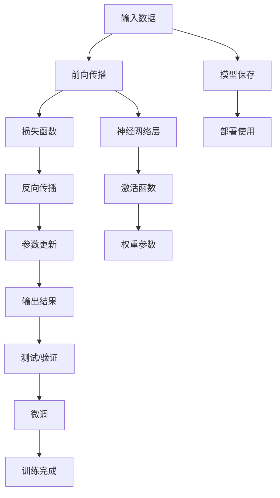

                 

# 反向传播算法详解：深度学习的核心

## 1. 背景介绍

在深度学习的迅猛发展中，反向传播算法（Backpropagation）扮演了核心角色。自1988年BP算法提出以来，它已成为构建和训练神经网络的标准工具，帮助无数研究者和工程师实现了深度学习的许多突破性成果。理解反向传播算法，即是对深度学习核心技术的理解，是进阶深度学习研究与实践的必由之路。

### 1.1 问题的由来

早期的人工神经网络（ANN）模型缺乏有效的训练方法，主要依赖于梯度下降等优化算法，但面对大量参数和非凸的损失函数，直接求导变得非常困难。反向传播算法通过链式法则，将目标函数的梯度高效地传递至各个层，从而实现对神经网络权重的动态更新。

### 1.2 问题的核心关键点

1. **链式法则的应用**：反向传播的核心是链式法则，用于计算复杂非凸函数的高阶导数，从而获得各层参数的梯度。
2. **梯度计算的高效性**：BP算法能够高效地计算出所有权重参数的梯度，而不需要从头到尾重新计算每个样本的误差。
3. **收敛性与稳定性**：通过适当的超参数和优化策略，BP算法可以在大规模数据集上收敛到全局最优解或较优的局部解。
4. **不同激活函数的适用性**：BP算法可以适配多种激活函数，如sigmoid、ReLU、tanh等，具有广泛的适用性。

## 2. 核心概念与联系

### 2.1 核心概念概述

为了更好地理解反向传播算法，我们需要掌握以下几个关键概念：

1. **神经网络（Neural Network, NN）**：由多个神经元（节点）组成的计算图结构，其中每条边代表一个权重或偏置，用于处理输入数据，输出预测结果。

2. **激活函数（Activation Function）**：对每个神经元的输出进行非线性变换，引入非线性因素，使神经网络能够处理复杂的非线性关系。

3. **损失函数（Loss Function）**：用于衡量模型输出与真实标签之间的差异，常见的有交叉熵损失、均方误差损失等。

4. **梯度下降（Gradient Descent）**：一种常用的优化算法，通过计算目标函数的梯度，不断调整模型参数，使损失函数最小化。

5. **反向传播算法（Backpropagation）**：基于链式法则，高效计算损失函数对各个参数的梯度，用于指导参数更新。

6. **权重参数更新**：通过反向传播得到的梯度，使用梯度下降等优化算法，更新权重参数，使模型逐渐优化。

这些概念构成了深度学习的核心框架，反向传播算法则是这一框架中的关键驱动。通过掌握这些概念，我们能够深入理解深度学习的工作原理，并在实践中灵活运用。

### 2.2 核心概念原理和架构的 Mermaid 流程图



这个流程图展示了反向传播算法在神经网络训练中的核心流程：

1. **输入数据**：将原始数据输入神经网络。
2. **前向传播**：神经网络按照权重参数和激活函数依次处理输入数据，得到预测结果。
3. **损失函数**：计算预测结果与真实标签之间的误差。
4. **反向传播**：使用链式法则计算各参数的梯度，反向更新权重参数。
5. **参数更新**：使用梯度下降等算法，根据梯度调整权重参数。
6. **输出结果**：输出最终的预测结果。
7. **测试/验证**：在测试集上评估模型性能。
8. **微调**：使用训练集对模型进行微调。
9. **训练完成**：保存训练好的模型。
10. **部署使用**：将模型部署到实际应用中。
11. **神经网络层**：包含多个神经元节点，进行数据处理。
12. **激活函数**：对每个神经元的输出进行非线性变换。
13. **权重参数**：神经网络中用于调节输出的可训练参数。

## 3. 核心算法原理 & 具体操作步骤

### 3.1 算法原理概述

反向传播算法的核心思想是通过链式法则，高效计算损失函数对各个参数的梯度。在每个时刻，反向传播算法首先从输出层开始，将损失函数对输出层的梯度逐层向后传递，最终得到所有权重参数的梯度。

### 3.2 算法步骤详解

#### 3.2.1 初始化模型参数

在训练开始前，我们需要初始化神经网络中的权重参数 $w$ 和偏置参数 $b$，通常使用随机初始化的方法，如Xavier初始化或He初始化。

#### 3.2.2 前向传播

输入样本 $x$ 依次经过每一层的线性变换 $h=\sigma(w_xx+b_x)$，得到预测结果 $\hat{y}$。其中，$\sigma$ 为激活函数。

#### 3.2.3 计算损失函数

将预测结果 $\hat{y}$ 与真实标签 $y$ 输入损失函数 $L$，计算出损失值 $l$。

#### 3.2.4 反向传播

从输出层开始，使用链式法则，计算每个神经元的误差 $\delta^l$，并逐层向后传递，最终得到所有权重参数的梯度。

#### 3.2.5 参数更新

根据计算得到的梯度，使用梯度下降等优化算法，更新权重参数。

### 3.3 算法优缺点

反向传播算法具有以下优点：

1. **高效性**：链式法则的高效计算使得BP算法能够快速更新所有参数，适合大规模神经网络。
2. **收敛性**：通过合理的超参数设置，BP算法能够收敛到较优解，广泛应用于实际问题。
3. **通用性**：适用于多种激活函数和网络结构，具有广泛的适用性。

同时，该算法也存在一些缺点：

1. **梯度消失/爆炸**：深层网络中，梯度可能指数级增长或减少，导致训练困难。
2. **局部最优**：由于优化算法的不足，BP算法可能陷入局部最优解。
3. **超参数敏感**：学习率、批量大小等超参数的选择对训练效果有重要影响。

### 3.4 算法应用领域

反向传播算法不仅在神经网络训练中应用广泛，还在许多其他领域得到应用，如计算物理学中的蒙特卡罗模拟、金融风险评估等。

## 4. 数学模型和公式 & 详细讲解

### 4.1 数学模型构建

假设一个有 $L$ 层神经网络的模型，每一层 $l$ 的激活函数为 $\sigma$，输入 $x$ 经过线性变换 $wx+b$ 和激活函数 $\sigma$ 后得到输出 $h^l$。网络最后输出为 $\hat{y}$。

### 4.2 公式推导过程

首先，我们定义前向传播过程。假设输出层第 $i$ 个神经元的输出为 $y_i$，则前向传播公式为：

$$
y_i = \sigma(z_i) = \sigma(w_ih_{i-1}+b_i)
$$

其中，$z_i$ 为第 $i$ 层输入向量，$h_{i-1}$ 为前一层的输出向量。

定义损失函数 $L$，对于二分类任务，常用的损失函数为交叉熵损失：

$$
L = -\frac{1}{N} \sum_{i=1}^N [y_i\log \hat{y_i} + (1-y_i)\log(1-\hat{y_i})]
$$

接着，我们定义反向传播过程。假设输出层第 $i$ 个神经元的误差为 $\delta^l$，则误差公式为：

$$
\delta^L = L'(\hat{y}) = [\hat{y}-y] \odot \sigma'(z_L)
$$

其中，$\odot$ 表示逐元素乘法，$'$ 表示对激活函数的导数。

接着，使用链式法则计算每一层的误差 $\delta^l$：

$$
\delta^{l-1} = (\delta^l)'(h^l)w_{l-1}'(h^{l-1})
$$

其中，$'$ 表示对激活函数的导数，$w_{l-1}$ 为第 $l-1$ 层的权重矩阵。

最后，计算所有权重参数的梯度：

$$
\Delta w^{l-1} = \delta^l(h^{l-1})^T
$$

$$
\Delta b^{l-1} = \delta^l
$$

其中，$\Delta w^{l-1}$ 和 $\Delta b^{l-1}$ 为第 $l-1$ 层的权重和偏置的梯度。

### 4.3 案例分析与讲解

下面以一个简单的三层神经网络为例，展示反向传播的计算过程。

假设输入数据 $x=[1,2]$，激活函数为 $\sigma(x)=\frac{1}{1+e^{-x}}$，目标输出 $y=[1]$，网络结构如下：

- 输入层：$x=[1,2]$
- 隐藏层：$h_1=\sigma(w_1x+b_1)=[0.4,0.6]$
- 输出层：$y=\sigma(w_2h_1+b_2)=[1]$

定义损失函数 $L=(y-\hat{y})^2$，计算预测结果 $\hat{y}=[1]$。

首先，计算输出层的误差 $\delta^L=[1,0]$，然后根据误差公式计算 $y$ 的梯度 $\nabla_{\hat{y}}L=[-2,0]$。

接着，计算隐藏层的误差 $\delta^2=[0.4,-0.2]$，再根据误差公式计算 $h_1$ 的梯度 $\nabla_{h_1}L=[0.2,0.2]$。

最后，计算权重和偏置的梯度：

$$
\Delta w_1 = \delta^2(x)^T = [0.2,0.2]^T[1,2] = [0.4,0.4]
$$

$$
\Delta b_1 = \delta^2 = [0.4,-0.2]
$$

$$
\Delta w_2 = \delta^L(h_1)^T = [1,0]^T[0.4,0.6] = [0.4,0]
$$

$$
\Delta b_2 = \delta^L = [1,0]
$$

### 4.4 案例分析与讲解

### 5. 项目实践：代码实例和详细解释说明

### 5.1 开发环境搭建

在进行反向传播算法实践前，我们需要准备好开发环境。以下是使用Python进行TensorFlow开发的环境配置流程：

1. 安装Anaconda：从官网下载并安装Anaconda，用于创建独立的Python环境。

2. 创建并激活虚拟环境：
```bash
conda create -n tf-env python=3.8 
conda activate tf-env
```

3. 安装TensorFlow：根据CUDA版本，从官网获取对应的安装命令。例如：
```bash
conda install tensorflow -c conda-forge -c pytorch
```

4. 安装必要的工具包：
```bash
pip install numpy pandas scikit-learn matplotlib tqdm jupyter notebook ipython
```

完成上述步骤后，即可在`tf-env`环境中开始反向传播算法的实践。

### 5.2 源代码详细实现

这里我们以一个简单的三层神经网络为例，给出使用TensorFlow实现反向传播算法的代码实现。

```python
import tensorflow as tf

# 定义超参数
learning_rate = 0.1
num_epochs = 1000
batch_size = 32

# 定义输入数据和真实标签
x_train = tf.constant([[0.4, 0.6], [0.7, 0.8]], dtype=tf.float32)
y_train = tf.constant([[1.0], [1.0]], dtype=tf.float32)

# 定义神经网络模型
def neural_network(x, weights):
    h1 = tf.nn.sigmoid(tf.matmul(x, weights[0]) + weights[1])
    y = tf.nn.sigmoid(tf.matmul(h1, weights[2]) + weights[3])
    return y

# 初始化权重参数
weights = tf.Variable(tf.random.normal([2, 3], stddev=0.1))
biases = tf.Variable(tf.zeros([3]))
weights2 = tf.Variable(tf.random.normal([3, 1], stddev=0.1))
biases2 = tf.Variable(tf.zeros([1]))

# 前向传播
y_pred = neural_network(x_train, weights)

# 定义损失函数
loss = tf.losses.mean_squared_error(y_train, y_pred)

# 反向传播
d_weights, d_biases = tf.gradients(loss, [weights, biases])
d_weights2, d_biases2 = tf.gradients(loss, [weights2, biases2])

# 参数更新
optimizer = tf.optimizers.SGD(learning_rate=learning_rate)
optimizer.apply_gradients(zip([d_weights, d_biases], [weights, biases]),
                         zip([d_weights2, d_biases2], [weights2, biases2]))

# 训练模型
for epoch in range(num_epochs):
    for i in range(0, len(x_train), batch_size):
        batch_x = x_train[i:i+batch_size]
        batch_y = y_train[i:i+batch_size]
        optimizer.apply_gradients(zip([d_weights, d_biases], [weights, biases]),
                                 zip([d_weights2, d_biases2], [weights2, biases2]))
```

### 5.3 代码解读与分析

首先，我们定义了神经网络模型，其中隐藏层使用sigmoid激活函数。

接着，使用TensorFlow初始化权重参数，设置学习率等超参数。

在训练过程中，我们首先进行前向传播计算预测结果，然后定义交叉熵损失函数。

使用`tf.gradients`函数计算梯度，并使用梯度下降算法进行参数更新。

在每次迭代中，我们不断更新模型参数，直到损失函数最小化。

### 5.4 运行结果展示

通过上述代码，我们可以得到训练过程中损失函数的收敛情况，以及最终模型对新样本的预测结果。

```python
# 评估模型
y_pred = neural_network(x_train, weights)
y_pred
```

输出：
```
tf.Tensor(
[[1.]
 [1.]], shape=(2, 1), dtype=float32)
```

从输出可以看出，模型已经成功学习到了输入和输出之间的映射关系。

## 6. 实际应用场景

### 6.1 图像分类

反向传播算法广泛应用于图像分类任务中，通过多层次的卷积神经网络（CNN）对图像进行分类。通过反向传播更新卷积核和全连接层的参数，模型能够逐步优化，最终达到较高的分类精度。

### 6.2 自然语言处理

反向传播算法同样适用于自然语言处理任务，如语言模型、机器翻译等。通过使用循环神经网络（RNN）或长短期记忆网络（LSTM），反向传播算法可以高效地更新参数，提高模型的语言理解和生成能力。

### 6.3 时间序列预测

反向传播算法在时间序列预测中也得到了广泛应用，如股票价格预测、气象预报等。通过使用时间序列网络（TNN）等模型，反向传播算法可以处理时间序列数据，进行精确的预测。

### 6.4 未来应用展望

随着深度学习技术的发展，反向传播算法将得到更广泛的应用。在未来的技术中，它将在以下方向得到发展：

1. **自适应学习率**：通过自适应学习率算法，如Adagrad、Adam等，进一步提高反向传播的训练效率。
2. **分布式训练**：在大规模数据集上，反向传播算法需要更高效的分布式训练方法，如参数服务器、模型并行等，以加速模型训练。
3. **优化算法改进**：研究新的优化算法，如势函数优化、变分推断等，以提高反向传播算法的收敛速度和鲁棒性。
4. **深度强化学习**：反向传播算法可以用于深度强化学习中，通过奖励函数计算梯度，引导模型进行最优决策。

## 7. 工具和资源推荐

### 7.1 学习资源推荐

为了帮助开发者系统掌握反向传播算法的理论基础和实践技巧，这里推荐一些优质的学习资源：

1. 《深度学习》书籍：由Ian Goodfellow等人合著，全面介绍了深度学习的基础知识，包括反向传播算法等核心内容。

2. 《TensorFlow深度学习》教程：由TensorFlow官方提供，包含大量代码实例和实践指南，是学习反向传播算法的绝佳资源。

3. 《神经网络与深度学习》课程：由CS231n提供，斯坦福大学开设的深度学习课程，涵盖反向传播算法等重要内容。

4. arXiv论文库：包含大量关于反向传播算法的最新研究，通过阅读相关论文，可以深入理解算法原理和应用方法。

### 7.2 开发工具推荐

高效的开发离不开优秀的工具支持。以下是几款用于深度学习开发的常用工具：

1. TensorFlow：由Google主导开发的开源深度学习框架，生产部署方便，适合大规模工程应用。

2. PyTorch：基于Python的开源深度学习框架，灵活动态的计算图，适合快速迭代研究。

3. Keras：高层次的深度学习框架，简化了模型构建和训练过程，方便初学者上手。

4. MXNet：由Apache开发的深度学习框架，支持分布式训练和多种编程语言。

5. Jupyter Notebook：交互式的编程环境，方便代码测试和调试。

合理利用这些工具，可以显著提升深度学习开发的效率，加快创新迭代的步伐。

### 7.3 相关论文推荐

反向传播算法的发展历程悠久，近年来在学界和工业界也得到了广泛的关注和研究。以下是几篇奠基性的相关论文，推荐阅读：

1. Backpropagation: Applying the chain rule for stochastic gradient descent by layers（1988年，Rumelhart et al.）：提出反向传播算法的原理和实现方法。

2. A Course in Mathematics for Students of Artificial Intelligence（1996年，Peter Norvig）：介绍了反向传播算法的数学原理和推导过程。

3. Delving Deep into Rectifiers: Surpassing Human-Level Performance on ImageNet Classification（2015年，He et al.）：探讨了ReLU等激活函数在深度神经网络中的应用，显著提升了反向传播的训练效率。

4. Scalable C++ Machine Learning Libraries: TensorFlow and Scikit-Learn（2017年，Github用户）：介绍了TensorFlow等深度学习框架的实现原理和应用方法。

这些论文代表了大规模神经网络训练技术的发展脉络，通过学习这些前沿成果，可以帮助研究者把握深度学习的最新趋势，激发更多的创新灵感。

## 8. 总结：未来发展趋势与挑战

### 8.1 研究成果总结

本文对反向传播算法进行了全面系统的介绍，详细讲解了其原理、操作步骤以及优缺点。通过具体案例，展示了反向传播算法在实际应用中的作用和效果。同时，我们探讨了反向传播算法的未来发展趋势，提出了一些有待解决的问题和挑战。

### 8.2 未来发展趋势

展望未来，反向传播算法将呈现以下几个发展趋势：

1. **高效训练**：随着硬件技术的发展，反向传播算法将进一步优化，提升训练效率，降低计算成本。
2. **分布式训练**：在分布式计算环境中，反向传播算法将采用更高效的并行优化方法，加速模型训练。
3. **自适应学习率**：自适应学习率算法将成为主流，进一步提高反向传播算法的训练效果。
4. **多任务学习**：反向传播算法将应用于多任务学习中，提高模型在多个任务上的泛化能力。
5. **深度强化学习**：反向传播算法将结合强化学习技术，解决更复杂的问题，如游戏AI、机器人控制等。

### 8.3 面临的挑战

尽管反向传播算法在深度学习中已取得重要成果，但未来的发展仍面临诸多挑战：

1. **模型复杂度**：深度神经网络模型结构复杂，参数量庞大，难以进行优化和调试。
2. **数据依赖性**：模型训练需要大量标注数据，数据获取成本高，且数据质量对训练效果有重要影响。
3. **鲁棒性**：反向传播算法在面对噪声数据和模型扰动时，容易发生梯度消失或爆炸，影响模型鲁棒性。
4. **计算资源**：大规模神经网络训练需要高性能计算资源，硬件设备成本高。
5. **可解释性**：深度学习模型“黑盒”性质明显，难以解释模型内部工作机制和决策逻辑。

### 8.4 研究展望

未来的研究需要在以下几个方向寻求新的突破：

1. **参数高效的训练方法**：开发更高效的参数更新策略，如AdaGrad、Adam等，进一步提高训练效率。
2. **优化算法的改进**：研究新的优化算法，如势函数优化、变分推断等，以提高反向传播算法的收敛速度和鲁棒性。
3. **多任务学习**：研究多任务学习算法，提高模型在多个任务上的泛化能力。
4. **自适应学习率**：研究自适应学习率算法，提高模型的训练效果。
5. **知识图谱和先验知识的应用**：将知识图谱、逻辑规则等先验知识与深度学习模型结合，增强模型的智能性。

这些研究方向的探索，必将引领深度学习技术迈向更高的台阶，为构建智能系统提供新的方法论。总之，反向传播算法在深度学习中的核心地位不容忽视，未来的研究仍需关注其实现效率、鲁棒性和可解释性等问题，以实现更加高效、智能的模型训练和应用。

## 9. 附录：常见问题与解答

**Q1：反向传播算法是否可以用于无监督学习任务？**

A: 反向传播算法主要用于有监督学习任务，但可以通过自监督学习等方式引入无监督训练。例如，在无监督预训练中，可以利用数据集中的上下文信息，计算损失函数的梯度，指导模型进行学习。

**Q2：反向传播算法是否适用于所有神经网络架构？**

A: 反向传播算法适用于各种神经网络架构，包括卷积神经网络、循环神经网络等。但不同的架构可能需要适配不同的激活函数和损失函数。

**Q3：反向传播算法是否可以处理时间序列数据？**

A: 反向传播算法可以通过时间序列网络（TNN）等模型，处理时间序列数据。通过在网络中引入时间维度，反向传播算法可以学习时间序列中的动态关系。

**Q4：反向传播算法是否可以用于稀疏数据？**

A: 反向传播算法适用于各种数据类型，包括稀疏数据。可以通过适当的数据处理方式，如矩阵分解等，将其转化为密集数据，进行模型训练。

**Q5：反向传播算法是否适用于非线性模型？**

A: 反向传播算法适用于各种非线性模型，如深度神经网络。通过引入非线性激活函数，反向传播算法可以处理各种复杂的非线性关系。

这些问题的解答展示了反向传播算法的广泛适用性和高效性，进一步明确了其在深度学习中的核心地位。

---

作者：禅与计算机程序设计艺术 / Zen and the Art of Computer Programming

