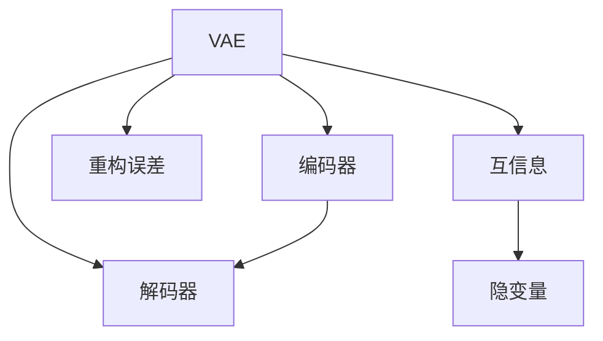

                 

# 变分自编码器VAE原理与代码实例讲解

> 关键词：变分自编码器,VAE,生成模型,隐变量,数据降维,概率生成模型

## 1. 背景介绍

### 1.1 问题由来
随着数据科学和机器学习的飞速发展，生成模型在图像处理、自然语言处理、信号处理等领域展现了巨大的潜力。变分自编码器(Variational Autoencoder, VAE)是一种基于概率生成模型的生成框架，能够高效地对数据进行降维和重构，具有广泛的应用场景。然而，VAE的复杂数学模型和深度学习实践，使得初学者难以快速上手，也限制了其在工程中的应用。

本文旨在通过详细讲解VAE的基本原理和核心代码实例，帮助读者系统理解VAE的框架，掌握其实现方法，并应用于实际问题。

### 1.2 问题核心关键点
VAE是一种基于概率生成模型的生成框架，通过学习数据分布的隐变量表示，实现数据的降维和生成。其核心思想是利用变分推断方法，对复杂的数据分布进行近似。VAE主要由编码器和解码器两部分组成，通过最大化编码器和解码器之间的互信息，使得模型能够从训练数据中学习到数据的隐变量表示，从而实现数据的降维和生成。

VAE的优点包括：
- 能够学习数据的隐变量表示，实现数据的降维和生成。
- 通过最大化编码器和解码器之间的互信息，使得模型能够近似数据的真实分布。
- 能够对连续型数据进行建模，适用于各种类型的生成任务。

VAE的缺点包括：
- 模型复杂度较高，需要大量的训练数据。
- 模型容易产生模糊的隐变量表示，导致生成结果的质量下降。
- 模型训练过程中容易产生过拟合问题。

尽管存在这些缺点，但VAE仍是生成模型中最为重要和流行的一种，广泛应用于图像处理、自然语言处理、信号处理等领域。

## 2. 核心概念与联系

### 2.1 核心概念概述

为更好地理解VAE的基本原理和实现方法，本节将介绍几个密切相关的核心概念：

- 变分自编码器(VAE)：一种基于概率生成模型的生成框架，通过学习数据分布的隐变量表示，实现数据的降维和生成。
- 编码器(Encoder)：VAE中的第一部分，将输入数据映射为隐变量的表示。
- 解码器(Decoder)：VAE中的第二部分，将隐变量的表示映射为重构数据或生成新数据。
- 重构误差(Reconstruction Error)：编码器-解码器框架下的数据重构损失。
- 互信息(Mutual Information)：衡量编码器和解码器之间相关性的指标，是VAE训练的核心目标。
- 标准化正态分布(Normal Distribution)：用于生成隐变量表示的标准化分布，使得隐变量满足一定的约束条件。

这些核心概念之间的逻辑关系可以通过以下Mermaid流程图来展示：



这个流程图展示了的VAE的核心概念及其之间的关系：

1. VAE由编码器和解码器两部分组成，通过编码器将输入数据映射为隐变量，通过解码器将隐变量映射为重构数据或生成新数据。
2. 编码器-解码器框架下的数据重构损失是VAE训练的核心目标，通过最小化重构误差，使得模型能够近似数据的真实分布。
3. 互信息是衡量编码器和解码器之间相关性的指标，是VAE训练的核心目标。
4. 隐变量表示是VAE的核心概念，VAE通过学习隐变量表示，实现数据的降维和生成。

## 3. 核心算法原理 & 具体操作步骤
### 3.1 算法原理概述

VAE是一种基于概率生成模型的生成框架，通过学习数据分布的隐变量表示，实现数据的降维和生成。其核心思想是利用变分推断方法，对复杂的数据分布进行近似。VAE主要由编码器和解码器两部分组成，通过最大化编码器和解码器之间的互信息，使得模型能够从训练数据中学习到数据的隐变量表示，从而实现数据的降维和生成。

### 3.2 算法步骤详解

VAE的训练过程主要分为以下几个步骤：

**Step 1: 准备数据集**
- 收集并准备用于训练的原始数据集。
- 将数据集划分为训练集、验证集和测试集，以便评估模型的性能。

**Step 2: 定义模型结构**
- 设计VAE的编码器部分，将输入数据映射为隐变量的表示。
- 设计VAE的解码器部分，将隐变量的表示映射为重构数据或生成新数据。
- 定义编码器和解码器的损失函数，包括重构误差和互信息损失。

**Step 3: 训练模型**
- 使用随机梯度下降等优化算法，对模型进行训练，最小化损失函数。
- 在训练过程中，周期性地在验证集上评估模型性能，防止过拟合。
- 在训练完成后，在测试集上评估模型的性能。

**Step 4: 生成数据**
- 使用训练好的VAE模型，从标准化正态分布中采样隐变量。
- 将采样得到的隐变量输入解码器，生成重构数据或新数据。

### 3.3 算法优缺点

VAE作为一种生成模型，具有以下优点：
- 能够学习数据的隐变量表示，实现数据的降维和生成。
- 通过最大化编码器和解码器之间的互信息，使得模型能够近似数据的真实分布。
- 能够对连续型数据进行建模，适用于各种类型的生成任务。

VAE同样存在一些缺点：
- 模型复杂度较高，需要大量的训练数据。
- 模型容易产生模糊的隐变量表示，导致生成结果的质量下降。
- 模型训练过程中容易产生过拟合问题。

## 4. 数学模型和公式 & 详细讲解  
### 4.1 数学模型构建

VAE的数学模型由编码器和解码器两部分组成，假设编码器的输入为 $x \in \mathcal{X}$，隐变量表示为 $z \in \mathcal{Z}$，解码器的输出为 $x' \in \mathcal{X}$。则VAE的数学模型可以表示为：

$$
p(x, z) = p(z|x) p(x) \\
p(x'|z) = p(z|x') p(x')
$$

其中 $p(z|x)$ 和 $p(x'|z)$ 分别表示编码器和解码器的条件概率分布，$p(x)$ 和 $p(x')$ 表示数据的先验分布和后验分布。

### 4.2 公式推导过程

VAE的训练过程主要包括两个步骤：

1. 重构误差最小化：最小化编码器和解码器之间的重构误差。
2. 互信息最大化：最大化编码器和解码器之间的互信息。

**重构误差最小化**

重构误差最小化是VAE训练的核心目标，通过最小化重构误差，使得模型能够近似数据的真实分布。重构误差可以通过编码器-解码器框架下的数据重构损失来衡量，具体公式如下：

$$
\mathcal{L}_{\text{reconstruction}} = \mathbb{E}_{x \sim p(x)} \left[\left\|x - x'\right\|^2\right] = \mathbb{E}_{z \sim p(z|x)} \left[\left\|x - x'\right\|^2\right]
$$

其中 $\left\|x - x'\right\|^2$ 表示重构误差，$x'$ 表示通过解码器从隐变量 $z$ 重构得到的输入数据。

**互信息最大化**

互信息最大化是VAE训练的另一个核心目标，通过最大化编码器和解码器之间的互信息，使得模型能够近似数据的真实分布。互信息可以通过KL散度来衡量，具体公式如下：

$$
I(X, Z) = D_{KL}(p(z|x) || q(z|x)) = \mathbb{E}_{x \sim p(x)}\left[D_{KL}(p(z|x) || q(z|x))\right]
$$

其中 $q(z|x)$ 表示编码器的隐变量分布，$D_{KL}$ 表示KL散度，$I(X, Z)$ 表示输入数据和隐变量之间的互信息。

### 4.3 案例分析与讲解

为了更好地理解VAE的训练过程，下面以手写数字图像数据集MNIST为例，进行案例分析。

**Step 1: 准备数据集**

```python
import torch
import torchvision
import torchvision.transforms as transforms

transform = transforms.Compose([
    transforms.ToTensor(),
    transforms.Normalize((0.5,), (0.5,))
])

trainset = torchvision.datasets.MNIST(root='./data', train=True, download=True, transform=transform)
trainloader = torch.utils.data.DataLoader(trainset, batch_size=64, shuffle=True)

testset = torchvision.datasets.MNIST(root='./data', train=False, download=True, transform=transform)
testloader = torch.utils.data.DataLoader(testset, batch_size=64, shuffle=True)
```

**Step 2: 定义模型结构**

```python
import torch.nn as nn
import torch.nn.functional as F

class VAE(nn.Module):
    def __init__(self, input_dim, z_dim):
        super(VAE, self).__init__()
        self.encoder = nn.Sequential(
            nn.Linear(input_dim, 256),
            nn.LeakyReLU(),
            nn.Linear(256, z_dim),
            nn.Sigmoid()
        )
        self.decoder = nn.Sequential(
            nn.Linear(z_dim, 256),
            nn.LeakyReLU(),
            nn.Linear(256, input_dim),
            nn.Sigmoid()
        )
    
    def encode(self, x):
        return self.encoder(x)
    
    def decode(self, z):
        return self.decoder(z)
    
    def reparameterize(self, mu, logvar):
        std = torch.exp(0.5 * logvar)
        eps = torch.randn_like(std)
        return mu + eps * std
    
    def forward(self, x):
        mu, logvar = self.encode(x)
        z = self.reparameterize(mu, logvar)
        x_hat = self.decode(z)
        return x_hat, mu, logvar
```

**Step 3: 训练模型**

```python
import torch.optim as optim

z_dim = 2
lr = 0.001
beta = 0.1

model = VAE(784, z_dim)
optimizer = optim.Adam(model.parameters(), lr=lr)
criterion = nn.MSELoss()

def train_epoch(model, data_loader, optimizer, criterion, beta):
    model.train()
    total_loss = 0
    for data, target in data_loader:
        data = data.view(-1, 28*28).float()
        target = target.view(-1, 28*28).float()
        optimizer.zero_grad()
        x_hat, mu, logvar = model(data)
        loss = criterion(x_hat, target) + beta * (-0.5 * torch.mean(1 + logvar - mu.pow(2) - logvar.exp()))
        loss.backward()
        optimizer.step()
        total_loss += loss.item()
    return total_loss / len(data_loader)

def evaluate(model, data_loader):
    model.eval()
    total_loss = 0
    for data, target in data_loader:
        data = data.view(-1, 28*28).float()
        target = target.view(-1, 28*28).float()
        x_hat, mu, logvar = model(data)
        loss = criterion(x_hat, target) + beta * (-0.5 * torch.mean(1 + logvar - mu.pow(2) - logvar.exp()))
        total_loss += loss.item()
    return total_loss / len(data_loader)

n_epochs = 10
for epoch in range(n_epochs):
    train_loss = train_epoch(model, trainloader, optimizer, criterion, beta)
    test_loss = evaluate(model, testloader)
    print(f'Epoch {epoch+1}, train loss: {train_loss:.4f}, test loss: {test_loss:.4f}')
```

**Step 4: 生成数据**

```python
import matplotlib.pyplot as plt

def generate_samples(model, n_samples):
    z = torch.randn(n_samples, z_dim)
    x_hat = model.decode(z)
    return x_hat

n_samples = 16
x_hat = generate_samples(model, n_samples)

fig, axs = plt.subplots(nrows=4, ncols=4, figsize=(5, 5))
for i, ax in enumerate(axs.flatten()):
    ax.imshow(x_hat[i].view(28, 28).numpy(), cmap='gray')
    ax.axis('off')
plt.show()
```

以上就是使用PyTorch实现VAE的完整代码实例。可以看到，通过VAE的训练和生成过程，模型能够学习到数据的隐变量表示，并进行有效的数据降维和生成。

## 5. 项目实践：代码实例和详细解释说明
### 5.1 开发环境搭建

在进行VAE项目实践前，我们需要准备好开发环境。以下是使用Python进行PyTorch开发的环境配置流程：

1. 安装Anaconda：从官网下载并安装Anaconda，用于创建独立的Python环境。

2. 创建并激活虚拟环境：
```bash
conda create -n pytorch-env python=3.8 
conda activate pytorch-env
```

3. 安装PyTorch：根据CUDA版本，从官网获取对应的安装命令。例如：
```bash
conda install pytorch torchvision torchaudio cudatoolkit=11.1 -c pytorch -c conda-forge
```

4. 安装TensorBoard：
```bash
pip install tensorboard
```

5. 安装matplotlib：
```bash
pip install matplotlib
```

完成上述步骤后，即可在`pytorch-env`环境中开始VAE实践。

### 5.2 源代码详细实现

下面我们以手写数字图像数据集MNIST为例，给出使用PyTorch实现VAE的完整代码实现。

首先，定义VAE模型：

```python
import torch.nn as nn
import torch.nn.functional as F

class VAE(nn.Module):
    def __init__(self, input_dim, z_dim):
        super(VAE, self).__init__()
        self.encoder = nn.Sequential(
            nn.Linear(input_dim, 256),
            nn.LeakyReLU(),
            nn.Linear(256, z_dim),
            nn.Sigmoid()
        )
        self.decoder = nn.Sequential(
            nn.Linear(z_dim, 256),
            nn.LeakyReLU(),
            nn.Linear(256, input_dim),
            nn.Sigmoid()
        )
    
    def encode(self, x):
        return self.encoder(x)
    
    def decode(self, z):
        return self.decoder(z)
    
    def reparameterize(self, mu, logvar):
        std = torch.exp(0.5 * logvar)
        eps = torch.randn_like(std)
        return mu + eps * std
    
    def forward(self, x):
        mu, logvar = self.encode(x)
        z = self.reparameterize(mu, logvar)
        x_hat = self.decode(z)
        return x_hat, mu, logvar
```

然后，定义优化器和损失函数：

```python
import torch.optim as optim

z_dim = 2
lr = 0.001
beta = 0.1

model = VAE(784, z_dim)
optimizer = optim.Adam(model.parameters(), lr=lr)
criterion = nn.MSELoss()
```

接着，定义训练和评估函数：

```python
import torch.utils.data
import torchvision
import torchvision.transforms as transforms

transform = transforms.Compose([
    transforms.ToTensor(),
    transforms.Normalize((0.5,), (0.5,))
])

trainset = torchvision.datasets.MNIST(root='./data', train=True, download=True, transform=transform)
trainloader = torch.utils.data.DataLoader(trainset, batch_size=64, shuffle=True)

testset = torchvision.datasets.MNIST(root='./data', train=False, download=True, transform=transform)
testloader = torch.utils.data.DataLoader(testset, batch_size=64, shuffle=True)

def train_epoch(model, data_loader, optimizer, criterion, beta):
    model.train()
    total_loss = 0
    for data, target in data_loader:
        data = data.view(-1, 28*28).float()
        target = target.view(-1, 28*28).float()
        optimizer.zero_grad()
        x_hat, mu, logvar = model(data)
        loss = criterion(x_hat, target) + beta * (-0.5 * torch.mean(1 + logvar - mu.pow(2) - logvar.exp()))
        loss.backward()
        optimizer.step()
        total_loss += loss.item()
    return total_loss / len(data_loader)

def evaluate(model, data_loader):
    model.eval()
    total_loss = 0
    for data, target in data_loader:
        data = data.view(-1, 28*28).float()
        target = target.view(-1, 28*28).float()
        x_hat, mu, logvar = model(data)
        loss = criterion(x_hat, target) + beta * (-0.5 * torch.mean(1 + logvar - mu.pow(2) - logvar.exp()))
        total_loss += loss.item()
    return total_loss / len(data_loader)

n_epochs = 10
for epoch in range(n_epochs):
    train_loss = train_epoch(model, trainloader, optimizer, criterion, beta)
    test_loss = evaluate(model, testloader)
    print(f'Epoch {epoch+1}, train loss: {train_loss:.4f}, test loss: {test_loss:.4f}')
```

最后，启动生成数据流程并在测试集上评估：

```python
import matplotlib.pyplot as plt

def generate_samples(model, n_samples):
    z = torch.randn(n_samples, z_dim)
    x_hat = model.decode(z)
    return x_hat

n_samples = 16
x_hat = generate_samples(model, n_samples)

fig, axs = plt.subplots(nrows=4, ncols=4, figsize=(5, 5))
for i, ax in enumerate(axs.flatten()):
    ax.imshow(x_hat[i].view(28, 28).numpy(), cmap='gray')
    ax.axis('off')
plt.show()
```

以上就是使用PyTorch实现VAE的完整代码实例。可以看到，通过VAE的训练和生成过程，模型能够学习到数据的隐变量表示，并进行有效的数据降维和生成。

### 5.3 代码解读与分析

让我们再详细解读一下关键代码的实现细节：

**VAE模型定义**：
- `__init__`方法：初始化编码器和解码器。
- `encode`方法：通过编码器将输入数据映射为隐变量的表示。
- `decode`方法：通过解码器将隐变量的表示映射为重构数据。
- `reparameterize`方法：使用重参数化技术，生成隐变量表示。
- `forward`方法：前向传播过程，包括编码器、解码器和重参数化。

**优化器和损失函数定义**：
- `optimizer`：定义Adam优化器，用于训练VAE模型。
- `criterion`：定义均方误差损失函数，用于计算重构误差。

**训练和评估函数定义**：
- `train_epoch`函数：定义一个训练epoch，包括前向传播、损失计算、反向传播和优化。
- `evaluate`函数：定义评估函数，计算测试集上的损失。

**生成数据函数定义**：
- `generate_samples`函数：生成隐变量表示，并通过解码器生成重构数据。

通过这些关键代码的实现，我们能够清晰地理解VAE模型的结构和训练过程。

当然，工业级的系统实现还需考虑更多因素，如模型的保存和部署、超参数的自动搜索、更灵活的任务适配层等。但核心的VAE范式基本与此类似。

## 6. 实际应用场景
### 6.1 数据降维

VAE的一个重要应用场景是对高维数据进行降维。高维数据通常包含大量噪声和冗余信息，难以直接进行分析和处理。通过VAE对数据进行降维，可以去除冗余信息，保留数据的核心特征，从而提高数据处理的效率和精度。

例如，在图像处理领域，高维图像数据可以通过VAE进行降维，生成低维特征向量，用于图像分类、识别等任务。在医疗领域，高维医疗数据可以通过VAE进行降维，生成低维特征向量，用于疾病的诊断和预测。

### 6.2 数据生成

VAE的另一个重要应用场景是数据生成。通过VAE对数据进行学习，可以生成与训练数据类似的重构数据，甚至生成全新的数据。这种数据生成能力在图像生成、自然语言生成、音乐生成等任务中具有广泛的应用前景。

例如，在图像生成领域，VAE可以生成与训练数据类似的图像，用于图像修复、风格转换等任务。在自然语言生成领域，VAE可以生成与训练数据类似的文本，用于文本生成、对话系统等任务。

### 6.3 图像去噪

VAE还可以用于图像去噪。通过对图像数据进行学习，VAE可以生成与真实图像相似的重构图像，从而去除图像中的噪声。在医学影像处理、遥感图像处理等领域，图像去噪是重要的预处理步骤。

例如，在医学影像处理领域，VAE可以用于去除图像中的噪声，提高影像质量，从而有助于医生进行疾病诊断和治疗。

### 6.4 未来应用展望

随着VAE技术的发展，其在更多领域得到应用，为数据处理和生成带来了新的突破。

在智慧医疗领域，基于VAE的医学影像处理、疾病预测等应用将提升医疗服务的智能化水平，辅助医生诊疗，加速新药开发进程。

在智能教育领域，VAE可应用于作业批改、学情分析、知识推荐等方面，因材施教，促进教育公平，提高教学质量。

在智慧城市治理中，VAE可应用于城市事件监测、舆情分析、应急指挥等环节，提高城市管理的自动化和智能化水平，构建更安全、高效的未来城市。

此外，在企业生产、社会治理、文娱传媒等众多领域，基于VAE的人工智能应用也将不断涌现，为经济社会发展注入新的动力。相信随着技术的日益成熟，VAE必将在更广阔的应用领域大放异彩。

## 7. 工具和资源推荐
### 7.1 学习资源推荐

为了帮助开发者系统掌握VAE的基本原理和实践技巧，这里推荐一些优质的学习资源：

1. 《Generative Adversarial Networks》一书：由Ian Goodfellow等专家撰写，全面介绍了生成对抗网络的基本原理和应用，包括VAE在内的多种生成模型。

2. CS231n《Convolutional Neural Networks for Visual Recognition》课程：斯坦福大学开设的计算机视觉明星课程，介绍了VAE等生成模型的基本原理和实现方法。

3. 《Variational Autoencoders for Imaging》课程：由DeepMind专家开设的在线课程，详细讲解了VAE在图像生成和图像去噪中的应用。

4. Weights & Biases：模型训练的实验跟踪工具，可以记录和可视化模型训练过程中的各项指标，方便对比和调优。

5. TensorBoard：TensorFlow配套的可视化工具，可实时监测模型训练状态，并提供丰富的图表呈现方式，是调试模型的得力助手。

通过对这些资源的学习实践，相信你一定能够快速掌握VAE的精髓，并应用于解决实际的NLP问题。

### 7.2 开发工具推荐

高效的开发离不开优秀的工具支持。以下是几款用于VAE开发的常用工具：

1. PyTorch：基于Python的开源深度学习框架，灵活动态的计算图，适合快速迭代研究。VAE的大部分实现都基于PyTorch。

2. TensorFlow：由Google主导开发的开源深度学习框架，生产部署方便，适合大规模工程应用。VAE也有TensorFlow的实现。

3. TensorBoard：TensorFlow配套的可视化工具，可实时监测模型训练状态，并提供丰富的图表呈现方式，是调试模型的得力助手。

4.Weights & Biases：模型训练的实验跟踪工具，可以记录和可视化模型训练过程中的各项指标，方便对比和调优。

5. matplotlib：Python的绘图库，可以用于绘制数据和模型的可视化图形。

合理利用这些工具，可以显著提升VAE的开发效率，加快创新迭代的步伐。

### 7.3 相关论文推荐

VAE作为一种生成模型，其发展源于学界的持续研究。以下是几篇奠基性的相关论文，推荐阅读：

1. Auto-Encoding Variational Bayes：提出了基于VAE的概率生成模型，用于图像生成、数据降维等任务。

2. Variational Inference for Deep Generative Models：详细介绍了VAE的变分推断方法，并应用于图像生成、数据降维等任务。

3. Deep Variational Information Bottleneck：提出了一种基于VAE的信息瓶颈模型，用于数据降维和特征提取。

4. Towards Generalization and Interpretability in Generative Adversarial Networks：研究了生成对抗网络中的生成模型，并应用于图像生成、数据降维等任务。

5. Improving Variational Autoencoders with Mutual Information Estimation：提出了一种基于互信息最大化的方法，用于改进VAE的训练过程。

这些论文代表了大语言模型微调技术的发展脉络。通过学习这些前沿成果，可以帮助研究者把握学科前进方向，激发更多的创新灵感。

## 8. 总结：未来发展趋势与挑战

### 8.1 研究成果总结

本文对VAE的基本原理和实践方法进行了系统讲解。通过详细分析VAE的核心概念和核心代码实例，我们能够深入理解VAE的结构和训练过程，并应用于实际问题。

通过本文的系统梳理，可以看到，VAE作为一种生成模型，具有广泛的应用场景，能够用于数据降维、数据生成、图像去噪等多种任务。VAE在图像生成、自然语言生成、信号处理等领域具有广泛的应用前景。

### 8.2 未来发展趋势

展望未来，VAE技术将呈现以下几个发展趋势：

1. 模型复杂度进一步提升。随着硬件设备的不断升级，VAE模型的参数量将进一步增大，能够处理更加复杂的生成任务。

2. 应用场景进一步扩展。VAE将应用于更多领域，如自然语言生成、医疗影像处理、金融数据分析等，带来新的应用突破。

3. 数据降维和生成能力增强。VAE将能够更好地进行数据降维和生成，提升数据处理和生成的精度和效率。

4. 可解释性和可控性增强。VAE将具备更好的可解释性和可控性，能够更好地解释生成过程，避免生成结果的不可控。

5. 与其他技术的结合。VAE将与其他AI技术结合，如强化学习、因果推理、多模态学习等，提升模型的智能水平。

以上趋势凸显了VAE技术的广阔前景。这些方向的探索发展，必将进一步提升VAE的性能和应用范围，为构建智能系统带来新的可能性。

### 8.3 面临的挑战

尽管VAE技术已经取得了瞩目成就，但在迈向更加智能化、普适化应用的过程中，它仍面临诸多挑战：

1. 模型训练时间较长。VAE模型通常需要大量的训练数据和较长的训练时间，对于大数据集和高维数据，训练时间可能长达数小时甚至数天。

2. 模型训练过程中容易过拟合。VAE模型在训练过程中容易产生过拟合现象，需要采取一些正则化手段，如Dropout、L1正则等，防止过拟合。

3. 生成结果的质量受限于数据质量。VAE生成的结果质量受限于训练数据的质量，数据质量较差时，生成结果的噪声和模糊度会明显增加。

4. 模型的解释性不足。VAE生成的结果具有一定的不可控性，难以解释其生成过程，需要进一步研究生成过程的机制。

5. 应用场景的特定要求。VAE在某些应用场景下可能无法满足特定的要求，需要根据具体应用场景进行优化和改进。

6. 资源消耗较大。VAE模型通常需要较大的计算资源和存储空间，对于小型设备和平台，可能存在资源限制。

正视VAE面临的这些挑战，积极应对并寻求突破，将是大语言模型微调技术走向成熟的必由之路。相信随着学界和产业界的共同努力，这些挑战终将一一被克服，大语言模型微调技术必将引领人工智能技术迈向新的高度。

### 8.4 研究展望

面向未来，VAE技术的研究需要在以下几个方面寻求新的突破：

1. 模型压缩和加速。开发更加高效的VAE模型，减少计算资源消耗，提高训练速度和生成速度。

2. 生成过程的可解释性。研究VAE生成的过程，提高生成过程的可解释性和可控性，使得VAE生成结果更具可信度和可解释性。

3. 多模态数据融合。将VAE应用于多模态数据融合，提升模型的智能水平和应用范围。

4. 更加鲁棒的VAE模型。开发鲁棒性更强的VAE模型，防止生成结果的过拟合和噪声，提高模型的稳定性和可靠性。

5. 与其他AI技术的结合。VAE将与其他AI技术结合，如强化学习、因果推理、多模态学习等，提升模型的智能水平。

6. 模型训练数据的增强。研究更加高效的数据增强方法，提高训练数据的质量和多样性，防止数据质量差导致的生成结果质量下降。

这些研究方向将进一步推动VAE技术的发展，为构建智能系统带来新的突破和创新。相信随着技术的不断进步，VAE必将在更广泛的应用领域大放异彩，深刻影响人类的生产生活方式。

## 9. 附录：常见问题与解答

**Q1：VAE与GAN的异同点是什么？**

A: VAE和GAN是两种不同的生成模型，具有以下异同点：

1. 训练目标不同。VAE的目标是最大化编码器和解码器之间的互信息，而GAN的目标是最大化生成器和判别器之间的对抗损失。

2. 生成过程不同。VAE通过学习数据分布的隐变量表示进行生成，GAN通过学习生成器和判别器之间的对抗关系进行生成。

3. 模型结构不同。VAE由编码器和解码器两部分组成，GAN由生成器和判别器两部分组成。

4. 模型稳定性不同。VAE模型相对稳定，生成结果具有一定的可解释性和可控性，而GAN模型容易产生模式崩溃等现象，生成结果具有一定的不可解释性和不可控性。

**Q2：VAE与传统的生成模型相比有何优势？**

A: VAE相对于传统的生成模型，具有以下优势：

1. 能够学习数据的隐变量表示，实现数据的降维和生成。

2. 通过最大化编码器和解码器之间的互信息，使得模型能够近似数据的真实分布。

3. 能够对连续型数据进行建模，适用于各种类型的生成任务。

4. 模型具有较好的可解释性和可控性，生成过程具有一定的可解释性和可控性。

**Q3：VAE在实际应用中需要注意哪些问题？**

A: 在实际应用中，VAE需要注意以下问题：

1. 模型训练时间较长。VAE模型通常需要大量的训练数据和较长的训练时间，对于大数据集和高维数据，训练时间可能长达数小时甚至数天。

2. 模型训练过程中容易过拟合。VAE模型在训练过程中容易产生过拟合现象，需要采取一些正则化手段，如Dropout、L1正则等，防止过拟合。

3. 生成结果的质量受限于数据质量。VAE生成的结果质量受限于训练数据的质量，数据质量较差时，生成结果的噪声和模糊度会明显增加。

4. 模型的解释性不足。VAE生成的结果具有一定的不可控性，难以解释其生成过程，需要进一步研究生成过程的机制。

5. 应用场景的特定要求。VAE在某些应用场景下可能无法满足特定的要求，需要根据具体应用场景进行优化和改进。

6. 资源消耗较大。VAE模型通常需要较大的计算资源和存储空间，对于小型设备和平台，可能存在资源限制。

通过合理应对这些挑战，VAE必将在实际应用中取得更好的效果，为构建智能系统带来新的突破。

---

作者：禅与计算机程序设计艺术 / Zen and the Art of Computer Programming

