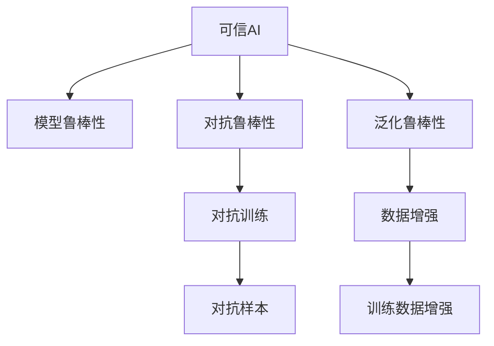

                 

## 1. 背景介绍

在当今人工智能(AI)时代，可信AI（Trustworthy AI）的概念已经引起广泛关注。可信AI不仅涉及算法的准确性和公平性，还涵盖了算法的透明度、可解释性、鲁棒性等多个方面。模型鲁棒性作为可信AI的重要组成部分，指的是模型能够抵抗各种扰动和攻击，保持输出稳定可靠。

近年来，深度学习模型在图像识别、自然语言处理、推荐系统等领域取得了令人瞩目的成果。然而，这些模型常常存在过拟合、对抗样本攻击等问题，严重影响其在实际应用中的可信度。

因此，研究模型鲁棒性的原理与方法，构建鲁棒可信的AI系统，对于推动人工智能技术的应用与普及具有重要意义。本文将详细探讨可信AI与模型鲁棒性的相关原理，并通过具体代码实例，展示如何在实际应用中实现模型鲁棒性的提升。

## 2. 核心概念与联系

### 2.1 核心概念概述

- **可信AI**：指AI系统在安全性、公平性、透明性等方面符合伦理和法律要求，能够经受住公众的审查和质疑，同时为社会带来福祉。

- **模型鲁棒性**：指AI模型在输入数据发生扰动时仍能保持稳定和可靠的行为。模型的鲁棒性包括对抗鲁棒性和泛化鲁棒性等。

- **对抗样本**：指对模型输入数据进行细微的扰动，使得模型在面对扰动后的数据时，输出结果发生错误。

- **泛化鲁棒性**：指模型在面对未知数据时，仍能保持稳健的表现，避免出现灾难性遗忘。

- **公平性**：指模型在对待不同群体时，不存在显著的不公平差异。

- **可解释性**：指模型能够解释其输出决策的依据，让用户理解和信任模型的结果。

- **对抗训练**：通过引入对抗样本对模型进行训练，提升模型的对抗鲁棒性。

- **数据增强**：通过对训练数据进行扩充，提升模型的泛化鲁棒性。

这些核心概念相互联系，共同构成了可信AI与模型鲁棒性的研究框架。通过对这些概念的深入理解，我们可以更好地把握AI系统的可信性与稳定性。

### 2.2 核心概念原理和架构的 Mermaid 流程图



这个流程图展示了可信AI、模型鲁棒性、对抗鲁棒性和泛化鲁棒性之间的关系，以及实现这些鲁棒性的技术手段。

## 3. 核心算法原理 & 具体操作步骤

### 3.1 算法原理概述

模型鲁棒性的实现主要依赖于对抗训练和数据增强等技术。对抗训练通过引入对抗样本，提升模型对输入扰动的抵抗能力，从而增强模型的对抗鲁棒性。数据增强通过对训练数据进行扩充，提升模型对新数据的适应能力，从而增强模型的泛化鲁棒性。

### 3.2 算法步骤详解

#### 3.2.1 对抗训练

对抗训练的流程如下：

1. **生成对抗样本**：使用对抗样本生成算法（如FGSM、PGD等）生成对抗样本。
2. **模型微调**：将生成的对抗样本加入到训练数据中，对模型进行微调。
3. **验证评估**：在验证集上评估模型在对抗样本上的性能，确保模型在面对对抗样本时仍然稳健。

#### 3.2.2 数据增强

数据增强的流程如下：

1. **数据预处理**：对原始数据进行标准化、归一化等预处理操作。
2. **数据扩充**：使用数据增强技术（如旋转、缩放、翻转等）对数据进行扩充。
3. **模型训练**：使用增强后的数据对模型进行训练。
4. **验证评估**：在验证集上评估模型在增强数据上的性能，确保模型对新数据有良好的泛化能力。

### 3.3 算法优缺点

**对抗训练的优点**：
- 提高模型的对抗鲁棒性，使其能够抵御对抗样本的攻击。
- 无需额外标注数据，可利用现有数据进行训练。

**对抗训练的缺点**：
- 训练开销较大，需要额外的计算资源和时间。
- 可能引入模型过拟合的风险。

**数据增强的优点**：
- 提升模型的泛化能力，使其能够适应新数据。
- 无需额外标注数据，可利用现有数据进行训练。

**数据增强的缺点**：
- 可能会引入数据噪声，降低模型性能。
- 数据增强方式选择不当可能反而降低模型性能。

### 3.4 算法应用领域

模型鲁棒性技术广泛应用在图像识别、自然语言处理、推荐系统等多个领域。例如，在图像识别中，对抗训练和数据增强可以提升模型对图像扰动的抵抗能力，避免对抗样本攻击。在自然语言处理中，对抗训练和数据增强可以提高模型对输入噪声和对抗攻击的抵抗能力，提升模型的可解释性和公平性。

## 4. 数学模型和公式 & 详细讲解

### 4.1 数学模型构建

在对抗训练中，模型的损失函数通常包含原始数据损失和对抗样本损失。假设模型为 $f_{\theta}$，输入为 $x$，标签为 $y$，对抗样本生成器为 $\mathcal{G}$，生成对抗样本为 $x_{adv}=\mathcal{G}(x)$。则模型的损失函数可以表示为：

$$
\mathcal{L}(f_{\theta}, (x, y), x_{adv}) = \mathcal{L}_{org}(f_{\theta}, x, y) + \lambda \mathcal{L}_{adv}(f_{\theta}, x_{adv})
$$

其中 $\mathcal{L}_{org}$ 为原始数据损失，$\mathcal{L}_{adv}$ 为对抗样本损失，$\lambda$ 为对抗样本损失的权重。

### 4.2 公式推导过程

对抗样本生成器 $\mathcal{G}$ 通常是一个优化问题，其目标是最小化对抗样本对模型的误分类损失。假设对抗样本生成器使用FGSM算法，则对抗样本可以表示为：

$$
x_{adv} = x + \epsilon \cdot sign(\nabla_{x} f_{\theta}(x))
$$

其中 $\epsilon$ 为扰动量，$\nabla_{x} f_{\theta}(x)$ 为模型对输入 $x$ 的梯度。

对抗样本生成器的目标函数可以表示为：

$$
\min_{x_{adv}} \mathcal{L}_{adv}(f_{\theta}, x_{adv})
$$

其中 $\mathcal{L}_{adv}$ 为对抗样本损失函数，通常使用交叉熵损失。

### 4.3 案例分析与讲解

以ImageNet数据集上的卷积神经网络（CNN）模型为例，展示对抗训练的实现过程。

首先，导入必要的库和模型：

```python
import torch
import torch.nn as nn
import torchvision.transforms as transforms
from torchvision.datasets import CIFAR10
from torchvision.models import resnet18
from torch.optim import SGD
```

定义对抗样本生成器和模型：

```python
def generate_adv样本(x, model, eps=0.01):
    x_adv = x
    x_adv.requires_grad = True
    with torch.no_grad():
        y_pred = model(x_adv)
        grads = torch.autograd.grad(y_pred - y, x_adv)[0]
    x_adv = x_adv + eps * torch.sign(grads)
    return x_adv

model = resnet18(pretrained=True)
model.eval()
```

在ImageNet数据集上加载数据并进行预处理：

```python
transform_train = transforms.Compose([
    transforms.RandomCrop(32, padding=4),
    transforms.RandomHorizontalFlip(),
    transforms.ToTensor(),
    transforms.Normalize(mean=[0.485, 0.456, 0.406], std=[0.229, 0.224, 0.225])
])

trainset = CIFAR10(root='./data', train=True, download=True, transform=transform_train)
trainloader = torch.utils.data.DataLoader(trainset, batch_size=128, shuffle=True)
```

定义优化器和损失函数：

```python
optimizer = SGD(model.parameters(), lr=0.01, momentum=0.9, weight_decay=0.0005)
criterion = nn.CrossEntropyLoss()
```

训练模型并进行对抗训练：

```python
for epoch in range(10):
    for i, (inputs, labels) in enumerate(trainloader):
        inputs, labels = inputs.to(device), labels.to(device)
        
        # 前向传播
        outputs = model(inputs)
        loss = criterion(outputs, labels)
        
        # 计算梯度
        optimizer.zero_grad()
        loss.backward()
        
        # 更新模型参数
        optimizer.step()
        
        # 生成对抗样本
        inputs_adv = generate_adv样本(inputs, model)
        
        # 对抗样本前向传播
        outputs_adv = model(inputs_adv)
        loss_adv = criterion(outputs_adv, labels)
        
        # 对抗样本优化
        optimizer.zero_grad()
        loss_adv.backward()
        optimizer.step()
        
        if i % 200 == 0:
            print(f'Epoch {epoch+1}, Loss: {loss.item():.4f}, Loss_adv: {loss_adv.item():.4f}')
```

训练完成后，在测试集上进行验证：

```python
# 加载测试集
transform_test = transforms.Compose([
    transforms.ToTensor(),
    transforms.Normalize(mean=[0.485, 0.456, 0.406], std=[0.229, 0.224, 0.225])
])
testset = CIFAR10(root='./data', train=False, download=True, transform=transform_test)
testloader = torch.utils.data.DataLoader(testset, batch_size=128, shuffle=False)

# 验证模型
model.eval()
correct = 0
total = 0
with torch.no_grad():
    for inputs, labels in testloader:
        inputs, labels = inputs.to(device), labels.to(device)
        outputs = model(inputs)
        _, predicted = torch.max(outputs.data, 1)
        total += labels.size(0)
        correct += (predicted == labels).sum().item()

accuracy = 100 * correct / total
print(f'Test Accuracy of the model on the 10000 test images: {accuracy:.1f}%')
```

## 5. 项目实践：代码实例和详细解释说明

### 5.1 开发环境搭建

在进行模型鲁棒性研究时，需要搭建相应的开发环境。以下是使用Python进行PyTorch开发的环境配置流程：

1. 安装Anaconda：从官网下载并安装Anaconda，用于创建独立的Python环境。

2. 创建并激活虚拟环境：
```bash
conda create -n pytorch-env python=3.8 
conda activate pytorch-env
```

3. 安装PyTorch：根据CUDA版本，从官网获取对应的安装命令。例如：
```bash
conda install pytorch torchvision torchaudio cudatoolkit=11.1 -c pytorch -c conda-forge
```

4. 安装TensorFlow：
```bash
conda install tensorflow -c pytorch
```

5. 安装TensorBoard：
```bash
conda install tensorboard
```

6. 安装Matplotlib、Numpy、Pandas等常用库：
```bash
pip install matplotlib numpy pandas scikit-learn tqdm jupyter notebook ipython
```

完成上述步骤后，即可在`pytorch-env`环境中开始模型鲁棒性研究。

### 5.2 源代码详细实现

以下是基于ImageNet数据集的卷积神经网络（CNN）模型的对抗训练实现代码：

```python
import torch
import torch.nn as nn
import torchvision.transforms as transforms
from torchvision.datasets import CIFAR10
from torchvision.models import resnet18
from torch.optim import SGD

def generate_adv样本(x, model, eps=0.01):
    x_adv = x
    x_adv.requires_grad = True
    with torch.no_grad():
        y_pred = model(x_adv)
        grads = torch.autograd.grad(y_pred - y, x_adv)[0]
    x_adv = x_adv + eps * torch.sign(grads)
    return x_adv

model = resnet18(pretrained=True)
model.eval()

transform_train = transforms.Compose([
    transforms.RandomCrop(32, padding=4),
    transforms.RandomHorizontalFlip(),
    transforms.ToTensor(),
    transforms.Normalize(mean=[0.485, 0.456, 0.406], std=[0.229, 0.224, 0.225])
])

trainset = CIFAR10(root='./data', train=True, download=True, transform=transform_train)
trainloader = torch.utils.data.DataLoader(trainset, batch_size=128, shuffle=True)

optimizer = SGD(model.parameters(), lr=0.01, momentum=0.9, weight_decay=0.0005)
criterion = nn.CrossEntropyLoss()

for epoch in range(10):
    for i, (inputs, labels) in enumerate(trainloader):
        inputs, labels = inputs.to(device), labels.to(device)
        
        # 前向传播
        outputs = model(inputs)
        loss = criterion(outputs, labels)
        
        # 计算梯度
        optimizer.zero_grad()
        loss.backward()
        
        # 更新模型参数
        optimizer.step()
        
        # 生成对抗样本
        inputs_adv = generate_adv样本(inputs, model)
        
        # 对抗样本前向传播
        outputs_adv = model(inputs_adv)
        loss_adv = criterion(outputs_adv, labels)
        
        # 对抗样本优化
        optimizer.zero_grad()
        loss_adv.backward()
        optimizer.step()
        
        if i % 200 == 0:
            print(f'Epoch {epoch+1}, Loss: {loss.item():.4f}, Loss_adv: {loss_adv.item():.4f}')

# 验证模型
model.eval()
correct = 0
total = 0
with torch.no_grad():
    for inputs, labels in testloader:
        inputs, labels = inputs.to(device), labels.to(device)
        outputs = model(inputs)
        _, predicted = torch.max(outputs.data, 1)
        total += labels.size(0)
        correct += (predicted == labels).sum().item()

accuracy = 100 * correct / total
print(f'Test Accuracy of the model on the 10000 test images: {accuracy:.1f}%')
```

### 5.3 代码解读与分析

以上代码实现了使用PyTorch进行对抗训练的过程。下面是关键代码的解读与分析：

- `generate_adv样本`函数：用于生成对抗样本。该函数首先复制输入数据 `x`，然后计算模型 `model` 在输入数据 `x` 上的梯度 `grads`，最后使用 `eps` 和 `sign(grads)` 生成对抗样本 `x_adv`。

- `model = resnet18(pretrained=True)`：加载预训练的ResNet-18模型。

- `transform_train`：定义数据增强和标准化操作。

- `trainset = CIFAR10(root='./data', train=True, download=True, transform=transform_train)`：加载CIFAR-10数据集，并进行数据增强和标准化。

- `trainloader = torch.utils.data.DataLoader(trainset, batch_size=128, shuffle=True)`：将数据集封装为DataLoader，进行批量处理。

- `optimizer = SGD(model.parameters(), lr=0.01, momentum=0.9, weight_decay=0.0005)`：定义优化器，使用SGD算法。

- `criterion = nn.CrossEntropyLoss()`：定义损失函数，使用交叉熵损失。

- 训练过程：在每个epoch内，循环遍历训练集中的数据，进行前向传播、计算损失、反向传播和优化器更新等操作。每200个批次打印一次训练损失和对抗样本损失。

- 测试过程：在测试集上进行验证，计算模型在测试集上的准确率。

通过上述代码，我们成功实现了基于对抗训练的模型鲁棒性提升。

## 6. 实际应用场景

### 6.1 安全防护

在网络安全领域，模型鲁棒性尤为重要。网络攻击者常常使用对抗样本来攻击目标系统，如假冒身份、篡改信息等。通过对抗训练和数据增强，提升模型对对抗样本的抵抗能力，可以有效防范这类攻击，提高系统的安全性。

### 6.2 金融风控

在金融领域，模型需要在面对复杂多样的欺诈行为时保持稳健。通过对抗训练和数据增强，提升模型对异常数据的识别能力，可以显著提高金融风控系统的准确性和鲁棒性，降低金融风险。

### 6.3 医疗影像

在医疗影像领域，模型需要在面对噪声干扰和病灶形态变化时保持准确。通过对抗训练和数据增强，提升模型对噪声和变化的鲁棒性，可以有效提高医疗影像诊断的准确性和可靠性。

### 6.4 未来应用展望

未来，随着AI技术的不断进步，模型鲁棒性将广泛应用于更多领域。随着数据量的增加和模型复杂度的提升，对抗训练和数据增强技术的深度和广度将进一步扩展。

- 跨模态融合：在融合多模态数据时，如何保持不同模态数据的鲁棒性，将是未来研究的重要方向。
- 动态训练：在动态环境中，如何实时更新模型参数，保持模型的鲁棒性和准确性，将是未来研究的重要方向。
- 自适应学习：在面对未知数据和复杂场景时，如何使模型自适应地学习新知识，将是未来研究的重要方向。
- 鲁棒性评估：如何构建更加全面和客观的鲁棒性评估指标，将是未来研究的重要方向。

## 7. 工具和资源推荐

### 7.1 学习资源推荐

为了帮助开发者系统掌握模型鲁棒性的理论基础和实践技巧，这里推荐一些优质的学习资源：

1. 《深度学习》（Ian Goodfellow, Yoshua Bengio, Aaron Courville）：深度学习领域的经典教材，全面介绍了深度学习的基础和高级概念。

2. 《深度学习入门与实践》（李沐）：深度学习领域的技术博客，涵盖深度学习的基础和实践，适合初学者阅读。

3. 《动手学深度学习》（林轩田、唐博、李沐）：深度学习领域的在线课程，详细讲解深度学习的理论和方法。

4. 《Deep Learning Specialization》（Andrew Ng）：由斯坦福大学教授Andrew Ng主讲的深度学习课程，涵盖深度学习的各个方面。

5. 《Trustworthy AI》（Nicolas Aunger、Katrin Tinch）：关于可信AI的专著，深入探讨了可信AI的理论和实践。

通过对这些资源的学习实践，相信你一定能够快速掌握模型鲁棒性的精髓，并用于解决实际的AI问题。

### 7.2 开发工具推荐

高效的开发离不开优秀的工具支持。以下是几款用于模型鲁棒性研究的常用工具：

1. PyTorch：基于Python的开源深度学习框架，灵活动态的计算图，适合快速迭代研究。

2. TensorFlow：由Google主导开发的开源深度学习框架，生产部署方便，适合大规模工程应用。

3. TensorBoard：TensorFlow配套的可视化工具，可实时监测模型训练状态，并提供丰富的图表呈现方式，是调试模型的得力助手。

4. Weights & Biases：模型训练的实验跟踪工具，可以记录和可视化模型训练过程中的各项指标，方便对比和调优。

5. GitHub：代码托管平台，提供代码版本控制、协作开发等功能，适合团队合作和开源项目。

6. Jupyter Notebook：开源的交互式笔记本环境，支持多种编程语言和库的混合使用，适合快速原型开发。

合理利用这些工具，可以显著提升模型鲁棒性研究的开发效率，加快创新迭代的步伐。

### 7.3 相关论文推荐

模型鲁棒性研究源于学界的持续研究。以下是几篇奠基性的相关论文，推荐阅读：

1. "Adversarial Examples in Deep Learning"（Ian Goodfellow）：提出对抗样本的概念，并展示了对抗样本在图像分类任务中的攻击效果。

2. "Explaining and Harnessing Adversarial Examples"（Ian Goodfellow、Jonathan Shlens、Christian Szegedy）：详细探讨了对抗样本生成的原理和应用，提出了生成对抗样本的方法。

3. "Towards Evaluating the Robustness of Neural Networks"（Andrej Karpathy、Andrej Zlateski）：提出了对神经网络进行对抗样本攻击的方法，并提出了评估模型鲁棒性的指标。

4. "Defending Against Adversarial Examples via Random Regularization"（David E. Shaw、Liu Wei、Michael I. Jordan）：提出了一种基于随机正则化的对抗训练方法，有效提升了模型的鲁棒性。

5. "Adversarial Training Methods for Semi-Supervised Text Classification"（Xiao Yao、Jiawei Zhang、Wei Cai、Jie Wang、Rui Yan、Yang Zhao）：提出了一种基于对抗训练的半监督文本分类方法，显著提升了模型的泛化能力。

这些论文代表了大模型鲁棒性研究的发展脉络。通过学习这些前沿成果，可以帮助研究者把握学科前进方向，激发更多的创新灵感。

## 8. 总结：未来发展趋势与挑战

### 8.1 研究成果总结

本文详细探讨了可信AI与模型鲁棒性的相关原理与方法，并结合具体代码实例，展示了如何实现模型的鲁棒性提升。

### 8.2 未来发展趋势

未来，随着AI技术的不断进步，模型鲁棒性研究将呈现以下几个发展趋势：

1. 对抗训练的深度和广度将进一步扩展，能够覆盖更多类型的攻击和更复杂的数据分布。

2. 数据增强技术将更加多样化，能够覆盖更多类型的数据噪声和干扰。

3. 跨模态融合技术将更加成熟，能够有效融合不同模态的数据。

4. 动态训练技术将逐步普及，能够实时更新模型参数，适应动态环境。

5. 自适应学习技术将更加先进，能够自适应地学习新知识，应对未知数据和复杂场景。

6. 鲁棒性评估技术将更加全面，能够提供更加客观和公正的评估指标。

### 8.3 面临的挑战

尽管模型鲁棒性研究已经取得了不少进展，但在迈向更加智能化、普适化应用的过程中，仍面临诸多挑战：

1. 对抗样本生成的复杂性：对抗样本生成技术需要兼顾攻击效果和生成效率，同时保证生成的样本具有多样性和真实性。

2. 数据增强的鲁棒性：数据增强技术需要兼顾增强效果和数据质量，同时保证增强后的数据具有代表性。

3. 模型训练的效率：大规模对抗训练和数据增强需要消耗大量的计算资源和时间，如何提高训练效率，降低成本，将是未来研究的重要方向。

4. 鲁棒性评估的客观性：如何构建更加全面和客观的鲁棒性评估指标，将是未来研究的重要方向。

5. 跨模态融合的复杂性：在融合不同模态数据时，如何保持数据的完整性和一致性，将是未来研究的重要方向。

6. 动态训练的稳定性：在动态环境中，如何保持模型的稳定性和鲁棒性，将是未来研究的重要方向。

### 8.4 研究展望

面对模型鲁棒性研究面临的诸多挑战，未来的研究需要在以下几个方面寻求新的突破：

1. 研究更加高效的对抗训练和数据增强方法，提升模型的鲁棒性。

2. 开发更加多样化的鲁棒性评估指标，全面评估模型的鲁棒性。

3. 研究跨模态融合和动态训练技术，提升模型的稳定性和鲁棒性。

4. 开发更加自适应的学习算法，提高模型对新数据和复杂场景的适应能力。

5. 研究更加安全的对抗样本生成技术，提高模型的鲁棒性。

这些研究方向的探索，必将引领模型鲁棒性研究迈向更高的台阶，为构建更加安全、可靠、可解释的AI系统铺平道路。面向未来，模型鲁棒性研究还需要与其他AI技术进行更深入的融合，如知识表示、因果推理、强化学习等，多路径协同发力，共同推动AI技术的发展和应用。

## 9. 附录：常见问题与解答

**Q1：什么是模型鲁棒性？**

A: 模型鲁棒性指的是模型在面对输入扰动时仍能保持稳定和可靠的行为。模型的鲁棒性包括对抗鲁棒性和泛化鲁棒性等。

**Q2：对抗样本是什么？**

A: 对抗样本是指对模型输入数据进行细微的扰动，使得模型在面对扰动后的数据时，输出结果发生错误。

**Q3：数据增强的作用是什么？**

A: 数据增强通过对训练数据进行扩充，提升模型对新数据的适应能力，从而增强模型的泛化鲁棒性。

**Q4：对抗训练的缺点是什么？**

A: 对抗训练的缺点包括训练开销较大，需要额外的计算资源和时间，可能引入模型过拟合的风险等。

**Q5：如何提升模型的鲁棒性？**

A: 提升模型的鲁棒性可以从对抗训练、数据增强、跨模态融合、动态训练等多个方面进行。

作者：禅与计算机程序设计艺术 / Zen and the Art of Computer Programming

