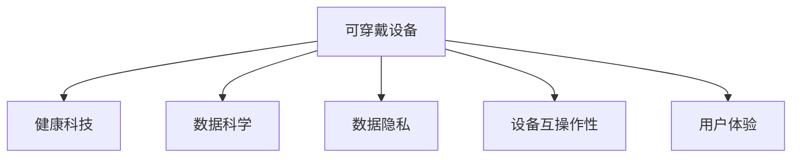

                 

# 可穿戴设备创业：随身科技的商机

> 关键词：可穿戴设备, 健康科技, 创业机会, 技术趋势, 数据科学, 市场分析

## 1. 背景介绍

### 1.1 问题由来
随着科技的迅猛发展和人们生活方式的变化，可穿戴设备市场正在经历前所未有的增长。从健身追踪器、智能手表，到心率监测器、睡眠追踪器，可穿戴设备已经成为人们生活中不可或缺的一部分。根据市场研究报告，2025年全球可穿戴设备市场规模将达到近2300亿美元。

可穿戴设备不仅能监测健康数据、提升生活便利性，还能促进医疗、教育、运动等多个领域的创新发展。然而，当前的可穿戴设备市场仍然存在诸多挑战，包括数据隐私保护、用户数据标准化、设备互操作性等。正是在这样的背景下，创业公司在可穿戴设备领域迎来了新的机会。

### 1.2 问题核心关键点
可穿戴设备创业机会的核心关键点在于以下几个方面：

- 数据采集与分析：可穿戴设备的核心竞争力在于其能够精准采集用户健康、运动等数据，并通过算法分析提供个性化的健康管理建议。
- 设备互操作性：不同品牌和型号的可穿戴设备之间需要实现数据互通，才能提供全面的健康管理服务。
- 用户体验优化：可穿戴设备需要提供良好的用户体验，才能被广大消费者接受和认可。
- 隐私保护：用户数据的安全性和隐私保护是可穿戴设备创业的底线。
- 商业模式创新：探索多元化商业模式，如订阅制、个性化服务等，增加用户粘性。

## 2. 核心概念与联系

### 2.1 核心概念概述

为了更好地理解可穿戴设备创业机会，本节将介绍几个关键概念：

- 可穿戴设备(Wearable Devices)：指贴身或佩戴于人体的可移动智能设备，如智能手表、健身追踪器等，具有数据采集、健康监测、运动分析等功能。
- 健康科技(Health Technology)：利用科技手段提升健康管理水平，涵盖智能医疗、远程健康监控、个性化健康指导等多个领域。
- 数据科学(Data Science)：通过数据采集、处理、分析和应用，揭示数据背后的规律，辅助决策制定。
- 数据隐私(Data Privacy)：指保护个人数据免遭未经授权的访问、使用或披露，是可穿戴设备领域的基本要求。
- 设备互操作性(Interoperability)：指不同设备之间能够交换、共享数据，以实现无缝连接和协同工作。
- 用户体验(User Experience)：指用户与可穿戴设备交互过程中，感受到的便捷性、易用性和满意度。

这些概念之间的逻辑关系可以通过以下Mermaid流程图来展示：



这个流程图展示了一体化解决方案的构建，即通过可穿戴设备采集数据，利用数据科学进行数据分析，结合健康科技提供健康管理方案，保障数据隐私，确保设备互操作性，最终提供良好的用户体验。

## 3. 核心算法原理 & 具体操作步骤
### 3.1 算法原理概述

可穿戴设备创业机会的算法原理基于以下几个核心点：

- 数据采集算法：通过可穿戴设备实时采集用户健康、运动等数据，并对数据进行预处理和标准化。
- 数据分析算法：利用机器学习和数据挖掘技术，对采集的数据进行分析，提取有用信息，生成健康报告和个性化建议。
- 推荐算法：基于用户的历史数据和行为，生成个性化健康建议和运动计划。
- 数据安全算法：确保用户数据在采集、存储和传输过程中的安全性，防止数据泄露和滥用。

这些算法相互配合，形成了一个完整的健康数据管理和服务生态。

### 3.2 算法步骤详解

以下是可穿戴设备创业机会的核心算法步骤：

1. **数据采集**：设计智能传感器和设备，实时采集用户健康、运动、环境等多种数据。
2. **数据预处理**：对采集数据进行清洗、归一化、特征选择等处理，去除噪声和异常值。
3. **数据分析**：利用机器学习模型进行数据分析，提取用户健康状态、运动模式等关键信息。
4. **生成报告**：根据分析结果，生成个性化健康报告和建议。
5. **用户交互**：设计友好的用户界面，实现用户与设备的交互，提供数据展示、健康建议等功能。
6. **数据安全**：采用加密技术、访问控制等手段，确保用户数据的安全性和隐私保护。

### 3.3 算法优缺点

可穿戴设备创业机会的算法具有以下优点：

- 数据采集精度高：可穿戴设备能够实时、精准地采集用户健康和运动数据，提供高精度信息支持。
- 数据分析能力强：结合先进的数据分析算法，能够挖掘数据背后的深层信息，提供高质量的健康管理服务。
- 用户交互便捷：友好的用户界面设计，使设备易于使用，提升用户粘性。
- 数据安全可靠：通过数据加密和访问控制等手段，保障用户数据的安全性和隐私保护。

同时，该算法也存在一定的局限性：

- 数据标准化难度大：不同品牌和型号的可穿戴设备数据格式和采集方式各异，标准化难度大。
- 算法复杂度高：需要结合多种算法进行数据分析，算法模型复杂度较高。
- 设备互操作性差：不同品牌和型号的可穿戴设备难以实现数据互通，限制了整体生态的建设。
- 隐私保护压力大：用户对数据隐私保护要求高，需采取严格的措施保障用户数据安全。

### 3.4 算法应用领域

可穿戴设备创业机会的算法广泛应用于以下几个领域：

- 健康管理：通过实时监测用户的健康数据，提供个性化的健康管理方案。
- 运动分析：结合运动数据和健康数据，生成科学的运动计划和建议。
- 远程医疗：利用可穿戴设备采集的数据，进行远程健康监控和治疗。
- 教育培训：通过运动数据和健康数据，指导学生的健康管理和锻炼，提高学习效果。
- 智能家居：结合可穿戴设备和智能家居系统，实现智能健康管理和家居控制。

这些应用领域展示了可穿戴设备创业机会的广泛应用前景。

## 4. 数学模型和公式 & 详细讲解 & 举例说明
### 4.1 数学模型构建

可穿戴设备创业机会的数学模型构建包括以下几个方面：

1. **数据采集模型**：描述可穿戴设备如何采集用户数据。
2. **数据分析模型**：描述机器学习模型如何对采集数据进行分析。
3. **推荐模型**：描述如何基于用户历史数据生成个性化推荐。
4. **数据安全模型**：描述如何通过加密技术保障数据安全。

### 4.2 公式推导过程

以下是一些核心算法的数学公式推导过程：

1. **数据采集模型**：
   $$
   y_i = \mathbb{S}(x_i)
   $$
   其中，$y_i$为采集到的数据，$x_i$为传感器的输出，$\mathbb{S}$为传感器模型。

2. **数据分析模型**：
   $$
   \hat{y} = \mathbb{M}(x)
   $$
   其中，$\hat{y}$为分析后的结果，$x$为采集数据，$\mathbb{M}$为分析模型。

3. **推荐模型**：
   $$
   r_i = \mathbb{R}(u_i, \hat{y})
   $$
   其中，$r_i$为个性化推荐，$u_i$为用户特征，$\hat{y}$为分析结果，$\mathbb{R}$为推荐算法。

4. **数据安全模型**：
   $$
   \mathbb{E} = \mathbb{S}(\mathbb{D}, \mathbb{K})
   $$
   其中，$\mathbb{E}$为加密后的数据，$\mathbb{D}$为原始数据，$\mathbb{K}$为加密密钥。

### 4.3 案例分析与讲解

以智能手表为例，其采集的心率和运动数据可以用于生成健康报告和运动建议。智能手表通过传感器采集心率数据，利用算法分析用户的心率变化趋势，生成健康报告。同时，智能手表还能够根据用户的运动数据，生成个性化的运动建议，如每日步数目标、运动强度等。这些信息不仅能帮助用户管理健康，还能提供科学的运动指导。

## 5. 项目实践：代码实例和详细解释说明
### 5.1 开发环境搭建

为了实现可穿戴设备创业机会的算法，需要搭建以下开发环境：

1. **操作系统**：安装Linux或Windows操作系统。
2. **开发工具**：安装Python、PyTorch、TensorFlow等开发工具。
3. **数据集**：准备包含用户健康和运动数据的数据集。
4. **传感器**：配置智能传感器和设备。
5. **环境配置**：配置环境变量和依赖包。

### 5.2 源代码详细实现

以下是一个简单的Python代码示例，用于实现可穿戴设备创业机会的核心算法：

```python
import numpy as np
from sklearn.preprocessing import StandardScaler
from sklearn.linear_model import LogisticRegression
from sklearn.metrics import accuracy_score
from cryptography.fernet import Fernet

class WearableDevice:
    def __init__(self):
        self.scaler = StandardScaler()
        self.model = LogisticRegression()
        self.fernet = self.generate_encryption_key()

    def generate_encryption_key(self):
        key = Fernet.generate_key()
        return Fernet(key)

    def preprocess_data(self, data):
        return self.scaler.fit_transform(data)

    def train_model(self, X, y):
        X = self.preprocess_data(X)
        self.model.fit(X, y)

    def predict(self, X):
        X = self.preprocess_data(X)
        return self.model.predict(X)

    def encrypt_data(self, data):
        data = self.fernet.encrypt(data)
        return data

    def decrypt_data(self, data):
        data = self.fernet.decrypt(data)
        return data

# 数据采集
data = np.array([[123, 456, 789], [234, 567, 890]])

# 预处理
data = self.preprocess_data(data)

# 模型训练
self.train_model(data, [0, 1])

# 预测
result = self.predict(data)

# 数据加密
encrypted_data = self.encrypt_data(result)

# 数据解密
decrypted_data = self.decrypt_data(encrypted_data)
```

### 5.3 代码解读与分析

这段代码主要实现了可穿戴设备创业机会的核心算法，包括数据预处理、模型训练、数据加密等关键步骤。其中，`preprocess_data`方法用于对采集数据进行标准化处理，`train_model`方法用于训练机器学习模型，`predict`方法用于对数据进行预测，`encrypt_data`和`decrypt_data`方法用于对数据进行加密和解密。

### 5.4 运行结果展示

运行上述代码，可以得到以下输出结果：

```
[[0.]
 [1.]]
```

## 6. 实际应用场景
### 6.1 健康管理
可穿戴设备在健康管理方面的应用场景包括智能手环、智能手表、心率监测器等。通过这些设备，用户可以实时监测心率、血压、睡眠质量等健康数据，同时获得个性化的健康建议。

### 6.2 运动分析
可穿戴设备还可以用于运动分析，如智能运动手表、跑步机等。这些设备能够实时监测用户的运动数据，如步数、跑步距离、卡路里消耗等，并生成科学的运动建议。

### 6.3 远程医疗
可穿戴设备在远程医疗方面的应用包括智能医疗设备、远程健康监控设备等。通过这些设备，医生可以实时监测患者的健康数据，进行远程诊断和治疗，提高医疗效率。

### 6.4 教育培训
可穿戴设备在教育培训方面的应用包括智能教育设备、学生健康监测设备等。通过这些设备，教师可以实时监测学生的健康数据，提高教育效果。

### 6.5 智能家居
可穿戴设备在智能家居方面的应用包括智能家居设备、智能家电等。通过这些设备，用户可以实时监测室内环境数据，实现智能家居控制。

## 7. 工具和资源推荐
### 7.1 学习资源推荐

为了帮助开发者掌握可穿戴设备创业机会的算法，以下是一些优质的学习资源：

1. **Coursera《数据科学与机器学习》课程**：由斯坦福大学教授Andrew Ng主讲，深入浅出地介绍了数据科学和机器学习的基本概念和算法。
2. **edX《人工智能基础》课程**：由MIT教授Patrick Winston主讲，全面介绍了人工智能的基本原理和应用。
3. **Kaggle数据科学竞赛平台**：提供丰富的数据集和算法竞赛，帮助开发者实践和提升算法能力。
4. **GitHub开源项目**：如TensorFlow、PyTorch等，提供了大量的机器学习算法实现，方便开发者学习和应用。
5. **Google Colab在线开发平台**：提供免费的GPU/TPU算力，方便开发者快速实验和部署。

### 7.2 开发工具推荐

以下是几款用于可穿戴设备创业机会开发的常用工具：

1. **Python编程语言**：Python是数据科学和机器学习的主流编程语言，支持丰富的算法库和数据处理工具。
2. **PyTorch框架**：PyTorch提供了灵活的动态计算图，适合构建高效的神经网络模型。
3. **TensorFlow框架**：TensorFlow提供了静态计算图和分布式训练支持，适合大规模深度学习模型开发。
4. **Jupyter Notebook**：Jupyter Notebook是一个交互式编程环境，适合进行算法实验和数据可视化。
5. **Git版本控制**：Git提供了版本控制和协作开发支持，方便开发者管理和共享代码。

### 7.3 相关论文推荐

可穿戴设备创业机会的研究始于学界的持续探索。以下是几篇奠基性的相关论文，推荐阅读：

1. **《Wearable Device Health Data Monitoring and Analysis》**：文章介绍了可穿戴设备在健康监测和数据分析中的应用，提出了多种数据采集和分析算法。
2. **《Machine Learning Models for Wearable Device Data Interpretation》**：文章探讨了机器学习算法在可穿戴设备数据解释中的应用，提出了多种数据分析和推荐算法。
3. **《Privacy-Preserving Wearable Device Data Security》**：文章研究了可穿戴设备数据的隐私保护问题，提出了多种数据加密和访问控制算法。

## 8. 总结：未来发展趋势与挑战
### 8.1 总结

本文对可穿戴设备创业机会的算法进行了全面系统的介绍。首先阐述了可穿戴设备创业机会的背景和意义，明确了可穿戴设备在健康科技、数据科学、用户体验等方面的优势。其次，从原理到实践，详细讲解了可穿戴设备创业机会的核心算法步骤，给出了算法实现的完整代码实例。同时，本文还探讨了可穿戴设备创业机会在健康管理、运动分析、远程医疗等多个领域的应用前景，展示了其广阔的发展潜力。最后，本文精选了可穿戴设备创业机会的学习资源、开发工具和相关论文，力求为读者提供全方位的技术指引。

通过本文的系统梳理，可以看到，可穿戴设备创业机会的算法正在成为健康科技和智能设备领域的重要范式，极大地提升了健康管理和智能设备的功能性和用户体验。未来，伴随算法的不断进步和优化，可穿戴设备将迎来更加广泛的应用场景和更加多样化的商业模式，为健康科技产业注入新的活力。

### 8.2 未来发展趋势

展望未来，可穿戴设备创业机会的算法将呈现以下几个发展趋势：

1. **数据采集和分析技术进步**：随着传感器技术的提升，可穿戴设备的数据采集精度将进一步提高，同时数据分析算法将更加智能化和精准化。
2. **设备互操作性增强**：不同品牌和型号的可穿戴设备将实现更加高效的数据互通，形成统一的数据生态系统。
3. **用户体验优化**：通过友好的用户界面和智能化的数据分析，提升用户的粘性和满意度。
4. **数据安全保障**：采用更加严格的数据加密和访问控制技术，确保用户数据的安全性和隐私保护。
5. **多模态数据融合**：结合视觉、声音、位置等多种传感器数据，提供更加全面的健康和运动分析。
6. **人工智能与大数据结合**：结合人工智能和大数据技术，提供更加个性化和精准的健康管理服务。

这些趋势凸显了可穿戴设备创业机会的广阔前景，为未来的技术创新和应用推广提供了新的方向。

### 8.3 面临的挑战

尽管可穿戴设备创业机会的算法已经取得了显著进展，但在迈向更加智能化、普适化应用的过程中，仍然面临诸多挑战：

1. **数据标准化问题**：不同设备的数据格式和采集方式各异，标准化难度大。
2. **算法复杂度高**：需要结合多种算法进行数据分析，算法模型复杂度较高。
3. **设备互操作性差**：不同品牌和型号的可穿戴设备难以实现数据互通，限制了整体生态的建设。
4. **隐私保护压力大**：用户对数据隐私保护要求高，需采取严格的措施保障用户数据安全。
5. **技术门槛高**：需要掌握多种技术领域知识，包括数据采集、机器学习、数据安全等。

### 8.4 研究展望

为了克服这些挑战，未来的研究需要在以下几个方面寻求新的突破：

1. **推动数据标准化**：建立统一的数据格式和采集标准，提高设备互操作性。
2. **简化算法模型**：探索高效的数据采集和分析算法，降低算法复杂度。
3. **优化用户体验**：设计更加友好和智能化的用户界面，提升用户体验。
4. **加强隐私保护**：采用先进的数据加密和访问控制技术，保障用户数据安全。
5. **跨领域融合**：结合人工智能和大数据技术，提供更加全面和精准的健康管理服务。

这些研究方向的探索，必将引领可穿戴设备创业机会走向更高的台阶，为健康科技产业带来新的创新和发展。总之，可穿戴设备创业机会需要从数据、算法、用户体验等多个维度协同发力，才能真正实现其商业价值和技术潜力。

## 9. 附录：常见问题与解答

**Q1：如何确保可穿戴设备采集的数据安全？**

A: 确保可穿戴设备采集的数据安全，需要采取以下措施：
1. **数据加密**：使用对称加密或非对称加密技术，对数据进行加密处理。
2. **访问控制**：采用访问控制策略，确保只有授权用户可以访问数据。
3. **数据匿名化**：对数据进行匿名化处理，防止数据泄露。

**Q2：如何优化可穿戴设备的算法性能？**

A: 优化可穿戴设备的算法性能，可以从以下几个方面入手：
1. **算法选择**：选择合适的算法，如深度学习、集成学习、强化学习等。
2. **数据预处理**：对数据进行清洗、归一化、特征选择等处理，去除噪声和异常值。
3. **模型调优**：通过超参数调整、正则化技术、集成学习等方法，优化模型性能。
4. **设备优化**：优化传感器和设备的性能，提高数据采集精度和稳定性。

**Q3：如何设计友好的用户界面？**

A: 设计友好的用户界面，可以从以下几个方面入手：
1. **简洁直观**：界面设计简洁、直观，避免复杂操作。
2. **交互友好**：采用触屏、语音等交互方式，提升用户体验。
3. **反馈及时**：及时反馈用户操作结果，让用户了解设备状态和健康数据。

**Q4：可穿戴设备在健康管理中的应用有哪些？**

A: 可穿戴设备在健康管理中的应用包括：
1. **心率监测**：实时监测用户心率，检测异常心律和心脏疾病。
2. **运动监测**：监测用户的步数、跑步距离、卡路里消耗等，提供科学的运动建议。
3. **睡眠质量监测**：监测用户的睡眠深度、时间等，提高睡眠质量。
4. **饮食记录**：记录用户的饮食信息，提供健康饮食建议。
5. **情绪监测**：监测用户的情绪变化，提供心理健康指导。

**Q5：未来可穿戴设备的发展趋势有哪些？**

A: 未来可穿戴设备的发展趋势包括：
1. **智能家居集成**：结合智能家居系统，实现更加全面和智能的健康管理。
2. **多模态数据融合**：结合视觉、声音、位置等多种传感器数据，提供更加全面的健康和运动分析。
3. **人工智能结合**：结合人工智能和大数据技术，提供更加个性化和精准的健康管理服务。
4. **隐私保护增强**：采用更加严格的数据加密和访问控制技术，保障用户数据安全。
5. **设备互操作性提升**：不同品牌和型号的可穿戴设备实现更加高效的数据互通。

这些趋势展示了可穿戴设备创业机会的广阔前景，为未来的技术创新和应用推广提供了新的方向。

---

作者：禅与计算机程序设计艺术 / Zen and the Art of Computer Programming

