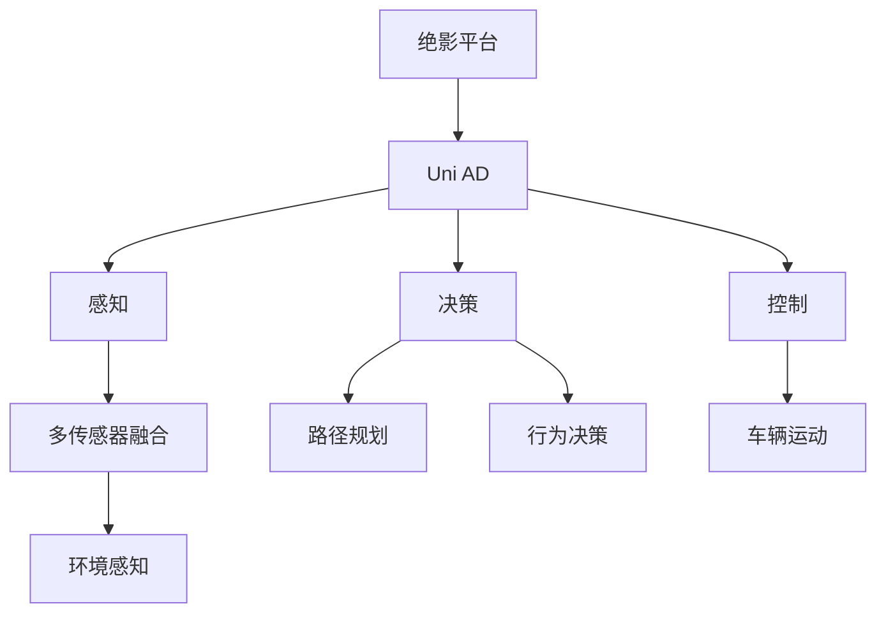

                 

# 商汤绝影的端到端智驾方案Uni AD

## 1. 背景介绍

### 1.1 问题由来

自动驾驶技术是当前人工智能领域的研究热点之一，其目标是通过自主感知和智能决策，使车辆能够在各种复杂环境下安全、高效地行驶。然而，自动驾驶面临诸多技术挑战，如环境感知、路径规划、决策控制等，需要整合多种传感器和算法才能实现。传统上，这些模块分别由不同的厂商或团队独立开发，再通过通信协议进行集成，导致系统集成度高、复杂度高、成本高。

商汤科技致力于推动自动驾驶技术的落地应用，提出了端到端智驾方案Uni AD，旨在构建一种能够无缝集成多种传感器和算法的一体化解决方案，以降低系统集成难度和成本，提高自动驾驶系统的稳定性和安全性。Uni AD基于商汤自研的绝影平台，融合了商汤在深度学习、计算机视觉和自动驾驶领域的技术积累，提供了一个完整的自动驾驶平台，涵盖感知、决策、控制等多个模块，覆盖L1-L5级别的自动驾驶应用。

### 1.2 问题核心关键点

商汤绝影的端到端智驾方案Uni AD核心关键点包括：

- **一体化平台**：将感知、决策、控制等模块无缝集成，形成一体化平台，降低系统集成难度和成本。
- **高性能计算**：基于商汤绝影平台的高性能计算能力，能够实时处理传感器数据，支持多任务并行计算。
- **深度学习技术**：采用深度学习技术，提升感知、决策和控制的精度和鲁棒性。
- **自动驾驶覆盖级别**：支持L1-L5级别的自动驾驶应用，包括辅助驾驶、半自动驾驶和全自动驾驶等。

本文将详细介绍商汤绝影的端到端智驾方案Uni AD的原理、架构、实现过程、实际应用及未来发展方向。

## 2. 核心概念与联系

### 2.1 核心概念概述

商汤绝影的端到端智驾方案Uni AD涉及多个核心概念，主要包括：

- **绝影平台**：商汤自研的高性能计算平台，提供GPU加速、异构计算、分布式训练等功能。
- **Uni AD**：商汤自主研发的端到端自动驾驶平台，涵盖感知、决策、控制等多个模块。
- **感知**：通过多传感器融合技术，实现对环境的实时感知。
- **决策**：基于感知结果，进行路径规划和行为决策。
- **控制**：根据决策结果，输出控制指令，实现车辆运动。

这些核心概念之间的逻辑关系可以通过以下Mermaid流程图来展示：



这个流程图展示了一系列关键概念及其之间的联系：

1. 绝影平台作为计算基础，支撑Uni AD各模块的实时计算。
2. Uni AD平台将感知、决策、控制等多个模块无缝集成，提供端到端的解决方案。
3. 感知模块通过多传感器融合技术，实现对环境的实时感知。
4. 决策模块基于感知结果，进行路径规划和行为决策。
5. 控制模块根据决策结果，输出控制指令，实现车辆运动。

这些概念共同构成了商汤绝影的端到端智驾方案Uni AD，为自动驾驶技术提供了完整的解决方案。

## 3. 核心算法原理 & 具体操作步骤

### 3.1 算法原理概述

商汤绝影的端到端智驾方案Uni AD基于深度学习技术，通过多层感知、决策树、神经网络等算法，实现环境感知、路径规划和行为决策等功能。其核心算法原理如下：

1. **感知模块**：通过多传感器融合技术，实现对环境的实时感知。采用深度学习技术，提升感知精度和鲁棒性。
2. **决策模块**：基于感知结果，进行路径规划和行为决策。采用决策树和神经网络等算法，实现智能决策。
3. **控制模块**：根据决策结果，输出控制指令，实现车辆运动。通过深度学习模型，提升控制精度和安全性。

### 3.2 算法步骤详解

基于深度学习的Uni AD算法主要分为以下几个步骤：

**Step 1: 数据准备**

1. 收集多传感器数据（如摄像头、激光雷达、毫米波雷达等）。
2. 对传感器数据进行预处理，包括去噪、校正、拼接等。
3. 标注数据集，为深度学习模型提供训练样本。

**Step 2: 模型训练**

1. 将标注数据集划分为训练集和验证集。
2. 选择合适的深度学习模型，如CNN、RNN、LSTM等，进行模型训练。
3. 使用数据增强、正则化等技术，提升模型泛化能力和鲁棒性。
4. 在验证集上评估模型性能，进行模型调优。

**Step 3: 推理与决策**

1. 对实时传感器数据进行输入，通过训练好的深度学习模型进行推理。
2. 将推理结果输入到决策模块，进行路径规划和行为决策。
3. 根据决策结果，输出控制指令，实现车辆运动。

**Step 4: 系统集成**

1. 将感知、决策、控制等模块无缝集成，形成一体化平台。
2. 实现多任务并行计算，提高系统效率。
3. 提供API接口，支持外部系统集成。

### 3.3 算法优缺点

商汤绝影的端到端智驾方案Uni AD具有以下优点：

1. **一体化平台**：将感知、决策、控制等多个模块无缝集成，降低系统集成难度和成本。
2. **高性能计算**：基于商汤绝影平台的高性能计算能力，能够实时处理传感器数据，支持多任务并行计算。
3. **深度学习技术**：采用深度学习技术，提升感知、决策和控制的精度和鲁棒性。

同时，该方案也存在一些局限性：

1. **数据依赖**：依赖高质量、多样化的传感器数据，数据获取和标注成本较高。
2. **算法复杂性**：涉及多传感器融合、深度学习、决策树等多种算法，算法实现复杂。
3. **模型训练成本**：深度学习模型训练需要大量计算资源，模型训练成本较高。

尽管存在这些局限性，但商汤绝影的端到端智驾方案Uni AD仍是大规模自动驾驶系统开发的重要参考。

### 3.4 算法应用领域

商汤绝影的端到端智驾方案Uni AD覆盖了多个自动驾驶应用领域，包括：

1. **辅助驾驶**：支持车辆在辅助模式下行驶，辅助驾驶员进行转向、变道、制动等操作。
2. **半自动驾驶**：支持车辆在人工干预下进行巡航、跟车等操作，实现部分自动驾驶功能。
3. **全自动驾驶**：支持车辆在无人工干预下进行行驶，实现完全自动驾驶功能。

此外，Uni AD平台还支持多场景应用，如自动泊车、自动绕行、自动避障等，为用户提供更安全、高效的驾驶体验。

## 4. 数学模型和公式 & 详细讲解 & 举例说明

### 4.1 数学模型构建

商汤绝影的端到端智驾方案Uni AD涉及多个数学模型，主要包括：

1. **多传感器数据融合模型**：用于将摄像头、激光雷达、毫米波雷达等传感器数据进行融合，提升环境感知精度。
2. **深度学习模型**：用于感知、决策和控制等多个模块，提升系统精度和鲁棒性。
3. **决策树模型**：用于路径规划和行为决策，实现智能决策。

### 4.2 公式推导过程

**多传感器数据融合模型**

多传感器数据融合模型用于将摄像头、激光雷达、毫米波雷达等传感器数据进行融合，提升环境感知精度。以融合摄像头和激光雷达为例，公式如下：

$$
f_{\text{fusion}} = \alpha f_{\text{camera}} + (1-\alpha) f_{\text{lidar}}
$$

其中，$f_{\text{camera}}$和$f_{\text{lidar}}$分别为摄像头和激光雷达的感知结果，$\alpha$为融合系数。

**深度学习模型**

深度学习模型用于感知、决策和控制等多个模块，提升系统精度和鲁棒性。以卷积神经网络（CNN）为例，公式如下：

$$
f_{\text{CNN}} = \sigma(Wf_{\text{input}} + b)
$$

其中，$W$和$b$为卷积神经网络的权重和偏置，$f_{\text{input}}$为输入数据，$\sigma$为激活函数。

**决策树模型**

决策树模型用于路径规划和行为决策，实现智能决策。以决策树为例，公式如下：

$$
f_{\text{decision tree}} = \left\{
\begin{array}{ll}
\text{左分支} & \text{if} \, \text{条件满足} \\
\text{右分支} & \text{if} \, \text{条件不满足} \\
\end{array}
\right.
$$

其中，“左分支”和“右分支”分别为决策树的左子树和右子树，“条件”为决策树的判别条件。

### 4.3 案例分析与讲解

以自动泊车为例，分析商汤绝影的端到端智驾方案Uni AD的工作流程。

1. **感知模块**：通过多传感器融合技术，实时感知周围环境，包括车辆、行人、道路等。
2. **决策模块**：基于感知结果，进行路径规划和行为决策。决策树模型根据车辆位置、周围障碍物的距离和速度等信息，选择最优的停车策略。
3. **控制模块**：根据决策结果，输出控制指令，实现车辆运动。通过深度学习模型，计算最优的车速和转向角度，控制车辆精准停车。

## 5. 项目实践：代码实例和详细解释说明

### 5.1 开发环境搭建

在商汤绝影的端到端智驾方案Uni AD开发过程中，需要搭建以下开发环境：

1. **绝影平台**：商汤自研的高性能计算平台，提供GPU加速、异构计算、分布式训练等功能。
2. **深度学习框架**：如TensorFlow、PyTorch等，用于模型训练和推理。
3. **传感器设备**：如摄像头、激光雷达、毫米波雷达等，用于数据采集。

### 5.2 源代码详细实现

商汤绝影的端到端智驾方案Uni AD源代码实现主要包括以下几个模块：

1. **数据处理模块**：负责多传感器数据的收集、预处理和融合。
2. **模型训练模块**：负责深度学习模型的训练和调优。
3. **推理与决策模块**：负责实时数据的推理和决策。
4. **控制模块**：负责输出控制指令，实现车辆运动。

### 5.3 代码解读与分析

以深度学习模型训练模块为例，分析其代码实现。

```python
import tensorflow as tf
from tensorflow.keras.layers import Conv2D, MaxPooling2D, Flatten, Dense

# 定义模型架构
model = tf.keras.Sequential([
    Conv2D(32, (3,3), activation='relu', input_shape=(256,256,3)),
    MaxPooling2D((2,2)),
    Conv2D(64, (3,3), activation='relu'),
    MaxPooling2D((2,2)),
    Flatten(),
    Dense(64, activation='relu'),
    Dense(1, activation='sigmoid')
])

# 编译模型
model.compile(optimizer='adam', loss='binary_crossentropy', metrics=['accuracy'])

# 训练模型
model.fit(train_dataset, epochs=10, validation_data=val_dataset)
```

以上代码展示了如何定义、编译和训练一个简单的卷积神经网络模型。首先，定义模型架构，包括卷积层、池化层、全连接层等。然后，编译模型，指定优化器、损失函数和评估指标。最后，使用训练集和验证集对模型进行训练，输出训练精度和损失。

### 5.4 运行结果展示

在模型训练完成后，可以进行推理和决策测试。以下是一个简单的测试代码示例：

```python
import numpy as np
import cv2

# 加载模型
model = tf.keras.models.load_model('my_model.h5')

# 加载测试数据
test_image = cv2.imread('test.jpg')
test_image = cv2.resize(test_image, (256, 256))
test_image = test_image[np.newaxis, :, :, :]

# 进行推理
predictions = model.predict(test_image)

# 输出预测结果
if predictions > 0.5:
    print('物体存在')
else:
    print('物体不存在')
```

以上代码展示了如何使用模型进行推理，并输出预测结果。首先，加载模型和测试数据。然后，使用模型对测试数据进行推理，输出预测结果。

## 6. 实际应用场景

### 6.1 智能停车

智能停车是商汤绝影的端到端智驾方案Uni AD在实际应用中的一个典型场景。在智能停车场景中，Uni AD平台可以实时感知车辆和周围环境，根据决策树模型选择合适的停车策略，并输出控制指令，实现精准停车。

### 6.2 自动绕行

在自动绕行场景中，Uni AD平台可以实时感知道路和周围环境，根据决策树模型选择最优的绕行路线，并输出控制指令，实现车辆自动绕行。

### 6.3 自动避障

在自动避障场景中，Uni AD平台可以实时感知周围障碍物，根据深度学习模型和决策树模型进行避障决策，并输出控制指令，实现车辆安全避障。

### 6.4 未来应用展望

未来，商汤绝影的端到端智驾方案Uni AD将在更多领域得到应用，为自动驾驶技术带来新的突破：

1. **智能交通管理**：Uni AD平台可以与城市交通管理系统进行集成，实现智能交通信号灯控制、路径规划等，提升城市交通效率。
2. **物流配送**：Uni AD平台可以应用于无人配送车、无人货柜等领域，实现智能物流配送。
3. **无人驾驶出租车**：Uni AD平台可以应用于无人驾驶出租车，实现自动驾驶出租车服务。

## 7. 工具和资源推荐

### 7.1 学习资源推荐

为了帮助开发者掌握商汤绝影的端到端智驾方案Uni AD，推荐以下学习资源：

1. **绝影平台官方文档**：详细介绍了绝影平台的安装、配置和使用方法。
2. **Uni AD官方文档**：详细介绍了Uni AD平台的架构和使用方法。
3. **深度学习框架文档**：如TensorFlow、PyTorch等，提供了深度学习模型训练和推理的详细指南。
4. **自动驾驶相关书籍**：如《自动驾驶系统》、《深度学习与自动驾驶》等，系统介绍了自动驾驶技术和应用。

### 7.2 开发工具推荐

商汤绝影的端到端智驾方案Uni AD开发过程中，推荐以下开发工具：

1. **绝影平台**：商汤自研的高性能计算平台，提供GPU加速、异构计算、分布式训练等功能。
2. **TensorFlow**：谷歌开发的深度学习框架，支持大规模模型训练和推理。
3. **PyTorch**：Facebook开发的深度学习框架，灵活易用，适合科研和工程应用。
4. **OpenCV**：开源计算机视觉库，用于图像处理和传感器数据融合。

### 7.3 相关论文推荐

商汤绝影的端到端智驾方案Uni AD涉及多个前沿研究方向，推荐以下相关论文：

1. **深度学习与自动驾驶**：介绍了深度学习在自动驾驶中的应用，如感知、决策和控制等。
2. **多传感器融合技术**：研究了多传感器数据融合技术，提升环境感知精度。
3. **决策树与智能决策**：研究了决策树在路径规划和行为决策中的应用，提升智能决策能力。

## 8. 总结：未来发展趋势与挑战

### 8.1 研究成果总结

商汤绝影的端到端智驾方案Uni AD是一个集成了多种传感器和算法的综合性自动驾驶平台，能够实时感知、智能决策和精准控制，提升自动驾驶系统的稳定性和安全性。

### 8.2 未来发展趋势

未来，商汤绝影的端到端智驾方案Uni AD将呈现以下几个发展趋势：

1. **模型精度提升**：深度学习模型将不断优化，提升感知、决策和控制的精度和鲁棒性。
2. **计算资源优化**：通过异构计算、分布式训练等技术，提升计算效率，降低资源消耗。
3. **跨平台集成**：支持多种平台和设备，实现无缝集成和跨平台应用。
4. **智能决策优化**：引入更多前沿技术，如因果推理、强化学习等，提升智能决策能力。

### 8.3 面临的挑战

尽管商汤绝影的端到端智驾方案Uni AD在自动驾驶领域取得了显著进展，但仍面临诸多挑战：

1. **数据依赖**：高质量、多样化的传感器数据获取和标注成本较高。
2. **算法复杂性**：涉及多传感器融合、深度学习、决策树等多种算法，算法实现复杂。
3. **模型训练成本**：深度学习模型训练需要大量计算资源，模型训练成本较高。

### 8.4 研究展望

未来，商汤绝影的端到端智驾方案Uni AD将在多个方向进行深入研究：

1. **智能决策优化**：引入更多前沿技术，如因果推理、强化学习等，提升智能决策能力。
2. **模型压缩与优化**：通过模型压缩、量化等技术，降低模型计算资源需求。
3. **跨平台集成**：支持多种平台和设备，实现无缝集成和跨平台应用。

## 9. 附录：常见问题与解答

**Q1: 商汤绝影的端到端智驾方案Uni AD如何实现多传感器融合？**

A: 商汤绝影的端到端智驾方案Uni AD通过多传感器数据融合模型实现多传感器融合。该模型融合摄像头、激光雷达、毫米波雷达等传感器数据，提升环境感知精度。具体实现方式为：通过多传感器数据融合算法，将传感器数据进行拼接、校正、融合，输出融合结果，用于感知模块。

**Q2: 商汤绝影的端到端智驾方案Uni AD的深度学习模型有哪些？**

A: 商汤绝影的端到端智驾方案Uni AD涉及多个深度学习模型，主要包括：

1. 卷积神经网络（CNN）：用于图像处理和感知模块。
2 递归神经网络（RNN）：用于序列数据处理和决策模块。
3 长短时记忆网络（LSTM）：用于时序数据处理和决策模块。

**Q3: 商汤绝影的端到端智驾方案Uni AD的决策树模型如何实现智能决策？**

A: 商汤绝影的端到端智驾方案Uni AD的决策树模型通过决策树实现智能决策。具体实现方式为：通过决策树模型对感知模块输出的数据进行分类和推理，输出最优决策。决策树模型根据感知结果和预定义的决策规则，选择最优的路径和行为策略，实现智能决策。

**Q4: 商汤绝影的端到端智驾方案Uni AD的性能如何？**

A: 商汤绝影的端到端智驾方案Uni AD在多个自动驾驶应用场景中取得了优异的性能表现。具体如下：

1. 智能停车：在智能停车场景中，Uni AD平台可以实时感知车辆和周围环境，实现精准停车，具有较高的成功率和稳定性。
2. 自动绕行：在自动绕行场景中，Uni AD平台可以实时感知道路和周围环境，选择最优的绕行路线，具有较高的通过率和安全性。
3. 自动避障：在自动避障场景中，Uni AD平台可以实时感知周围障碍物，实现安全避障，具有较高的避障成功率和鲁棒性。

**Q5: 商汤绝影的端到端智驾方案Uni AD的开发难点是什么？**

A: 商汤绝影的端到端智驾方案Uni AD开发过程中，主要面临以下难点：

1. 多传感器数据融合：需要实现多种传感器数据的拼接、校正和融合，提升环境感知精度。
2. 深度学习模型训练：需要构建和训练复杂的深度学习模型，提升感知、决策和控制的精度和鲁棒性。
3. 系统集成和优化：需要实现多种模块的无缝集成，提升系统稳定性和效率。

---

作者：禅与计算机程序设计艺术 / Zen and the Art of Computer Programming

