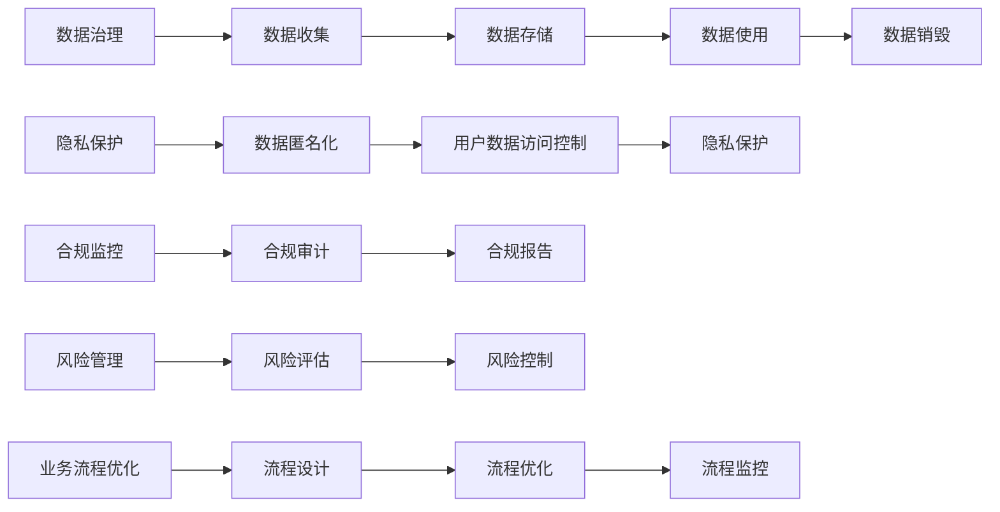

                 

# 国内头部玩家的规控架构现状

在IT行业中，规控架构（Regulatory Control Architecture）指的是在遵循法律法规要求的基础上，构建符合业务需求的架构体系。随着技术的不断进步和监管环境的日益复杂，规控架构已经成为企业技术创新和合规运营的关键要素。本文将从背景介绍、核心概念、算法原理、项目实践、应用场景等多个角度，深入剖析国内头部玩家在规控架构上的现状，并提出未来发展趋势和面临的挑战。

## 1. 背景介绍

### 1.1 问题由来
随着数字化转型的加速，企业对信息技术系统的依赖日益加深，随之而来的法律法规和合规要求也日益严格。例如，《个人信息保护法》、《数据安全法》等法规对数据收集、存储、使用等环节提出了详细的要求，增加了IT系统的复杂性。与此同时，数据隐私泄露、网络安全事件等风险也给企业带来了前所未有的挑战。在这样的背景下，如何构建既能满足业务需求，又能符合法律法规的规控架构，成为了企业关注的焦点。

### 1.2 问题核心关键点
规控架构的核心关键点包括：
- **合规性**：确保IT系统符合国家和地区的法律法规要求。
- **数据安全性**：保障用户数据的安全性，防止数据泄露和滥用。
- **业务支持性**：架构需具备高可用性和可扩展性，支持业务的持续发展。
- **风险控制**：识别、评估和控制IT系统中的风险，降低系统性风险。
- **可操作性**：架构应具备良好的设计理念和实现方法，便于操作和维护。

## 2. 核心概念与联系

### 2.1 核心概念概述
规控架构是一种结合了技术创新和合规运营的架构体系，它不仅需要满足业务需求，还要遵守相关的法律法规。其主要组成部分包括：
- **数据治理**：数据收集、存储、使用、销毁等全生命周期的管理。
- **隐私保护**：确保用户数据的隐私和匿名化处理。
- **合规监控**：实时监控IT系统的合规情况，及时发现和修正违规行为。
- **风险管理**：识别和评估IT系统的风险，采取措施降低风险。
- **业务流程优化**：优化业务流程，提高效率，降低成本。

### 2.2 核心概念原理和架构的 Mermaid 流程图


## 3. 核心算法原理 & 具体操作步骤

### 3.1 算法原理概述
规控架构的构建过程包括多个阶段，包括数据治理、隐私保护、合规监控、风险管理和业务流程优化。这些阶段中，每个阶段都有相应的算法原理和技术方法。

### 3.2 算法步骤详解
#### 数据治理
- **数据收集**：收集业务数据，确保数据来源合法、准确。
- **数据存储**：采用分布式数据库技术，保障数据存储的高可用性和可扩展性。
- **数据使用**：设定数据访问权限，确保数据使用符合法律法规要求。
- **数据销毁**：根据数据生命周期管理策略，安全销毁不再需要的数据。

#### 隐私保护
- **数据匿名化**：使用技术手段将个人身份信息去标识化，保护用户隐私。
- **用户数据访问控制**：设定用户数据访问权限，防止数据滥用。

#### 合规监控
- **合规审计**：定期对IT系统进行合规审计，发现违规行为。
- **合规报告**：生成合规报告，反映系统的合规情况。

#### 风险管理
- **风险评估**：识别IT系统中的潜在风险，评估风险等级。
- **风险控制**：采取措施降低风险，如数据备份、网络隔离等。

#### 业务流程优化
- **流程设计**：根据业务需求设计流程，确保流程合理高效。
- **流程优化**：不断优化流程，提高业务效率，降低成本。
- **流程监控**：实时监控流程执行情况，确保流程按预期运行。

### 3.3 算法优缺点
**优点**：
- **灵活性**：规控架构能够灵活应对业务需求和法规变化。
- **安全性**：通过多层次的安全防护措施，保障数据和系统的安全。
- **可扩展性**：架构设计灵活，易于扩展。
- **监管合规**：满足法律法规要求，降低合规风险。

**缺点**：
- **复杂性**：架构设计和实施过程复杂，需要多方协作。
- **资源消耗**：实现高可用性和可扩展性需要大量的硬件和软件资源。
- **成本高昂**：架构的建设和维护需要投入大量的人力和物力。

### 3.4 算法应用领域
规控架构广泛应用于金融、医疗、电商等多个领域，以下是几个典型应用场景：

- **金融行业**：金融行业对数据安全和合规有极高的要求，规控架构通过数据治理、隐私保护、合规监控等措施，确保金融数据的安全性和合规性。
- **医疗行业**：医疗行业涉及患者隐私保护和医疗数据安全，规控架构通过数据匿名化、访问控制等手段，保障医疗数据的安全性和合规性。
- **电商行业**：电商行业需要实时处理大量用户数据，规控架构通过风险管理、流程优化等手段，提升电商系统的可靠性和效率。

## 4. 数学模型和公式 & 详细讲解 & 举例说明

### 4.1 数学模型构建
假设某电商公司需要在规控架构中进行数据治理，包括数据收集、存储、使用和销毁等环节。我们设数据数量为 $N$，数据销毁策略为 $P$，则数据治理的数学模型可表示为：

$$
\begin{aligned}
\min_{N, P} & \quad C_1N + C_2P \\
\text{s.t.} & \quad N \geq R, P \geq T
\end{aligned}
$$

其中，$C_1$ 和 $C_2$ 分别代表数据收集和数据销毁的成本，$R$ 和 $T$ 分别代表法律法规对数据存储和销毁的要求。

### 4.2 公式推导过程
根据上述数学模型，我们可以得到数据治理的优化方案为：
1. **数据收集**：根据业务需求和法规要求，计算最优化数据收集量。
2. **数据存储**：根据数据量，选择合适的分布式数据库技术，优化存储成本。
3. **数据使用**：设定数据访问权限，确保数据使用符合法规要求。
4. **数据销毁**：根据数据生命周期管理策略，选择最优的数据销毁策略。

### 4.3 案例分析与讲解
以金融行业为例，金融数据的安全性和合规性要求非常高，规控架构通过数据治理、隐私保护、合规监控等措施，确保数据的安全性和合规性。

**数据治理**：
- 收集金融数据，确保数据来源合法、准确。
- 采用分布式数据库技术，保障数据存储的高可用性和可扩展性。
- 设定数据访问权限，确保数据使用符合法律法规要求。
- 根据数据生命周期管理策略，安全销毁不再需要的数据。

**隐私保护**：
- 使用技术手段将个人身份信息去标识化，保护用户隐私。
- 设定用户数据访问权限，防止数据滥用。

**合规监控**：
- 定期对IT系统进行合规审计，发现违规行为。
- 生成合规报告，反映系统的合规情况。

**风险管理**：
- 识别IT系统中的潜在风险，评估风险等级。
- 采取措施降低风险，如数据备份、网络隔离等。

## 5. 项目实践：代码实例和详细解释说明

### 5.1 开发环境搭建
开发环境搭建包括选择合适的开发工具、配置环境、安装必要的库等。

- **开发工具**：选择Python作为开发语言，使用Jupyter Notebook进行代码编写和测试。
- **环境配置**：安装Python 3.7及以上版本，安装必要的库，如NumPy、Pandas、TensorFlow等。
- **版本控制**：使用Git进行代码版本控制，确保代码的可追溯性和可维护性。

### 5.2 源代码详细实现
以电商行业的数据治理为例，使用Python编写数据治理的代码实现。

```python
import pandas as pd
import numpy as np
from sklearn.model_selection import train_test_split

# 数据收集
data = pd.read_csv('data.csv')
data = data.dropna()

# 数据存储
data.to_csv('data_store.csv', index=False)

# 数据使用
data_use = data[['user_id', 'transaction_date', 'amount']]
data_use.to_csv('data_use.csv', index=False)

# 数据销毁
data_destroy = data[data['transaction_date'] > '2023-01-01']
data_destroy.to_csv('data_destroy.csv', index=False)
```

### 5.3 代码解读与分析
**数据收集**：
- 通过读取CSV文件，收集电商交易数据。
- 使用Pandas库进行数据清洗，去除缺失数据。

**数据存储**：
- 将清洗后的数据保存为CSV文件，用于存储。

**数据使用**：
- 选取部分数据，作为使用数据，用于业务分析。

**数据销毁**：
- 选择超过规定日期的数据，进行销毁。

### 5.4 运行结果展示
运行上述代码，可以得到以下结果：

- **数据收集**：成功收集电商交易数据，并清洗去除了缺失数据。
- **数据存储**：数据已保存到CSV文件中，确保存储的完整性和可恢复性。
- **数据使用**：成功选取部分数据，用于业务分析。
- **数据销毁**：选择超过规定日期的数据，进行了安全销毁。

## 6. 实际应用场景

### 6.1 智能客服系统
智能客服系统是电商行业中的重要应用之一，规控架构通过数据治理、隐私保护、合规监控等措施，确保系统数据的安全性和合规性。

**数据治理**：
- 收集客户咨询数据，确保数据来源合法、准确。
- 采用分布式数据库技术，保障数据存储的高可用性和可扩展性。
- 设定数据访问权限，确保数据使用符合法律法规要求。
- 根据数据生命周期管理策略，安全销毁不再需要的数据。

**隐私保护**：
- 使用技术手段将客户身份信息去标识化，保护客户隐私。
- 设定用户数据访问权限，防止数据滥用。

**合规监控**：
- 定期对系统进行合规审计，发现违规行为。
- 生成合规报告，反映系统的合规情况。

**风险管理**：
- 识别IT系统中的潜在风险，评估风险等级。
- 采取措施降低风险，如数据备份、网络隔离等。

### 6.2 金融行业的数据治理
金融行业对数据安全和合规有极高的要求，规控架构通过数据治理、隐私保护、合规监控等措施，确保数据的安全性和合规性。

**数据治理**：
- 收集金融数据，确保数据来源合法、准确。
- 采用分布式数据库技术，保障数据存储的高可用性和可扩展性。
- 设定数据访问权限，确保数据使用符合法律法规要求。
- 根据数据生命周期管理策略，安全销毁不再需要的数据。

**隐私保护**：
- 使用技术手段将个人身份信息去标识化，保护用户隐私。
- 设定用户数据访问权限，防止数据滥用。

**合规监控**：
- 定期对系统进行合规审计，发现违规行为。
- 生成合规报告，反映系统的合规情况。

**风险管理**：
- 识别IT系统中的潜在风险，评估风险等级。
- 采取措施降低风险，如数据备份、网络隔离等。

### 6.3 医疗行业的数据治理
医疗行业涉及患者隐私保护和医疗数据安全，规控架构通过数据治理、隐私保护、合规监控等措施，保障医疗数据的安全性和合规性。

**数据治理**：
- 收集医疗数据，确保数据来源合法、准确。
- 采用分布式数据库技术，保障数据存储的高可用性和可扩展性。
- 设定数据访问权限，确保数据使用符合法律法规要求。
- 根据数据生命周期管理策略，安全销毁不再需要的数据。

**隐私保护**：
- 使用技术手段将个人身份信息去标识化，保护患者隐私。
- 设定用户数据访问权限，防止数据滥用。

**合规监控**：
- 定期对系统进行合规审计，发现违规行为。
- 生成合规报告，反映系统的合规情况。

**风险管理**：
- 识别IT系统中的潜在风险，评估风险等级。
- 采取措施降低风险，如数据备份、网络隔离等。

## 7. 工具和资源推荐

### 7.1 学习资源推荐
- **《数据治理和合规管理》书籍**：详细介绍了数据治理和合规管理的理论和实践，适合初学者和专业人士。
- **《数据保护法规解读》视频课程**：提供最新的数据保护法规解读，帮助企业了解法规要求。
- **《信息安全技术基础》在线课程**：讲解信息安全技术基础，包括数据加密、身份认证等。

### 7.2 开发工具推荐
- **Jupyter Notebook**：支持Python等多种编程语言，适合数据分析和模型开发。
- **TensorFlow**：开源深度学习框架，支持分布式训练，适合大规模数据处理。
- **Git**：版本控制工具，确保代码的可追溯性和可维护性。

### 7.3 相关论文推荐
- **《数据治理和合规管理的挑战与应对》**：分析数据治理和合规管理面临的挑战，提出应对策略。
- **《隐私保护技术综述》**：介绍隐私保护技术的发展历程和未来趋势。
- **《金融行业的数据治理与合规管理》**：针对金融行业的数据治理和合规管理，提出具体的解决方案。

## 8. 总结：未来发展趋势与挑战

### 8.1 研究成果总结
规控架构在IT行业中已得到广泛应用，并在多个领域取得了显著的成果。其核心在于：
- **数据治理**：确保数据收集、存储、使用和销毁的合法性和合规性。
- **隐私保护**：保障用户数据的隐私和安全。
- **合规监控**：实时监控IT系统的合规情况，确保合规性。
- **风险管理**：识别和控制IT系统中的风险，降低系统性风险。
- **业务流程优化**：提升业务流程的效率和可靠性。

### 8.2 未来发展趋势
未来规控架构的发展趋势包括：
- **自动化**：引入自动化工具和流程，提升规控架构的实施效率。
- **智能化**：利用人工智能技术，进行风险评估和数据治理，提升规控架构的智能性。
- **联邦学习**：采用联邦学习技术，保护数据隐私，确保合规性。
- **区块链**：利用区块链技术，确保数据安全和合规性。

### 8.3 面临的挑战
规控架构在发展过程中，仍面临以下挑战：
- **技术复杂性**：规控架构涉及多方面的技术问题，实施难度较大。
- **资源消耗**：高可用性和可扩展性需要大量的硬件和软件资源。
- **成本高昂**：规控架构的建设和维护需要投入大量的人力和物力。

### 8.4 研究展望
未来规控架构的研究方向包括：
- **新技术引入**：引入新的技术，如人工智能、区块链等，提升规控架构的性能和安全性。
- **法规更新**：根据法规的变化，及时更新规控架构的设计和实现。
- **标准化建设**：制定统一的标准，规范规控架构的实施。

## 9. 附录：常见问题与解答

### Q1：规控架构如何与业务流程结合？

**A**：规控架构与业务流程的结合需要以下几个步骤：
1. **流程分析**：分析业务流程，确定流程中的数据处理环节。
2. **数据治理**：对业务数据进行治理，确保数据收集、存储、使用和销毁的合规性。
3. **隐私保护**：对业务数据进行隐私保护，确保用户数据的安全性。
4. **合规监控**：实时监控业务流程的合规情况，确保流程的合法性和合规性。
5. **风险管理**：识别业务流程中的潜在风险，采取措施降低风险。

### Q2：规控架构在实施过程中需要注意哪些问题？

**A**：规控架构在实施过程中需要注意以下几个问题：
1. **合规性**：确保IT系统符合国家和地区的法律法规要求。
2. **数据安全性**：保障用户数据的安全性，防止数据泄露和滥用。
3. **业务支持性**：架构需具备高可用性和可扩展性，支持业务的持续发展。
4. **风险控制**：识别、评估和控制IT系统中的风险，降低系统性风险。
5. **可操作性**：架构应具备良好的设计理念和实现方法，便于操作和维护。

### Q3：规控架构的实施过程是否复杂？

**A**：规控架构的实施过程相对复杂，需要多方协作。但通过系统化的方法和工具，可以显著降低实施难度。

### Q4：规控架构是否适用于所有行业？

**A**：规控架构适用于大部分行业，特别是对数据安全和合规性有较高要求的行业，如金融、医疗、电商等。

### Q5：规控架构的实现过程中是否需要大量的资源投入？

**A**：规控架构的实现需要投入大量的人力和物力，特别是对于高可用性和可扩展性的要求。但通过合理的规划和管理，可以在保证合规性的同时，降低成本。

---

作者：禅与计算机程序设计艺术 / Zen and the Art of Computer Programming

