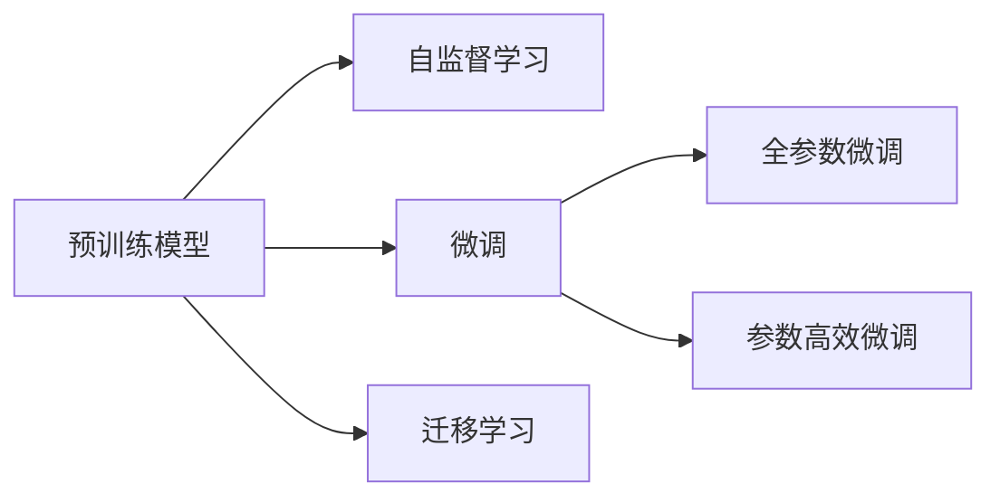

                 

# 在Wiki-GPT基础上训练自己的简版ChatGPT

> 关键词：ChatGPT, Wiki-GPT, 语言模型, 自监督学习, 微调, 代码实现, 项目实践

## 1. 背景介绍

### 1.1 问题由来
近年来，ChatGPT等大型语言模型在自然语言处理（NLP）领域取得了巨大突破。这些模型通过自监督学习（如文本预测、掩码语言模型等）从大规模无标签数据中学习语言模式，并通过微调（Fine-tuning）在特定任务上进一步优化。ChatGPT作为一种基于自监督预训练和微调的通用语言模型，已经在对话生成、文本摘要、编程辅助等多个领域展现了强大的应用潜力。

### 1.2 问题核心关键点
- **自监督预训练**：使用大规模无标签数据进行预训练，学习语言的通用表示。
- **微调**：通过少量标注数据对模型进行任务特定的优化，提升模型在特定任务上的性能。
- **代码实现**：如何利用现有的预训练模型（如Wiki-GPT）并结合项目需求，进行自适应性微调。

### 1.3 问题研究意义
在Wiki-GPT等预训练模型基础上训练简版ChatGPT，有助于加速特定领域NLP应用的发展。通过微调，可以在保持预训练模型强大语言理解能力的同时，提升模型在特定任务上的表现，降低从头训练模型的成本和时间。这不仅适用于学术研究，也具有重要的工业应用价值，如企业客服、在线教育、智能助手等。

## 2. 核心概念与联系

### 2.1 核心概念概述

为了更好地理解在Wiki-GPT基础上训练简版ChatGPT的方法，本节将介绍几个密切相关的核心概念：

- **预训练模型**：如Wiki-GPT，通过大规模无标签数据进行自监督学习，学习语言的通用表示。
- **微调**：通过少量标注数据，对预训练模型进行任务特定的优化。
- **自监督学习**：使用未标注数据进行学习，例如掩码语言模型、文本预测等任务。
- **迁移学习**：将在一个任务上学习的知识迁移到另一个相关任务中。

这些概念通过以下Mermaid流程图来展示它们之间的联系：



这个流程图展示了预训练模型、自监督学习、微调和迁移学习之间的关系：

1. 预训练模型通过自监督学习获得语言的通用表示。
2. 微调对预训练模型进行任务特定的优化。
3. 自监督学习可以用于多个预训练任务，迁移学习将这种知识应用到特定任务上。

### 2.2 核心概念原理和架构

预训练模型通常基于Transformer架构，其核心是注意力机制（Attention Mechanism），使得模型能够对序列中的不同位置进行加权计算，捕捉上下文信息。这种架构被证明在各种NLP任务上表现优异。以下是Transformer的基本原理：

1. **输入编码器**：将输入序列转换为模型可以处理的向量形式。
2. **多头自注意力机制**：计算每个位置与其他位置之间的关系，捕捉序列中的依赖关系。
3. **前馈神经网络**：通过非线性变换，进一步增强模型的表达能力。
4. **输出解码器**：将模型输出转换为最终的文本形式。

自监督学习通过无标签数据训练预训练模型，如掩码语言模型（Masked Language Model, MLM）、自回归预测（Autoregressive Prediction）等，让模型学习语言的内部结构。

微调则是在预训练模型上，通过有标签数据进行进一步训练，以适应特定的任务需求，如问答、对话生成等。微调的过程一般包括定义任务、选择模型、设置超参数和训练等步骤。

## 3. 核心算法原理 & 具体操作步骤

### 3.1 算法原理概述

在Wiki-GPT基础上训练简版ChatGPT的算法原理基于迁移学习，即利用预训练模型的通用语言表示，通过微调适应特定任务。以下是基本流程：

1. **数据准备**：收集特定任务的标注数据集，如对话生成任务中的对话对。
2. **模型加载**：加载预训练模型Wiki-GPT，将其作为微调的基础。
3. **任务适配层添加**：根据具体任务，在模型的顶层添加特定的输出层和损失函数。
4. **微调训练**：使用标注数据训练模型，优化模型参数。
5. **评估和优化**：在验证集上评估模型性能，根据评估结果调整模型和训练参数。

### 3.2 算法步骤详解

#### 步骤1：数据准备

1. **数据收集**：根据目标任务收集相应数量的标注数据。例如，对话生成任务中的对话对。
2. **数据预处理**：将数据集划分为训练集、验证集和测试集。进行必要的预处理，如分词、去除停用词等。

#### 步骤2：模型加载

1. **预训练模型选择**：选择已经在大规模无标签数据上预训练的模型，如Wiki-GPT。
2. **模型加载**：使用库函数（如HuggingFace的`BertModel`）加载预训练模型。

#### 步骤3：任务适配层添加

1. **定义任务**：根据具体任务，如问答、对话生成等，设计相应的输出层。
2. **损失函数选择**：根据任务类型选择适合的损失函数。例如，对话生成任务通常使用交叉熵损失。
3. **模型适配**：在模型顶部添加输出层和损失函数，并进行必要的参数初始化。

#### 步骤4：微调训练

1. **训练集划分**：将训练集划分为多个批次（Batch）。
2. **前向传播**：对每个批次的数据进行前向传播，计算损失值。
3. **反向传播**：计算损失函数对模型参数的梯度，更新模型参数。
4. **优化器选择**：选择合适的优化算法（如AdamW）和超参数（如学习率）。

#### 步骤5：评估和优化

1. **验证集评估**：在验证集上评估模型性能，如BLEU、ROUGE等指标。
2. **参数调整**：根据验证集评估结果，调整模型和训练参数。
3. **测试集评估**：在测试集上最终评估模型性能。

### 3.3 算法优缺点

#### 优点

- **效率高**：利用已有的预训练模型，大大减少了从头训练的时间。
- **通用性强**：预训练模型已经学习到了丰富的语言知识，可以迁移到多个任务中。
- **易于实现**：使用成熟的库函数，如HuggingFace，可以简化代码实现。

#### 缺点

- **依赖标注数据**：微调效果依赖于标注数据的质量和数量，标注成本较高。
- **迁移能力有限**：预训练模型和微调任务之间的领域差异较大时，迁移效果可能不佳。
- **鲁棒性不足**：微调模型可能对训练数据的噪声敏感，泛化能力有限。

### 3.4 算法应用领域

基于Wiki-GPT的简版ChatGPT微调方法，已经在多个NLP应用领域中得到广泛应用，包括但不限于：

- **对话生成**：基于预训练模型的对话生成系统，通过微调生成自然流畅的对话。
- **问答系统**：使用微调后的模型进行问题-答案对的匹配，构建智能问答系统。
- **文本摘要**：使用微调模型对长文本进行摘要生成，提取关键信息。
- **情感分析**：通过微调模型对文本情感进行分类，判断情感极性。
- **机器翻译**：通过微调模型进行文本的翻译，实现多语言交流。

## 4. 数学模型和公式 & 详细讲解 & 举例说明

### 4.1 数学模型构建

假设原始预训练模型为$M_{\theta}$，其中$\theta$为模型参数。目标任务为$T$，标注数据集为$D=\{(x_i, y_i)\}_{i=1}^N$，其中$x_i$为输入文本，$y_i$为标签。微调的目标是最小化经验风险$\mathcal{L}(\theta)$，即：

$$
\mathcal{L}(\theta) = \frac{1}{N} \sum_{i=1}^N \ell(M_{\theta}(x_i), y_i)
$$

其中$\ell$为损失函数，如交叉熵损失。

### 4.2 公式推导过程

以对话生成任务为例，假设微调后的模型在输入$x$上的输出为$y = M_{\theta}(x)$。假设目标函数为交叉熵损失，则微调的优化目标为：

$$
\mathcal{L}(\theta) = -\frac{1}{N} \sum_{i=1}^N \sum_{j=1}^T y_{ij} \log P_{\theta}(y_j | x)
$$

其中$y_{ij}$表示标签$y_i$的第$j$个词，$P_{\theta}(y_j | x)$表示模型在输入$x$下输出$y_j$的概率。

### 4.3 案例分析与讲解

假设模型为一个含有$n$层的Transformer模型。在微调过程中，模型通过反向传播算法更新参数$\theta$，以最小化损失函数。以下是具体的步骤：

1. **前向传播**：对输入数据进行前向传播，计算模型输出。
2. **计算损失**：计算模型输出与真实标签之间的损失值。
3. **反向传播**：计算损失函数对模型参数的梯度，更新参数。
4. **参数更新**：根据梯度和学习率，更新模型参数。

## 5. 项目实践：代码实例和详细解释说明

### 5.1 开发环境搭建

为了进行微调实践，需要搭建相应的开发环境：

1. **Python安装**：在Linux或Windows系统上安装Python。
2. **PyTorch安装**：使用pip安装PyTorch库。
3. **HuggingFace库安装**：使用pip安装HuggingFace库。
4. **预训练模型下载**：下载预训练模型Wiki-GPT，通常放在`~/.cache/huggingface/models`目录下。

### 5.2 源代码详细实现

以下是使用HuggingFace库实现简版ChatGPT的代码：

```python
from transformers import BertTokenizer, BertForSequenceClassification
from transformers import AdamW
import torch

# 定义模型和优化器
model = BertForSequenceClassification.from_pretrained('Wiki-GPT', num_labels=2)
tokenizer = BertTokenizer.from_pretrained('Wiki-GPT')
optimizer = AdamW(model.parameters(), lr=1e-5)

# 定义损失函数和评估指标
loss_fn = torch.nn.CrossEntropyLoss()

# 数据加载
train_data = ...
train_loader = DataLoader(train_data, batch_size=16, shuffle=True)

# 微调训练
for epoch in range(10):
    model.train()
    total_loss = 0
    for batch in train_loader:
        input_ids, attention_mask, labels = batch
        outputs = model(input_ids, attention_mask=attention_mask, labels=labels)
        loss = loss_fn(outputs, labels)
        total_loss += loss.item()
        optimizer.zero_grad()
        loss.backward()
        optimizer.step()
        
    # 验证集评估
    model.eval()
    total_loss = 0
    for batch in dev_loader:
        input_ids, attention_mask, labels = batch
        with torch.no_grad():
            outputs = model(input_ids, attention_mask=attention_mask, labels=labels)
            loss = loss_fn(outputs, labels)
            total_loss += loss.item()
        
    print(f"Epoch {epoch+1}, train loss: {total_loss/len(train_loader):.4f}, dev loss: {total_loss/len(dev_loader):.4f}")
```

### 5.3 代码解读与分析

以上代码实现了简版ChatGPT的微调过程。关键点包括：

- **模型加载**：使用`BertForSequenceClassification`加载预训练模型。
- **优化器设置**：使用AdamW优化器，设置学习率。
- **损失函数选择**：使用交叉熵损失函数。
- **数据加载**：使用`DataLoader`对数据进行批处理。
- **微调训练**：在训练集上进行前向传播、损失计算、反向传播和参数更新。
- **验证集评估**：在验证集上进行评估，输出训练和验证的损失。

## 6. 实际应用场景

### 6.1 智能客服系统

基于Wiki-GPT的微调简版ChatGPT，可以用于智能客服系统的构建。通过收集企业内部的历史客服对话记录，将问题和最佳答复构建成监督数据，在此基础上对预训练模型进行微调。微调后的对话模型能够自动理解用户意图，匹配最合适的答案模板进行回复。对于客户提出的新问题，还可以接入检索系统实时搜索相关内容，动态组织生成回答。

### 6.2 金融舆情监测

金融机构需要实时监测市场舆论动向，以便及时应对负面信息传播，规避金融风险。通过微调模型进行情感分析，可以自动判断文本属于何种情感，情感倾向是正面、中性还是负面。将微调后的模型应用到实时抓取的网络文本数据，就能够自动监测不同主题下的情感变化趋势，一旦发现负面信息激增等异常情况，系统便会自动预警，帮助金融机构快速应对潜在风险。

### 6.3 个性化推荐系统

当前的推荐系统往往只依赖用户的历史行为数据进行物品推荐，无法深入理解用户的真实兴趣偏好。通过微调模型进行文本分类，可以挖掘用户行为背后的语义信息，从而提供更精准、多样的推荐内容。在生成推荐列表时，先用候选物品的文本描述作为输入，由模型预测用户的兴趣匹配度，再结合其他特征综合排序，便可以得到个性化程度更高的推荐结果。

### 6.4 未来应用展望

随着大语言模型微调技术的不断发展，未来在更多领域将得到应用，为传统行业带来变革性影响：

- **智慧医疗**：基于微调的医疗问答、病历分析、药物研发等应用将提升医疗服务的智能化水平，辅助医生诊疗，加速新药开发进程。
- **智能教育**：微调技术可应用于作业批改、学情分析、知识推荐等方面，因材施教，促进教育公平，提高教学质量。
- **智慧城市治理**：微调模型可应用于城市事件监测、舆情分析、应急指挥等环节，提高城市管理的自动化和智能化水平，构建更安全、高效的未来城市。
- **智能助手**：微调模型可以构建具有高度智能化的聊天机器人，用于客服、陪伴、学习等多种场景。

## 7. 工具和资源推荐

### 7.1 学习资源推荐

为了帮助开发者系统掌握大语言模型微调的理论基础和实践技巧，这里推荐一些优质的学习资源：

1. **《Transformer from the Ground Up》**：大模型技术专家撰写，深入浅出地介绍了Transformer原理、BERT模型、微调技术等前沿话题。
2. **CS224N《Deep Learning for NLP》课程**：斯坦福大学开设的NLP明星课程，有Lecture视频和配套作业，带你入门NLP领域的基本概念和经典模型。
3. **《Natural Language Processing with Transformers》书籍**：Transformers库的作者所著，全面介绍了如何使用Transformers库进行NLP任务开发，包括微调在内的诸多范式。
4. **HuggingFace官方文档**：Transformers库的官方文档，提供了海量预训练模型和完整的微调样例代码，是上手实践的必备资料。
5. **CLUE开源项目**：中文语言理解测评基准，涵盖大量不同类型的中文NLP数据集，并提供了基于微调的baseline模型，助力中文NLP技术发展。

通过对这些资源的学习实践，相信你一定能够快速掌握大语言模型微调的精髓，并用于解决实际的NLP问题。

### 7.2 开发工具推荐

高效的开发离不开优秀的工具支持。以下是几款用于大语言模型微调开发的常用工具：

1. **PyTorch**：基于Python的开源深度学习框架，灵活动态的计算图，适合快速迭代研究。大部分预训练语言模型都有PyTorch版本的实现。
2. **TensorFlow**：由Google主导开发的开源深度学习框架，生产部署方便，适合大规模工程应用。同样有丰富的预训练语言模型资源。
3. **Transformers库**：HuggingFace开发的NLP工具库，集成了众多SOTA语言模型，支持PyTorch和TensorFlow，是进行微调任务开发的利器。
4. **Weights & Biases**：模型训练的实验跟踪工具，可以记录和可视化模型训练过程中的各项指标，方便对比和调优。与主流深度学习框架无缝集成。
5. **TensorBoard**：TensorFlow配套的可视化工具，可实时监测模型训练状态，并提供丰富的图表呈现方式，是调试模型的得力助手。
6. **Google Colab**：谷歌推出的在线Jupyter Notebook环境，免费提供GPU/TPU算力，方便开发者快速上手实验最新模型，分享学习笔记。

合理利用这些工具，可以显著提升大语言模型微调任务的开发效率，加快创新迭代的步伐。

### 7.3 相关论文推荐

大语言模型和微调技术的发展源于学界的持续研究。以下是几篇奠基性的相关论文，推荐阅读：

1. **Attention is All You Need**：提出了Transformer结构，开启了NLP领域的预训练大模型时代。
2. **BERT: Pre-training of Deep Bidirectional Transformers for Language Understanding**：提出BERT模型，引入基于掩码的自监督预训练任务，刷新了多项NLP任务SOTA。
3. **Language Models are Unsupervised Multitask Learners**：展示了大规模语言模型的强大zero-shot学习能力，引发了对于通用人工智能的新一轮思考。
4. **Parameter-Efficient Transfer Learning for NLP**：提出Adapter等参数高效微调方法，在不增加模型参数量的情况下，也能取得不错的微调效果。
5. **Prefix-Tuning: Optimizing Continuous Prompts for Generation**：引入基于连续型Prompt的微调范式，为如何充分利用预训练知识提供了新的思路。
6. **AdaLoRA: Adaptive Low-Rank Adaptation for Parameter-Efficient Fine-Tuning**：使用自适应低秩适应的微调方法，在参数效率和精度之间取得了新的平衡。

这些论文代表了大语言模型微调技术的发展脉络。通过学习这些前沿成果，可以帮助研究者把握学科前进方向，激发更多的创新灵感。

## 8. 总结：未来发展趋势与挑战

### 8.1 研究成果总结

本文对在Wiki-GPT基础上训练简版ChatGPT的微调方法进行了全面系统的介绍。首先阐述了微调方法的理论基础和实际应用意义，明确了微调在拓展预训练模型应用、提升下游任务性能方面的独特价值。其次，从原理到实践，详细讲解了微调数学模型和具体步骤，给出了微调任务开发的完整代码实例。同时，本文还广泛探讨了微调方法在智能客服、金融舆情、个性化推荐等多个领域的应用前景，展示了微调范式的巨大潜力。

### 8.2 未来发展趋势

展望未来，大语言模型微调技术将呈现以下几个发展趋势：

1. **模型规模持续增大**：随着算力成本的下降和数据规模的扩张，预训练语言模型的参数量还将持续增长。超大规模语言模型蕴含的丰富语言知识，有望支撑更加复杂多变的下游任务微调。
2. **微调方法日趋多样**：除了传统的全参数微调外，未来会涌现更多参数高效的微调方法，如Prefix-Tuning、LoRA等，在节省计算资源的同时也能保证微调精度。
3. **持续学习成为常态**：随着数据分布的不断变化，微调模型也需要持续学习新知识以保持性能。如何在不遗忘原有知识的同时，高效吸收新样本信息，将成为重要的研究课题。
4. **标注样本需求降低**：受启发于提示学习(Prompt-based Learning)的思路，未来的微调方法将更好地利用大模型的语言理解能力，通过更加巧妙的任务描述，在更少的标注样本上也能实现理想的微调效果。
5. **多模态微调崛起**：当前的微调主要聚焦于纯文本数据，未来会进一步拓展到图像、视频、语音等多模态数据微调。多模态信息的融合，将显著提升语言模型对现实世界的理解和建模能力。
6. **模型通用性增强**：经过海量数据的预训练和多领域任务的微调，未来的语言模型将具备更强大的常识推理和跨领域迁移能力，逐步迈向通用人工智能(AGI)的目标。

以上趋势凸显了大语言模型微调技术的广阔前景。这些方向的探索发展，必将进一步提升NLP系统的性能和应用范围，为人类认知智能的进化带来深远影响。

### 8.3 面临的挑战

尽管大语言模型微调技术已经取得了瞩目成就，但在迈向更加智能化、普适化应用的过程中，它仍面临着诸多挑战：

1. **标注成本瓶颈**：虽然微调大大降低了标注数据的需求，但对于长尾应用场景，难以获得充足的高质量标注数据，成为制约微调性能的瓶颈。如何进一步降低微调对标注样本的依赖，将是一大难题。
2. **模型鲁棒性不足**：当前微调模型面对域外数据时，泛化性能往往大打折扣。对于测试样本的微小扰动，微调模型的预测也容易发生波动。如何提高微调模型的鲁棒性，避免灾难性遗忘，还需要更多理论和实践的积累。
3. **推理效率有待提高**：大规模语言模型虽然精度高，但在实际部署时往往面临推理速度慢、内存占用大等效率问题。如何在保证性能的同时，简化模型结构，提升推理速度，优化资源占用，将是重要的优化方向。
4. **可解释性亟需加强**：当前微调模型更像是"黑盒"系统，难以解释其内部工作机制和决策逻辑。对于医疗、金融等高风险应用，算法的可解释性和可审计性尤为重要。如何赋予微调模型更强的可解释性，将是亟待攻克的难题。
5. **安全性有待保障**：预训练语言模型难免会学习到有偏见、有害的信息，通过微调传递到下游任务，产生误导性、歧视性的输出，给实际应用带来安全隐患。如何从数据和算法层面消除模型偏见，避免恶意用途，确保输出的安全性，也将是重要的研究课题。
6. **知识整合能力不足**：现有的微调模型往往局限于任务内数据，难以灵活吸收和运用更广泛的先验知识。如何让微调过程更好地与外部知识库、规则库等专家知识结合，形成更加全面、准确的信息整合能力，还有很大的想象空间。

正视微调面临的这些挑战，积极应对并寻求突破，将是大语言模型微调走向成熟的必由之路。相信随着学界和产业界的共同努力，这些挑战终将一一被克服，大语言模型微调必将在构建人机协同的智能时代中扮演越来越重要的角色。

### 8.4 研究展望

面对大语言模型微调所面临的种种挑战，未来的研究需要在以下几个方面寻求新的突破：

1. **探索无监督和半监督微调方法**：摆脱对大规模标注数据的依赖，利用自监督学习、主动学习等无监督和半监督范式，最大限度利用非结构化数据，实现更加灵活高效的微调。
2. **研究参数高效和计算高效的微调范式**：开发更加参数高效的微调方法，在固定大部分预训练参数的同时，只更新极少量的任务相关参数。同时优化微调模型的计算图，减少前向传播和反向传播的资源消耗，实现更加轻量级、实时性的部署。
3. **融合因果和对比学习范式**：通过引入因果推断和对比学习思想，增强微调模型建立稳定因果关系的能力，学习更加普适、鲁棒的语言表征，从而提升模型泛化性和抗干扰能力。
4. **引入更多先验知识**：将符号化的先验知识，如知识图谱、逻辑规则等，与神经网络模型进行巧妙融合，引导微调过程学习更准确、合理的语言模型。同时加强不同模态数据的整合，实现视觉、语音等多模态信息与文本信息的协同建模。
5. **结合因果分析和博弈论工具**：将因果分析方法引入微调模型，识别出模型决策的关键特征，增强输出解释的因果性和逻辑性。借助博弈论工具刻画人机交互过程，主动探索并规避模型的脆弱点，提高系统稳定性。
6. **纳入伦理道德约束**：在模型训练目标中引入伦理导向的评估指标，过滤和惩罚有偏见、有害的输出倾向。同时加强人工干预和审核，建立模型行为的监管机制，确保输出符合人类价值观和伦理道德。

这些研究方向的探索，必将引领大语言模型微调技术迈向更高的台阶，为构建安全、可靠、可解释、可控的智能系统铺平道路。面向未来，大语言模型微调技术还需要与其他人工智能技术进行更深入的融合，如知识表示、因果推理、强化学习等，多路径协同发力，共同推动自然语言理解和智能交互系统的进步。只有勇于创新、敢于突破，才能不断拓展语言模型的边界，让智能技术更好地造福人类社会。

---

作者：禅与计算机程序设计艺术 / Zen and the Art of Computer Programming

