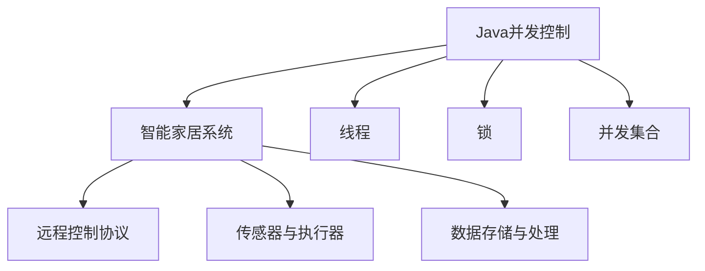

                 

## 1. 背景介绍

### 1.1 问题由来
随着互联网和物联网技术的快速发展，智能家居系统已经成为现代家庭生活的重要组成部分。智能家居系统通过物联网技术将各种家居设备连接在一起，实现远程控制、自动化、智能化等功能，提升了家庭生活的便利性和安全性。Java作为一种高效、稳定的编程语言，以其强大的并发处理能力、丰富的框架库等优势，被广泛应用于智能家居系统的开发和构建中。

### 1.2 问题核心关键点
智能家居系统的开发和构建需要处理大量的并发请求，如远程控制设备的开关、调整温湿度、开启安全报警等。因此，如何在Java中实现高效的并发控制，保障智能家居系统的稳定性和可靠性，是当前开发者的核心问题。本文将围绕Java中的并发控制技术，介绍智能家居应用中常用的并发控制策略和算法，并对其实际应用场景进行深入分析。

### 1.3 问题研究意义
研究Java中的并发控制技术，对于提升智能家居系统的性能、稳定性和安全性具有重要意义：

1. **性能优化**：高效并发控制可以显著提升智能家居系统的响应速度和吞吐量，满足用户对实时性要求。
2. **系统稳定**：合理的并发控制策略可以有效避免数据竞争、死锁等问题，保障系统稳定运行。
3. **用户体验**：良好的并发控制体验可以提升用户对智能家居系统的满意度和使用率。
4. **安全性保障**：并发控制技术可以防止恶意攻击和数据篡改，保障家庭数据和设备的安全。
5. **成本节约**：并发控制技术的优化可以有效降低系统维护和升级成本，延长系统使用寿命。

## 2. 核心概念与联系

### 2.1 核心概念概述

为更好地理解Java中的并发控制技术及其在智能家居中的应用，本节将介绍几个密切相关的核心概念：

- **Java并发控制**：Java通过多种机制和技术，如锁、线程、并发集合等，实现多线程之间的安全协作。
- **智能家居系统**：基于物联网技术，通过各种智能设备和云平台，实现家庭设备的智能化管理。
- **远程控制协议**：如MQTT、HTTP/REST等，用于实现远程设备和云平台之间的数据传输和控制。
- **传感器与执行器**：如温度传感器、湿度传感器、灯光控制器、安全报警器等，用于采集和控制家庭环境。
- **数据存储与处理**：如数据库、大数据分析等，用于存储和管理家庭数据，实现智能分析与决策。

这些核心概念之间的逻辑关系可以通过以下Mermaid流程图来展示：



这个流程图展示了一系列概念之间的关系：

1. Java并发控制技术是智能家居系统开发的基础。
2. 智能家居系统通过远程控制协议、传感器与执行器等组件，实现家庭设备的智能化管理。
3. 数据存储与处理技术用于采集和分析家庭数据，实现智能决策。

## 3. 核心算法原理 & 具体操作步骤

### 3.1 算法原理概述

Java中的并发控制主要通过锁、线程、并发集合等机制来实现。其核心思想是通过同步和异步两种方式，控制多个线程之间的协作，避免数据竞争和死锁问题。在智能家居系统中，并发控制主要应用于设备控制、数据处理、用户交互等方面，确保系统的高效、稳定和安全。

### 3.2 算法步骤详解

#### 3.2.1 锁机制

Java中的锁机制主要包括两种：互斥锁和读写锁。互斥锁用于保护共享资源，确保同一时间只有一个线程访问；读写锁用于读写分离，提高并发性能。在智能家居系统中，锁机制通常用于设备控制、数据存储等场景，保障系统安全。

#### 3.2.2 线程池

Java的线程池技术可以有效管理多个线程，避免线程过多导致的性能下降。在智能家居系统中，线程池通常用于处理网络请求、传感器数据采集等耗时任务，提高系统响应速度。

#### 3.2.3 并发集合

Java的并发集合类（如ConcurrentHashMap、ConcurrentLinkedQueue等）支持多线程并发访问，确保线程安全。在智能家居系统中，并发集合通常用于存储和管理家庭设备的状态、用户信息等数据，提高并发访问效率。

### 3.3 算法优缺点

Java并发控制技术具有以下优点：

1. **线程安全**：Java提供了多种机制和技术，确保多线程之间的安全协作。
2. **高效性能**：锁、线程池、并发集合等技术，提升了Java程序的并发性能。
3. **灵活应用**：Java的并发控制技术可以应用于各种并发场景，满足不同需求。

同时，该技术也存在以下局限性：

1. **锁竞争**：在高并发环境下，锁竞争可能导致性能下降。
2. **死锁风险**：复杂的锁关系可能导致死锁问题，需要仔细设计。
3. **资源消耗**：锁和线程池等机制，会增加系统资源消耗，需要合理配置。
4. **复杂性**：并发控制技术复杂，需要仔细设计和调试，容易出现错误。

### 3.4 算法应用领域

Java并发控制技术在智能家居系统中得到了广泛应用，覆盖了智能家居系统的各个方面，例如：

- **远程控制**：通过锁机制和线程池技术，实现对远程设备的快速、安全控制。
- **传感器数据处理**：使用并发集合和读写锁技术，高效处理传感器数据的采集和存储。
- **用户交互**：采用多线程和并发集合技术，实现流畅、高效的用户界面和交互。
- **数据存储**：通过并发集合和读写锁技术，确保数据存储和处理的安全性和效率。
- **设备状态管理**：使用锁和线程池技术，管理家庭设备的状态，保障系统稳定性。

## 4. 数学模型和公式 & 详细讲解 & 举例说明

### 4.1 数学模型构建

在智能家居系统中，并发控制的核心在于如何有效管理多个线程之间的访问权限，避免数据竞争和死锁问题。常用的数学模型包括：

- **互斥锁模型**：使用互斥锁保护共享资源，确保同一时间只有一个线程访问。
- **读写锁模型**：使用读写锁实现读写分离，提高并发性能。
- **线程池模型**：使用线程池管理线程，确保资源的高效利用。

### 4.2 公式推导过程

#### 4.2.1 互斥锁模型

互斥锁模型使用锁机制确保同一时间只有一个线程访问共享资源。假设有n个线程需要访问共享资源S，每次只允许一个线程访问，互斥锁的实现公式为：

$$
\text{lock(S)} \\
\text{while (S.locked)} \\
\text{wait()} \\
\text{S.locked = true} \\
\text{S.access(S)} \\
\text{S.locked = false} \\
\text{notify()} \\
\text{unlock(S)}
$$

其中，`lock(S)`表示获取锁，`unlock(S)`表示释放锁，`wait()`表示等待锁，`notify()`表示唤醒等待线程。

#### 4.2.2 读写锁模型

读写锁模型使用读写锁实现读写分离，提高并发性能。假设有n个线程需要访问共享资源S，每个线程可以访问次数为r，每次访问时间为t，读锁和写锁的实现公式为：

$$
\text{r_w = read\_wait\_times(S) \\
r_r = read\_release\_times(S) \\
w_t = write\_time(S) \\
w_r = write\_release\_times(S)}
$$

其中，`r_w`表示读等待时间，`r_r`表示读释放时间，`w_t`表示写时间，`w_r`表示写释放时间。

#### 4.2.3 线程池模型

线程池模型使用线程池管理线程，确保资源的高效利用。假设有n个线程需要访问共享资源S，线程池大小为p，每次访问时间为t，线程池的实现公式为：

$$
\text{t\_total = \sum_{i=1}^n t_i \\
p = \text{round(t\_total / t)}
$$

其中，`t_total`表示总访问时间，`p`表示线程池大小。

### 4.3 案例分析与讲解

#### 4.3.1 远程设备控制

在智能家居系统中，远程设备控制是常见的并发场景。假设用户通过HTTP请求控制灯光开关，服务器需要处理多个并发请求，使用互斥锁模型实现线程安全：

```java
public class LightControl {
    private final ReentrantLock lock = new ReentrantLock();
    private boolean isOn = false;
    
    public synchronized void turnOn() {
        lock.lock();
        try {
            if (!isOn) {
                System.out.println("Turning on the light");
                isOn = true;
            }
        } finally {
            lock.unlock();
        }
    }
    
    public synchronized void turnOff() {
        lock.lock();
        try {
            if (isOn) {
                System.out.println("Turning off the light");
                isOn = false;
            }
        } finally {
            lock.unlock();
        }
    }
}
```

#### 4.3.2 传感器数据处理

传感器数据处理是另一个典型的并发场景。假设智能家居系统中，有多个传感器同时采集数据，使用读写锁模型实现并发访问：

```java
public class SensorData {
    private final ReadWriteLock lock = new ReentrantReadWriteLock();
    private Map<String, Double> data = new ConcurrentHashMap<>();
    
    public void addData(String sensorId, double value) {
        lock.readLock().lock();
        try {
            data.put(sensorId, value);
        } finally {
            lock.readLock().unlock();
        }
    }
    
    public void readData(String sensorId) {
        lock.writeLock().lock();
        try {
            double value = data.get(sensorId);
            System.out.println("Sensor " + sensorId + " value: " + value);
        } finally {
            lock.writeLock().unlock();
        }
    }
}
```

#### 4.3.3 用户交互界面

用户交互界面是智能家居系统中最重要的并发场景之一。假设用户可以通过Web界面进行设备控制，使用线程池模型实现高效响应：

```java
public class UserInteraction {
    private final ExecutorService executor = Executors.newFixedThreadPool(10);
    
    public void handleRequest(Request req) {
        executor.submit(() -> {
            // 处理请求
        });
    }
}
```

## 5. 项目实践：代码实例和详细解释说明

### 5.1 开发环境搭建

在进行智能家居系统开发前，我们需要准备好开发环境。以下是使用Java进行智能家居系统开发的开发环境配置流程：

1. 安装Java开发环境（JDK）：从官网下载并安装JDK，并配置系统环境变量。
2. 安装IDE：如IntelliJ IDEA、Eclipse等，用于代码编写和调试。
3. 安装Maven或Gradle：用于管理项目依赖和构建工具。
4. 安装MySQL或PostgreSQL：用于存储和管理家庭数据。
5. 安装MQTT客户端：如 Mosquitto、Eclipse Paho等，用于设备远程控制。

完成上述步骤后，即可在Java环境中开始智能家居系统开发。

### 5.2 源代码详细实现

下面我们以智能家居系统中的设备控制为例，给出Java代码实现。

#### 5.2.1 设备控制类

```java
import java.util.concurrent.locks.ReentrantLock;

public class DeviceControl {
    private final ReentrantLock lock = new ReentrantLock();
    private boolean isOn = false;
    
    public synchronized void turnOn() {
        lock.lock();
        try {
            if (!isOn) {
                System.out.println("Turning on the device");
                isOn = true;
            }
        } finally {
            lock.unlock();
        }
    }
    
    public synchronized void turnOff() {
        lock.lock();
        try {
            if (isOn) {
                System.out.println("Turning off the device");
                isOn = false;
            }
        } finally {
            lock.unlock();
        }
    }
}
```

#### 5.2.2 传感器数据类

```java
import java.util.concurrent.locks.ReentrantReadWriteLock;

public class SensorData {
    private final ReentrantReadWriteLock lock = new ReentrantReadWriteLock();
    private Map<String, Double> data = new ConcurrentHashMap<>();
    
    public void addData(String sensorId, double value) {
        lock.readLock().lock();
        try {
            data.put(sensorId, value);
        } finally {
            lock.readLock().unlock();
        }
    }
    
    public void readData(String sensorId) {
        lock.writeLock().lock();
        try {
            double value = data.get(sensorId);
            System.out.println("Sensor " + sensorId + " value: " + value);
        } finally {
            lock.writeLock().unlock();
        }
    }
}
```

#### 5.2.3 用户交互类

```java
import java.util.concurrent.ExecutorService;
import java.util.concurrent.Executors;

public class UserInteraction {
    private final ExecutorService executor = Executors.newFixedThreadPool(10);
    
    public void handleRequest(Request req) {
        executor.submit(() -> {
            // 处理请求
        });
    }
}
```

### 5.3 代码解读与分析

让我们再详细解读一下关键代码的实现细节：

**DeviceControl类**：
- `lock`对象为ReentrantLock，用于保护设备控制状态。
- `turnOn`和`turnOff`方法使用`synchronized`关键字实现同步，避免多个线程同时操作设备状态。

**SensorData类**：
- `lock`对象为ReentrantReadWriteLock，用于实现读写分离。
- `addData`方法使用`readLock()`获取读锁，`readData`方法使用`writeLock()`获取写锁，确保数据的安全访问。

**UserInteraction类**：
- `executor`对象为固定大小的线程池，用于管理多个并发请求。
- `handleRequest`方法将请求提交到线程池中，确保高效响应。

### 5.4 运行结果展示

通过上述代码实现，我们可以对智能家居系统中的设备控制、传感器数据处理、用户交互等功能进行测试。例如，通过`DeviceControl`类的`turnOn`和`turnOff`方法，可以实现远程设备的开关控制；通过`SensorData`类的`addData`和`readData`方法，可以实现传感器数据的采集和查询；通过`UserInteraction`类的`handleRequest`方法，可以实现高效的用户请求处理。

## 6. 实际应用场景

### 6.1 智能照明系统

智能照明系统是智能家居系统中常见的应用场景之一。假设用户可以通过智能手机APP控制家中的灯光，使用Java并发控制技术可以确保系统的稳定性和安全性：

- **互斥锁机制**：用于保护灯光状态，避免多个用户同时控制同一灯光。
- **线程池技术**：用于处理多个并发请求，提高响应速度。

### 6.2 智能温控系统

智能温控系统通过传感器采集室内外温度，自动调节空调或暖气，实现节能环保。Java并发控制技术可以确保系统的准确性和及时性：

- **读写锁机制**：用于管理传感器数据，实现并发访问。
- **线程池技术**：用于处理传感器数据和设备控制请求，提高系统响应速度。

### 6.3 智能安防系统

智能安防系统通过传感器监测家庭安全状态，触发报警或联动其他设备。Java并发控制技术可以确保系统的可靠性和安全性：

- **互斥锁机制**：用于保护报警数据，避免数据竞争。
- **线程池技术**：用于处理报警请求和联动操作，确保系统稳定运行。

## 7. 工具和资源推荐

### 7.1 学习资源推荐

为了帮助开发者系统掌握Java并发控制技术及其在智能家居中的应用，这里推荐一些优质的学习资源：

1. Java并发编程指南：详细介绍了Java中的锁、线程、并发集合等机制，适合Java初学者和进阶开发者。
2. Java多线程编程实战：通过多个实际案例，展示Java并发控制的实际应用，适合实战型开发者。
3. Java并发编程的艺术：深入探讨Java并发控制的核心原理和实现技术，适合有一定Java编程经验的开发者。
4. Java并发编程实践：提供丰富的Java并发控制案例和代码，适合需要快速上手Java并发控制的开发者。

通过对这些资源的学习实践，相信你一定能够快速掌握Java并发控制技术，并用于解决实际的智能家居问题。

### 7.2 开发工具推荐

高效的开发离不开优秀的工具支持。以下是几款用于智能家居系统开发的常用工具：

1. IntelliJ IDEA：功能强大的Java IDE，支持代码编写、调试和测试。
2. Eclipse：开源的Java IDE，支持插件扩展和定制化开发。
3. GitLab：开源代码托管平台，支持版本控制、项目管理等。
4. Docker：容器化部署平台，支持快速构建和部署Java应用。
5. Jenkins：持续集成和持续部署工具，支持自动化构建和测试。

合理利用这些工具，可以显著提升智能家居系统开发的效率，加快创新迭代的步伐。

### 7.3 相关论文推荐

Java并发控制技术的发展源于学界的持续研究。以下是几篇奠基性的相关论文，推荐阅读：

1. Java并发编程的艺术：探讨Java并发控制的核心原理和实现技术。
2. Java多线程编程实战：通过多个实际案例，展示Java并发控制的实际应用。
3. Java并发编程指南：详细介绍Java中的锁、线程、并发集合等机制。
4. Java并发编程实践：提供丰富的Java并发控制案例和代码。

这些论文代表了大语言模型微调技术的发展脉络。通过学习这些前沿成果，可以帮助研究者把握学科前进方向，激发更多的创新灵感。

## 8. 总结：未来发展趋势与挑战

### 8.1 总结

本文对Java中的并发控制技术及其在智能家居中的应用进行了全面系统的介绍。首先阐述了Java并发控制技术的研究背景和意义，明确了其在智能家居系统开发中的核心作用。其次，从原理到实践，详细讲解了Java并发控制的数学模型和关键步骤，给出了智能家居系统开发的完整代码实例。同时，本文还广泛探讨了Java并发控制技术在智能照明、智能温控、智能安防等实际应用场景中的应用前景，展示了Java并发控制的强大潜力。最后，本文精选了Java并发控制技术的各类学习资源，力求为读者提供全方位的技术指引。

通过本文的系统梳理，可以看到，Java并发控制技术在大规模智能家居系统中发挥了关键作用，显著提升了系统的性能、稳定性和安全性。未来，随着智能家居技术的不断演进，Java并发控制技术还将迎来新的挑战和突破，为构建更加智能、高效、安全的智能家居系统铺平道路。

### 8.2 未来发展趋势

展望未来，Java并发控制技术将呈现以下几个发展趋势：

1. **性能优化**：随着Java虚拟机的不断优化，并发控制技术的性能还将进一步提升。
2. **生态系统扩展**：随着Java生态系统的不断扩展，新的并发控制技术和框架也将不断涌现，丰富Java开发者选择。
3. **多模态融合**：Java并发控制技术将与其他技术（如Kubernetes、Docker等）进行更深入的融合，提升智能家居系统的管理效率。
4. **安全性保障**：随着Java安全技术的不断进步，并发控制技术也将更加注重安全性，防止数据泄露、攻击等问题。
5. **自动化部署**：Java并发控制技术将与云平台、自动化工具等进行深度整合，实现智能家居系统的自动化部署和运维。

这些趋势凸显了Java并发控制技术的广阔前景。这些方向的探索发展，必将进一步提升智能家居系统的性能、稳定性和安全性，为构建安全、可靠、可扩展的智能家居系统铺平道路。

### 8.3 面临的挑战

尽管Java并发控制技术已经取得了瞩目成就，但在迈向更加智能化、普适化应用的过程中，它仍面临着诸多挑战：

1. **并发冲突**：在高并发环境下，锁机制可能导致性能下降，数据竞争风险增加。
2. **资源消耗**：锁和线程池等机制，会增加系统资源消耗，需要合理配置。
3. **可扩展性**：在大规模智能家居系统中，并发控制技术需要具备良好的可扩展性，避免单点故障。
4. **实时性保障**：在实时性要求高的场景中，Java并发控制技术需要进一步优化，确保及时响应。

### 8.4 研究展望

面对Java并发控制技术所面临的挑战，未来的研究需要在以下几个方面寻求新的突破：

1. **优化锁机制**：开发更高效的锁机制，减少锁竞争，提高并发性能。
2. **异步编程**：引入异步编程技术，提升系统响应速度和吞吐量。
3. **模型优化**：设计新的并发控制模型，适应不同的智能家居场景需求。
4. **自动化管理**：实现智能家居系统的自动化管理和运维，提高系统管理效率。
5. **边缘计算**：将并发控制技术引入边缘计算，提升智能家居系统的实时性和可靠性。

这些研究方向的探索，必将引领Java并发控制技术迈向更高的台阶，为构建安全、可靠、可扩展的智能家居系统铺平道路。面向未来，Java并发控制技术还需要与其他人工智能技术进行更深入的融合，如知识表示、因果推理、强化学习等，多路径协同发力，共同推动智能家居技术的进步。只有勇于创新、敢于突破，才能不断拓展智能家居系统的边界，让智能技术更好地造福人类社会。

## 9. 附录：常见问题与解答

**Q1：Java并发控制是否适用于所有智能家居场景？**

A: Java并发控制技术在大多数智能家居场景中都能发挥作用，但需要根据具体情况进行优化。对于某些实时性要求极高的场景，如自动驾驶等，可能需要引入更高级的并发控制技术，如异步编程、分布式锁等。

**Q2：Java并发控制如何实现高并发？**

A: 高并发场景下，Java并发控制通常通过使用锁机制、线程池、读写锁等技术实现。锁机制可以确保同一时间只有一个线程访问共享资源，避免数据竞争；线程池可以高效管理多个线程，避免线程过多导致的性能下降；读写锁可以实现读写分离，提高并发性能。

**Q3：Java并发控制如何避免死锁？**

A: 死锁通常发生在复杂的锁关系中，需要仔细设计。常用的避免死锁的方法包括：避免嵌套锁、使用定时锁、锁超时机制等。同时，设计合理的锁粒度和锁顺序，可以有效降低死锁风险。

**Q4：Java并发控制如何保障系统安全？**

A: 并发控制技术可以通过加锁机制、线程池技术等保障系统安全。同时，定期进行压力测试和负载测试，确保系统在高并发下稳定运行。此外，合理配置锁和线程池的参数，可以有效避免性能瓶颈和资源浪费。

**Q5：Java并发控制如何优化系统性能？**

A: 系统性能优化通常需要综合考虑多个因素。可以使用线程池技术、读写锁机制、异步编程等技术，提高并发性能和响应速度。同时，定期进行系统监控和优化，及时发现和解决性能瓶颈。

通过以上问题解答，相信你能够更好地理解和应用Java并发控制技术，为智能家居系统的开发和构建提供有力支持。

---

作者：禅与计算机程序设计艺术 / Zen and the Art of Computer Programming

