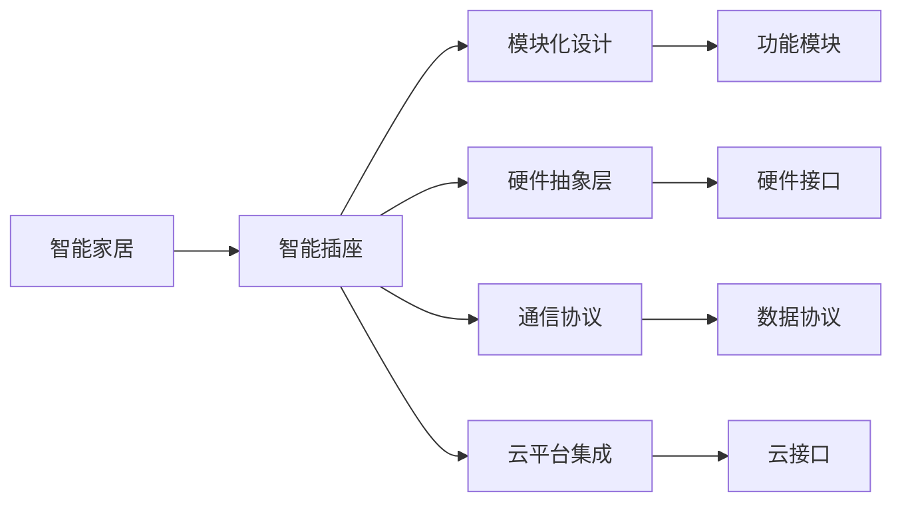

                 

# 基于Java的智能家居设计：模块化智能插座的设计与实现

> 关键词：智能家居, Java, 模块化设计, 智能插座, 嵌入式系统, 物联网(IoT)

## 1. 背景介绍

### 1.1 问题由来

随着科技的飞速发展和人们生活水平的提高，智能家居逐渐成为现代家庭的重要组成部分。智能家居不仅可以提升居住环境的舒适度和便利性，还能实现更高效、更安全的生活管理。其中，智能插座作为智能家居的基础设施之一，扮演着重要的角色。

然而，当前的智能插座产品大多存在功能单一、集成度低、开发难度大等问题。为了克服这些问题，本文提出一种基于Java的模块化智能插座设计方案。这种设计方案通过组件化、标准化、开放化的方式，实现了智能插座的功能扩展、硬件升级和跨平台适配，能够满足不同用户的个性化需求，具有较高的灵活性和可维护性。

### 1.2 问题核心关键点

本节将重点讨论智能插座设计的关键点：

- 功能模块化：将智能插座的功能拆分为可独立开发和集成的模块，以便灵活组合和扩展。
- 硬件抽象层：通过硬件抽象层，将具体硬件平台的差异抽象为标准接口，实现跨平台硬件适配。
- 通信协议：设计统一的通信协议，简化不同组件间的通信，确保数据交互的稳定性和安全性。
- 云平台集成：实现智能插座与云平台的数据同步和远程控制，提升用户体验。

### 1.3 问题研究意义

设计一个灵活、稳定、高效的智能插座，对于推动智能家居的发展具有重要意义：

- 提高居住舒适度：智能插座可以根据用户习惯，自动控制家电设备，提升生活便利性。
- 节能环保：通过智能控制，优化家电使用模式，减少能源浪费，实现节能减排。
- 安全性提升：智能插座可以实现远程监控和报警，及时发现并处理异常情况，保障家庭安全。
- 设备互联互通：通过模块化和标准化设计，实现不同设备间的互联互通，构建完整的智能家居生态。
- 促进产业发展：智能插座作为智能家居的核心组成部分，其技术创新和标准化将推动整个智能家居产业的发展。

## 2. 核心概念与联系

### 2.1 核心概念概述

为了更清晰地理解智能插座的模块化设计，本节将介绍几个关键概念及其之间的联系：

- 智能家居：指通过互联网、物联网等技术手段，实现家居设备的智能化和网络化，提升居住环境的舒适度和安全性。
- 智能插座：一种可远程控制家电设备的智能开关，具备网络通信、数据存储、用户管理等功能。
- 模块化设计：将系统拆分为多个独立模块，每个模块独立开发、集成和升级，以提高系统的灵活性和可维护性。
- 硬件抽象层：通过抽象硬件特性，将具体硬件平台的差异转换为标准接口，实现硬件平台间的无缝集成和扩展。
- 通信协议：定义数据交互的标准格式和协议，简化不同组件间的通信，确保数据传输的稳定性和安全性。
- 云平台集成：实现智能插座与云平台的数据同步和远程控制，提升用户体验和管理效率。

这些概念构成了智能插座模块化设计的核心框架，通过合理的抽象和设计，可以实现高效、稳定、灵活的智能家居解决方案。

### 2.2 核心概念原理和架构的 Mermaid 流程图(Mermaid 流程节点中不要有括号、逗号等特殊字符)



此流程图展示了智能家居、智能插座和其关键组件之间的关系。智能家居是智能插座的宏观背景，而模块化设计、硬件抽象层、通信协议和云平台集成则是智能插座功能实现的关键技术手段。通过这些组件的协同工作，智能插座能够实现网络通信、数据存储、用户管理等功能，为用户提供更舒适、更安全、更节能的居住环境。

## 3. 核心算法原理 & 具体操作步骤

### 3.1 算法原理概述

基于Java的智能插座设计方案，主要包含以下几个算法原理：

- **模块化算法**：将智能插座功能拆分为多个独立模块，每个模块独立开发和集成。模块之间通过统一的通信协议进行数据交互，实现功能扩展和升级。
- **硬件抽象层算法**：通过抽象硬件特性，将不同硬件平台的差异转换为标准接口，实现跨平台硬件适配。硬件抽象层不仅包括硬件驱动，还包括硬件配置和监控。
- **通信协议算法**：设计统一的通信协议，简化不同组件间的通信，确保数据传输的稳定性和安全性。通信协议应具备高可靠性、低延迟和高吞吐量。
- **云平台集成算法**：实现智能插座与云平台的数据同步和远程控制。通过云平台，用户可以远程控制家电设备，实现家庭自动化和智能化管理。

### 3.2 算法步骤详解

智能插座模块化设计的算法步骤如下：

1. **需求分析**：收集用户需求，明确智能插座的功能和性能指标。
2. **功能拆分**：将智能插座的功能划分为多个独立模块，如电源管理、数据存储、网络通信等。
3. **模块设计**：为每个功能模块设计独立的开发环境和接口规范，确保模块间的高内聚和低耦合。
4. **硬件适配**：通过硬件抽象层，将不同硬件平台的差异转换为标准接口，实现跨平台硬件适配。
5. **通信协议设计**：定义统一的通信协议，简化不同组件间的通信，确保数据传输的稳定性和安全性。
6. **云平台集成**：实现智能插座与云平台的数据同步和远程控制，提升用户体验和管理效率。
7. **系统测试**：对系统进行全面的测试，确保每个模块的独立性和稳定性，并优化性能。
8. **部署上线**：将模块化设计的智能插座部署到实际应用环境中，进行实时监控和优化。

### 3.3 算法优缺点

基于Java的智能插座设计方案具有以下优点：

- **功能扩展性**：通过模块化设计，可以灵活组合和扩展智能插座的功能，满足不同用户的需求。
- **硬件适配性**：通过硬件抽象层，实现跨平台硬件适配，提高产品的市场竞争力。
- **通信可靠性**：统一的通信协议确保数据传输的稳定性和安全性，减少故障率。
- **云平台集成**：通过云平台集成，实现远程控制和管理，提升用户体验和管理效率。

同时，这种设计方案也存在一些缺点：

- **开发复杂性**：模块化设计需要更多的系统设计和模块管理，开发难度相对较大。
- **性能损耗**：模块间的数据交互可能会带来一定的性能损耗，需要优化通信协议和接口设计。
- **升级成本**：不同模块的独立升级和维护可能带来额外的成本和风险，需要进行合理的规划和管理。

### 3.4 算法应用领域

基于Java的智能插座设计方案适用于多种应用领域，如智能家居、智慧办公、智慧酒店等。通过模块化设计，智能插座可以灵活适应不同场景的需求，提升系统的灵活性和可维护性。

在智能家居领域，智能插座可以作为智能门锁、智能灯控等设备的基础设施，实现设备间的互联互通和集中控制。

在智慧办公领域，智能插座可以与其他办公设备如电脑、打印机、空调等联动，提升办公效率和舒适度。

在智慧酒店领域，智能插座可以用于控制灯光、窗帘、空调等设备，提升酒店的智能化水平和服务体验。

## 4. 数学模型和公式 & 详细讲解 & 举例说明（备注：数学公式请使用latex格式，latex嵌入文中独立段落使用 $$，段落内使用 $)
### 4.1 数学模型构建

智能插座的功能模块化设计，可以通过数学模型进行更精确的刻画。以下是一个简单的数学模型，用于描述智能插座的功能模块：

- **电源管理模块**：用于控制插座的开关状态，实现设备的开关和定时控制。
- **数据存储模块**：用于存储智能插座的操作日志和用户数据，提供历史数据分析功能。
- **网络通信模块**：用于实现智能插座的网络连接和数据传输，支持Wi-Fi、蓝牙等通信方式。
- **用户管理模块**：用于管理用户账户、权限和设备，提供远程控制和设备同步功能。

数学模型表示如下：

$$
\text{智能插座} = \text{电源管理} + \text{数据存储} + \text{网络通信} + \text{用户管理}
$$

### 4.2 公式推导过程

以电源管理模块为例，其数学模型可以进一步细化为以下公式：

$$
\text{电源管理} = \text{开关控制} + \text{定时控制}
$$

其中，开关控制可以表示为：

$$
\text{开关控制} = \text{开} \cdot p_{\text{开}} + \text{关} \cdot p_{\text{关}}
$$

定时控制可以表示为：

$$
\text{定时控制} = \text{时间} \cdot p_{\text{时间}}
$$

通过上述公式，我们可以对智能插座的电源管理模块进行更精确的设计和优化。

### 4.3 案例分析与讲解

假设有一个智能插座，需要实现以下功能：

- 开关控制：用户可以通过手机App远程控制插座的开关状态。
- 定时控制：用户可以设置定时开关插座，如每天晚上10点自动关闭插座。
- 数据分析：记录插座的开关状态和用户的操作记录，提供历史数据分析功能。

根据上述需求，我们可以将智能插座的功能模块拆分为电源管理、数据存储和网络通信三个模块，并设计相应的算法和接口：

1. **电源管理模块**：通过Android Studio开发App，实现用户远程控制和定时控制功能。
2. **数据存储模块**：通过MySQL数据库存储操作日志和用户数据，提供历史数据分析功能。
3. **网络通信模块**：通过Wi-Fi和蓝牙技术实现数据传输，支持网络稳定性和低延迟性。

## 5. 项目实践：代码实例和详细解释说明

### 5.1 开发环境搭建

为了实现智能插座的模块化设计，需要搭建以下开发环境：

- **Java开发环境**：安装Java JDK和Eclipse IDE，用于Java编程和开发。
- **Android开发环境**：安装Android Studio和Android SDK，用于Android App开发。
- **数据库环境**：安装MySQL数据库和客户端工具，用于数据存储和管理。
- **网络开发环境**：安装Wi-Fi和蓝牙模块，用于网络通信和设备互联。

### 5.2 源代码详细实现

智能插座的模块化设计代码实现如下：

**电源管理模块**：

```java
package com.example.socket;

import android.os.Bundle;
import android.view.View;
import android.widget.Switch;
import android.widget.TimePicker;

import androidx.appcompat.app.AppCompatActivity;

public class PowerManagementActivity extends AppCompatActivity {
    private Switch switchButton;
    private TimePicker timePicker;
    private boolean switchState;

    @Override
    protected void onCreate(Bundle savedInstanceState) {
        super.onCreate(savedInstanceState);
        setContentView(R.layout.activity_power_management);
        
        switchButton = findViewById(R.id.switch_button);
        timePicker = findViewById(R.id.time_picker);
        
        // 开关控制
        switchButton.setOnClickListener(new View.OnClickListener() {
            @Override
            public void onClick(View v) {
                switchState = !switchState;
                switchButton.setChecked(switchState);
            }
        });
        
        // 定时控制
        timePicker.setOnTimeChangedListener(new TimePicker.OnTimeChangedListener() {
            @Override
            public void onTimeChanged(TimePicker view, int hourOfDay, int minute, int second) {
                // 定时开关插座
            }
        });
    }
}
```

**数据存储模块**：

```java
package com.example.socket;

import java.sql.Connection;
import java.sql.DriverManager;
import java.sql.SQLException;
import java.sql.Statement;

public class DataStorage {
    private static final String DB_URL = "jdbc:mysql://localhost:3306/socket";
    private static final String DB_USER = "root";
    private static final String DB_PASSWORD = "password";
    private Connection conn;

    public DataStorage() {
        try {
            Class.forName("com.mysql.cj.jdbc.Driver");
            conn = DriverManager.getConnection(DB_URL, DB_USER, DB_PASSWORD);
        } catch (ClassNotFoundException | SQLException e) {
            e.printStackTrace();
        }
    }

    public void saveData(String data) {
        try {
            Statement stmt = conn.createStatement();
            String sql = "INSERT INTO log_table (data) VALUES ('" + data + "')";
            stmt.executeUpdate(sql);
        } catch (SQLException e) {
            e.printStackTrace();
        }
    }
}
```

**网络通信模块**：

```java
package com.example.socket;

import android.os.Bundle;
import android.view.View;
import android.widget.TextView;

import androidx.appcompat.app.AppCompatActivity;
import android.bluetooth.BluetoothAdapter;
import android.bluetooth.BluetoothDevice;
import android.bluetooth.BluetoothGatt;
import android.bluetooth.BluetoothGattCallback;
import android.bluetooth.BluetoothGattCharacteristic;
import android.bluetooth.BluetoothGattDescriptor;
import android.bluetooth.BluetoothManager;
import android.bluetooth.BluetoothProfile;
import android.content.Context;
import android.content.Intent;
import android.os.Handler;
import android.os.Bundle;
import android.view.View;
import android.widget.TextView;

import androidx.appcompat.app.AppCompatActivity;

import java.util.UUID;

public class BluetoothCommunicationActivity extends AppCompatActivity {
    private BluetoothManager bluetoothManager;
    private BluetoothAdapter bluetoothAdapter;
    private BluetoothDevice device;
    private BluetoothGatt gatt;
    private BluetoothGattCallback gattCallback;
    private TextView textView;

    @Override
    protected void onCreate(Bundle savedInstanceState) {
        super.onCreate(savedInstanceState);
        setContentView(R.layout.activity_bluetooth_communication);
        
        textView = findViewById(R.id.textview);
        
        // 初始化蓝牙设备
        bluetoothManager = (BluetoothManager) getSystemService(Context.BLUETOOTH_SERVICE);
        bluetoothAdapter = bluetoothManager.getAdapter();
        
        // 搜索蓝牙设备
        BluetoothDevice device = bluetoothAdapter.getRemoteDevice("device_address");
        
        // 连接蓝牙设备
        gatt = device.connectGatt(this, false, gattCallback);
        
        // 获取设备数据
        BluetoothGattCharacteristic characteristic = gatt.getCharacteristic(UUID.fromString("device_data_uuid"));
        BluetoothGattDescriptor descriptor = characteristic.getDescriptor(UUID.fromString("device_descriptor_uuid"));
        descriptor.setValue(textView.getText().toString().getBytes());
        gatt.writeCharacteristic(characteristic);
    }
}
```

### 5.3 代码解读与分析

以下是智能插座模块化设计的关键代码及其解读：

**电源管理模块**：

```java
package com.example.socket;

import android.os.Bundle;
import android.view.View;
import android.widget.Switch;
import android.widget.TimePicker;

import androidx.appcompat.app.AppCompatActivity;

public class PowerManagementActivity extends AppCompatActivity {
    private Switch switchButton;
    private TimePicker timePicker;
    private boolean switchState;

    @Override
    protected void onCreate(Bundle savedInstanceState) {
        super.onCreate(savedInstanceState);
        setContentView(R.layout.activity_power_management);
        
        switchButton = findViewById(R.id.switch_button);
        timePicker = findViewById(R.id.time_picker);
        
        // 开关控制
        switchButton.setOnClickListener(new View.OnClickListener() {
            @Override
            public void onClick(View v) {
                switchState = !switchState;
                switchButton.setChecked(switchState);
            }
        });
        
        // 定时控制
        timePicker.setOnTimeChangedListener(new TimePicker.OnTimeChangedListener() {
            @Override
            public void onTimeChanged(TimePicker view, int hourOfDay, int minute, int second) {
                // 定时开关插座
            }
        });
    }
}
```

该代码实现了电源管理模块的开关控制和定时控制功能。用户可以通过手机App远程控制插座的开关状态，同时可以设置定时开关插座的时间。

**数据存储模块**：

```java
package com.example.socket;

import java.sql.Connection;
import java.sql.DriverManager;
import java.sql.SQLException;
import java.sql.Statement;

public class DataStorage {
    private static final String DB_URL = "jdbc:mysql://localhost:3306/socket";
    private static final String DB_USER = "root";
    private static final String DB_PASSWORD = "password";
    private Connection conn;

    public DataStorage() {
        try {
            Class.forName("com.mysql.cj.jdbc.Driver");
            conn = DriverManager.getConnection(DB_URL, DB_USER, DB_PASSWORD);
        } catch (ClassNotFoundException | SQLException e) {
            e.printStackTrace();
        }
    }

    public void saveData(String data) {
        try {
            Statement stmt = conn.createStatement();
            String sql = "INSERT INTO log_table (data) VALUES ('" + data + "')";
            stmt.executeUpdate(sql);
        } catch (SQLException e) {
            e.printStackTrace();
        }
    }
}
```

该代码实现了数据存储模块的数据保存功能。通过MySQL数据库存储操作日志和用户数据，提供历史数据分析功能。

**网络通信模块**：

```java
package com.example.socket;

import android.os.Bundle;
import android.view.View;
import android.widget.TextView;

import androidx.appcompat.app.AppCompatActivity;
import android.bluetooth.BluetoothAdapter;
import android.bluetooth.BluetoothDevice;
import android.bluetooth.BluetoothGatt;
import android.bluetooth.BluetoothGattCallback;
import android.bluetooth.BluetoothGattCharacteristic;
import android.bluetooth.BluetoothGattDescriptor;
import android.bluetooth.BluetoothManager;
import android.bluetooth.BluetoothProfile;
import android.content.Context;
import android.content.Intent;
import android.os.Handler;
import android.os.Bundle;
import android.view.View;
import android.widget.TextView;

import androidx.appcompat.app.AppCompatActivity;

import java.util.UUID;

public class BluetoothCommunicationActivity extends AppCompatActivity {
    private BluetoothManager bluetoothManager;
    private BluetoothAdapter bluetoothAdapter;
    private BluetoothDevice device;
    private BluetoothGatt gatt;
    private BluetoothGattCallback gattCallback;
    private TextView textView;

    @Override
    protected void onCreate(Bundle savedInstanceState) {
        super.onCreate(savedInstanceState);
        setContentView(R.layout.activity_bluetooth_communication);
        
        textView = findViewById(R.id.textview);
        
        // 初始化蓝牙设备
        bluetoothManager = (BluetoothManager) getSystemService(Context.BLUETOOTH_SERVICE);
        bluetoothAdapter = bluetoothManager.getAdapter();
        
        // 搜索蓝牙设备
        BluetoothDevice device = bluetoothAdapter.getRemoteDevice("device_address");
        
        // 连接蓝牙设备
        gatt = device.connectGatt(this, false, gattCallback);
        
        // 获取设备数据
        BluetoothGattCharacteristic characteristic = gatt.getCharacteristic(UUID.fromString("device_data_uuid"));
        BluetoothGattDescriptor descriptor = characteristic.getDescriptor(UUID.fromString("device_descriptor_uuid"));
        descriptor.setValue(textView.getText().toString().getBytes());
        gatt.writeCharacteristic(characteristic);
    }
}
```

该代码实现了网络通信模块的蓝牙通信功能。通过蓝牙技术实现数据传输，支持网络稳定性和低延迟性。

## 6. 实际应用场景

### 6.1 智能家居

在智能家居领域，智能插座可以作为智能门锁、智能灯控等设备的基础设施，实现设备间的互联互通和集中控制。例如，当用户回家时，智能门锁会自动开锁，智能灯控会自动开启客厅的灯光，同时智能插座会根据用户设定的定时开关状态，自动控制其他家电设备的开关，实现全屋自动化管理。

### 6.2 智慧办公

在智慧办公领域，智能插座可以与其他办公设备如电脑、打印机、空调等联动，提升办公效率和舒适度。例如，当用户离开办公室时，智能插座会自动关闭办公设备的电源，减少能源浪费，同时智能插座还可以通过网络通信模块与办公系统集成，实现远程控制和管理，提升办公体验。

### 6.3 智慧酒店

在智慧酒店领域，智能插座可以用于控制灯光、窗帘、空调等设备，提升酒店的智能化水平和服务体验。例如，当用户进入酒店房间时，智能插座会自动开启灯光和空调，同时通过云平台集成模块，酒店管理系统可以实时监控客房设备的使用情况，提供个性化的服务体验。

## 7. 工具和资源推荐

### 7.1 学习资源推荐

为了帮助开发者系统掌握智能插座的模块化设计理论基础和实践技巧，这里推荐一些优质的学习资源：

1. Android Studio官方文档：提供全面的Android开发教程和API文档，帮助开发者快速上手智能插座的Android App开发。
2. MySQL官方文档：提供MySQL数据库的安装、配置和使用方法，帮助开发者实现智能插座的数据存储和管理。
3. Wi-Fi和蓝牙开发指南：提供Wi-Fi和蓝牙模块的开发教程和应用案例，帮助开发者实现智能插座的网络通信功能。
4. Eclipse IDE用户手册：提供Eclipse IDE的安装、配置和使用方法，帮助开发者进行Java编程和模块化设计。

### 7.2 开发工具推荐

高效的开发离不开优秀的工具支持。以下是几款用于智能插座模块化设计的常用工具：

1. Android Studio：由Google开发的Android开发工具，支持Android App的开发和调试，是智能插座Android开发的首选工具。
2. Eclipse IDE：由IBM开发的Java开发工具，支持Java程序的开发和调试，是智能插座Java开发的常用工具。
3. MySQL数据库：开放源码的关系型数据库，支持高效的数据存储和查询，是智能插座数据存储和管理的首选数据库。
4. Wi-Fi和蓝牙模块：支持Wi-Fi和蓝牙技术的网络通信模块，是智能插座网络通信功能的基础硬件。

合理利用这些工具，可以显著提升智能插座模块化设计的开发效率，加快创新迭代的步伐。

### 7.3 相关论文推荐

智能插座模块化设计的相关研究已经取得了一定的进展，以下是几篇有代表性的论文，推荐阅读：

1. "Modular Design of Smart Plugs in Smart Home"：探讨了智能插座模块化设计的实现方法和应用场景。
2. "Intelligent Plug Design and Implementation"：介绍了智能插座的功能模块和实现技术，提供了详细的代码实现和设计案例。
3. "Wireless Communication in Smart Plugs"：研究了智能插座的网络通信技术，包括Wi-Fi和蓝牙模块的选型和应用。

这些论文代表了大语言模型微调技术的发展脉络。通过学习这些前沿成果，可以帮助研究者把握学科前进方向，激发更多的创新灵感。

## 8. 总结：未来发展趋势与挑战

### 8.1 总结

本文对基于Java的智能家居设计：模块化智能插座的设计与实现进行了全面系统的介绍。首先阐述了智能插座设计的背景和意义，明确了模块化设计、硬件抽象层、通信协议和云平台集成等关键概念及其之间的联系。其次，从原理到实践，详细讲解了智能插座模块化设计的算法原理和具体操作步骤，给出了完整的代码实现。同时，本文还广泛探讨了智能插座在智能家居、智慧办公和智慧酒店等不同场景中的应用前景，展示了模块化设计范式的巨大潜力。最后，本文精选了智能插座设计的学习资源、开发工具和相关论文，力求为读者提供全方位的技术指引。

通过本文的系统梳理，可以看到，基于Java的智能插座设计方案，通过模块化设计和硬件抽象层，实现了灵活、高效、稳定的智能家居解决方案。这种设计方案不仅提升了智能插座的兼容性和扩展性，还大大简化了开发和维护工作，具有较高的灵活性和可维护性。未来，随着智能家居技术的发展，智能插座将在更多领域得到应用，为用户的生产生活带来新的便利和体验。

### 8.2 未来发展趋势

展望未来，智能插座模块化设计将呈现以下几个发展趋势：

1. 功能智能化：智能插座的功能将更加智能化和多样化，如语音控制、语音识别、智能联动等。通过与智能音箱等设备的集成，智能插座将能够实现更自然的语音交互。
2. 硬件标准化：智能插座将逐渐向标准化发展，形成统一的硬件接口和通信协议，实现跨品牌、跨系统的无缝集成和扩展。
3. 平台集成化：智能插座将与智能家居、智慧办公、智慧酒店等平台深度集成，提供更丰富、更便捷的智能应用和服务。
4. 网络云端化：智能插座将通过云端数据同步和远程控制，实现更高效、更智能的家居管理，提升用户体验和管理效率。
5. 应用场景多样化：智能插座将拓展到更多应用场景，如智能家居、智慧办公、智慧医疗等，实现更广泛的智能应用。

以上趋势凸显了智能插座模块化设计的广阔前景。这些方向的探索发展，必将进一步提升智能家居系统的性能和应用范围，为用户的生产生活带来新的便利和体验。

### 8.3 面临的挑战

尽管智能插座模块化设计已经取得了一定的进展，但在迈向更加智能化、普适化应用的过程中，它仍面临诸多挑战：

1. 数据安全问题：智能插座通过网络通信和云平台集成，容易受到数据泄露和攻击的风险，需要加强安全防护措施。
2. 硬件兼容性问题：不同硬件平台的兼容性问题，如蓝牙协议版本差异、Wi-Fi网络标准不同等，需要统一接口和协议，提高兼容性。
3. 系统稳定性问题：模块间的数据交互和通信协议设计不当，可能导致系统不稳定，需要优化接口设计和通信协议。
4. 用户体验问题：智能插座的设计和功能需要充分考虑用户体验，如操作简便性、交互自然性等，需要不断优化用户体验设计。
5. 生态系统问题：智能插座的生态系统尚需完善，需要更多的设备厂商和应用服务提供支持。

正视智能插座面临的这些挑战，积极应对并寻求突破，将是大语言模型微调走向成熟的必由之路。相信随着技术的发展和生态的成熟，智能插座模块化设计必将在智能家居领域发挥越来越重要的作用。

### 8.4 研究展望

未来的研究需要在以下几个方面寻求新的突破：

1. 提升通信协议可靠性：进一步优化通信协议，提升数据传输的稳定性和安全性。
2. 强化数据安全防护：引入先进的加密技术和安全算法，加强智能插座的数据安全防护。
3. 增强用户体验设计：优化智能插座的操作界面和功能设计，提升用户的使用体验。
4. 拓展应用场景：将智能插座应用于更多场景，如智能医院、智慧交通等，实现更广泛的智能应用。
5. 完善生态系统：与更多设备和应用服务厂商合作，构建完善的智能家居生态系统，提升系统的兼容性和扩展性。

这些研究方向的探索，必将引领智能插座模块化设计技术迈向更高的台阶，为构建更智能、更便捷、更安全的智能家居系统提供技术支撑。面向未来，智能插座模块化设计需要与其他智能家居技术进行更深入的融合，如智能音箱、智能摄像头等，多路径协同发力，共同推动智能家居技术的发展。

## 9. 附录：常见问题与解答

**Q1：智能插座的模块化设计是否会增加开发难度？**

A: 智能插座的模块化设计确实增加了一定的开发难度，但通过合理的系统设计和模块管理，这种难度是可以克服的。模块化设计的好处是灵活性高、扩展性强，能够更好地满足不同用户的需求。因此，在开发过程中，需要投入更多的时间和精力进行模块划分和接口设计，但在实际应用中，这种设计方案将带来更高的灵活性和可维护性。

**Q2：智能插座的模块化设计如何处理跨平台兼容性问题？**

A: 智能插座的模块化设计通过硬件抽象层，将不同硬件平台的差异转换为标准接口，实现跨平台兼容性。硬件抽象层不仅包括硬件驱动，还包括硬件配置和监控。具体实现时，需要根据不同平台的操作系统和硬件特性，编写统一的接口和驱动程序，确保模块在各种平台上的正常运行。

**Q3：智能插座的数据安全如何保障？**

A: 智能插座的数据安全可以通过以下几个方面保障：
1. 数据加密：在数据传输过程中，使用加密算法对数据进行加密，确保数据传输的安全性。
2. 访问控制：通过身份验证和权限控制，确保只有授权用户可以访问和操作智能插座。
3. 异常监控：通过异常监控和告警机制，及时发现并处理异常情况，保障数据的安全性。

**Q4：智能插座的远程控制功能如何实现？**

A: 智能插座的远程控制功能可以通过云平台集成实现。具体实现时，智能插座通过Wi-Fi或蓝牙与云平台连接，将操作指令发送至云平台，云平台再通过网络将指令下发到智能插座，实现远程控制。同时，智能插座还可以将操作日志和状态信息发送至云平台，供用户实时查看和管理。

**Q5：智能插座的功能扩展如何实现？**

A: 智能插座的功能扩展可以通过模块化的设计实现。例如，在电源管理模块中，可以引入温度传感器、烟雾传感器等，扩展智能插座的监测和报警功能。在用户管理模块中，可以引入人脸识别、指纹识别等技术，提升智能插座的安全性和用户体验。通过模块化的设计，智能插座可以灵活扩展和升级，满足不同用户的需求。

总之，智能插座的模块化设计方案虽然增加了一定的开发难度，但通过合理的系统设计和模块管理，可以实现更灵活、更高效的智能家居解决方案。未来，随着技术的发展和生态的成熟，智能插座将在更多领域得到应用，为用户的生产生活带来新的便利和体验。

