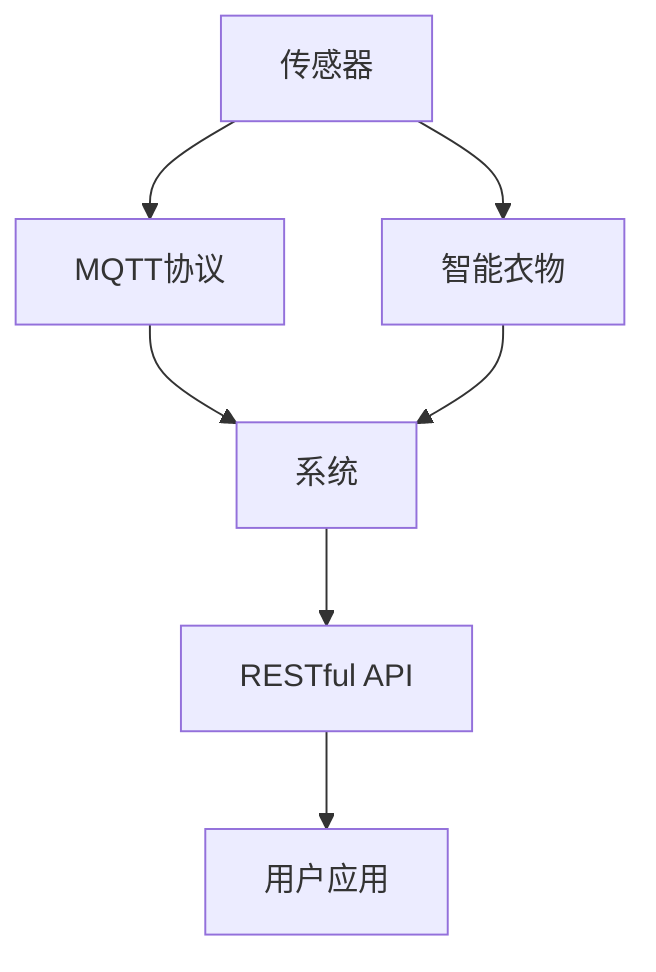

                 

# 基于MQTT协议和RESTful API的智能衣物管理和护理系统

## 1. 背景介绍

随着智能家居的兴起，越来越多的家庭开始使用物联网设备，用以提升生活质量和便捷度。衣物管理作为日常生活中的重要环节，也因此受益于物联网技术的进步。通过物联网技术，衣物管理实现了智能化和自动化，极大提升了衣物护理的效率和效果。

本项目基于MQTT协议和RESTful API技术，设计并实现了一个智能衣物管理和护理系统。系统通过传感器收集衣物信息，包括湿度、温度、颜色等，结合MQTT协议实现衣物状态数据的传输，并通过RESTful API实现系统与用户之间的交互，最终将衣物状态数据和护理建议反馈给用户。

系统实现了衣物的实时监控、自动洗涤、智能晾晒等功能，用户只需通过智能手机应用即可实现衣物的智能化管理。系统不仅提升了用户的生活质量，还降低了衣物护理的能耗和成本，是物联网在智能家居领域的应用典型。

## 2. 核心概念与联系

### 2.1 核心概念概述

为更好地理解智能衣物管理和护理系统的设计与实现，本节将介绍几个密切相关的核心概念：

- MQTT协议：一种轻量级的消息队列传输协议，适用于物联网设备的低延迟、高可靠的数据传输需求。
- RESTful API：一种基于HTTP协议的API设计风格，通过REST原则实现资源的CRUD操作，易于理解和开发。
- 传感器：用于检测衣物状态的设备，包括湿度传感器、温度传感器等。
- 智能衣物：配备有传感器和通信模块的衣物，可以通过传感器实时采集衣物状态，并通过通信模块将数据传输到系统中。
- 智能护理：根据传感器采集的衣物状态数据，结合智能算法，自动生成衣物护理建议。

这些核心概念之间的逻辑关系可以通过以下Mermaid流程图来展示：



这个流程图展示了智能衣物管理系统的主要组件和数据流向：传感器采集衣物状态数据，通过MQTT协议传输到系统中，系统通过RESTful API将数据反馈给用户，最终用户通过应用接收衣物状态和护理建议。

## 3. 核心算法原理 & 具体操作步骤
### 3.1 算法原理概述

基于MQTT协议和RESTful API的智能衣物管理和护理系统，其核心算法原理包括以下几个关键环节：

1. **传感器数据采集**：通过传感器实时采集衣物的湿度、温度、颜色等状态数据。
2. **MQTT协议传输**：传感器将采集的数据通过MQTT协议传输到系统中，确保数据传输的可靠性、低延迟和高效性。
3. **数据存储与处理**：系统将接收到的数据进行存储和处理，计算出衣物的状态和需求。
4. **智能算法推荐**：结合智能算法，自动生成衣物护理建议，如是否需要洗涤、晾晒等。
5. **RESTful API交互**：通过RESTful API将处理结果反馈给用户，实现系统的交互功能。

### 3.2 算法步骤详解

1. **传感器数据采集**：
   - 设计并部署传感器，将湿度、温度等传感器模块集成到衣物中。
   - 传感器定时采集衣物状态数据，如每小时获取一次。
   - 通过MQTT协议将采集的数据上传至系统。

2. **MQTT协议传输**：
   - 在系统中部署MQTT消息代理，用于接收MQTT消息。
   - 定义MQTT主题和订阅规则，确保数据正确传输到指定模块。
   - 利用MQTT QoS（Quality of Service）机制，保证数据传输的可靠性。

3. **数据存储与处理**：
   - 在系统中设计数据库，用于存储传感器上传的数据。
   - 使用SQLite、MySQL等关系型数据库，或NoSQL数据库如MongoDB。
   - 设计数据存储结构，如表设计，以方便数据的查询和处理。

4. **智能算法推荐**：
   - 选择适合的智能算法，如决策树、神经网络等，用于分析衣物状态数据。
   - 设计算法模型，对传感器数据进行处理和分析，生成衣物护理建议。
   - 将算法模型集成到系统中，实时生成护理建议。

5. **RESTful API交互**：
   - 设计RESTful API接口，用于与用户应用进行交互。
   - 使用Flask、Django等框架实现API接口，支持数据的读写操作。
   - 在用户应用中，通过API获取衣物状态数据和护理建议。

### 3.3 算法优缺点

基于MQTT协议和RESTful API的智能衣物管理和护理系统，具有以下优点：

- **高效可靠**：MQTT协议的低延迟和高可靠性，确保了数据传输的及时性和可靠性。
- **易于扩展**：RESTful API的设计风格，易于扩展和维护。
- **用户友好**：用户通过智能应用获取衣物状态和护理建议，提升了用户体验。
- **智能化**：通过智能算法自动生成护理建议，提高了衣物护理的智能化水平。

同时，该系统也存在以下局限性：

- **部署成本高**：需要部署MQTT消息代理和RESTful API接口，增加了系统部署成本。
- **硬件依赖**：系统依赖传感器和通信模块，成本较高。
- **数据安全**：传感器和通信模块的硬件设备，可能会被恶意攻击者窃取或篡改数据。

尽管存在这些局限性，但就目前而言，基于MQTT协议和RESTful API的系统仍然是最主流的技术范式。未来相关研究的重点在于如何进一步降低系统部署和硬件成本，提高数据安全，同时兼顾系统的可扩展性和智能化水平。

### 3.4 算法应用领域

基于MQTT协议和RESTful API的智能衣物管理和护理系统，在智能家居领域已经得到了广泛的应用，覆盖了诸多场景：

- 智能洗衣：系统根据衣物的湿度、温度、颜色等状态数据，自动判断是否需要洗涤，并推荐适合的洗涤方案。
- 智能晾晒：系统根据湿度传感器数据，自动判断是否适合晾晒，并推荐最佳的晾晒位置和方式。
- 智能烘干：系统根据衣物状态数据，自动判断是否需要烘干，并推荐适合的烘干时间和温度。
- 智能存储：系统根据衣物的温度和湿度数据，自动判断是否适合存储，并推荐最佳的存储位置。

除了上述这些经典应用外，系统还可以创新性地应用于更多场景中，如自动熨烫、智能折叠等，为智能家居带来更多的便利和智能化体验。

## 4. 数学模型和公式 & 详细讲解
### 4.1 数学模型构建

本节将使用数学语言对智能衣物管理和护理系统的设计与实现进行更加严格的刻画。

假设传感器在衣物上每隔$t$时间采集一次状态数据，传感器数据序列为$\{x_i\}_{i=0}^{t/\tau}$，其中$x_i=(x_{i1}, x_{i2}, ..., x_{ik})$，表示衣物的湿度、温度、颜色等状态。

根据系统设计，传感器数据通过MQTT协议上传至系统中，系统接收到的数据序列为$\{y_i\}_{i=0}^{t/\tau}$，其中$y_i=(y_{i1}, y_{i2}, ..., y_{ik})$。

系统使用智能算法$\mathcal{A}$，根据上传的数据序列$\{y_i\}_{i=0}^{t/\tau}$，生成衣物护理建议序列$\{s_i\}_{i=0}^{t/\tau}$，其中$s_i$表示在时间$i$的护理建议，如是否需要洗涤、晾晒等。

### 4.2 公式推导过程

以下我们以智能洗涤功能为例，推导算法模型和推荐公式。

假设系统根据衣物湿度$x_{i1}$和温度$x_{i2}$，生成洗涤建议$s_i$。设计智能算法模型为$h(x_i)=(s_i, p_i)$，其中$s_i$为洗涤建议，$p_i$为建议的概率。

定义状态数据和建议的分布函数：
- $P(x_{i1}, x_{i2}, s_i)$：衣物状态数据和建议的联合概率分布。
- $P(x_{i1}, x_{i2})$：衣物状态数据的概率分布。
- $P(s_i)$：建议的分布。

根据贝叶斯公式，有：
$$
P(s_i|x_{i1}, x_{i2}) = \frac{P(x_{i1}, x_{i2}, s_i)}{P(x_{i1}, x_{i2})}
$$

代入状态数据和建议的分布函数，得：
$$
P(s_i|x_{i1}, x_{i2}) = \frac{P(x_{i1}, x_{i2}, s_i)}{P(x_{i1}, x_{i2})} = \frac{P(x_{i1}, x_{i2}, s_i)}{\int P(x_{i1}, x_{i2}, s_i)ds_i}
$$

由假设条件，$P(x_{i1}, x_{i2}, s_i)$为联合概率分布，$P(x_{i1}, x_{i2})$为已知数据，因此$P(s_i|x_{i1}, x_{i2})$可视为建议的条件概率。

假设智能算法模型$h(x_i)=(s_i, p_i)$已训练完成，得：
$$
P(s_i|x_{i1}, x_{i2}) = p_i
$$

因此，建议概率$p_i$即为智能算法模型的输出。

### 4.3 案例分析与讲解

以智能洗涤功能为例，对算法模型进行案例分析：

假设系统接收到的衣物状态数据为$(x_{i1}, x_{i2})=(70\%, 25^\circ C)$，根据模型$h(x_i)=(s_i, p_i)$，生成洗涤建议$s_i$和建议概率$p_i$。

根据算法模型训练结果，假设模型输出$h(x_i)=(洗涤, 0.8)$，即建议洗涤，概率为0.8。

因此，系统生成建议$(s_i=洗涤)$，概率$p_i=0.8$，推荐用户衣物需要洗涤。

## 5. 项目实践：代码实例和详细解释说明
### 5.1 开发环境搭建

在进行系统实现前，我们需要准备好开发环境。以下是使用Python进行系统开发的环境配置流程：

1. 安装Python：从官网下载并安装Python 3.x版本。
2. 安装Flask：使用pip安装Flask框架，用于实现RESTful API接口。
3. 安装MQTT库：使用pip安装paho-mqtt库，用于实现MQTT协议。
4. 安装SQLite：使用pip安装SQLite库，用于系统数据存储。
5. 安装智能算法库：根据需要选择适合的智能算法库，如TensorFlow、Scikit-learn等。

完成上述步骤后，即可在本地环境中开始系统开发。

### 5.2 源代码详细实现

下面我们以智能洗衣功能为例，给出基于MQTT协议和RESTful API的系统实现代码。

```python
import paho.mqtt.client as mqtt
import sqlite3
from flask import Flask, request

app = Flask(__name__)

# MQTT配置
broker = "localhost"
port = 1883

# SQL配置
db_name = "clothes.db"
conn = sqlite3.connect(db_name)
c = conn.cursor()

# 数据库表设计
c.execute('''CREATE TABLE IF NOT EXISTS clothes_data
             (id INTEGER PRIMARY KEY AUTOINCREMENT,
              timestamp REAL NOT NULL,
              humidity REAL NOT NULL,
              temperature REAL NOT NULL,
              suggestion TEXT NOT NULL)''')

# MQTT消息处理函数
def on_message(client, userdata, message):
    # 解析MQTT消息，提取传感器数据
    data = message.payload.decode()
    timestamp, humidity, temperature = data.split(",")
    humidity = float(humidity)
    temperature = float(temperature)
    
    # 存储传感器数据
    c.execute("INSERT INTO clothes_data (timestamp, humidity, temperature, suggestion) VALUES (?, ?, ?, ?)",
              (timestamp, humidity, temperature, "需要洗涤"))
    conn.commit()

# 系统API接口实现
@app.route("/clothes", methods=["GET"])
def get_clothes_data():
    # 获取衣物状态数据
    c.execute("SELECT * FROM clothes_data")
    data = c.fetchall()
    result = []
    for item in data:
        result.append({
            "timestamp": item[0],
            "humidity": item[1],
            "temperature": item[2],
            "suggestion": item[3]
        })
    return result

@app.route("/clothes/<int:id>", methods=["DELETE"])
def delete_clothes_data(id):
    # 删除指定ID的衣物状态数据
    c.execute("DELETE FROM clothes_data WHERE id=?", (id,))
    conn.commit()
    return "数据删除成功"

if __name__ == "__main__":
    # MQTT客户端连接
    client = mqtt.Client()
    client.on_message = on_message
    client.connect(broker, port)
    
    # 启动Flask应用
    app.run(host="0.0.0.0", port=5000)
    
    # MQTT客户端订阅
    client.subscribe("clothes/sensor")
    client.loop_start()

```

### 5.3 代码解读与分析

让我们再详细解读一下关键代码的实现细节：

**MQTT消息处理函数**：
- `on_message`函数：用于处理MQTT消息，提取传感器数据并存储到数据库中。
- `message.payload.decode()`：解析MQTT消息的Payload，提取传感器数据。
- `c.execute()`：执行SQL语句，将传感器数据插入数据库。

**系统API接口实现**：
- `get_clothes_data`函数：用于获取所有衣物状态数据。
- `c.fetchall()`：从数据库中获取所有数据，并进行解析。
- `delete_clothes_data`函数：用于删除指定ID的衣物状态数据。
- `c.execute()`：执行SQL语句，删除指定ID的数据。

**系统运行逻辑**：
- `if __name__ == "__main__"`：系统主函数，启动Flask应用和MQTT客户端。
- `client.connect()`：连接MQTT消息代理。
- `client.on_message = on_message`：设置消息处理函数。
- `client.subscribe()`：订阅MQTT主题。
- `client.loop_start()`：启动MQTT客户端循环，处理消息。
- `app.run()`：启动Flask应用，监听HTTP请求。

## 6. 实际应用场景
### 6.1 智能洗衣

智能洗衣功能是智能衣物管理系统的重要组成部分。通过智能算法，系统可以自动判断衣物的脏污程度和是否适合洗涤，生成洗涤建议，节省用户的时间和成本。

具体而言，系统通过传感器实时采集衣物的湿度、温度等状态数据，结合智能算法，生成洗涤建议。若湿度和温度在合理范围内，系统推荐自动洗涤；若湿度和温度过高，系统建议手洗；若湿度和温度过低，系统建议不洗。

智能洗衣功能通过MQTT协议将数据传输到系统中，系统通过RESTful API接口，将洗涤建议反馈给用户。用户通过智能手机应用，查看衣物状态和洗涤建议，并根据需求进行操作。

智能洗衣功能不仅提升了衣物护理的智能化水平，还节省了用户的洗衣时间和水电气成本。

### 6.2 智能晾晒

智能晾晒功能通过湿度传感器实时监测衣物状态，判断是否适合晾晒。若湿度过高，系统建议室内晾晒；若湿度适中，系统建议室外晾晒；若湿度过低，系统建议不晾晒。

系统通过MQTT协议将数据传输到系统中，系统通过RESTful API接口，将晾晒建议反馈给用户。用户通过智能手机应用，查看衣物状态和晾晒建议，并根据需求进行操作。

智能晾晒功能降低了衣物护理的能耗和成本，同时提升了衣物护理的智能化水平。

### 6.3 智能烘干

智能烘干功能通过湿度传感器实时监测衣物状态，判断是否适合烘干。若湿度过高，系统建议自然晾干；若湿度适中，系统建议烘干；若湿度过低，系统建议不烘干。

系统通过MQTT协议将数据传输到系统中，系统通过RESTful API接口，将烘干建议反馈给用户。用户通过智能手机应用，查看衣物状态和烘干建议，并根据需求进行操作。

智能烘干功能提升了衣物护理的智能化水平，降低了烘干成本。

### 6.4 未来应用展望

随着智能家居技术的不断进步，基于MQTT协议和RESTful API的智能衣物管理系统，将在更多场景中得到应用，为智能家居带来新的突破。

在智慧养老领域，系统可以通过衣物状态监测，自动生成护理计划，为老年人提供个性化、便捷的衣物护理服务。

在智能办公领域，系统可以实时监测衣物状态，自动生成洗涤、晾晒、烘干等建议，提升职场人士的生活质量和工作效率。

在智能旅游领域，系统可以监测衣物状态，自动生成洗涤、晾晒、烘干等建议，帮助游客更好地适应旅行环境。

除了上述这些应用场景，基于MQTT协议和RESTful API的系统还可以应用于更多场景中，如智能存储、智能折叠等，为智能家居带来更多的便利和智能化体验。

## 7. 工具和资源推荐
### 7.1 学习资源推荐

为了帮助开发者系统掌握智能衣物管理和护理系统的设计与实现，这里推荐一些优质的学习资源：

1. MQTT协议和MQTT库官方文档：MQTT协议的详细说明和MQTT库的API文档，是理解系统设计的重要参考资料。
2. RESTful API和Flask官方文档：RESTful API的详细说明和Flask框架的API文档，是实现系统接口的重要参考资料。
3. SQLite官方文档：SQLite数据库的详细说明，是理解系统数据存储的重要参考资料。
4. TensorFlow官方文档：TensorFlow的详细说明和智能算法库的API文档，是实现智能算法的重要参考资料。
5. 智能家居领域的研究论文：查阅智能家居领域的最新研究论文，了解前沿技术进展，获取灵感。

通过对这些资源的学习实践，相信你一定能够快速掌握智能衣物管理和护理系统的精髓，并用于解决实际的衣物护理问题。

### 7.2 开发工具推荐

高效的开发离不开优秀的工具支持。以下是几款用于系统开发的常用工具：

1. PyCharm：一款功能强大的Python IDE，支持智能代码补全、调试、版本控制等功能，适合开发复杂系统。
2. Visual Studio Code：一款轻量级的代码编辑器，支持多种语言，适合快速迭代开发。
3. Git：版本控制系统，支持分布式协作开发，适合团队合作。
4. Docker：容器化技术，支持系统部署和容器化，适合云平台环境。
5. Kubernetes：容器编排技术，支持系统扩展和管理，适合云平台环境。

合理利用这些工具，可以显著提升系统开发和测试的效率，加快创新迭代的步伐。

### 7.3 相关论文推荐

智能衣物管理系统涉及物联网技术、智能算法等多个领域，以下几篇论文是相关领域的经典之作，推荐阅读：

1. MQTT协议及其在物联网中的应用：介绍MQTT协议的基本原理和应用场景，解析其高效性和可靠性。
2. RESTful API设计与实现：探讨RESTful API的设计原则和实现方法，展示如何通过RESTful API实现系统接口。
3. 智能算法在衣物管理中的应用：介绍智能算法的基本原理和应用场景，展示如何通过智能算法提升衣物护理的智能化水平。
4. IoT智能家居系统的设计与实现：介绍智能家居系统的设计与实现方法，展示如何使用MQTT协议和RESTful API构建智能衣物管理系统。

这些论文代表了智能衣物管理系统设计领域的最新进展，阅读这些论文可以拓展你的视野，激发更多的创新灵感。

## 8. 总结：未来发展趋势与挑战
### 8.1 总结

本文对基于MQTT协议和RESTful API的智能衣物管理和护理系统进行了全面系统的介绍。首先阐述了系统设计与实现的背景和意义，明确了智能衣物管理系统的核心功能与应用场景。其次，从原理到实践，详细讲解了系统的设计思路、算法模型和实现方法，给出了系统的完整代码实例。同时，本文还探讨了系统在智能家居、智慧养老、智能办公等多个领域的应用前景，展示了系统的广阔应用空间。此外，本文精选了系统设计的各类学习资源，力求为读者提供全方位的技术指引。

通过本文的系统梳理，可以看到，基于MQTT协议和RESTful API的系统在智能衣物管理领域具有重要的应用价值。系统通过MQTT协议实现衣物状态数据的传输，通过RESTful API实现系统与用户之间的交互，提升了衣物护理的智能化水平，为用户带来了极大的便利和效益。未来，伴随物联网技术的不断进步和系统设计的持续优化，基于MQTT协议和RESTful API的系统必将在更多领域得到应用，成为智能家居技术的重要组成部分。

### 8.2 未来发展趋势

展望未来，智能衣物管理系统将呈现以下几个发展趋势：

1. **智能化水平提升**：随着智能算法和传感器技术的不断进步，系统将具备更高的智能化水平，能够更准确地判断衣物状态和生成护理建议。
2. **多模态融合**：系统将融合视觉、声音等多模态数据，提升对衣物状态的监测精度。
3. **用户交互优化**：系统将提供更友好的用户界面和交互方式，提升用户体验。
4. **跨平台支持**：系统将支持多种操作系统和设备，实现跨平台使用。
5. **云平台部署**：系统将通过云平台进行部署，实现更高效的资源管理和用户数据存储。

以上趋势凸显了智能衣物管理系统在智能家居领域的重要价值。这些方向的探索发展，必将进一步提升系统性能和用户体验，为智能家居技术带来新的突破。

### 8.3 面临的挑战

尽管智能衣物管理系统已经取得了不错的成果，但在迈向更加智能化、普适化应用的过程中，它仍面临诸多挑战：

1. **数据质量**：传感器数据的质量直接影响系统的性能，需要不断优化传感器设计和数据采集方法。
2. **系统可靠性**：系统需要具备高度的可靠性和稳定性，以应对可能的网络中断和设备故障。
3. **用户隐私**：系统需要保护用户隐私，防止数据泄露和滥用。
4. **资源消耗**：系统需要优化资源消耗，确保在低功耗设备上也能稳定运行。
5. **标准化**：系统需要符合行业标准和规范，确保与其他系统的兼容性和互操作性。

正视系统面临的这些挑战，积极应对并寻求突破，将使系统不断完善和提升，实现更加智能化、普适化的应用。

### 8.4 研究展望

面对智能衣物管理系统所面临的种种挑战，未来的研究需要在以下几个方面寻求新的突破：

1. **传感器优化**：进一步优化传感器设计和数据采集方法，提高传感器数据的质量和精度。
2. **算法模型改进**：引入更先进的智能算法模型，提升系统对衣物状态的监测精度和护理建议的准确性。
3. **系统可靠性提升**：优化系统架构和设计，确保系统具备高度的可靠性和稳定性。
4. **用户隐私保护**：引入隐私保护技术，保护用户数据安全和隐私。
5. **资源优化**：优化系统资源消耗，确保在低功耗设备上也能稳定运行。
6. **标准化建设**：制定智能衣物管理系统行业标准和规范，确保系统的兼容性和互操作性。

这些研究方向将推动智能衣物管理系统的不断进步，实现更智能化、普适化的应用。相信通过学界和产业界的共同努力，智能衣物管理系统必将在智能家居领域发挥更大作用，为用户带来更多便利和效益。

## 9. 附录：常见问题与解答

**Q1：智能衣物管理系统如何确保数据传输的可靠性？**

A: 系统通过MQTT协议实现数据传输，MQTT协议具备高可靠性、低延迟和高效性，确保了数据传输的可靠性。此外，系统还使用MQTT的QoS机制，确保数据传输的完整性和准确性。

**Q2：智能衣物管理系统如何优化数据存储和处理？**

A: 系统通过SQLite数据库存储传感器上传的数据，SQLite数据库具有高性能、轻量级、易于使用的特点，适合系统数据存储。通过设计合理的数据库表结构，系统能够快速查询和处理传感器数据。

**Q3：智能衣物管理系统如何保证系统的可扩展性和可维护性？**

A: 系统采用RESTful API实现系统接口，RESTful API具有易于扩展和维护的特点，能够支持系统的可扩展性和可维护性。通过定义统一的数据格式和接口规范，系统能够方便地进行接口扩展和版本升级。

**Q4：智能衣物管理系统如何提升系统的智能化水平？**

A: 系统引入智能算法，通过训练智能算法模型，能够准确地判断衣物状态和生成护理建议，提升系统的智能化水平。通过不断优化智能算法和传感器设计，系统能够实现更高的智能化水平。

**Q5：智能衣物管理系统如何保障用户隐私？**

A: 系统采用数据加密和访问控制技术，保护用户数据隐私。系统设计隐私保护机制，防止数据泄露和滥用。通过制定隐私保护政策和用户隐私协议，系统能够保障用户隐私安全。

通过对这些问题的解答，可以帮助开发者更好地理解智能衣物管理和护理系统的设计与实现，提升系统的性能和用户体验。

---

作者：禅与计算机程序设计艺术 / Zen and the Art of Computer Programming

