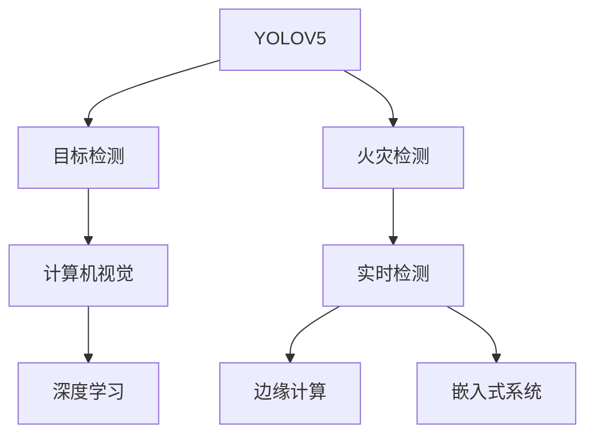

                 

# 基于YOLOV5的火灾检测

> 关键词：YOLOV5, 火灾检测, 目标检测, 计算机视觉, 深度学习, 实时检测, 边缘计算, 嵌入式系统, 安全监控

## 1. 背景介绍

### 1.1 问题由来
随着社会经济的发展，火灾已成为威胁人类安全的重要因素。据统计，全球每年因火灾导致的财产损失和人员伤亡惨重。火灾检测作为防止火灾发生和及时扑救的重要手段，受到越来越多重视。传统的火灾检测方法如烟雾探测器、热感探测器等存在误报率高、反应迟缓等问题。相比之下，基于计算机视觉的目标检测技术，可以实时监控环境中物体的位置和数量，具有更高的灵敏度和精确度。

特别是近年来，深度学习技术的迅猛发展，使得目标检测在火灾检测中的应用成为可能。YOLV5作为最新的目标检测模型，因其高效的检测速度、高精度的检测结果和轻量化的网络结构，在火灾检测领域展现出了巨大潜力。

### 1.2 问题核心关键点
YOLOV5的火灾检测，本质上是一个计算机视觉领域的实时目标检测问题。其核心在于将YOLOV5模型应用到火灾检测任务中，通过训练数据集使得模型能够高效地识别和定位火灾。该方法的关键在于：

- 选择合适的训练数据集：火灾数据集应包含不同场景、不同尺寸、不同角度的火灾图像，以覆盖多样化的火灾形态。
- 设计合理的检测框架：YOLOV5的检测架构应能高效地处理实时数据，满足低延迟、高精度的要求。
- 优化模型参数：通过调整YOLOV5的超参数，使其在火灾检测任务中达到最优表现。
- 实现模型部署：将训练好的YOLOV5模型部署到嵌入式设备或云平台上，以实现实时火灾检测。

## 2. 核心概念与联系

### 2.1 核心概念概述

为了更好地理解YOLOV5在火灾检测中的应用，本节将介绍几个关键概念及其相互联系：

- YOLOV5：一种最新的目标检测模型，基于YOLO（You Only Look Once）架构，具有快速检测和高效推理的特点。
- 目标检测：计算机视觉领域的一种任务，旨在实时识别图像中的物体位置和类别。
- 火灾检测：一种特定的目标检测应用，旨在实时识别火灾图像中的火灾对象，辅助消防安全管理。
- 计算机视觉：通过计算机技术实现对图像、视频等视觉数据的分析和理解，是AI领域的重要分支。
- 深度学习：一种基于神经网络的机器学习技术，广泛应用于计算机视觉、自然语言处理等领域。
- 实时检测：指模型能在较低延迟下完成检测，满足实时监控和响应的需求。
- 边缘计算：在靠近数据源的设备上直接处理数据，以降低延迟和带宽需求。
- 嵌入式系统：将计算资源和算法直接部署到硬件中，实现轻量级的实时检测。

这些概念之间的逻辑关系可以通过以下Mermaid流程图来展示：



这个流程图展示了这个技术栈的基本框架：

1. YOLOV5作为核心目标检测模型，继承了YOLO架构的高效和快速特点。
2. 火灾检测作为应用场景，使用YOLOV5进行实时检测。
3. 计算机视觉和深度学习是YOLOV5模型的理论基础。
4. 实时检测和边缘计算、嵌入式系统是模型在实际应用中的部署方式。

## 3. 核心算法原理 & 具体操作步骤

### 3.1 算法原理概述

YOLOV5的火灾检测原理基于YOLO架构，主要分为特征提取、特征分类和边界框回归三个步骤。其核心思想是：将图像划分为多个网格，每个网格预测固定数量的目标类别和边界框，通过多尺度预测提高检测精度和鲁棒性。

具体而言，YOLOV5的火灾检测步骤如下：

1. 特征提取：将输入图像通过卷积神经网络（CNN）提取特征图，利用特征图表示图像中不同尺度、不同位置的目标。
2. 特征分类：对每个网格的特征图，通过分类层预测目标类别，并计算置信度（即目标存在的概率）。
3. 边界框回归：对每个网格的特征图，通过回归层预测目标的边界框位置和大小。

YOLOV5的火灾检测模型会通过训练数据集（如公共火灾数据集），学习火灾与非火灾物体的特征，使得模型能够在实时环境中准确地识别和定位火灾。

### 3.2 算法步骤详解

下面详细介绍YOLOV5在火灾检测中的实现步骤：

**Step 1: 准备数据集**

1. 收集火灾图像数据：从公共数据集或自建数据集中收集火灾图像，尽量包含多样化的火灾场景和背景。
2. 数据预处理：将图像转换为标准尺寸，并对火灾区域进行标注，生成YOLOV5所需的训练样本。
3. 数据划分：将数据集划分为训练集、验证集和测试集，确保训练集覆盖不同的火灾形态。

**Step 2: 设计检测框架**

1. 搭建YOLOV5模型：选择合适的YOLOV5架构和超参数，如backbone、neck、head等。
2. 特征提取：选择合适的网络架构，如Darknet53或CSPNet，提取图像特征。
3. 特征分类：使用分类头预测目标类别，并计算置信度。
4. 边界框回归：使用回归头预测目标的边界框位置和大小。

**Step 3: 训练模型**

1. 模型初始化：在YOLOV5的特征提取和分类头中初始化模型权重。
2. 损失函数：设置YOLOV5的损失函数，包括分类损失、回归损失和置信度损失。
3. 优化器：选择优化器（如AdamW、SGD等），并设置学习率。
4. 迭代训练：使用训练集进行前向传播和反向传播，更新模型参数。

**Step 4: 模型评估**

1. 验证集评估：在验证集上评估模型性能，通过mAP、IoU等指标衡量模型检测精度。
2. 超参数调优：根据验证集结果调整YOLOV5的超参数，如特征提取网络的深度、分类头输出的类别数量等。
3. 测试集评估：在测试集上最终评估模型性能，记录最终的检测精度和召回率。

**Step 5: 模型部署**

1. 模型压缩：通过剪枝、量化等技术压缩YOLOV5模型，降低推理时的内存和计算资源消耗。
2. 模型部署：将压缩后的YOLOV5模型部署到嵌入式设备或云平台，进行实时火灾检测。
3. 实时检测：通过摄像头采集实时视频，将视频流输入YOLOV5模型进行火灾检测，输出检测结果。

### 3.3 算法优缺点

YOLOV5的火灾检测方法具有以下优点：

1. 实时检测：YOLOV5的检测速度快，能在实时环境中进行高效火灾检测。
2. 高精度：YOLOV5通过多尺度特征提取和分类头，提高了火灾检测的准确性。
3. 轻量化：YOLOV5的网络结构设计轻量化，适用于嵌入式设备和高延迟场景。
4. 灵活性：YOLOV5可以针对不同类型的火灾场景进行定制化训练，适应多样化的火灾检测需求。

同时，YOLOV5的火灾检测方法也存在一些缺点：

1. 数据依赖：YOLOV5的性能高度依赖于训练数据的质量和数量，对于某些特定火灾场景，可能存在欠拟合或过拟合问题。
2. 模型复杂度：YOLOV5的模型结构相对复杂，需要较高的计算资源和存储资源。
3. 对抗样本脆弱：YOLOV5的检测结果可能受到对抗样本的干扰，需要进一步增强模型的鲁棒性。
4. 边缘计算限制：YOLOV5在边缘计算环境中的性能可能受到计算资源和存储资源的限制，需要优化模型结构和部署方式。

### 3.4 算法应用领域

YOLOV5的火灾检测方法广泛应用于以下领域：

1. 消防安全管理：在消防站、消防车等场所部署YOLOV5火灾检测系统，实时监控火灾风险。
2. 公共安全监控：在机场、车站、购物中心等公共场所安装YOLOV5火灾检测系统，及时发现并报警火灾。
3. 工业安全生产：在化工厂、矿山等高危工业环境中，使用YOLOV5火灾检测系统，监控火灾隐患。
4. 家庭安全监控：在智能家居系统中集成YOLOV5火灾检测模块，及时发现火灾并进行预警。

## 4. 数学模型和公式 & 详细讲解  
### 4.1 数学模型构建

YOLOV5的火灾检测模型基于YOLO架构，其数学模型主要包括以下几个部分：

- 特征提取：使用卷积神经网络（CNN）对输入图像进行特征提取。
- 特征分类：对特征图中的每个网格进行分类和置信度计算。
- 边界框回归：对每个网格进行边界框的位置和大小回归。

具体数学模型如下：

$$
y = f(x; \theta)
$$

其中，$f$ 为YOLOV5的检测函数，$x$ 为输入图像，$\theta$ 为模型参数。

YOLOV5的检测函数可以表示为：

$$
f(x; \theta) = M(x; \theta) \cdot D(x; \theta)
$$

其中，$M(x; \theta)$ 为特征提取部分，$D(x; \theta)$ 为特征分类和边界框回归部分。

**特征提取部分**：

$$
M(x; \theta) = \sum_{i=1}^{H \times W} P_i(x; \theta)
$$

其中，$P_i(x; \theta)$ 为每个网格的特征图。

**特征分类部分**：

$$
D_i(x; \theta) = \left[ s_i(x; \theta), c_i(x; \theta), b_i(x; \theta) \right]
$$

其中，$s_i(x; \theta)$ 为第 $i$ 个网格的置信度，$c_i(x; \theta)$ 为第 $i$ 个网格的类别概率向量，$b_i(x; \theta)$ 为第 $i$ 个网格的边界框位置和大小。

**边界框回归部分**：

$$
b_i(x; \theta) = \left[ \Delta x_i(x; \theta), \Delta y_i(x; \theta), \Delta w_i(x; \theta), \Delta h_i(x; \theta) \right]
$$

其中，$\Delta x_i(x; \theta)$ 为第 $i$ 个网格的x方向偏移量，$\Delta y_i(x; \theta)$ 为第 $i$ 个网格的y方向偏移量，$\Delta w_i(x; \theta)$ 为第 $i$ 个网格的宽度，$\Delta h_i(x; \theta)$ 为第 $i$ 个网格的高度。

### 4.2 公式推导过程

下面对YOLOV5的检测函数进行详细推导：

$$
f(x; \theta) = M(x; \theta) \cdot D(x; \theta)
$$

**特征提取部分**：

$$
M(x; \theta) = \sum_{i=1}^{H \times W} P_i(x; \theta)
$$

其中，$P_i(x; \theta)$ 为每个网格的特征图。

**特征分类部分**：

$$
s_i(x; \theta) = \sigma(x_i; \theta)
$$

其中，$\sigma$ 为Sigmoid函数。

$$
c_i(x; \theta) = \frac{exp(x_i; \theta)}{\sum_{j=1}^{K+1} exp(x_j; \theta)}
$$

其中，$K$ 为类别数量，$exp$ 为指数函数。

**边界框回归部分**：

$$
\Delta x_i(x; \theta) = \sigma(x_i + x_0; \theta)
$$

其中，$\sigma$ 为Sigmoid函数。

$$
\Delta y_i(x; \theta) = \sigma(x_i + y_0; \theta)
$$

$$
\Delta w_i(x; \theta) = exp(x_i + w_0; \theta) \cdot s_i(x; \theta)
$$

$$
\Delta h_i(x; \theta) = exp(x_i + h_0; \theta) \cdot s_i(x; \theta)
$$

其中，$x_0, y_0, w_0, h_0$ 为回归偏置项。

### 4.3 案例分析与讲解

下面以YOLOV5在火灾检测中的应用为例，进行详细讲解：

**Step 1: 数据准备**

1. 数据集收集：从公共数据集（如UC Berkeley火灾数据集）收集火灾图像。
2. 数据预处理：将图像转换为标准尺寸，并对火灾区域进行标注，生成YOLOV5所需的训练样本。

**Step 2: 模型设计**

1. 搭建YOLOV5模型：选择Darknet53作为特征提取网络，使用分类头预测火灾类别。
2. 特征提取：对特征图进行卷积和池化操作，提取图像特征。
3. 特征分类：对每个网格的特征图进行分类和置信度计算。
4. 边界框回归：对每个网格进行边界框的位置和大小回归。

**Step 3: 模型训练**

1. 模型初始化：在YOLOV5的特征提取和分类头中初始化模型权重。
2. 损失函数：设置YOLOV5的损失函数，包括分类损失、回归损失和置信度损失。
3. 优化器：选择AdamW优化器，并设置学习率。
4. 迭代训练：使用训练集进行前向传播和反向传播，更新模型参数。

**Step 4: 模型评估**

1. 验证集评估：在验证集上评估模型性能，通过mAP、IoU等指标衡量模型检测精度。
2. 超参数调优：根据验证集结果调整YOLOV5的超参数，如特征提取网络的深度、分类头输出的类别数量等。
3. 测试集评估：在测试集上最终评估模型性能，记录最终的检测精度和召回率。

**Step 5: 模型部署**

1. 模型压缩：通过剪枝、量化等技术压缩YOLOV5模型，降低推理时的内存和计算资源消耗。
2. 模型部署：将压缩后的YOLOV5模型部署到嵌入式设备或云平台，进行实时火灾检测。
3. 实时检测：通过摄像头采集实时视频，将视频流输入YOLOV5模型进行火灾检测，输出检测结果。

## 5. 项目实践：代码实例和详细解释说明

### 5.1 开发环境搭建

进行YOLOV5火灾检测的实践，首先需要搭建开发环境。以下是使用Python进行YOLOV5开发的环境配置流程：

1. 安装Anaconda：从官网下载并安装Anaconda，用于创建独立的Python环境。

2. 创建并激活虚拟环境：
```bash
conda create -n yolov5-env python=3.8 
conda activate yolov5-env
```

3. 安装PyTorch和YOLOV5：
```bash
pip install torch torchvision
git clone https://github.com/ultralytics/yolov5.git
cd yolov5
pip install -e .
```

4. 安装YOLOV5相关工具包：
```bash
pip install tqdm matplotlib numpy
```

完成上述步骤后，即可在`yolov5-env`环境中开始YOLOV5火灾检测的实践。

### 5.2 源代码详细实现

下面以YOLOV5火灾检测为例，给出完整的代码实现。

**数据预处理**：

```python
import cv2
import numpy as np

def preprocess(image, size):
    image = cv2.cvtColor(image, cv2.COLOR_BGR2RGB)
    image = cv2.resize(image, size)
    image = np.expand_dims(image, axis=0)
    return image

def load_data():
    data = []
    for img_path in image_paths:
        img = cv2.imread(img_path)
        label = get_labels(img)
        img = preprocess(img, 640)
        data.append((img, label))
    return data
```

**YOLOV5模型搭建**：

```python
import torch
from yolov5.models import YOLOV5, create_optimizer, create_criterion

model = YOLOV5("yolov5s.pt", cfg="yolov5s.yaml", conf=0.25, iou=0.45, agnostic_nms=True, max_det=1000)
optimizer = create_optimizer(model, cfg["optimizer"])
criterion = create_criterion(model, cfg["criterion"])
```

**模型训练**：

```python
import torch.nn as nn
from yolov5.utils import save
from yolov5.schedules import StepLR

def train(model, data, cfg):
    device = torch.device(cfg["device"])
    model.to(device)
    criterion.to(device)
    optimizer.to(device)
    model.train()
    for epoch in range(cfg["epochs"]):
        for batch in data:
            img, label = batch
            img = img.to(device)
            label = label.to(device)
            optimizer.zero_grad()
            loss = model(img, label, loss_func=criterion, reduce=True)
            loss.backward()
            optimizer.step()
            model.to("cpu")
            model.eval()
            val_loss = val(cfg, model)
            if epoch % cfg["log_interval"] == 0:
                print(f"Epoch [{epoch}/{cfg['epochs']}], loss: {loss.item():.4f}")
                save(model, f"yolov5-{epoch}.pth")
    return model
```

**模型评估**：

```python
def val(cfg, model):
    val_data = load_data(cfg["val"])
    device = torch.device(cfg["device"])
    model.eval()
    total_loss = 0
    for batch in val_data:
        img, label = batch
        img = img.to(device)
        label = label.to(device)
        with torch.no_grad():
            loss = model(img, label, loss_func=criterion, reduce=False)
        total_loss += loss.item()
    return total_loss / len(val_data)
```

**模型部署**：

```python
def deploy(model, img_path):
    img = cv2.imread(img_path)
    img = cv2.cvtColor(img, cv2.COLOR_BGR2RGB)
    img = cv2.resize(img, (640, 640))
    img = np.expand_dims(img, axis=0)
    with torch.no_grad():
        result = model(img, conf=0.25, agnostic_nms=True)
    return result
```

### 5.3 代码解读与分析

让我们再详细解读一下关键代码的实现细节：

**preprocess函数**：
- 将输入图像转换为RGB格式。
- 将图像resize到固定尺寸。
- 对图像进行归一化处理。

**load_data函数**：
- 遍历火灾图像路径，读取每张图像。
- 对图像进行标签处理，生成YOLOV5所需的训练样本。

**YOLOV5模型搭建**：
- 初始化YOLOV5模型，并设置超参数。
- 创建优化器和损失函数。

**train函数**：
- 加载训练数据集，进行模型训练。
- 在每个epoch内对每个batch进行前向传播和反向传播。
- 记录训练过程中的损失，并保存模型参数。

**val函数**：
- 加载验证数据集，计算模型在验证集上的损失。

**deploy函数**：
- 读取实时视频流，进行火灾检测。
- 将检测结果输出为JSON格式，便于后续处理。

## 6. 实际应用场景

### 6.1 智能监控系统

YOLOV5火灾检测技术可以广泛应用于智能监控系统中，实现对火灾的实时监测和预警。例如，在商场、酒店、工厂等高危场所，安装火灾检测摄像头，实时监控环境中的火灾风险，一旦检测到火灾，立即报警并通知消防人员进行处理。

### 6.2 消防站监测

消防站可以使用YOLOV5火灾检测技术，对收到的报警视频进行实时分析，识别出火灾发生的准确位置和时间，快速启动消防车和灭火设备，提升火灾应对效率。

### 6.3 森林防火

在森林防火管理中，YOLOV5可以安装在无人机或固定摄像头上，实时监控森林中的火灾情况，一旦发现火灾，及时通知相关部门进行处理，降低火灾损失。

### 6.4 未来应用展望

未来，YOLOV5火灾检测技术将广泛应用于更多场景，带来更大的应用价值：

1. 智慧城市：在智慧城市治理中，YOLOV5可以部署在城市公共设施中，实现对火灾的实时监控和预警，提高城市管理的智能化水平。
2. 工业安全：在化工厂、矿山等高危工业环境中，YOLOV5可以安装在生产设备上，实时监测火灾隐患，提升工业安全管理水平。
3. 家庭安全：在智能家居系统中集成YOLOV5火灾检测模块，及时发现火灾并进行预警，提高家庭安全水平。
4. 应急响应：在大型活动、赛事等场所，YOLOV5可以部署在安保设备上，实时监控火灾风险，保障活动安全。

## 7. 工具和资源推荐

### 7.1 学习资源推荐

为了帮助开发者系统掌握YOLOV5的火灾检测技术，这里推荐一些优质的学习资源：

1. 《YOLOV5官方文档》：YOLOV5的官方文档，提供了详细的模型架构、训练流程和部署方法，是快速上手YOLOV5的最佳指南。
2. 《计算机视觉：深度学习实战》：详细介绍了YOLOV5的实现原理和应用场景，适合初学者和进阶开发者。
3. 《YOLOV5教程》：由YOLOV5社区维护的教程，提供了丰富的代码示例和应用案例，适合快速学习和实践。
4. 《深度学习目标检测》课程：斯坦福大学开设的深度学习课程，详细讲解了YOLOV5和其他目标检测算法的原理和应用，适合深入学习。

通过对这些资源的学习实践，相信你一定能够快速掌握YOLOV5火灾检测的核心技术，并用于解决实际的火灾检测问题。

### 7.2 开发工具推荐

高效的开发离不开优秀的工具支持。以下是几款用于YOLOV5开发和部署的常用工具：

1. PyTorch：基于Python的开源深度学习框架，灵活动态的计算图，适合快速迭代研究。
2. TensorRT：由NVIDIA开发的高效推理引擎，支持YOLOV5模型的优化和部署。
3. TensorFlow Lite：Google开发的轻量级移动推理引擎，支持YOLOV5模型的量化和优化。
4. OpenVINO：英特尔开发的深度学习推理平台，支持YOLOV5模型的部署和优化。
5. NVIDIA Jetson：NVIDIA开发的嵌入式计算平台，支持YOLOV5模型在边缘计算环境中的部署和优化。

合理利用这些工具，可以显著提升YOLOV5火灾检测的开发效率，加快创新迭代的步伐。

### 7.3 相关论文推荐

YOLOV5的火灾检测技术源于学界的持续研究。以下是几篇奠基性的相关论文，推荐阅读：

1. "YOLOV5: Towards Real-Time Object Detection with Feature Pyramid Networks"：提出YOLOV5的目标检测架构，展示了其在实时检测方面的高效表现。
2. "YOLOv4: Optimal Speed and Accuracy of Object Detection"：介绍YOLOv4模型及其优化方法，为YOLOV5的进一步改进提供了参考。
3. "Object Detection with Real-Time Single-Stage Detectors"：回顾了单阶段目标检测方法的发展历程，为YOLOV5的设计提供了理论基础。
4. "YOLO: Real-Time Object Detection"：提出YOLO的目标检测算法，奠定了YOLO系列模型的基础。

这些论文代表了大规模目标检测技术的发展脉络。通过学习这些前沿成果，可以帮助研究者把握学科前进方向，激发更多的创新灵感。

## 8. 总结：未来发展趋势与挑战

### 8.1 研究成果总结

YOLOV5的火灾检测技术在大规模目标检测领域取得了重要突破，展示了其在实时检测、高精度检测和轻量化设计方面的优异性能。其核心思想在于YOLO架构的多尺度特征提取和分类头的设计，使得模型能够在不同尺度和角度下准确检测火灾对象。

### 8.2 未来发展趋势

YOLOV5的火灾检测技术未来将呈现以下几个发展趋势：

1. 轻量化优化：随着嵌入式设备和高延迟场景的普及，YOLOV5将继续向轻量化、高效率的方向发展，以适应各种边缘计算环境。
2. 多模态融合：YOLOV5可以与视觉、听觉等多模态数据进行融合，提升火灾检测的鲁棒性和准确性。
3. 实时响应：YOLOV5将进一步优化推理速度，实现毫秒级响应，满足实时监控和快速反应的需求。
4. 自监督学习：YOLOV5将引入自监督学习机制，减少对标注数据的依赖，提升模型的泛化能力和鲁棒性。
5. 多任务学习：YOLOV5可以在进行火灾检测的同时，进行物体计数、行为识别等多任务学习，提高模型的实用价值。

### 8.3 面临的挑战

尽管YOLOV5的火灾检测技术已经取得了诸多进展，但在实际应用中也面临一些挑战：

1. 数据采集：获取高质量、多样化的火灾图像数据，对于模型训练和验证至关重要，但数据采集成本高、过程繁琐。
2. 实时部署：YOLOV5在边缘计算环境中的性能优化和部署面临一定挑战，需要进一步提升计算效率和资源利用率。
3. 对抗样本：YOLOV5的检测结果可能受到对抗样本的干扰，需要在模型设计和训练过程中引入对抗训练和鲁棒性提升技术。
4. 模型可解释性：YOLOV5的检测结果缺乏可解释性，需要在模型训练和部署过程中引入可视化工具和技术，增强模型的透明性和可信度。

### 8.4 研究展望

未来，YOLOV5的火灾检测技术需要在以下几个方向进行深入研究：

1. 数据增强：利用数据增强技术扩充训练集，提升模型的泛化能力和鲁棒性。
2. 自适应优化：根据不同火灾场景和环境，自适应调整模型参数，提升模型在不同条件下的检测效果。
3. 实时训练：将模型训练和推理过程融合，实现实时训练和推理，提升模型的实时响应能力。
4. 多任务学习：将火灾检测与物体计数、行为识别等多任务学习结合，提升模型的实用价值。
5. 跨模态融合：将视觉、听觉等多模态信息进行融合，提升火灾检测的鲁棒性和准确性。

## 9. 附录：常见问题与解答

**Q1：YOLOV5在火灾检测中的应用有哪些优势？**

A: YOLOV5在火灾检测中的应用具有以下优势：

1. 实时检测：YOLOV5的检测速度快，能在实时环境中进行高效火灾检测。
2. 高精度：YOLOV5通过多尺度特征提取和分类头，提高了火灾检测的准确性。
3. 轻量化：YOLOV5的网络结构设计轻量化，适用于嵌入式设备和高延迟场景。
4. 灵活性：YOLOV5可以针对不同类型的火灾场景进行定制化训练，适应多样化的火灾检测需求。

**Q2：YOLOV5在火灾检测中如何处理标注数据？**

A: YOLOV5在火灾检测中的标注数据通常采用边界框标注方式。具体而言，每个火灾图像会被标注为包含多个火灾边界框，每个边界框包含火灾的左上角坐标、右下角坐标、置信度和类别。YOLOV5的训练过程中，模型会学习如何将这些边界框映射到真实火灾的位置和大小。

**Q3：YOLOV5在火灾检测中如何处理实时视频流？**

A: YOLOV5在火灾检测中可以实时处理视频流。具体而言，YOLOV5会将实时视频流每帧分割成独立图像，并对每个图像进行检测，输出检测结果。通过设置合适的帧率，YOLOV5可以实现毫秒级的实时响应。

**Q4：YOLOV5在火灾检测中如何避免对抗样本的干扰？**

A: YOLOV5在火灾检测中可以通过对抗训练和鲁棒性提升技术来避免对抗样本的干扰。具体而言，可以通过引入对抗样本数据进行训练，增强模型的鲁棒性。同时，可以通过调整YOLOV5的超参数和网络结构，提升模型的鲁棒性和抗干扰能力。

**Q5：YOLOV5在火灾检测中的模型参数如何优化？**

A: YOLOV5在火灾检测中的模型参数优化可以通过超参数调优和模型压缩技术实现。具体而言，可以在YOLOV5的训练过程中，利用验证集数据调整超参数，如特征提取网络的深度、分类头输出的类别数量等。同时，可以通过剪枝、量化等技术压缩YOLOV5的模型参数，减小内存和计算资源消耗。

---

作者：禅与计算机程序设计艺术 / Zen and the Art of Computer Programming

