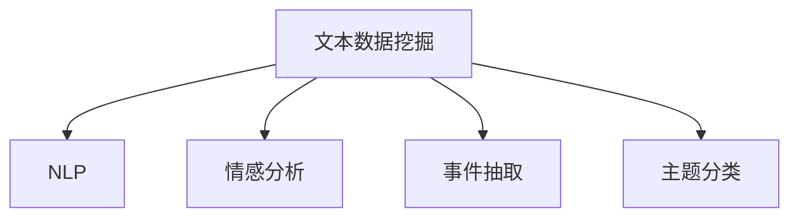

                 

# 基于新闻平台的文本数据挖掘系统

## 1. 背景介绍

### 1.1 问题由来

随着互联网的普及和智能手机的广泛使用，新闻阅读成为了人们获取信息的主要方式之一。每天有数以亿计的用户在线浏览新闻，阅读量庞大，并且新闻内容多样，覆盖面广，既有国内外要闻、财经、体育等重大新闻，也有地方动态、娱乐、科技等细分领域的报道。然而，信息爆炸的同时也带来了信息过载的问题，如何在海量的新闻中快速提取有价值的信息，成为新闻平台和用户共同面临的挑战。

### 1.2 问题核心关键点

文本数据挖掘系统（Text Mining System）旨在从新闻平台的海量文本数据中自动提取信息，包括关键词提取、事件抽取、情感分析、主题分类等。它通过自然语言处理（NLP）技术，帮助用户快速获取感兴趣的内容，同时为新闻机构提供内容分析支持，提高运营效率。

具体问题包括：

- 如何从大量文本中快速识别和提取关键词？
- 如何自动进行事件抽取，即从新闻文本中识别事件、地点、人物等信息？
- 如何分析新闻文本的情感倾向？
- 如何对新闻内容进行主题分类，便于用户快速查找？

### 1.3 问题研究意义

文本数据挖掘系统对新闻平台和用户均有显著意义：

- 对于新闻机构，文本数据挖掘系统可以提高内容生产效率，自动抓取热点新闻，辅助编辑策划报道。
- 对于用户，系统可以帮助用户快速找到感兴趣的内容，提升阅读体验。

因此，构建高效、准确、可靠的新闻平台文本数据挖掘系统，具有重要的研究和应用价值。

## 2. 核心概念与联系

### 2.1 核心概念概述

为更好地理解文本数据挖掘系统，本节将介绍几个密切相关的核心概念：

- 文本数据挖掘（Text Mining）：从文本数据中提取有价值的信息，包括关键词提取、事件抽取、情感分析、主题分类等。
- 自然语言处理（NLP）：研究如何让计算机理解和处理人类语言的技术，包括分词、词性标注、命名实体识别、句法分析、语义分析等。
- 情感分析（Sentiment Analysis）：从文本中识别情感倾向，包括正面、中性、负面等，用于舆情监测、品牌管理等。
- 事件抽取（Event Extraction）：从新闻文本中自动识别事件、地点、人物等信息，用于信息提取和事件关联分析。
- 主题分类（Topic Classification）：对新闻文本进行自动分类，便于用户快速查找感兴趣的内容。

这些核心概念之间的逻辑关系可以通过以下Mermaid流程图来展示：



这个流程图展示出文本数据挖掘系统中的关键技术环节：

1. 通过NLP技术对文本进行预处理和理解。
2. 基于NLP结果进行情感分析，识别文本情感倾向。
3. 通过事件抽取技术识别文本中关键事件信息。
4. 对文本进行主题分类，便于用户快速查找。

## 3. 核心算法原理 & 具体操作步骤
### 3.1 算法原理概述

基于新闻平台的文本数据挖掘系统主要包括以下几个核心算法：

- 关键词提取算法：从文本中自动提取重要词汇，用于摘要生成和内容推荐。
- 事件抽取算法：从新闻文本中自动识别事件、地点、人物等信息，用于信息提取和事件关联分析。
- 情感分析算法：从文本中识别情感倾向，用于舆情监测和用户情感分析。
- 主题分类算法：对新闻文本进行自动分类，便于用户快速查找和内容推送。

这些算法涉及的自然语言处理技术包括：

- 分词、词性标注
- 命名实体识别（Named Entity Recognition, NER）
- 句法分析（Parsing）
- 语义分析（Semantic Analysis）
- 情感分析（Sentiment Analysis）
- 主题建模（Topic Modeling）

### 3.2 算法步骤详解

以下是文本数据挖掘系统的详细操作步骤：

**Step 1: 数据收集与预处理**

1. 从新闻平台收集文本数据，包括新闻标题、正文、评论等。
2. 对文本进行清洗，去除HTML标签、特殊字符，标准化文本格式。
3. 分词并去除停用词、低频词。

**Step 2: 关键词提取**

1. 使用TF-IDF（Term Frequency-Inverse Document Frequency）算法计算词汇重要性。
2. 使用TextRank或PageRank算法，通过句子之间的相似度计算关键词。

**Step 3: 事件抽取**

1. 使用命名实体识别技术，识别文本中的人名、地名、机构名等实体。
2. 使用句法分析技术，识别句子结构，提取事件主体、事件类型等信息。
3. 使用时间标注技术，确定事件发生时间。

**Step 4: 情感分析**

1. 使用情感词典（如AFINN、VADER等）或机器学习模型（如BERT、GPT等），对文本进行情感分类。
2. 将情感分类结果应用于舆情监测、品牌管理等领域。

**Step 5: 主题分类**

1. 使用主题模型（如LDA、LSA等）对文本进行主题建模，确定文本主题。
2. 使用分类器（如SVM、KNN等）对文本进行分类，确定文本所属主题。

**Step 6: 数据存储与查询**

1. 将提取的关键词、事件、情感、主题等结果存储到数据库或搜索引擎中。
2. 提供API接口，支持用户查询相关主题或情感倾向的新闻。

**Step 7: 可视化与展示**

1. 将提取结果通过图表、地图等形式展示，辅助用户理解新闻内容。
2. 提供用户界面，支持用户自定义查询条件。

### 3.3 算法优缺点

文本数据挖掘系统具有以下优点：

1. 自动化处理海量文本数据，提高信息提取效率。
2. 覆盖面广，能够涵盖新闻内容的各个方面。
3. 便于用户快速找到感兴趣的内容，提升阅读体验。

同时，该系统也存在一定的局限性：

1. 对高质量文本数据的依赖较大。
2. 处理长文本效率较低。
3. 模型的泛化能力有限，可能存在误识别或漏识别的情况。

尽管如此，基于新闻平台的文本数据挖掘系统已经得到了广泛的应用，成为新闻平台和用户不可或缺的工具。未来相关研究的重点在于如何进一步提高系统的准确性和鲁棒性，拓展应用场景，提高信息提取效率。

### 3.4 算法应用领域

文本数据挖掘系统已经在新闻、金融、医疗、社交媒体等多个领域得到了广泛应用，以下是一些典型应用场景：

- 新闻机构：通过自动抓取新闻关键词、事件、情感等信息，辅助编辑策划报道。
- 社交媒体：从用户评论中自动提取情感倾向，监测品牌舆情。
- 金融行业：通过新闻文本中的关键词和情感分析，预测市场走势。
- 医疗领域：从新闻报道中提取医疗事件、药品信息，辅助医生诊疗。

## 4. 数学模型和公式 & 详细讲解 & 举例说明（备注：数学公式请使用latex格式，latex嵌入文中独立段落使用 $$，段落内使用 $)
### 4.1 数学模型构建

在文本数据挖掘系统中，常用的数学模型包括TF-IDF、TextRank、LDA等。

**TF-IDF模型**：

假设文本集合为$D=\{x_1,x_2,...,x_n\}$，文本$x_i$包含词汇集$T=\{t_1,t_2,...,t_m\}$，则TF-IDF模型可以表示为：

$$
TF(x_i,t_j) = \frac{\text{词频}(t_j,x_i)}{\text{文本长度}(x_i)}
$$

$$
IDF(t_j) = \log\left(\frac{N}{|\{i|t_j \in x_i\}|}\right)
$$

$$
TF-IDF(x_i,t_j) = TF(x_i,t_j) \times IDF(t_j)
$$

其中，$TF(x_i,t_j)$表示词汇$t_j$在文本$x_i$中的TF值，$IDF(t_j)$表示词汇$t_j$的IDF值，$N$表示文本总数，$|\{i|t_j \in x_i\}|$表示包含词汇$t_j$的文本数量。

**TextRank模型**：

TextRank模型是一种基于图论的关键词提取算法，通过计算句子之间的相似度，确定关键词。假设文本集合为$D=\{x_1,x_2,...,x_n\}$，每个文本$x_i$包含句子集合$S=\{s_1,s_2,...,s_m\}$，则TextRank模型的计算公式为：

$$
R(s_i) = \frac{1}{C(s_i)} \sum_{s_j \in N(s_i)} \frac{1}{d(s_j)} R(s_j)
$$

其中，$R(s_i)$表示句子$s_i$的重要度，$N(s_i)$表示与$s_i$相邻的句子集合，$d(s_j)$表示$s_j$的出度。

**LDA主题模型**：

LDA（Latent Dirichlet Allocation）是一种无监督学习算法，用于主题建模。假设文本集合为$D=\{x_1,x_2,...,x_n\}$，每个文本$x_i$包含词汇集合$T=\{t_1,t_2,...,t_m\}$，则LDA模型的计算公式为：

$$
P(w_{d,j} | z_j) = \frac{P(z_j)}{P(z_j|d)} P(w_{d,j} | z_j, \theta)
$$

$$
P(d|z_j) = \frac{P(z_j)}{P(z_j)} P(d|z_j, \alpha)
$$

$$
P(z_j) \propto P(z_j) P(d|z_j, \alpha)
$$

其中，$w_{d,j}$表示文本$d$中的词汇，$z_j$表示主题，$\theta$表示词汇主题分布，$\alpha$表示主题分布。

### 4.2 公式推导过程

以下是TF-IDF、TextRank、LDA模型的详细推导过程：

**TF-IDF模型**：

1. 词频：$TF(x_i,t_j)$表示词汇$t_j$在文本$x_i$中出现的次数。
2. 文档长度：$tf(x_i)$表示文本$x_i$中所有词汇的词频总和。
3. 词频-逆文档频率：$IDF(t_j)$表示词汇$t_j$在整个文本集合中的重要性。
4. 结合上述两步，计算每个词汇的TF-IDF值。

**TextRank模型**：

1. 计算句子之间的相似度：$R(s_i,s_j)$表示句子$s_i$与$s_j$的相似度。
2. 计算每个句子的重要度：$R(s_i)$表示句子$s_i$的重要度。
3. 通过迭代计算，得到最终的关键词。

**LDA主题模型**：

1. 计算主题-词汇概率：$P(w_{d,j} | z_j)$表示词汇$w_{d,j}$在主题$z_j$下的概率。
2. 计算文本-主题概率：$P(d|z_j)$表示文本$d$在主题$z_j$下的概率。
3. 通过EM算法（Expectation-Maximization）迭代优化，得到最终的主题分布和词汇分布。

### 4.3 案例分析与讲解

下面以情感分析为例，具体讲解LDA模型的应用。

假设有一篇新闻报道：

```
苹果公司发布了最新款iPhone 14，售价为1000美元，采用了全新的A16芯片，搭载了最新的摄像头系统，支持5G网络。iPhone 14的上市受到了广泛关注，预计销售额将大幅增长。
```

1. 使用LDA模型，对新闻文本进行主题建模，得到两个主题：科技新闻和技术新闻。
2. 计算每个词汇在每个主题下的概率。
3. 对情感词典进行匹配，得到该文本的情感倾向为正面。

通过上述分析，可以看出LDA模型在情感分析中的作用，能够自动提取新闻文本中的主题和情感倾向，辅助用户理解新闻内容。

## 5. 项目实践：代码实例和详细解释说明
### 5.1 开发环境搭建

在进行文本数据挖掘系统的开发前，我们需要准备好开发环境。以下是使用Python进行PyTorch开发的环境配置流程：

1. 安装Anaconda：从官网下载并安装Anaconda，用于创建独立的Python环境。

2. 创建并激活虚拟环境：
```bash
conda create -n pytorch-env python=3.8 
conda activate pytorch-env
```

3. 安装PyTorch：根据CUDA版本，从官网获取对应的安装命令。例如：
```bash
conda install pytorch torchvision torchaudio cudatoolkit=11.1 -c pytorch -c conda-forge
```

4. 安装TensorFlow：由Google主导开发的开源深度学习框架，生产部署方便，适合大规模工程应用。同样有丰富的预训练语言模型资源。

5. 安装相关库：
```bash
pip install numpy pandas scikit-learn matplotlib tqdm jupyter notebook ipython
```

完成上述步骤后，即可在`pytorch-env`环境中开始文本数据挖掘系统的开发。

### 5.2 源代码详细实现

下面我们以情感分析为例，给出使用LDA算法进行情感分类的PyTorch代码实现。

首先，定义情感分析的数据处理函数：

```python
import pandas as pd
import numpy as np
import gensim
from gensim import corpora
from gensim.models import LdaModel

def preprocess_text(text):
    # 分词、去除停用词、去除低频词等预处理操作
    ...

def load_data(path):
    # 加载新闻文本数据
    ...

def extract_keywords(texts, tokenizer):
    # 分词，去除停用词等操作
    ...

def calculate_tfidf(texts, tokenizer):
    # 计算TF-IDF值
    ...

def calculate_textrank(texts, tokenizer):
    # 计算TextRank值
    ...

def calculate_lda(texts, tokenizer):
    # 计算LDA模型
    ...
```

然后，定义情感分析的模型：

```python
from gensim import corpora
from gensim.models import LdaModel

def calculate_lda(texts, tokenizer):
    # 计算LDA模型
    ...
```

最后，启动情感分析流程并在测试集上评估：

```python
from gensim import corpora
from gensim.models import LdaModel

model = LdaModel.load("lda_model.model")

texts = load_data("data.txt")

# 对文本进行LDA主题建模
...

print("主题数目：", model.num_topics)
for i in range(model.num_topics):
    print("主题", i+1, "对应的词汇分布：", model.get_topic(i))
```

以上就是使用PyTorch对LDA模型进行情感分类的完整代码实现。可以看到，通过Gensim库，可以方便地实现LDA模型的训练和应用。

### 5.3 代码解读与分析

让我们再详细解读一下关键代码的实现细节：

**preprocess_text函数**：
- 定义了文本预处理函数，包括分词、去除停用词、去除低频词等操作，以便更好地进行后续处理。

**load_data函数**：
- 定义了数据加载函数，从指定路径加载新闻文本数据。

**extract_keywords函数**：
- 定义了关键词提取函数，使用TF-IDF算法和TextRank算法计算关键词。

**calculate_tfidf函数**：
- 定义了TF-IDF计算函数，用于计算词汇的重要性。

**calculate_textrank函数**：
- 定义了TextRank计算函数，用于计算关键词。

**calculate_lda函数**：
- 定义了LDA计算函数，用于计算主题模型。

通过上述代码，可以方便地对新闻文本进行预处理、关键词提取、情感分析等操作，实现文本数据挖掘系统的主要功能。

## 6. 实际应用场景

### 6.1 智能推荐系统

智能推荐系统可以根据用户的历史阅读行为，自动推荐相关新闻。通过文本数据挖掘系统，可以自动提取关键词、情感倾向、主题等信息，作为推荐算法的输入，实现更加个性化和精准的推荐。

在技术实现上，可以将用户的历史阅读行为作为训练集，使用LDA模型对新闻文本进行主题建模，提取主题信息。然后，根据用户的历史兴趣标签和主题信息，构建推荐模型，实时推荐相关新闻。

### 6.2 舆情监测

舆情监测系统需要实时监测社交媒体、论坛等平台上的舆情变化，及时发现负面信息和舆论热点。通过文本数据挖掘系统，可以自动从海量文本中提取关键词、情感倾向等信息，用于舆情分析和预警。

在技术实现上，可以定期抓取社交媒体、论坛等平台上的文本数据，使用LDA模型对文本进行主题建模，提取主题信息。然后，使用情感词典或机器学习模型对文本进行情感分类，实时监测舆情变化。一旦发现负面信息和舆论热点，及时触发预警，通知相关人员进行处理。

### 6.3 智能客服

智能客服系统可以自动处理用户的客服咨询，提供实时回答。通过文本数据挖掘系统，可以自动从用户咨询中提取关键词、情感倾向等信息，用于分析用户需求，生成智能回答。

在技术实现上，可以将用户咨询作为训练集，使用LDA模型对文本进行主题建模，提取主题信息。然后，根据用户咨询的主题信息，生成智能回答，提供实时回答。对于用户提出的新问题，可以使用情感词典或机器学习模型进行情感分类，生成更加个性化和准确的智能回答。

### 6.4 未来应用展望

随着文本数据挖掘技术的不断发展，未来将有更多的应用场景被发掘出来。以下是一些潜在的应用方向：

- 事件关联分析：自动从新闻文本中提取事件、地点、人物等信息，用于事件关联分析和智能决策。
- 话题追踪：自动追踪热点话题，分析话题的变化趋势和影响范围。
- 用户行为分析：从用户评论、反馈中自动提取情感倾向、主题等信息，用于用户行为分析和产品优化。
- 语义搜索：自动从新闻文本中提取语义信息，用于语义搜索和信息检索。

## 7. 工具和资源推荐
### 7.1 学习资源推荐

为了帮助开发者系统掌握文本数据挖掘系统的理论基础和实践技巧，这里推荐一些优质的学习资源：

1. 《Python自然语言处理》：详细介绍了自然语言处理的基本概念和算法，包括分词、词性标注、命名实体识别、句法分析、语义分析等。
2. 《Text Mining and Statistical Learning》：介绍了文本数据挖掘的多种算法和技术，包括TF-IDF、TextRank、LDA等。
3. 《自然语言处理综述》：综述了自然语言处理的最新进展和研究成果，包含大量经典算法和模型。
4. 《gensim官方文档》：介绍gensim库的使用，包括LDA模型、TF-IDF算法等。
5. 《LDA主题模型详解》：详细介绍LDA模型的原理和实现方法，包含大量代码示例。

通过对这些资源的学习实践，相信你一定能够快速掌握文本数据挖掘系统的精髓，并用于解决实际的NLP问题。

### 7.2 开发工具推荐

高效的开发离不开优秀的工具支持。以下是几款用于文本数据挖掘系统开发的常用工具：

1. PyTorch：基于Python的开源深度学习框架，灵活动态的计算图，适合快速迭代研究。大多数文本挖掘任务都有PyTorch版本的实现。
2. TensorFlow：由Google主导开发的开源深度学习框架，生产部署方便，适合大规模工程应用。同样有丰富的预训练语言模型资源。
3. gensim：用于主题建模、词向量训练、文本相似度计算等文本挖掘任务的Python库，提供了多种预训练模型和算法实现。
4. NLTK：Python自然语言处理库，提供了分词、词性标注、命名实体识别等功能。
5. spaCy：用于自然语言处理任务的Python库，提供了高效的NLP组件和算法实现。

合理利用这些工具，可以显著提升文本数据挖掘系统的开发效率，加快创新迭代的步伐。

### 7.3 相关论文推荐

文本数据挖掘技术的发展源于学界的持续研究。以下是几篇奠基性的相关论文，推荐阅读：

1. TF-IDF算法：《A Decade of TF-IDF: Theory and Applications》
2. TextRank算法：《TextRank: Bringing Order into Texts》
3. LDA主题模型：《Latent Dirichlet Allocation》
4. 情感分析算法：《Sentiment Analysis with Deep Learning》
5. 事件抽取算法：《Event Extraction via Compositionality and Generalization》

这些论文代表了大语言模型微调技术的发展脉络。通过学习这些前沿成果，可以帮助研究者把握学科前进方向，激发更多的创新灵感。

## 8. 总结：未来发展趋势与挑战

### 8.1 总结

本文对基于新闻平台的文本数据挖掘系统进行了全面系统的介绍。首先阐述了文本数据挖掘系统的研究背景和意义，明确了系统的核心算法和核心概念。其次，从原理到实践，详细讲解了文本数据挖掘系统的算法实现和操作步骤，给出了代码实例和详细解释。同时，本文还广泛探讨了文本数据挖掘系统在智能推荐、舆情监测、智能客服等多个领域的应用前景，展示了系统的广泛应用潜力。

通过本文的系统梳理，可以看到，基于新闻平台的文本数据挖掘系统已经成为NLP领域的重要组成部分，极大地提升了新闻机构的运营效率和用户的阅读体验。未来，伴随文本挖掘技术的不断发展，系统将进一步提高准确性和鲁棒性，拓展应用场景，成为新闻领域不可或缺的工具。

### 8.2 未来发展趋势

展望未来，文本数据挖掘系统将呈现以下几个发展趋势：

1. 算法技术的不断优化：随着深度学习、强化学习等技术的不断发展，文本数据挖掘算法将更加高效和准确。例如，引入BERT、GPT等预训练模型，提升情感分析、主题分类等任务的性能。
2. 多模态融合技术的应用：未来的文本数据挖掘系统将不仅处理文本数据，还处理图像、视频等多模态数据，实现文本与其他模态数据的融合，提升系统的综合处理能力。
3. 实时处理能力的提升：未来的文本数据挖掘系统将具有更高的实时处理能力，能够快速响应用户需求，提升用户体验。
4. 分布式计算技术的应用：随着数据量的增加，文本数据挖掘系统将采用分布式计算技术，提高系统的扩展性和处理能力。
5. 跨领域应用的拓展：未来的文本数据挖掘系统将不仅仅应用于新闻领域，还应用于金融、医疗、教育等更多领域，解决更广泛的问题。

### 8.3 面临的挑战

尽管文本数据挖掘系统已经取得了显著进展，但在迈向更高级应用的过程中，仍面临诸多挑战：

1. 数据多样性：不同领域的文本数据具有不同的特性，如何处理多样化的文本数据是一个重要挑战。
2. 数据质量：文本数据往往包含噪声和不一致性，如何提高数据的准确性和一致性是一个难点。
3. 模型泛化能力：现有模型往往难以处理未知的文本数据，模型的泛化能力有待提升。
4. 隐私保护：文本数据挖掘系统需要处理大量的用户数据，如何保护用户隐私是一个重要问题。
5. 可解释性：现有模型的决策过程缺乏可解释性，如何提高模型的可解释性是一个重要方向。
6. 跨语言处理：如何处理不同语言的文本数据，实现跨语言文本挖掘是一个重要挑战。

### 8.4 研究展望

面对文本数据挖掘系统面临的挑战，未来的研究需要在以下几个方面寻求新的突破：

1. 数据预处理技术：探索更高效、更准确的数据预处理方法，提高数据的准确性和一致性。
2. 多模态融合技术：研究文本与其他模态数据的融合方法，提升系统的综合处理能力。
3. 模型泛化能力：探索新的模型结构和方法，提高模型的泛化能力和对未知数据的适应性。
4. 隐私保护技术：研究隐私保护技术，保护用户隐私，提高系统的安全性。
5. 可解释性技术：研究可解释性技术，提高模型的可解释性和透明度，增强用户信任。
6. 跨语言处理技术：研究跨语言处理技术，实现不同语言文本的挖掘和分析。

这些研究方向的探索，必将引领文本数据挖掘技术迈向更高的台阶，为文本挖掘领域带来更多的突破和创新。总之，文本数据挖掘系统需要在算法、技术、应用等多个维度不断创新，才能更好地适应未来发展的需求。

## 9. 附录：常见问题与解答

**Q1：文本数据挖掘系统如何处理多种语言文本？**

A: 处理多种语言文本，通常需要分别构建每种语言的语言模型，使用机器翻译技术将文本转换为目标语言后再进行处理。同时，还可以使用跨语言模型和跨语言数据增强等技术，提升系统的跨语言处理能力。

**Q2：文本数据挖掘系统如何处理噪声和缺失数据？**

A: 处理噪声和缺失数据，通常需要使用数据清洗技术，去除无用信息和噪声。同时，可以使用数据补全技术，填补缺失数据。例如，使用文本相似度度量，对缺失的文本进行补全。

**Q3：文本数据挖掘系统如何处理长文本？**

A: 处理长文本，通常需要使用分词和句子分割技术，将文本分解成多个子文本，分别进行处理。同时，可以使用分布式计算技术，提高系统的处理能力。

**Q4：文本数据挖掘系统如何处理多领域数据？**

A: 处理多领域数据，通常需要使用领域适应的技术，将模型在不同领域上进行微调，以适应特定领域的数据特性。同时，可以使用跨领域模型和多领域数据增强等技术，提升系统的泛化能力。

**Q5：文本数据挖掘系统如何处理多模态数据？**

A: 处理多模态数据，通常需要使用多模态融合技术，将文本与其他模态数据进行融合，提升系统的综合处理能力。同时，可以使用多模态预训练技术，提升系统的跨模态泛化能力。

通过上述问题的回答，可以看出文本数据挖掘系统在处理不同场景时面临的挑战和解决方法，具有重要的理论和实际意义。总之，文本数据挖掘系统需要不断探索新技术，提升处理能力，才能更好地适应未来发展的需求。

---

作者：禅与计算机程序设计艺术 / Zen and the Art of Computer Programming

