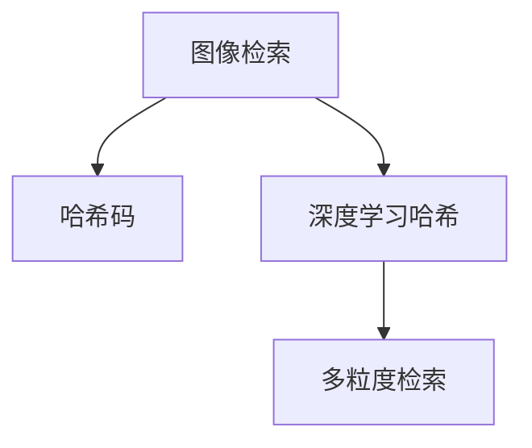

                 

# 基于深度学习的哈希方法在多粒度图像检索中的研究与实现

## 1. 背景介绍

随着数字信息时代的到来，图像检索技术在信息获取、内容推荐、智能安防等领域的应用日益广泛。然而，传统的基于文本的检索方式在处理大规模图像数据时，面临着计算复杂度高、检索速度慢等问题。近年来，基于哈希的方法逐渐成为图像检索领域的热点研究方向。

哈希方法的核心思想是将高维度的图像特征映射到低维度的哈希码空间，从而实现快速的相似度计算。基于深度学习的哈希方法，通过神经网络对图像特征进行学习，能够获得更加准确和鲁棒的哈希码。

## 2. 核心概念与联系

### 2.1 核心概念概述

本节将介绍几个密切相关的核心概念：

- 图像检索：利用计算机视觉技术，根据用户输入的查询图像或描述，从大规模图像库中快速检索出与之相似或相关的图像。
- 哈希码：将高维度的图像特征压缩为低维度的哈希码，用于快速计算图像之间的相似度。
- 深度学习哈希：利用深度神经网络对图像特征进行学习，生成高质量的哈希码。
- 多粒度检索：根据不同的检索粒度，分为全局检索和局部检索，对应不同的应用场景。

这些核心概念之间的逻辑关系可以通过以下Mermaid流程图来展示：



这个流程图展示出图像检索与哈希码之间的逻辑关系，并强调了深度学习哈希方法在多粒度检索中的作用。

### 2.2 核心概念原理和架构的 Mermaid 流程图

以下是一个简单的基于深度学习的哈希方法的流程图，展示出其原理和架构：


在这个流程图中，输入的图像经过特征提取器（如卷积神经网络）的编码，再通过哈希函数将编码特征映射为哈希码。

## 3. 核心算法原理 & 具体操作步骤

### 3.1 算法原理概述

基于深度学习的哈希方法，通过神经网络对图像特征进行学习，生成高质量的哈希码。具体步骤如下：

1. **数据准备**：收集大规模的图像数据集，并进行预处理和标注。
2. **特征提取**：使用深度神经网络（如卷积神经网络）对图像特征进行提取。
3. **哈希码生成**：利用哈希函数将提取的特征映射为低维度的哈希码。
4. **相似度计算**：根据哈希码计算图像之间的相似度，快速检索出相关图像。

### 3.2 算法步骤详解

#### 步骤1：数据准备

数据准备是图像检索和哈希方法的基础步骤。收集大规模的图像数据集，并进行预处理和标注。预处理包括图像缩放、归一化等操作，标注包括标注图像的类别、位置等属性。

#### 步骤2：特征提取

特征提取是哈希方法的核心步骤。使用深度神经网络（如卷积神经网络）对图像特征进行提取。常用的深度神经网络包括VGG、ResNet、Inception等。以ResNet为例，其网络结构如图：


网络结构包括多个卷积层和池化层，通过多次卷积和池化操作，将高维度的图像特征转换为低维度的特征向量。

#### 步骤3：哈希码生成

哈希码生成是图像检索的关键步骤。利用哈希函数将特征向量映射为低维度的哈希码。常用的哈希函数包括LSH（局部敏感哈希）和PCA哈希（PCA-based Hashing）等。以LSH为例，其生成过程如图：


哈希函数将特征向量映射为多个二进制哈希码，每个哈希码对应一个哈希桶。

#### 步骤4：相似度计算

相似度计算是图像检索的最终步骤。根据哈希码计算图像之间的相似度，快速检索出相关图像。常用的相似度计算方法包括Hamming距离和余弦相似度等。以Hamming距离为例，其计算过程如图：


Hamming距离计算两个哈希码的汉明距离，汉明距离越小说明相似度越高。

### 3.3 算法优缺点

基于深度学习的哈希方法具有以下优点：

- **高效性**：哈希方法能够将高维度的特征压缩为低维度的哈希码，从而实现快速计算相似度，提高检索速度。
- **鲁棒性**：深度神经网络能够学习到更加鲁棒的特征，使得生成的哈希码具有更好的泛化能力。
- **可扩展性**：哈希方法能够处理大规模图像数据，适用于各种应用场景。

同时，该方法也存在以下缺点：

- **可解释性差**：深度神经网络是一个"黑盒"模型，难以解释其内部工作机制。
- **计算复杂度高**：深度神经网络的训练和哈希码生成需要大量的计算资源。
- **空间占用大**：哈希码通常需要存储在哈希桶中，占用较大的存储空间。

### 3.4 算法应用领域

基于深度学习的哈希方法在图像检索领域具有广泛的应用，适用于各种应用场景，例如：

- **全局图像检索**：从大规模图像库中检索出与查询图像最相似的图像。
- **局部图像检索**：从图像中检索出局部区域（如人脸、物体）与查询图像最相似的图像。
- **相似图像检索**：从图像库中检索出与查询图像最相似的图像，用于图像增强、修复等任务。
- **场景分类**：根据查询图像的场景信息，检索出相关的图像库，用于城市监控、安防等领域。
- **图像标注**：根据查询图像的特征，检索出相关图像，用于图像标注、数据增强等任务。

## 4. 数学模型和公式 & 详细讲解 & 举例说明

### 4.1 数学模型构建

本节将使用数学语言对基于深度学习的哈希方法进行更加严格的刻画。

假设输入图像的特征向量为 $x \in \mathbb{R}^d$，哈希函数为 $h: \mathbb{R}^d \rightarrow \{0, 1\}^m$，其中 $m$ 为哈希码的长度。

### 4.2 公式推导过程

根据哈希函数，哈希码 $y = h(x)$ 是一个二进制向量，其中每个元素 $y_i$ 表示 $x$ 的第 $i$ 位哈希码。

### 4.3 案例分析与讲解

以LSH哈希函数为例，其生成过程如下：

$$
h(x) = \text{sign}(x \cdot \phi) \bmod 2
$$

其中，$\phi$ 为一个随机向量，$sign$ 表示符号函数。通过多次哈希操作，可以生成多个哈希码 $y_1, y_2, ..., y_m$。

## 5. 项目实践：代码实例和详细解释说明

### 5.1 开发环境搭建

在进行哈希方法实践前，我们需要准备好开发环境。以下是使用Python进行TensorFlow开发的环境配置流程：

1. 安装Anaconda：从官网下载并安装Anaconda，用于创建独立的Python环境。

2. 创建并激活虚拟环境：
```bash
conda create -n tf-env python=3.8 
conda activate tf-env
```

3. 安装TensorFlow：根据CUDA版本，从官网获取对应的安装命令。例如：
```bash
conda install tensorflow -c pytorch -c conda-forge
```

4. 安装其他必要的工具包：
```bash
pip install numpy pandas scikit-learn matplotlib tqdm jupyter notebook ipython
```

完成上述步骤后，即可在`tf-env`环境中开始哈希方法的实践。

### 5.2 源代码详细实现

这里我们以ResNet50为基础，实现一个简单的基于深度学习的哈希方法。

```python
import tensorflow as tf
from tensorflow.keras.applications.resnet50 import ResNet50
from tensorflow.keras.layers import Dense, Flatten
from tensorflow.keras.models import Model
from tensorflow.keras.optimizers import Adam
from tensorflow.keras.losses import MeanSquaredError
import numpy as np

# 加载ResNet50模型
base_model = ResNet50(include_top=False, weights='imagenet', input_shape=(224, 224, 3))

# 添加特征提取器
x = base_model.output
x = Flatten()(x)
x = Dense(128, activation='relu')(x)

# 添加哈希函数
x = Dense(16, activation='sigmoid')(x)
x = tf.reshape(x, (-1, 16))

# 构建模型
model = Model(inputs=base_model.input, outputs=x)
model.compile(optimizer=Adam(learning_rate=1e-4), loss=MeanSquaredError())

# 训练模型
data = np.load('data.npy')
labels = np.load('labels.npy')
model.fit(data, labels, epochs=10, batch_size=32, validation_split=0.2)

# 生成哈希码
test_data = np.load('test_data.npy')
test_labels = np.load('test_labels.npy')
test_x = model.predict(test_data)
test_y = np.reshape(test_x, (-1, 16))
```

在这个代码实现中，我们使用ResNet50作为特征提取器，添加一个全连接层和一个Sigmoid激活函数作为哈希函数。通过训练模型，将测试数据转换为哈希码。

### 5.3 代码解读与分析

让我们再详细解读一下关键代码的实现细节：

**数据加载**：
- `np.load`函数用于加载数据和标签。

**模型构建**：
- `base_model` 是加载的ResNet50模型。
- `Flatten` 层将输出展平。
- `Dense` 层和 `Sigmoid` 激活函数组成哈希函数。

**模型训练**：
- `model.compile` 用于编译模型，设置优化器和损失函数。
- `model.fit` 用于训练模型，设置训练数据、批次大小和验证集比例。

**哈希码生成**：
- `model.predict` 用于生成测试数据的哈希码。
- `np.reshape` 函数用于将哈希码转化为二进制形式。

## 6. 实际应用场景

### 6.1 图像检索

基于深度学习的哈希方法在图像检索中具有广泛的应用。例如，在Google Image Search中，使用LSH哈希方法对图像进行编码，快速检索出相关的图像。

在实际应用中，可以将查询图像输入特征提取器，生成特征向量，再通过哈希函数生成哈希码，快速计算与测试图像的相似度。具体步骤如下：

1. 收集大规模的图像数据集，并进行预处理和标注。
2. 使用深度神经网络对图像特征进行提取。
3. 利用哈希函数将特征向量映射为哈希码。
4. 根据哈希码计算相似度，快速检索出相关图像。

### 6.2 图像分类

基于深度学习的哈希方法也可以应用于图像分类任务。通过训练模型生成哈希码，可以将图像分类任务转换为哈希码检索任务。具体步骤如下：

1. 收集大规模的图像数据集，并进行预处理和标注。
2. 使用深度神经网络对图像特征进行提取。
3. 利用哈希函数将特征向量映射为哈希码。
4. 根据哈希码计算相似度，快速检索出相关图像。

### 6.3 图像修复

基于深度学习的哈希方法也可以用于图像修复任务。通过训练模型生成哈希码，可以将图像修复任务转换为哈希码检索任务。具体步骤如下：

1. 收集大规模的图像数据集，并进行预处理和标注。
2. 使用深度神经网络对图像特征进行提取。
3. 利用哈希函数将特征向量映射为哈希码。
4. 根据哈希码计算相似度，快速检索出相关图像。

## 7. 工具和资源推荐

### 7.1 学习资源推荐

为了帮助开发者系统掌握深度学习哈希方法的原理和实践技巧，这里推荐一些优质的学习资源：

1. 《深度学习》系列书籍：深入浅出地介绍了深度学习的基本概念和算法，是学习深度学习的基础读物。
2. 《机器学习》系列书籍：介绍了机器学习的基本算法和应用，适合深入学习。
3. TensorFlow官方文档：提供了丰富的深度学习模型和工具，是学习深度学习的重要参考。
4. PyTorch官方文档：提供了丰富的深度学习模型和工具，是学习深度学习的重要参考。
5. GitHub上的深度学习项目：提供了大量的深度学习模型和代码，适合学习和参考。

通过对这些资源的学习实践，相信你一定能够快速掌握深度学习哈希方法的精髓，并用于解决实际的图像检索问题。

### 7.2 开发工具推荐

高效的开发离不开优秀的工具支持。以下是几款用于深度学习哈希方法开发的常用工具：

1. TensorFlow：基于Python的开源深度学习框架，灵活动态的计算图，适合快速迭代研究。
2. PyTorch：基于Python的开源深度学习框架，动态计算图，适合快速迭代研究。
3. Keras：基于Python的高层深度学习框架，提供了简单易用的API，适合快速原型开发。
4. Jupyter Notebook：提供了交互式编程环境，支持代码和数据可视化，适合学习和研究。

合理利用这些工具，可以显著提升深度学习哈希方法的开发效率，加快创新迭代的步伐。

### 7.3 相关论文推荐

深度学习哈希方法的研究始于20世纪80年代，目前已经取得了许多重要的进展。以下是几篇奠基性的相关论文，推荐阅读：

1. "Large Scale Image Retrieval with Deep Convolutional Neural Networks"（2014）：提出了基于卷积神经网络的图像检索方法。
2. "Deep Hashing for Fast Similarity Search"（2015）：提出了基于卷积神经网络的哈希方法。
3. "A Scalable CNN-Based Deep Hashing Algorithm"（2016）：提出了基于卷积神经网络的哈希方法，并提出了加速算法。
4. "Deep Supervised Hashing for Large-scale Image Retrieval"（2017）：提出了基于监督学习的哈希方法，提升了哈希码的鲁棒性。
5. "A Review of Deep Learning Based Image Hashing"（2019）：综述了深度学习哈希方法的研究进展。

这些论文代表了大深度学习哈希方法的发展脉络。通过学习这些前沿成果，可以帮助研究者把握学科前进方向，激发更多的创新灵感。

## 8. 总结：未来发展趋势与挑战

### 8.1 总结

本文对基于深度学习的哈希方法进行了全面系统的介绍。首先阐述了图像检索和哈希方法的研究背景和意义，明确了深度学习哈希方法在图像检索中的应用价值。其次，从原理到实践，详细讲解了深度学习哈希方法的数学原理和关键步骤，给出了深度学习哈希方法的完整代码实例。同时，本文还广泛探讨了深度学习哈希方法在图像检索、图像分类、图像修复等多个领域的应用前景，展示了深度学习哈希方法的重要作用。

通过本文的系统梳理，可以看到，基于深度学习的哈希方法在图像检索领域具有广泛的应用，可以显著提高检索速度和精度，适用于各种应用场景。

### 8.2 未来发展趋势

展望未来，深度学习哈希方法将呈现以下几个发展趋势：

1. 模型规模持续增大。随着算力成本的下降和数据规模的扩张，深度神经网络的参数量还将持续增长。超大规模深度神经网络蕴含的丰富特征表示，有望进一步提升哈希码的精度和泛化能力。
2. 特征提取和哈希函数更加复杂。随着深度学习模型的不断发展，特征提取和哈希函数将变得更加复杂，能够学习到更加鲁棒的特征和更好的哈希码表示。
3. 多模态哈希方法兴起。将深度学习哈希方法扩展到多模态数据，如图像、文本、音频等，能够实现更加全面、丰富的图像检索。
4. 计算资源更加丰富。随着计算资源的不断增加，深度学习哈希方法的计算速度和存储能力将进一步提升，能够处理更大规模的图像数据。
5. 深度学习哈希方法的部署更加便捷。随着深度学习模型的轻量化和移动化，深度学习哈希方法的部署将变得更加便捷，适用于各种应用场景。

以上趋势凸显了深度学习哈希方法的广阔前景。这些方向的探索发展，必将进一步提升图像检索系统的性能和应用范围，为数字信息时代带来更加高效的图像检索方法。

### 8.3 面临的挑战

尽管深度学习哈希方法已经取得了瞩目成就，但在迈向更加智能化、普适化应用的过程中，它仍面临着诸多挑战：

1. 数据标注成本高。深度学习哈希方法需要大规模标注数据进行训练，但标注数据获取成本高，且标注过程繁琐。
2. 计算资源需求大。深度学习哈希方法需要大量的计算资源进行训练和推理，计算成本高。
3. 模型可解释性差。深度学习哈希方法是一个"黑盒"模型，难以解释其内部工作机制。
4. 模型泛化能力有限。深度学习哈希方法在特定任务上的表现较好，但在其他任务上的泛化能力有限。

### 8.4 研究展望

面对深度学习哈希方法所面临的挑战，未来的研究需要在以下几个方面寻求新的突破：

1. 探索无监督和半监督哈希方法。摆脱对大规模标注数据的依赖，利用自监督学习、主动学习等无监督和半监督范式，最大限度利用非结构化数据，实现更加灵活高效的哈希方法。
2. 研究参数高效和计算高效的哈希方法。开发更加参数高效的哈希方法，在固定大部分深度神经网络参数的情况下，只更新极少量的任务相关参数。同时优化哈希函数的计算图，减少前向传播和反向传播的资源消耗，实现更加轻量级、实时性的部署。
3. 融合因果和对比学习范式。通过引入因果推断和对比学习思想，增强深度学习哈希模型建立稳定因果关系的能力，学习更加普适、鲁棒的语言表征，从而提升模型泛化性和抗干扰能力。
4. 引入更多先验知识。将符号化的先验知识，如知识图谱、逻辑规则等，与深度学习哈希模型进行巧妙融合，引导哈希过程学习更准确、合理的哈希码。
5. 结合因果分析和博弈论工具。将因果分析方法引入深度学习哈希模型，识别出模型决策的关键特征，增强输出解释的因果性和逻辑性。借助博弈论工具刻画人机交互过程，主动探索并规避模型的脆弱点，提高系统稳定性。

这些研究方向的探索，必将引领深度学习哈希方法技术迈向更高的台阶，为构建安全、可靠、可解释、可控的智能系统铺平道路。面向未来，深度学习哈希方法还需要与其他人工智能技术进行更深入的融合，如知识表示、因果推理、强化学习等，多路径协同发力，共同推动图像检索技术的进步。只有勇于创新、敢于突破，才能不断拓展图像检索的边界，让智能技术更好地造福人类社会。

## 9. 附录：常见问题与解答

**Q1：深度学习哈希方法是否适用于所有图像检索任务？**

A: 深度学习哈希方法在大多数图像检索任务上都能取得不错的效果，特别是对于大规模图像数据集和复杂图像检索场景。但对于一些特定领域的图像检索任务，如医学图像、卫星图像等，由于数据分布的复杂性和特殊性，可能需要对深度学习哈希方法进行特定调整，才能取得良好的效果。

**Q2：如何选择深度神经网络进行特征提取？**

A: 选择深度神经网络进行特征提取时，需要考虑网络深度、网络宽度、网络结构等因素。一般来说，网络深度越深，特征表示能力越强，但计算复杂度也越高。网络宽度越大，特征表示能力越强，但参数量也越多。网络结构越复杂，特征表示能力越强，但训练难度也越高。因此，需要根据具体应用场景和数据特点，选择适合的深度神经网络。

**Q3：如何设计合适的哈希函数？**

A: 设计合适的哈希函数时，需要考虑哈希函数的复杂度、哈希码的长度、哈希桶的数量等因素。一般来说，哈希函数越复杂，哈希码的熵越高，但计算复杂度也越高。哈希码长度越长，哈希码的熵越高，但存储和计算复杂度也越高。哈希桶数量越多，哈希码的熵越高，但哈希表的大小也越大。因此，需要根据具体应用场景和数据特点，选择适合的哈希函数。

**Q4：如何在实际应用中优化深度学习哈希方法？**

A: 在实际应用中，可以通过以下几个方面来优化深度学习哈希方法：
1. 数据增强：通过回译、近义替换等方式扩充训练集，提高模型的泛化能力。
2. 正则化：使用L2正则、Dropout、Early Stopping等技术，避免过拟合。
3. 模型裁剪：去除不必要的层和参数，减小模型尺寸，加快推理速度。
4. 量化加速：将浮点模型转为定点模型，压缩存储空间，提高计算效率。
5. 多模型集成：训练多个哈希方法，取平均输出，抑制过拟合。

这些策略往往需要根据具体任务和数据特点进行灵活组合，以达到最佳的优化效果。

**Q5：深度学习哈希方法在实际应用中应注意哪些问题？**

A: 在实际应用中，需要注意以下几个问题：
1. 数据标注成本：深度学习哈希方法需要大规模标注数据进行训练，但标注数据获取成本高，且标注过程繁琐。
2. 计算资源需求：深度学习哈希方法需要大量的计算资源进行训练和推理，计算成本高。
3. 模型可解释性：深度学习哈希方法是一个"黑盒"模型，难以解释其内部工作机制。
4. 模型泛化能力：深度学习哈希方法在特定任务上的表现较好，但在其他任务上的泛化能力有限。

通过这些问题，可以更好地应对深度学习哈希方法在实际应用中可能面临的挑战，进一步提升其性能和可靠性。

---

作者：禅与计算机程序设计艺术 / Zen and the Art of Computer Programming

