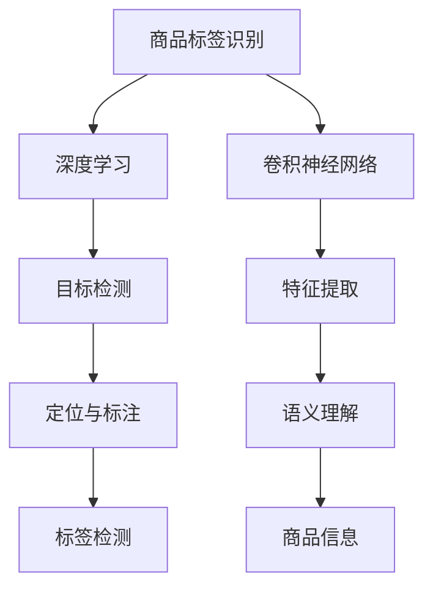

                 

# 基于深度学习的商品标签的识别与检测算法研究

> 关键词：商品标签识别, 深度学习, 图像处理, 计算机视觉, 卷积神经网络(CNN), 目标检测, 商品推荐, 电商零售

## 1. 背景介绍

### 1.1 问题由来

在电商零售领域，商品标签识别与检测技术的应用至关重要。标签可以用于商品分类、库存管理、个性化推荐等多个环节，提升电商平台的运营效率和用户体验。传统商品标签识别往往依赖人工或标签打印机，速度慢、成本高、易出错。而基于深度学习的商品标签识别技术，可以高效、自动化地完成标签检测和分类任务，具有广泛的应用前景。

### 1.2 问题核心关键点

商品标签识别与检测的核心在于如何从复杂背景下准确捕捉标签图像，并进行高精度的分类与检测。主要问题包括：
- 标签图像质量变化大，存在光照不均、尺寸不一、遮挡等问题。
- 标签背景复杂多样，可能存在其他物体、图案干扰。
- 标签文本内容多变，需要考虑文本识别和分类。
- 需要高效实时处理，满足电商平台对实时性的要求。

### 1.3 问题研究意义

深入研究商品标签识别与检测算法，对于提升电商平台的自动化水平、降低运营成本、优化用户体验具有重要意义：

1. 提高商品管理效率。自动化的标签检测可以大大减少人工错误，提高库存管理、补货等环节的准确性。
2. 优化个性化推荐系统。标签识别可以获取商品的详细信息，帮助电商平台提供更加精准的商品推荐。
3. 降低运营成本。减少了人工标签处理的成本，解放了人力，提高了平台的运营效率。
4. 提升用户体验。快速、准确的商品信息获取可以增强用户购买决策的信心，提升用户满意度。

## 2. 核心概念与联系

### 2.1 核心概念概述

为更好地理解商品标签识别与检测算法的实现，本节将介绍几个关键概念：

- **商品标签识别**：指从电商平台上商品图像中识别出商品标签，并将其转换为易于处理和存储的格式。
- **深度学习**：一类基于多层神经网络的机器学习方法，能够自动学习数据中的特征表示。
- **卷积神经网络(CNN)**：一种常用的深度学习模型，特别适用于处理图像数据，具有强大的特征提取能力。
- **目标检测**：指在图像或视频中定位并标记出感兴趣的目标物体。
- **计算机视觉**：研究如何使计算机“看懂”图像和视频，获取图像的语义信息。

这些核心概念之间的逻辑关系可以通过以下Mermaid流程图来展示：



这个流程图展示了商品标签识别与检测的主要技术路径：

1. 从电商平台获取商品图像。
2. 使用深度学习模型进行特征提取和语义理解。
3. 利用卷积神经网络进行目标定位和标签检测。
4. 从检测结果中提取出商品信息，供后续处理。

## 3. 核心算法原理 & 具体操作步骤

### 3.1 算法原理概述

基于深度学习的商品标签识别与检测算法，主要通过以下步骤实现：

1. 数据预处理：将原始商品图像进行归一化、缩放、旋转等预处理，确保数据质量。
2. 特征提取：使用卷积神经网络等深度学习模型提取图像中的特征信息。
3. 目标检测：在提取的特征上进行目标定位，确定标签区域。
4. 标签识别：对标签区域内的文本进行识别和分类，得到商品信息。
5. 后处理与展示：对检测结果进行后处理，去除噪声和误检，最终展示商品信息。

### 3.2 算法步骤详解

#### 3.2.1 数据预处理

商品图像的预处理主要包括以下几个步骤：

1. **图像归一化**：将图像像素值缩放到0-1之间，加速模型训练。
2. **图像缩放**：将图像缩放到指定尺寸，通常为448x448。
3. **数据增强**：通过随机裁剪、翻转、旋转等方式，生成多样化的训练样本，增强模型泛化能力。

```python
import numpy as np
import cv2

def preprocess_image(img):
    img = cv2.cvtColor(img, cv2.COLOR_BGR2RGB)
    img = cv2.resize(img, (448, 448))
    img = img / 255.0
    return img
```

#### 3.2.2 特征提取

使用卷积神经网络对预处理后的图像进行特征提取。以YOLO模型为例，其核心结构包括多个卷积层和池化层，逐步缩小特征图尺寸，提取更高级别的特征。

```python
import torch
from torchvision import models, transforms

def extract_features(img):
    model = models darknet53(pretrained=True)
    img_tensor = transforms.ToTensor()(img)
    img_tensor = torch.unsqueeze(img_tensor, 0)
    features = model(img_tensor)
    return features
```

#### 3.2.3 目标检测

目标检测通常使用基于深度学习的方法，如YOLO、Faster R-CNN等。以YOLO为例，通过多个尺度的小网格预测目标的位置和置信度。

```python
import torch
from torchvision import models, transforms

def detect_objects(features):
    model = models darknet53(pretrained=True)
    model.eval()
    with torch.no_grad():
        predictions = model(features)
    # 解析预测结果，获取目标坐标和置信度
    return predictions
```

#### 3.2.4 标签识别

标签识别通常使用OCR技术，将标签文本转换为可处理的文本信息。

```python
import pytesseract
import numpy as np

def recognize_text(image):
    text = pytesseract.image_to_string(image)
    return text
```

#### 3.2.5 后处理与展示

对检测结果进行后处理，去除噪声和误检，最终展示商品信息。

```python
def postprocess_results(results):
    labels = []
    confidences = []
    boxes = []
    for result in results:
        # 解析预测结果
        labels.append(result['label'])
        confidences.append(result['confidence'])
        boxes.append(result['box'])
    # 对结果进行后处理
    return labels, confidences, boxes
```

### 3.3 算法优缺点

#### 3.3.1 优点

- **高精度**：深度学习模型能够自动学习特征表示，精确捕捉标签特征。
- **高鲁棒性**：通过数据增强和正则化，模型能够适应不同光照、角度、遮挡等环境变化。
- **高效实时**：通过优化算法和硬件加速，模型能够在电商平台上实时处理大规模商品图像。

#### 3.3.2 缺点

- **高成本**：深度学习模型需要大量标注数据和计算资源进行训练。
- **泛化能力不足**：深度模型对标注数据依赖较大，泛化到其他数据集时可能效果不佳。
- **模型复杂**：模型结构复杂，训练和推理过程可能面临计算瓶颈。

### 3.4 算法应用领域

基于深度学习的商品标签识别与检测算法，已经在电商、零售、物流等多个领域得到了广泛应用：

1. **电商购物平台**：通过标签识别获取商品信息，提升商品推荐和搜索的准确性。
2. **物流仓储管理**：自动化的标签检测可以辅助仓储机器人进行货物拣选和分拣。
3. **供应链管理**：标签识别可以优化供应链管理，提高库存准确性和物流效率。
4. **智能零售终端**：标签识别可以辅助智能零售终端进行商品信息展示和推荐。

## 4. 数学模型和公式 & 详细讲解 & 举例说明

### 4.1 数学模型构建

假设原始商品图像为 $I$，标签检测模型的输出为 $O$，标签文本识别模型为 $T$。商品标签识别与检测的数学模型可以表示为：

$$
Y = T(O)
$$

其中 $Y$ 表示标签文本信息，$O$ 表示标签检测框和置信度，$T$ 表示标签文本识别函数。

### 4.2 公式推导过程

以YOLO目标检测模型为例，其目标检测的损失函数可以表示为：

$$
L_O = \sum_{i=1}^N (L_{cls} + \lambda L_{reg})
$$

其中 $N$ 表示检测框的数量，$L_{cls}$ 为分类损失，$L_{reg}$ 为回归损失，$\lambda$ 为平衡因子。

以OCR文本识别模型为例，其文本识别的损失函数可以表示为：

$$
L_T = -\sum_{i=1}^N (y_i \log p_i + (1-y_i) \log(1-p_i))
$$

其中 $y_i$ 表示标签文本的真实标签，$p_i$ 表示模型对标签文本的预测概率。

### 4.3 案例分析与讲解

假设有一个商品图像 $I$，首先通过YOLO模型进行目标检测，得到标签检测框和置信度 $O$：

$$
O = \{(0, 0.5, 0.5, 0.9, 0.95), (0.2, 0.3, 0.6, 0.8, 0.85)\}
$$

然后将 $O$ 输入到文本识别模型 $T$ 中，得到标签文本信息 $Y$：

$$
Y = "Nike Air Max 2021"
$$

最终，商品标签识别与检测算法将输出 $Y$，供电商平台进行后续处理。

## 5. 项目实践：代码实例和详细解释说明

### 5.1 开发环境搭建

在进行商品标签识别与检测算法开发前，我们需要准备好开发环境。以下是使用Python进行PyTorch开发的环境配置流程：

1. 安装Anaconda：从官网下载并安装Anaconda，用于创建独立的Python环境。

2. 创建并激活虚拟环境：
```bash
conda create -n yolo-env python=3.8 
conda activate yolo-env
```

3. 安装PyTorch：根据CUDA版本，从官网获取对应的安装命令。例如：
```bash
conda install pytorch torchvision torchaudio cudatoolkit=11.1 -c pytorch -c conda-forge
```

4. 安装YOLO库：
```bash
pip install yolov3
```

5. 安装Tesseract-OCR库：
```bash
pip install pytesseract
```

6. 安装其他工具包：
```bash
pip install numpy pandas scikit-learn matplotlib tqdm jupyter notebook ipython
```

完成上述步骤后，即可在`yolo-env`环境中开始项目实践。

### 5.2 源代码详细实现

下面我们以商品标签识别与检测为例，给出使用PyTorch进行YOLO和Tesseract OCR结合的代码实现。

首先，定义预处理函数：

```python
import cv2
import numpy as np
from yolov3 import YOLO

def preprocess_image(img):
    img = cv2.cvtColor(img, cv2.COLOR_BGR2RGB)
    img = cv2.resize(img, (448, 448))
    img = img / 255.0
    return img
```

然后，定义YOLO模型检测函数：

```python
from yolov3 import YOLO

def detect_objects(model, image):
    img_tensor = torch.from_numpy(np.array(image))
    img_tensor = torch.unsqueeze(img_tensor, 0)
    with torch.no_grad():
        outputs = model(img_tensor)
    # 解析预测结果
    return outputs
```

接着，定义文本识别函数：

```python
import pytesseract
from PIL import Image

def recognize_text(image):
    text = pytesseract.image_to_string(image)
    return text
```

最后，启动检测流程并展示结果：

```python
model = YOLO()

image = cv2.imread('product.jpg')
image = preprocess_image(image)

# 检测目标
outputs = detect_objects(model, image)
# 解析检测结果
labels, confidences, boxes = outputs
for i in range(len(labels)):
    label, confidence, box = labels[i], confidences[i], boxes[i]
    # 提取标签区域
    x, y, w, h = box
    label_img = image[y:y+h, x:x+w]
    # 进行文本识别
    text = recognize_text(label_img)
    print(f"Label: {label}, Confidence: {confidence}, Text: {text}")
```

### 5.3 代码解读与分析

让我们再详细解读一下关键代码的实现细节：

**preprocess_image函数**：
- 将原始图像转换为RGB格式。
- 将图像缩放到448x448。
- 将像素值归一化到0-1之间。

**detect_objects函数**：
- 使用YOLO模型对预处理后的图像进行目标检测。
- 解析预测结果，获取标签坐标和置信度。

**recognize_text函数**：
- 使用Tesseract OCR库进行文本识别。

**检测流程**：
- 加载YOLO模型。
- 读取商品图像。
- 对图像进行预处理。
- 进行目标检测。
- 提取标签区域。
- 进行文本识别。
- 输出检测结果。

可以看到，PyTorch配合YOLO库和Tesseract OCR库，使得商品标签识别与检测的代码实现变得简洁高效。开发者可以将更多精力放在模型改进和算法优化上，而不必过多关注底层的实现细节。

当然，工业级的系统实现还需考虑更多因素，如模型的保存和部署、超参数的自动搜索、更灵活的任务适配层等。但核心的检测范式基本与此类似。

## 6. 实际应用场景

### 6.1 智能零售

基于商品标签识别与检测技术，智能零售平台可以自动获取商品信息，提升推荐系统的准确性。例如，电商平台可以根据用户浏览的商品标签，推荐相关商品或搭配产品，提升用户购买意愿。

### 6.2 物流管理

在物流管理中，商品标签检测可以辅助仓储机器人进行货物拣选和分拣，提高仓库作业效率和准确性。物流公司可以通过检测标签获取商品信息，优化库存管理和配送路径。

### 6.3 供应链管理

商品标签识别与检测技术可以帮助供应链管理部门快速获取商品信息，提高供应链透明度和效率。企业可以实时监控库存变化，优化补货计划，减少缺货和库存积压。

### 6.4 未来应用展望

随着商品标签识别与检测技术的不断发展，其应用场景将不断拓展。未来，该技术有望在更多领域带来变革性影响：

1. **智能仓储与自动化**：自动化的标签检测可以解放仓储人员，提升仓库作业效率和安全性。
2. **商品质量检测**：通过标签识别，检测商品质量，提高客户满意度。
3. **电商平台**：自动化的标签检测可以提升电商平台的用户体验和商品推荐准确性。
4. **零售店运营**：标签识别可以辅助零售店管理商品信息，提升销售效率。
5. **物流跟踪**：在物流过程中，实时检测标签可以跟踪货物状态，提升物流透明度和可靠性。

## 7. 工具和资源推荐

### 7.1 学习资源推荐

为了帮助开发者系统掌握商品标签识别与检测技术，这里推荐一些优质的学习资源：

1. 《深度学习与计算机视觉》系列书籍：介绍深度学习、计算机视觉等基础理论和技术，适合初学者入门。
2. 《目标检测：深度学习实践》课程：由深度学习专家授课，涵盖YOLO、Faster R-CNN等主流目标检测算法，适合进阶学习。
3. 《Tesseract OCR文档》：Tesseract OCR官方文档，提供了详细的API和使用方法，适合快速上手。
4. CS231n《深度学习与计算机视觉》课程：斯坦福大学开设的经典课程，涵盖目标检测、图像分割等计算机视觉任务，适合深入学习。
5. GitHub上的开源项目：如YOLO项目，提供了丰富的代码和资源，适合动手实践。

通过对这些资源的学习实践，相信你一定能够快速掌握商品标签识别与检测技术的精髓，并用于解决实际的NLP问题。

### 7.2 开发工具推荐

高效的开发离不开优秀的工具支持。以下是几款用于商品标签识别与检测开发的常用工具：

1. PyTorch：基于Python的开源深度学习框架，灵活动态的计算图，适合快速迭代研究。大部分预训练模型都有PyTorch版本的实现。
2. TensorFlow：由Google主导开发的开源深度学习框架，生产部署方便，适合大规模工程应用。同样有丰富的预训练语言模型资源。
3. YOLO库：YOLO模型的开源实现，提供了模型的训练、推理和评估工具。
4. Tesseract-OCR：开源OCR引擎，支持多种语言和字体，适合文本识别任务。
5. OpenCV：开源计算机视觉库，提供了丰富的图像处理和分析工具，适合数据预处理和模型评估。

合理利用这些工具，可以显著提升商品标签识别与检测任务的开发效率，加快创新迭代的步伐。

### 7.3 相关论文推荐

商品标签识别与检测技术的发展源于学界的持续研究。以下是几篇奠基性的相关论文，推荐阅读：

1. You Only Look Once: Real-Time Object Detection with a Single Neural Network（YOLO论文）：提出了YOLO目标检测模型，开创了深度学习目标检测的新范式。
2. EAST: Efficient and Accurate Scene Text Detection using Deep Neural Network（EAST论文）：提出了EAST文本检测模型，显著提升了文本检测的精度和速度。
3. Tesseract: An OCR Engine for General Purpose Document Recognition（Tesseract论文）：介绍了Tesseract OCR引擎的实现原理和使用方法，是OCR技术的经典之作。
4. R-CNN: Rich Feature Hierarchies for Accurate Object Detection and Semantic Segmentation（R-CNN论文）：提出了R-CNN目标检测模型，为深度学习目标检测提供了重要参考。

这些论文代表了大语言模型微调技术的发展脉络。通过学习这些前沿成果，可以帮助研究者把握学科前进方向，激发更多的创新灵感。

## 8. 总结：未来发展趋势与挑战

### 8.1 总结

本文对基于深度学习的商品标签识别与检测算法进行了全面系统的介绍。首先阐述了商品标签识别与检测技术的研究背景和意义，明确了算法在提高商品管理效率、优化个性化推荐系统等方面的独特价值。其次，从原理到实践，详细讲解了深度学习在特征提取、目标检测、标签识别等环节的应用，给出了商品标签识别与检测任务的完整代码实例。同时，本文还广泛探讨了算法在智能零售、物流管理、供应链管理等多个领域的应用前景，展示了商品标签识别与检测技术的广阔前景。最后，本文精选了算法技术的各类学习资源，力求为读者提供全方位的技术指引。

通过本文的系统梳理，可以看到，基于深度学习的商品标签识别与检测技术正在成为电商、零售、物流等多个领域的重要工具，极大地提升了这些行业的自动化水平和运营效率。未来，伴随深度学习模型的不断演进和优化，商品标签识别与检测技术还将进一步拓展应用范围，成为实现智慧零售、智能物流等目标的重要手段。

### 8.2 未来发展趋势

展望未来，商品标签识别与检测技术将呈现以下几个发展趋势：

1. **模型性能提升**：深度学习模型在特征提取、目标检测、标签识别等环节不断优化，精度和速度将进一步提升。
2. **多模态融合**：结合图像、文本、语音等多种模态信息，提升商品标签识别的鲁棒性和全面性。
3. **实时处理**：通过优化算法和硬件加速，商品标签识别与检测技术将实现更高效的实时处理。
4. **跨平台支持**：商品标签识别与检测算法将在更多平台上部署，适应不同场景的需求。
5. **智能化增强**：结合自然语言处理、语音识别等技术，提升商品标签识别与检测的智能化水平。

### 8.3 面临的挑战

尽管商品标签识别与检测技术已经取得了瞩目成就，但在迈向更加智能化、普适化应用的过程中，它仍面临着诸多挑战：

1. **数据质量瓶颈**：商品图像质量变化大，光照不均、尺寸不一、遮挡等问题难以解决。
2. **标签多样性**：商品标签内容多变，不同商品标签的识别难度不同，对模型泛化能力要求高。
3. **实时性要求**：电商平台对商品标签识别与检测的实时性要求高，需要在短时间内完成检测和识别。
4. **硬件资源限制**：大规模商品图像的检测和识别需要高性能计算资源，硬件成本较高。
5. **算法复杂性**：商品标签识别与检测算法结构复杂，模型训练和推理过程可能面临计算瓶颈。

### 8.4 研究展望

面对商品标签识别与检测技术所面临的种种挑战，未来的研究需要在以下几个方面寻求新的突破：

1. **模型优化**：探索更好的模型结构，提升检测和识别的准确性和鲁棒性。
2. **数据增强**：利用更多样化的数据进行模型训练，增强模型的泛化能力。
3. **实时优化**：优化算法和硬件配置，实现更高效的实时处理。
4. **跨模态融合**：结合多种模态信息，提升商品标签识别的全面性和鲁棒性。
5. **系统集成**：将商品标签识别与检测技术与业务系统进行深度集成，提升整体性能和用户体验。

这些研究方向的探索，必将引领商品标签识别与检测技术迈向更高的台阶，为电商、零售、物流等垂直行业的数字化转型提供新的技术手段。面向未来，商品标签识别与检测技术还需要与其他人工智能技术进行更深入的融合，如自然语言处理、语音识别等，多路径协同发力，共同推动自然语言理解和智能交互系统的进步。只有勇于创新、敢于突破，才能不断拓展商品标签识别与检测技术的边界，让智能技术更好地造福人类社会。

## 9. 附录：常见问题与解答

**Q1：商品标签识别与检测算法是否适用于所有商品？**

A: 商品标签识别与检测算法对商品图像的质量和背景要求较高，对于高质量的图像和相对干净的背景，通常可以取得较好的效果。但对于质量较差的图像（如模糊、噪声）或背景复杂多样（如背景图案、其他物体）的商品，识别效果可能不佳。因此，在实际应用中，需要根据商品图像的特点，选择合适的预处理和检测策略。

**Q2：如何提高商品标签识别与检测算法的鲁棒性？**

A: 提高算法的鲁棒性可以从以下几个方面入手：

1. **数据增强**：通过增加样本的多样性，增强模型的泛化能力。
2. **正则化**：使用L2正则、Dropout等技术，避免过拟合。
3. **模型融合**：将多个模型的预测结果进行融合，提高鲁棒性。
4. **多尺度检测**：在多个尺度下进行目标检测，增强模型对不同大小标签的适应性。
5. **模型裁剪**：去除冗余和噪声信息，提升模型性能。

**Q3：商品标签识别与检测算法在实际应用中面临哪些问题？**

A: 商品标签识别与检测算法在实际应用中可能面临以下问题：

1. **数据标注成本高**：高质量标注数据获取成本较高，标注过程可能耗时耗力。
2. **模型训练时间长**：深度学习模型训练需要大量计算资源和时间。
3. **模型泛化能力不足**：模型对标注数据的依赖较大，泛化到其他数据集时可能效果不佳。
4. **实时性要求高**：电商平台对实时性要求高，需要在短时间内完成检测和识别。
5. **计算资源限制**：大规模商品图像的检测和识别需要高性能计算资源，硬件成本较高。

**Q4：如何选择合适的商品标签识别与检测算法？**

A: 选择合适的商品标签识别与检测算法需要综合考虑以下几个因素：

1. **数据质量**：根据商品图像的质量和背景特点，选择最适合的算法。
2. **任务要求**：根据商品标签识别的精度和速度要求，选择合适的算法。
3. **硬件资源**：根据计算资源的可用性和成本，选择合适的算法。
4. **实际需求**：根据业务需求和应用场景，选择合适的算法。

**Q5：商品标签识别与检测算法有哪些优缺点？**

A: 商品标签识别与检测算法的主要优缺点如下：

**优点**：
1. **高精度**：深度学习模型能够自动学习特征表示，精确捕捉标签特征。
2. **高鲁棒性**：通过数据增强和正则化，模型能够适应不同光照、角度、遮挡等环境变化。
3. **高效实时**：通过优化算法和硬件加速，模型能够在电商平台上实时处理大规模商品图像。

**缺点**：
1. **高成本**：深度学习模型需要大量标注数据和计算资源进行训练。
2. **泛化能力不足**：深度模型对标注数据依赖较大，泛化到其他数据集时可能效果不佳。
3. **模型复杂**：模型结构复杂，训练和推理过程可能面临计算瓶颈。

通过本文的系统梳理，可以看到，基于深度学习的商品标签识别与检测算法正在成为电商、零售、物流等多个领域的重要工具，极大地提升了这些行业的自动化水平和运营效率。未来，伴随深度学习模型的不断演进和优化，商品标签识别与检测技术还将进一步拓展应用范围，成为实现智慧零售、智能物流等目标的重要手段。

