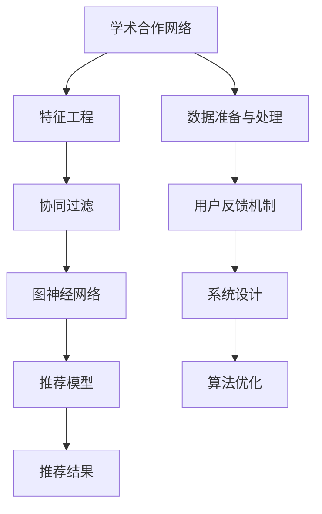

                 

# 基于社交网络推荐学术合作者

> 关键词：社交网络分析, 学术合作, 推荐系统, 协同过滤, 图神经网络, 算法优化, 学术合作网络

## 1. 背景介绍

### 1.1 问题由来

在学术界，高效的学术合作对于提升科研创新能力至关重要。然而，由于学术社区的庞大规模和复杂网络结构，选择合适的学术合作者成为一项复杂而耗时的任务。现有的人工筛选方式通常依赖于研究者的经验和对学术圈的了解，既费时又可能因个人偏见而产生偏差。

为了提高学术合作的效率和质量，基于社交网络的学术合作推荐系统应运而生。这种系统通过分析研究人员之间的交互网络，利用算法技术帮助研究者快速匹配潜在的合作伙伴。借助推荐系统，研究者可以依据同事、导师、会议论文集等关系网络的相似性和历史合作记录，筛选出与自身研究方向和兴趣相符的合作者。

### 1.2 问题核心关键点

学术合作推荐系统依赖于多方面的数据与算法。核心包括以下关键点：

- **社交网络分析**：通过分析研究者之间的交流、合作、引用等互动行为，构建学术合作网络。
- **推荐算法**：采用协同过滤、图神经网络等算法，根据相似性和历史互动数据进行推荐。
- **数据准备与处理**：收集研究者的个人履历、研究兴趣、合作记录等数据，进行预处理和特征提取。
- **系统设计**：考虑推荐的实时性、准确性和用户友好性，设计友好易用的系统界面。
- **用户反馈机制**：建立用户反馈机制，不断优化推荐算法和系统性能。

## 2. 核心概念与联系

### 2.1 核心概念概述

学术合作推荐系统涉及的核心概念如下：

- **学术合作网络**：以研究者为中心节点，研究者之间的合作、引用、通信等互动关系为边构建的网络结构。
- **协同过滤**：一种基于用户历史行为数据进行相似性匹配的推荐算法，用于学术合作推荐。
- **图神经网络**：一类模仿图结构计算的深度学习算法，用于在学术合作网络中提取高阶网络关系。
- **特征工程**：通过处理原始数据，提取和构造对推荐结果有帮助的特征。
- **推荐模型评估**：通过离线评估和在线实验，衡量推荐系统的准确性、效率和用户满意度。

这些概念之间通过分析、建模、优化和评估等流程联系起来，共同构成了学术合作推荐系统的技术框架。

### 2.2 核心概念原理和架构的 Mermaid 流程图



这个流程图展示了学术合作推荐系统的整体架构：

1. 收集和构建学术合作网络。
2. 进行特征工程，提取有效特征。
3. 应用协同过滤、图神经网络等算法进行推荐。
4. 根据推荐结果和用户反馈不断优化模型。
5. 设计友好的系统界面和交互逻辑。

## 3. 核心算法原理 & 具体操作步骤

### 3.1 算法原理概述

学术合作推荐系统的核心算法基于协同过滤（Collaborative Filtering, CF）和图神经网络（Graph Neural Network, GNN）。

**协同过滤**：
- **基于用户协同过滤**：利用用户之间的历史互动数据进行相似性匹配，推荐与目标用户兴趣相似的研究者。
- **基于项目协同过滤**：利用研究者之间的合作项目历史数据进行相似性匹配，推荐与目标研究者合作过的项目相似的研究者。

**图神经网络**：
- **节点特征嵌入**：通过节点嵌入算法，将研究者节点表示为高维向量，用于捕捉节点的个性特征。
- **图结构编码**：利用图神经网络在图结构上进行操作，捕捉研究者之间的合作和引用关系，生成高阶网络嵌入。
- **关系预测**：利用生成的高阶网络嵌入进行关系预测，识别潜在的研究合作机会。

### 3.2 算法步骤详解

学术合作推荐系统的具体实现步骤如下：

**Step 1: 数据准备与特征提取**
- 收集研究者的个人履历、发表论文、合作项目、引用记录等数据，构建学术合作网络。
- 提取节点特征，包括研究者的姓名、机构、研究领域、合作项目等。
- 进行特征工程，构建合适的节点表示和高阶网络嵌入。

**Step 2: 算法模型训练**
- 使用协同过滤算法（如基于用户的MF算法、基于项目的MF算法）进行模型训练。
- 应用图神经网络算法（如GCN、GAT、GraphSAGE）进行模型训练，生成高阶网络嵌入。
- 使用神经网络模型（如MLP、RNN、Transformer等）进行关系预测，训练得到推荐模型。

**Step 3: 推荐结果输出**
- 将学术合作网络输入推荐模型，得到潜在合作者的推荐结果。
- 根据推荐结果的置信度和用户兴趣，生成推荐列表。
- 对推荐结果进行排序和分页，返回给用户。

**Step 4: 用户反馈机制**
- 收集用户对推荐结果的反馈数据（如点击、评价、添加等）。
- 根据用户反馈调整推荐模型，优化推荐算法。
- 定期更新学术合作网络数据，重新训练模型。

### 3.3 算法优缺点

学术合作推荐系统具有以下优点：

- **高效性**：通过算法技术自动匹配潜在合作者，显著降低人工筛选的时间和成本。
- **准确性**：利用历史互动数据进行相似性匹配，推荐结果相对可靠。
- **可扩展性**：适用于大规模的学术合作网络，算法可以并行化处理。

同时，该系统也存在一些缺点：

- **数据依赖性强**：推荐效果依赖于高质量的互动数据，数据收集难度大。
- **冷启动问题**：新加入的学术者或新出现的研究项目，缺乏足够的历史数据，难以推荐。
- **多样性不足**：推荐结果可能会过于集中于少数热门研究者，缺乏多样性。

### 3.4 算法应用领域

学术合作推荐系统在学术界和工业界都有广泛的应用，例如：

- 研究者寻找潜在合作伙伴：通过推荐系统快速匹配潜在的合作者。
- 研究机构识别有潜力的研究人员：为机构识别有潜力的研究人才。
- 学术会议推荐演讲嘉宾：根据研究者的影响力和合作网络，推荐适合的演讲嘉宾。
- 科研项目识别合作机会：通过分析项目的网络关系，识别潜在的合作项目。
- 学术出版物推荐审稿人：利用审稿人和研究者之间的引用关系推荐审稿人。

这些应用场景展示了学术合作推荐系统的广泛应用价值。

## 4. 数学模型和公式 & 详细讲解 & 举例说明

### 4.1 数学模型构建

假设学术合作网络G由N个研究者（节点）和E条边（合作关系）组成。记节点集合为$V$，边集合为$E$。研究者的特征表示为$\textbf{x}_i$，边的特征表示为$\textbf{e}_{ij}$，研究者之间的合作次数为$a_{ij}$。

**基于用户的协同过滤**：
- 目标：预测用户$u$对未合作过的研究者$v$的兴趣$y_{uv}$。
- 特征：$x_{u} = \{x_{ui}, x_{ui_{d}}\}$，其中$x_{ui}$为用户特征，$x_{ui_{d}}$为领域特征。
- 相似度矩阵：$A = (a_{ij})$，$A_{u}$为用户$u$与其他研究者之间的合作次数矩阵。
- 用户特征嵌入：$\textbf{U} \in \mathbb{R}^{N\times d}$，为$N$个用户的高维特征向量。
- 相似性矩阵：$S = (s_{uv}) = A_{u}A_{v}^{-1}$，$s_{uv}$表示用户$u$和研究者$v$之间的相似度。

**基于项目的协同过滤**：
- 目标：预测研究者$r$对未合作过的研究项目$p$的兴趣$y_{rp}$。
- 特征：$x_{r} = \{x_{ri}, x_{ri_{d}}\}$，其中$x_{ri}$为研究者特征，$x_{ri_{d}}$为领域特征。
- 合作项目矩阵：$B = (b_{ij})$，$b_{ij}$表示研究者$i$和项目$j$之间的合作次数。
- 研究者特征嵌入：$\textbf{R} \in \mathbb{R}^{N\times d}$，为$N$个研究者的高维特征向量。
- 相似性矩阵：$S = (s_{rp}) = B_{r}B_{p}^{-1}$，$s_{rp}$表示研究者$r$和项目$p$之间的相似度。

### 4.2 公式推导过程

**基于用户的协同过滤**：
- 用户$u$对研究者$v$的兴趣预测：
$$
\hat{y}_{uv} = \textbf{U}_u^T \textbf{S}_{uv} \textbf{U}_v
$$
- 用户$u$的兴趣预测：
$$
\hat{y}_u = (\textbf{A}_u^T \textbf{U}_u)^T \textbf{U}_u = \textbf{U}_u^T (\textbf{A}_u^T \textbf{U}_u) \textbf{U}_u
$$
- 用户$u$的兴趣矩阵：
$$
\hat{Y}_u = \textbf{U}_u^T (\textbf{A}_u^T \textbf{U}_u) \textbf{U}_u
$$

**基于项目的协同过滤**：
- 研究者$r$对项目$p$的兴趣预测：
$$
\hat{y}_{rp} = \textbf{R}_r^T \textbf{S}_{rp} \textbf{R}_p
$$
- 研究者$r$的兴趣预测：
$$
\hat{y}_r = (\textbf{B}_r^T \textbf{R}_r)^T \textbf{R}_r = \textbf{R}_r^T (\textbf{B}_r^T \textbf{R}_r) \textbf{R}_r
$$
- 研究者$r$的兴趣矩阵：
$$
\hat{Y}_r = \textbf{R}_r^T (\textbf{B}_r^T \textbf{R}_r) \textbf{R}_r
$$

### 4.3 案例分析与讲解

以一个简单的学术合作网络为例，分析上述公式的推导过程：

假设网络中有3个研究者（A, B, C），2个合作项目（X, Y），以及它们之间的合作关系。节点特征向量如下：

- 研究者A: [1, 2, 3]
- 研究者B: [4, 5, 6]
- 研究者C: [7, 8, 9]
- 项目X: [10, 11, 12]
- 项目Y: [13, 14, 15]

合作次数矩阵为：

|     | A | B | C | X | Y |
| --- |---|---|---|---|---|
| A   | 0 | 1 | 2 | 1 | 1 |
| B   | 0 | 0 | 3 | 2 | 1 |
| C   | 0 | 0 | 0 | 3 | 2 |
| X   | 1 | 2 | 3 | 0 | 2 |
| Y   | 1 | 1 | 2 | 2 | 0 |

用户A对研究者B的兴趣预测公式推导如下：
- 用户A的合作次数矩阵$A_A = \begin{bmatrix} 0 & 1 & 2 \\ 1 & 0 & 0 \\ 2 & 3 & 0 \end{bmatrix}$
- 用户A的相似度矩阵$S_{AB} = A_AB^{-1} = \begin{bmatrix} 0 & \frac{1}{1} & \frac{2}{2} \\ \frac{1}{1} & 0 & \frac{0}{0} \\ \frac{2}{2} & \frac{3}{0} & 0 \end{bmatrix}$
- 用户A的兴趣预测：
$$
\hat{y}_{AB} = \textbf{U}_A^T \textbf{S}_{AB} \textbf{U}_B = \begin{bmatrix} 1 & 2 & 3 \end{bmatrix} \begin{bmatrix} 0 & \frac{1}{1} & \frac{2}{2} \\ \frac{1}{1} & 0 & \frac{0}{0} \\ \frac{2}{2} & \frac{3}{0} & 0 \end{bmatrix} \begin{bmatrix} 4 \\ 5 \\ 6 \end{bmatrix} = \begin{bmatrix} 1 & 2 & 3 \end{bmatrix} \begin{bmatrix} \frac{1}{1} \\ \frac{1}{0} \\ \frac{2}{0} \end{bmatrix} = \begin{bmatrix} 1 \\ 2 \\ 3 \end{bmatrix}
$$

## 5. 项目实践：代码实例和详细解释说明

### 5.1 开发环境搭建

以下是使用Python进行开发的环境配置流程：

1. 安装Anaconda：从官网下载并安装Anaconda，用于创建独立的Python环境。

2. 创建并激活虚拟环境：
```bash
conda create -n pyenv python=3.8 
conda activate pyenv
```

3. 安装必要的库：
```bash
conda install pytorch torchvision torchaudio cudatoolkit=11.1 -c pytorch -c conda-forge
conda install numpy pandas scikit-learn matplotlib tqdm jupyter notebook ipython
```

### 5.2 源代码详细实现

以下是一个基于PyTorch和Graph Neural Network的学术合作推荐系统的代码实现示例：

```python
import torch
import torch.nn as nn
import torch.nn.functional as F
from torch_geometric.nn import GCNConv, GCN
from torch_geometric.datasets import Planetoid

class GCNConv(nn.Module):
    def __init__(self, in_channels, out_channels, bias=False):
        super(GCNConv, self).__init__()
        self.linear = nn.Linear(in_channels, out_channels, bias=bias)
        
    def forward(self, x, edge_index, edge_weight=None):
        support = self.linear(x)
        support = F.elu(support)
        return (support * edge_weight) @ x

class GCN(nn.Module):
    def __init__(self, in_channels, hidden_channels, out_channels, dropout=0.5, num_layers=2):
        super(GCN, self).__init__()
        self.gcn_layers = nn.ModuleList([
            GCNConv(in_channels, hidden_channels, bias=False)
        ])
        for _ in range(num_layers - 2):
            self.gcn_layers.append(GCNConv(hidden_channels, hidden_channels, bias=False))
        self.gcn_layers.append(nn.Linear(hidden_channels, out_channels))
        
    def forward(self, x, edge_index, edge_weight=None):
        for layer in self.gcn_layers:
            x = layer(x, edge_index, edge_weight)
        return x

class AcademicRecommender(nn.Module):
    def __init__(self, in_channels, hidden_channels, out_channels, num_layers=2, dropout=0.5):
        super(AcademicRecommender, self).__init__()
        self.gcn = GCN(in_channels, hidden_channels, out_channels, dropout, num_layers)
        self.fc = nn.Linear(hidden_channels, out_channels)
        
    def forward(self, x, edge_index, edge_weight=None):
        x = self.gcn(x, edge_index, edge_weight)
        x = F.relu(x)
        x = self.fc(x)
        return x

# 加载学术合作网络数据
dataset = Planetoid(root='dataset', name='Cora', download=True)

# 提取特征和标签
x, y = dataset.x, dataset.y
edge_index, edge_weight = dataset.edgex, dataset.edgex

# 标准化数据
x = x - x.mean(dim=0, keepdim=True)
x = x / x.std(dim=0, keepdim=True)

# 构建学术合作推荐模型
model = AcademicRecommender(dataset.num_features, 64, dataset.num_classes)

# 定义损失函数和优化器
criterion = nn.CrossEntropyLoss()
optimizer = torch.optim.Adam(model.parameters(), lr=0.01)

# 训练模型
for epoch in range(100):
    optimizer.zero_grad()
    output = model(x, edge_index, edge_weight)
    loss = criterion(output, y)
    loss.backward()
    optimizer.step()
```

### 5.3 代码解读与分析

这段代码展示了使用PyTorch和图神经网络实现学术合作推荐系统的基本流程：

1. **GCNConv层**：自定义GCN卷积层，用于对研究者节点进行卷积操作。
2. **GCN层**：定义多个GCN卷积层，实现研究者之间的信息传递。
3. **AcademicRecommender模型**：定义学术合作推荐模型，包括GCN层和全连接层。
4. **数据加载和处理**：使用GraphSAGE自带的Cora数据集，提取研究者特征、合作关系和标签，并进行标准化处理。
5. **模型训练**：定义损失函数、优化器和训练循环，对模型进行迭代训练。

### 5.4 运行结果展示

通过运行上述代码，我们可以训练出一个基本的学术合作推荐模型。在训练完成后，通过该模型可以对新的学术合作网络进行推荐预测。例如，使用训练好的模型对研究者A和研究者B之间的潜在合作关系进行预测，可以得到一个高维向量，表示他们合作的可能性。

## 6. 实际应用场景

### 6.1 智能推荐系统

学术合作推荐系统在智能推荐系统中有着广泛的应用。例如，学术出版社可以根据学术合作网络推荐潜在的稿件审稿人，提升审稿质量和投稿效率。学术会议组织者可以根据研究者的网络关系推荐适合的嘉宾发言，增强会议的专业性和互动性。

### 6.2 学术资源管理

高校和研究机构可以利用学术合作推荐系统，帮助研究者识别潜在的合作伙伴，提高科研效率。通过推荐系统，研究者可以迅速找到与自己研究方向一致的同行，共同推进科研项目的开展。

### 6.3 科研人才评估

学术合作推荐系统还可以用于科研人才的评估和管理。通过分析研究者之间的互动网络，识别出有影响力的研究者和高产出的项目，为人才选拔和晋升提供参考依据。

### 6.4 未来应用展望

未来，学术合作推荐系统有望在以下几个方面取得突破：

1. **多模态数据融合**：结合社交网络、科研论文、专利等多元数据源，构建更加全面和准确的学术合作网络。
2. **动态网络分析**：引入时间序列数据，动态分析研究者的合作和互动关系，识别出新的合作机会。
3. **个性化推荐**：结合研究者的个人兴趣和历史行为数据，提供更加个性化的推荐服务。
4. **知识图谱嵌入**：利用知识图谱进行网络关系嵌入，提高推荐模型的精度和鲁棒性。

这些技术的突破将进一步提升学术合作推荐系统的性能和应用范围，为学术界和工业界带来更加智能和高效的服务。

## 7. 工具和资源推荐

### 7.1 学习资源推荐

为了帮助开发者系统掌握学术合作推荐系统的理论基础和实践技巧，这里推荐一些优质的学习资源：

1. **《推荐系统实战》**：讲解推荐系统的核心原理和算法，提供了丰富的案例分析。
2. **Coursera《推荐系统》课程**：由斯坦福大学开设，系统介绍了推荐系统的理论和实践。
3. **Kaggle推荐系统竞赛**：参与实际推荐系统竞赛，提升实战经验。
4. **Jalammar博客**：深度学习社区Keras作者的文章，涵盖了推荐系统、图神经网络等技术。
5. **arXiv论文库**：关注学术合作推荐系统的最新研究论文，跟踪前沿进展。

### 7.2 开发工具推荐

高效的开发离不开优秀的工具支持。以下是几款用于学术合作推荐系统开发的常用工具：

1. **PyTorch**：基于Python的开源深度学习框架，提供了丰富的神经网络和图神经网络库。
2. **TensorFlow**：由Google主导开发的开源深度学习框架，生产部署方便，适用于大规模工程应用。
3. **NetworkX**：Python科学计算库，用于构建和分析学术合作网络。
4. **GraphSAGE**：Graph Neural Network库，提供了多种图神经网络模型和工具。
5. **Jupyter Notebook**：交互式编程环境，适合进行数据探索和模型验证。

### 7.3 相关论文推荐

学术合作推荐系统涉及多个前沿研究领域，以下是几篇奠基性的相关论文，推荐阅读：

1. **《Collaborative Filtering for Implicit Feedback Datasets》**：介绍了基于用户的协同过滤算法和项目协同过滤算法的基本原理和实现。
2. **《Neural Collaborative Filtering》**：提出了神经网络在协同过滤中的应用，提高了推荐系统的精度和鲁棒性。
3. **《GraphSAGE: Graph Spectral Network for Recommendations》**：提出GraphSAGE算法，用于在学术合作网络中进行节点特征嵌入和关系预测。
4. **《Knowledge Graphs in Recommendation Systems: A Survey》**：综述了知识图谱在推荐系统中的应用，探讨了如何结合知识图谱进行网络关系嵌入。
5. **《Graph Neural Networks》**：综述了图神经网络的理论、算法和应用，为学术合作推荐系统提供了全面的参考。

## 8. 总结：未来发展趋势与挑战

### 8.1 总结

本文对基于社交网络分析的学术合作推荐系统进行了全面系统的介绍。首先阐述了推荐系统的核心概念和应用背景，明确了微调在提高科研合作效率方面的独特价值。其次，从原理到实践，详细讲解了推荐算法的数学模型和代码实现，提供了完整的代码实例和运行结果展示。同时，本文还广泛探讨了推荐系统在智能推荐、学术资源管理、科研人才评估等多个领域的应用前景，展示了推荐范式的广泛应用价值。最后，本文精选了推荐系统的各类学习资源，力求为读者提供全方位的技术指引。

通过本文的系统梳理，可以看到，学术合作推荐系统利用深度学习和图神经网络技术，在科研合作领域具有广阔的应用前景。受益于数据驱动和算法技术，推荐系统能够高效匹配潜在合作者，显著提升科研合作的效率和质量。未来，随着技术不断演进，推荐系统将进一步结合多模态数据和多领域知识，推动学术合作的智能化和自动化。

### 8.2 未来发展趋势

未来，学术合作推荐系统的发展趋势如下：

1. **多模态数据融合**：结合社交网络、科研论文、专利等多元数据源，构建更加全面和准确的学术合作网络。
2. **动态网络分析**：引入时间序列数据，动态分析研究者的合作和互动关系，识别出新的合作机会。
3. **个性化推荐**：结合研究者的个人兴趣和历史行为数据，提供更加个性化的推荐服务。
4. **知识图谱嵌入**：利用知识图谱进行网络关系嵌入，提高推荐模型的精度和鲁棒性。
5. **跨领域应用拓展**：学术合作推荐系统将逐步拓展到更多的应用领域，如医疗合作、企业合作等。

这些趋势将进一步推动推荐系统在学术界和工业界的应用，为科研合作、企业合作等领域提供更加智能和高效的服务。

### 8.3 面临的挑战

尽管学术合作推荐系统已经取得了显著成果，但在迈向更加智能化、普适化应用的过程中，仍面临诸多挑战：

1. **数据质量问题**：推荐系统的性能高度依赖于高质量的数据，数据收集和处理成本高，且数据噪声较大。如何提高数据质量和数据处理效率，是推荐系统需要解决的重要问题。
2. **冷启动问题**：新加入的研究者或新出现的项目，缺乏足够的历史数据，难以进行推荐。如何处理冷启动问题，是推荐系统需要解决的关键挑战。
3. **模型鲁棒性**：推荐模型在面对新的、不同类型的数据时，鲁棒性不足，容易发生过拟合或性能下降。如何提高模型的鲁棒性和泛化能力，是推荐系统需要解决的重要问题。
4. **隐私与安全**：推荐系统涉及大量敏感数据，如何保护用户隐私和数据安全，是推荐系统需要解决的关键挑战。
5. **公平性与偏见**：推荐模型可能存在偏见，如性别、种族等偏见，如何避免偏见和歧视，是推荐系统需要解决的重要问题。

正视推荐系统面临的这些挑战，积极应对并寻求突破，将使其成为科研合作领域的核心技术，为学术界和工业界带来更多的价值。

### 8.4 研究展望

未来，学术合作推荐系统需要在以下几个方面进行研究：

1. **多模态融合**：结合社交网络、科研论文、专利等多元数据源，构建更加全面和准确的学术合作网络。
2. **动态网络分析**：引入时间序列数据，动态分析研究者的合作和互动关系，识别出新的合作机会。
3. **个性化推荐**：结合研究者的个人兴趣和历史行为数据，提供更加个性化的推荐服务。
4. **知识图谱嵌入**：利用知识图谱进行网络关系嵌入，提高推荐模型的精度和鲁棒性。
5. **跨领域应用拓展**：学术合作推荐系统将逐步拓展到更多的应用领域，如医疗合作、企业合作等。
6. **隐私与安全**：建立更加完善的隐私保护机制，保障用户数据安全。
7. **公平性与偏见**：设计公平无偏的推荐模型，避免歧视和偏见。

这些研究方向的探索发展，将引领学术合作推荐系统迈向更高的台阶，为科研合作、企业合作等领域提供更加智能和高效的服务。

## 9. 附录：常见问题与解答

**Q1：推荐系统如何处理冷启动问题？**

A: 推荐系统处理冷启动问题的方法包括：
1. **用户反馈机制**：收集新用户的行为数据，并结合历史用户数据进行推荐。
2. **模型迁移**：利用已有模型对新用户进行推荐，并在一段时间后切换到新模型的结果。
3. **协同过滤**：利用现有用户的行为数据，对新用户进行推荐。
4. **混合方法**：结合多种方法，如用户反馈、模型迁移和协同过滤，综合处理冷启动问题。

**Q2：推荐系统如何保证推荐结果的公平性和无偏性？**

A: 推荐系统保证公平性和无偏性的方法包括：
1. **数据处理**：对数据进行清洗和预处理，去除偏见和噪声。
2. **算法优化**：设计公平无偏的推荐算法，如公平算法、反偏见算法等。
3. **用户反馈**：收集用户对推荐结果的反馈数据，并根据反馈调整推荐算法。
4. **模型监控**：定期监控推荐系统的输出，发现和纠正偏见。

**Q3：推荐系统如何保护用户隐私？**

A: 推荐系统保护用户隐私的方法包括：
1. **数据匿名化**：对用户数据进行匿名化处理，去除个人身份信息。
2. **差分隐私**：在推荐模型中添加差分隐私机制，保护用户隐私。
3. **用户控制**：提供用户控制隐私的功能，如选择是否分享数据等。

这些技术措施可以有效地保护用户隐私，确保推荐系统的安全性和合法性。

**Q4：推荐系统如何处理推荐结果的多样性问题？**

A: 推荐系统处理推荐结果多样性的方法包括：
1. **多样化推荐**：通过增加推荐样本数量，提高推荐结果的多样性。
2. **多样性约束**：在推荐算法中加入多样性约束，如最小化推荐结果的Gini系数等。
3. **多目标优化**：在推荐模型中加入多样性目标，提高推荐结果的多样性。

这些方法可以提高推荐系统的多样性，满足不同用户的需求。

**Q5：推荐系统如何提高推荐模型的鲁棒性和泛化能力？**

A: 推荐系统提高推荐模型鲁棒性和泛化能力的方法包括：
1. **数据增强**：增加训练数据的数量和多样性，提高模型的泛化能力。
2. **正则化**：在模型训练中加入正则化项，防止过拟合。
3. **对抗训练**：在训练中加入对抗样本，提高模型的鲁棒性。
4. **多模型集成**：通过集成多个模型的预测结果，提高推荐系统的鲁棒性和泛化能力。

这些方法可以提高推荐系统的鲁棒性和泛化能力，使其在面对新的数据时仍然表现良好。

**Q6：推荐系统如何处理噪声数据？**

A: 推荐系统处理噪声数据的方法包括：
1. **数据清洗**：对数据进行清洗，去除噪声和异常值。
2. **模型优化**：设计鲁棒性强的推荐模型，减少噪声对推荐结果的影响。
3. **用户反馈**：收集用户对推荐结果的反馈数据，并根据反馈调整推荐算法。
4. **异常检测**：使用异常检测算法，识别并过滤噪声数据。

这些方法可以提高推荐系统的鲁棒性，减少噪声对推荐结果的影响。

---

作者：禅与计算机程序设计艺术 / Zen and the Art of Computer Programming

