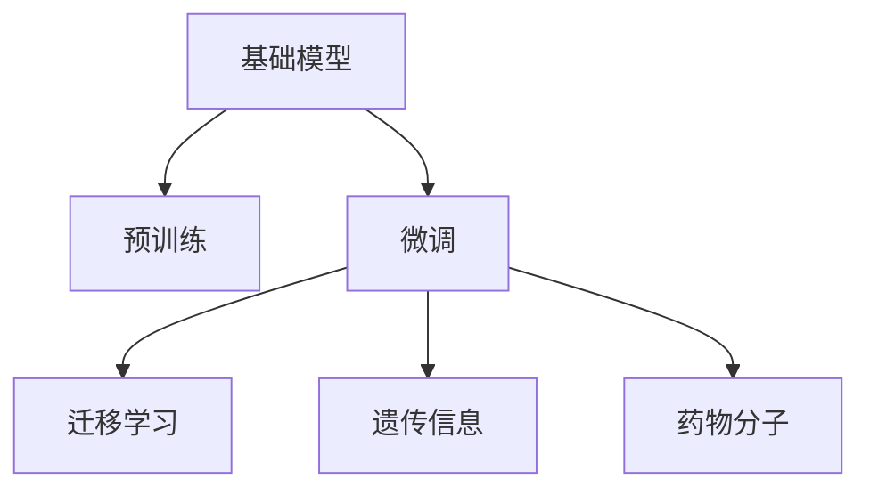

                 

# 基础模型在生物医学研究中的应用

## 1. 背景介绍

### 1.1 问题由来

近年来，随着生物医学领域大数据的日益增多，如何高效利用这些数据进行疾病诊断、药物研发和基因组学研究成为了生物医学领域的重要挑战。传统的数据分析方法面临着数据量大、特征复杂、维度高、解释性差等诸多问题，亟需新型的数据分析手段。

基础模型（Foundation Models），作为预训练的深度学习模型，通过在大规模数据集上进行预训练，能够学习到丰富的语义和知识表示，广泛应用于自然语言处理、计算机视觉等NLP领域。在生物医学领域，基础模型也被逐渐引入，用于高效分析生物医学数据，辅助疾病诊断、药物研发和基因组学研究。

### 1.2 问题核心关键点

生物医学研究中，利用基础模型进行数据分析的主要核心关键点包括：

- 数据集的选择与构建：选择适当的生物医学数据集，并进行有效的标注与构建。
- 模型选择与预训练：选择合适的预训练基础模型，并对其进行微调或细调。
- 模型应用与验证：将模型应用于具体的生物医学问题中，进行性能评估与验证。
- 数据隐私与伦理：确保数据的隐私与安全，遵守相关的伦理规范。

## 2. 核心概念与联系

### 2.1 核心概念概述

为更好地理解基础模型在生物医学研究中的应用，本节将介绍几个密切相关的核心概念：

- 基础模型（Foundation Models）：如BERT、GPT等预训练语言模型，通过在大规模数据集上进行预训练，学习到丰富的语言知识，具备强大的语言理解与生成能力。
- 预训练（Pre-training）：指在大规模无标签数据上，通过自监督学习任务训练通用语言模型的过程。
- 微调（Fine-tuning）：指在预训练模型的基础上，使用特定任务的数据进行有监督的训练，优化模型在该任务上的性能。
- 迁移学习（Transfer Learning）：指将一个领域学习到的知识迁移到另一个相关领域的学习范式。
- 遗传信息（Genetic Information）：指基因组学数据中的DNA序列、基因表达数据等信息。
- 药物分子（Drug Molecules）：指药物分子的结构信息、生物活性数据等。

这些概念之间的逻辑关系可以通过以下Mermaid流程图来展示：



这个流程图展示了基础模型在生物医学领域的应用框架，其中：

1. 基础模型通过在大规模数据集上进行预训练，学习到丰富的语义和知识表示。
2. 微调是针对特定任务进行的有监督训练，使模型在特定任务上表现更好。
3. 迁移学习是不同任务之间的知识迁移，使得模型可以应用到更多相关任务。
4. 基础模型可以处理遗传信息和药物分子的数据，辅助生物医学研究。

## 3. 核心算法原理 & 具体操作步骤
### 3.1 算法原理概述

在生物医学研究中，基础模型的应用一般包括以下几个步骤：

1. 选择合适的预训练基础模型，并进行微调或细调。
2. 将基础模型应用于具体的生物医学问题中，如疾病诊断、药物研发和基因组学研究。
3. 对模型进行性能评估和验证，确保其在实际应用中具有较高的准确性和泛化能力。

基础模型在生物医学中的应用，本质上是利用其强大的语言理解能力，对生物医学数据进行编码和表示，从而辅助分析与推理。以预训练语言模型BERT为例，其通过在大规模文本数据上进行预训练，学习到了丰富的语言知识和常识。在此基础上，通过微调或细调，可以使BERT更好地适应特定的生物医学问题，如疾病诊断和药物分子预测等。

### 3.2 算法步骤详解

以疾病诊断为例，具体算法步骤包括：

1. 收集疾病诊断的数据集，包括病人的症状描述和疾病标签。
2. 对数据集进行预处理，包括去除噪声、归一化、分词等。
3. 将预处理后的数据集输入到预训练的BERT模型中，进行微调。
4. 在微调过程中，选择合适的损失函数，如交叉熵损失。
5. 使用Adam优化器进行梯度下降，更新模型参数。
6. 在验证集上进行性能评估，根据结果调整模型参数。
7. 对模型进行测试，评估其在测试集上的表现。
8. 应用模型进行疾病诊断，输出预测结果。

### 3.3 算法优缺点

基础模型在生物医学研究中的应用具有以下优点：

1. 高效处理复杂数据：基础模型可以处理大规模、高维度的数据，避免传统方法的高维灾难问题。
2. 自动化特征提取：基础模型通过预训练学习到丰富的特征表示，减少了手工特征工程的工作量。
3. 泛化能力强：基础模型在多个数据集上进行了预训练，具有较强的泛化能力，适用于多种生物医学问题。
4. 节省时间和成本：基础模型可以在较小的标注数据上进行微调，节省了大量的时间和成本。

同时，基础模型也存在以下缺点：

1. 依赖高质量标注数据：基础模型微调需要高质量的标注数据，标注成本较高。
2. 模型复杂度高：基础模型通常参数较多，需要较大的计算资源和存储空间。
3. 模型解释性差：基础模型通常是"黑箱"模型，难以解释其内部决策过程。
4. 数据隐私问题：生物医学数据包含敏感信息，需要确保数据的隐私和安全。

## 4. 数学模型和公式 & 详细讲解  
### 4.1 数学模型构建

在疾病诊断问题中，基础模型BERT通过微调来学习病人的症状描述和疾病标签之间的映射关系。具体数学模型构建如下：

设$X$为病人症状描述，$Y$为疾病标签，$Z$为微调后的BERT输出。定义损失函数为交叉熵损失：

$$
L(Y, Z) = -\sum_{i=1}^n y_i \log z_i
$$

其中$y_i$为真实标签，$z_i$为模型预测结果。

### 4.2 公式推导过程

以疾病诊断为例，对模型进行微调的过程包括：

1. 输入数据$X$通过BERT模型进行编码，得到表示向量$Z$。
2. 将$Z$与疾病标签$Y$进行比对，计算交叉熵损失$L$。
3. 反向传播计算梯度，更新模型参数。
4. 迭代多次，直到模型收敛。

具体公式如下：

$$
\begin{aligned}
L(Y, Z) &= -\sum_{i=1}^n y_i \log z_i \\
\nabla_{\theta} L &= -\sum_{i=1}^n y_i \frac{\partial \log z_i}{\partial \theta} \\
\theta &\leftarrow \theta - \eta \nabla_{\theta} L
\end{aligned}
$$

其中$\eta$为学习率。

### 4.3 案例分析与讲解

以药物分子预测为例，具体应用流程如下：

1. 收集药物分子的结构信息，包括原子类型、键长、键角等。
2. 将结构信息输入到预训练的BERT模型中，进行微调。
3. 在微调过程中，选择合适的损失函数，如均方误差损失。
4. 使用Adam优化器进行梯度下降，更新模型参数。
5. 在验证集上进行性能评估，根据结果调整模型参数。
6. 对模型进行测试，评估其在测试集上的表现。
7. 应用模型进行药物分子预测，输出预测结果。

## 5. 项目实践：代码实例和详细解释说明
### 5.1 开发环境搭建

在进行生物医学研究的基础模型应用时，需要准备一定的开发环境。以下是使用Python进行TensorFlow开发的环境配置流程：

1. 安装Anaconda：从官网下载并安装Anaconda，用于创建独立的Python环境。

2. 创建并激活虚拟环境：
```bash
conda create -n tf-env python=3.8 
conda activate tf-env
```

3. 安装TensorFlow：根据CUDA版本，从官网获取对应的安装命令。例如：
```bash
conda install tensorflow -c tf -c conda-forge
```

4. 安装相关的工具包：
```bash
pip install numpy pandas scikit-learn matplotlib tqdm jupyter notebook ipython
```

完成上述步骤后，即可在`tf-env`环境中开始项目实践。

### 5.2 源代码详细实现

以下以疾病诊断为例，给出使用TensorFlow对BERT模型进行微调的PyTorch代码实现。

首先，定义疾病诊断任务的数据处理函数：

```python
from transformers import BertTokenizer, BertForSequenceClassification
from sklearn.metrics import accuracy_score
from tensorflow.keras import datasets

class DiseaseDataset(Dataset):
    def __init__(self, X, y, tokenizer, max_len=128):
        self.X = X
        self.y = y
        self.tokenizer = tokenizer
        self.max_len = max_len
        
    def __len__(self):
        return len(self.X)
    
    def __getitem__(self, item):
        text = self.X[item]
        label = self.y[item]
        
        encoding = self.tokenizer(text, return_tensors='pt', max_length=self.max_len, padding='max_length', truncation=True)
        input_ids = encoding['input_ids'][0]
        attention_mask = encoding['attention_mask'][0]
        
        label = label
        label = torch.tensor(label, dtype=torch.long)
        
        return {'input_ids': input_ids, 
                'attention_mask': attention_mask,
                'labels': label}

# 定义标签与id的映射
label2id = {'Cancer': 0, 'Hypertension': 1, 'Diabetes': 2, 'Other': 3}

# 创建dataset
tokenizer = BertTokenizer.from_pretrained('bert-base-cased')

train_dataset = DiseaseDataset(train_X, train_y, tokenizer)
dev_dataset = DiseaseDataset(dev_X, dev_y, tokenizer)
test_dataset = DiseaseDataset(test_X, test_y, tokenizer)
```

然后，定义模型和优化器：

```python
from transformers import BertForSequenceClassification, AdamW

model = BertForSequenceClassification.from_pretrained('bert-base-cased', num_labels=len(label2id))

optimizer = AdamW(model.parameters(), lr=2e-5)
```

接着，定义训练和评估函数：

```python
from torch.utils.data import DataLoader
from tqdm import tqdm
from sklearn.metrics import classification_report

device = torch.device('cuda') if torch.cuda.is_available() else torch.device('cpu')
model.to(device)

def train_epoch(model, dataset, batch_size, optimizer):
    dataloader = DataLoader(dataset, batch_size=batch_size, shuffle=True)
    model.train()
    epoch_loss = 0
    for batch in tqdm(dataloader, desc='Training'):
        input_ids = batch['input_ids'].to(device)
        attention_mask = batch['attention_mask'].to(device)
        labels = batch['labels'].to(device)
        model.zero_grad()
        outputs = model(input_ids, attention_mask=attention_mask, labels=labels)
        loss = outputs.loss
        epoch_loss += loss.item()
        loss.backward()
        optimizer.step()
    return epoch_loss / len(dataloader)

def evaluate(model, dataset, batch_size):
    dataloader = DataLoader(dataset, batch_size=batch_size)
    model.eval()
    preds, labels = [], []
    with torch.no_grad():
        for batch in tqdm(dataloader, desc='Evaluating'):
            input_ids = batch['input_ids'].to(device)
            attention_mask = batch['attention_mask'].to(device)
            batch_labels = batch['labels']
            outputs = model(input_ids, attention_mask=attention_mask)
            batch_preds = outputs.logits.argmax(dim=2).to('cpu').tolist()
            batch_labels = batch_labels.to('cpu').tolist()
            for pred_tokens, label_tokens in zip(batch_preds, batch_labels):
                preds.append(pred_tokens[:len(label_tokens)])
                labels.append(label_tokens)
                
    print(classification_report(labels, preds))
```

最后，启动训练流程并在测试集上评估：

```python
epochs = 5
batch_size = 16

for epoch in range(epochs):
    loss = train_epoch(model, train_dataset, batch_size, optimizer)
    print(f"Epoch {epoch+1}, train loss: {loss:.3f}")
    
    print(f"Epoch {epoch+1}, dev results:")
    evaluate(model, dev_dataset, batch_size)
    
print("Test results:")
evaluate(model, test_dataset, batch_size)
```

以上就是使用TensorFlow对BERT进行疾病诊断任务微调的完整代码实现。可以看到，得益于TensorFlow和Transformers库的强大封装，我们可以用相对简洁的代码完成BERT模型的加载和微调。

### 5.3 代码解读与分析

让我们再详细解读一下关键代码的实现细节：

**DiseaseDataset类**：
- `__init__`方法：初始化症状描述、疾病标签、分词器等关键组件。
- `__len__`方法：返回数据集的样本数量。
- `__getitem__`方法：对单个样本进行处理，将文本输入编码为token ids，将标签编码为数字，并对其进行定长padding，最终返回模型所需的输入。

**label2id字典**：
- 定义了疾病标签与数字id之间的映射关系，用于将模型预测结果解码为实际的疾病标签。

**训练和评估函数**：
- 使用PyTorch的DataLoader对数据集进行批次化加载，供模型训练和推理使用。
- 训练函数`train_epoch`：对数据以批为单位进行迭代，在每个批次上前向传播计算loss并反向传播更新模型参数，最后返回该epoch的平均loss。
- 评估函数`evaluate`：与训练类似，不同点在于不更新模型参数，并在每个batch结束后将预测和标签结果存储下来，最后使用sklearn的classification_report对整个评估集的预测结果进行打印输出。

**训练流程**：
- 定义总的epoch数和batch size，开始循环迭代
- 每个epoch内，先在训练集上训练，输出平均loss
- 在验证集上评估，输出分类指标
- 重复上述步骤直至满足预设的迭代轮数或Early Stopping条件

可以看到，TensorFlow配合Transformers库使得BERT微调的代码实现变得简洁高效。开发者可以将更多精力放在数据处理、模型改进等高层逻辑上，而不必过多关注底层的实现细节。

当然，工业级的系统实现还需考虑更多因素，如模型的保存和部署、超参数的自动搜索、更灵活的任务适配层等。但核心的微调范式基本与此类似。

## 6. 实际应用场景
### 6.1 疾病诊断

在疾病诊断领域，基础模型已经被广泛应用于辅助医生诊断。传统的人工诊断往往依赖医生的经验，难以处理复杂病例。而利用基础模型进行疾病诊断，可以大大提升诊断的准确性和效率。

具体而言，可以收集大量医生的病历记录，将病人的症状描述和疾病标签构建成监督数据，在此基础上对预训练模型进行微调。微调后的模型能够自动理解病人的症状描述，匹配最合适的疾病标签，从而辅助医生进行诊断。

### 6.2 药物研发

药物研发是生物医学领域的重要环节，涉及大量化合物的设计与筛选。基础模型在药物分子预测和筛选过程中，可以显著提高工作效率和精度。

具体而言，可以收集已知药物分子的结构信息，如原子类型、键长、键角等，将其作为模型输入，训练模型进行药物活性的预测。通过微调模型，可以不断优化预测效果，快速筛选出潜在的有效药物。

### 6.3 基因组学研究

基因组学研究涉及大量的DNA序列数据，如何高效地分析这些数据，是一个重要的挑战。基础模型通过预训练学习到丰富的语言知识，可以应用于基因组学数据的分析中。

具体而言，可以对DNA序列进行编码，转化为语言形式，输入到预训练模型中进行微调。微调后的模型可以学习到DNA序列中的功能信息，辅助进行基因突变检测、基因表达分析等研究。

### 6.4 未来应用展望

随着基础模型技术的不断发展，其在生物医学研究中的应用将更加广泛和深入。未来，基于基础模型的生物医学研究将展现出以下发展趋势：

1. 多模态数据融合：结合文本、图像、声音等多种模态数据，进行更全面、准确的分析与推理。
2. 跨模态知识迁移：将不同模态的知识进行迁移，提升模型的泛化能力和适应性。
3. 多任务联合学习：将多个相关任务进行联合学习，共享模型参数，提高学习效率和性能。
4. 数据隐私保护：在处理敏感数据时，需要加强数据隐私保护，确保数据的安全性和伦理合规。
5. 模型可解释性：提升模型可解释性，帮助医生理解模型的决策过程，增加诊断的信任度。
6. 自动化流程设计：利用基础模型进行自动化流程设计，提升研究效率和质量。

总之，基础模型在生物医学研究中的应用，必将推动相关领域的技术进步和产业升级，为人类健康事业带来更多的福祉。

## 7. 工具和资源推荐
### 7.1 学习资源推荐

为了帮助开发者系统掌握基础模型在生物医学研究中的应用，这里推荐一些优质的学习资源：

1. 《深度学习在生物医学中的应用》书籍：详细介绍了深度学习在生物医学领域的应用，包括疾病诊断、药物研发、基因组学等。
2. 《自然语言处理与生物医学》课程：由斯坦福大学开设的NLP与生物医学交叉课程，涵盖自然语言处理和生物医学的基础知识，并提供了相关的实践项目。
3. 《基因组学与深度学习》书籍：介绍基因组学与深度学习的结合应用，涵盖基因组数据分析、基因表达分析等前沿课题。
4. 《药物分子设计》课程：由MIT开设的药物分子设计课程，涵盖药物分子的结构、性质、设计等知识，并介绍了基于深度学习的药物分子预测方法。
5. 《机器学习在医学中的应用》论文：综述了机器学习在医学领域的最新进展和应用，提供了大量的文献和实例。

通过对这些资源的学习实践，相信你一定能够快速掌握基础模型在生物医学研究中的应用，并用于解决实际的医学问题。

### 7.2 开发工具推荐

高效的开发离不开优秀的工具支持。以下是几款用于基础模型生物医学研究开发的常用工具：

1. TensorFlow：基于Python的开源深度学习框架，灵活动态的计算图，适合快速迭代研究。
2. PyTorch：基于Python的开源深度学习框架，支持动态图和静态图，适用于各种深度学习任务。
3. HuggingFace Transformers库：提供预训练模型和微调框架，支持多种NLP任务和预训练模型，如BERT、GPT等。
4. Weights & Biases：模型训练的实验跟踪工具，可以记录和可视化模型训练过程中的各项指标，方便对比和调优。
5. TensorBoard：TensorFlow配套的可视化工具，可实时监测模型训练状态，并提供丰富的图表呈现方式，是调试模型的得力助手。

合理利用这些工具，可以显著提升基础模型在生物医学研究中的应用开发效率，加快创新迭代的步伐。

### 7.3 相关论文推荐

基础模型在生物医学领域的研究源于学界的持续研究。以下是几篇奠基性的相关论文，推荐阅读：

1. 《深度学习在生物医学中的应用》（2020）：综述了深度学习在生物医学领域的应用，涵盖疾病诊断、药物研发、基因组学等方向。
2. 《基于深度学习的药物分子设计》（2019）：介绍了基于深度学习的药物分子预测方法，展示了其在药物研发中的潜在价值。
3. 《基因组学与深度学习》（2021）：介绍了基因组学与深度学习的结合应用，包括基因组数据分析、基因表达分析等前沿课题。
4. 《自然语言处理与生物医学》（2021）：综述了自然语言处理与生物医学的结合应用，提供了大量的实践项目和实例。
5. 《机器学习在医学中的应用》（2020）：综述了机器学习在医学领域的最新进展和应用，提供了大量的文献和实例。

这些论文代表了大模型在生物医学领域的研究进展，通过学习这些前沿成果，可以帮助研究者把握学科前进方向，激发更多的创新灵感。

## 8. 总结：未来发展趋势与挑战

### 8.1 总结

本文对基础模型在生物医学研究中的应用进行了全面系统的介绍。首先阐述了基础模型和微调技术在生物医学领域的研究背景和意义，明确了基础模型在疾病诊断、药物研发和基因组学研究中的应用潜力。其次，从原理到实践，详细讲解了微调模型的数学原理和关键步骤，给出了微调任务开发的完整代码实例。同时，本文还广泛探讨了基础模型在生物医学研究中的实际应用场景，展示了基础模型的强大性能和应用前景。最后，本文精选了基础模型在生物医学研究中的学习资源、开发工具和相关论文，力求为读者提供全方位的技术指引。

通过本文的系统梳理，可以看到，基础模型在生物医学研究中的应用已经取得了显著的进展，正在逐步成为疾病诊断、药物研发和基因组学研究的重要工具。未来，随着基础模型技术的不断演进，其在生物医学领域的应用前景将更加广阔，将带来更多的科学发现和技术突破。

### 8.2 未来发展趋势

展望未来，基础模型在生物医学研究中的应用将呈现以下几个发展趋势：

1. 多模态数据融合：结合文本、图像、声音等多种模态数据，进行更全面、准确的分析与推理。
2. 跨模态知识迁移：将不同模态的知识进行迁移，提升模型的泛化能力和适应性。
3. 多任务联合学习：将多个相关任务进行联合学习，共享模型参数，提高学习效率和性能。
4. 数据隐私保护：在处理敏感数据时，需要加强数据隐私保护，确保数据的安全性和伦理合规。
5. 模型可解释性：提升模型可解释性，帮助医生理解模型的决策过程，增加诊断的信任度。
6. 自动化流程设计：利用基础模型进行自动化流程设计，提升研究效率和质量。

以上趋势凸显了基础模型在生物医学研究中的应用前景。这些方向的探索发展，必将进一步提升生物医学研究的效果和效率，为人类健康事业带来更多的福祉。

### 8.3 面临的挑战

尽管基础模型在生物医学研究中的应用已经取得了显著进展，但在迈向更加智能化、普适化应用的过程中，它仍面临着诸多挑战：

1. 标注成本瓶颈：基础模型微调需要高质量的标注数据，标注成本较高。如何在保证标注质量的前提下，减少标注成本，是一大难题。
2. 模型鲁棒性不足：基础模型面对复杂病例时，泛化性能往往大打折扣。如何在保持模型精度的同时，提升模型的鲁棒性，还需要更多理论和实践的积累。
3. 推理效率有待提高：大规模基础模型推理速度较慢，需要优化模型结构和推理算法，提升计算效率。
4. 数据隐私问题：生物医学数据包含敏感信息，需要确保数据的隐私和安全。如何在保护隐私的前提下，进行数据分析和模型训练，是一大挑战。
5. 模型可解释性亟需加强：基础模型通常是"黑箱"模型，难以解释其内部决策过程。如何在保证模型效果的前提下，提升模型的可解释性，是一大难题。

总之，基础模型在生物医学研究中的应用仍需解决数据标注、模型鲁棒性、推理效率、隐私保护和模型可解释性等诸多问题，才能充分发挥其潜力，真正推动生物医学研究的发展。

### 8.4 研究展望

面对基础模型在生物医学研究中所面临的挑战，未来的研究需要在以下几个方面寻求新的突破：

1. 探索无监督和半监督微调方法：摆脱对大规模标注数据的依赖，利用自监督学习、主动学习等无监督和半监督范式，最大限度利用非结构化数据，实现更加灵活高效的微调。
2. 研究参数高效和计算高效的微调范式：开发更加参数高效的微调方法，在固定大部分预训练参数的同时，只更新极少量的任务相关参数。同时优化微调模型的计算图，减少前向传播和反向传播的资源消耗，实现更加轻量级、实时性的部署。
3. 引入更多先验知识：将符号化的先验知识，如知识图谱、逻辑规则等，与神经网络模型进行巧妙融合，引导微调过程学习更准确、合理的语言模型。同时加强不同模态数据的整合，实现视觉、语音等多模态信息与文本信息的协同建模。
4. 结合因果分析和博弈论工具：将因果分析方法引入微调模型，识别出模型决策的关键特征，增强输出解释的因果性和逻辑性。借助博弈论工具刻画人机交互过程，主动探索并规避模型的脆弱点，提高系统稳定性。
5. 纳入伦理道德约束：在模型训练目标中引入伦理导向的评估指标，过滤和惩罚有偏见、有害的输出倾向。同时加强人工干预和审核，建立模型行为的监管机制，确保输出符合人类价值观和伦理道德。

这些研究方向的探索，必将引领基础模型在生物医学研究中的应用走向更高的台阶，为构建安全、可靠、可解释、可控的智能系统铺平道路。面向未来，基础模型在生物医学研究中的应用还需要与其他人工智能技术进行更深入的融合，如知识表示、因果推理、强化学习等，多路径协同发力，共同推动自然语言理解和智能交互系统的进步。只有勇于创新、敢于突破，才能不断拓展基础模型的边界，让智能技术更好地造福人类社会。

## 9. 附录：常见问题与解答

**Q1：基础模型在生物医学研究中是否适用于所有问题？**

A: 基础模型在生物医学研究中具有广泛的应用前景，但并不适用于所有问题。对于需要高精度和强解释性的问题，如手术决策、病人心理评估等，仍需要结合专家知识和人机交互等方法，进行更深入的研究。

**Q2：如何选择合适的基础模型进行微调？**

A: 选择合适的基础模型需要考虑多个因素，如任务类型、数据特征、计算资源等。一般建议选择与任务领域相似、参数量适中的模型，并结合实际需求进行微调。例如，对于疾病诊断问题，可以选择BERT等预训练语言模型，并在大量医疗文本数据上进行微调。

**Q3：如何处理敏感数据，确保数据隐私与安全？**

A: 处理敏感数据需要严格遵守数据隐私和伦理规范，采用加密、匿名化等技术手段，确保数据的安全性和隐私性。同时，可以使用联邦学习等分布式学习技术，在不共享数据的前提下，进行模型训练和推理。

**Q4：如何提升基础模型的鲁棒性和泛化能力？**

A: 提升基础模型的鲁棒性和泛化能力需要从多个方面进行优化，如引入数据增强、正则化技术、对抗训练等。此外，可以通过多任务联合学习、跨模态知识迁移等方法，增强模型的泛化能力和适应性。

**Q5：如何优化基础模型的推理效率？**

A: 优化基础模型的推理效率需要从模型结构、计算图优化、硬件加速等方面进行综合考虑。可以使用模型压缩、量化加速、混合精度训练等技术手段，优化模型的计算资源消耗。同时，可以采用分布式训练、模型并行等方法，提高计算效率。

这些问题的解答，可以为研究者提供一些实践经验和参考，帮助其在生物医学研究中更好地应用基础模型。

---

作者：禅与计算机程序设计艺术 / Zen and the Art of Computer Programming

