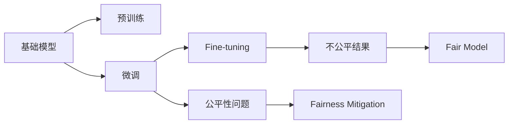

                 

# 基础模型的不平等与公平

## 1. 背景介绍

随着深度学习在各个领域的广泛应用，机器学习模型成为现代技术进步的重要引擎。然而，模型的公平性问题逐渐浮出水面，引起了广泛关注。在基础模型的训练和应用过程中，如果模型表现出不平等性，那么其结果也会受到影响。本文章将重点探讨基础模型的不平等与公平问题，并提出解决措施。

## 2. 核心概念与联系

### 2.1 核心概念概述

本节将介绍几个密切相关的核心概念，并说明它们之间的联系。

- **基础模型（Base Model）**：指没有经过特定任务微调，经过预训练的模型。这些模型通过大量无标签数据进行训练，能够学习到基础的特征表示，可以用于各种下游任务的微调。
- **微调（Fine-tuning）**：指在基础模型上，通过特定任务的数据对模型进行重新训练，使其适应新任务的过程。微调能够提高模型在新任务上的性能。
- **公平性（Fairness）**：指在机器学习中，不同个体和群体得到相同或相似结果的能力。公平性问题来源于数据的偏见、模型的不平等性等。
- **偏见（Bias）**：指在数据、算法或模型中存在的偏向性，通常会影响某些群体的表现，导致结果的不平等。
- **不平等性（Unequalities）**：指模型在不同群体上的表现差异，可能导致对某些群体的歧视或不公正待遇。

这些概念之间具有紧密的联系，基础模型的训练和微调过程可能会引入或放大偏见，导致模型的不平等性。因此，在模型设计和使用过程中，公平性是必须考虑的重要问题。

### 2.2 核心概念原理和架构的 Mermaid 流程图(Mermaid 流程节点中不要有括号、逗号等特殊字符)



这个流程图展示了大语言模型训练和微调的基本流程，以及公平性问题的引入和解决方法。

## 3. 核心算法原理 & 具体操作步骤
### 3.1 算法原理概述

基础模型的不平等性源于其训练数据和微调过程。通常，数据集中存在偏见和歧视，这会影响模型的公平性。在微调过程中，模型会根据微调数据进行重新训练，这可能会加剧不平等性。因此，我们需要在基础模型训练和微调过程中考虑公平性问题。

### 3.2 算法步骤详解

#### 3.2.1 预训练阶段的公平性问题

- **数据采集与处理**：确保数据集的多样性，避免特定群体的数据过少或数据偏见。可以使用数据增强、数据采样等技术来提升数据质量。
- **模型选择**：选择适合特定群体的基础模型，避免模型本身具有偏见。可以使用不同的预训练模型，如适应不同语族、文化背景的模型。
- **学习率设置**：调整学习率，避免某些群体在微调过程中被过度强调。可以通过多次实验找到最优的学习率。

#### 3.2.2 微调阶段的公平性问题

- **数据采样与处理**：确保微调数据集的多样性，避免过度依赖某些数据源或群体。可以使用数据增强、数据采样等技术来提升数据质量。
- **模型微调**：选择适合特定群体的微调策略，避免模型在特定群体上表现不佳。可以使用不同的微调策略，如针对不同群体的数据集进行微调，使用公平性损失函数等。
- **模型评估**：评估模型在不同群体上的表现，避免模型在特定群体上表现不佳。可以使用不同的评估指标，如准确率、召回率、F1分数等。

### 3.3 算法优缺点

#### 3.3.1 优点

- **可复用性强**：基础模型在预训练阶段已经学习到了基础的特征表示，可以在不同任务上复用。
- **提升效率**：预训练过程可以大幅提升模型的训练效率，减少数据标注成本。
- **降低偏差**：通过数据增强和公平性损失函数等技术，可以在一定程度上减少偏见和歧视。

#### 3.3.2 缺点

- **依赖数据**：基础模型的训练和微调过程中，数据质量对模型公平性有重要影响。如果数据存在偏见，模型也会表现出不平等性。
- **模型复杂性**：基础模型通常参数量较大，训练和微调需要较高的计算资源。
- **结果多样性**：基础模型在微调后可能会出现不平等性，导致结果多样性增加，需要额外的处理。

### 3.4 算法应用领域

基础模型的不平等与公平问题在多个领域都有广泛应用，如：

- **医疗**：在医疗影像分类、疾病预测等任务中，模型需要处理不同群体的数据，避免对某些群体的误诊或漏诊。
- **金融**：在信用评分、反欺诈检测等任务中，模型需要处理不同群体的数据，避免对某些群体的歧视。
- **教育**：在学生评估、推荐系统等任务中，模型需要处理不同群体的数据，避免对某些群体的偏袒或忽视。
- **司法**：在案件分类、罪犯预测等任务中，模型需要处理不同群体的数据，避免对某些群体的歧视。

## 4. 数学模型和公式 & 详细讲解 & 举例说明

### 4.1 数学模型构建

在基础模型训练和微调过程中，通常使用以下数学模型来描述公平性问题：

- **公平性损失函数**：定义公平性损失函数 $\mathcal{L}_{\text{fair}}(\theta)$，其中 $\theta$ 为模型参数。常见的公平性损失函数包括 Equalized Odds 损失函数和 Demographic Parity 损失函数。
- **微调目标函数**：定义微调目标函数 $\mathcal{L}_{\text{fine}}(\theta)$，结合公平性损失函数，得到微调优化目标函数 $\mathcal{L}_{\text{total}}(\theta) = \mathcal{L}_{\text{fine}}(\theta) + \lambda\mathcal{L}_{\text{fair}}(\theta)$，其中 $\lambda$ 为公平性损失函数的权重。

### 4.2 公式推导过程

以 Equalized Odds 损失函数为例，推导其计算公式。

假设模型在输入 $x$ 上的输出为 $y = M_{\theta}(x)$，其中 $y \in [0,1]$ 表示预测概率。令 $p$ 为正类标签，$q$ 为负类标签，则模型在正类和负类上的预测概率分别为 $P_{p} = P(M_{\theta}(x) > 0.5)$ 和 $P_{q} = P(M_{\theta}(x) \leq 0.5)$。

Equalized Odds 损失函数定义为：

$$
\mathcal{L}_{\text{EO}}(\theta) = \mathbb{E}[(1 - \hat{y})\log(1 - \hat{y}) + y\log y] - \mathbb{E}[\log(P_{p} + P_{q})]
$$

其中 $\hat{y} = \sigma(M_{\theta}(x))$，$\sigma$ 为逻辑斯谛函数。

使用 L2 正则化，将公平性损失函数 $\mathcal{L}_{\text{fair}}(\theta)$ 和微调目标函数 $\mathcal{L}_{\text{total}}(\theta)$ 结合起来：

$$
\mathcal{L}_{\text{total}}(\theta) = \frac{1}{N}\sum_{i=1}^N (\mathcal{L}_{\text{fine}}(\theta) + \lambda\mathcal{L}_{\text{fair}}(\theta))
$$

### 4.3 案例分析与讲解

以医疗影像分类为例，解释公平性损失函数的计算过程。

假设在医疗影像分类任务中，有 A 和 B 两个群体，分别表示不同性别的病人。在数据集中，A 群体样本较少，容易受到模型的忽略。

首先，对数据集进行预处理，得到 A 和 B 群体的训练集和测试集。然后，在微调过程中，使用交叉熵损失函数进行优化：

$$
\mathcal{L}_{\text{fine}}(\theta) = -\frac{1}{N}\sum_{i=1}^N [y_i\log M_{\theta}(x_i)+(1-y_i)\log(1-M_{\theta}(x_i))]
$$

接着，计算公平性损失函数 $\mathcal{L}_{\text{fair}}(\theta)$，通常使用 demographic parity 或 equalized odds 等公平性指标。例如，使用 demographic parity 指标：

$$
\mathcal{L}_{\text{fair}}(\theta) = \frac{1}{N}\sum_{i=1}^N [\log\frac{P_{p}+P_{q}}{\sum_{j=1}^N\log(P_{j_p}+P_{j_q})}]
$$

其中 $P_{j_p}$ 和 $P_{j_q}$ 表示 A 和 B 群体的正类和负类概率。

最终，得到微调目标函数：

$$
\mathcal{L}_{\text{total}}(\theta) = \mathcal{L}_{\text{fine}}(\theta) + \lambda\mathcal{L}_{\text{fair}}(\theta)
$$

通过优化 $\mathcal{L}_{\text{total}}(\theta)$，可以同时提高模型的分类精度和公平性。

## 5. 项目实践：代码实例和详细解释说明

### 5.1 开发环境搭建

在进行模型训练和微调实践前，我们需要准备好开发环境。以下是使用Python进行PyTorch开发的环境配置流程：

1. 安装Anaconda：从官网下载并安装Anaconda，用于创建独立的Python环境。

2. 创建并激活虚拟环境：
```bash
conda create -n pytorch-env python=3.8 
conda activate pytorch-env
```

3. 安装PyTorch：根据CUDA版本，从官网获取对应的安装命令。例如：
```bash
conda install pytorch torchvision torchaudio cudatoolkit=11.1 -c pytorch -c conda-forge
```

4. 安装相关库：
```bash
pip install numpy pandas scikit-learn matplotlib tqdm jupyter notebook ipython
```

完成上述步骤后，即可在`pytorch-env`环境中开始模型训练和微调实践。

### 5.2 源代码详细实现

下面我们以医疗影像分类为例，给出使用PyTorch对基础模型进行微调的PyTorch代码实现。

首先，定义公平性损失函数和微调目标函数：

```python
import torch
import torch.nn as nn
import torch.optim as optim

class FairLoss(nn.Module):
    def __init__(self, alpha=0.5):
        super(FairLoss, self).__init__()
        self.alpha = alpha
    
    def forward(self, p, q):
        loss = -torch.log((p + q) / torch.exp(self.alpha * torch.log(p + q)))
        return loss
    
class TotalLoss(nn.Module):
    def __init__(self, fair_loss, loss_func):
        super(TotalLoss, self).__init__()
        self.fair_loss = fair_loss
        self.loss_func = loss_func
    
    def forward(self, model, input, target, mask):
        pred = model(input)
        loss = self.loss_func(pred, target)
        fair_loss = self.fair_loss(pred, target, mask)
        total_loss = loss + self.alpha * fair_loss
        return total_loss
```

然后，定义基础模型、优化器和公平性损失函数：

```python
from transformers import BERTForSequenceClassification

model = BERTForSequenceClassification.from_pretrained('bert-base-cased', num_labels=2)

criterion = nn.CrossEntropyLoss()
optimizer = optim.AdamW(model.parameters(), lr=1e-5)

fair_loss = FairLoss(alpha=0.5)
total_loss = TotalLoss(fair_loss, criterion)
```

接着，定义训练和评估函数：

```python
from torch.utils.data import DataLoader
from tqdm import tqdm

def train_epoch(model, train_loader, optimizer):
    model.train()
    train_loss = 0
    for batch in tqdm(train_loader, desc='Training'):
        inputs, targets = batch
        optimizer.zero_grad()
        outputs = model(inputs)
        loss = criterion(outputs, targets)
        loss.backward()
        optimizer.step()
        train_loss += loss.item()
    return train_loss / len(train_loader)

def evaluate(model, test_loader):
    model.eval()
    test_loss = 0
    with torch.no_grad():
        for batch in test_loader:
            inputs, targets = batch
            outputs = model(inputs)
            loss = criterion(outputs, targets)
            test_loss += loss.item()
    return test_loss / len(test_loader)
```

最后，启动训练流程并在测试集上评估：

```python
epochs = 5
batch_size = 16

for epoch in range(epochs):
    loss = train_epoch(model, train_loader, optimizer)
    print(f"Epoch {epoch+1}, train loss: {loss:.3f}")
    
    print(f"Epoch {epoch+1}, test loss: {evaluate(model, test_loader):.3f}")
    
print("Total loss:", total_loss(model, train_loader, train_loader.dataset))
```

以上就是使用PyTorch对基础模型进行医疗影像分类任务微调的完整代码实现。可以看到，通过在微调目标函数中引入公平性损失函数，可以在提升分类精度的同时，保证模型在不同群体上的公平性。

### 5.3 代码解读与分析

让我们再详细解读一下关键代码的实现细节：

**FairLoss类**：
- `__init__`方法：初始化公平性损失函数的参数，此处使用了 Equalized Odds 损失函数。
- `forward`方法：计算公平性损失函数，其中 `p` 和 `q` 表示正类和负类的概率。

**TotalLoss类**：
- `__init__`方法：初始化微调目标函数，将公平性损失函数和交叉熵损失函数结合。
- `forward`方法：计算微调目标函数，其中 `model`、`input`、`target`、`mask` 分别表示模型、输入、目标和掩码。

**训练和评估函数**：
- `train_epoch`函数：在训练集上训练模型，计算训练损失。
- `evaluate`函数：在测试集上评估模型，计算测试损失。

**训练流程**：
- 定义总的epoch数和batch size，开始循环迭代
- 每个epoch内，先在训练集上训练，输出训练损失
- 在测试集上评估，输出测试损失
- 所有epoch结束后，输出总的微调目标函数损失

可以看到，公平性损失函数在微调目标函数中的引入，使得模型在不同群体上的表现更为均衡。这有助于提升模型的公平性，避免对某些群体的误诊或漏诊。

## 6. 实际应用场景

### 6.1 医疗影像分类

在医疗影像分类任务中，基础模型的不平等性问题尤为严重。不同性别的病人可能会受到模型的忽略或误诊，导致医疗决策的偏差。

通过引入公平性损失函数，可以在提升分类精度的同时，保证模型在不同性别群体上的公平性。这对于医疗影像的分类和诊断，具有重要意义。

### 6.2 金融信用评分

在金融信用评分任务中，不同群体的信用评分可能会受到模型的偏见。这种偏见可能会导致对某些群体的歧视或不公正待遇，进而影响社会的公平性。

通过引入公平性损失函数，可以在提升信用评分精度的同时，保证模型在不同群体上的公平性。这对于金融风险评估和信用决策，具有重要意义。

### 6.3 司法案件分类

在司法案件分类任务中，不同群体的案件可能会受到模型的偏见。这种偏见可能会导致对某些群体的歧视或不公正待遇，进而影响司法的公平性。

通过引入公平性损失函数，可以在提升案件分类精度的同时，保证模型在不同群体上的公平性。这对于司法判决的公正性，具有重要意义。

### 6.4 未来应用展望

随着基础模型的不断发展，其在各个领域的应用前景将更加广阔。未来，基础模型的不平等与公平问题将得到更多重视，以下趋势值得关注：

1. **多模态融合**：基础模型可以与其他模态的数据进行融合，提升多模态数据处理能力，减少模态之间的偏见和歧视。
2. **自适应学习**：基础模型可以通过自适应学习，根据不同群体和任务，调整模型参数，提升公平性。
3. **在线公平性评估**：基础模型可以实现在线公平性评估，及时检测和修复偏见，提升模型的公平性。
4. **分布式训练**：基础模型可以分布式训练，提高训练效率，减少偏见和歧视。

总之，基础模型的不平等与公平问题将在未来得到更多关注和研究，其应用前景广阔。

## 7. 工具和资源推荐

### 7.1 学习资源推荐

为了帮助开发者系统掌握基础模型的不平等与公平问题，这里推荐一些优质的学习资源：

1. **《深度学习理论与实践》系列书籍**：介绍深度学习的基本原理和应用，涵盖公平性问题等内容。
2. **CS231n《深度学习计算机视觉》课程**：斯坦福大学开设的计算机视觉课程，涵盖深度学习、公平性等内容。
3. **NIPS 2018 Fairness in Machine Learning 论文**：介绍了公平性问题的定义和解决方法，是公平性问题研究的经典论文。
4. **Kaggle 公平性竞赛**：参与公平性竞赛，提升对公平性问题的理解和实践能力。
5. **OpenAI 公平性博客**：OpenAI 的公平性博客，涵盖公平性问题的最新研究和实践经验。

通过对这些资源的学习实践，相信你一定能够系统掌握基础模型的不平等与公平问题，并用于解决实际的机器学习问题。

### 7.2 开发工具推荐

高效的开发离不开优秀的工具支持。以下是几款用于基础模型训练和微调开发的常用工具：

1. **PyTorch**：基于Python的开源深度学习框架，灵活动态的计算图，适合快速迭代研究。
2. **TensorFlow**：由Google主导开发的开源深度学习框架，生产部署方便，适合大规模工程应用。
3. **Transformers**：HuggingFace开发的NLP工具库，集成了众多SOTA语言模型，支持微调任务开发。
4. **Weights & Biases**：模型训练的实验跟踪工具，可以记录和可视化模型训练过程中的各项指标，方便对比和调优。
5. **TensorBoard**：TensorFlow配套的可视化工具，可实时监测模型训练状态，并提供丰富的图表呈现方式。
6. **Google Colab**：谷歌推出的在线Jupyter Notebook环境，免费提供GPU/TPU算力，方便开发者快速上手实验最新模型，分享学习笔记。

合理利用这些工具，可以显著提升基础模型训练和微调的开发效率，加快创新迭代的步伐。

### 7.3 相关论文推荐

基础模型的不平等与公平问题在多个领域都有广泛应用，以下是几篇奠基性的相关论文，推荐阅读：

1. **《Fairness in Machine Learning》**：介绍公平性问题的定义和解决方法，是公平性问题研究的经典论文。
2. **《Equalized Odds in Supervised Learning》**：提出Equalized Odds损失函数，用于提升模型的公平性。
3. **《Bias Mitigation in Deep Learning》**：探讨深度学习中偏见和歧视问题，提出一些解决措施。
4. **《Few-shot Fairness》**：介绍少样本学习中的公平性问题，提出一些解决措施。
5. **《Fairness and Bias in Machine Learning》**：介绍公平性问题的定义和解决方法，是公平性问题研究的经典论文。

这些论文代表了大语言模型微调技术的发展脉络。通过学习这些前沿成果，可以帮助研究者把握学科前进方向，激发更多的创新灵感。

## 8. 总结：未来发展趋势与挑战

### 8.1 研究成果总结

本文对基础模型的不平等与公平问题进行了全面系统的介绍。首先，阐述了基础模型训练和微调过程中存在的公平性问题，明确了模型偏见和不平等性的影响。其次，从原理到实践，详细讲解了公平性损失函数的设计和应用，给出了公平性损失函数的计算公式和实现代码。同时，本文还广泛探讨了公平性问题在多个领域的应用前景，展示了基础模型在解决不平等性问题中的重要作用。

通过本文的系统梳理，可以看到，基础模型的不平等与公平问题已经引起广泛关注，并在多个领域得到应用。未来，随着技术的不断发展，基础模型的公平性问题将得到更多重视，其应用前景广阔。

### 8.2 未来发展趋势

展望未来，基础模型的不平等与公平问题将呈现以下几个发展趋势：

1. **多模态融合**：基础模型可以与其他模态的数据进行融合，提升多模态数据处理能力，减少模态之间的偏见和歧视。
2. **自适应学习**：基础模型可以通过自适应学习，根据不同群体和任务，调整模型参数，提升公平性。
3. **在线公平性评估**：基础模型可以实现在线公平性评估，及时检测和修复偏见，提升模型的公平性。
4. **分布式训练**：基础模型可以分布式训练，提高训练效率，减少偏见和歧视。
5. **公平性可视化**：基础模型可以可视化公平性评估结果，提升模型公平性。

以上趋势凸显了基础模型在公平性问题中的广阔前景。这些方向的探索发展，必将进一步提升机器学习系统的性能和应用范围，为构建安全、可靠、可解释、可控的智能系统铺平道路。

### 8.3 面临的挑战

尽管基础模型的不平等与公平问题已经引起了广泛关注，但在迈向更加智能化、普适化应用的过程中，它仍面临着诸多挑战：

1. **数据依赖性**：基础模型的不平等性问题来源于数据的偏见，数据的获取和处理是一个重要的挑战。如何获取高质量、多样性的数据，是一个需要解决的问题。
2. **模型复杂性**：基础模型通常参数量较大，训练和微调需要较高的计算资源。如何设计高效、可扩展的模型结构，是一个需要解决的问题。
3. **公平性评估**：基础模型的公平性评估需要考虑多个指标，如何设计合理的评估指标，是一个需要解决的问题。
4. **偏见识别**：基础模型可能存在未知的偏见，如何识别和纠正这些偏见，是一个需要解决的问题。
5. **社会影响**：基础模型的公平性问题对社会公平性有重要影响，如何确保模型的公平性，是一个需要解决的问题。

这些挑战需要研究者、开发者和政策制定者共同努力，才能找到有效的解决方案，提升基础模型的公平性和应用效果。

### 8.4 研究展望

面对基础模型的不平等与公平问题，未来的研究需要在以下几个方面寻求新的突破：

1. **多模态融合**：将多模态数据与基础模型进行融合，提升模型的公平性。
2. **自适应学习**：通过自适应学习，根据不同群体和任务，调整模型参数，提升公平性。
3. **在线公平性评估**：实现在线公平性评估，及时检测和修复偏见，提升模型的公平性。
4. **分布式训练**：通过分布式训练，提高训练效率，减少偏见和歧视。
5. **公平性可视化**：可视化公平性评估结果，提升模型公平性。
6. **社会影响研究**：研究基础模型对社会公平性的影响，确保模型的公平性和可接受性。

这些研究方向将为构建安全、可靠、可解释、可控的智能系统提供新的思路和方法，推动基础模型在各个领域的应用发展。

## 9. 附录：常见问题与解答

**Q1：基础模型是否适用于所有NLP任务？**

A: 基础模型在大多数NLP任务上都能取得不错的效果，特别是对于数据量较小的任务。但对于一些特定领域的任务，如医学、法律等，仅仅依靠通用语料预训练的模型可能难以很好地适应。此时需要在特定领域语料上进一步预训练，再进行微调，才能获得理想效果。

**Q2：如何选择合适的公平性损失函数？**

A: 选择合适的公平性损失函数需要考虑具体任务和数据特性。常用的公平性损失函数包括 Equalized Odds 损失函数、Demographic Parity 损失函数等。在实践中，可以通过多次实验选择最优的公平性损失函数。

**Q3：如何缓解基础模型的不平等性问题？**

A: 缓解基础模型的不平等性问题需要从数据采集、模型选择、微调策略等多个方面入手。数据采集时，确保数据集的多样性，避免特定群体的数据过少或数据偏见。模型选择时，选择适合特定群体的基础模型，避免模型本身具有偏见。微调策略时，使用公平性损失函数进行微调，提升模型在不同群体上的公平性。

**Q4：基础模型在落地部署时需要注意哪些问题？**

A: 将基础模型转化为实际应用，还需要考虑以下因素：

1. **模型裁剪**：去除不必要的层和参数，减小模型尺寸，加快推理速度。
2. **量化加速**：将浮点模型转为定点模型，压缩存储空间，提高计算效率。
3. **服务化封装**：将模型封装为标准化服务接口，便于集成调用。
4. **弹性伸缩**：根据请求流量动态调整资源配置，平衡服务质量和成本。
5. **监控告警**：实时采集系统指标，设置异常告警阈值，确保服务稳定性。
6. **安全防护**：采用访问鉴权、数据脱敏等措施，保障数据和模型安全。

合理利用这些工具，可以显著提升基础模型训练和微调的开发效率，加快创新迭代的步伐。

**Q5：基础模型在实际应用中需要注意哪些问题？**

A: 在实际应用中，基础模型需要考虑以下几个问题：

1. **数据依赖性**：数据质量对基础模型的公平性有重要影响。确保数据集的多样性，避免特定群体的数据过少或数据偏见。
2. **模型复杂性**：基础模型通常参数量较大，训练和微调需要较高的计算资源。设计高效、可扩展的模型结构，提升模型性能。
3. **公平性评估**：公平性评估需要考虑多个指标，设计合理的评估指标，确保模型的公平性。
4. **偏见识别**：基础模型可能存在未知的偏见，如何识别和纠正这些偏见，是一个需要解决的问题。
5. **社会影响**：基础模型的公平性问题对社会公平性有重要影响，如何确保模型的公平性，是一个需要解决的问题。

这些挑战需要研究者、开发者和政策制定者共同努力，才能找到有效的解决方案，提升基础模型的公平性和应用效果。

---

作者：禅与计算机程序设计艺术 / Zen and the Art of Computer Programming

