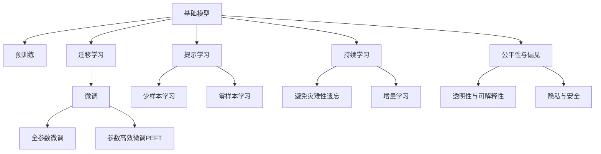

                 

# 基础模型的技术创新与社会责任

## 1. 背景介绍

### 1.1 问题由来
随着人工智能技术的快速发展，基础模型（Base Model）在各行业中的应用越来越广泛。这些模型通常经过大量的预训练，具备强大的学习能力和泛化能力，能够在各种任务上取得出色的表现。然而，在实际应用中，基础模型的性能往往受到数据质量和偏见的影响，导致模型在某些场景下难以满足需求。因此，如何通过技术创新和优化提升基础模型的性能，同时兼顾社会责任，成为一个重要课题。

### 1.2 问题核心关键点
基础模型技术创新与社会责任涉及以下几个关键点：
- **数据质量**：基础模型的性能受数据质量影响较大，数据偏差和噪声可能导致模型输出出现偏差。
- **偏见与公平性**：基础模型可能学习到数据中的偏见，导致在特定人群或场景中表现不佳。
- **透明性与可解释性**：基础模型的决策过程难以解释，缺乏透明性，可能导致用户对模型输出的信任度较低。
- **隐私与安全性**：基础模型在处理敏感数据时可能存在隐私泄露风险，模型的安全性需要得到保障。
- **资源与效率**：基础模型通常需要大量计算资源，如何提高模型的计算效率和资源利用率是一个重要的研究方向。

### 1.3 问题研究意义
研究基础模型的技术创新与社会责任，对于推动人工智能技术在各行业的应用，保障社会公正和数据安全，提升用户体验，具有重要意义：

1. **提高模型性能**：通过技术创新和优化，提高基础模型在各种任务上的性能，使其更好地满足实际需求。
2. **保障社会公平**：通过消除数据中的偏见和提升模型的公平性，确保基础模型在各个群体中都能得到公平对待。
3. **增强模型透明度**：提升基础模型的可解释性，使用户能够理解模型的工作原理和决策依据，增强用户信任。
4. **保障数据安全**：确保基础模型在处理敏感数据时的安全性，防止数据泄露和滥用。
5. **提高资源效率**：优化基础模型的计算效率和资源利用率，减少对计算资源的依赖，降低应用成本。

## 2. 核心概念与联系

### 2.1 核心概念概述

为了更好地理解基础模型的技术创新与社会责任，本节将介绍几个密切相关的核心概念：

- **基础模型(Base Model)**：指经过预训练的大规模神经网络模型，如BERT、GPT等，具备强大的学习能力和泛化能力，能够在各种任务上取得出色的表现。
- **预训练(Pre-training)**：指在大规模无标签数据上，通过自监督学习任务训练模型的过程，使其学习到通用的语言表示。
- **迁移学习(Transfer Learning)**：指将一个领域学到的知识，迁移应用到另一个不同但相关的领域的学习范式，通过微调提高模型在特定任务上的性能。
- **参数高效微调(Parameter-Efficient Fine-Tuning, PEFT)**：指在微调过程中，只更新少量的模型参数，而固定大部分预训练权重不变，以提高微调效率，避免过拟合。
- **提示学习(Prompt Learning)**：通过在输入文本中添加提示模板，引导基础模型进行特定任务的推理和生成，可以在不更新模型参数的情况下，实现零样本或少样本学习。
- **少样本学习(Few-shot Learning)**：指在只有少量标注样本的情况下，模型能够快速适应新任务的学习方法。
- **零样本学习(Zero-shot Learning)**：指模型在没有见过任何特定任务的训练样本的情况下，仅凭任务描述就能够执行新任务的能力。
- **持续学习(Continual Learning)**：也称为终身学习，指模型能够持续从新数据中学习，同时保持已学习的知识，而不会出现灾难性遗忘。
- **公平性与偏见(Bias and Fairness)**：指模型在处理数据时，不应偏袒特定群体或产生歧视性行为。
- **透明性与可解释性(Transparency and Interpretability)**：指模型的工作原理和决策依据应尽可能透明，便于用户理解。
- **隐私与安全(Privacy and Security)**：指在处理敏感数据时，应采取措施保护数据隐私，防止数据泄露和滥用。

这些核心概念之间的逻辑关系可以通过以下Mermaid流程图来展示：



这个流程图展示了一系列核心概念及其之间的关系：

1. 基础模型通过预训练获得基础能力。
2. 迁移学习是连接预训练模型与下游任务的桥梁，可以通过微调或提示学习来实现。
3. 微调（包括全参数微调和参数高效微调）是优化模型性能的重要手段。
4. 提示学习可以在不更新模型参数的情况下，实现零样本或少样本学习。
5. 少样本学习和零样本学习是提示学习的重要组成部分，用于提升模型的适应性和泛化能力。
6. 持续学习使模型能够不断学习新知识，同时保持已学习的知识，避免灾难性遗忘。
7. 公平性、透明性、隐私与安全是模型应用过程中需要重点考虑的社会责任问题。

这些概念共同构成了基础模型的学习与应用框架，使其能够在各种场景下发挥强大的能力，同时确保其应用的合法性、公正性和安全性。

## 3. 核心算法原理 & 具体操作步骤

### 3.1 算法原理概述

基础模型的技术创新与社会责任主要涉及以下几个方面：

1. **数据预处理与清洗**：通过数据预处理和清洗，减少数据中的噪声和偏差，提高数据质量。
2. **参数高效微调**：通过只更新少量的模型参数，减少微调过程中对计算资源的需求。
3. **提示学习**：通过精心设计输入文本的格式，引导基础模型进行特定任务的推理和生成，减少微调参数。
4. **公平性与偏见消除**：通过数据集的多样化处理和模型架构的设计，消除模型中的偏见，提升模型在各个群体中的公平性。
5. **透明性与可解释性增强**：通过可解释性模型和可视化工具，提高模型的透明度，使用户能够理解模型的工作原理和决策依据。
6. **隐私与安全保护**：通过数据加密、差分隐私等技术，保护用户隐私，防止数据泄露和滥用。

### 3.2 算法步骤详解

以下是基础模型的技术创新与社会责任的详细操作步骤：

**Step 1: 数据预处理与清洗**

- 收集高质量的训练数据，包括文本、图像、音频等。
- 对数据进行去重、去噪、标准化等预处理操作，确保数据质量。
- 对数据中的偏见和偏差进行检测和消除，确保数据集的代表性。

**Step 2: 模型选择与初始化**

- 选择合适的预训练基础模型，如BERT、GPT等。
- 在预训练模型的基础上，根据具体任务需求，设计任务适配层。

**Step 3: 参数高效微调**

- 选择合适的优化算法及其参数，如AdamW、SGD等。
- 设置合适的学习率和迭代次数，以避免过拟合。
- 应用正则化技术，如L2正则、Dropout等，提高模型的泛化能力。
- 只微调顶层部分参数，保留大部分预训练权重不变，提高计算效率。

**Step 4: 提示学习**

- 设计合适的提示模板，引导基础模型进行特定任务的推理和生成。
- 通过不断的实验，找到最有效的提示模板，提高模型的零样本和少样本学习能力。

**Step 5: 公平性与偏见消除**

- 收集多样化的数据集，确保数据集的多样性和代表性。
- 在设计模型架构时，引入公平性约束，如对抗训练等，消除模型中的偏见。

**Step 6: 透明性与可解释性增强**

- 使用可解释性模型和可视化工具，提高模型的透明度，使用户能够理解模型的工作原理和决策依据。
- 定期发布模型的更新日志，记录模型性能变化和优化过程，增加用户信任。

**Step 7: 隐私与安全保护**

- 对敏感数据进行加密处理，防止数据泄露。
- 采用差分隐私等技术，保护用户隐私，防止数据滥用。

### 3.3 算法优缺点

基础模型的技术创新与社会责任具有以下优点：

1. **提高模型性能**：通过数据预处理、参数高效微调和提示学习等技术，显著提升模型的性能，使其更好地适应特定任务。
2. **保障社会公平**：通过消除数据中的偏见和提升模型的公平性，确保基础模型在各个群体中都能得到公平对待。
3. **增强透明性与可解释性**：通过可解释性模型和可视化工具，提高模型的透明度，增强用户信任。
4. **保障数据安全**：通过数据加密、差分隐私等技术，保护用户隐私，防止数据泄露和滥用。

同时，这些方法也存在一定的局限性：

1. **数据依赖**：数据预处理和清洗依赖于高质量的数据集，对数据的依赖较大。
2. **计算资源消耗**：参数高效微调和提示学习虽然减少了计算资源的需求，但仍然需要一定的计算资源支持。
3. **技术复杂性**：公平性、透明性和隐私安全等问题的处理，需要较强的技术背景和专业技能。

尽管存在这些局限性，但通过合理的设计和实施，这些技术创新和社会责任措施可以显著提升基础模型的性能和应用效果，为各个行业的智能化转型提供有力支持。

### 3.4 算法应用领域

基础模型的技术创新与社会责任在各个领域中都有广泛的应用，例如：

- **医疗健康**：用于疾病诊断、药物研发、患者咨询等领域，提升医疗服务的智能化水平，辅助医生诊疗，加速新药开发进程。
- **金融服务**：用于信用评估、风险控制、智能投顾等领域，提高金融决策的准确性和效率，减少人为干预，降低风险。
- **智能制造**：用于设备故障预测、生产计划优化、供应链管理等领域，提升生产效率，降低运营成本，提高产品质量。
- **教育培训**：用于智能辅导、个性化学习、智能评估等领域，提供个性化的学习体验，提升教育质量，减少教师负担。
- **智慧城市**：用于交通管理、环境监测、公共安全等领域，提升城市管理的智能化水平，提高居民生活质量，优化城市运营效率。
- **智能家居**：用于语音识别、设备控制、智能推荐等领域，提供便捷、智能、个性化的家居体验，提升生活便利性。

除了上述这些领域外，基础模型的技术创新与社会责任还在更多场景中得到应用，为各行各业带来了变革性影响。

## 4. 数学模型和公式 & 详细讲解  
### 4.1 数学模型构建

本节将使用数学语言对基础模型的技术创新与社会责任进行更加严格的刻画。

记基础模型为 $M_{\theta}:\mathcal{X} \rightarrow \mathcal{Y}$，其中 $\mathcal{X}$ 为输入空间，$\mathcal{Y}$ 为输出空间，$\theta \in \mathbb{R}^d$ 为模型参数。假设数据预处理后的样本为 $x \in \mathcal{X}$，目标输出为 $y \in \mathcal{Y}$。

定义基础模型在样本 $(x,y)$ 上的损失函数为 $\ell(M_{\theta}(x),y)$，则在数据集 $D=\{(x_i,y_i)\}_{i=1}^N$ 上的经验风险为：

$$
\mathcal{L}(\theta) = \frac{1}{N} \sum_{i=1}^N \ell(M_{\theta}(x_i),y_i)
$$

优化目标是最小化经验风险，即找到最优参数：

$$
\theta^* = \mathop{\arg\min}_{\theta} \mathcal{L}(\theta)
$$

在实践中，我们通常使用基于梯度的优化算法（如SGD、Adam等）来近似求解上述最优化问题。设 $\eta$ 为学习率，$\lambda$ 为正则化系数，则参数的更新公式为：

$$
\theta \leftarrow \theta - \eta \nabla_{\theta}\mathcal{L}(\theta) - \eta\lambda\theta
$$

其中 $\nabla_{\theta}\mathcal{L}(\theta)$ 为损失函数对参数 $\theta$ 的梯度，可通过反向传播算法高效计算。

### 4.2 公式推导过程

以下我们以二分类任务为例，推导交叉熵损失函数及其梯度的计算公式。

假设基础模型 $M_{\theta}$ 在输入 $x$ 上的输出为 $\hat{y}=M_{\theta}(x) \in [0,1]$，表示样本属于正类的概率。真实标签 $y \in \{0,1\}$。则二分类交叉熵损失函数定义为：

$$
\ell(M_{\theta}(x),y) = -[y\log \hat{y} + (1-y)\log (1-\hat{y})]
$$

将其代入经验风险公式，得：

$$
\mathcal{L}(\theta) = -\frac{1}{N}\sum_{i=1}^N [y_i\log M_{\theta}(x_i)+(1-y_i)\log(1-M_{\theta}(x_i))]
$$

根据链式法则，损失函数对参数 $\theta_k$ 的梯度为：

$$
\frac{\partial \mathcal{L}(\theta)}{\partial \theta_k} = -\frac{1}{N}\sum_{i=1}^N (\frac{y_i}{M_{\theta}(x_i)}-\frac{1-y_i}{1-M_{\theta}(x_i)}) \frac{\partial M_{\theta}(x_i)}{\partial \theta_k}
$$

其中 $\frac{\partial M_{\theta}(x_i)}{\partial \theta_k}$ 可进一步递归展开，利用自动微分技术完成计算。

在得到损失函数的梯度后，即可带入参数更新公式，完成模型的迭代优化。重复上述过程直至收敛，最终得到适应下游任务的最优模型参数 $\theta^*$。

## 5. 项目实践：代码实例和详细解释说明
### 5.1 开发环境搭建

在进行基础模型的技术创新与社会责任实践前，我们需要准备好开发环境。以下是使用Python进行PyTorch开发的环境配置流程：

1. 安装Anaconda：从官网下载并安装Anaconda，用于创建独立的Python环境。

2. 创建并激活虚拟环境：
```bash
conda create -n pytorch-env python=3.8 
conda activate pytorch-env
```

3. 安装PyTorch：根据CUDA版本，从官网获取对应的安装命令。例如：
```bash
conda install pytorch torchvision torchaudio cudatoolkit=11.1 -c pytorch -c conda-forge
```

4. 安装Transformers库：
```bash
pip install transformers
```

5. 安装各类工具包：
```bash
pip install numpy pandas scikit-learn matplotlib tqdm jupyter notebook ipython
```

完成上述步骤后，即可在`pytorch-env`环境中开始基础模型的技术创新与社会责任实践。

### 5.2 源代码详细实现

这里我们以医疗健康领域为例，使用基础模型进行疾病诊断任务的微调。

首先，定义医疗健康数据处理函数：

```python
from transformers import BertTokenizer
from torch.utils.data import Dataset
import torch

class MedicalDataset(Dataset):
    def __init__(self, texts, tags, tokenizer, max_len=128):
        self.texts = texts
        self.tags = tags
        self.tokenizer = tokenizer
        self.max_len = max_len
        
    def __len__(self):
        return len(self.texts)
    
    def __getitem__(self, item):
        text = self.texts[item]
        tags = self.tags[item]
        
        encoding = self.tokenizer(text, return_tensors='pt', max_length=self.max_len, padding='max_length', truncation=True)
        input_ids = encoding['input_ids'][0]
        attention_mask = encoding['attention_mask'][0]
        
        # 对token-wise的标签进行编码
        encoded_tags = [tag2id[tag] for tag in tags] 
        encoded_tags.extend([tag2id['O']] * (self.max_len - len(encoded_tags)))
        labels = torch.tensor(encoded_tags, dtype=torch.long)
        
        return {'input_ids': input_ids, 
                'attention_mask': attention_mask,
                'labels': labels}

# 标签与id的映射
tag2id = {'O': 0, 'disease1': 1, 'disease2': 2, 'disease3': 3}
id2tag = {v: k for k, v in tag2id.items()}

# 创建dataset
tokenizer = BertTokenizer.from_pretrained('bert-base-cased')

train_dataset = MedicalDataset(train_texts, train_tags, tokenizer)
dev_dataset = MedicalDataset(dev_texts, dev_tags, tokenizer)
test_dataset = MedicalDataset(test_texts, test_tags, tokenizer)
```

然后，定义模型和优化器：

```python
from transformers import BertForTokenClassification, AdamW

model = BertForTokenClassification.from_pretrained('bert-base-cased', num_labels=len(tag2id))

optimizer = AdamW(model.parameters(), lr=2e-5)
```

接着，定义训练和评估函数：

```python
from torch.utils.data import DataLoader
from tqdm import tqdm
from sklearn.metrics import classification_report

device = torch.device('cuda') if torch.cuda.is_available() else torch.device('cpu')
model.to(device)

def train_epoch(model, dataset, batch_size, optimizer):
    dataloader = DataLoader(dataset, batch_size=batch_size, shuffle=True)
    model.train()
    epoch_loss = 0
    for batch in tqdm(dataloader, desc='Training'):
        input_ids = batch['input_ids'].to(device)
        attention_mask = batch['attention_mask'].to(device)
        labels = batch['labels'].to(device)
        model.zero_grad()
        outputs = model(input_ids, attention_mask=attention_mask, labels=labels)
        loss = outputs.loss
        epoch_loss += loss.item()
        loss.backward()
        optimizer.step()
    return epoch_loss / len(dataloader)

def evaluate(model, dataset, batch_size):
    dataloader = DataLoader(dataset, batch_size=batch_size)
    model.eval()
    preds, labels = [], []
    with torch.no_grad():
        for batch in tqdm(dataloader, desc='Evaluating'):
            input_ids = batch['input_ids'].to(device)
            attention_mask = batch['attention_mask'].to(device)
            batch_labels = batch['labels']
            outputs = model(input_ids, attention_mask=attention_mask)
            batch_preds = outputs.logits.argmax(dim=2).to('cpu').tolist()
            batch_labels = batch_labels.to('cpu').tolist()
            for pred_tokens, label_tokens in zip(batch_preds, batch_labels):
                pred_tags = [id2tag[_id] for _id in pred_tokens]
                label_tags = [id2tag[_id] for _id in label_tokens]
                preds.append(pred_tags[:len(label_tags)])
                labels.append(label_tags)
                
    print(classification_report(labels, preds))
```

最后，启动训练流程并在测试集上评估：

```python
epochs = 5
batch_size = 16

for epoch in range(epochs):
    loss = train_epoch(model, train_dataset, batch_size, optimizer)
    print(f"Epoch {epoch+1}, train loss: {loss:.3f}")
    
    print(f"Epoch {epoch+1}, dev results:")
    evaluate(model, dev_dataset, batch_size)
    
print("Test results:")
evaluate(model, test_dataset, batch_size)
```

以上就是使用PyTorch对BERT进行疾病诊断任务微调的完整代码实现。可以看到，得益于Transformers库的强大封装，我们可以用相对简洁的代码完成BERT模型的加载和微调。

### 5.3 代码解读与分析

让我们再详细解读一下关键代码的实现细节：

**MedicalDataset类**：
- `__init__`方法：初始化文本、标签、分词器等关键组件。
- `__len__`方法：返回数据集的样本数量。
- `__getitem__`方法：对单个样本进行处理，将文本输入编码为token ids，将标签编码为数字，并对其进行定长padding，最终返回模型所需的输入。

**tag2id和id2tag字典**：
- 定义了标签与数字id之间的映射关系，用于将token-wise的预测结果解码回真实的标签。

**训练和评估函数**：
- 使用PyTorch的DataLoader对数据集进行批次化加载，供模型训练和推理使用。
- 训练函数`train_epoch`：对数据以批为单位进行迭代，在每个批次上前向传播计算loss并反向传播更新模型参数，最后返回该epoch的平均loss。
- 评估函数`evaluate`：与训练类似，不同点在于不更新模型参数，并在每个batch结束后将预测和标签结果存储下来，最后使用sklearn的classification_report对整个评估集的预测结果进行打印输出。

**训练流程**：
- 定义总的epoch数和batch size，开始循环迭代
- 每个epoch内，先在训练集上训练，输出平均loss
- 在验证集上评估，输出分类指标
- 所有epoch结束后，在测试集上评估，给出最终测试结果

可以看到，PyTorch配合Transformers库使得BERT微调的代码实现变得简洁高效。开发者可以将更多精力放在数据处理、模型改进等高层逻辑上，而不必过多关注底层的实现细节。

当然，工业级的系统实现还需考虑更多因素，如模型的保存和部署、超参数的自动搜索、更灵活的任务适配层等。但核心的微调范式基本与此类似。

## 6. 实际应用场景
### 6.1 智能客服系统

基础模型的技术创新与社会责任可以广泛应用于智能客服系统的构建。传统客服往往需要配备大量人力，高峰期响应缓慢，且一致性和专业性难以保证。而使用基础模型的微调技术，可以7x24小时不间断服务，快速响应客户咨询，用自然流畅的语言解答各类常见问题。

在技术实现上，可以收集企业内部的历史客服对话记录，将问题和最佳答复构建成监督数据，在此基础上对预训练基础模型进行微调。微调后的基础模型能够自动理解用户意图，匹配最合适的答案模板进行回复。对于客户提出的新问题，还可以接入检索系统实时搜索相关内容，动态组织生成回答。如此构建的智能客服系统，能大幅提升客户咨询体验和问题解决效率。

### 6.2 金融舆情监测

金融机构需要实时监测市场舆论动向，以便及时应对负面信息传播，规避金融风险。传统的人工监测方式成本高、效率低，难以应对网络时代海量信息爆发的挑战。基于基础模型的技术创新与社会责任的文本分类和情感分析技术，为金融舆情监测提供了新的解决方案。

具体而言，可以收集金融领域相关的新闻、报道、评论等文本数据，并对其进行主题标注和情感标注。在此基础上对预训练基础模型进行微调，使其能够自动判断文本属于何种主题，情感倾向是正面、中性还是负面。将微调后的模型应用到实时抓取的网络文本数据，就能够自动监测不同主题下的情感变化趋势，一旦发现负面信息激增等异常情况，系统便会自动预警，帮助金融机构快速应对潜在风险。

### 6.3 个性化推荐系统

当前的推荐系统往往只依赖用户的历史行为数据进行物品推荐，无法深入理解用户的真实兴趣偏好。基于基础模型的技术创新与社会责任的个性化推荐系统可以更好地挖掘用户行为背后的语义信息，从而提供更精准、多样的推荐内容。

在实践中，可以收集用户浏览、点击、评论、分享等行为数据，提取和用户交互的物品标题、描述、标签等文本内容。将文本内容作为模型输入，用户的后续行为（如是否点击、购买等）作为监督信号，在此基础上微调预训练基础模型。微调后的模型能够从文本内容中准确把握用户的兴趣点。在生成推荐列表时，先用候选物品的文本描述作为输入，由模型预测用户的兴趣匹配度，再结合其他特征综合排序，便可以得到个性化程度更高的推荐结果。

### 6.4 未来应用展望

随着基础模型的不断发展，基于基础模型的技术创新与社会责任将呈现以下几个发展趋势：

1. **模型规模持续增大**：随着算力成本的下降和数据规模的扩张，基础模型的参数量还将持续增长。超大规模基础模型蕴含的丰富语言知识，有望支撑更加复杂多变的下游任务微调。

2. **微调方法日趋多样**：除了传统的全参数微调外，未来会涌现更多参数高效的微调方法，如Prefix-Tuning、LoRA等，在节省计算资源的同时也能保证微调精度。

3. **持续学习成为常态**：随着数据分布的不断变化，基础模型也需要持续学习新知识以保持性能。如何在不遗忘原有知识的同时，高效吸收新样本信息，将成为重要的研究课题。

4. **标注样本需求降低**：受启发于提示学习(Prompt-based Learning)的思路，未来的基础模型将更好地利用大模型的语言理解能力，通过更加巧妙的任务描述，在更少的标注样本上也能实现理想的微调效果。

5. **多模态微调崛起**：当前的微调主要聚焦于纯文本数据，未来会进一步拓展到图像、视频、语音等多模态数据微调。多模态信息的融合，将显著提升基础模型的通用性和适应性。

6. **知识整合能力增强**：现有的基础模型往往局限于数据内知识，难以灵活吸收和运用更广泛的先验知识。如何让基础模型更好地与外部知识库、规则库等专家知识结合，形成更加全面、准确的信息整合能力，还有很大的想象空间。

以上趋势凸显了基础模型技术创新与社会责任的广阔前景。这些方向的探索发展，必将进一步提升基础模型的性能和应用效果，为各个行业的智能化转型提供有力支持。相信随着技术的日益成熟，基础模型微调技术将成为人工智能落地应用的重要范式，推动人工智能技术在更广阔的领域加速渗透。

## 7. 工具和资源推荐
### 7.1 学习资源推荐

为了帮助开发者系统掌握基础模型的技术创新与社会责任的理论基础和实践技巧，这里推荐一些优质的学习资源：

1. **《Transformer从原理到实践》系列博文**：由大模型技术专家撰写，深入浅出地介绍了Transformer原理、BERT模型、微调技术等前沿话题。

2. **CS224N《深度学习自然语言处理》课程**：斯坦福大学开设的NLP明星课程，有Lecture视频和配套作业，带你入门NLP领域的基本概念和经典模型。

3. **《Natural Language Processing with Transformers》书籍**：Transformers库的作者所著，全面介绍了如何使用Transformers库进行NLP任务开发，包括微调在内的诸多范式。

4. **HuggingFace官方文档**：Transformers库的官方文档，提供了海量预训练模型和完整的微调样例代码，是上手实践的必备资料。

5. **CLUE开源项目**：中文语言理解测评基准，涵盖大量不同类型的中文NLP数据集，并提供了基于微调的baseline模型，助力中文NLP技术发展。

通过对这些资源的学习实践，相信你一定能够快速掌握基础模型的技术创新与社会责任的精髓，并用于解决实际的NLP问题。

### 7.2 开发工具推荐

高效的开发离不开优秀的工具支持。以下是几款用于基础模型微调开发的常用工具：

1. **PyTorch**：基于Python的开源深度学习框架，灵活动态的计算图，适合快速迭代研究。大部分预训练语言模型都有PyTorch版本的实现。

2. **TensorFlow**：由Google主导开发的开源深度学习框架，生产部署方便，适合大规模工程应用。同样有丰富的预训练语言模型资源。

3. **Transformers库**：HuggingFace开发的NLP工具库，集成了众多SOTA语言模型，支持PyTorch和TensorFlow，是进行基础模型微调开发的利器。

4. **Weights & Biases**：模型训练的实验跟踪工具，可以记录和可视化模型训练过程中的各项指标，方便对比和调优。与主流深度学习框架无缝集成。

5. **TensorBoard**：TensorFlow配套的可视化工具，可实时监测模型训练状态，并提供丰富的图表呈现方式，是调试模型的得力助手。

6. **Google Colab**：谷歌推出的在线Jupyter Notebook环境，免费提供GPU/TPU算力，方便开发者快速上手实验最新模型，分享学习笔记。

合理利用这些工具，可以显著提升基础模型微调的开发效率，加快创新迭代的步伐。

### 7.3 相关论文推荐

基础模型技术创新与社会责任的研究源于学界的持续研究。以下是几篇奠基性的相关论文，推荐阅读：

1. **Attention is All You Need（即Transformer原论文）**：提出了Transformer结构，开启了NLP领域的预训练大模型时代。

2. **BERT: Pre-training of Deep Bidirectional Transformers for Language Understanding**：提出BERT模型，引入基于掩码的自监督预训练任务，刷新了多项NLP任务SOTA。

3. **Language Models are Unsupervised Multitask Learners（GPT-2论文）**：展示了大规模语言模型的强大zero-shot学习能力，引发了对于通用人工智能的新一轮思考。

4. **Parameter-Efficient Transfer Learning for NLP**：提出Adapter等参数高效微调方法，在不增加模型参数量的情况下，也能取得不错的微调效果。

5. **Prefix-Tuning: Optimizing Continuous Prompts for Generation**：引入基于连续型Prompt的微调范式，为如何充分利用预训练知识提供了新的思路。

6. **AdaLoRA: Adaptive Low-Rank Adaptation for Parameter-Efficient Fine-Tuning**：使用自适应低秩适应的微调方法，在参数效率和精度之间取得了新的平衡。

这些论文代表了大语言模型微调技术的发展脉络。通过学习这些前沿成果，可以帮助研究者把握学科前进方向，激发更多的创新灵感。

## 8. 总结：未来发展趋势与挑战

### 8.1 总结

本文对基础模型的技术创新与社会责任进行了全面系统的介绍。首先阐述了基础模型的研究背景和意义，明确了技术创新和社会责任在提升模型性能、保障社会公平和数据安全方面的独特价值。其次，从原理到实践，详细讲解了基础模型的技术创新与社会责任的数学原理和关键步骤，给出了微调任务开发的完整代码实例。同时，本文还广泛探讨了基础模型在智能客服、金融舆情、个性化推荐等多个行业领域的应用前景，展示了基础模型微调技术的巨大潜力。此外，本文精选了基础模型的学习资源，力求为读者提供全方位的技术指引。

通过本文的系统梳理，可以看到，基础模型的技术创新与社会责任正在成为NLP领域的重要范式，极大地拓展了基础模型的应用边界，催生了更多的落地场景。受益于大规模语料的预训练，基础模型在各种任务上都能取得出色的性能，并能够不断地从新的数据中学习，适应新的需求。未来，伴随基础模型的持续演进，基于基础模型的技术创新与社会责任必将在构建智能系统时发挥越来越重要的作用，推动人工智能技术的不断进步。

### 8.2 未来发展趋势

展望未来，基础模型的技术创新与社会责任将呈现以下几个发展趋势：

1. **模型规模持续增大**：随着算力成本的下降和数据规模的扩张，基础模型的参数量还将持续增长。超大规模基础模型蕴含的丰富语言知识，有望支撑更加复杂多变的下游任务微调。

2. **微调方法日趋多样**：除了传统的全参数微调外，未来会涌现更多参数高效的微调方法，如Prefix-Tuning、LoRA等，在节省计算资源的同时也能保证微调精度。

3. **持续学习成为常态**：随着数据分布的不断变化，基础模型也需要持续学习新知识以保持性能。如何在不遗忘原有知识的同时，高效吸收新样本信息，将成为重要的研究课题。

4. **标注样本需求降低**：受启发于提示学习(Prompt-based Learning)的思路，未来的基础模型将更好地利用大模型的语言理解能力，通过更加巧妙的任务描述，在更少的标注样本上也能实现理想的微调效果。

5. **多模态微调崛起**：当前的微调主要聚焦于纯文本数据，未来会进一步拓展到图像、视频、语音等多模态数据微调。多模态信息的融合，将显著提升基础模型的通用性和适应性。

6. **知识整合能力增强**：现有的基础模型往往局限于数据内知识，难以灵活吸收和运用更广泛的先验知识。如何让基础模型更好地与外部知识库、规则库等专家知识结合，形成更加全面、准确的信息整合能力，还有很大的想象空间。

以上趋势凸显了基础模型技术创新与社会责任的广阔前景。这些方向的探索发展，必将进一步提升基础模型的性能和应用效果，为各个行业的智能化转型提供有力支持。相信随着技术的日益成熟，基础模型微调技术将成为人工智能落地应用的重要范式，推动人工智能技术在更广阔的领域加速渗透。

### 8.3 面临的挑战

尽管基础模型的技术创新与社会责任已经取得了瞩目成就，但在迈向更加智能化、普适化应用的过程中，它仍面临着诸多挑战：

1. **数据依赖**：基础模型的性能受数据质量影响较大，数据偏差和噪声可能导致模型输出出现偏差。
2. **计算资源消耗**：基础模型通常需要大量计算资源，如何提高模型的计算效率和资源利用率是一个重要的研究方向。
3. **技术复杂性**：基础模型在处理多模态数据、消除数据偏见、增强透明性和可解释性等方面，需要较强的技术背景和专业技能。
4. **隐私与安全**：基础模型在处理敏感数据时可能存在隐私泄露风险，模型的安全性需要得到保障。
5. **社会责任**：基础模型在应用过程中，应关注其公平性、透明性和可解释性，确保其应用的合法性、公正性和安全性。

尽管存在这些挑战，但通过合理的设计和实施，这些技术创新和社会责任措施可以显著提升基础模型的性能和应用效果，为各个行业的智能化转型提供有力支持。相信随着学界和产业界的共同努力，这些挑战终将一一被克服，基础模型微调技术将成为人工智能落地应用的重要范式，推动人工智能技术的不断进步。

### 8.4 研究展望

未来，基础模型的技术创新与社会责任研究需要从以下几个方向进行突破：

1. **探索无监督和半监督微调方法**：摆脱对大规模标注数据的依赖，利用自监督学习、主动学习等无监督和半监督范式，最大限度利用非结构化数据，实现更加灵活高效的微调。

2. **研究参数高效和计算高效的微调范式**：开发更加参数高效的微调方法，在固定大部分预训练参数的同时，只更新极少量的任务相关参数。同时优化基础模型的计算图，减少前向传播和反向传播的资源消耗，实现更加轻量级、实时性的部署。

3. **融合因果和对比学习范式**：通过引入因果推断和对比学习思想，增强基础模型建立稳定因果关系的能力，学习更加普适、鲁棒的语言表征，从而提升模型泛化性和抗干扰能力。

4. **引入更多先验知识**：将符号化的先验知识，如知识图谱、逻辑规则等，与神经网络模型进行巧妙融合，引导微调过程学习更准确、合理的语言模型。同时加强不同模态数据的整合，实现视觉、语音等多模态信息与文本信息的协同建模。

5. **结合因果分析和博弈论工具**：将因果分析方法引入基础模型，识别出模型决策的关键特征，增强输出解释的因果性和逻辑性。借助博弈论工具刻画人机交互过程，主动探索并规避模型的脆弱点，提高系统稳定性。

6. **纳入伦理道德约束**：在模型训练目标中引入伦理导向的评估指标，过滤和惩罚有偏见、有害的输出倾向。同时加强人工干预和审核，建立模型行为的监管机制，确保输出符合人类价值观和伦理道德。

这些研究方向的探索，必将引领基础模型微调技术迈向更高的台阶，为构建安全、可靠、可解释、可控的智能系统铺平道路。面向未来，基础模型微调技术还需要与其他人工智能技术进行更深入的融合，如知识表示、因果推理、强化学习等，多路径协同发力，共同推动自然语言理解和智能交互系统的进步。只有勇于创新、敢于突破，才能不断拓展基础模型的边界，让智能技术更好地造福人类社会。

## 9. 附录：常见问题与解答

**Q1：基础模型微调是否适用于所有NLP任务？**

A: 基础模型微调在大多数NLP任务上都能取得不错的效果，特别是对于数据量较小的任务。但对于一些特定领域的任务，如医学、法律等，仅仅依靠通用语料预训练的基础模型可能难以很好地适应。此时需要在特定领域语料上进一步预训练，再进行微调，才能获得理想效果。此外，对于一些需要时效性、个性化很强的任务，如对话、推荐等，基础模型微调方法也需要针对性的改进优化。

**Q2：微调过程中如何选择合适的学习率？**

A: 微调的学习率一般要比预训练时小1-2个数量级，如果使用过大的学习率，容易破坏预训练权重，导致过拟合。一般建议从1e-5开始调参，逐步减小学习率，直至收敛。也可以使用warmup策略，在开始阶段使用较小的学习率，再逐渐过渡到预设值。需要注意的是，不同的优化器(如AdamW、Adafactor等)以及不同的学习率调度策略，可能需要设置不同的学习率阈值。

**Q3：采用基础模型微调时会面临哪些资源瓶颈？**

A: 目前主流的预训练基础模型动辄以亿计的参数规模，对算力、内存、存储都提出了很高的要求。GPU/TPU等高性能设备是必不可少的，但即便如此，超大批次的训练和推理也可能遇到显存不足的问题。因此需要采用一些资源优化技术，如梯度积累、混合精度训练、模型并行等，来突破硬件瓶颈。同时，模型的存储和读取也可能占用大量时间和空间，需要采用模型压缩、稀疏化存储等方法进行优化。

**Q4：如何缓解微调过程中的过拟合问题？**

A: 过拟合是微调面临的主要挑战，尤其是在标注数据不足的情况下。常见的缓解策略包括：
1. 数据增强：通过回译、近义替换等方式扩充训练集
2. 正则化：使用L2正则、Dropout、Early Stopping等避免过拟合
3. 对抗训练：引入对抗样本，提高模型鲁棒性
4. 参数高效微调：只调整少量参数(如Adapter、Prefix等)，减小过拟合风险
5. 多模型集成：训练多个微调模型，取平均输出，抑制过拟合

这些策略往往需要根据具体任务和数据特点进行灵活组合。只有在数据、模型、训练、推理等各环节进行全面优化，才能最大限度地发挥基础模型微调的威力。

**Q5：基础模型在落地部署时需要注意哪些问题？**

A: 将基础模型转化为实际应用，还需要考虑以下因素：
1. 模型裁剪：去除不必要的层和参数，减小模型尺寸，加快推理速度
2. 量化加速：将浮点模型转为定点模型，压缩存储空间，提高计算效率
3. 服务化封装：将模型封装为标准化服务接口，便于集成调用
4. 弹性伸缩：根据请求流量动态调整资源配置，平衡服务质量和成本
5. 监控告警：实时采集系统指标，设置异常告警阈值，确保服务稳定性
6. 安全防护：采用访问鉴权、数据脱敏等措施，保障数据和模型安全

基础模型微调为NLP应用开启了广阔的想象空间，但如何将强大的性能转化为稳定、高效、安全的业务价值，还需要工程实践的不断打磨。唯有从数据、算法、工程、业务等多个维度协同发力，才能真正实现人工智能技术在垂直行业的规模化落地。总之，微调需要开发者根据具体任务，不断迭代和优化模型、数据和算法，方能得到理想的效果。

---

作者：禅与计算机程序设计艺术 / Zen and the Art of Computer Programming

