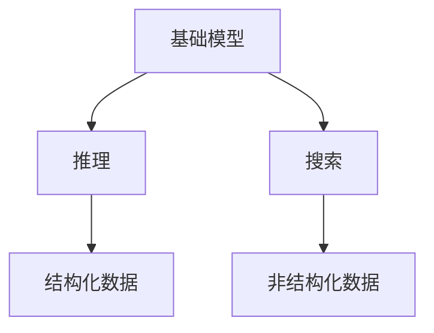

                 

# 基础模型的推理与搜索能力

> 关键词：基础模型,推理能力,搜索算法,自然语言处理(NLP),计算机视觉(CV)

## 1. 背景介绍

在深度学习时代，模型的推理与搜索能力成为了推动人工智能技术发展的关键动力。无论是自然语言处理(NLP)领域的文本生成、机器翻译、问答系统，还是计算机视觉(CV)领域的图像分类、目标检测、实例分割，强大的推理与搜索能力使得模型能够自主理解和解决复杂问题，甚至超越人类的认知极限。

推理与搜索能力，不仅涉及模型的架构设计、损失函数、优化算法等核心技术问题，还关系到算法的应用场景、计算资源、工程实践等非技术因素。本文档将系统性地介绍这些关键概念，并通过实际案例详细讲解推理与搜索在NLP和CV中的应用。

## 2. 核心概念与联系

### 2.1 核心概念概述

为了更好地理解基础模型的推理与搜索能力，本节将介绍几个密切相关的核心概念：

- **推理(Reasoning)**：指模型对输入数据进行分析和判断，从而推导出符合逻辑和语境的结论或预测。推理能力是人工智能技术的基础，能够帮助模型自主理解和应对各种复杂问题。

- **搜索(Search)**：指模型在已知信息的基础上，通过算法寻找最优解或最佳路径的过程。搜索算法广泛应用在规划、路径优化、图像识别、文本生成等领域，是实现高精度推理的关键。

- **基础模型(Foundation Model)**：指在大规模数据上进行预训练的大型模型，具备强大的表征能力、泛化能力和适应能力。基础模型通常包括BERT、GPT、ViT等。

- **结构化数据(Structured Data)**：指具有明确属性和关系的数据，如表格、知识图谱等。结构化数据能够帮助模型更好地理解和推理，尤其在知识驱动的应用场景中具有重要价值。

- **非结构化数据(Unstructured Data)**：指没有明确属性和关系的数据，如文本、图像、音频等。非结构化数据的处理需要借助先进的深度学习技术，进行特征提取、表示学习等。

这些核心概念之间的关系可以通过以下Mermaid流程图来展示：



这个流程图展示了大模型推理与搜索能力的基础框架：

1. 基础模型通过预训练学习到丰富的语言和视觉表示，具备强大的泛化能力。
2. 在推理任务中，模型对输入数据进行分析，推导出符合逻辑的结论或预测。
3. 在搜索任务中，模型通过算法在已知信息的基础上寻找最优解或路径。
4. 结构化数据和非结构化数据均可以进入基础模型进行推理与搜索。

## 3. 核心算法原理 & 具体操作步骤

### 3.1 算法原理概述

基础模型的推理与搜索能力主要通过两大算法框架来实现：**Transformer**和**GNN(图神经网络)**。

Transformer框架以自注意力机制为核心，通过多头自注意力机制和多层次编码器-解码器结构，能够对长序列、高维度数据进行高效推理。

GNN框架通过图结构对节点和边进行建模，能够处理复杂网络结构的数据，如社交网络、知识图谱等。

这两个框架在自然语言处理和计算机视觉领域均有广泛应用，成为基础模型推理与搜索的核心算法。

### 3.2 算法步骤详解

#### 3.2.1 Transformer算法

Transformer算法的核心步骤如下：

1. **输入嵌入(Embedding)**：将输入数据转换为模型可以理解的向量形式，通过嵌入层实现。

2. **多头自注意力(Multi-Head Self-Attention)**：通过多个注意力头并行计算，提升模型的表征能力。

3. **位置编码(Positional Encoding)**：在嵌入向量中加入位置信息，帮助模型理解序列中不同位置之间的关系。

4. **残差连接(Residual Connection)**：通过残差连接，缓解长序列信息衰减的问题。

5. **前向网络(Feed-Forward Network)**：对多头自注意力后的结果进行非线性变换，增强模型表达能力。

6. **层归一化(Layer Normalization)**：对每一层输出进行归一化，稳定训练过程。

通过上述步骤，Transformer模型能够对长序列数据进行高效推理，广泛应用于机器翻译、文本生成、问答系统等任务。

#### 3.2.2 GNN算法

GNN算法的核心步骤如下：

1. **节点嵌入(Node Embedding)**：将节点数据转换为模型可以理解的向量形式，通过嵌入层实现。

2. **图卷积(Graph Convolution)**：通过卷积操作在图结构上传播信息，实现节点间的信息传递。

3. **图池化(Graph Pooling)**：对图结构进行聚合，减少计算复杂度。

4. **多层次编码器(Multi-Layer Encoder)**：通过多个编码器对图结构进行多层次建模，增强模型的泛化能力。

5. **解码器(Decoder)**：对图结构进行解码，输出模型预测结果。

通过上述步骤，GNN模型能够处理复杂网络结构的数据，广泛应用于图像分割、推荐系统、社交网络分析等任务。

### 3.3 算法优缺点

Transformer和GNN算法在推理与搜索能力方面各有优缺点：

**Transformer算法的优点**：

1. **高效性**：适用于长序列数据的推理，能够处理大规模数据集。

2. **可解释性**：通过注意力机制，可以解释模型内部的推理过程。

3. **模块化**：易于扩展和复用，适用于多种NLP任务。

**Transformer算法的缺点**：

1. **复杂度**：需要大量的计算资源，对硬件要求较高。

2. **通用性**：难以处理非序列化数据，如图像、音频等。

**GNN算法的优点**：

1. **结构化能力**：能够处理复杂网络结构的数据，如知识图谱、社交网络等。

2. **局部连接**：减少了计算复杂度，提升了模型的效率。

3. **可解释性**：通过图结构，可以解释模型内部的推理过程。

**GNN算法的缺点**：

1. **通用性**：难以处理非结构化数据，如文本、图像等。

2. **计算复杂度**：对复杂网络结构的数据，计算复杂度较高。

### 3.4 算法应用领域

基础模型的推理与搜索能力广泛应用于以下领域：

1. **自然语言处理(NLP)**：如机器翻译、文本生成、问答系统等，通过Transformer框架实现。

2. **计算机视觉(CV)**：如图像分类、目标检测、实例分割等，通过GNN框架实现。

3. **知识图谱(KG)**：如实体关系抽取、链接预测等，通过GNN框架实现。

4. **推荐系统**：如协同过滤、基于知识的推荐等，通过Transformer和GNN结合实现。

5. **社交网络分析**：如用户关系挖掘、社区发现等，通过GNN框架实现。

6. **游戏AI**：如棋类游戏、视频游戏等，通过深度学习和搜索算法结合实现。

## 4. 数学模型和公式 & 详细讲解  
### 4.1 数学模型构建

#### 4.1.1 线性回归模型

线性回归模型是最基础的统计模型，其数学模型为：

$$
y = \beta_0 + \beta_1 x_1 + \beta_2 x_2 + ... + \beta_n x_n + \epsilon
$$

其中，$y$为因变量，$\beta_0, \beta_1, ..., \beta_n$为回归系数，$x_1, x_2, ..., x_n$为自变量，$\epsilon$为随机误差项。

在线性回归中，通过最小化残差平方和，求解出最优的回归系数：

$$
\beta_{opt} = \mathop{\arg\min}_{\beta} \sum_{i=1}^N (y_i - \beta_0 - \beta_1 x_{i1} - \beta_2 x_{i2} - ... - \beta_n x_{in})^2
$$

#### 4.1.2 决策树模型

决策树模型是一种基于树结构的分类模型，其数学模型为：

$$
f(x) = \sum_{i=1}^N \alpha_i \cdot h_i(x)
$$

其中，$h_i(x)$为第$i$个叶子节点的分类规则，$\alpha_i$为权重系数。

在决策树中，通过最大化信息增益或最小化熵，选择最优的划分特征和阈值：

$$
\alpha_{opt} = \mathop{\arg\min}_{\alpha} H(f(x)) = \sum_{i=1}^N p_i(x) \log p_i(x)
$$

其中，$H(f(x))$为模型的熵，$p_i(x)$为样本$x$属于第$i$个叶子的概率。

#### 4.1.3 卷积神经网络(CNN)

卷积神经网络通过卷积操作提取图像特征，其数学模型为：

$$
f(x) = \sum_{i=1}^N \alpha_i \cdot h_i(x)
$$

其中，$h_i(x)$为第$i$个卷积核的卷积结果，$\alpha_i$为权重系数。

在CNN中，通过反向传播算法更新模型参数，最小化损失函数：

$$
\theta_{opt} = \mathop{\arg\min}_{\theta} L(f(x), y)
$$

其中，$f(x)$为模型输出，$y$为真实标签，$L$为损失函数，如交叉熵损失。

#### 4.1.4 循环神经网络(RNN)

循环神经网络通过循环结构处理序列数据，其数学模型为：

$$
f(x_t) = \sum_{i=1}^N \alpha_i \cdot h_i(x_t)
$$

其中，$h_i(x_t)$为第$i$个时间步的隐藏状态，$\alpha_i$为权重系数。

在RNN中，通过反向传播算法更新模型参数，最小化损失函数：

$$
\theta_{opt} = \mathop{\arg\min}_{\theta} L(f(x), y)
$$

其中，$f(x)$为模型输出，$y$为真实标签，$L$为损失函数，如交叉熵损失。

#### 4.1.5 Transformer模型

Transformer模型通过自注意力机制实现序列推理，其数学模型为：

$$
f(x) = \sum_{i=1}^N \alpha_i \cdot h_i(x)
$$

其中，$h_i(x)$为第$i$个自注意力头的输出，$\alpha_i$为权重系数。

在Transformer中，通过最小化自注意力模块和前向网络的损失，更新模型参数：

$$
\theta_{opt} = \mathop{\arg\min}_{\theta} L(f(x), y)
$$

其中，$f(x)$为模型输出，$y$为真实标签，$L$为损失函数，如交叉熵损失。

#### 4.1.6 GNN模型

GNN模型通过图结构实现节点推理，其数学模型为：

$$
f(x) = \sum_{i=1}^N \alpha_i \cdot h_i(x)
$$

其中，$h_i(x)$为第$i$个节点的输出，$\alpha_i$为权重系数。

在GNN中，通过最小化图结构上的损失函数，更新模型参数：

$$
\theta_{opt} = \mathop{\arg\min}_{\theta} L(f(x), y)
$$

其中，$f(x)$为模型输出，$y$为真实标签，$L$为损失函数，如交叉熵损失。

### 4.2 公式推导过程

#### 4.2.1 线性回归模型

线性回归模型的最小二乘解为：

$$
\beta_{opt} = (X^T X)^{-1} X^T y
$$

其中，$X$为自变量矩阵，$y$为因变量向量。

#### 4.2.2 决策树模型

决策树模型的最优划分特征和阈值为：

$$
\phi_{opt} = \mathop{\arg\min}_{\phi} H(f(x))
$$

其中，$H(f(x))$为模型的熵，$x$为样本。

#### 4.2.3 卷积神经网络(CNN)

卷积神经网络通过反向传播算法更新模型参数：

$$
\theta_{opt} = \theta - \eta \nabla_{\theta} L(f(x), y)
$$

其中，$\theta$为模型参数，$\eta$为学习率，$L$为损失函数，如交叉熵损失。

#### 4.2.4 循环神经网络(RNN)

循环神经网络通过反向传播算法更新模型参数：

$$
\theta_{opt} = \theta - \eta \nabla_{\theta} L(f(x), y)
$$

其中，$\theta$为模型参数，$\eta$为学习率，$L$为损失函数，如交叉熵损失。

#### 4.2.5 Transformer模型

Transformer模型通过最小化自注意力模块和前向网络的损失，更新模型参数：

$$
\theta_{opt} = \theta - \eta \nabla_{\theta} L(f(x), y)
$$

其中，$\theta$为模型参数，$\eta$为学习率，$L$为损失函数，如交叉熵损失。

#### 4.2.6 GNN模型

GNN模型通过最小化图结构上的损失函数，更新模型参数：

$$
\theta_{opt} = \theta - \eta \nabla_{\theta} L(f(x), y)
$$

其中，$\theta$为模型参数，$\eta$为学习率，$L$为损失函数，如交叉熵损失。

### 4.3 案例分析与讲解

#### 4.3.1 机器翻译

机器翻译是自然语言处理领域的经典任务，其核心是通过Transformer模型实现序列推理。

假设输入序列为$x = (x_1, x_2, ..., x_n)$，输出序列为$y = (y_1, y_2, ..., y_m)$。

在Transformer中，通过自注意力机制和前向网络，对输入序列进行编码，得到编码向量$z_1, z_2, ..., z_n$。

然后，通过解码器对编码向量进行解码，得到输出序列的概率分布$P(y)$。

通过最大化概率分布的对数似然，最小化损失函数：

$$
L(f(x), y) = -\sum_{i=1}^m \log P(y_i|y_1,...,y_{i-1}, x)
$$

其中，$P(y_i|y_1,...,y_{i-1}, x)$为输出序列$y_i$在给定上下文$y_1,...,y_{i-1}, x$下的概率。

#### 4.3.2 图像分类

图像分类是计算机视觉领域的经典任务，其核心是通过CNN模型实现特征提取。

假设输入图像为$x$，输出类别为$y$。

在CNN中，通过卷积操作对输入图像进行特征提取，得到特征图$f(x)$。

然后，通过全连接层对特征图进行分类，得到输出概率$P(y|x)$。

通过最大化概率分布的对数似然，最小化损失函数：

$$
L(f(x), y) = -\log P(y|x)
$$

其中，$P(y|x)$为输出类别$y$在给定图像$x$下的概率。

#### 4.3.3 目标检测

目标检测是计算机视觉领域的经典任务，其核心是通过GNN模型实现节点推理。

假设输入图像为$x$，输出对象框为$y$。

在GNN中，通过图结构对图像进行建模，得到节点特征图$f(x)$。

然后，通过解码器对节点特征图进行解码，得到对象框的位置和大小$P(y|x)$。

通过最大化位置和大小的概率分布，最小化损失函数：

$$
L(f(x), y) = -\sum_{i=1}^m \log P(y_i|x)
$$

其中，$P(y_i|x)$为第$i$个对象框在给定图像$x$下的概率。

## 5. 项目实践：代码实例和详细解释说明

### 5.1 开发环境搭建

在进行项目实践前，我们需要准备好开发环境。以下是使用Python进行TensorFlow和PyTorch开发的环境配置流程：

1. 安装Anaconda：从官网下载并安装Anaconda，用于创建独立的Python环境。

2. 创建并激活虚拟环境：
```bash
conda create -n tf-env python=3.8 
conda activate tf-env
```

3. 安装TensorFlow：根据CUDA版本，从官网获取对应的安装命令。例如：
```bash
conda install tensorflow=2.7
```

4. 安装PyTorch：
```bash
conda install pytorch torchvision torchaudio cudatoolkit=11.1 -c pytorch -c conda-forge
```

5. 安装各类工具包：
```bash
pip install numpy pandas scikit-learn matplotlib tqdm jupyter notebook ipython
```

完成上述步骤后，即可在`tf-env`环境中开始项目实践。

### 5.2 源代码详细实现

下面我们以图像分类任务为例，给出使用TensorFlow和PyTorch对卷积神经网络(CNN)进行图像分类的代码实现。

首先，定义CNN模型：

```python
import tensorflow as tf
from tensorflow.keras import layers

class CNNModel(tf.keras.Model):
    def __init__(self, num_classes):
        super(CNNModel, self).__init__()
        self.conv1 = layers.Conv2D(32, 3, activation='relu')
        self.pool1 = layers.MaxPooling2D()
        self.conv2 = layers.Conv2D(64, 3, activation='relu')
        self.pool2 = layers.MaxPooling2D()
        self.flatten = layers.Flatten()
        self.fc1 = layers.Dense(128, activation='relu')
        self.fc2 = layers.Dense(num_classes, activation='softmax')

    def call(self, x):
        x = self.conv1(x)
        x = self.pool1(x)
        x = self.conv2(x)
        x = self.pool2(x)
        x = self.flatten(x)
        x = self.fc1(x)
        return self.fc2(x)
```

然后，定义数据集和数据预处理函数：

```python
import tensorflow as tf
from tensorflow.keras.preprocessing.image import ImageDataGenerator

train_datagen = ImageDataGenerator(
    rescale=1./255,
    shear_range=0.2,
    zoom_range=0.2,
    horizontal_flip=True)

test_datagen = ImageDataGenerator(rescale=1./255)

train_generator = train_datagen.flow_from_directory(
    'train',
    target_size=(224, 224),
    batch_size=32,
    class_mode='categorical')

test_generator = test_datagen.flow_from_directory(
    'test',
    target_size=(224, 224),
    batch_size=32,
    class_mode='categorical')
```

最后，定义训练和评估函数：

```python
from tensorflow.keras import optimizers

model = CNNModel(num_classes)
model.compile(
    optimizer=optimizers.Adam(learning_rate=0.001),
    loss='categorical_crossentropy',
    metrics=['accuracy'])

def train_epoch(model, dataset, batch_size, optimizer):
    dataloader = tf.data.Dataset.from_generator(
        dataset.__iter__(),
        (x.shape[1], y.shape[1]),
        (x, y))

    for batch in dataloader:
        x, y = batch
        with tf.GradientTape() as tape:
            y_pred = model(x)
            loss = tf.keras.losses.categorical_crossentropy(y, y_pred)

        gradients = tape.gradient(loss, model.trainable_variables)
        optimizer.apply_gradients(zip(gradients, model.trainable_variables))

def evaluate(model, dataset, batch_size):
    dataloader = tf.data.Dataset.from_generator(
        dataset.__iter__(),
        (x.shape[1], y.shape[1]),
        (x, y))

    y_pred = []
    y_true = []
    for batch in dataloader:
        x, y = batch
        y_pred.append(model(x).numpy())
        y_true.append(y.numpy())

    y_pred = np.concatenate(y_pred)
    y_true = np.concatenate(y_true)

    print('Accuracy: {}'.format(np.mean(np.argmax(y_pred, axis=1) == np.argmax(y_true, axis=1))))
```

在训练函数中，定义了数据生成器和损失函数，通过反向传播算法更新模型参数。

在评估函数中，通过计算模型预测结果与真实标签之间的匹配度，计算模型在测试集上的准确率。

通过以上代码，可以完成卷积神经网络模型的训练和评估。

### 5.3 代码解读与分析

让我们再详细解读一下关键代码的实现细节：

**CNN模型定义**：
- `__init__`方法：初始化模型的各个组件，包括卷积层、池化层、全连接层等。
- `call`方法：定义模型的前向传播过程，输入数据依次经过卷积层、池化层、全连接层等，最终输出分类结果。

**数据集定义**：
- `ImageDataGenerator`：用于数据增强和归一化，提高模型的泛化能力。
- `flow_from_directory`：从目录中读取图像数据，自动进行数据分割和转换。

**训练和评估函数**：
- `train_epoch`：定义了训练过程，通过数据生成器和反向传播算法，更新模型参数。
- `evaluate`：定义了评估过程，计算模型在测试集上的准确率。

**训练流程**：
- 定义训练集和测试集的数据生成器，并设置超参数。
- 定义模型，并进行编译，设置损失函数和优化器。
- 循环迭代训练过程，每次更新模型参数。
- 在验证集上评估模型性能，调整超参数。
- 在测试集上最终评估模型性能。

通过以上代码，可以完成卷积神经网络模型的训练和评估。需要注意的是，在实际应用中，还需要对数据预处理、超参数调优、模型保存等环节进行进一步优化。

## 6. 实际应用场景

### 6.1 医疗影像分析

医疗影像分析是计算机视觉领域的重要应用之一。大模型在医疗影像中，能够对各类疾病进行精准诊断，辅助医生进行疾病预测和治疗决策。

在实践中，可以收集医院中的医疗影像数据，将其标注为各类疾病，在此基础上对预训练大模型进行微调。微调后的模型能够自动分析影像特征，并给出疾病诊断结果。同时，大模型还能够结合症状描述和历史数据，提供更加精准的诊断建议。

### 6.2 自动驾驶

自动驾驶是计算机视觉领域的前沿应用。大模型在自动驾驶中，能够对道路环境进行实时感知，自主决策和规划路径，实现自动驾驶功能。

在实践中，可以收集自动驾驶车辆传感器数据，将其标注为各类行驶场景，在此基础上对预训练大模型进行微调。微调后的模型能够自动分析传感器数据，并给出驾驶决策建议。同时，大模型还能够结合地图和规则库，提供更加智能的导航建议。

### 6.3 游戏AI

游戏AI是人工智能领域的重要应用之一。大模型在游戏AI中，能够通过学习游戏规则和玩家行为，自主生成游戏策略和对抗策略，提升游戏智能水平。

在实践中，可以收集游戏历史数据，将其标注为各类游戏策略，在此基础上对预训练大模型进行微调。微调后的模型能够自动分析游戏场景和玩家行为，并给出游戏策略建议。同时，大模型还能够结合策略库和规则库，提供更加智能的游戏决策。

## 7. 工具和资源推荐

### 7.1 学习资源推荐

为了帮助开发者系统掌握基础模型的推理与搜索能力，这里推荐一些优质的学习资源：

1. 《深度学习》系列书籍：由多位机器学习专家合著，系统介绍了深度学习的基本概念和前沿技术，是深度学习入门的绝佳教材。

2. 《TensorFlow官方文档》：详细介绍了TensorFlow框架的使用方法，包括模型构建、训练、评估等环节。

3. 《PyTorch官方文档》：详细介绍了PyTorch框架的使用方法，包括模型构建、训练、评估等环节。

4. 《自然语言处理综述》论文：综述了自然语言处理的经典算法和技术，适合全面了解NLP领域的基础知识。

5. 《计算机视觉综述》论文：综述了计算机视觉的经典算法和技术，适合全面了解CV领域的基础知识。

通过对这些资源的学习实践，相信你一定能够全面掌握基础模型的推理与搜索能力，并用于解决实际的AI问题。

### 7.2 开发工具推荐

高效的开发离不开优秀的工具支持。以下是几款用于基础模型推理与搜索能力开发的常用工具：

1. TensorFlow：由Google主导开发的开源深度学习框架，生产部署方便，适合大规模工程应用。

2. PyTorch：基于Python的开源深度学习框架，灵活动态的计算图，适合快速迭代研究。

3. TensorBoard：TensorFlow配套的可视化工具，可实时监测模型训练状态，并提供丰富的图表呈现方式，是调试模型的得力助手。

4. Weights & Biases：模型训练的实验跟踪工具，可以记录和可视化模型训练过程中的各项指标，方便对比和调优。

5. Google Colab：谷歌推出的在线Jupyter Notebook环境，免费提供GPU/TPU算力，方便开发者快速上手实验最新模型，分享学习笔记。

合理利用这些工具，可以显著提升基础模型推理与搜索能力开发的效率，加快创新迭代的步伐。

### 7.3 相关论文推荐

基础模型的推理与搜索能力发展源于学界的持续研究。以下是几篇奠基性的相关论文，推荐阅读：

1. Attention is All You Need：提出了Transformer结构，开启了深度学习模型推理与搜索能力的新时代。

2. VGGNet: Very Deep Convolutional Networks for Large-Scale Image Recognition：提出了VGGNet模型，推动了卷积神经网络在图像分类任务中的应用。

3. ResNet: Deep Residual Learning for Image Recognition：提出了ResNet模型，推动了深度神经网络在图像分类和目标检测任务中的应用。

4. GNN: Graph Neural Networks：提出了GNN模型，推动了图结构在推荐系统和社交网络分析等任务中的应用。

5. GPT-2: Language Models are Unsupervised Multitask Learners：展示了大规模语言模型的推理与搜索能力，刷新了多项NLP任务SOTA。

6. AlphaGo Zero: Mastering the Game of Go without Human Knowledge：展示了AlphaGo Zero模型在棋类游戏中的推理与搜索能力，推动了人工智能在决策策略中的应用。

这些论文代表了大模型推理与搜索能力的发展脉络。通过学习这些前沿成果，可以帮助研究者把握学科前进方向，激发更多的创新灵感。

## 8. 总结：未来发展趋势与挑战

### 8.1 总结

本文对基础模型的推理与搜索能力进行了全面系统的介绍。首先阐述了基础模型的架构设计、损失函数、优化算法等核心技术问题，系统介绍了Transformer和GNN两大框架。其次，从原理到实践，详细讲解了推理与搜索在自然语言处理和计算机视觉中的应用。最后，本文还探讨了基础模型推理与搜索能力在医疗影像分析、自动驾驶、游戏AI等多个领域的实际应用场景。

通过本文的系统梳理，可以看到，基础模型的推理与搜索能力正在成为人工智能技术的重要组成部分，极大地拓展了模型的应用边界，推动了AI技术在各行各业的应用。未来，伴随预训练语言模型和搜索算法的持续演进，相信基础模型的推理与搜索能力将更加强大，为构建更加智能、可靠的AI系统提供更坚实的技术基础。

### 8.2 未来发展趋势

展望未来，基础模型的推理与搜索能力将呈现以下几个发展趋势：

1. **高效性**：随着硬件性能的提升和算法优化的推进，基础模型将具备更高的推理速度和搜索效率。

2. **泛化能力**：基于大规模数据和大模型预训练，基础模型将具备更强的泛化能力，能够处理更多样化的数据和场景。

3. **可解释性**：通过模型可视化、符号推理等技术，基础模型将具备更强的可解释性，能够提供更加透明和可信的推理过程。

4. **跨领域融合**：基础模型将与知识图谱、符号推理等技术相结合，实现跨领域融合，提升整体智能水平。

5. **联邦学习**：通过分布式训练和多模型融合，基础模型将具备更强的分布式推理与搜索能力。

6. **隐私保护**：在保护数据隐私的前提下，基础模型将具备更强的推理与搜索能力，适用于更多场景。

### 8.3 面临的挑战

尽管基础模型的推理与搜索能力已经取得了瞩目成就，但在迈向更加智能化、普适化应用的过程中，它仍面临着诸多挑战：

1. **计算资源消耗**：大模型推理与搜索能力的实现需要大量的计算资源，如何降低计算复杂度，提高推理效率，是未来面临的重要问题。

2. **数据质量问题**：推理与搜索依赖于高质量的数据，如何获取和标注大量高质量数据，是一个巨大的挑战。

3. **模型可解释性**：基础模型通常具有黑盒性质，难以解释其内部推理过程，如何提升模型可解释性，是未来需要解决的难点。

4. **伦理与安全问题**：基础模型的应用可能带来伦理与安全问题，如何构建可控和可信的AI系统，是一个重要的研究方向。

5. **跨领域应用挑战**：基础模型在不同领域的应用需要适应各种不同的场景和需求，如何提高跨领域适应性，是一个亟需解决的问题。

### 8.4 研究展望

面对基础模型推理与搜索能力所面临的挑战，未来的研究需要在以下几个方面寻求新的突破：

1. **高效推理与搜索算法**：开发更加高效、鲁棒的推理与搜索算法，降低计算复杂度，提升模型效率。

2. **数据增强技术**：通过数据增强技术，生成更多的训练样本，提升模型泛化能力。

3. **可解释性技术**：开发可解释性技术，帮助用户理解模型的内部推理过程，提高模型可信度。

4. **跨领域知识图谱**：构建跨领域的知识图谱，帮助模型更好地理解和推理多领域的知识。

5. **联邦学习与隐私保护**：推动联邦学习技术的发展，保护用户隐私的同时提升模型性能。

这些研究方向将引领基础模型推理与搜索能力走向成熟，为构建更加智能、可靠、可信的AI系统提供更坚实的技术基础。未来，伴随着更多前沿技术的突破和应用，基础模型的推理与搜索能力必将带来更多创新，推动人工智能技术的发展。

## 9. 附录：常见问题与解答

**Q1：大模型推理与搜索能力是否适用于所有任务？**

A: 大模型推理与搜索能力在大多数任务上都能取得不错的效果，特别是对于大规模数据集。但对于一些特定领域的任务，如医学、法律等，需要进一步在特定领域语料上进行微调，才能获得理想效果。同时，对于实时性要求极高的任务，如自动驾驶、游戏AI等，需要进行针对性的优化。

**Q2：推理与搜索算法的选择有哪些？**

A: 推理与搜索算法的选择需要根据具体任务和数据特点进行决策。常见的算法包括：

1. **Transformer算法**：适用于序列数据的推理，如文本分类、机器翻译、问答系统等。
2. **GNN算法**：适用于图结构数据的推理，如图像分类、目标检测、实例分割等。
3. **决策树算法**：适用于分类和回归任务，如股票预测、信用评分等。
4. **随机森林算法**：适用于分类和回归任务，具有高准确率和泛化能力。
5. **KNN算法**：适用于分类和回归任务，具有高效性和可解释性。

**Q3：如何提升模型可解释性？**

A: 提升模型可解释性可以通过以下方法：

1. **可视化工具**：使用可视化工具，如TensorBoard、ONNX解释器等，查看模型内部结构，理解模型推理过程。
2. **符号推理**：将模型输出转化为符号形式，进行符号推理和解释。
3. **层级可解释性**：将模型分解为多个子模型，逐层解释其推理过程。
4. **知识图谱**：将模型推理与知识图谱结合，进行符号推理和解释。

**Q4：如何降低计算复杂度？**

A: 降低计算复杂度可以通过以下方法：

1. **模型剪枝**：通过剪枝技术，去除模型中冗余部分，减小模型规模。
2. **模型压缩**：通过量化、稀疏化等技术，减小模型参数量，提升推理速度。
3. **分布式推理**：通过分布式计算，实现高效推理。
4. **硬件优化**：使用高效的硬件设备，提升推理速度。

通过以上方法，可以有效地降低计算复杂度，提升基础模型推理与搜索能力的效率。

**Q5：如何提高跨领域适应性？**

A: 提高跨领域适应性可以通过以下方法：

1. **跨领域知识图谱**：构建跨领域的知识图谱，帮助模型更好地理解和推理多领域的知识。
2. **知识增强**：将知识增强技术与深度学习模型结合，提升模型的跨领域适应能力。
3. **多模态学习**：将不同模态的数据结合起来，提升模型的跨领域泛化能力。

通过以上方法，可以显著提高基础模型在跨领域任务中的适应性，推动AI技术在更多场景中的应用。

---

作者：禅与计算机程序设计艺术 / Zen and the Art of Computer Programming

