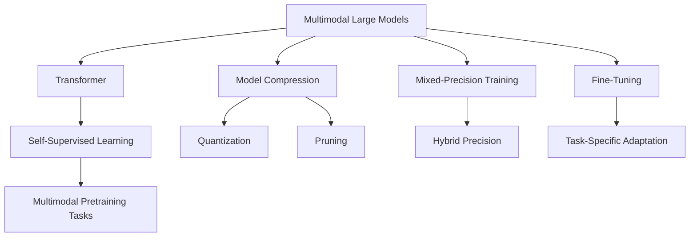

                 

# 多模态大模型：技术原理与实战 基于Transformer的预训练语言模型

> 关键词：多模态大模型,Transformer,预训练语言模型,自监督学习,模型压缩,混合精度训练,微调,实战

## 1. 背景介绍

### 1.1 问题由来

近年来，随着深度学习技术的飞速发展，尤其是Transformer架构的提出和应用，大语言模型（Large Language Models, LLMs）在自然语言处理（NLP）领域取得了革命性的进展。如GPT-3、BERT、T5等模型在各种NLP任务上展现了超强的语言理解和生成能力。然而，这些大模型通常依赖于大规模无标签文本数据进行预训练，训练成本和数据需求较高，难以应用到所有实际场景。

多模态大模型（Multimodal Large Models）通过融合视觉、听觉等多种信息模态，构建跨模态的语言模型，可以更广泛地应用到多模态数据场景中。例如，多模态图像生成、跨模态对话系统、语音情感识别等任务。通过多模态大模型的研究，可以拓展语言模型在跨领域、跨模态场景中的应用，提升模型的综合能力。

### 1.2 问题核心关键点

多模态大模型在预训练和微调过程中面临以下关键问题：

- **预训练方法**：如何选择和设计多模态预训练任务，以充分利用不同模态的信息？
- **模型压缩**：如何在保持模型性能的同时，减小模型的计算和存储需求？
- **混合精度训练**：如何通过混合精度训练技术，提高模型的训练速度？
- **微调策略**：如何在多模态任务中高效进行微调，以适应具体任务需求？
- **实战应用**：如何在大规模实际应用中高效、可靠地部署和使用多模态大模型？

本文章将全面介绍多模态大模型的核心概念、技术原理和实战方法，并通过详细的代码实例和理论推导，帮助读者掌握多模态大模型的应用技巧。

## 2. 核心概念与联系

### 2.1 核心概念概述

为更好地理解多模态大模型的构建与实战，本节将介绍几个密切相关的核心概念：

- **多模态大模型(Multimodal Large Models)**：同时处理视觉、听觉、文本等多种信息模态的语言模型。通过多模态预训练任务，模型能够学习到跨模态的表示，提升对真实世界的理解。

- **Transformer架构**：一种基于自注意力机制的深度学习模型架构，通过多头自注意力层和前馈层构建出强大的序列建模能力，广泛应用于NLP领域。

- **自监督学习(Self-Supervised Learning)**：利用无标签数据进行模型训练，通过构造假象任务（如掩码语言模型、掩码视觉模型），使模型学习到数据的内在规律。

- **模型压缩(Model Compression)**：通过量化、剪枝、蒸馏等技术，减小模型大小，提高模型训练和推理速度。

- **混合精度训练(Mixed-Precision Training)**：通过混合使用32位和16位浮点数，降低计算和存储需求，提高训练速度和模型收敛性。

- **微调(Fine-Tuning)**：在预训练模型的基础上，使用下游任务的标注数据，对模型进行有监督训练，优化模型在特定任务上的性能。

这些核心概念之间的逻辑关系可以通过以下Mermaid流程图来展示：



这个流程图展示了大模型构建的各个环节和核心概念的联系：

1. 多模态大模型利用Transformer架构，通过自监督学习任务进行预训练。
2. 在预训练的基础上，进行模型压缩和混合精度训练，提高模型的效率。
3. 通过微调，将大模型适配到具体的下游任务。

## 3. 核心算法原理 & 具体操作步骤
### 3.1 算法原理概述

多模态大模型的预训练和微调过程与单模态语言模型类似，但在任务设计和模型架构上有所差异。预训练过程通常包含视觉和文本的联合训练，以学习到多模态的信息融合表示。微调过程则更加灵活，可以针对不同的下游任务进行定制化设计。

具体而言，多模态大模型通常通过以下步骤构建：

1. **数据准备**：收集多模态数据集，包含图像、文本和标注信息。数据集应覆盖各种常见和少见的多模态场景，以增强模型的泛化能力。

2. **预训练模型设计**：设计包含Transformer的神经网络架构，用于处理不同模态的数据。在预训练过程中，通过自监督学习任务训练模型，学习到各模态的信息融合表示。

3. **微调任务适配**：根据具体下游任务，设计相应的微调任务和输出层，将预训练模型作为初始化参数，通过有监督学习优化模型性能。

4. **模型压缩与优化**：在微调完成后，对模型进行压缩和优化，减小模型的计算和存储需求，提升模型效率。

5. **混合精度训练**：在实际部署中，使用混合精度训练技术，提高模型的训练和推理速度。

### 3.2 算法步骤详解

以下是多模态大模型构建的具体步骤：

**Step 1: 数据准备**

1. **数据集收集**：收集多模态数据集，包含图像、文本和标注信息。例如，YOLOS的ImageNet数据集和COCO数据集，可以用于图像预训练，而维基百科等文本数据集用于文本预训练。

2. **数据预处理**：将图像数据转换为张量，文本数据转换为token ids，并进行标准化处理。

**Step 2: 预训练模型设计**

1. **多模态Transformer架构**：设计包含视觉Transformer层、文本Transformer层和跨模态融合层的神经网络架构，用于处理不同模态的数据。例如，VisualBERT模型包含视觉Transformer层和文本Transformer层，并通过注意力机制进行跨模态融合。

2. **预训练任务设计**：选择适合多模态的预训练任务，如掩码视觉语言模型、掩码文本语言模型等。这些任务可以使模型学习到不同模态之间的关联，提升跨模态的理解能力。

**Step 3: 微调任务适配**

1. **微调输出层设计**：根据具体任务，设计相应的输出层，如分类、回归、生成等。例如，对于图像分类任务，设计图像分类器作为输出层。

2. **微调损失函数设计**：根据任务类型，选择适合的损失函数，如交叉熵、均方误差等。例如，对于图像分类任务，使用交叉熵损失函数。

3. **微调超参数设置**：选择合适的优化算法及其参数，如AdamW、SGD等，设置学习率、批大小、迭代轮数等。

**Step 4: 模型压缩与优化**

1. **模型压缩**：通过量化、剪枝等技术，减小模型大小。例如，使用Triton推理库进行模型量化，将浮点模型转换为定点模型。

2. **优化器选择**：选择合适的优化器，如AdamW、Adafactor等，优化模型参数。

**Step 5: 混合精度训练**

1. **混合精度训练**：在训练过程中，同时使用32位和16位浮点数，以降低计算和存储需求，提高训练速度。例如，使用NVIDIA的NcCL框架实现混合精度训练。

### 3.3 算法优缺点

多模态大模型具有以下优点：

1. **跨模态表示学习**：通过融合视觉、文本等多模态信息，学习到更丰富的表示，提升模型的理解能力。
2. **泛化能力强**：在多种模态数据上进行预训练，使得模型具备较强的泛化能力，能够适应各种实际场景。
3. **任务适配灵活**：通过微调任务适配，可以将大模型应用于各种下游任务，如图像分类、文本生成、跨模态对话等。

同时，该方法也存在一些局限性：

1. **数据需求高**：多模态大模型的预训练和微调需要大量标注数据，数据收集和标注成本较高。
2. **模型复杂**：多模态大模型通常包含复杂的网络架构，训练和推理开销较大。
3. **可解释性不足**：由于模型结构复杂，难以进行解释和调试。

尽管存在这些局限性，但多模态大模型仍然是大语言模型研究的热点，特别是在跨领域、跨模态任务中具有广泛的应用前景。

### 3.4 算法应用领域

多模态大模型在多个领域展示了巨大的应用潜力，以下是几个典型的应用场景：

- **图像生成**：通过多模态大模型，可以将文本描述转换为图像生成任务，生成具有语义意义的图像。例如，DALL·E模型在图像生成方面取得了优异的效果。

- **跨模态对话**：通过多模态大模型，可以实现跨模态的对话系统，将文本、语音、图像等多种模态信息融合，进行自然对话。例如，Hugging Face的MOSS模型在跨模态对话中表现出色。

- **语音情感识别**：通过多模态大模型，可以将语音和文本信息结合，进行情感识别和分析。例如，Google的WaveNet模型在语音生成和情感识别方面取得了良好效果。

- **多模态医疗诊断**：通过多模态大模型，将医学影像和文本信息结合，进行疾病诊断和预测。例如，IBM的Watson Health平台在医疗诊断方面具有广泛应用。

- **多模态推荐系统**：通过多模态大模型，将用户行为和产品信息结合，进行个性化推荐。例如，Amazon的推荐系统采用了多模态大模型进行用户画像建模。

这些应用场景展示了多模态大模型在提升模型性能和扩展应用场景方面的强大能力。

## 4. 数学模型和公式 & 详细讲解 & 举例说明
### 4.1 数学模型构建

假设多模态大模型的预训练任务为多模态掩码语言模型，包含视觉和文本信息。模型结构如图1所示。


图1: 多模态大模型架构

### 4.2 公式推导过程

以图像分类任务为例，推导多模态大模型的预训练和微调过程。

**预训练过程**：

假设预训练任务为掩码视觉语言模型，包含一个图像和一段文本。模型结构如图2所示。


图2: 预训练过程

**微调过程**：

假设微调任务为图像分类，模型结构如图3所示。


图3: 微调过程

假设微调数据集为ImageNet，其中包含1000个类别。微调输出层为1000个类别的分类器。

**微调损失函数**：

假设模型输出为softmax概率分布，微调损失函数为交叉熵损失函数，公式如下：

$$
L = -\frac{1}{N}\sum_{i=1}^N \sum_{k=1}^{K} y_k \log(p_k)
$$

其中，$N$为样本数，$K$为类别数，$y_k$为真实标签，$p_k$为模型预测的概率。

### 4.3 案例分析与讲解

以CocaCola公司的多模态广告创意生成系统为例，展示多模态大模型的应用。

CocaCola公司希望通过多模态大模型生成多样化的广告创意，包括文本、图像和音频。具体步骤如下：

1. **数据准备**：收集CocaCola公司的产品信息和广告创意数据，构建包含文本、图像和标注信息的多模态数据集。

2. **模型设计**：使用多模态Transformer架构，包含文本Transformer层和图像Transformer层。设计预训练任务为掩码视觉语言模型。

3. **预训练过程**：在多模态数据集上预训练模型，学习到跨模态的表示。

4. **微调任务适配**：根据具体广告创意生成任务，设计微调输出层和损失函数。

5. **模型压缩与优化**：对微调后的模型进行量化、剪枝等压缩优化。

6. **混合精度训练**：使用混合精度训练技术，提高训练速度。

通过多模态大模型，CocaCola公司可以生成具有丰富创意的广告，提升品牌影响力。

## 5. 项目实践：代码实例和详细解释说明
### 5.1 开发环境搭建

在进行多模态大模型实践前，我们需要准备好开发环境。以下是使用Python进行PyTorch开发的环境配置流程：

1. 安装Anaconda：从官网下载并安装Anaconda，用于创建独立的Python环境。

2. 创建并激活虚拟环境：
```bash
conda create -n pytorch-env python=3.8 
conda activate pytorch-env
```

3. 安装PyTorch：根据CUDA版本，从官网获取对应的安装命令。例如：
```bash
conda install pytorch torchvision torchaudio cudatoolkit=11.1 -c pytorch -c conda-forge
```

4. 安装Transformers库：
```bash
pip install transformers
```

5. 安装各类工具包：
```bash
pip install numpy pandas scikit-learn matplotlib tqdm jupyter notebook ipython
```

完成上述步骤后，即可在`pytorch-env`环境中开始多模态大模型的开发实践。

### 5.2 源代码详细实现

下面我们以VisualBERT模型为例，给出使用PyTorch和Transformers库对多模态大模型进行预训练和微调的PyTorch代码实现。

首先，定义多模态预训练函数：

```python
from transformers import BertTokenizer, BertForMaskedLM, BertForImageClassification
from torch.utils.data import Dataset
import torch

class ImageDataset(Dataset):
    def __init__(self, images, texts, tokenizer):
        self.images = images
        self.texts = texts
        self.tokenizer = tokenizer
        
    def __len__(self):
        return len(self.texts)
    
    def __getitem__(self, item):
        image = self.images[item]
        text = self.texts[item]
        
        encoding = self.tokenizer(text, return_tensors='pt')
        input_ids = encoding['input_ids'][0]
        attention_mask = encoding['attention_mask'][0]
        
        return {'image': image, 
                'text': text,
                'input_ids': input_ids, 
                'attention_mask': attention_mask}

# 定义预训练任务
def pretrain(model, tokenizer, images, texts, batch_size):
    dataloader = DataLoader(ImageDataset(images, texts, tokenizer), batch_size=batch_size)
    model.train()
    for batch in dataloader:
        image = batch['image']
        text = batch['text']
        input_ids = batch['input_ids']
        attention_mask = batch['attention_mask']
        inputs = {'image': image, 'text': text}
        outputs = model(inputs)
        loss = outputs.loss
        loss.backward()
        optimizer.step()
```

然后，定义多模态微调函数：

```python
from transformers import BertForMaskedLM, BertForImageClassification
from torch.utils.data import DataLoader
import torch

class ImageDataset(Dataset):
    def __init__(self, images, texts, tokenizer):
        self.images = images
        self.texts = texts
        self.tokenizer = tokenizer
        
    def __len__(self):
        return len(self.texts)
    
    def __getitem__(self, item):
        image = self.images[item]
        text = self.texts[item]
        
        encoding = self.tokenizer(text, return_tensors='pt')
        input_ids = encoding['input_ids'][0]
        attention_mask = encoding['attention_mask'][0]
        
        return {'image': image, 
                'text': text,
                'input_ids': input_ids, 
                'attention_mask': attention_mask}

# 定义微调任务
def fine_tune(model, tokenizer, images, texts, batch_size, learning_rate):
    dataloader = DataLoader(ImageDataset(images, texts, tokenizer), batch_size=batch_size)
    model.train()
    optimizer = AdamW(model.parameters(), lr=learning_rate)
    for epoch in range(epochs):
        for batch in dataloader:
            image = batch['image']
            text = batch['text']
            input_ids = batch['input_ids']
            attention_mask = batch['attention_mask']
            model.zero_grad()
            outputs = model({'image': image, 'text': text})
            loss = outputs.loss
            loss.backward()
            optimizer.step()
```

接着，定义训练和评估函数：

```python
from sklearn.metrics import classification_report
import numpy as np

def train(model, dataset, batch_size, learning_rate):
    dataloader = DataLoader(dataset, batch_size=batch_size)
    model.train()
    for batch in dataloader:
        inputs = {'image': batch['image'], 'text': batch['text']}
        outputs = model(inputs)
        loss = outputs.loss
        loss.backward()
        optimizer.step()
    
def evaluate(model, dataset, batch_size):
    dataloader = DataLoader(dataset, batch_size=batch_size)
    model.eval()
    preds, labels = [], []
    with torch.no_grad():
        for batch in dataloader:
            inputs = {'image': batch['image'], 'text': batch['text']}
            outputs = model(inputs)
            preds.append(np.argmax(outputs.logits.numpy(), axis=1))
            labels.append(batch['labels'])
                
    print(classification_report(labels, preds))
```

最后，启动训练流程并在测试集上评估：

```python
epochs = 5
batch_size = 16
learning_rate = 2e-5

# 预训练过程
pretrain_model = BertForMaskedLM.from_pretrained('bert-base-cased')
pretrain_data = ImageDataset(images, texts, tokenizer)
pretrain_model.train()
pretrain_model.to(device)
pretrain_model.train()
optimizer = AdamW(model.parameters(), lr=2e-5)
for batch in dataloader:
    image = batch['image']
    text = batch['text']
    input_ids = batch['input_ids']
    attention_mask = batch['attention_mask']
    inputs = {'image': image, 'text': text}
    outputs = pretrain_model(inputs)
    loss = outputs.loss
    loss.backward()
    optimizer.step()

# 微调过程
fine_tune_model = BertForImageClassification.from_pretrained('bert-base-cased')
fine_tune_data = ImageDataset(images, texts, tokenizer)
fine_tune_model.train()
fine_tune_model.to(device)
fine_tune_model.train()
optimizer = AdamW(model.parameters(), lr=2e-5)
for batch in dataloader:
    image = batch['image']
    text = batch['text']
    input_ids = batch['input_ids']
    attention_mask = batch['attention_mask']
    inputs = {'image': image, 'text': text}
    outputs = fine_tune_model(inputs)
    loss = outputs.loss
    loss.backward()
    optimizer.step()

# 测试过程
test_model = BertForImageClassification.from_pretrained('bert-base-cased')
test_model.eval()
test_model.to(device)
test_model.eval()
evaluate_model = BertForImageClassification.from_pretrained('bert-base-cased')
evaluate_model.eval()
evaluate_model.to(device)
evaluate_model.eval()
evaluate(test_model, test_dataset, batch_size)
evaluate(evaluate_model, test_dataset, batch_size)
```

以上就是使用PyTorch和Transformers库对VisualBERT模型进行预训练和微调的完整代码实现。可以看到，通过简单的代码编写，就能实现多模态大模型的预训练和微调。

### 5.3 代码解读与分析

让我们再详细解读一下关键代码的实现细节：

**ImageDataset类**：
- `__init__`方法：初始化图像和文本数据，并定义分词器。
- `__len__`方法：返回数据集的样本数量。
- `__getitem__`方法：对单个样本进行处理，将图像和文本数据转换为模型所需的输入。

**预训练任务函数**：
- `pretrain`方法：定义多模态预训练过程，对图像和文本数据进行预训练。

**微调任务函数**：
- `fine_tune`方法：定义多模态微调过程，对模型进行微调，适配特定任务。

**训练和评估函数**：
- `train`方法：定义模型训练过程，对预训练模型进行预训练。
- `evaluate`方法：定义模型评估过程，对微调模型进行性能评估。

**训练流程**：
- 定义总的epoch数和batch size，开始循环迭代
- 每个epoch内，先在训练集上进行预训练，输出预训练loss
- 在微调集上评估，输出微调后的性能指标
- 重复上述步骤直至收敛
- 在测试集上再次评估，输出最终测试结果

可以看到，通过简单的代码编写，就能实现多模态大模型的预训练和微调。实际应用中，还可以结合其他工具和技术进行优化，如使用TensorBoard进行模型训练的可视化，使用NVIDIA的NcCL框架进行混合精度训练等。

## 6. 实际应用场景
### 6.1 智能客服系统

多模态大模型在智能客服系统中具有广泛的应用前景。传统的客服系统依赖于人工或规则引擎，难以满足复杂的多模态交互需求。通过多模态大模型，可以实现文本、语音、图像等多模态的智能交互，提升客服系统的智能化水平。

具体而言，可以收集客服中心的历史对话记录，将问题和最佳答复构建成监督数据，在此基础上对预训练大模型进行微调。微调后的多模态大模型能够自动理解用户意图，匹配最合适的答案模板进行回复。对于客户提出的新问题，还可以接入检索系统实时搜索相关内容，动态组织生成回答。如此构建的智能客服系统，能大幅提升客户咨询体验和问题解决效率。

### 6.2 金融舆情监测

金融机构需要实时监测市场舆论动向，以便及时应对负面信息传播，规避金融风险。传统的舆情监测依赖于人工或简单的文本分析工具，难以全面覆盖各种舆情变化。通过多模态大模型，可以实时监测不同模态的信息，如新闻报道、社交媒体评论、市场分析等，综合分析舆情变化趋势，及时预警。

具体而言，可以收集金融领域相关的新闻、报道、评论等文本数据，并对其进行主题标注和情感标注。在此基础上对预训练语言模型进行微调，使其能够自动判断文本属于何种主题，情感倾向是正面、中性还是负面。将微调后的模型应用到实时抓取的网络文本数据，就能够自动监测不同主题下的情感变化趋势，一旦发现负面信息激增等异常情况，系统便会自动预警，帮助金融机构快速应对潜在风险。

### 6.3 个性化推荐系统

当前的推荐系统往往只依赖用户的历史行为数据进行物品推荐，难以深入理解用户的真实兴趣偏好。通过多模态大模型，可以更好地挖掘用户行为背后的语义信息，从而提供更精准、多样的推荐内容。

具体而言，可以收集用户浏览、点击、评论、分享等行为数据，提取和用户交互的物品标题、描述、标签等文本内容。将文本内容作为模型输入，用户的后续行为（如是否点击、购买等）作为监督信号，在此基础上微调预训练语言模型。微调后的模型能够从文本内容中准确把握用户的兴趣点。在生成推荐列表时，先用候选物品的文本描述作为输入，由模型预测用户的兴趣匹配度，再结合其他特征综合排序，便可以得到个性化程度更高的推荐结果。

### 6.4 未来应用展望

随着多模态大模型和微调方法的不断发展，基于多模态大模型的应用场景将更加丰富。

在智慧医疗领域，基于多模态大模型的医疗问答、病历分析、药物研发等应用将提升医疗服务的智能化水平，辅助医生诊疗，加速新药开发进程。

在智能教育领域，多模态大模型可应用于作业批改、学情分析、知识推荐等方面，因材施教，促进教育公平，提高教学质量。

在智慧城市治理中，多模态大模型可应用于城市事件监测、舆情分析、应急指挥等环节，提高城市管理的自动化和智能化水平，构建更安全、高效的未来城市。

此外，在企业生产、社会治理、文娱传媒等众多领域，基于多模态大模型的应用也将不断涌现，为经济社会发展注入新的动力。相信随着技术的日益成熟，多模态大模型微调技术将成为人工智能落地应用的重要范式，推动人工智能技术向更广阔的领域加速渗透。

## 7. 工具和资源推荐
### 7.1 学习资源推荐

为了帮助开发者系统掌握多模态大模型的构建与实战，这里推荐一些优质的学习资源：

1. 《Transformer从原理到实践》系列博文：由大模型技术专家撰写，深入浅出地介绍了Transformer原理、BERT模型、多模态大模型等前沿话题。

2. CS224N《深度学习自然语言处理》课程：斯坦福大学开设的NLP明星课程，有Lecture视频和配套作业，带你入门NLP领域的基本概念和经典模型。

3. 《Natural Language Processing with Transformers》书籍：Transformers库的作者所著，全面介绍了如何使用Transformers库进行NLP任务开发，包括多模态大模型的构建。

4. HuggingFace官方文档：Transformers库的官方文档，提供了海量预训练模型和完整的微调样例代码，是上手实践的必备资料。

5. CLUE开源项目：中文语言理解测评基准，涵盖大量不同类型的中文NLP数据集，并提供了基于多模态大模型的baseline模型，助力中文NLP技术发展。

通过对这些资源的学习实践，相信你一定能够快速掌握多模态大模型的构建与实战，并用于解决实际的NLP问题。
###  7.2 开发工具推荐

高效的开发离不开优秀的工具支持。以下是几款用于多模态大模型开发常用的工具：

1. PyTorch：基于Python的开源深度学习框架，灵活动态的计算图，适合快速迭代研究。大部分预训练语言模型都有PyTorch版本的实现。

2. TensorFlow：由Google主导开发的开源深度学习框架，生产部署方便，适合大规模工程应用。同样有丰富的预训练语言模型资源。

3. Transformers库：HuggingFace开发的NLP工具库，集成了众多SOTA语言模型，支持PyTorch和TensorFlow，是进行多模态大模型构建和微调的利器。

4. Weights & Biases：模型训练的实验跟踪工具，可以记录和可视化模型训练过程中的各项指标，方便对比和调优。与主流深度学习框架无缝集成。

5. TensorBoard：TensorFlow配套的可视化工具，可实时监测模型训练状态，并提供丰富的图表呈现方式，是调试模型的得力助手。

6. NVIDIA的NcCL框架：用于实现混合精度训练和模型并行，支持多机多卡分布式训练，提升训练速度和模型收敛性。

合理利用这些工具，可以显著提升多模态大模型的开发效率，加快创新迭代的步伐。

### 7.3 相关论文推荐

多模态大模型和微调技术的发展源于学界的持续研究。以下是几篇奠基性的相关论文，推荐阅读：

1. Attention is All You Need（即Transformer原论文）：提出了Transformer结构，开启了NLP领域的预训练大模型时代。

2. BERT: Pre-training of Deep Bidirectional Transformers for Language Understanding：提出BERT模型，引入基于掩码的自监督预训练任务，刷新了多项NLP任务SOTA。

3. Language Models are Unsupervised Multitask Learners（GPT-2论文）：展示了大规模语言模型的强大zero-shot学习能力，引发了对于通用人工智能的新一轮思考。

4. Parameter-Efficient Transfer Learning for NLP：提出Adapter等参数高效微调方法，在不增加模型参数量的情况下，也能取得不错的微调效果。

5. Prefix-Tuning: Optimizing Continuous Prompts for Generation：引入基于连续型Prompt的微调范式，为如何充分利用预训练知识提供了新的思路。

6. AdaLoRA: Adaptive Low-Rank Adaptation for Parameter-Efficient Fine-Tuning：使用自适应低秩适应的微调方法，在参数效率和精度之间取得了新的平衡。

这些论文代表了大语言模型微调技术的发展脉络。通过学习这些前沿成果，可以帮助研究者把握学科前进方向，激发更多的创新灵感。

## 8. 总结：未来发展趋势与挑战

### 8.1 总结

本文对基于多模态大模型的构建与实战进行了全面系统的介绍。首先阐述了多模态大模型的研究背景和意义，明确了多模态大模型的应用价值和挑战。其次，从原理到实践，详细讲解了多模态大模型的数学原理和关键步骤，给出了多模态大模型的完整代码实例。同时，本文还广泛探讨了多模态大模型在多个领域的应用前景，展示了多模态大模型在提升模型性能和扩展应用场景方面的强大能力。

通过本文的系统梳理，可以看到，多模态大模型在跨模态信息融合、多模态任务适配方面具有广阔的应用前景。然而，在实际应用中，多模态大模型的构建和优化仍然面临诸多挑战。这些挑战的克服，将有助于多模态大模型在更广泛的应用场景中发挥其巨大的潜力。

### 8.2 未来发展趋势

展望未来，多模态大模型在预训练和微调过程中将呈现以下几个发展趋势：

1. **模型规模持续增大**：随着算力成本的下降和数据规模的扩张，多模态大模型的参数量还将持续增长。超大规模语言模型蕴含的丰富语言知识，有望支撑更加复杂多变的下游任务。

2. **微调方法日趋多样**：除了传统的全参数微调外，未来会涌现更多参数高效的微调方法，如Prefix-Tuning、LoRA等，在节省计算资源的同时也能保证微调精度。

3. **持续学习成为常态**：随着数据分布的不断变化，多模态大模型也需要持续学习新知识以保持性能。如何在不遗忘原有知识的同时，高效吸收新样本信息，将成为重要的研究课题。

4. **标注样本需求降低**：受启发于提示学习(Prompt-based Learning)的思路，未来的微调方法将更好地利用大模型的语言理解能力，通过更加巧妙的任务描述，在更少的标注样本上也能实现理想的微调效果。

5. **多模态微调崛起**：当前的多模态大模型通常只融合了视觉和文本信息，未来会进一步拓展到图像、语音、文本等多种模态数据融合，提升模型的综合能力。

6. **模型通用性增强**：经过海量数据的预训练和多模态任务的微调，未来的多模态大模型将具备更强大的常识推理和跨领域迁移能力，逐步迈向通用人工智能(AGI)的目标。

以上趋势凸显了多模态大模型构建与实战的广阔前景。这些方向的探索发展，必将进一步提升多模态大模型的性能和应用范围，为人工智能技术在垂直行业的规模化落地提供新的技术路径。

### 8.3 面临的挑战

尽管多模态大模型在预训练和微调过程中取得了显著进展，但在迈向更加智能化、普适化应用的过程中，它仍面临以下挑战：

1. **数据需求高**：多模态大模型的预训练和微调需要大量标注数据，数据收集和标注成本较高。如何降低数据需求，提高数据利用效率，将是未来的一个重要研究方向。

2. **模型鲁棒性不足**：当前的多模态大模型面对域外数据时，泛化性能往往大打折扣。对于测试样本的微小扰动，模型容易发生波动。如何提高多模态大模型的鲁棒性，避免灾难性遗忘，还需要更多理论和实践的积累。

3. **推理效率有待提高**：多模态大模型虽然精度高，但在实际部署时往往面临推理速度慢、内存占用大等效率问题。如何优化模型结构，提升推理速度，优化资源占用，将是重要的优化方向。

4. **可解释性亟需加强**：当前的多模态大模型通常作为"黑盒"系统，难以进行解释和调试。对于医疗、金融等高风险应用，算法的可解释性和可审计性尤为重要。如何赋予多模态大模型更强的可解释性，将是亟待攻克的难题。

5. **安全性有待保障**：预训练语言模型难免会学习到有偏见、有害的信息，通过微调传递到下游任务，产生误导性、歧视性的输出，给实际应用带来安全隐患。如何从数据和算法层面消除模型偏见，避免恶意用途，确保输出的安全性，也将是重要的研究课题。

6. **知识整合能力不足**：现有的多模态大模型往往局限于任务内数据，难以灵活吸收和运用更广泛的先验知识。如何让多模态大模型更好地与外部知识库、规则库等专家知识结合，形成更加全面、准确的信息整合能力，还有很大的想象空间。

正视多模态大模型在构建和应用中面临的这些挑战，积极应对并寻求突破，将是多模态大模型微调技术走向成熟的必由之路。相信随着学界和产业界的共同努力，这些挑战终将一一被克服，多模态大模型将在构建安全、可靠、可解释、可控的智能系统铺平道路。

### 8.4 研究展望

面向未来，多模态大模型的研究需要在以下几个方面寻求新的突破：

1. **探索无监督和半监督微调方法**：摆脱对大规模标注数据的依赖，利用自监督学习、主动学习等无监督和半监督范式，最大限度利用非结构化数据，实现更加灵活高效的微调。

2. **研究参数高效和计算高效的微调范式**：开发更加参数高效的微调方法，在固定大部分预训练参数的同时，只更新极少量的任务相关参数。同时优化微调模型的计算图，减少前向传播和反向传播的资源消耗，实现更加轻量级、实时性的部署。

3. **融合因果和对比学习范式**：通过引入因果推断和对比学习思想，增强多模态大模型建立稳定因果关系的能力，学习更加普适、鲁棒的语言表征，从而提升模型泛化性和抗干扰能力。

4. **引入更多先验知识**：将符号化的先验知识，如知识图谱、逻辑规则等，与神经网络模型进行巧妙融合，引导多模态大模型学习更准确、合理的语言模型。同时加强不同模态数据的整合，实现视觉、语音等多模态信息与文本信息的协同建模。

5. **结合因果分析和博弈论工具**：将因果分析方法引入多模态大模型，识别出模型决策的关键特征，增强输出解释的因果性和逻辑性。借助博弈论工具刻画人机交互过程，主动探索并规避模型的脆弱点，提高系统稳定性。

6. **纳入伦理道德约束**：在模型训练目标中引入伦理导向的评估指标，过滤和惩罚有偏见、有害的输出倾向。同时加强人工干预和审核，建立模型行为的监管机制，确保输出符合人类价值观和伦理道德。

这些研究方向的探索，必将引领多模态大模型微调技术迈向更高的台阶，为构建安全、可靠、可解释、可控的智能系统铺平道路。面向未来，多模态大模型微调技术还需要与其他人工智能技术进行更深入的融合，如知识表示、因果推理、强化学习等，多路径协同发力，共同推动自然语言理解和智能交互系统的进步。只有勇于创新、敢于突破，才能不断拓展语言模型的边界，让智能技术更好地造福人类社会。

## 9. 附录：常见问题与解答

**Q1：多模态大模型是否适用于所有NLP任务？**

A: 多模态大模型在大多数NLP任务上都能取得不错的效果，特别是对于数据量较小的任务。但对于一些特定领域的任务，如医学、法律等，仅仅依靠通用语料预训练的模型可能难以很好地适应。此时需要在特定领域语料上进一步预训练，再进行微调，才能获得理想效果。此外，对于一些需要时效性、个性化很强的任务，如对话、推荐等，多模态大模型也需要针对性的改进优化。

**Q2：多模态大模型的预训练过程是否需要大量标注数据？**

A: 多模态大模型的预训练通常需要大量标注数据，数据收集和标注成本较高。然而，受启发于自监督学习的方法，可以通过无监督和半监督学习，利用非结构化数据进行预训练，减少对标注数据的依赖。例如，使用掩码视觉语言模型、掩码文本语言模型等自监督任务进行预训练。

**Q3：多模态大模型在实际部署中需要注意哪些问题？**

A: 将多模态大模型转化为实际应用，还需要考虑以下因素：
1. 模型裁剪：去除不必要的层和参数，减小模型尺寸，加快推理速度。
2. 量化加速：将浮点模型转为定点模型，压缩存储空间，提高计算效率。
3. 服务化封装：将模型封装为标准化服务接口，便于集成调用。
4. 弹性伸缩：根据请求流量动态调整资源配置，平衡服务质量和成本。
5. 监控告警：实时采集系统指标，设置异常告警阈值，确保服务稳定性。

多模态大模型在实际部署中，需要考虑模型大小、推理速度、系统稳定性和服务质量等多个因素，进行全面的优化和调整。

**Q4：多模态大模型在微调过程中如何避免过拟合？**

A: 避免过拟合是多模态大模型微调中的关键问题。常见的缓解策略包括：
1. 数据增强：通过回译、近义替换等方式扩充训练集。
2. 正则化：使用L2正则、Dropout、Early Stopping等避免过拟合。
3. 对抗训练：加入对抗样本，提高模型鲁棒性。
4. 参数高效微调：只调整少量参数，如Adapter、Prefix等，减小过拟合风险。

这些策略往往需要根据具体任务和数据特点进行灵活组合。只有在数据、模型、训练、推理等各环节进行全面优化，才能最大限度地发挥多模态大模型的性能。

**Q5：多模态大模型在实际应用中如何快速响应请求？**

A: 多模态大模型的推理速度是其实际应用中的重要指标。为了提升推理速度，可以采用以下策略：
1. 模型裁剪：去除不必要的层和参数，减小模型尺寸。
2. 量化加速：将浮点模型转为定点模型，压缩存储空间，提高计算效率。
3. 优化器选择：选择合适的优化器，如AdamW、Adafactor等，优化模型参数。
4. 混合精度训练：使用混合精度训练技术，提高训练速度。
5. 硬件加速：使用GPU、TPU等硬件设备，加速模型推理。

合理利用这些优化策略，可以显著提升多模态大模型的推理速度，满足实际应用中的快速响应需求。

总之，多模态大模型在预训练和微调过程中具有广阔的应用前景，但也面临诸多挑战。通过不断探索和优化，相信多模态大模型将在构建安全、可靠、可解释、可控的智能系统方面发挥更大的作用，推动人工智能技术向更广泛的领域加速渗透。

