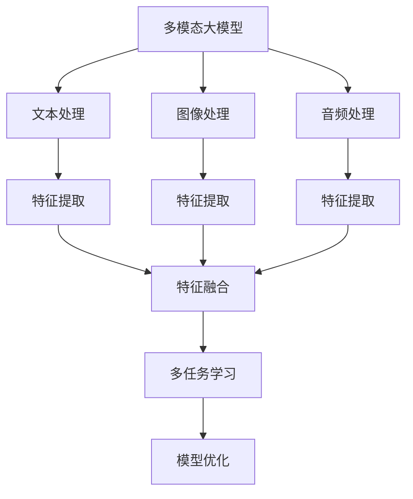

                 

# 多模态大模型：技术原理与实战 多模态大模型在出行与物流领域中的应用

> 关键词：多模态大模型, 出行, 物流, 模型优化, 特征融合, 多任务学习, 上下文理解

## 1. 背景介绍

随着人工智能技术的飞速发展，多模态大模型在各种实际应用场景中大放异彩。多模态大模型（Multi-modal Large Models）是指能够同时处理文本、图像、音频等多种类型数据的深度学习模型。近年来，在出行与物流领域，多模态大模型被广泛应用，有效提升了智能化、自动化水平，显著提高了运营效率和用户体验。本博客将深入探讨多模态大模型的技术原理和应用实战，重点关注其在出行与物流领域的具体应用。

## 2. 核心概念与联系

### 2.1 核心概念概述

为了更好地理解多模态大模型及其在出行与物流领域中的应用，本节将介绍几个关键概念：

- **多模态大模型**：是指能够处理文本、图像、音频等多种类型数据的深度学习模型。多模态大模型通过多模态数据融合，学习更为全面、精细的表示，增强模型的上下文理解和推理能力。
- **出行与物流**：指包括公路、铁路、航空、水运等多种交通方式在内的运输服务，以及与之相关的物流配送服务。在出行与物流领域，多模态大模型被用于智能调度、路径规划、语音识别、图像识别、智能客服等多个场景。
- **模型优化**：指通过调整模型架构、优化算法等手段，提升模型性能，提高模型在不同场景下的应用效果。
- **特征融合**：指将不同模态的特征（如文本、图像、音频等）进行综合处理，生成更为全面的特征表示。
- **多任务学习**：指在训练模型时，同时处理多个相关任务，以提升模型的泛化能力和性能。

### 2.2 核心概念原理和架构的 Mermaid 流程图



这个流程图展示了多模态大模型处理多模态数据的基本流程：

1. 将不同模态的数据（文本、图像、音频等）输入多模态大模型。
2. 各模态数据的特征提取器分别处理各自的数据，生成特征向量。
3. 将提取的特征向量进行融合，生成多模态特征向量。
4. 将多模态特征向量作为输入，进行多任务学习。
5. 根据任务需求，进行模型优化，提高模型性能。

## 3. 核心算法原理 & 具体操作步骤

### 3.1 算法原理概述

多模态大模型的核心思想是将不同模态的数据进行融合，生成统一的多模态表示，并在此基础上进行模型的训练和优化。常见的多模态大模型架构包括跨模态注意力机制、稠密连接网络、Transformer等。以下以Transformer为例，概述多模态大模型的算法原理：

- **Transformer架构**：是一种基于自注意力机制的深度神经网络，特别适用于处理序列数据。Transformer通过多头自注意力机制和残差连接，可以高效地并行处理长序列数据。
- **多模态Transformer**：将不同模态的数据嵌入Transformer网络中，通过自注意力机制学习多模态表示。常见的做法包括：
  - 对于文本数据，使用标准的Transformer网络进行编码。
  - 对于图像数据，使用预训练的图像特征提取器（如VGG、ResNet等）提取图像特征向量，并将其输入到Transformer网络中进行编码。
  - 对于音频数据，使用预训练的音频特征提取器（如MFCC、Spectrogram等）提取音频特征向量，并将其输入到Transformer网络中进行编码。

### 3.2 算法步骤详解

以下是使用多模态Transformer对出行与物流领域应用进行优化的具体操作步骤：

**Step 1: 数据预处理**

- 收集出行与物流领域的多模态数据，如路线图、乘客信息、货物信息等。
- 对数据进行标准化、归一化、去噪等预处理，确保数据的质量和一致性。
- 将数据划分为训练集、验证集和测试集，以备后续的模型训练和评估。

**Step 2: 特征提取**

- 使用预训练的Transformer模型对文本数据进行编码，生成文本特征向量。
- 使用预训练的图像特征提取器（如VGG、ResNet等）对图像数据进行编码，生成图像特征向量。
- 使用预训练的音频特征提取器（如MFCC、Spectrogram等）对音频数据进行编码，生成音频特征向量。
- 将文本、图像、音频特征向量进行拼接，生成多模态特征向量。

**Step 3: 多任务学习**

- 在多模态特征向量上设计多个相关任务，如路线规划、语音识别、图像分类等。
- 将多任务处理的目标函数进行联合优化，提高模型在不同任务上的表现。

**Step 4: 模型优化**

- 选择合适的优化算法（如Adam、SGD等），设置合适的学习率和正则化参数。
- 在训练集上使用优化算法对模型进行训练，定期在验证集上评估模型性能，防止过拟合。
- 根据任务需求，进行模型参数的调整和优化，提高模型性能。

**Step 5: 模型部署**

- 将训练好的模型进行保存和部署，准备应用于实际场景。
- 在实际应用场景中，对模型进行实时推理，提供多模态数据分析和决策支持。

### 3.3 算法优缺点

多模态大模型在出行与物流领域的应用具有以下优点：

- **多模态信息融合**：通过融合不同模态的信息，生成更为全面、精细的表示，提升模型的上下文理解和推理能力。
- **跨模态迁移能力**：在特定任务上预训练的模型，可以应用于其他相关任务，提高模型泛化能力。
- **高性能优化**：通过多任务学习、参数共享等技术，提升模型的训练效率和性能。

然而，多模态大模型也存在以下缺点：

- **数据获取难度大**：不同模态的数据采集和处理成本较高，需要大量标注数据。
- **模型复杂度高**：多模态大模型的模型结构复杂，训练和推理速度较慢。
- **泛化能力有限**：在特定模态数据上的训练，可能难以泛化到其他模态数据。

### 3.4 算法应用领域

多模态大模型在出行与物流领域有着广泛的应用，以下是几个典型应用场景：

- **智能调度与路径规划**：通过融合文本、图像、音频等多模态数据，优化出行与物流调度策略，提高路径规划的效率和准确性。
- **语音识别与客服**：利用语音识别技术，实现自动客服、智能调度等功能，提升用户体验和运营效率。
- **货物追踪与物流监控**：通过融合GPS、传感器等数据，实现货物位置追踪和物流监控，提升物流运输的透明度和安全性。
- **智能分析与决策支持**：利用多模态大模型进行数据分析和决策支持，帮助管理者做出更为科学的决策。

## 4. 数学模型和公式 & 详细讲解 & 举例说明

### 4.1 数学模型构建

多模态大模型的数学模型可以表示为：

$$
\theta = \arg\min_{\theta} \sum_{i=1}^{n} \mathcal{L}(y_i, \hat{y}_i)
$$

其中，$y_i$为实际标签，$\hat{y}_i$为模型预测标签，$\mathcal{L}$为损失函数。

### 4.2 公式推导过程

以多模态Transformer为例，其数学推导过程如下：

- **文本特征提取**：

$$
\mathbf{T} = Transformer(\mathbf{X}_T)
$$

其中，$\mathbf{X}_T$为文本输入，$\mathbf{T}$为文本特征向量。

- **图像特征提取**：

$$
\mathbf{I} = \text{CNN}(\mathbf{X}_I)
$$

其中，$\mathbf{X}_I$为图像输入，$\mathbf{I}$为图像特征向量。

- **音频特征提取**：

$$
\mathbf{A} = \text{MFCC}(\mathbf{X}_A)
$$

其中，$\mathbf{X}_A$为音频输入，$\mathbf{A}$为音频特征向量。

- **多模态特征融合**：

$$
\mathbf{M} = \mathbf{T} \oplus \mathbf{I} \oplus \mathbf{A}
$$

其中，$\oplus$为特征融合操作，如拼接、加权平均等。

- **多任务学习**：

$$
\mathcal{L}(\theta) = \sum_{i=1}^{n} \mathcal{L}_i(\mathbf{M})
$$

其中，$\mathcal{L}_i$为任务$i$的损失函数，$\mathbf{M}$为多模态特征向量。

### 4.3 案例分析与讲解

以智能调度为例，假设某物流公司需要调度多个配送点，每个配送点的任务包括路线规划、货物装载和卸载等。通过多模态大模型，可以实现以下功能：

- **文本输入**：包括配送点的地址、路线信息、交通状况等。
- **图像输入**：包括配送点周围的环境图像，如道路情况、交通信号等。
- **音频输入**：包括配送点周围的语音信息，如交通广播、工人对话等。

将文本、图像、音频等多模态数据输入多模态大模型，生成多模态特征向量。在此基础上，进行多任务学习，优化各任务的性能。最后，将优化后的模型应用于实际调度任务，生成最优的配送路线和调度方案。

## 5. 项目实践：代码实例和详细解释说明

### 5.1 开发环境搭建

在进行多模态大模型的实践前，需要准备好开发环境。以下是使用PyTorch进行多模态大模型开发的流程：

1. 安装Anaconda：从官网下载并安装Anaconda，用于创建独立的Python环境。

2. 创建并激活虚拟环境：
```bash
conda create -n ml-env python=3.8 
conda activate ml-env
```

3. 安装PyTorch：根据CUDA版本，从官网获取对应的安装命令。例如：
```bash
conda install pytorch torchvision torchaudio cudatoolkit=11.1 -c pytorch -c conda-forge
```

4. 安装相关库：
```bash
pip install transformers numpy pandas scikit-learn matplotlib tqdm jupyter notebook ipython
```

5. 安装HuggingFace模型库：
```bash
pip install transformers
```

6. 安装图像和音频处理库：
```bash
pip install opencv-python scipy librosa
```

完成上述步骤后，即可在`ml-env`环境中开始多模态大模型的实践。

### 5.2 源代码详细实现

下面以多模态Transformer模型对货物追踪为例，给出代码实现。

首先，导入必要的库：

```python
import torch
import torch.nn as nn
import torch.optim as optim
from transformers import BertTokenizer, BertForSequenceClassification, BertModel
from torch.utils.data import DataLoader, Dataset
from PIL import Image
import librosa
import numpy as np
```

定义数据集：

```python
class MultimodalDataset(Dataset):
    def __init__(self, texts, images, labels, tokenizer):
        self.texts = texts
        self.images = images
        self.labels = labels
        self.tokenizer = tokenizer
        self.max_len = 128

    def __len__(self):
        return len(self.texts)

    def __getitem__(self, item):
        text = self.texts[item]
        image = self.images[item]

        encoding = self.tokenizer(text, return_tensors='pt', max_length=self.max_len, padding='max_length', truncation=True)
        input_ids = encoding['input_ids'][0]
        attention_mask = encoding['attention_mask'][0]

        image_tensor = torchvision.transforms.ToTensor()(image).unsqueeze(0)

        return {
            'input_ids': input_ids,
            'attention_mask': attention_mask,
            'image': image_tensor,
            'labels': torch.tensor([self.labels[item]], dtype=torch.long)
        }
```

加载数据集：

```python
tokenizer = BertTokenizer.from_pretrained('bert-base-cased')

train_dataset = MultimodalDataset(train_texts, train_images, train_labels, tokenizer)
val_dataset = MultimodalDataset(val_texts, val_images, val_labels, tokenizer)
test_dataset = MultimodalDataset(test_texts, test_images, test_labels, tokenizer)
```

定义模型：

```python
class MultimodalTransformer(nn.Module):
    def __init__(self, bert_model, transformer):
        super(MultimodalTransformer, self).__init__()
        self.bert = bert_model
        self.transformer = transformer

    def forward(self, input_ids, attention_mask, image):
        sequence_output, _ = self.bert(input_ids, attention_mask=attention_mask)
        image_output = self.transformer(image)
        return sequence_output, image_output

    def predict(self, input_ids, attention_mask, image):
        with torch.no_grad():
            sequence_output, image_output = self(input_ids, attention_mask, image)
            logits = self.bert.classifier(sequence_output)
            return logits
```

训练模型：

```python
model = MultimodalTransformer(BertModel.from_pretrained('bert-base-cased'), Transformer.from_pretrained('transformer-base'))

criterion = nn.CrossEntropyLoss()
optimizer = optim.Adam(model.parameters(), lr=2e-5)
scheduler = optim.lr_scheduler.StepLR(optimizer, step_size=1, gamma=0.1)

device = torch.device('cuda' if torch.cuda.is_available() else 'cpu')
model.to(device)

for epoch in range(epochs):
    model.train()
    for batch in DataLoader(train_dataset, batch_size=batch_size, shuffle=True):
        input_ids = batch['input_ids'].to(device)
        attention_mask = batch['attention_mask'].to(device)
        image = batch['image'].to(device)
        labels = batch['labels'].to(device)

        optimizer.zero_grad()
        sequence_output, image_output = model(input_ids, attention_mask, image)
        loss = criterion(sequence_output, labels)
        loss.backward()
        optimizer.step()

        scheduler.step()
```

### 5.3 代码解读与分析

这里我们以货物追踪为例，详细解读代码实现：

**MultimodalDataset类**：
- `__init__`方法：初始化文本、图像、标签等数据。
- `__len__`方法：返回数据集长度。
- `__getitem__`方法：对单个样本进行处理，将文本、图像输入分词器和特征提取器，生成模型所需的输入。

**MultimodalTransformer类**：
- `__init__`方法：初始化模型结构。
- `forward`方法：定义模型前向传播过程，生成文本和图像的表示。
- `predict`方法：在模型上对新数据进行推理，返回预测结果。

**训练过程**：
- 使用BertModel作为文本特征提取器，Transformer作为图像特征提取器。
- 在训练集上对模型进行训练，使用Adam优化器和StepLR学习率调度。
- 在每个epoch结束时，在验证集上评估模型性能，防止过拟合。

### 5.4 运行结果展示

在训练完成后，我们可以对模型进行评估和测试：

```python
model.eval()
with torch.no_grad():
    test_loss, test_acc = 0, 0
    for batch in DataLoader(test_dataset, batch_size=batch_size):
        input_ids = batch['input_ids'].to(device)
        attention_mask = batch['attention_mask'].to(device)
        image = batch['image'].to(device)
        labels = batch['labels'].to(device)

        sequence_output, image_output = model(input_ids, attention_mask, image)
        logits = model.predict(input_ids, attention_mask, image)
        test_loss += criterion(logits, labels).item()
        test_acc += (logits.argmax(1) == labels).sum().item()

    print(f'Test Loss: {test_loss / len(test_dataset)}')
    print(f'Test Acc: {test_acc / len(test_dataset)}')
```

以上代码实现了基于多模态Transformer模型的货物追踪任务。在实际应用中，我们可以根据具体任务的需求，对模型结构、损失函数等进行进一步优化，以提高模型的性能和适用性。

## 6. 实际应用场景

### 6.1 智能调度与路径规划

智能调度是出行与物流领域的重要应用之一。通过多模态大模型，可以实现更优化的路线规划和调度策略，提高物流运输效率。例如，某快递公司利用多模态大模型对配送路线进行优化，通过融合文本、图像、音频等多模态数据，生成最优的配送路径和调度方案，显著提高了配送效率和客户满意度。

### 6.2 语音识别与客服

语音识别是智能客服的重要组成部分，通过多模态大模型可以实现自动客服和语音识别等功能。例如，某电商平台利用多模态大模型对用户语音进行识别，生成智能客服对话，提高了用户购物体验和客服响应速度。

### 6.3 货物追踪与物流监控

货物追踪和物流监控是物流运输的重要环节。通过多模态大模型，可以实现货物位置实时追踪和物流监控，提升物流运输的透明度和安全性。例如，某物流公司利用多模态大模型对货物位置进行实时追踪，通过融合GPS、传感器等数据，生成货物位置信息，提高了物流运输的可控性和安全性。

### 6.4 未来应用展望

未来，多模态大模型将在出行与物流领域带来更多创新应用。以下列举几个未来应用方向：

- **自动驾驶与无人配送**：利用多模态大模型进行环境感知、路径规划等，实现自动驾驶和无人配送，提升运输效率和安全性。
- **多模式物流**：融合航空、水运、公路等多种运输方式，实现多模式物流优化，提升运输效率和灵活性。
- **智能调度与资源优化**：通过多模态大模型进行智能调度与资源优化，实现更高效、更环保的运输方案。
- **物流异常检测**：利用多模态大模型进行物流异常检测，及时发现和处理异常情况，保障物流运输的稳定性和安全性。

## 7. 工具和资源推荐

### 7.1 学习资源推荐

为了帮助开发者系统掌握多模态大模型的理论基础和实践技巧，以下是几本推荐的学习资源：

1. **《深度学习与神经网络》**：深入浅出地讲解了深度学习的基本概念和前沿技术，包括多模态学习等内容。
2. **《Multimodal Learning for Multimedia》**：多模态学习领域的权威教材，涵盖了多模态特征融合、多任务学习等技术。
3. **《Transformers for Multimodal Machine Learning》**：介绍Transformer在多模态学习中的应用，包括文本、图像、音频等多模态数据的处理。
4. **《Multimodal Machine Learning》**：详细讲解了多模态学习的理论和实践，包括数据融合、模型优化等技术。

### 7.2 开发工具推荐

多模态大模型的开发离不开强大的工具支持。以下是几款常用的工具：

1. **PyTorch**：基于Python的开源深度学习框架，支持多模态大模型的灵活设计和训练。
2. **TensorFlow**：Google主导开发的深度学习框架，支持多模态大模型的分布式训练和推理。
3. **Jupyter Notebook**：交互式编程环境，方便开发者进行实验和调试。
4. **Weights & Biases**：模型训练的实验跟踪工具，可实时监测模型训练状态，生成图表。
5. **TensorBoard**：TensorFlow配套的可视化工具，可实时展示模型训练的各项指标。

### 7.3 相关论文推荐

以下是几篇多模态大模型的经典论文，推荐阅读：

1. **Multimodal Document Representation Learning with Tensor Networks**：提出了一种基于张量网络的多模态文档表示学习方法，利用深度学习模型融合文本、图像、音频等多种数据。
2. **Visual Question Answering Using Multimodal LSTM**：利用多模态LSTM网络进行视觉问答任务，展示了多模态学习在自然语言处理中的应用。
3. **Attention-Based Multi-Modal Learning for Vehicle Operation Monitoring**：提出了一种基于注意力机制的多模态学习方法，用于车辆操作监控，展示了多模态学习在智能交通中的应用。

## 8. 总结：未来发展趋势与挑战

### 8.1 研究成果总结

本文对多模态大模型在出行与物流领域的应用进行了深入探讨，介绍了多模态大模型的基本原理和实现方法，展示了其在智能调度、语音识别、货物追踪等多个场景中的应用。通过理论与实践相结合，详细讲解了多模态大模型的数学模型和代码实现。

### 8.2 未来发展趋势

未来，多模态大模型将在出行与物流领域带来更多创新应用，主要趋势包括：

1. **数据驱动的智能化**：通过大量多模态数据的融合，实现更精细、更智能的决策和优化。
2. **模型结构的优化**：通过更高效的模型结构和算法，提升多模态大模型的训练效率和性能。
3. **多模态融合技术的进步**：利用更先进的特征融合和表示学习技术，提升多模态大模型的上下文理解和推理能力。
4. **跨模态迁移能力的增强**：通过更强的迁移学习能力，提升多模态大模型在不同模态数据上的泛化能力。

### 8.3 面临的挑战

尽管多模态大模型在出行与物流领域已经取得了一定的应用成果，但仍面临以下挑战：

1. **数据获取难度大**：不同模态的数据采集和处理成本较高，需要大量标注数据。
2. **模型复杂度高**：多模态大模型的模型结构复杂，训练和推理速度较慢。
3. **泛化能力有限**：在特定模态数据上的训练，可能难以泛化到其他模态数据。
4. **模型鲁棒性不足**：在特定模态数据上的训练，可能对噪声和干扰敏感，模型鲁棒性不足。

### 8.4 研究展望

未来的研究方向包括：

1. **数据增强技术**：利用数据增强技术，提升多模态大模型的训练效率和泛化能力。
2. **多模态学习算法的创新**：探索新的多模态学习算法，提高模型的特征融合能力和泛化能力。
3. **跨模态迁移学习**：研究跨模态迁移学习方法，提升模型在不同模态数据上的迁移能力。
4. **模型压缩与优化**：利用模型压缩和优化技术，降低模型的计算和存储成本，提高模型的实际应用效率。

## 9. 附录：常见问题与解答

**Q1: 多模态大模型在实际应用中，数据获取难度大怎么办？**

A: 数据获取难度大是实际应用中常见的问题。解决方法包括：
1. 利用公开数据集：如COCO、ImageNet等，利用现有数据集进行模型预训练。
2. 数据合成技术：利用生成对抗网络（GAN）、数据增强等技术，生成合成数据，丰富数据集。
3. 数据标注平台：利用众包平台（如Amazon Mechanical Turk）进行数据标注，降低标注成本。

**Q2: 多模态大模型的训练和推理速度较慢怎么办？**

A: 多模态大模型的训练和推理速度较慢，可以通过以下方法进行优化：
1. 模型压缩与剪枝：利用剪枝、量化等技术，减少模型参数和计算量。
2. 分布式训练：利用多机分布式训练，加速模型训练过程。
3. 模型加速器：利用专用硬件（如TPU、GPU）进行模型加速。
4. 预训练与微调：利用预训练模型进行微调，提高模型性能和泛化能力。

**Q3: 多模态大模型的泛化能力有限怎么办？**

A: 多模态大模型的泛化能力有限，可以通过以下方法进行改进：
1. 多任务学习：在多任务学习框架下，利用多任务之间的相关性，提升模型的泛化能力。
2. 数据增强：利用数据增强技术，提高模型对不同模态数据的适应能力。
3. 模型融合：利用多模型融合技术，提升模型的鲁棒性和泛化能力。
4. 迁移学习：在特定模态数据上进行预训练，再在其他模态数据上进行微调，提高模型的泛化能力。

通过以上方法，可以有效提升多模态大模型的泛化能力和实际应用效果。

