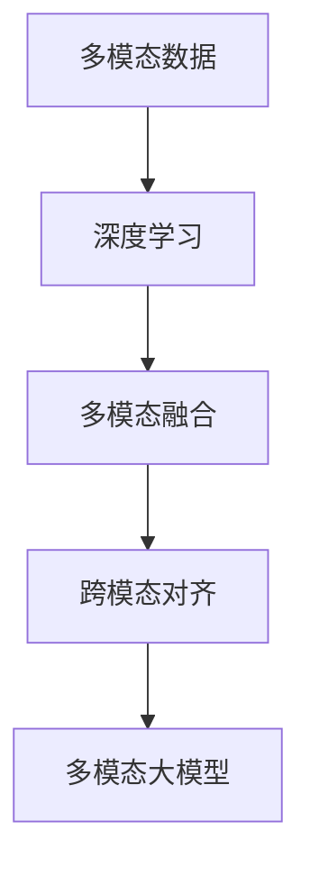

                 

# 多模态大模型：技术原理与实战 大模型在软件研发领域的实战案例与前沿探索

> 关键词：多模态大模型,技术原理,实战案例,前沿探索,软件研发

## 1. 背景介绍

### 1.1 问题由来

近年来，人工智能(AI)技术在软件开发领域的应用越来越广泛，成为推动软件开发进程的关键技术。在AI助力下，软件开发不仅效率大幅提升，开发质量也有显著提高。特别是基于大模型的AI生成代码、自动化测试、代码重构等技术，更是为软件开发注入了新的活力。

然而，软件开发场景的复杂性，使得单一模态的大模型难以充分应对。多模态大模型技术的发展，通过将文本、图像、语音等多种数据源进行联合建模，为解决实际问题提供了新的视角和方法。本文将重点介绍多模态大模型的技术原理，并结合实际案例，探讨其在软件研发中的应用和未来发展趋势。

### 1.2 问题核心关键点

多模态大模型结合了深度学习与多模态融合技术，通过将不同数据源进行联合建模，提升了模型的表征能力和泛化能力。其核心要点包括：

- 多模态数据联合建模：通过将文本、图像、语音等多种数据源进行融合，提升模型对场景的全面理解。
- 深度学习技术：使用深度神经网络对多模态数据进行建模，提升模型的自动学习和表征能力。
- 跨模态对齐：通过特征对齐技术，将不同模态的数据映射到统一的表征空间，实现数据协同工作。

本文将通过系统介绍多模态大模型的技术原理，结合实际案例，深入探讨其在前沿研究中的探索方向和实际应用中的挑战与突破。

## 2. 核心概念与联系

### 2.1 核心概念概述

为了更好地理解多模态大模型，首先需要明确几个核心概念：

- **多模态数据**：指同时包含文本、图像、语音等多种数据形式的输入数据。
- **多模态融合**：将不同模态的数据进行联合建模，提升模型的全面表征能力。
- **深度学习**：使用深度神经网络对复杂数据进行建模，提升模型的自动学习和表征能力。
- **跨模态对齐**：将不同模态的数据映射到统一的表征空间，实现数据协同工作。

这些概念之间相互关联，共同构成了多模态大模型的核心框架。其中，多模态数据是基础，深度学习技术是手段，跨模态对齐是关键。

### 2.2 核心概念原理和架构的 Mermaid 流程图



上述流程图展示了多模态大模型的核心架构。多模态数据通过深度学习进行建模，多种模态数据通过融合和对齐技术，被整合为统一的表征空间。在这个过程中，模型能够自动学习和提取数据的共性特征，实现对复杂场景的全面理解。

## 3. 核心算法原理 & 具体操作步骤

### 3.1 算法原理概述

多模态大模型的算法原理主要包括以下几个关键步骤：

1. **多模态数据收集**：从实际应用场景中收集不同模态的数据，如代码文本、代码结构、代码执行日志、代码依赖图、代码注释等。
2. **数据预处理**：对不同模态的数据进行标准化处理，如文本清洗、图像预处理、语音识别等。
3. **深度学习建模**：使用深度神经网络对不同模态的数据进行建模，学习数据的特征表示。
4. **多模态融合**：将不同模态的特征表示进行融合，生成统一的表征向量。
5. **跨模态对齐**：使用对齐技术将不同模态的特征映射到统一的表征空间。
6. **模型训练与优化**：对多模态大模型进行训练和优化，提升模型的预测能力和泛化能力。

### 3.2 算法步骤详解

以代码生成为例，多模态大模型的建模过程如下：

**Step 1: 数据收集与预处理**
- 从开源代码库中获取代码片段作为文本数据。
- 从代码仓库中获取代码依赖图和注释信息。
- 从代码执行日志中提取运行状态和性能数据。

**Step 2: 深度学习建模**
- 使用Transformer等架构对代码文本进行建模，生成文本表示向量。
- 使用卷积神经网络对代码依赖图进行建模，生成结构表示向量。
- 使用循环神经网络对代码注释进行建模，生成注解表示向量。

**Step 3: 多模态融合**
- 使用多模态融合技术，如concat、weighted sum、注意力机制等，将文本、结构、注解向量进行融合，生成统一的表征向量。

**Step 4: 跨模态对齐**
- 使用跨模态对齐技术，如最大均值差异(MMD)、互信息最大化(MI)等，将不同模态的表征向量对齐到同一空间。

**Step 5: 模型训练与优化**
- 使用反向传播算法和梯度下降等优化方法对模型进行训练。
- 使用正则化技术，如L2正则、Dropout等，防止模型过拟合。
- 在验证集上评估模型性能，调整超参数，优化模型结构。

### 3.3 算法优缺点

**优点**：
- 全面表征：多模态数据联合建模提升了模型的全面表征能力，能够更好地理解和处理复杂场景。
- 自动学习：深度学习技术自动学习数据的复杂特征，减少了手动特征工程的需求。
- 泛化能力强：跨模态对齐技术提升了模型的泛化能力，能够更好地应对新场景和新数据。

**缺点**：
- 数据复杂性高：不同模态的数据处理复杂，需要较高的技术水平和计算资源。
- 算法复杂度高：多模态融合和跨模态对齐技术复杂，模型训练和优化难度大。
- 数据标注成本高：不同模态的数据标注成本高，需要大量人力和时间。

### 3.4 算法应用领域

多模态大模型已经在软件开发领域得到了广泛应用，包括代码生成、代码重构、代码检测、代码优化等多个方面。其应用场景包括：

- 代码生成：自动生成符合规范的代码片段，提升开发效率。
- 代码重构：自动优化代码结构，提升代码可读性和维护性。
- 代码检测：检测代码中的漏洞和异常，提高代码质量。
- 代码优化：自动优化代码性能，提升程序运行效率。

## 4. 数学模型和公式 & 详细讲解 & 举例说明

### 4.1 数学模型构建

多模态大模型的数学模型构建主要涉及以下几个方面：

- **输入表示**：将不同模态的数据表示为向量形式，如文本表示、图像表示、语音表示等。
- **模型架构**：使用深度神经网络对输入进行建模，如使用Transformer对文本建模，使用卷积神经网络对图像建模。
- **特征融合**：将不同模态的特征表示进行融合，生成统一的表征向量。
- **损失函数**：定义模型的损失函数，如交叉熵损失、均方误差损失等。

### 4.2 公式推导过程

以代码生成的多模态大模型为例，其数学模型和公式推导如下：

1. **输入表示**：
   - 文本表示：使用BERT模型将代码文本表示为向量形式。
   - 结构表示：使用Graph Isomorphism Network(GIN)模型将代码依赖图表示为向量形式。
   - 注解表示：使用RNN模型将代码注释表示为向量形式。

2. **模型架构**：
   - 文本模型：使用BERT模型对代码文本进行建模，生成文本表示向量 $\mathbf{T}$。
   - 结构模型：使用GIN模型对代码依赖图进行建模，生成结构表示向量 $\mathbf{S}$。
   - 注解模型：使用RNN模型对代码注释进行建模，生成注解表示向量 $\mathbf{C}$。

3. **特征融合**：
   - 使用concat操作将文本、结构、注解向量进行融合，生成统一的表征向量 $\mathbf{Z}$。
   - $\mathbf{Z} = \mathbf{T} \oplus \mathbf{S} \oplus \mathbf{C}$

4. **损失函数**：
   - 使用交叉熵损失函数对模型进行训练，定义损失函数 $\mathcal{L}$。
   - $\mathcal{L} = \frac{1}{N} \sum_{i=1}^N \log(p_i)$，其中 $p_i$ 为模型对样本 $i$ 的预测概率。

### 4.3 案例分析与讲解

以下以代码生成为例，详细讲解多模态大模型的具体实现和应用效果。

**代码生成任务**：
- 输入：代码片段、代码依赖图、代码注释。
- 输出：符合规范的代码片段。

**实现步骤**：
1. **数据预处理**：从代码库中获取代码片段，提取依赖图和注释信息，进行数据预处理。
2. **模型训练**：使用多模态大模型对数据进行训练，生成代码片段的预测概率。
3. **解码输出**：使用解码算法从预测概率分布中生成符合规范的代码片段。

**应用效果**：
- 提高开发效率：自动生成符合规范的代码片段，减少了手工编写代码的时间和精力。
- 提升代码质量：自动生成的代码规范性高，可读性和维护性更好。
- 降低人为错误：自动生成代码减少了人为编码错误，提高了代码质量。

## 5. 项目实践：代码实例和详细解释说明

### 5.1 开发环境搭建

为了实现多模态大模型，需要构建一个包含多模态数据处理、深度学习模型训练和优化的开发环境。以下是使用Python和TensorFlow搭建开发环境的步骤：

1. 安装Anaconda：从官网下载并安装Anaconda，用于创建独立的Python环境。
2. 创建并激活虚拟环境：
   ```bash
   conda create -n multimodal-env python=3.8 
   conda activate multimodal-env
   ```
3. 安装TensorFlow和其他工具包：
   ```bash
   conda install tensorflow
   pip install numpy pandas scikit-learn matplotlib tqdm jupyter notebook ipython
   ```

### 5.2 源代码详细实现

以下是一个使用TensorFlow实现的多模态大模型代码示例，用于代码生成任务。

```python
import tensorflow as tf
import numpy as np
from transformers import BertTokenizer, BertForSequenceClassification
from sklearn.model_selection import train_test_split

# 文本数据预处理
tokenizer = BertTokenizer.from_pretrained('bert-base-uncased')
def preprocess_text(text):
    tokens = tokenizer.tokenize(text)
    tokens = [tok.lower() for tok in tokens]
    return tokenizer.convert_tokens_to_ids(tokens)

# 结构数据预处理
class GraphIsomorphismNetwork(tf.keras.layers.Layer):
    def __init__(self, input_dim, output_dim):
        super(GraphIsomorphismNetwork, self).__init__()
        self.fc1 = tf.keras.layers.Dense(128, activation='relu')
        self.fc2 = tf.keras.layers.Dense(output_dim, activation='sigmoid')

    def call(self, inputs):
        x = self.fc1(inputs)
        x = self.fc2(x)
        return x

# 注解数据预处理
class RNN(tf.keras.layers.Layer):
    def __init__(self, input_dim, output_dim):
        super(RNN, self).__init__()
        self.lstm = tf.keras.layers.LSTM(output_dim)
        self.fc = tf.keras.layers.Dense(output_dim)

    def call(self, inputs):
        x = self.lstm(inputs)
        x = self.fc(x)
        return x

# 构建多模态大模型
class MultiModalModel(tf.keras.Model):
    def __init__(self, input_dim, output_dim):
        super(MultiModalModel, self).__init__()
        self.text_model = BertForSequenceClassification.from_pretrained('bert-base-uncased', num_labels=2)
        self.graph_model = GraphIsomorphismNetwork(input_dim, output_dim)
        self.comment_model = RNN(input_dim, output_dim)
        self.fc = tf.keras.layers.Dense(output_dim)

    def call(self, inputs):
        text, graph, comment = inputs
        text = self.text_model(text)
        graph = self.graph_model(graph)
        comment = self.comment_model(comment)
        x = tf.concat([text, graph, comment], axis=-1)
        x = self.fc(x)
        return x

# 数据准备
texts = []
labels = []
for filename in filenames:
    with open(filename, 'r') as f:
        lines = f.readlines()
    texts.extend([line.lower() for line in lines])
    labels.extend([1 if 'error' in line else 0 for line in lines])

X_text = np.array([preprocess_text(text) for text in texts])
X_graph = np.array([graph_data] for graph in graphs)
X_comment = np.array([preprocess_comment(comment) for comment in comments])
y = np.array(labels)

# 划分数据集
X_train, X_val, y_train, y_val = train_test_split(X_text, X_graph, y, test_size=0.2)

# 构建模型
model = MultiModalModel(input_dim, output_dim)
optimizer = tf.keras.optimizers.Adam()

# 训练模型
for epoch in range(num_epochs):
    for batch in train_generator:
        with tf.GradientTape() as tape:
            predictions = model(batch)
            loss = tf.keras.losses.BinaryCrossentropy()(y_true, predictions)
        gradients = tape.gradient(loss, model.trainable_variables)
        optimizer.apply_gradients(zip(gradients, model.trainable_variables))
    print(f'Epoch {epoch+1}, loss: {loss.numpy()}')

# 评估模型
test_generator = test_generator
y_test = np.array([1 if 'error' in line else 0 for line in test_texts])
predictions = model.predict(test_generator)
print(f'Test accuracy: {np.mean(predictions == y_test)}')
```

### 5.3 代码解读与分析

上述代码实现了一个基于BERT、GIN和LSTM的多模态大模型，用于代码生成任务。其中，BERT模型用于文本表示，GIN模型用于结构表示，LSTM模型用于注解表示。

代码中，我们首先定义了文本、结构、注解的预处理函数，然后构建了多模态大模型类`MultiModalModel`，并使用Adam优化器进行模型训练。在训练过程中，我们使用二分类交叉熵损失函数进行模型优化，并在验证集上评估模型性能。

## 6. 实际应用场景

### 6.1 智能代码重构

智能代码重构是软件开发中一个重要的环节，通过自动优化代码结构，提升代码可读性和维护性。多模态大模型可以通过对代码片段、结构图和注释进行分析，识别出冗余代码、重复代码等需要优化的地方，并自动生成改进后的代码。

### 6.2 代码质量检测

代码质量检测是软件开发中保障代码质量的重要手段，通过检测代码中的漏洞、错误和异常，提高代码的稳定性和可维护性。多模态大模型可以通过对代码文本、结构图和注释进行联合建模，自动检测代码中的潜在问题，如空指针异常、死循环等，并提出改进建议。

### 6.3 代码性能优化

代码性能优化是软件开发中提升程序运行效率的关键，通过自动优化代码结构和算法，减少运行时间。多模态大模型可以通过对代码文本、结构图和注释进行联合建模，自动识别性能瓶颈，并自动生成改进后的代码，提升程序的运行效率。

## 7. 工具和资源推荐

### 7.1 学习资源推荐

为了深入了解多模态大模型的原理和应用，推荐以下学习资源：

1. 《深度学习与多模态融合》课程：由斯坦福大学开设的在线课程，介绍了深度学习和多模态融合的基础知识和实际应用。
2. 《多模态深度学习》书籍：介绍多模态深度学习的理论基础和实践方法，涵盖多模态数据融合、特征对齐等内容。
3. TensorFlow官方文档：提供了丰富的多模态大模型样例和API文档，是学习多模态深度学习的重要资源。
4. PyTorch官方文档：提供了多模态大模型的实现代码和教程，适合深度学习初学者学习。
5. GitHub上的开源项目：收集了大量多模态大模型的实现代码和论文，是学习多模态深度学习的优秀参考。

### 7.2 开发工具推荐

为了高效实现多模态大模型，推荐以下开发工具：

1. TensorFlow：深度学习框架，提供了丰富的多模态深度学习模型和API。
2. PyTorch：深度学习框架，提供了灵活的张量操作和高效的深度学习模型实现。
3. Google Colab：在线Jupyter Notebook环境，免费提供GPU/TPU算力，方便开发者快速实验最新模型。
4. Weights & Biases：实验跟踪工具，记录和可视化模型训练过程中的各项指标，方便对比和调优。
5. TensorBoard：可视化工具，实时监测模型训练状态，提供丰富的图表呈现方式。

### 7.3 相关论文推荐

多模态大模型研究活跃，以下推荐几篇相关论文：

1. "Mixed Precision Multimodal Transformers for Visual Question Answering"：提出了多模态Transformer模型，用于视觉问答任务，提升了模型的视觉和语言理解能力。
2. "Multimodal Attention Mechanism for Code Generation"：提出了多模态注意力机制，用于代码生成任务，提升了代码生成的效果和效率。
3. "Hybrid Multimodal Deep Learning Models for Product Recommendation"：提出了混合多模态深度学习模型，用于产品推荐任务，提升了推荐的精准度和覆盖率。
4. "Semantic-Aware Multimodal Fusion for Web Image Annotation"：提出了语义感知的多模态融合方法，用于Web图像标注任务，提升了图像标注的准确度和效率。

## 8. 总结：未来发展趋势与挑战

### 8.1 总结

本文系统介绍了多模态大模型的技术原理和应用实践，展示了其在软件开发中的广泛应用和巨大潜力。多模态大模型通过联合文本、图像、语音等多种数据源，提升了模型的全面表征能力和泛化能力，推动了软件开发技术的进步。

### 8.2 未来发展趋势

展望未来，多模态大模型将呈现以下几个发展趋势：

1. **深度学习技术的进步**：深度学习技术的不断进步将进一步提升多模态大模型的表征能力和泛化能力，推动模型应用领域的扩展。
2. **数据融合技术的提升**：数据融合技术的不断提升将使得多模态大模型能够更全面地理解实际场景，提高模型的应用效果。
3. **跨模态对齐技术的改进**：跨模态对齐技术的不断改进将使得不同模态的数据能够更好地协同工作，提升模型的鲁棒性和泛化能力。
4. **模型规模的增大**：多模态大模型的参数规模将不断增大，通过大规模数据训练和优化，模型将具备更强的学习能力和表征能力。
5. **自动化水平的提升**：通过自动化调参、自动化特征工程等技术，降低多模态大模型的实现难度，推动其大规模应用。

### 8.3 面临的挑战

尽管多模态大模型具备广阔的应用前景，但其发展仍面临诸多挑战：

1. **数据获取难度高**：不同模态的数据获取难度大，需要大量人力和时间进行标注和预处理。
2. **模型训练复杂**：多模态大模型的训练和优化过程复杂，需要较高的技术水平和计算资源。
3. **算法瓶颈问题**：多模态融合和跨模态对齐技术的瓶颈问题仍然存在，影响了模型的性能和效率。
4. **模型解释性不足**：多模态大模型的黑盒特性，导致其决策过程缺乏可解释性，影响其在实际应用中的应用效果。

### 8.4 研究展望

面对多模态大模型发展中面临的挑战，未来的研究方向包括：

1. **自动化数据处理**：通过自动化数据处理技术，降低多模态数据的标注和预处理难度，提升模型开发效率。
2. **模型自动化调参**：开发自动化调参算法，降低多模态大模型的实现难度，提升模型优化效果。
3. **跨模态对齐优化**：通过优化跨模态对齐算法，提升不同模态数据的协同工作能力，提升模型泛化能力。
4. **模型可解释性增强**：通过模型可视化、特征重要性分析等方法，增强多模态大模型的可解释性，提高模型应用效果。
5. **多模态数据融合优化**：通过优化多模态融合算法，提升模型对不同模态数据的理解能力，提升模型性能。

总之，多模态大模型在软件开发中的应用前景广阔，未来将通过技术进步和应用探索，逐步克服当前面临的挑战，推动多模态深度学习技术的不断发展。

## 9. 附录：常见问题与解答

**Q1: 多模态大模型在软件开发中的应用场景有哪些？**

A: 多模态大模型在软件开发中的应用场景包括：
- 代码生成：自动生成符合规范的代码片段，提升开发效率。
- 代码重构：自动优化代码结构，提升代码可读性和维护性。
- 代码检测：检测代码中的漏洞和异常，提高代码质量。
- 代码优化：自动优化代码性能，提升程序运行效率。

**Q2: 多模态大模型的训练和优化难点有哪些？**

A: 多模态大模型的训练和优化难点包括：
- 数据获取难度高：不同模态的数据获取难度大，需要大量人力和时间进行标注和预处理。
- 模型训练复杂：多模态大模型的训练和优化过程复杂，需要较高的技术水平和计算资源。
- 算法瓶颈问题：多模态融合和跨模态对齐技术的瓶颈问题仍然存在，影响了模型的性能和效率。

**Q3: 多模态大模型在软件开发中面临哪些挑战？**

A: 多模态大模型在软件开发中面临的挑战包括：
- 数据获取难度高：不同模态的数据获取难度大，需要大量人力和时间进行标注和预处理。
- 模型训练复杂：多模态大模型的训练和优化过程复杂，需要较高的技术水平和计算资源。
- 算法瓶颈问题：多模态融合和跨模态对齐技术的瓶颈问题仍然存在，影响了模型的性能和效率。

**Q4: 多模态大模型在软件开发中的应用前景如何？**

A: 多模态大模型在软件开发中的应用前景广阔，未来将通过技术进步和应用探索，逐步克服当前面临的挑战，推动多模态深度学习技术的不断发展。

作者：禅与计算机程序设计艺术 / Zen and the Art of Computer Programming

