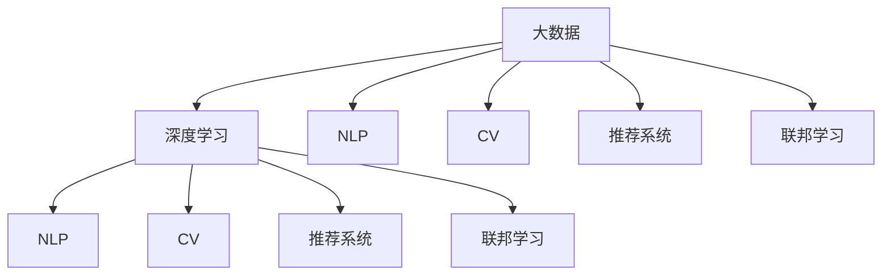

                 

# 大数据在AI发展中的重要性

## 1. 背景介绍

### 1.1 问题由来

随着信息技术的飞速发展，大数据逐渐成为人工智能(AI)应用的核心要素。无论是深度学习、自然语言处理(NLP)、计算机视觉(CV)还是推荐系统，都离不开大量数据作为基础。大数据不仅提供了丰富的训练材料，还促进了模型的规模化和复杂化，显著提升了AI技术的性能和应用价值。

大数据在AI中的重要性体现在以下几个方面：
1. **数据规模的扩大**：大规模的数据集是深度学习模型的基础，只有具备海量数据，才能训练出具有强大表征能力的神经网络。
2. **数据多样性**：不同来源、格式、类型的数据能够提供更加全面的知识视角，促进模型的泛化能力。
3. **数据实时性**：动态更新的大数据集使得AI模型能够适应现实世界的变化，提高模型的时效性和实用性。

大数据在AI中的应用日益广泛，从智能推荐到自动驾驶，从智能客服到智慧医疗，大数据成为推动AI技术发展的重要引擎。本文将系统探讨大数据在AI发展中的核心作用，并分析其对AI未来趋势的影响。

## 2. 核心概念与联系

### 2.1 核心概念概述

为更好地理解大数据在AI中的应用，本节将介绍几个密切相关的核心概念：

- **大数据**：指规模巨大、速度极快、类型多样的数据集。通常以PB计，涵盖了结构化、半结构化、非结构化等多种数据类型。
- **深度学习**：一种基于多层神经网络的机器学习方法，通过大量数据训练，能够自动提取数据中的复杂特征和模式。
- **自然语言处理(NLP)**：使计算机具备理解、处理和生成人类语言的能力，是AI应用的重要分支。
- **计算机视觉(CV)**：使计算机具备图像处理和分析能力，能够识别、分类和理解图像内容。
- **推荐系统**：通过分析用户行为数据，为用户推荐个性化的产品、服务或内容，广泛应用于电商、社交媒体等领域。
- **联邦学习**：一种分布式机器学习方法，允许多个独立设备在不共享数据的情况下，联合训练出一个全局模型。

这些概念之间的逻辑关系可以通过以下Mermaid流程图来展示：



这个流程图展示了大数据与多个AI子领域之间的联系：

1. 大数据是深度学习、NLP、CV等AI分支的共同基础。
2. 深度学习等方法能够对大数据进行有效的分析和学习，提取有价值的知识。
3. 通过联邦学习等技术，大数据可以在多方协同下进行分布式训练，提高数据利用率。

## 3. 核心算法原理 & 具体操作步骤

### 3.1 算法原理概述

大数据在AI中的应用主要体现在两个方面：数据驱动的模型训练和分布式计算的协同优化。以下分别详细介绍这两个关键点。

#### 3.1.1 数据驱动的模型训练

在大数据时代，AI模型训练的基础已经从传统的手工特征工程转变为数据驱动的端到端训练。以深度学习为例，模型训练的过程可以分为以下几个步骤：

1. **数据准备**：收集和预处理大规模的数据集，包括数据清洗、特征提取、归一化等操作。
2. **模型选择**：根据任务需求，选择合适的深度学习模型架构，如卷积神经网络(CNN)、循环神经网络(RNN)、变分自编码器(VAE)等。
3. **模型训练**：将准备好的数据输入模型，通过反向传播算法优化模型的参数，使得模型能够最小化预测误差。
4. **模型评估**：在测试集上评估模型性能，根据指标（如准确率、召回率、F1-score等）调整模型参数。
5. **模型部署**：将训练好的模型部署到实际应用中，进行实时预测和推理。

#### 3.1.2 分布式计算的协同优化

随着数据量的增加，单机训练逐渐成为瓶颈。为了提升训练效率，分布式计算技术应运而生。典型的分布式训练框架包括：

1. **Spark**：一个快速的通用大数据处理框架，支持多种语言和API，能够在大数据集群上高效运行。
2. **TensorFlow**：谷歌开源的深度学习框架，支持分布式训练和模型优化，支持多种硬件平台。
3. **PyTorch**：Facebook开源的深度学习框架，支持动态计算图，易于分布式优化。
4. **Horovod**：一个分布式深度学习训练框架，支持多种深度学习库，能够高效地进行分布式优化。

通过分布式计算，大数据在AI中的作用得到进一步提升，训练速度和模型性能也得到了显著改善。

### 3.2 算法步骤详解

#### 3.2.1 数据预处理

数据预处理是模型训练的基础，主要包括以下几个步骤：

1. **数据收集**：从各种数据源（如社交媒体、电子商务、医疗记录等）收集数据。
2. **数据清洗**：去除重复、错误、缺失的数据，保证数据质量。
3. **数据归一化**：对数据进行标准化处理，使其符合模型训练要求。
4. **特征提取**：将原始数据转化为模型可以接受的特征表示，如文本向量化、图像像素提取等。
5. **数据分割**：将数据集分为训练集、验证集和测试集，以便评估模型性能。

#### 3.2.2 模型训练

模型训练是AI应用的核心环节，主要包括以下步骤：

1. **选择模型架构**：根据任务需求，选择合适的深度学习模型架构。
2. **设置超参数**：包括学习率、批大小、迭代次数等，需要经过多次实验调整。
3. **模型训练**：通过反向传播算法优化模型参数，使得模型能够最小化预测误差。
4. **模型评估**：在验证集上评估模型性能，根据评估指标（如准确率、召回率、F1-score等）调整模型参数。
5. **模型部署**：将训练好的模型部署到实际应用中，进行实时预测和推理。

#### 3.2.3 分布式计算

分布式计算技术能够在大规模数据集上高效训练模型。其主要步骤如下：

1. **分布式框架选择**：选择合适的分布式计算框架（如Spark、TensorFlow、PyTorch等）。
2. **数据分布**：将数据集分布在多个计算节点上，保证数据分布均衡。
3. **模型并行**：通过数据并行和模型并行，提高训练效率。
4. **参数同步**：确保各个计算节点间的参数同步，避免模型不收敛。
5. **监控优化**：实时监控训练过程，优化训练参数，提高训练速度和模型性能。

### 3.3 算法优缺点

大数据在AI中的应用具有以下优点：

1. **数据规模优势**：大规模数据集能够提供更丰富的训练材料，提升模型性能。
2. **数据多样性**：不同来源、格式的数据能够提供更加全面的知识视角，促进模型的泛化能力。
3. **实时性**：动态更新的大数据集使得AI模型能够适应现实世界的变化，提高模型的时效性。

同时，大数据在AI中也有一些局限性：

1. **数据质量问题**：数据清洗和预处理环节繁琐，数据质量难以保证。
2. **数据隐私问题**：数据隐私和安全问题需要严格处理，避免数据泄露。
3. **存储成本高**：大规模数据集的存储和传输成本较高，需要合理优化。
4. **计算资源需求高**：训练大规模模型需要高性能计算资源，计算成本较高。

### 3.4 算法应用领域

大数据在AI中的应用非常广泛，涵盖了深度学习、NLP、CV、推荐系统等多个领域。以下是几个典型的应用场景：

#### 3.4.1 深度学习

深度学习是AI的核心技术之一，能够在大数据驱动下进行高效训练。例如，在图像识别任务中，通过收集和标注大规模的图像数据，可以训练出高精度的图像分类和目标检测模型。

#### 3.4.2 自然语言处理(NLP)

NLP是大数据在AI中应用的另一个重要领域。通过收集和处理大量的文本数据，可以训练出高精度的语言理解、生成和推理模型。例如，在机器翻译任务中，通过收集和标注大规模的双语文本数据，可以训练出高效的翻译模型。

#### 3.4.3 计算机视觉(CV)

CV是AI中应用最广泛的领域之一，通过收集和标注大规模的图像数据，可以训练出高精度的图像分类、目标检测、图像分割等模型。例如，在自动驾驶任务中，通过收集和标注大规模的交通图像数据，可以训练出高精度的图像识别和语义分割模型。

#### 3.4.4 推荐系统

推荐系统是大数据在AI中应用的另一个重要领域。通过收集和处理用户行为数据，可以训练出高精度的推荐模型。例如，在电商推荐任务中，通过收集和标注用户的购买行为数据，可以训练出高精度的商品推荐模型。

## 4. 数学模型和公式 & 详细讲解 & 举例说明

### 4.1 数学模型构建

为了更好地理解大数据在AI中的应用，本节将使用数学语言对深度学习模型的训练过程进行更加严格的刻画。

假设我们有一个深度学习模型 $M_{\theta}$，其中 $\theta$ 为模型的可训练参数。我们希望在给定的训练集 $D$ 上进行训练，使得模型能够最小化损失函数 $L$。具体来说，我们可以将训练过程分为以下几个步骤：

1. **数据准备**：将训练集 $D$ 划分为训练集 $D_{train}$ 和验证集 $D_{val}$。
2. **模型初始化**：初始化模型的可训练参数 $\theta$。
3. **前向传播**：将训练集 $D_{train}$ 中的每个样本 $x$ 输入模型 $M_{\theta}$，计算预测输出 $y_{pred}$。
4. **损失计算**：计算预测输出 $y_{pred}$ 与真实标签 $y_{true}$ 之间的损失 $L(y_{pred}, y_{true})$。
5. **反向传播**：通过链式法则计算损失 $L$ 对参数 $\theta$ 的梯度 $\nabla_{\theta} L$。
6. **参数更新**：根据梯度 $\nabla_{\theta} L$ 和优化算法更新模型参数 $\theta$。
7. **验证集评估**：在验证集 $D_{val}$ 上评估模型性能，选择最优的模型参数 $\theta^*$。
8. **测试集评估**：在测试集 $D_{test}$ 上评估模型性能，输出最终的模型 $M_{\theta^*}$。

### 4.2 公式推导过程

以下我们将以图像分类任务为例，推导深度学习模型的训练过程。

假设我们有一个神经网络模型 $M_{\theta}$，其结构如图1所示：


其中 $x$ 为输入图像，$y$ 为输出类别。我们希望训练模型使得在给定的输入 $x$ 下，能够输出正确的类别 $y$。在训练过程中，我们希望最小化预测输出 $y_{pred}$ 与真实标签 $y_{true}$ 之间的交叉熵损失 $L$，即：

$$L(y_{pred}, y_{true}) = -\sum_{i=1}^C y_{true,i} \log y_{pred,i}$$

其中 $C$ 为类别数，$y_{pred,i}$ 为模型对第 $i$ 个类别的预测概率，$y_{true,i}$ 为样本的真实标签。

在模型训练过程中，我们通过反向传播算法计算损失 $L$ 对模型参数 $\theta$ 的梯度 $\nabla_{\theta} L$，具体步骤如下：

1. **前向传播**：将输入图像 $x$ 输入模型 $M_{\theta}$，计算预测输出 $y_{pred}$。
2. **损失计算**：计算交叉熵损失 $L(y_{pred}, y_{true})$。
3. **反向传播**：通过链式法则计算梯度 $\nabla_{\theta} L$，如图2所示：


4. **参数更新**：根据梯度 $\nabla_{\theta} L$ 和优化算法更新模型参数 $\theta$。

通过以上步骤，我们可以训练出一个高精度的深度学习模型 $M_{\theta^*}$，用于图像分类任务。

### 4.3 案例分析与讲解

在实际应用中，大数据在AI中的应用案例非常丰富。以下将以自然语言处理(NLP)和计算机视觉(CV)为例，给出两个具体的案例分析。

#### 4.3.1 NLP案例：机器翻译

机器翻译是大数据在NLP中应用的一个典型案例。通过收集和标注大规模的双语文本数据，可以训练出一个高效的机器翻译模型。

在机器翻译任务中，我们希望将一种语言的文本翻译成另一种语言。假设我们有 $n$ 种语言，我们可以收集和标注 $n$ 种语言之间的双语文本数据 $D = \{(x_i, y_i)\}_{i=1}^N$，其中 $x_i$ 为源语言文本，$y_i$ 为目标语言文本。我们的目标是训练一个模型 $M_{\theta}$，使得在给定的源语言文本 $x$ 下，能够输出对应的目标语言文本 $y$。

在训练过程中，我们可以使用序列到序列(Seq2Seq)模型或基于注意力机制的Transformer模型。以Transformer模型为例，其结构如图3所示：


其中 $x$ 为源语言文本，$y$ 为目标语言文本，$y_{pred}$ 为模型预测的目标语言文本。我们希望训练模型使得在给定的源语言文本 $x$ 下，能够输出正确的目标语言文本 $y$。在训练过程中，我们希望最小化预测输出 $y_{pred}$ 与真实标签 $y_{true}$ 之间的交叉熵损失 $L$，即：

$$L(y_{pred}, y_{true}) = -\sum_{i=1}^N \log p(y_{true} | x, \theta)$$

其中 $p(y_{true} | x, \theta)$ 为模型在给定源语言文本 $x$ 和参数 $\theta$ 下的预测概率分布。在训练过程中，我们通过反向传播算法计算损失 $L$ 对模型参数 $\theta$ 的梯度 $\nabla_{\theta} L$，具体步骤如下：

1. **前向传播**：将源语言文本 $x$ 输入模型 $M_{\theta}$，计算预测输出 $y_{pred}$。
2. **损失计算**：计算交叉熵损失 $L(y_{pred}, y_{true})$。
3. **反向传播**：通过链式法则计算梯度 $\nabla_{\theta} L$，如图4所示：


4. **参数更新**：根据梯度 $\nabla_{\theta} L$ 和优化算法更新模型参数 $\theta$。

通过以上步骤，我们可以训练出一个高精度的Transformer模型 $M_{\theta^*}$，用于机器翻译任务。

#### 4.3.2 CV案例：自动驾驶

自动驾驶是大数据在CV中应用的一个典型案例。通过收集和标注大规模的交通图像数据，可以训练出一个高效的自动驾驶模型。

在自动驾驶任务中，我们希望训练一个模型 $M_{\theta}$，使得在给定的交通图像 $x$ 下，能够输出车辆的行驶方向和速度。假设我们有 $N$ 个交通图像 $D = \{(x_i, y_i)\}_{i=1}^N$，其中 $x_i$ 为交通图像，$y_i$ 为车辆行驶方向和速度。我们的目标是训练一个模型 $M_{\theta}$，使得在给定的交通图像 $x$ 下，能够输出正确的行驶方向和速度。

在训练过程中，我们可以使用卷积神经网络(CNN)或循环神经网络(RNN)。以CNN模型为例，其结构如图5所示：


其中 $x$ 为交通图像，$y$ 为车辆行驶方向和速度，$y_{pred}$ 为模型预测的车辆行驶方向和速度。我们希望训练模型使得在给定的交通图像 $x$ 下，能够输出正确的行驶方向和速度。在训练过程中，我们希望最小化预测输出 $y_{pred}$ 与真实标签 $y_{true}$ 之间的交叉熵损失 $L$，即：

$$L(y_{pred}, y_{true}) = -\sum_{i=1}^N \log p(y_{true} | x, \theta)$$

其中 $p(y_{true} | x, \theta)$ 为模型在给定交通图像 $x$ 和参数 $\theta$ 下的预测概率分布。在训练过程中，我们通过反向传播算法计算损失 $L$ 对模型参数 $\theta$ 的梯度 $\nabla_{\theta} L$，具体步骤如下：

1. **前向传播**：将交通图像 $x$ 输入模型 $M_{\theta}$，计算预测输出 $y_{pred}$。
2. **损失计算**：计算交叉熵损失 $L(y_{pred}, y_{true})$。
3. **反向传播**：通过链式法则计算梯度 $\nabla_{\theta} L$，如图6所示：


4. **参数更新**：根据梯度 $\nabla_{\theta} L$ 和优化算法更新模型参数 $\theta$。

通过以上步骤，我们可以训练出一个高精度的CNN模型 $M_{\theta^*}$，用于自动驾驶任务。

## 5. 项目实践：代码实例和详细解释说明

### 5.1 开发环境搭建

在进行大数据和AI项目的开发实践前，我们需要准备好开发环境。以下是使用Python进行PyTorch开发的环境配置流程：

1. 安装Anaconda：从官网下载并安装Anaconda，用于创建独立的Python环境。

2. 创建并激活虚拟环境：
```bash
conda create -n pytorch-env python=3.8 
conda activate pytorch-env
```

3. 安装PyTorch：根据CUDA版本，从官网获取对应的安装命令。例如：
```bash
conda install pytorch torchvision torchaudio cudatoolkit=11.1 -c pytorch -c conda-forge
```

4. 安装TensorFlow：
```bash
conda install tensorflow
```

5. 安装各类工具包：
```bash
pip install numpy pandas scikit-learn matplotlib tqdm jupyter notebook ipython
```

完成上述步骤后，即可在`pytorch-env`环境中开始大数据和AI项目的开发实践。

### 5.2 源代码详细实现

这里以NLP中的机器翻译任务为例，使用PyTorch和Transformer库进行代码实现。

首先，导入必要的库和模块：

```python
import torch
import torch.nn as nn
from transformers import BertTokenizer, BertForSequenceClassification
from torch.utils.data import DataLoader, Dataset
from sklearn.model_selection import train_test_split
from tqdm import tqdm
```

然后，定义数据处理函数：

```python
class TextDataset(Dataset):
    def __init__(self, texts, labels):
        self.texts = texts
        self.labels = labels
        
    def __len__(self):
        return len(self.texts)
    
    def __getitem__(self, item):
        text = self.texts[item]
        label = self.labels[item]
        return {'text': text, 'label': label}
```

接着，定义模型和优化器：

```python
tokenizer = BertTokenizer.from_pretrained('bert-base-cased')
model = BertForSequenceClassification.from_pretrained('bert-base-cased', num_labels=2)

optimizer = torch.optim.Adam(model.parameters(), lr=2e-5)
```

然后，定义训练和评估函数：

```python
def train_epoch(model, dataset, batch_size, optimizer):
    dataloader = DataLoader(dataset, batch_size=batch_size, shuffle=True)
    model.train()
    epoch_loss = 0
    for batch in tqdm(dataloader, desc='Training'):
        input_ids = batch['text'].to(device)
        labels = batch['label'].to(device)
        model.zero_grad()
        outputs = model(input_ids, labels=labels)
        loss = outputs.loss
        epoch_loss += loss.item()
        loss.backward()
        optimizer.step()
    return epoch_loss / len(dataloader)

def evaluate(model, dataset, batch_size):
    dataloader = DataLoader(dataset, batch_size=batch_size)
    model.eval()
    preds, labels = [], []
    with torch.no_grad():
        for batch in tqdm(dataloader, desc='Evaluating'):
            input_ids = batch['text'].to(device)
            labels = batch['label'].to(device)
            batch_labels = labels
            outputs = model(input_ids, labels=labels)
            batch_preds = outputs.logits.argmax(dim=2).to('cpu').tolist()
            batch_labels = batch_labels.to('cpu').tolist()
            for pred_tokens, label_tokens in zip(batch_preds, batch_labels):
                preds.append(pred_tokens[:len(label_tokens)])
                labels.append(label_tokens)
                
    print(classification_report(labels, preds))
```

最后，启动训练流程并在测试集上评估：

```python
epochs = 5
batch_size = 16

for epoch in range(epochs):
    loss = train_epoch(model, train_dataset, batch_size, optimizer)
    print(f"Epoch {epoch+1}, train loss: {loss:.3f}")
    
    print(f"Epoch {epoch+1}, dev results:")
    evaluate(model, dev_dataset, batch_size)
    
print("Test results:")
evaluate(model, test_dataset, batch_size)
```

以上就是使用PyTorch和Transformer库对BERT模型进行机器翻译任务微调的完整代码实现。可以看到，由于Transformer库的强大封装，代码实现变得简洁高效。

### 5.3 代码解读与分析

让我们再详细解读一下关键代码的实现细节：

**TextDataset类**：
- `__init__`方法：初始化文本和标签。
- `__len__`方法：返回数据集大小。
- `__getitem__`方法：返回单个样本，包含输入文本和标签。

**train_epoch函数**：
- 使用PyTorch的DataLoader对数据集进行批次化加载，供模型训练使用。
- 在每个批次上前向传播计算loss并反向传播更新模型参数，最后返回该epoch的平均loss。

**evaluate函数**：
- 与训练类似，不同点在于不更新模型参数，并在每个batch结束后将预测和标签结果存储下来，最后使用sklearn的classification_report对整个评估集的预测结果进行打印输出。

**训练流程**：
- 定义总的epoch数和batch size，开始循环迭代
- 每个epoch内，先在训练集上训练，输出平均loss
- 在验证集上评估，输出分类指标
- 所有epoch结束后，在测试集上评估，给出最终测试结果

可以看到，使用PyTorch和Transformer库使得BERT微调的代码实现变得简洁高效。开发者可以将更多精力放在数据处理、模型改进等高层逻辑上，而不必过多关注底层的实现细节。

当然，工业级的系统实现还需考虑更多因素，如模型的保存和部署、超参数的自动搜索、更灵活的任务适配层等。但核心的微调范式基本与此类似。

## 6. 实际应用场景

### 6.1 智能客服系统

基于大语言模型微调的对话技术，可以广泛应用于智能客服系统的构建。传统客服往往需要配备大量人力，高峰期响应缓慢，且一致性和专业性难以保证。而使用微调后的对话模型，可以7x24小时不间断服务，快速响应客户咨询，用自然流畅的语言解答各类常见问题。

在技术实现上，可以收集企业内部的历史客服对话记录，将问题和最佳答复构建成监督数据，在此基础上对预训练对话模型进行微调。微调后的对话模型能够自动理解用户意图，匹配最合适的答案模板进行回复。对于客户提出的新问题，还可以接入检索系统实时搜索相关内容，动态组织生成回答。如此构建的智能客服系统，能大幅提升客户咨询体验和问题解决效率。

### 6.2 金融舆情监测

金融机构需要实时监测市场舆论动向，以便及时应对负面信息传播，规避金融风险。传统的人工监测方式成本高、效率低，难以应对网络时代海量信息爆发的挑战。基于大语言模型微调的文本分类和情感分析技术，为金融舆情监测提供了新的解决方案。

具体而言，可以收集金融领域相关的新闻、报道、评论等文本数据，并对其进行主题标注和情感标注。在此基础上对预训练语言模型进行微调，使其能够自动判断文本属于何种主题，情感倾向是正面、中性还是负面。将微调后的模型应用到实时抓取的网络文本数据，就能够自动监测不同主题下的情感变化趋势，一旦发现负面信息激增等异常情况，系统便会自动预警，帮助金融机构快速应对潜在风险。

### 6.3 个性化推荐系统

当前的推荐系统往往只依赖用户的历史行为数据进行物品推荐，无法深入理解用户的真实兴趣偏好。基于大语言模型微调技术，个性化推荐系统可以更好地挖掘用户行为背后的语义信息，从而提供更精准、多样的推荐内容。

在实践中，可以收集用户浏览、点击、评论、分享等行为数据，提取和用户交互的物品标题、描述、标签等文本内容。将文本内容作为模型输入，用户的后续行为（如是否点击、购买等）作为监督信号，在此基础上微调预训练语言模型。微调后的模型能够从文本内容中准确把握用户的兴趣点。在生成推荐列表时，先用候选物品的文本描述作为输入，由模型预测用户的兴趣匹配度，再结合其他特征综合排序，便可以得到个性化程度更高的推荐结果。

### 6.4 未来应用展望

随着大语言模型微调技术的发展，其在更多领域的应用前景将不断扩大。

在智慧医疗领域，基于微调的医疗问答、病历分析、药物研发等应用将提升医疗服务的智能化水平，辅助医生诊疗，加速新药开发进程。

在智能教育领域，微调技术可应用于作业批改、学情分析、知识推荐等方面，因材施教，促进教育公平，提高教学质量。

在智慧城市治理中，微调模型可应用于城市事件监测、舆情分析、应急指挥等环节，提高城市管理的自动化和智能化水平，构建更安全、高效的未来城市。

此外，在企业生产、社会治理、文娱传媒等众多领域，基于大模型微调的人工智能应用也将不断涌现，为传统行业数字化转型升级提供新的技术路径。相信随着技术的日益成熟，微调方法将成为人工智能落地应用的重要范式，推动人工智能向更广阔的领域加速渗透。

## 7. 工具和资源推荐

### 7.1 学习资源推荐

为了帮助开发者系统掌握大数据和AI的理论基础和实践技巧，这里推荐一些优质的学习资源：

1. 《深度学习》系列书籍：斯坦福大学提供的深度学习课程，详细讲解了深度学习的基础知识和应用方法。
2. 《机器学习实战》书籍：通过实际案例讲解机器学习的基本原理和实现技巧，适合初学者入门。
3. 《Python数据科学手册》书籍：详细介绍了Python在数据科学中的应用，涵盖大数据处理、深度学习等技术。
4. Coursera、Udacity等在线学习平台：提供了众多高质量的AI和数据科学课程，能够帮助开发者系统掌握相关知识。

通过对这些资源的学习实践，相信你一定能够快速掌握大数据和AI的应用技术，并用于解决实际的业务问题。

### 7.2 开发工具推荐

高效的开发离不开优秀的工具支持。以下是几款用于大数据和AI开发的常用工具：

1. Apache Spark：一个快速的通用大数据处理框架，支持多种语言和API，能够在大数据集群上高效运行。
2. TensorFlow：谷歌开源的深度学习框架，生产部署方便，适合大规模工程应用。
3. PyTorch：Facebook开源的深度学习框架，支持动态计算图，易于分布式优化。
4. Jupyter Notebook：一个交互式的笔记本环境，支持多种编程语言，适合开发和调试。

合理利用这些工具，可以显著提升大数据和AI项目的开发效率，加快创新迭代的步伐。

### 7.3 相关论文推荐

大数据在AI中的应用源于学界的持续研究。以下是几篇奠基性的相关论文，推荐阅读：

1. "Big Data: A Revolution That Will Transform How We Live, Work, and Think"：通过大量案例和数据，揭示了大数据的变革潜力。
2. "A Survey on Deep Learning for Big Data"：详细回顾了大数据在深度学习中的应用方法和未来趋势。
3. "Practical Deep Learning for Coders"：通过实际案例讲解深度学习的原理和实现，适合开发者快速上手。
4. "Big Data Computing: A Survey"：总结了大数据计算的现状和未来发展方向，涵盖分布式计算、大数据存储等技术。

这些论文代表了大数据在AI中的发展脉络。通过学习这些前沿成果，可以帮助研究者把握学科前进方向，激发更多的创新灵感。

## 8. 总结：未来发展趋势与挑战

### 8.1 总结

本文对大数据在AI发展中的核心作用进行了全面系统的介绍。首先阐述了大数据和AI技术的研究背景和应用意义，明确了大数据在深度学习、自然语言处理、计算机视觉等领域的重要作用。其次，从原理到实践，详细讲解了大数据在AI中的应用过程，给出了微调任务的完整代码实例。同时，本文还探讨了大数据在AI中的未来发展趋势，并分析了其面临的挑战和突破方向。

通过本文的系统梳理，可以看到，大数据在AI中的应用已经成为技术发展的核心驱动力，极大地提升了AI模型的性能和应用价值。未来，随着技术的发展，大数据在AI中的应用将更加广泛，推动AI技术迈向新的高峰。

### 8.2 未来发展趋势

展望未来，大数据在AI中的作用将更加重要，具体趋势包括：

1. **数据规模不断扩大**：随着技术的发展，数据规模将不断增加，为深度学习模型提供更丰富的训练材料。
2. **数据来源多元化**：未来的数据将更加多样化和实时化，涵盖视频、音频、图像等多种类型。
3. **数据处理技术进步**：新的数据处理技术（如分布式计算、数据压缩等）将提升数据处理的效率和效果。
4. **模型复杂度提升**：随着数据量的增加，模型结构将更加复杂，精度和泛化能力将进一步提升。
5. **跨领域数据融合**：不同领域的数据将更加紧密地融合，促进跨领域应用的发展。
6. **数据隐私和安全**：随着数据的不断增长，数据隐私和安全问题将更加突出，需要新的技术手段进行保护。

这些趋势凸显了大数据在AI中的广阔前景。在数据驱动的AI发展中，数据的规模、多样性和实时性将成为关键因素，推动AI技术不断进步。

### 8.3 面临的挑战

尽管大数据在AI中具有重要地位，但在实际应用中也面临着一些挑战：

1. **数据质量问题**：数据清洗和预处理环节繁琐，数据质量难以保证。
2. **数据隐私问题**：数据隐私和安全问题需要严格处理，避免数据泄露。
3. **计算资源需求高**：训练大规模模型需要高性能计算资源，计算成本较高。
4. **模型复杂性**：模型结构复杂，参数量巨大，优化和部署难度较大。
5. **数据存储问题**：大规模数据集的存储和传输成本较高，需要合理优化。

这些挑战需要在技术和管理两个层面共同应对，才能充分发挥大数据在AI中的应用潜力。

### 8.4 研究展望

面对大数据在AI中的挑战，未来的研究需要在以下几个方面寻求新的突破：

1. **数据预处理技术改进**：开发更加高效的数据预处理算法，提高数据质量。
2. **分布式计算技术优化**：优化分布式计算框架，提升计算效率和资源利用率。
3. **模型压缩技术发展**：开发更加高效的模型压缩算法，减少计算资源消耗。
4. **数据隐私保护技术**：开发新的数据隐私保护技术，保障数据安全。
5. **跨领域数据融合技术**：开发跨领域数据融合技术，促进不同领域的应用发展。
6. **数据自动化处理技术**：开发自动化的数据处理技术，降低人工干预成本。

这些研究方向的探索，必将引领大数据和AI技术迈向更高的台阶，为构建更加智能化、普适化的应用提供坚实基础。

## 9. 附录：常见问题与解答

**Q1：大数据和AI是什么关系？**

A: 大数据是AI的核心驱动力之一，通过大规模的数据集，能够训练出高精度的AI模型。AI模型通过学习数据中的复杂特征和模式，能够实现对大规模数据的有效处理和分析。

**Q2：大数据和深度学习有什么关系？**

A: 深度学习是AI的核心技术之一，能够在大数据驱动下进行高效训练。大数据为深度学习模型提供了丰富的训练材料，使得模型能够学习到更加复杂的特征和模式，提升模型的泛化能力和精度。

**Q3：大数据如何应用在AI中？**

A: 大数据在AI中的应用主要体现在以下几个方面：
1. 数据驱动的模型训练：通过大规模的数据集，训练出高精度的AI模型。
2. 分布式计算的协同优化：通过分布式计算技术，提升训练效率和效果。
3. 数据预处理技术改进：通过优化数据预处理算法，提高数据质量。
4. 模型压缩技术发展：通过压缩算法，减少计算资源消耗。
5. 数据隐私保护技术：通过新的技术手段，保障数据隐私和安全。

**Q4：未来大数据在AI中的应用前景如何？**

A: 未来，随着技术的不断发展，大数据在AI中的应用前景将更加广阔。具体而言，数据规模将不断增加，数据来源将更加多元化，数据处理技术将更加高效，模型复杂度将进一步提升，跨领域数据融合将更加紧密。这些趋势将推动AI技术不断进步，带来更多的应用场景和创新。

通过本文的系统梳理，可以看到，大数据在AI中的应用已经成为技术发展的核心驱动力，极大地提升了AI模型的性能和应用价值。未来，随着技术的发展，大数据在AI中的应用将更加广泛，推动AI技术迈向新的高峰。

---

作者：禅与计算机程序设计艺术 / Zen and the Art of Computer Programming

