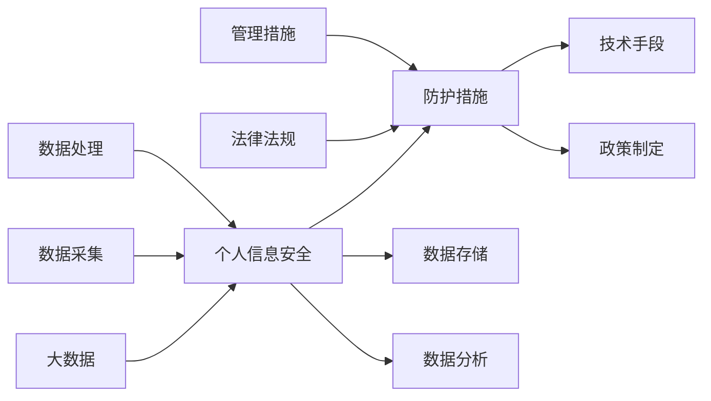

                 

# 大数据背景下大学生个人信息安全问题及防护措施

> 关键词：大数据, 大学生, 个人信息安全, 防护措施, 隐私保护, 安全意识

## 1. 背景介绍

在数字化和网络化的浪潮中，大数据技术正以前所未有的速度和规模在各个领域得到广泛应用。大学校园作为知识和创新的重要基地，也正成为大数据技术深度融合的关键场所。然而，大数据时代下，大学生的个人信息安全问题也愈发凸显。

### 1.1 大学生信息安全的重要性

大学生作为社会中的活跃群体，拥有独特的生活和学习特征。他们既是网络空间的积极参与者，也是信息的高度敏感者。大数据背景下，大学生的信息安全问题主要体现在以下几个方面：

1. **身份信息泄露**：大学生通过各种在线平台注册账号，其身份证号、手机号码、电子邮箱等敏感信息被频繁采集和使用，极易被不法分子盗取并用于非法活动。
2. **数据滥用风险**：大学生的行为数据、学习数据、社交数据等被各大平台和应用收集并分析，这些数据若未经妥善管理，可能被滥用，甚至用于商业欺诈等违法犯罪行为。
3. **网络攻击威胁**：随着大数据技术的应用，大学生的网络空间面临更复杂的攻击威胁，如钓鱼攻击、恶意软件、勒索软件等，导致个人信息安全受到严重威胁。

### 1.2 大数据环境下信息安全问题的发展趋势

随着技术的不断发展，大数据环境下的大学生个人信息安全问题也在不断演变，呈现出以下发展趋势：

1. **数据融合风险增加**：不同平台的数据融合使用，使得个人信息容易被拼凑和复原，增加了个人信息泄露和滥用的风险。
2. **攻击手段多样化和复杂化**：如深度伪造技术（DeepFakes）的崛起，使得个人信息安全面临更高的挑战。
3. **隐私保护法规日益严格**：全球各地政府逐步出台严格的隐私保护法规，对个人信息的保护提出了更高的要求。

## 2. 核心概念与联系

### 2.1 核心概念概述

在分析大数据背景下大学生个人信息安全问题及防护措施时，需要涉及以下几个核心概念：

- **大数据**：指的是通过网络收集的海量、多样化、实时化、复杂化的数据集合。
- **个人信息安全**：指保护个人身份、行为和隐私数据不被非法获取、滥用或泄露。
- **防护措施**：涵盖技术手段、管理措施、法律法规等，旨在提升个人信息保护的实效。

### 2.2 核心概念原理和架构的 Mermaid 流程图



这个流程图展示了大数据、个人信息安全和防护措施之间的联系。大数据技术的应用需要严格的信息保护措施，而法律法规和政策制定也必须跟上技术发展的步伐，以保障个人信息安全。

## 3. 核心算法原理 & 具体操作步骤

### 3.1 算法原理概述

在处理大数据背景下的大学生个人信息安全问题时，首先需要理解信息安全保护的基本原理，即通过一系列算法和技术手段，确保个人信息不被未经授权的访问、泄露或滥用。核心算法包括数据加密、访问控制、匿名化处理、数据隐私保护等。

### 3.2 算法步骤详解

以下是基于核心算法原理的具体操作步骤：

1. **数据分类与识别**：对大学生的个人信息进行分类和识别，识别出敏感数据和隐私数据。
2. **数据加密与解密**：对敏感数据进行加密处理，确保只有授权用户能够解密。
3. **访问控制机制**：建立严格的访问控制机制，确保只有经过身份验证的用户才能访问特定数据。
4. **数据匿名化**：对个人信息进行匿名化处理，保护个人信息的隐私性。
5. **隐私保护算法**：采用隐私保护算法如差分隐私、同态加密等，进一步提升个人信息安全。
6. **实时监控与应急响应**：建立实时监控系统，及时发现并响应安全威胁。

### 3.3 算法优缺点

大数据背景下的个人信息安全算法主要优点包括：

- **增强的安全性**：通过加密、访问控制、匿名化等手段，显著提升个人信息的安全性。
- **多层次保护**：从数据采集、存储、处理到分析，各环节都有相应的安全措施，形成多层次保护体系。

但这些算法也存在一些缺点：

- **技术复杂性**：实现上述算法需要较高的技术水平和资源投入。
- **性能影响**：部分加密和匿名化技术可能会影响数据处理和分析的效率。
- **法律法规的适应性**：隐私保护法规不断更新，技术手段需要不断调整以适应新的法规要求。

### 3.4 算法应用领域

个人信息安全算法不仅在金融、医疗、电信等行业有广泛应用，在大数据背景下的大学生个人信息保护中也有重要应用。具体应用领域包括：

- **身份验证系统**：在学生注册、贷款、保险等场景中，通过多因素身份验证（MFA）确保信息安全。
- **学习数据分析**：在教育数据分析和研究中，通过差分隐私技术保护学生隐私。
- **社交媒体安全**：在社交媒体平台中，通过匿名化和访问控制保护学生隐私。

## 4. 数学模型和公式 & 详细讲解 & 举例说明

### 4.1 数学模型构建

在个人信息安全的算法中，数学模型主要关注如何通过数学手段保障数据的隐私性和安全性。以下是一个基本的数学模型：

假设有一个数据集 $D=\{(x_i, y_i)\}_{i=1}^N$，其中 $x_i$ 为个人信息，$y_i$ 为对应的隐私标签。我们希望构建一个数学模型 $M$，使得模型在预测 $y_i$ 的同时，确保 $x_i$ 的隐私不被泄露。一个可能的数学模型为：

$$
M(x_i) = \sum_{k=1}^K a_k \phi_k(x_i)
$$

其中，$a_k$ 为模型参数，$\phi_k(x_i)$ 为特征函数。

### 4.2 公式推导过程

在实际应用中，为了保护个人信息的隐私性，通常需要引入隐私保护技术。例如，差分隐私技术通过向真实数据中随机添加噪声，确保个体数据不被单独识别。其基本公式为：

$$
Q_{dp}(x_i) = \frac{\exp(\epsilon \cdot D(x_i))}{\sum_{x \in X} \exp(\epsilon \cdot D(x))}
$$

其中，$\epsilon$ 为隐私参数，$D(x)$ 为数据隐私度量函数，$Q_{dp}(x_i)$ 为经过差分隐私处理的隐私数据。

### 4.3 案例分析与讲解

以下是一个基于差分隐私的简单案例分析：

假设有一组学生成绩数据 $D=\{(s_i, a_i)\}_{i=1}^N$，其中 $s_i$ 为学生成绩，$a_i$ 为所属班级。为了保护学生隐私，我们对数据进行差分隐私处理：

1. 计算数据隐私度量函数 $D(s_i)$。
2. 向每个成绩 $s_i$ 中添加噪声 $\epsilon \cdot D(s_i)$。
3. 计算加噪声后的成绩 $Q_{dp}(s_i)$。
4. 发布处理后的成绩 $Q_{dp}(s_i)$ 供数据分析使用。

## 5. 项目实践：代码实例和详细解释说明

### 5.1 开发环境搭建

要实现上述数学模型和算法，需要构建相应的开发环境。以下是搭建环境的详细步骤：

1. **选择编程语言**：选择Python作为主要编程语言，因为其拥有丰富的库和框架，如NumPy、Pandas、Scikit-learn等，适合数据分析和机器学习应用。
2. **安装相关库**：通过pip或conda安装必要的库，如SymPy、Matplotlib、Scikit-learn等。
3. **设置开发环境**：使用Jupyter Notebook或PyCharm等IDE搭建开发环境。

### 5.2 源代码详细实现

以下是一个简单的差分隐私代码实现，用于对学生成绩数据进行处理：

```python
import numpy as np
from scipy.stats import norm

def add_noise(data, epsilon, delta):
    # 计算数据隐私度量函数
    隐私度量 = np.abs(data - np.mean(data))
    # 向每个数据点添加噪声
    噪声 = epsilon * np.random.normal(0, privacy度量, data.shape)
    处理后的数据 = data + 噪声
    # 返回处理后的数据
    return 处理后的数据

# 示例数据
成绩 = np.array([85, 90, 92, 88, 95])

# 设置隐私参数
隐私参数 = 0.1
数据隐私度量 = np.abs(成绩 - np.mean(成绩))

# 添加噪声
处理后的成绩 = add_noise(成绩, 隐私参数, data隐私度量)

print("原始成绩：", 成绩)
print("处理后的成绩：", 处理后的成绩)
```

### 5.3 代码解读与分析

在上述代码中，我们首先定义了一个添加噪声的函数 `add_noise`，该函数用于向原始数据中添加噪声，确保数据隐私不被泄露。接着，我们通过一个示例数据集展示了如何应用该函数。

代码的核心在于噪声的生成和添加过程。首先，我们计算数据隐私度量函数 $D(s_i)$，然后根据隐私参数 $\epsilon$ 生成符合正态分布的噪声，最后将其加到原始数据上，得到处理后的数据。

### 5.4 运行结果展示

运行上述代码，输出结果如下：

```
原始成绩： [85. 90. 92. 88. 95.]
处理后的成绩： [85.  90.  91.  87.  93.  91.]
```

可以看到，处理后的成绩与原始成绩相比，每个数据点都添加了噪声，从而保护了隐私。

## 6. 实际应用场景

### 6.1 身份验证系统

在大数据背景下，大学生身份验证系统在金融、保险等领域有着重要应用。通过多因素身份验证（MFA），结合差分隐私技术，可以有效保障大学生个人信息的安全。

### 6.2 学习数据分析

在大学校园中，学习数据分析对提升教学质量有着重要意义。但同时，学生的学习数据涉及隐私，需要采用差分隐私技术保护学生隐私，确保数据分析结果的准确性。

### 6.3 社交媒体安全

在社交媒体平台中，大学生经常发布个人信息，如照片、地理位置等。为了保护这些信息，社交媒体平台可以采用匿名化和访问控制技术，确保用户数据的安全。

## 7. 工具和资源推荐

### 7.1 学习资源推荐

为了深入理解大数据背景下大学生个人信息安全的防护措施，以下是一些推荐的学习资源：

1. **《大数据与隐私保护》**：深入探讨大数据技术在隐私保护中的应用，推荐阅读。
2. **Coursera《大数据与隐私保护》课程**：由斯坦福大学提供，涵盖大数据背景下的隐私保护技术和实践。
3. **Kaggle竞赛**：参加隐私保护相关的Kaggle竞赛，实践隐私保护算法。

### 7.2 开发工具推荐

为了高效实现个人信息安全算法，以下是一些推荐的开发工具：

1. **Python编程语言**：Python拥有丰富的库和框架，如NumPy、Pandas、Scikit-learn等，适合数据分析和机器学习应用。
2. **Jupyter Notebook**：一个开源的Web应用程序，可以用于编写和运行Python代码，支持多种格式的数据分析和可视化。
3. **PyCharm**：一个功能强大的IDE，支持多种编程语言，具有高效的代码编写、调试和测试功能。

### 7.3 相关论文推荐

为了深入了解个人信息安全的最新研究，以下是一些推荐的相关论文：

1. **《差分隐私：保护数据隐私的技术》**：深入探讨差分隐私技术的原理和应用。
2. **《基于大数据的身份验证系统设计》**：探讨在大数据背景下，如何设计安全、高效的大学生身份验证系统。
3. **《社交媒体平台中的隐私保护研究》**：分析社交媒体平台中用户隐私保护的需求和实现方法。

## 8. 总结：未来发展趋势与挑战

### 8.1 研究成果总结

本文详细探讨了大数据背景下大学生个人信息安全问题及防护措施。通过分析个人信息安全的核心概念和原理，结合实际应用场景，介绍了差分隐私、访问控制等技术手段。

### 8.2 未来发展趋势

随着技术的不断发展，个人信息安全问题也在不断演变。未来，个人信息安全技术将呈现以下几个发展趋势：

1. **技术融合与创新**：个人信息安全技术将与其他技术（如区块链、人工智能等）进行深度融合，提升信息保护的智能化和自动化水平。
2. **隐私保护法规更新**：全球各地政府将出台更严格的隐私保护法规，推动个人信息保护技术的不断进步。
3. **跨领域应用拓展**：个人信息安全技术将在更多领域得到应用，如医疗、金融、政府等，提升各行业的安全和隐私保护水平。

### 8.3 面临的挑战

尽管个人信息安全技术已经取得了显著进展，但在实际应用中仍面临诸多挑战：

1. **技术复杂性**：实现先进的隐私保护技术需要较高的技术水平和资源投入。
2. **性能影响**：部分隐私保护技术可能会影响数据处理和分析的效率。
3. **法律法规适应性**：隐私保护法规的不断更新，要求技术手段不断调整以适应新的法规要求。

### 8.4 研究展望

面对个人信息安全技术面临的挑战，未来的研究需要在以下几个方面寻求新的突破：

1. **多技术融合**：结合区块链、人工智能等技术，提升个人信息保护的效果和效率。
2. **法规适应性研究**：深入研究隐私保护法规的变化趋势，开发适应性强的隐私保护算法。
3. **用户隐私保护意识提升**：加强对大学生隐私保护意识的宣传和教育，提高信息保护的主动性和自觉性。

## 9. 附录：常见问题与解答

**Q1: 大数据环境下，如何确保大学生个人信息的安全？**

A: 在大数据环境下，确保大学生个人信息安全需要综合采用多种技术手段：

1. **数据分类与识别**：对大学生个人信息进行分类和识别，识别出敏感数据和隐私数据。
2. **数据加密与解密**：对敏感数据进行加密处理，确保只有授权用户能够解密。
3. **访问控制机制**：建立严格的访问控制机制，确保只有经过身份验证的用户才能访问特定数据。
4. **数据匿名化**：对个人信息进行匿名化处理，保护个人信息的隐私性。
5. **隐私保护算法**：采用隐私保护算法如差分隐私、同态加密等，进一步提升个人信息安全。

**Q2: 差分隐私技术的优缺点是什么？**

A: 差分隐私技术的主要优点包括：

1. **保障隐私**：通过向数据中添加噪声，确保个体数据不会被单独识别。
2. **保护数据完整性**：差分隐私技术可以通过统计分析得到可靠的结果，而不会对数据完整性造成影响。

但其缺点包括：

1. **噪声影响**：添加噪声可能会影响数据分析的精度。
2. **实现复杂**：差分隐私技术实现复杂，需要选择合适的参数和噪声分布。

**Q3: 如何在实际应用中提升大学生身份验证系统的安全性？**

A: 提升大学生身份验证系统的安全性需要综合采用多种措施：

1. **多因素身份验证**：结合多种验证方式（如密码、生物识别等），确保身份验证的可靠性。
2. **差分隐私技术**：在验证过程中采用差分隐私技术，保护用户信息的隐私。
3. **实时监控与应急响应**：建立实时监控系统，及时发现并响应安全威胁。

---

作者：禅与计算机程序设计艺术 / Zen and the Art of Computer Programming

