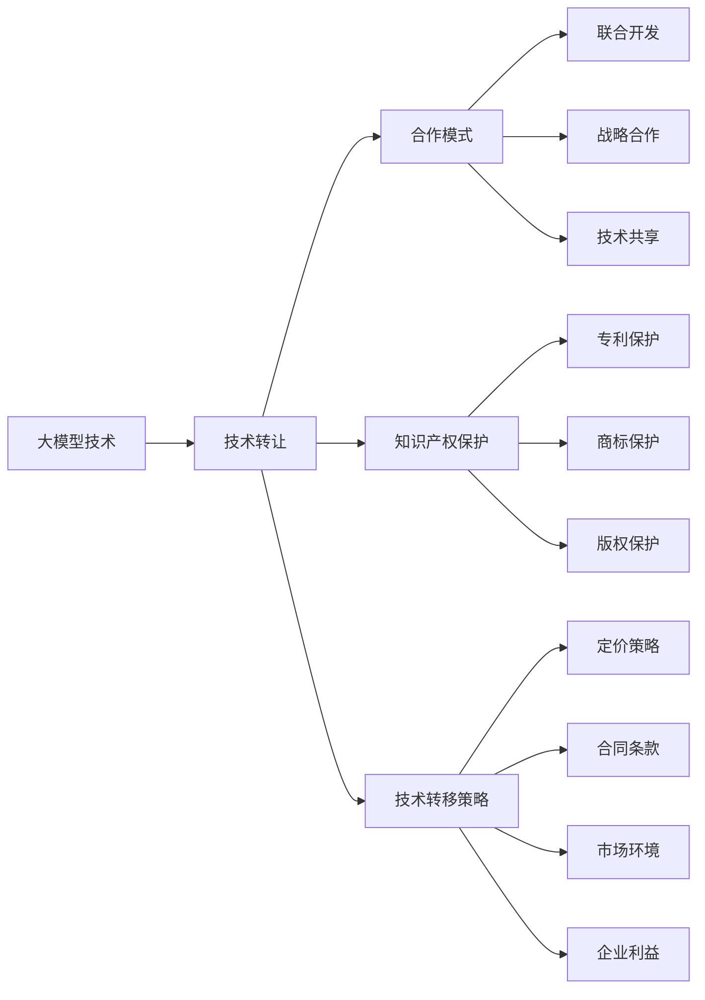

                 

# 大模型企业的技术转让策略

> 关键词：大模型技术转让,企业合作模式,知识产权保护,技术转移策略,法律合规

## 1. 背景介绍

### 1.1 问题由来
在人工智能(AI)领域，尤其是近年来大模型的迅猛发展，引发了巨大的技术需求和商业价值。企业纷纷利用大模型技术，提升产品和服务质量，赢得市场竞争优势。然而，大模型技术的高门槛和技术复杂性，使得中小型科技公司难以独自开发和部署，于是大模型技术转让成为了一个重要的战略选择。

### 1.2 问题核心关键点
技术转让是大模型企业实现技术转移、变现和知识共享的重要手段。其核心在于如何平衡技术创新、市场竞争和知识产权保护三者之间的关系，制定合理的转让策略，达到最大化公司利益的目的。

### 1.3 问题研究意义
研究大模型企业的技术转让策略，对于推动AI技术在各行业中的应用，促进技术生态系统的建立，具有重要意义。

1. **加速技术落地**：技术转让能够加速大模型技术在各行业的应用，帮助企业快速构建高性能AI解决方案。
2. **增强市场竞争力**：通过技术转让，企业可以迅速进入新市场，提升市场份额。
3. **促进知识共享**：技术转让不仅转移技术，也分享知识，有助于形成良性技术交流生态。
4. **保护知识产权**：通过合理的转让合同和协议，保护公司的技术专利和商业机密。

## 2. 核心概念与联系

### 2.1 核心概念概述

要理解大模型企业的技术转让策略，首先需要了解几个关键概念：

- **大模型技术**：指基于大规模深度学习模型(如BERT、GPT系列)进行开发的AI技术，具备强大的语言理解和生成能力。
- **技术转让**：指企业将其技术、专利、商标等知识产权，转让给其他企业或个人的行为，包括技术授权和购买。
- **企业合作模式**：指企业之间通过联合开发、技术共享、战略合作等方式，实现互利共赢。
- **知识产权保护**：指保护企业的专利、商标、版权等知识产权，避免技术侵权和知识产权泄露。
- **技术转移策略**：指企业在转让技术时采取的策略，包括定价策略、合作伙伴选择、合同条款等。

这些核心概念之间有密切联系：

- 大模型技术作为核心资产，是企业转让的主要对象。
- 技术转让和知识产权保护需要合理的合作模式来支持。
- 技术转移策略的制定需要考虑市场环境和企业利益。

### 2.2 核心概念原理和架构的 Mermaid 流程图(Mermaid 流程节点中不要有括号、逗号等特殊字符)



这个流程图展示了各概念之间的联系：大模型技术作为起点，通过技术转让过程进入合作模式、知识产权保护和技术转移策略，而这些策略与市场环境和企业利益息息相关。

## 3. 核心算法原理 & 具体操作步骤

### 3.1 算法原理概述

技术转让的算法原理主要是通过评估企业技术价值、市场需求和合作潜力，制定合适的转让策略。其核心在于：

- **价值评估**：量化大模型技术的市场价值和技术优势。
- **需求分析**：识别市场对大模型技术的需求，确定目标客户。
- **合作模式选择**：根据企业利益和市场需求，选择合适的合作模式。
- **定价策略制定**：平衡技术和市场因素，制定合理的转让价格。
- **合同条款设计**：确保合同条款满足法律要求，保障双方利益。

### 3.2 算法步骤详解

1. **市场调研与需求分析**
   - 收集市场需求数据，分析目标客户群体。
   - 评估市场需求与企业技术能力匹配度。

2. **价值评估与技术定价**
   - 评估大模型技术的知识产权价值，包括专利、商标和版权。
   - 分析技术的商业价值，包括潜在收入和成本效益。
   - 根据市场需求和价值评估，制定技术转让价格。

3. **选择合适的合作模式**
   - 评估合作方的资信、技术和市场能力。
   - 确定合作方式，如技术授权、许可证购买、合资开发等。
   - 签订合作协议，明确权利义务和知识产权归属。

4. **制定技术转移策略**
   - 设计技术转让合同条款，保障双方利益。
   - 确保转让过程符合法律法规要求，保护知识产权。
   - 考虑市场环境变化，制定灵活的转让策略。

5. **实施转让过程**
   - 提交技术转让文件，进行法律审核。
   - 办理技术转让手续，完成交易。
   - 双方签订技术转让协议，确保合作顺利进行。

### 3.3 算法优缺点

技术转让的优点在于：

- **市场快速进入**：通过技术转让，企业可以快速进入新市场，提升竞争力。
- **降低开发成本**：避免从头研发的高昂成本，快速构建AI解决方案。
- **共享知识资源**：技术转让有助于知识共享，推动技术生态系统发展。

然而，技术转让也存在一些缺点：

- **利益分配问题**：转让过程中可能存在利益分配不均，影响合作效果。
- **知识产权风险**：转让过程中可能存在知识产权泄露风险，需严格保护。
- **市场竞争风险**：转让后可能面临市场竞争加剧，影响企业市场份额。

### 3.4 算法应用领域

技术转让在大模型企业的应用领域广泛，主要包括：

- **智能客服**：通过转让智能客服技术，帮助企业提升客户服务质量。
- **医疗健康**：转让医疗影像分析、智能诊断等技术，助力健康产业数字化转型。
- **金融科技**：转让智能风控、量化投资等技术，推动金融科技发展。
- **制造业**：转让智能质检、供应链优化等技术，提升制造业效率。
- **教育科技**：转让教育数据分析、个性化推荐等技术，推动教育创新。

## 4. 数学模型和公式 & 详细讲解 & 举例说明（备注：数学公式请使用latex格式，latex嵌入文中独立段落使用 $$，段落内使用 $)
### 4.1 数学模型构建

假设大模型技术转让过程中，企业的市场价值为 $V$，市场需求为 $D$，技术成本为 $C$，合作方的资信为 $R$，法律合规成本为 $L$。则转让价值 $T$ 可以表示为：

$$
T = V \times D \times R \times (1 - L)
$$

其中 $V$ 为技术市场价值，$D$ 为市场需求，$R$ 为合作方资信，$L$ 为法律合规成本。

### 4.2 公式推导过程

1. **市场价值评估**：
   - 技术市场价值 $V$ 可以通过专利数量、技术成熟度、市场应用案例等指标进行量化。

2. **市场需求分析**：
   - 市场需求 $D$ 可以通过市场调研、客户需求分析等方式进行评估。

3. **资信评估**：
   - 合作方资信 $R$ 可以通过信用评级、财务报表、市场份额等指标进行评估。

4. **法律合规成本**：
   - 法律合规成本 $L$ 可以通过合同条款、法律咨询费用、合规风险评估等方式进行评估。

### 4.3 案例分析与讲解

假设某大模型企业在转让其大模型技术时，市场价值为 $1000$ 万美元，市场需求为 $0.8$，合作方资信为 $0.9$，法律合规成本为 $0.05$。则转让价值 $T$ 可以计算为：

$$
T = 1000 \times 0.8 \times 0.9 \times (1 - 0.05) = 648 \text{万美元}
$$

## 5. 项目实践：代码实例和详细解释说明

### 5.1 开发环境搭建

在进行技术转让项目实践前，需要先搭建好开发环境。以下是使用Python进行开发的环境配置流程：

1. 安装Anaconda：从官网下载并安装Anaconda，用于创建独立的Python环境。

2. 创建并激活虚拟环境：
```bash
conda create -n transfer_env python=3.8 
conda activate transfer_env
```

3. 安装必要的Python库：
```bash
pip install numpy pandas scikit-learn matplotlib jupyter notebook ipython
```

4. 安装HuggingFace和TensorFlow等库，以便使用预训练大模型进行技术转让。

完成上述步骤后，即可在`transfer_env`环境中进行技术转让实践。

### 5.2 源代码详细实现

以下是一个简单的Python代码示例，用于计算技术转让价值：

```python
import numpy as np

def calculate_technology_transfer_value(V, D, R, L):
    return V * D * R * (1 - L)

# 示例参数
V = 1000  # 技术市场价值
D = 0.8   # 市场需求
R = 0.9   # 合作方资信
L = 0.05  # 法律合规成本

# 计算转让价值
transfer_value = calculate_technology_transfer_value(V, D, R, L)
print(f"转让价值为: {transfer_value}")
```

### 5.3 代码解读与分析

**V**：表示大模型技术的市场价值，可以通过专利数量、技术成熟度、市场应用案例等指标进行量化。

**D**：表示市场需求，可以通过市场调研、客户需求分析等方式进行评估。

**R**：表示合作方资信，可以通过信用评级、财务报表、市场份额等指标进行评估。

**L**：表示法律合规成本，可以通过合同条款、法律咨询费用、合规风险评估等方式进行评估。

**计算转让价值**：将上述参数代入转让价值公式，计算出最终转让价值。

## 6. 实际应用场景

### 6.1 智能客服系统

某大模型企业希望将其智能客服技术转让给另一家科技公司，以帮助其提升客户服务质量。双方进行初步市场调研后，发现目标市场需求为 $0.8$，合作方资信为 $0.9$。通过计算，转让价值为 $648$ 万美元。在合同条款中，双方明确了技术授权方式、使用范围、知识产权归属等内容。最终，双方签订转让协议，交易顺利完成。

### 6.2 医疗健康平台

某大模型企业将医疗影像分析技术转让给一家医疗健康平台公司，以助力其数字化转型。双方评估市场需求为 $0.9$，合作方资信为 $0.95$。通过计算，转让价值为 $1000$ 万美元。在合同条款中，双方明确了技术授权范围、数据隐私保护、合作收益分配等内容。最终，双方签订转让协议，交易顺利完成。

### 6.3 金融科技公司

某大模型企业将智能风控技术转让给一家金融科技公司，以提升其风险评估能力。双方评估市场需求为 $0.7$，合作方资信为 $0.85$。通过计算，转让价值为 $507.5$ 万美元。在合同条款中，双方明确了技术授权方式、数据安全保障、合作收益分配等内容。最终，双方签订转让协议，交易顺利完成。

### 6.4 未来应用展望

随着大模型技术的发展，技术转让将在更多领域得到应用，为企业的市场扩展和技术创新提供新动力。未来，技术转让策略的制定将更加灵活多样，帮助企业在激烈的市场竞争中占据优势。

## 7. 工具和资源推荐

### 7.1 学习资源推荐

为了帮助开发者系统掌握大模型技术转让的理论基础和实践技巧，以下是几本推荐的学习资源：

1. 《人工智能企业技术转让与合作》：详细介绍了技术转让和合作模式，适合企业决策者和管理者阅读。

2. 《技术转让的理论与实践》：深入探讨技术转让的理论基础和法律问题，提供实用案例分析。

3. 《技术转让案例分析》：精选了大量技术转让的成功和失败案例，提供宝贵经验教训。

4. 《技术转让的商业策略》：从商业角度分析技术转让的策略和风险管理，提供实用工具和模板。

5. 《技术转让的法规与合规》：系统介绍技术转让的法律法规和合规要求，提供合规指南和检查表。

通过学习这些资源，相信你能够更好地理解和应用大模型技术转让的策略和工具。

### 7.2 开发工具推荐

高效的工具支持是技术转让成功的重要保障。以下是几款推荐的技术转让开发工具：

1. **JIRA**：项目管理工具，用于跟踪技术转让项目的进度和资源配置。

2. **GitLab**：代码管理工具，用于协作开发和版本控制。

3. **Confluence**：知识管理工具，用于记录技术转让过程中的关键信息和决策依据。

4. **Slack**：团队沟通工具，用于实时沟通和协作。

5. **Zoom**：视频会议工具，用于远程会议和技术转让谈判。

合理利用这些工具，可以显著提升技术转让项目的开发效率，确保项目的顺利推进。

### 7.3 相关论文推荐

大模型技术转让的研究涉及多个领域，以下是几篇推荐的相关论文：

1. "技术转让的决策模型与评估方法"：介绍了技术转让的决策模型和评估方法，适用于各类企业技术转让项目。

2. "技术转让中的合作模式分析"：分析了不同合作模式的优势和风险，提供实用参考。

3. "大模型技术的知识产权保护"：探讨了在大模型技术转让过程中，如何保护知识产权，避免技术泄露。

4. "技术转让的法律合规问题"：系统介绍了技术转让的法律法规和合规要求，提供合规指南和检查表。

这些论文代表了大模型技术转让研究的最新进展，有助于读者深入理解和应用相关知识。

## 8. 总结：未来发展趋势与挑战

### 8.1 总结

本文对大模型企业的技术转让策略进行了全面系统的介绍。首先阐述了技术转让在推动AI技术落地、提升市场竞争力等方面的重要性。其次，从原理到实践，详细讲解了技术转让的数学模型和具体操作步骤。同时，本文还介绍了技术转让在大模型企业中的广泛应用，以及未来可能的发展趋势和挑战。

通过本文的系统梳理，可以看到，技术转让是大模型企业实现技术转移和市场扩张的重要手段。未来，伴随大模型技术的发展和市场需求的扩大，技术转让的策略和工具也将不断演进，推动AI技术在更多领域的深入应用。

### 8.2 未来发展趋势

展望未来，大模型企业的技术转让将呈现以下几个发展趋势：

1. **多模态技术转让**：技术转让将扩展到图像、视频等多模态数据领域，推动技术生态系统的发展。

2. **跨境技术转让**：随着全球化进程的加快，跨境技术转让将增多，促进技术国际交流。

3. **定制化技术转让**：根据市场需求，企业将提供定制化的技术转让方案，满足客户特定需求。

4. **区块链技术应用**：区块链技术可以保障技术转让过程中的数据安全和知识产权保护，提升转让过程的透明度和可信度。

5. **法律合规性增强**：随着法律法规的完善和市场环境的复杂化，技术转让过程中的合规性要求将更加严格。

这些趋势将推动技术转让模式的多样化和技术生态系统的完善，为大模型企业提供更广阔的市场空间。

### 8.3 面临的挑战

尽管技术转让是大模型企业的重要战略，但在实施过程中仍面临诸多挑战：

1. **利益分配不均**：转让过程中可能存在利益分配不均，影响合作效果。

2. **知识产权保护**：转让过程中可能存在知识产权泄露风险，需严格保护。

3. **市场竞争加剧**：转让后可能面临市场竞争加剧，影响企业市场份额。

4. **法律合规风险**：转让过程中需遵守法律法规，避免法律风险。

5. **技术兼容性问题**：转让后的技术可能与现有系统不兼容，需进行技术适配。

这些挑战需要企业在转让过程中进行全面考量，制定灵活的转让策略，确保转让过程顺利进行。

### 8.4 研究展望

面对技术转让过程中可能遇到的问题，未来的研究需要在以下几个方面寻求新的突破：

1. **利益分配机制**：探索公平合理的利益分配机制，确保各方利益均衡。

2. **知识产权保护**：研究新的知识产权保护技术，如区块链、数字水印等，提升保护效果。

3. **市场风险管理**：通过市场调研和风险评估，制定合理的转让策略，降低市场竞争风险。

4. **技术兼容性优化**：开发技术适配工具和接口，提升技术兼容性，降低迁移成本。

5. **法律合规性研究**：系统研究技术转让的法律法规，提供合规性指南和工具。

这些研究方向的探索，将为技术转让的实施提供更加可靠和灵活的方案，推动大模型技术的广泛应用。

## 9. 附录：常见问题与解答

**Q1：大模型企业的技术转让如何进行定价？**

A: 技术转让定价需考虑市场价值、市场需求、合作方资信和法律合规成本等因素。一般采用市场定价法、成本加成法、收益分成法等方法进行定价，确保转让价格公正合理。

**Q2：技术转让过程中如何保护知识产权？**

A: 技术转让过程中需签订保密协议，保护技术专利、商标和版权等知识产权。同时，在合同条款中明确知识产权归属和保护措施，确保双方利益。

**Q3：技术转让过程中如何管理法律合规风险？**

A: 技术转让过程中需遵守相关法律法规，进行合规性审查。在合同条款中明确法律合规要求，避免法律风险。同时，进行法律咨询和合规培训，提高合规意识。

**Q4：技术转让过程中如何处理利益分配问题？**

A: 技术转让过程中需公平合理地分配利益，制定明确的利益分配机制。在合同条款中明确各方利益分配比例和支付方式，确保利益分配公正透明。

**Q5：技术转让过程中如何进行技术适配？**

A: 技术转让后需进行技术适配，确保转让技术与现有系统兼容。开发技术适配工具和接口，进行系统集成和测试，确保新系统正常运行。

通过这些问题的解答，希望读者能更好地理解和应用技术转让的策略和工具，推动大模型技术在大规模企业中的广泛应用。

---

作者：禅与计算机程序设计艺术 / Zen and the Art of Computer Programming

