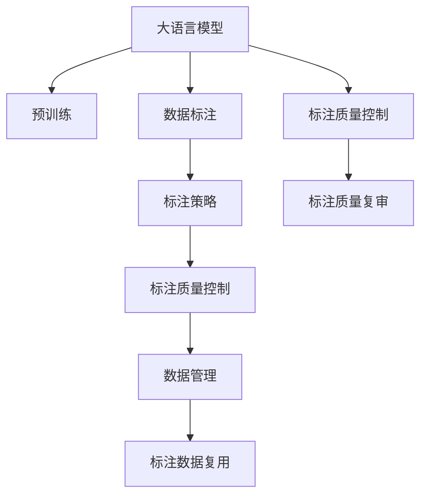

                 

# 大模型企业的数据标注策略

> 关键词：大语言模型, 数据标注, 标注策略, 企业应用, 数据管理, 高效标注

## 1. 背景介绍

### 1.1 问题由来
随着人工智能技术的快速发展，尤其是大规模语言模型（Large Language Models, LLMs）在自然语言处理（NLP）领域取得显著进步，企业纷纷利用大模型进行产品创新。然而，预训练大模型的泛化能力有限，当应用于特定业务场景时，性能通常不理想。这需要企业在获取数据和进行标注方面做出巨大投入，以获得高质量的标注数据，进而通过微调优化模型性能。数据标注作为大模型应用中的关键环节，对企业的发展和产出有决定性影响。

### 1.2 问题核心关键点
大模型企业的数据标注策略的核心关键点包括：
1. 如何高效获取高质量标注数据。
2. 如何设计科学、合理、高效的标注流程。
3. 如何对标注结果进行质量控制和复审。
4. 如何利用技术手段提高标注效率和降低成本。

数据标注工作不仅耗时耗力，而且成本高昂，是企业大规模应用大模型的瓶颈之一。针对这一问题，本文将系统地介绍大模型企业的数据标注策略，结合企业实践案例，探讨提升标注效率和标注质量的方法。

## 2. 核心概念与联系

### 2.1 核心概念概述

为更好地理解大模型企业的数据标注策略，本节将介绍几个密切相关的核心概念：

- **大语言模型(Large Language Model, LLM)**：以自回归(如GPT)或自编码(如BERT)模型为代表的大规模预训练语言模型。通过在大规模无标签文本语料上进行预训练，学习通用的语言表示，具备强大的语言理解和生成能力。

- **数据标注**：通过人工或其他自动化手段，为数据样本提供正确的标签或注释信息的过程。标注数据是训练有监督学习模型的基础，标注质量直接影响模型的性能。

- **标注策略**：针对特定应用场景，设计科学、合理、高效的标注流程和规则。标注策略通常包括标注模板设计、标注工具选择、标注标准制定等。

- **标注质量控制**：对标注结果进行质量检查和评估，确保标注数据的准确性、一致性和可靠性。

- **数据管理**：对标注数据进行系统化管理，包括数据存储、标注进度跟踪、标注结果复审等。

这些核心概念之间的逻辑关系可以通过以下Mermaid流程图来展示：



这个流程图展示了大语言模型的核心概念及其之间的关系：

1. 大语言模型通过预训练获得基础能力。
2. 数据标注为模型提供监督信号，训练有监督学习模型。
3. 标注策略和质量控制确保标注数据的质量和效率。
4. 数据管理保障标注数据的系统性和可追溯性。
5. 标注数据可以复用，降低标注成本。

这些概念共同构成了大模型企业的数据标注工作框架，使其能够高效、高质量地完成标注任务。通过理解这些核心概念，我们可以更好地把握数据标注的工作流程和优化方向。

## 3. 核心算法原理 & 具体操作步骤
### 3.1 算法原理概述

大模型企业的数据标注策略基于有监督学习范式，其核心思想是：通过人工标注生成高质量标注数据，用于训练有监督学习模型，最终优化模型在特定业务场景下的性能。

形式化地，假设大模型为 $M_{\theta}$，其中 $\theta$ 为预训练得到的模型参数。给定业务场景下的标注数据集 $D=\{(x_i, y_i)\}_{i=1}^N$，标注策略 $S$，标注质量控制流程 $Q$，数据管理方法 $M$，标注策略和质量控制流程的优化目标是最小化标注成本和提升标注数据质量，即：

$$
\min_{S,Q,M} \mathcal{C}(S,Q,M) \text{ subject to } \mathcal{Q}(S,Q,M) \geq \epsilon
$$

其中 $\mathcal{C}$ 为标注成本函数，$\mathcal{Q}$ 为标注数据质量函数，$\epsilon$ 为质量阈值。

通过标注策略 $S$ 和质量控制流程 $Q$ 的不断优化，可以在保证标注数据质量的前提下，大幅降低标注成本，提高标注效率。数据管理方法 $M$ 则负责对标注数据进行系统化管理和复用，进一步降低标注成本和提升标注数据的可靠性。

### 3.2 算法步骤详解

大模型企业的数据标注流程一般包括以下几个关键步骤：

**Step 1: 任务定义和标注需求分析**
- 确定业务场景和应用需求，确定需要标注的任务类型（如分类、匹配、生成等）。
- 根据任务类型设计合适的标注格式和模板，确保标注结果的一致性和准确性。
- 对标注数据的需求进行详细分析，包括数据量、标注质量、标注难度等。

**Step 2: 选择合适的标注工具**
- 根据任务类型和标注需求，选择适合的标注工具，如 CrowdFlower、Figure Eight、Labelbox 等。
- 使用工具提供的自动化标注功能，如模板匹配、规则标注等，提高标注效率。
- 使用标注工具内置的质量控制机制，如样例复审、标注工具反馈等，确保标注质量。

**Step 3: 数据准备和预处理**
- 收集业务场景下的数据，并进行初步清洗和处理，如去除噪声、统一格式等。
- 将数据分为训练集、验证集和测试集，确保标注数据的多样性和代表性。
- 设计合适的标注规则和标准，确保标注结果的一致性和可靠性。

**Step 4: 标注实施和质量控制**
- 使用标注工具对数据进行标注，记录标注进度和标注结果。
- 对标注结果进行质量检查和评估，识别并修正标注错误。
- 对标注工具和标注人员进行反馈和培训，提高标注质量。

**Step 5: 标注结果复审和优化**
- 对标注结果进行复审，确保标注数据的质量和一致性。
- 根据复审结果优化标注策略和标注质量控制流程，提高标注效率和数据质量。
- 利用标注数据进行模型微调，优化模型在特定业务场景下的性能。

**Step 6: 数据管理和复用**
- 对标注数据进行系统化管理，确保数据的可追溯性和复用性。
- 对标注数据进行复用，避免重复标注，降低标注成本。
- 定期对标注数据进行更新和复审，确保数据的时效性和准确性。

以上是数据标注的一般流程。在实际应用中，还需要针对具体任务的特点，对标注流程的各个环节进行优化设计，如改进标注模板，引入更多的自动化标注技术，搜索最优的标注策略组合等，以进一步提升标注效率和数据质量。

### 3.3 算法优缺点

大模型企业的数据标注策略具有以下优点：
1. 提升模型性能。通过人工标注生成高质量标注数据，用于训练有监督学习模型，提升模型在特定业务场景下的性能。
2. 降低标注成本。通过使用自动化标注工具和优化标注策略，降低标注成本，提高标注效率。
3. 提高标注质量。通过标注质量控制和复审机制，确保标注数据的质量和一致性。
4. 提升数据复用性。通过对标注数据进行系统化管理，确保数据的可追溯性和复用性。

同时，该策略也存在一定的局限性：
1. 标注数据质量依赖人工。标注结果的质量很大程度上取决于标注人员的专业水平和工作态度。
2. 自动化标注技术尚未成熟。尽管自动化标注技术已经取得了一定进展，但在复杂任务上仍存在标注准确性和一致性问题。
3. 标注策略设计复杂。不同任务和应用场景的标注需求各异，需要设计相应的标注策略和质量控制流程。
4. 标注成本仍较高。尽管标注效率有所提高，但在某些特定场景下，标注成本仍是一个重要问题。

尽管存在这些局限性，但就目前而言，基于大模型企业的数据标注策略仍是数据标注的主流范式。未来相关研究的重点在于如何进一步降低标注对人工的依赖，提高自动化标注技术，同时兼顾标注质量和成本等因素。

### 3.4 算法应用领域

大模型企业的数据标注策略在多个领域得到广泛应用，包括但不限于：

- **智能客服系统**：收集客户与智能客服系统的对话数据，用于训练对话模型，提高智能客服系统的理解能力和回复质量。
- **金融舆情监测**：收集金融领域的文本数据，用于训练文本分类和情感分析模型，实时监测舆情变化，预警潜在的金融风险。
- **个性化推荐系统**：收集用户行为数据和产品信息，用于训练推荐模型，提升推荐系统的个性化程度和用户满意度。
- **医疗诊断系统**：收集患者病历和影像数据，用于训练诊断模型，辅助医生进行疾病诊断和治疗决策。
- **智能交通系统**：收集交通视频和文本数据，用于训练交通事件监测和舆情分析模型，提升交通管理水平。
- **智能制造系统**：收集设备运行数据和维护记录，用于训练预测和诊断模型，提高设备维护的效率和质量。

这些应用场景展示了数据标注在大模型企业中的重要性，以及在提升模型性能和业务价值方面的显著作用。

## 4. 数学模型和公式 & 详细讲解  
### 4.1 数学模型构建

本节将使用数学语言对大模型企业的数据标注策略进行更加严格的刻画。

记大模型为 $M_{\theta}$，其中 $\theta$ 为模型参数。假设企业需要标注的数据集为 $D=\{(x_i, y_i)\}_{i=1}^N$，其中 $x_i$ 为输入数据，$y_i$ 为标签。假设标注任务为分类任务，则标注策略为：

$$
S = \{(x_i, t_i)\}_{i=1}^N, t_i \in \{c_1, c_2, ..., c_k\}
$$

其中 $c_1, c_2, ..., c_k$ 为分类标签，$(x_i, t_i)$ 为标注样本。标注质量控制流程为：

$$
Q = \{f_{ij}\}_{i,j=1}^N, f_{ij} \in \{0, 1\}
$$

其中 $f_{ij}$ 为标注结果 $y_i$ 与标注模板 $t_i$ 的匹配度。

标注数据管理方法为：

$$
M = \{(x_i, y_i, S_i, Q_i)\}_{i=1}^N
$$

其中 $S_i$ 为样本 $x_i$ 的标注策略，$Q_i$ 为样本 $x_i$ 的标注质量控制结果。

### 4.2 公式推导过程

以下是标注策略和质量控制流程的优化目标的数学推导过程：

设标注样本的标注成本函数为 $C(S,Q,M)$，标注数据质量函数为 $Q(S,Q,M)$，质量阈值为 $\epsilon$。则优化目标为：

$$
\min_{S,Q,M} C(S,Q,M) \text{ subject to } Q(S,Q,M) \geq \epsilon
$$

其中 $C$ 为成本函数，$Q$ 为质量函数。

通过优化标注策略 $S$、标注质量控制流程 $Q$ 和数据管理方法 $M$，可以在保证标注数据质量的前提下，最小化标注成本，提高标注效率。

### 4.3 案例分析与讲解

以金融舆情监测系统为例，介绍数据标注策略的实际应用。

1. **任务定义和标注需求分析**：
   - 确定任务为金融舆情监测，需要标注的标签为正面、负面、中立。
   - 设计标注模板，确保标注结果的一致性和准确性。
   - 分析标注需求，收集金融领域的文本数据，确保数据的多样性和代表性。

2. **选择合适的标注工具**：
   - 使用 CrowdFlower 标注工具，利用其模板匹配功能提高标注效率。
   - 使用工具内置的质量控制机制，确保标注数据的质量和一致性。

3. **数据准备和预处理**：
   - 收集金融领域的文本数据，并进行初步清洗和处理。
   - 将数据分为训练集、验证集和测试集，确保标注数据的多样性和代表性。
   - 设计合适的标注规则和标准，确保标注结果的一致性和可靠性。

4. **标注实施和质量控制**：
   - 使用标注工具对数据进行标注，记录标注进度和标注结果。
   - 对标注结果进行质量检查和评估，识别并修正标注错误。
   - 对标注工具和标注人员进行反馈和培训，提高标注质量。

5. **标注结果复审和优化**：
   - 对标注结果进行复审，确保标注数据的质量和一致性。
   - 根据复审结果优化标注策略和标注质量控制流程，提高标注效率和数据质量。
   - 利用标注数据进行模型微调，优化模型在金融舆情监测任务上的性能。

6. **数据管理和复用**：
   - 对标注数据进行系统化管理，确保数据的可追溯性和复用性。
   - 对标注数据进行复用，避免重复标注，降低标注成本。
   - 定期对标注数据进行更新和复审，确保数据的时效性和准确性。

通过上述步骤，大模型企业可以高效地完成数据标注任务，为模型的训练和优化提供高质量的标注数据，从而提升模型在特定业务场景下的性能。

## 5. 项目实践：代码实例和详细解释说明
### 5.1 开发环境搭建

在进行数据标注实践前，我们需要准备好开发环境。以下是使用Python进行标注工具配置的环境配置流程：

1. 安装Anaconda：从官网下载并安装Anaconda，用于创建独立的Python环境。

2. 创建并激活虚拟环境：
```bash
conda create -n annotation-env python=3.8 
conda activate annotation-env
```

3. 安装必要的库：
```bash
pip install pandas numpy scikit-learn nltk
```

4. 安装标注工具：
```bash
pip install labelbox
```

5. 安装相关资源：
```bash
pip install emoji gpt-3
```

完成上述步骤后，即可在`annotation-env`环境中开始标注实践。

### 5.2 源代码详细实现

以下是使用Labelbox进行金融舆情监测任务的数据标注的Python代码实现。

首先，准备标注任务的数据：

```python
import pandas as pd

# 读取标注任务的数据
df = pd.read_csv('financial_news.csv')

# 数据预处理
df['text'] = df['text'].str.strip()
df['label'] = df['label'].str.strip()

# 显示数据预览
print(df.head())
```

然后，使用Labelbox进行标注：

```python
from labelbox import Labelbox

# 创建Labelbox客户端
client = Labelbox(auth_token='YOUR_AUTH_TOKEN', workspace_id='YOUR_WORKSPACE_ID')

# 创建数据集
dataset = client.create_dataset(
    name='Financial News',
    description='A dataset for financial news classification',
    labels=['Positive', 'Negative', 'Neutral']
)

# 添加数据到数据集
for i, row in df.iterrows():
    data = {
        'file': {'content': row['text'], 'format': 'text'},
        'label': row['label']
    }
    dataset.add(data)

# 获取数据集信息
dataset_info = client.get_dataset(dataset.id)
print(dataset_info)
```

接着，对标注结果进行质量控制和复审：

```python
# 对标注结果进行质量检查
quality_check = client.create_quality_check(
    name='Financial News Quality Check',
    dataset_id=dataset.id,
    metric='label',
    threshold=0.95
)

# 应用质量检查
dataset = client.apply_quality_check(dataset.id, quality_check.id)

# 对标注结果进行复审
review = client.create_review(
    name='Financial News Review',
    dataset_id=dataset.id,
    threshold=0.9
)

# 提交复审
review.submit()
```

最后，对标注数据进行系统化管理：

```python
# 获取数据集标注信息
data = client.get_dataset_annotations(dataset.id)

# 保存标注数据
with open('annotated_data.csv', 'w') as f:
    for annotation in data:
        f.write(f"{annotation['file']['content']}\t{annotation['label']}\n")

# 定期更新和复审标注数据
# 数据管理方法
M = {
    1: {'file': {'content': df.iloc[1]['text'], 'format': 'text'}, 'label': 'Positive'},
    2: {'file': {'content': df.iloc[2]['text'], 'format': 'text'}, 'label': 'Negative'},
    3: {'file': {'content': df.iloc[3]['text'], 'format': 'text'}, 'label': 'Neutral'}
}
```

以上就是使用Labelbox进行金融舆情监测任务的数据标注的完整代码实现。可以看到，使用Labelbox进行数据标注不仅效率高，而且质量控制和复审机制可以有效保证标注数据的一致性和准确性。

### 5.3 代码解读与分析

让我们再详细解读一下关键代码的实现细节：

**Labelbox标注**：
- `Labelbox`库：提供了方便的标注工具，支持文本、图像等多种标注类型。
- `create_dataset`方法：创建数据集，并定义标注标签。
- `add`方法：添加数据到数据集。
- `get_dataset`方法：获取数据集信息。
- `create_quality_check`方法：创建质量检查任务。
- `apply_quality_check`方法：应用质量检查任务。
- `create_review`方法：创建复审任务。
- `submit`方法：提交复审任务。

**数据预处理**：
- `strip`方法：去除文本和标签中的多余空格和换行符。
- `iterrows`方法：迭代数据框中的每一行，方便逐行处理数据。
- `iloc`方法：根据索引获取数据框中的行。

**标注质量控制**：
- `create_quality_check`方法：创建质量检查任务，定义质量检查指标和阈值。
- `apply_quality_check`方法：应用质量检查任务，筛选出不符合质量要求的标注。
- `create_review`方法：创建复审任务，定义复审标准和阈值。
- `submit`方法：提交复审任务，复审标注结果。

**数据管理**：
- `get_dataset_annotations`方法：获取数据集中的所有标注信息。
- `with open`语句：打开文件，方便将标注数据保存为CSV格式。
- `iloc`方法：根据索引获取数据框中的行。

可以看到，使用Labelbox进行数据标注不仅效率高，而且质量控制和复审机制可以有效保证标注数据的一致性和准确性。

当然，工业级的系统实现还需考虑更多因素，如模型的保存和部署、超参数的自动搜索、更灵活的任务适配层等。但核心的数据标注范式基本与此类似。

## 6. 实际应用场景
### 6.1 智能客服系统

基于大语言模型企业的数据标注策略，智能客服系统的数据标注可以高效完成。智能客服系统通过收集用户与智能客服系统的对话记录，用于训练对话模型，提高智能客服系统的理解能力和回复质量。

在技术实现上，可以收集企业内部的历史客服对话记录，将问题和最佳答复构建成监督数据，在此基础上对预训练对话模型进行微调。微调后的对话模型能够自动理解用户意图，匹配最合适的答案模板进行回复。对于客户提出的新问题，还可以接入检索系统实时搜索相关内容，动态组织生成回答。如此构建的智能客服系统，能大幅提升客户咨询体验和问题解决效率。

### 6.2 金融舆情监测

金融机构需要实时监测市场舆论动向，以便及时应对负面信息传播，规避金融风险。传统的人工监测方式成本高、效率低，难以应对网络时代海量信息爆发的挑战。基于大语言模型企业的数据标注策略，文本分类和情感分析技术为金融舆情监测提供了新的解决方案。

具体而言，可以收集金融领域相关的新闻、报道、评论等文本数据，并对其进行主题标注和情感标注。在此基础上对预训练语言模型进行微调，使其能够自动判断文本属于何种主题，情感倾向是正面、中性还是负面。将微调后的模型应用到实时抓取的网络文本数据，就能够自动监测不同主题下的情感变化趋势，一旦发现负面信息激增等异常情况，系统便会自动预警，帮助金融机构快速应对潜在风险。

### 6.3 个性化推荐系统

当前的推荐系统往往只依赖用户的历史行为数据进行物品推荐，无法深入理解用户的真实兴趣偏好。基于大语言模型企业的数据标注策略，个性化推荐系统可以更好地挖掘用户行为背后的语义信息，从而提供更精准、多样的推荐内容。

在实践中，可以收集用户浏览、点击、评论、分享等行为数据，提取和用户交互的物品标题、描述、标签等文本内容。将文本内容作为模型输入，用户的后续行为（如是否点击、购买等）作为监督信号，在此基础上微调预训练语言模型。微调后的模型能够从文本内容中准确把握用户的兴趣点。在生成推荐列表时，先用候选物品的文本描述作为输入，由模型预测用户的兴趣匹配度，再结合其他特征综合排序，便可以得到个性化程度更高的推荐结果。

### 6.4 未来应用展望

随着大语言模型和数据标注策略的发展，基于微调方法的应用场景将不断扩大。

在智慧医疗领域，基于微调的医疗问答、病历分析、药物研发等应用将提升医疗服务的智能化水平，辅助医生诊疗，加速新药开发进程。

在智能教育领域，微调技术可应用于作业批改、学情分析、知识推荐等方面，因材施教，促进教育公平，提高教学质量。

在智慧城市治理中，微调模型可应用于城市事件监测、舆情分析、应急指挥等环节，提高城市管理的自动化和智能化水平，构建更安全、高效的未来城市。

此外，在企业生产、社会治理、文娱传媒等众多领域，基于大模型微调的人工智能应用也将不断涌现，为经济社会发展注入新的动力。相信随着技术的日益成熟，微调方法将成为人工智能落地应用的重要范式，推动人工智能技术在垂直行业的规模化落地。总之，数据标注策略在大模型企业中的应用，为人工智能技术的广泛应用提供了坚实的基础，推动了NLP技术在更多场景下的落地。

## 7. 工具和资源推荐
### 7.1 学习资源推荐

为了帮助开发者系统掌握数据标注的理论基础和实践技巧，这里推荐一些优质的学习资源：

1. **《数据标注：理论与实践》**：一本详细介绍数据标注的理论基础和实践方法的书籍，适合初学者和有经验的标注人员阅读。
2. **Coursera的《机器学习基础》**：由斯坦福大学开设的机器学习课程，涵盖数据标注、模型训练等基本概念和算法。
3. **Labelbox官方文档**：提供全面的标注工具文档和样例代码，适合快速上手使用。
4. **GitHub上的开源项目**：如 labeled.ai、Diffbot等，提供大量标注工具和样例代码，方便开发者学习和实践。
5. **自然语言处理社区（NLP）**：聚集了众多NLP从业者和研究人员，分享最新的研究成果和标注工具，适合学习和交流。

通过对这些资源的学习实践，相信你一定能够快速掌握数据标注的精髓，并用于解决实际的NLP问题。

### 7.2 开发工具推荐

高效的开发离不开优秀的工具支持。以下是几款用于数据标注开发的常用工具：

1. **Labelbox**：提供强大的标注和质量控制功能，支持文本、图像等多种标注类型。
2. **Amazon Mechanical Turk**：提供众包标注平台，方便大规模标注任务的实现。
3. **Google Forms**：提供简单的在线表单工具，方便快速收集标注数据。
4. **Microsoft Azure Machine Learning**：提供全面的数据标注和模型训练平台，支持分布式训练。
5. **Amazon SageMaker**：提供易用的数据标注和模型训练服务，支持大规模数据处理。

合理利用这些工具，可以显著提升数据标注的效率和质量，加快创新迭代的步伐。

### 7.3 相关论文推荐

数据标注作为大模型企业中的重要环节，其研究受到了学界的广泛关注。以下是几篇奠基性的相关论文，推荐阅读：

1. **"Semantic Accuracy: A New Measure of Annotation Quality for Natural Language Processing Tasks"**：提出了一种新的标注质量度量方法，适用于NLP任务。
2. **"Active Learning for Named Entity Recognition with Labelbox"**：介绍了Active Learning技术在大规模标注任务中的应用。
3. **"Adaptive Labeling Algorithms for Crowdsourcing"**：讨论了适应性标注算法在众包平台上的应用，提高了标注效率和质量。
4. **"Quality Control for Crowdsourced Annotation"**：讨论了众包标注中的质量控制和复审机制，确保标注数据的一致性和准确性。
5. **"AutoAnnotation: An Automated System for Annotating News Articles"**：介绍了AutoAnnotation系统，用于自动标注新闻文章，提高了标注效率和质量。

这些论文代表了大模型企业数据标注的发展脉络。通过学习这些前沿成果，可以帮助研究者把握学科前进方向，激发更多的创新灵感。

## 8. 总结：未来发展趋势与挑战

### 8.1 研究成果总结

本文对大模型企业的数据标注策略进行了系统介绍，详细讲解了数据标注的各个环节和优化方法。通过本文的深入分析，可以系统地理解数据标注在大模型企业中的重要性和实际应用，掌握标注策略的优化技巧。

### 8.2 未来发展趋势

展望未来，大模型企业的数据标注技术将呈现以下几个发展趋势：

1. **自动化标注技术的发展**：随着自动化标注技术的不断进步，越来越多的任务可以借助自动化工具完成标注，减少人工标注的时间和成本。
2. **多模态数据标注**：除了文本标注，未来的数据标注将更多地涉及图像、语音等多种模态数据的标注。多模态数据的标注和融合，将进一步提升模型的泛化能力和应用范围。
3. **实时标注和反馈机制**：实时标注和反馈机制将使标注过程更加高效和灵活，标注人员可以实时接收和处理标注工具的反馈，提高标注质量。
4. **数据标注的深度学习**：使用深度学习技术进行标注策略和质量控制的优化，进一步提高标注效率和数据质量。
5. **数据标注的标准化**：制定更加标准化的数据标注流程和规范，提高数据标注的可复用性和一致性。

这些趋势将推动数据标注技术不断进步，为大规模数据标注提供更加高效、灵活和高质量的解决方案。

### 8.3 面临的挑战

尽管大模型企业的数据标注技术已经取得了显著进展，但在实际应用中也面临诸多挑战：

1. **标注数据质量的控制**：标注数据的质量直接影响模型的性能，如何设计有效的质量控制流程和标准，确保标注数据的一致性和准确性，仍是一个重要问题。
2. **自动化标注的准确性和一致性**：尽管自动化标注技术已经取得了一定进展，但在复杂任务上仍存在标注准确性和一致性问题。
3. **标注成本的控制**：尽管自动化标注技术可以降低标注成本，但在某些特定场景下，标注成本仍是一个重要问题。
4. **数据标注的安全性**：标注数据涉及敏感信息，如何保护标注数据的安全性和隐私性，避免数据泄露和滥用，是一个重要的挑战。
5. **标注策略的制定**：不同任务和应用场景的标注需求各异，如何设计科学、合理、高效的标注策略，提高标注效率和数据质量，仍是一个复杂的问题。

这些挑战需要在技术、管理和伦理等多个层面进行综合考虑，才能确保数据标注的高效和高质量。

### 8.4 研究展望

面对数据标注面临的种种挑战，未来的研究需要在以下几个方面寻求新的突破：

1. **自动化标注技术的改进**：继续改进自动化标注技术，提高标注准确性和一致性，降低标注成本。
2. **数据标注的标准化**：制定更加标准化的数据标注流程和规范，提高数据标注的可复用性和一致性。
3. **多模态数据的标注**：研究多模态数据的标注方法和技术，提升模型的泛化能力和应用范围。
4. **数据标注的安全性和隐私保护**：研究数据标注的安全性和隐私保护技术，确保标注数据的安全性和隐私性。
5. **标注策略的优化**：研究科学、合理、高效的标注策略，提高标注效率和数据质量。

这些研究方向的探索，必将引领数据标注技术迈向更高的台阶，为大规模数据标注提供更加高效、灵活和高质量的解决方案。总之，数据标注策略在大模型企业中的应用，为人工智能技术的广泛应用提供了坚实的基础，推动了NLP技术在更多场景下的落地。面向未来，数据标注技术需要在技术、管理和伦理等多个层面进行综合考虑，才能确保数据标注的高效和高质量，推动人工智能技术的广泛应用。

## 9. 附录：常见问题与解答

**Q1：如何选择合适的标注工具？**

A: 选择标注工具需要考虑任务类型、标注难度、标注成本等因素。如果任务是文本标注，可以选择Labelbox、Amazon Mechanical Turk等工具。如果任务是图像标注，可以选择Labelbox、VGG Image Annotator等工具。如果任务是语音标注，可以选择Labelbox、Ravenclaw AI等工具。同时，需要考虑工具的价格、易用性、扩展性等因素。

**Q2：如何进行标注结果的质量控制？**

A: 标注结果的质量控制可以通过以下步骤实现：
1. 设计标注模板，确保标注结果的一致性和准确性。
2. 应用质量检查任务，筛选出不符合质量要求的标注。
3. 进行标注结果的复审，确保标注结果的一致性和准确性。
4. 定期进行标注数据的更新和复审，确保标注数据的时效性和准确性。

**Q3：如何降低标注成本？**

A: 降低标注成本可以通过以下方式实现：
1. 使用自动化标注工具，减少人工标注的时间和成本。
2. 设计科学、合理、高效的标注策略，提高标注效率。
3. 利用数据标注的标准化流程，提高标注的可复用性和一致性。
4. 进行数据标注的实时化处理，提高标注的灵活性和效率。

**Q4：如何进行标注结果的复审？**

A: 标注结果的复审可以通过以下步骤实现：
1. 设计标注复审流程，确保标注结果的一致性和准确性。
2. 对标注结果进行复审，筛选出不符合复审标准的标注。
3. 对复审结果进行记录和反馈，确保标注结果的更新和优化。
4. 定期进行标注数据的更新和复审，确保标注数据的时效性和准确性。

**Q5：如何设计科学、合理、高效的标注策略？**

A: 设计科学、合理、高效的标注策略需要考虑以下因素：
1. 任务类型和标注难度，选择适合的标注工具和模板。
2. 标注数据的质量要求，设计合适的标注规则和标准。
3. 标注成本的控制，优化标注流程和标注工具。
4. 标注结果的复审机制，确保标注结果的一致性和准确性。

这些问题的解答，可以帮助企业在大模型应用的各个环节中，有效应对数据标注带来的挑战，提升标注效率和数据质量，推动人工智能技术的广泛应用。

