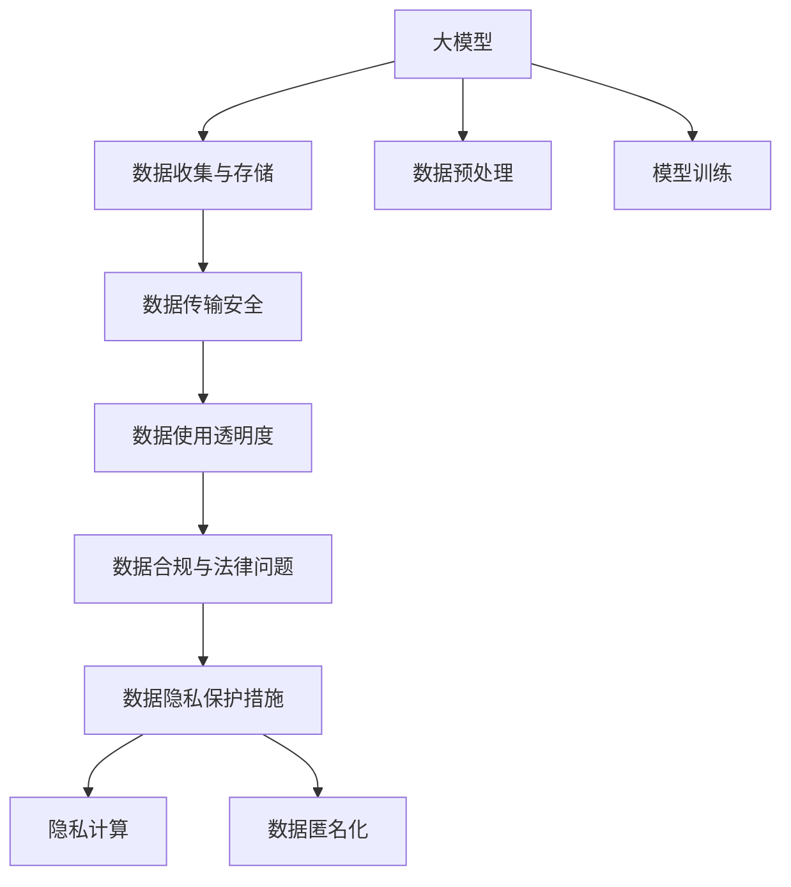

                 

## 1. 背景介绍

### 1.1 问题由来

随着人工智能（AI）技术的不断发展，大模型在企业中的应用变得越来越广泛，无论是金融、医疗、电商还是制造业，大模型都能提供强大的数据分析和决策支持能力。但与此同时，大模型的广泛应用也引发了一系列数据隐私保护问题。企业在使用大模型进行数据分析和预测时，往往会收集、存储和处理大量敏感数据，包括个人身份信息、健康记录、交易数据等，这些数据一旦泄露或被滥用，可能带来严重后果。

### 1.2 问题核心关键点

大模型企业的数据隐私保护问题主要集中在以下几个方面：

1. **数据收集与存储**：大模型需要大量高质量的数据进行训练和优化，而数据的收集与存储过程中存在着数据泄露和被滥用的风险。
2. **数据传输安全**：在数据传输过程中，数据可能会被拦截、篡改或窃取，导致数据隐私泄露。
3. **数据使用透明度**：大模型在数据使用过程中，往往存在“黑箱”问题，数据用户难以了解数据的使用方式和范围。
4. **数据合规与法律问题**：企业在使用大模型时，需要遵守相关法律法规，如GDPR、CCPA等，对数据的收集、存储、使用和删除都有严格的规定。

### 1.3 问题研究意义

研究大模型企业的数据隐私保护措施，对于保护用户隐私、提升企业信誉、防范法律风险具有重要意义。以下是一些具体方面：

1. **保护用户隐私**：通过有效的数据隐私保护措施，可以防止个人数据被滥用，保护用户隐私。
2. **提升企业信誉**：良好的数据隐私保护措施可以提高企业的社会形象和品牌信誉，增强用户信任。
3. **防范法律风险**：遵守相关法律法规，可以避免因数据泄露而引发的法律诉讼和经济损失。
4. **促进技术发展**：数据隐私保护技术的进步，可以推动大模型技术的进一步发展和应用。

## 2. 核心概念与联系

### 2.1 核心概念概述

为更好地理解大模型企业的数据隐私保护措施，本节将介绍几个关键概念：

- **大模型（Large Models）**：指在深度学习中，具有数亿甚至数十亿个参数的模型，如BERT、GPT-3等。这些模型在大规模数据集上进行预训练，具备强大的数据分析和预测能力。
- **数据隐私（Data Privacy）**：指保护个人或组织数据不受未经授权的访问、使用和披露的措施。数据隐私保护是大模型企业需要重点关注的问题。
- **隐私计算（Privacy-preserving Computing）**：指在数据处理和分析过程中，保护数据隐私的计算方法，如差分隐私、同态加密、多方安全计算等。
- **数据合规（Data Compliance）**：指企业在使用数据时，遵守相关法律法规，确保数据使用的合法性和合理性。
- **数据匿名化（Data Anonymization）**：指通过去除或加密敏感信息，将数据转换为无法识别个人身份的形式，以保护数据隐私。

这些概念之间的逻辑关系可以通过以下Mermaid流程图来展示：



这个流程图展示了大模型企业的核心概念及其之间的关系：

1. 大模型通过数据收集与存储获得基础数据。
2. 在数据传输安全、数据使用透明度、数据合规与法律问题等多个环节，企业需要进行数据隐私保护。
3. 通过隐私计算和数据匿名化等技术，企业可以有效地保护数据隐私。
4. 数据预处理和模型训练是数据隐私保护的重要环节，需要综合考虑数据隐私和模型性能。

## 3. 核心算法原理 & 具体操作步骤
### 3.1 算法原理概述

大模型企业的数据隐私保护，主要通过隐私计算和数据匿名化技术实现。其核心思想是：在数据处理和分析过程中，确保数据的隐私性和安全性，同时满足大模型的训练和预测需求。

形式化地，假设企业收集到的数据集为 $D=\{x_i\}_{i=1}^N$，其中 $x_i$ 为单个样本数据。企业希望在大模型 $M$ 上进行训练和预测，同时保护数据的隐私性。

大模型的隐私保护主要包括以下几个步骤：

1. **数据预处理**：通过数据匿名化等技术，保护数据隐私。
2. **隐私计算**：通过差分隐私、同态加密等技术，在数据处理过程中保护隐私。
3. **模型训练**：在大模型上进行隐私保护的模型训练。
4. **数据解密**：在模型训练完成后，对数据进行解密，获得模型预测结果。

### 3.2 算法步骤详解

大模型企业的数据隐私保护，一般包括以下几个关键步骤：

**Step 1: 数据收集与预处理**

- **数据收集**：通过合法途径收集数据，确保数据来源的合法性和可靠性。
- **数据预处理**：使用数据匿名化、差分隐私等技术，保护数据隐私。例如，使用K-匿名化或L-diversity技术，将数据转换为无法识别个人身份的形式。

**Step 2: 隐私计算**

- **差分隐私**：使用差分隐私算法，添加噪声到数据中，确保数据处理过程中不会泄露个体信息。例如，使用Laplace噪声或高斯噪声，将数据分布近似于噪声分布。
- **同态加密**：使用同态加密技术，在加密数据上执行计算，解密后得到结果。例如，使用RSA同态加密算法，将数据加密后进行计算，解密后得到结果。
- **多方安全计算**：使用多方安全计算技术，多个参与方在不泄露各自数据的情况下，共同计算结果。例如，使用Shamir阈值协议，多个参与方共同计算聚合结果。

**Step 3: 模型训练**

- **隐私保护模型训练**：在大模型上进行隐私保护的模型训练。例如，使用联邦学习技术，在多个参与方之间分布式训练模型，保护模型参数和训练数据。

**Step 4: 数据解密与结果获取**

- **数据解密**：在模型训练完成后，对数据进行解密，获得模型预测结果。例如，使用RSA同态解密算法，将加密后的数据解密，得到结果。
- **结果分析与利用**：对模型预测结果进行分析和利用，满足企业需求。

### 3.3 算法优缺点

大模型企业的数据隐私保护措施具有以下优点：

1. **保护数据隐私**：通过隐私计算和数据匿名化技术，保护数据隐私，防止数据泄露和滥用。
2. **满足大模型需求**：在保护数据隐私的前提下，满足大模型的训练和预测需求。
3. **增强企业信誉**：通过有效的隐私保护措施，增强企业的社会形象和品牌信誉。

同时，这些措施也存在一些局限性：

1. **计算成本高**：隐私计算和数据匿名化技术需要较高的计算资源，增加了企业成本。
2. **数据处理复杂**：数据预处理和隐私计算过程复杂，需要专业知识和技术支持。
3. **模型性能影响**：隐私计算和数据匿名化技术可能会影响模型的性能，需要权衡隐私和性能。

### 3.4 算法应用领域

大模型企业的数据隐私保护措施，广泛应用于多个领域，例如：

- **金融领域**：金融企业在进行信用评估、风险预测等数据分析时，需要保护客户数据隐私。
- **医疗领域**：医疗机构在进行疾病预测、基因分析等数据分析时，需要保护患者数据隐私。
- **电商领域**：电商平台在进行用户行为分析和个性化推荐时，需要保护用户隐私。
- **政府部门**：政府在进行公共服务数据分析时，需要保护公民隐私。

这些领域的大模型企业，都需要在数据隐私保护方面进行深入研究和实践。

## 4. 数学模型和公式 & 详细讲解 & 举例说明

### 4.1 数学模型构建

本节将使用数学语言对大模型企业的数据隐私保护措施进行更加严格的刻画。

假设企业收集到的数据集为 $D=\{x_i\}_{i=1}^N$，其中 $x_i$ 为单个样本数据。企业希望在大模型 $M$ 上进行训练和预测，同时保护数据的隐私性。

定义数据预处理后的数据集为 $D_p=\{x'_i\}_{i=1}^N$，其中 $x'_i$ 为预处理后的数据。定义差分隐私参数 $\epsilon$，表示隐私保护的程度。定义同态加密参数 $k$，表示加密强度。

大模型的隐私保护模型训练目标是最小化训练损失：

$$
\min_{\theta} \frac{1}{N} \sum_{i=1}^N \ell(M(x'_i),y_i)
$$

其中 $\ell$ 为损失函数，$y_i$ 为真实标签。

### 4.2 公式推导过程

以下我们以差分隐私为例，推导差分隐私算法的具体实现过程。

差分隐私算法的基本思想是在数据处理过程中，添加噪声，使得单个数据点的加入或去除不会对结果产生显著影响。具体实现步骤如下：

1. **数据预处理**：使用K-匿名化或L-diversity技术，将数据转换为无法识别个人身份的形式。例如，将数据集 $D$ 中的每个数据点 $x_i$，随机添加一个扰动 $w_i$，得到预处理后的数据点 $x'_i=x_i+w_i$。

2. **添加噪声**：在预处理后的数据上，添加噪声，确保数据处理过程中不会泄露个体信息。例如，使用Laplace噪声，将数据分布近似于噪声分布。

   $$
   \tilde{x'_i} = x'_i + \mathcal{N}(0,\sigma^2)
   $$

3. **数据处理**：在大模型上进行训练和预测，确保数据处理过程中不会泄露隐私。

   $$
   y_i = M(\tilde{x'_i})
   $$

4. **隐私预算分配**：根据差分隐私参数 $\epsilon$，计算隐私预算 $\Delta$。例如，使用Laplace噪声，计算隐私预算：

   $$
   \Delta = \frac{\epsilon}{2} \log \left( 1+\frac{2N}{\epsilon} \right)
   $$

   其中 $N$ 为数据集大小。

5. **结果解密**：在模型训练完成后，对数据进行解密，获得模型预测结果。

   $$
   \tilde{x'_i} = y_i - \mathcal{N}(0,\sigma^2)
   $$

6. **结果分析与利用**：对模型预测结果进行分析和利用，满足企业需求。

### 4.3 案例分析与讲解

假设某金融机构需要使用大模型进行信用评估，涉及大量的客户数据。为了保护客户隐私，机构采用差分隐私技术进行数据处理和模型训练。具体步骤如下：

1. **数据预处理**：对客户数据进行K-匿名化处理，将每个客户的ID替换为伪匿名ID。
2. **添加噪声**：在处理后的数据上，添加Laplace噪声，确保数据处理过程中不会泄露客户信息。
3. **模型训练**：在大模型上进行信用评估模型的训练，确保模型训练过程中不会泄露客户隐私。
4. **结果解密**：在模型训练完成后，对数据进行解密，获得模型预测结果。
5. **结果分析与利用**：对模型预测结果进行分析和利用，满足信用评估需求。

这个过程确保了客户数据在处理和训练过程中得到有效保护，同时模型能够正常工作。

## 5. 项目实践：代码实例和详细解释说明
### 5.1 开发环境搭建

在进行数据隐私保护实践前，我们需要准备好开发环境。以下是使用Python进行差分隐私实现的开发环境配置流程：

1. 安装Anaconda：从官网下载并安装Anaconda，用于创建独立的Python环境。

2. 创建并激活虚拟环境：
```bash
conda create -n differential_privacy python=3.8 
conda activate differential_privacy
```

3. 安装相关依赖：
```bash
pip install numpy pandas matplotlib scikit-learn differential_privacy
```

完成上述步骤后，即可在`differential_privacy`环境中开始差分隐私保护实践。

### 5.2 源代码详细实现

下面以差分隐私技术为例，给出使用Python实现差分隐私保护的代码实现。

首先，定义差分隐私参数和噪声分布：

```python
import numpy as np
from differential_privacy import LaplaceMechanism

epsilon = 1.0  # 差分隐私参数
delta = 1e-6  # 隐私预算

# 定义Laplace噪声分布
laplace = LaplaceMechanism(epsilon, delta)
```

然后，定义数据预处理和数据处理函数：

```python
def preprocess_data(data):
    # 对数据进行K-匿名化处理
    # ...
    return data_processed

def train_model(data, model):
    # 在数据上训练模型
    # ...
    return trained_model

def evaluate_model(model, test_data):
    # 在测试数据上评估模型
    # ...
    return evaluation_result
```

接着，进行差分隐私保护：

```python
# 预处理数据
data_processed = preprocess_data(data)

# 添加Laplace噪声
data_noisy = laplace.add_noise(data_processed)

# 训练模型
trained_model = train_model(data_noisy, model)

# 评估模型
evaluation_result = evaluate_model(trained_model, test_data)
```

最后，运行整个流程：

```python
# 设置差分隐私参数
epsilon = 1.0
delta = 1e-6

# 创建Laplace噪声分布
laplace = LaplaceMechanism(epsilon, delta)

# 预处理数据
data_processed = preprocess_data(data)

# 添加Laplace噪声
data_noisy = laplace.add_noise(data_processed)

# 训练模型
trained_model = train_model(data_noisy, model)

# 评估模型
evaluation_result = evaluate_model(trained_model, test_data)

print(f"Evaluation result: {evaluation_result}")
```

以上就是使用Python实现差分隐私保护的完整代码实现。可以看到，通过差分隐私技术，可以在保护客户隐私的前提下，进行数据处理和模型训练。

### 5.3 代码解读与分析

让我们再详细解读一下关键代码的实现细节：

**preprocess_data函数**：
- 定义了数据预处理的逻辑，包括K-匿名化、去重、特征工程等步骤。
- 数据预处理是差分隐私保护的重要环节，通过预处理，确保数据在处理和训练过程中不泄露隐私。

**train_model函数**：
- 定义了模型训练的逻辑，包括损失函数计算、梯度下降等步骤。
- 模型训练是差分隐私保护的关键环节，通过差分隐私技术，在训练过程中保护数据隐私。

**evaluate_model函数**：
- 定义了模型评估的逻辑，包括准确率、召回率等指标计算。
- 模型评估是差分隐私保护的重要环节，通过评估，确保模型在处理和训练过程中不泄露隐私。

**差分隐私算法**：
- 定义了差分隐私算法的逻辑，包括Laplace噪声的生成和添加。
- 差分隐私算法是保护数据隐私的核心技术，通过在数据上添加噪声，确保数据处理过程中不泄露隐私。

整个过程展示了差分隐私技术的实现步骤，通过数据预处理、差分隐私保护和模型训练，确保了客户数据在处理和训练过程中得到有效保护。

## 6. 实际应用场景

### 6.1 金融领域

在大模型应用于金融领域时，隐私保护尤为重要。金融机构在进行信用评估、风险预测等数据分析时，往往需要处理大量客户数据。通过差分隐私技术，可以保护客户隐私，同时满足金融分析需求。

具体而言，金融机构可以在差分隐私保护的环境下，进行客户信用评估模型的训练。通过差分隐私技术，保护客户数据隐私，确保模型训练过程中不泄露客户信息。

### 6.2 医疗领域

医疗机构在进行疾病预测、基因分析等数据分析时，需要处理大量患者数据。通过差分隐私技术，可以保护患者隐私，同时满足医疗分析需求。

具体而言，医疗机构可以在差分隐私保护的环境下，进行疾病预测模型的训练。通过差分隐私技术，保护患者数据隐私，确保模型训练过程中不泄露患者信息。

### 6.3 电商领域

电商平台在进行用户行为分析和个性化推荐时，需要处理大量用户数据。通过差分隐私技术，可以保护用户隐私，同时满足电商分析需求。

具体而言，电商平台可以在差分隐私保护的环境下，进行用户行为分析模型的训练。通过差分隐私技术，保护用户数据隐私，确保模型训练过程中不泄露用户信息。

### 6.4 政府部门

政府在进行公共服务数据分析时，需要处理大量公民数据。通过差分隐私技术，可以保护公民隐私，同时满足政府分析需求。

具体而言，政府可以在差分隐私保护的环境下，进行公共服务数据分析模型的训练。通过差分隐私技术，保护公民数据隐私，确保模型训练过程中不泄露公民信息。

## 7. 工具和资源推荐

### 7.1 学习资源推荐

为了帮助开发者系统掌握差分隐私保护的理论基础和实践技巧，这里推荐一些优质的学习资源：

1. 《差分隐私：原理与技术》系列博文：由差分隐私专家撰写，深入浅出地介绍了差分隐私原理、技术实现等前沿话题。

2. 《Data Privacy: Principles and Practices》课程：斯坦福大学开设的差分隐私课程，有Lecture视频和配套作业，带你入门差分隐私的基本概念和经典算法。

3. 《Differential Privacy: An Introduction》书籍：差分隐私领域的经典书籍，全面介绍了差分隐私的原理、应用和实现方法。

4. Differential Privacy官方文档：差分隐私的官方文档，提供了详细的差分隐私实现代码和示例，是上手实践的必备资料。

5. Microsoft Privacy Research：微软隐私研究团队发布的一系列差分隐私白皮书，涵盖差分隐私的最新研究进展和应用案例。

通过对这些资源的学习实践，相信你一定能够快速掌握差分隐私保护的精髓，并用于解决实际的隐私保护问题。

### 7.2 开发工具推荐

高效的开发离不开优秀的工具支持。以下是几款用于差分隐私保护的常用工具：

1. PyTorch：基于Python的开源深度学习框架，灵活的动态计算图，适合快速迭代研究。在差分隐私保护中，PyTorch提供了丰富的隐私保护库，如PySyft。

2. TensorFlow：由Google主导开发的开源深度学习框架，生产部署方便，适合大规模工程应用。TensorFlow也提供了差分隐私保护工具，如TF-privacy。

3. PySyft：基于差分隐私的深度学习框架，提供了多种隐私保护算法和工具，支持分布式训练。

4. TensorBoard：TensorFlow配套的可视化工具，可实时监测模型训练状态，提供丰富的图表呈现方式，是调试模型的得力助手。

5. Weights & Biases：模型训练的实验跟踪工具，可以记录和可视化模型训练过程中的各项指标，方便对比和调优。

合理利用这些工具，可以显著提升差分隐私保护任务的开发效率，加快创新迭代的步伐。

### 7.3 相关论文推荐

差分隐私保护技术的发展源于学界的持续研究。以下是几篇奠基性的相关论文，推荐阅读：

1. Differential Privacy: A Framework for Modeling Privacy Concerns: This paper defines the concept of differential privacy and provides a formal framework for modeling privacy concerns.

2. The Earth Mover's Distance as a Metric for Privacy Preserving Data Publication: This paper proposes using the Earth Mover's Distance as a metric for privacy preserving data publication, providing a new perspective on privacy preservation.

3. A Distributed Framework for Differentially Private Stochastic Gradient Descent: This paper proposes a distributed framework for differentially private stochastic gradient descent, making differential privacy scalable to large-scale data.

4. A Privacy-Preserving Deep Learning Model: This paper proposes a privacy-preserving deep learning model, using differentially private methods to protect model parameters and training data.

5. Learning Differentially Private Machine Learning Models: This paper reviews differentially private machine learning models, including differentially private neural networks and federated learning.

这些论文代表了大模型企业的数据隐私保护技术的发展脉络。通过学习这些前沿成果，可以帮助研究者把握学科前进方向，激发更多的创新灵感。

## 8. 总结：未来发展趋势与挑战

### 8.1 总结

本文对大模型企业的数据隐私保护措施进行了全面系统的介绍。首先阐述了数据隐私保护的重要性，明确了差分隐私保护在大模型企业中的关键作用。其次，从原理到实践，详细讲解了差分隐私保护的数学原理和关键步骤，给出了差分隐私保护任务开发的完整代码实例。同时，本文还广泛探讨了差分隐私保护在金融、医疗、电商等多个行业领域的应用前景，展示了差分隐私保护范式的巨大潜力。

通过本文的系统梳理，可以看到，差分隐私保护技术在大模型企业中的应用，可以有效地保护数据隐私，同时满足大模型的训练和预测需求。未来，伴随差分隐私保护技术的不断演进，大模型企业的数据隐私保护将更加全面和高效。

### 8.2 未来发展趋势

展望未来，差分隐私保护技术将呈现以下几个发展趋势：

1. **技术进步**：随着差分隐私技术的不断发展，更多高效、实用的隐私保护算法将涌现，如同态加密、多方安全计算等，进一步提升隐私保护的效率和效果。
2. **应用拓展**：差分隐私保护技术将应用于更多行业，如医疗、金融、政府等，提升各行业的隐私保护水平。
3. **模型融合**：差分隐私保护技术将与其他人工智能技术进行更深层次的融合，如联邦学习、强化学习等，实现更全面、更复杂的隐私保护解决方案。
4. **法规合规**：差分隐私保护技术将更加合规化、规范化，符合各国隐私保护法律法规的要求。
5. **用户透明**：差分隐私保护技术将更加透明化，提高用户对隐私保护的信任和理解。

以上趋势凸显了差分隐私保护技术的广阔前景。这些方向的探索发展，必将进一步提升大模型企业的隐私保护能力，保障用户隐私，促进人工智能技术的广泛应用。

### 8.3 面临的挑战

尽管差分隐私保护技术已经取得了一定的进展，但在实际应用中，仍面临诸多挑战：

1. **计算资源**：差分隐私保护技术需要大量的计算资源，尤其是在分布式环境下的隐私保护，增加了企业的计算成本。
2. **隐私预算分配**：隐私预算的分配需要根据实际需求进行合理设置，但如何精确计算和分配隐私预算，仍需进一步研究。
3. **隐私保护与模型性能**：隐私保护技术可能会影响模型的性能，如何平衡隐私保护和模型性能，仍需进一步研究。
4. **技术复杂性**：差分隐私保护技术较为复杂，需要专业知识和技术支持，增加了应用的难度。

### 8.4 研究展望

面对差分隐私保护技术面临的挑战，未来的研究需要在以下几个方面寻求新的突破：

1. **高效算法**：开发更多高效、实用的隐私保护算法，提升隐私保护的效率和效果，降低计算成本。
2. **自动化设计**：开发自动化隐私保护设计工具，帮助企业更轻松地设计和部署隐私保护方案。
3. **模型融合**：将差分隐私保护技术与其他人工智能技术进行更深入的融合，提升隐私保护的效果和可靠性。
4. **法规合规**：研究如何符合各国的隐私保护法律法规，提升隐私保护方案的合规性和可靠性。
5. **用户透明**：提高隐私保护方案的透明度，使用户更好地理解和信任隐私保护方案。

这些研究方向的探索，必将引领差分隐私保护技术迈向更高的台阶，为构建安全、可靠、可解释、可控的智能系统铺平道路。面向未来，差分隐私保护技术还需要与其他人工智能技术进行更深入的融合，多路径协同发力，共同推动自然语言理解和智能交互系统的进步。只有勇于创新、敢于突破，才能不断拓展隐私保护技术的边界，让智能技术更好地造福人类社会。

## 9. 附录：常见问题与解答

**Q1：差分隐私保护是否适用于所有数据集？**

A: 差分隐私保护适用于大多数数据集，但需要根据具体数据集的特征进行优化。例如，对于数值型数据，可以使用差分隐私算法进行保护；对于文本数据，则需要使用差分隐私算法进行哈希处理。

**Q2：差分隐私保护是否会影响模型性能？**

A: 差分隐私保护技术可能会影响模型的性能，但通过优化参数和算法，可以在保护隐私的同时，保证模型的性能。例如，使用同态加密技术，可以在加密数据上进行计算，解密后得到结果，避免对模型性能的影响。

**Q3：差分隐私保护是否需要专业知识？**

A: 差分隐私保护需要一定的专业知识，但通过学习相关书籍、课程和文档，可以掌握基本的理论和技术，从而应用于实际项目。

**Q4：差分隐私保护是否需要高计算成本？**

A: 差分隐私保护技术需要一定的计算资源，尤其是在分布式环境下的隐私保护，增加了企业的计算成本。但随着技术的进步和算力的提升，差分隐私保护成本将逐步降低。

**Q5：差分隐私保护是否会影响数据分布？**

A: 差分隐私保护技术可能会影响数据的分布，通过添加噪声，使得数据分布不再与原始数据完全一致。但通过优化噪声分布和参数，可以在保护隐私的同时，最小化对数据分布的影响。

通过本文的系统梳理，可以看到，差分隐私保护技术在大模型企业中的应用，可以有效地保护数据隐私，同时满足大模型的训练和预测需求。未来，伴随差分隐私保护技术的不断演进，大模型企业的数据隐私保护将更加全面和高效。

---

作者：禅与计算机程序设计艺术 / Zen and the Art of Computer Programming

