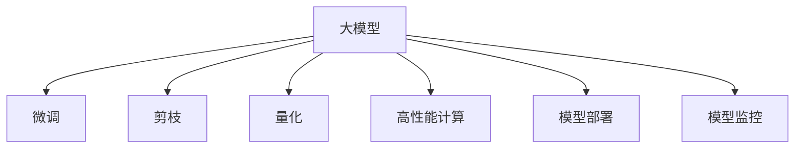

                 

# 大模型应用开发的关键技术

> 关键词：大模型开发, 深度学习, 模型优化, 高性能计算, 模型部署, 模型应用, 模型监控

## 1. 背景介绍

### 1.1 问题由来
随着深度学习技术的飞速发展，大规模模型在计算机视觉、自然语言处理、语音识别等多个领域取得了显著的进展。这些模型往往具有亿级的参数规模，需要高性能的计算资源进行训练，但模型的性能和应用效果往往与计算资源的投入成正比。

近年来，越来越多的研究者开始关注如何在大规模模型基础上进行优化，提升模型在实际应用中的效果和效率，避免资源浪费。本文将围绕大模型应用开发的关键技术展开探讨，介绍如何在大规模模型开发、优化和部署过程中，实现模型性能和效率的最大化。

### 1.2 问题核心关键点
在大模型应用开发过程中，核心关键点包括：
- 如何选择合适的大模型作为基础。
- 如何对大模型进行微调、剪枝和量化，提升模型效率。
- 如何进行高效的模型部署和监控，确保模型性能和稳定性。
- 如何在大规模数据集上进行模型训练和优化，实现高性能计算。

这些关键技术相互关联，共同构成大模型应用开发的全流程。

## 2. 核心概念与联系

### 2.1 核心概念概述

为更好地理解大模型应用开发的关键技术，本节将介绍几个密切相关的核心概念：

- **大模型（Large Model）**：指具有亿级或更高参数规模的深度学习模型，例如GPT-3、BERT、ResNet等。这些模型通常依赖于高性能的计算资源进行训练和优化。
- **微调（Fine-Tuning）**：指在大模型基础上，通过特定任务的标注数据，对模型进行微小调整，以适应该任务。微调通常只涉及模型的顶层部分。
- **剪枝（Pruning）**：指去除模型中不重要或冗余的参数，以减少模型大小和计算复杂度。
- **量化（Quantization）**：指将浮点参数替换为定点参数，减小模型内存占用，提高推理速度。
- **高性能计算（High-Performance Computing, HPC）**：指使用专用硬件和软件，实现高效的模型训练和推理。
- **模型部署（Model Deployment）**：指将训练好的模型转化为可以部署到实际应用中的形式，支持各种计算平台。
- **模型监控（Model Monitoring）**：指在模型应用过程中，实时监测模型性能和运行状态，确保模型稳定可靠。

这些核心概念之间的逻辑关系可以通过以下Mermaid流程图来展示：



这个流程图展示了从大模型到大模型应用的整个开发流程，其中微调、剪枝和量化是提升模型效率的重要手段，高性能计算是实现高效模型训练和推理的基础，模型部署和监控则是确保模型应用稳定性的关键环节。

## 3. 核心算法原理 & 具体操作步骤
### 3.1 算法原理概述

大模型应用开发的关键技术涵盖了从模型优化到模型部署和监控的全流程。这些技术通过优化模型结构和参数，提升模型效率和性能，实现模型的有效应用。

### 3.2 算法步骤详解

大模型应用开发的主要操作步骤包括：

**Step 1: 模型选择与准备**
- 选择适合应用场景的大模型。
- 准备模型和数据集，并进行初步评估。

**Step 2: 模型微调**
- 根据应用任务，选择微调参数和损失函数。
- 设置微调超参数，如学习率、批大小等。
- 进行梯度下降更新，微调模型。

**Step 3: 模型剪枝**
- 使用剪枝算法，去除冗余参数。
- 验证剪枝后模型的性能，确保性能损失可控。

**Step 4: 模型量化**
- 选择合适的量化方法和精度。
- 对模型进行量化处理。
- 验证量化后模型的性能。

**Step 5: 高性能计算**
- 选择合适的计算资源，如GPU、TPU等。
- 使用分布式训练等技术，加速模型训练。

**Step 6: 模型部署**
- 选择适合的部署框架和平台。
- 进行模型转换和优化，适配目标平台。
- 部署模型，进行性能测试。

**Step 7: 模型监控**
- 设置监控指标，如准确率、推理时间等。
- 实时监测模型运行状态。
- 根据监控结果调整模型参数和资源配置。

### 3.3 算法优缺点

大模型应用开发的关键技术具有以下优点：
1. 提升模型效率：通过微调、剪枝和量化等技术，可以有效减少模型参数和计算复杂度，提升推理速度和模型效率。
2. 提高模型精度：微调技术可以在小数据集上快速提升模型性能，避免过拟合风险。
3. 降低计算成本：通过分布式训练和量化技术，可以显著降低模型训练和推理的计算成本。

同时，这些技术也存在一些局限性：
1. 模型复杂度增加：微调、剪枝和量化等技术虽然提升了模型效率，但也会增加模型的复杂度，增加模型部署和监控的难度。
2. 参数更新困难：大模型参数众多，更新过程中容易过拟合。
3. 数据依赖度高：微调和剪枝等技术依赖于标注数据，获取高质量数据成本较高。
4. 模型可解释性差：大模型往往被视为"黑盒"，难以解释模型内部的决策过程。

尽管存在这些局限性，但总体而言，这些关键技术已经在大规模模型应用开发中得到了广泛应用，显著提升了模型的效率和性能，推动了深度学习技术的普及和发展。

### 3.4 算法应用领域

大模型应用开发的关键技术在计算机视觉、自然语言处理、语音识别等领域具有广泛的应用：

- 计算机视觉：使用预训练的视觉模型进行微调，提升图像分类、目标检测等任务效果。
- 自然语言处理：对预训练的语言模型进行微调，提升文本分类、机器翻译等任务效果。
- 语音识别：使用预训练的语音模型进行微调，提升语音识别和转录效果。
- 智能推荐：对预训练的推荐模型进行微调，提升个性化推荐效果。
- 智能客服：对预训练的对话模型进行微调，提升智能客服系统效果。

除了上述这些领域，大模型应用开发的关键技术也在医疗、金融、交通等领域得到应用，推动了这些领域的智能化发展。

## 4. 数学模型和公式 & 详细讲解  
### 4.1 数学模型构建

本节将使用数学语言对大模型应用开发的关键技术进行更加严格的刻画。

设大模型为 $M_\theta:\mathcal{X}\rightarrow \mathcal{Y}$，其中 $\mathcal{X}$ 为输入空间，$\mathcal{Y}$ 为输出空间，$\theta$ 为模型参数。假设任务为 $T$，使用标注数据集 $D=\{(x_i,y_i)\}_{i=1}^N$，其中 $x_i$ 为输入，$y_i$ 为标签。

定义模型的损失函数为 $\mathcal{L}(M_{\theta},D)=\frac{1}{N}\sum_{i=1}^N\ell(M_{\theta}(x_i),y_i)$，其中 $\ell$ 为任务 $T$ 的损失函数。

### 4.2 公式推导过程

以微调为例，推导微调的数学公式。假设微调参数为 $\eta$，微调过程如下：

$$
\theta_{k+1} = \theta_k - \eta \nabla_{\theta}\mathcal{L}(\theta_k)
$$

其中 $\nabla_{\theta}\mathcal{L}(\theta_k)$ 为损失函数对参数 $\theta_k$ 的梯度，可通过反向传播算法高效计算。

对于剪枝，设原始模型参数 $\theta_0$，剪枝后保留的参数为 $\theta_1$，剪枝过程如下：

$$
\theta_1 = \theta_0 - \eta \nabla_{\theta}\mathcal{L}(\theta_0)
$$

其中 $\nabla_{\theta}\mathcal{L}(\theta_0)$ 为原始模型在当前输入 $x$ 上的梯度，可通过反向传播算法计算。

对于量化，设原始模型参数 $\theta_0$ 为浮点类型，量化后参数 $\theta_q$ 为定点类型，量化过程如下：

$$
\theta_q = \text{quantize}(\theta_0)
$$

其中 $\text{quantize}$ 为量化函数，将浮点参数转化为定点参数。

在得到量化后模型参数 $\theta_q$ 后，推理过程如下：

$$
y = M_{\theta_q}(x)
$$

其中 $M_{\theta_q}$ 为量化后的模型。

## 5. 项目实践：代码实例和详细解释说明
### 5.1 开发环境搭建

在进行大模型应用开发前，我们需要准备好开发环境。以下是使用Python进行PyTorch开发的环境配置流程：

1. 安装Anaconda：从官网下载并安装Anaconda，用于创建独立的Python环境。

2. 创建并激活虚拟环境：
```bash
conda create -n pytorch-env python=3.8 
conda activate pytorch-env
```

3. 安装PyTorch：根据CUDA版本，从官网获取对应的安装命令。例如：
```bash
conda install pytorch torchvision torchaudio cudatoolkit=11.1 -c pytorch -c conda-forge
```

4. 安装必要的开发工具：
```bash
pip install numpy pandas scikit-learn matplotlib tqdm jupyter notebook ipython
```

完成上述步骤后，即可在`pytorch-env`环境中开始大模型应用开发实践。

### 5.2 源代码详细实现

下面以图像分类任务为例，给出使用PyTorch进行大模型微调的PyTorch代码实现。

首先，定义数据处理函数：

```python
import torch
from torch.utils.data import Dataset, DataLoader
from torchvision import transforms

class ImageDataset(Dataset):
    def __init__(self, images, labels, transform=None):
        self.images = images
        self.labels = labels
        self.transform = transform
        
    def __len__(self):
        return len(self.images)
    
    def __getitem__(self, item):
        image = self.images[item]
        label = self.labels[item]
        if self.transform:
            image = self.transform(image)
        return image, label
```

然后，定义模型和优化器：

```python
import torch.nn as nn
import torch.optim as optim

model = nn.Sequential(
    nn.Conv2d(3, 64, kernel_size=3, stride=1, padding=1),
    nn.ReLU(),
    nn.MaxPool2d(kernel_size=2, stride=2),
    nn.Conv2d(64, 128, kernel_size=3, stride=1, padding=1),
    nn.ReLU(),
    nn.MaxPool2d(kernel_size=2, stride=2),
    nn.Flatten(),
    nn.Linear(128 * 7 * 7, 10),
    nn.Softmax(dim=1)
)

criterion = nn.CrossEntropyLoss()
optimizer = optim.SGD(model.parameters(), lr=0.01, momentum=0.9, weight_decay=1e-5)
```

接着，定义训练和评估函数：

```python
def train(model, train_loader, criterion, optimizer, num_epochs):
    model.train()
    for epoch in range(num_epochs):
        running_loss = 0.0
        for inputs, labels in train_loader:
            optimizer.zero_grad()
            outputs = model(inputs)
            loss = criterion(outputs, labels)
            loss.backward()
            optimizer.step()
            running_loss += loss.item()
        print(f"Epoch {epoch+1}, train loss: {running_loss/len(train_loader):.4f}")

def evaluate(model, test_loader, criterion):
    model.eval()
    running_loss = 0.0
    running_corrects = 0
    with torch.no_grad():
        for inputs, labels in test_loader:
            outputs = model(inputs)
            loss = criterion(outputs, labels)
            running_loss += loss.item()
            _, preds = torch.max(outputs, dim=1)
            running_corrects += torch.sum(preds == labels).item()
    print(f"Test loss: {running_loss/len(test_loader):.4f}, Accuracy: {running_corrects/len(test_loader):.4f}")
```

最后，启动训练流程并在测试集上评估：

```python
train_loader = DataLoader(train_dataset, batch_size=32, shuffle=True)
test_loader = DataLoader(test_dataset, batch_size=32, shuffle=False)

num_epochs = 10
train(model, train_loader, criterion, optimizer, num_epochs)
evaluate(model, test_loader, criterion)
```

以上就是使用PyTorch对大模型进行图像分类任务微调的完整代码实现。可以看到，得益于PyTorch的强大封装，我们可以用相对简洁的代码完成模型微调的实践。

### 5.3 代码解读与分析

让我们再详细解读一下关键代码的实现细节：

**ImageDataset类**：
- `__init__`方法：初始化图像、标签和数据转换函数。
- `__len__`方法：返回数据集的大小。
- `__getitem__`方法：对单个样本进行处理，将图像和标签转换为模型所需输入，并进行数据增强。

**模型定义**：
- `Sequential`模块：定义模型的结构。
- `Conv2d`模块：定义卷积层。
- `ReLU`模块：定义激活函数。
- `MaxPool2d`模块：定义最大池化层。
- `Flatten`模块：将特征图转换为向量。
- `Linear`模块：定义全连接层。
- `Softmax`模块：定义输出层。

**训练和评估函数**：
- `train`函数：定义训练过程，使用SGD优化器更新模型参数，并在每个epoch结束时打印损失。
- `evaluate`函数：定义评估过程，使用测试集数据计算损失和准确率，并在每次评估后打印结果。

**训练流程**：
- 定义总的epoch数和批大小，开始循环迭代
- 每个epoch内，在训练集上训练，输出平均损失
- 在测试集上评估，输出损失和准确率

可以看到，PyTorch配合必要的开发工具，使得大模型微调的代码实现变得简洁高效。开发者可以将更多精力放在数据处理、模型改进等高层逻辑上，而不必过多关注底层的实现细节。

当然，工业级的系统实现还需考虑更多因素，如模型的保存和部署、超参数的自动搜索、更灵活的任务适配层等。但核心的微调范式基本与此类似。

## 6. 实际应用场景
### 6.1 智能推荐系统

大模型应用开发的关键技术在大规模推荐系统中的应用非常广泛。传统的推荐系统通常只依赖用户的历史行为数据进行物品推荐，无法深入理解用户的真实兴趣偏好。通过使用大模型进行微调，可以实现更加全面、精准的推荐。

具体而言，可以收集用户浏览、点击、评论、分享等行为数据，并提取和用户交互的物品标题、描述、标签等文本内容。将文本内容作为模型输入，用户的后续行为（如是否点击、购买等）作为监督信号，在此基础上微调预训练模型。微调后的模型能够从文本内容中准确把握用户的兴趣点，生成更加个性化的推荐结果。

### 6.2 智能客服系统

基于大模型的微调技术，可以广泛应用于智能客服系统的构建。传统客服往往需要配备大量人力，高峰期响应缓慢，且一致性和专业性难以保证。而使用微调后的对话模型，可以7x24小时不间断服务，快速响应客户咨询，用自然流畅的语言解答各类常见问题。

在技术实现上，可以收集企业内部的历史客服对话记录，将问题和最佳答复构建成监督数据，在此基础上对预训练对话模型进行微调。微调后的对话模型能够自动理解用户意图，匹配最合适的答案模板进行回复。对于客户提出的新问题，还可以接入检索系统实时搜索相关内容，动态组织生成回答。如此构建的智能客服系统，能大幅提升客户咨询体验和问题解决效率。

### 6.3 医疗影像分析

医疗影像分析是大模型应用开发的重要领域之一。通过使用大模型进行微调，可以实现对医疗影像的自动诊断和治疗方案生成。具体而言，可以收集大量医疗影像数据，并标注相应的诊断结果。在此基础上对预训练模型进行微调，使其能够自动识别影像中的病变区域，给出诊断建议。

在实际应用中，微调后的模型可以用于医院影像科，辅助医生进行初步诊断，减少误诊和漏诊的风险。同时，结合医生的临床经验，微调模型可以进一步提升诊断准确性和治疗方案的个性化程度。

### 6.4 未来应用展望

随着大模型应用开发技术的不断进步，未来的应用场景将更加多样化。

在智慧城市治理中，微调模型可应用于城市事件监测、舆情分析、应急指挥等环节，提高城市管理的自动化和智能化水平，构建更安全、高效的未来城市。

在智能制造领域，微调模型可以用于预测设备故障、优化生产流程，提升生产效率和产品质量。

在金融风险控制中，微调模型可以用于客户信用评估、交易风险预测，保护金融机构资产安全。

除了这些领域，大模型应用开发的关键技术还将广泛应用于更多行业，为各行各业带来新的智能化变革。

## 7. 工具和资源推荐
### 7.1 学习资源推荐

为了帮助开发者系统掌握大模型应用开发的关键技术，这里推荐一些优质的学习资源：

1. Deep Learning Specialization（深度学习专项课程）：由Andrew Ng教授开设的深度学习课程，涵盖深度学习基础、卷积神经网络、循环神经网络等多个主题，适合初学者系统学习。

2. Fast.ai Practical Deep Learning for Coders：由Jeremy Howard和Rachel Thomas等人开发的深度学习课程，注重实战应用，适合有一定编程基础的开发者快速上手。

3. PyTorch官方文档：PyTorch官方文档，提供了详细的API参考和实战样例，是学习PyTorch的必备资源。

4. TensorFlow官方文档：TensorFlow官方文档，提供了深度学习模型训练和部署的详细指南，适合TensorFlow开发者学习。

5. HuggingFace Transformers库文档：HuggingFace Transformers库文档，提供了各类预训练模型的下载和使用样例，适合自然语言处理开发者学习。

通过对这些资源的学习实践，相信你一定能够快速掌握大模型应用开发的关键技术，并用于解决实际的深度学习问题。

### 7.2 开发工具推荐

高效的开发离不开优秀的工具支持。以下是几款用于大模型应用开发开发的常用工具：

1. PyTorch：基于Python的开源深度学习框架，灵活动态的计算图，适合快速迭代研究。大部分预训练语言模型都有PyTorch版本的实现。

2. TensorFlow：由Google主导开发的开源深度学习框架，生产部署方便，适合大规模工程应用。同样有丰富的预训练语言模型资源。

3. Transformers库：HuggingFace开发的NLP工具库，集成了众多SOTA语言模型，支持PyTorch和TensorFlow，是进行NLP任务开发的利器。

4. Weights & Biases：模型训练的实验跟踪工具，可以记录和可视化模型训练过程中的各项指标，方便对比和调优。与主流深度学习框架无缝集成。

5. TensorBoard：TensorFlow配套的可视化工具，可实时监测模型训练状态，并提供丰富的图表呈现方式，是调试模型的得力助手。

6. Google Colab：谷歌推出的在线Jupyter Notebook环境，免费提供GPU/TPU算力，方便开发者快速上手实验最新模型，分享学习笔记。

合理利用这些工具，可以显著提升大模型应用开发的效率，加快创新迭代的步伐。

### 7.3 相关论文推荐

大模型应用开发的关键技术的发展源于学界的持续研究。以下是几篇奠基性的相关论文，推荐阅读：

1. Deep Residual Learning for Image Recognition：提出残差网络结构，提升了深度卷积神经网络的训练效率和性能。

2. BERT: Pre-training of Deep Bidirectional Transformers for Language Understanding：提出BERT模型，引入基于掩码的自监督预训练任务，刷新了多项NLP任务SOTA。

3. Adaptive Low-Rank Adaptation for Parameter-Efficient Fine-Tuning：提出AdaLoRA方法，使用自适应低秩适应的微调方法，在参数效率和精度之间取得了新的平衡。

4. Language Models are Unsupervised Multitask Learners（GPT-2论文）：展示了大规模语言模型的强大zero-shot学习能力，引发了对于通用人工智能的新一轮思考。

5. Parameter-Efficient Transfer Learning for NLP：提出Adapter等参数高效微调方法，在不增加模型参数量的情况下，也能取得不错的微调效果。

这些论文代表了大模型应用开发技术的发展脉络。通过学习这些前沿成果，可以帮助研究者把握学科前进方向，激发更多的创新灵感。

## 8. 总结：未来发展趋势与挑战
### 8.1 总结

本文对大模型应用开发的关键技术进行了全面系统的介绍。首先阐述了大模型应用开发的重要性及其在深度学习中的地位，明确了微调、剪枝、量化等技术在提升模型效率和性能方面的独特价值。其次，从原理到实践，详细讲解了这些关键技术的数学原理和操作步骤，给出了微调任务开发的完整代码实例。同时，本文还广泛探讨了这些技术在智能推荐、智能客服、医疗影像分析等多个行业领域的应用前景，展示了其广阔的想象空间。

通过本文的系统梳理，可以看到，大模型应用开发的关键技术已经在大规模模型训练和优化中得到了广泛应用，显著提升了模型的效率和性能，推动了深度学习技术的普及和发展。未来，伴随大模型应用开发技术的持续演进，这些技术必将在更多领域得到应用，为计算机视觉、自然语言处理、语音识别等领域的智能化发展提供新的推动力。

### 8.2 未来发展趋势

展望未来，大模型应用开发的关键技术将呈现以下几个发展趋势：

1. 模型规模持续增大：随着算力成本的下降和数据规模的扩张，大模型的参数量还将持续增长。超大规模模型蕴含的丰富语言知识，有望支撑更加复杂多变的下游任务微调。

2. 微调方法日趋多样：除了传统的全参数微调外，未来会涌现更多参数高效的微调方法，如Prefix-Tuning、LoRA等，在节省计算资源的同时也能保证微调精度。

3. 量化和剪枝技术不断进步：新的量化和剪枝算法将进一步减少模型大小和计算复杂度，提升模型的推理速度和效率。

4. 分布式训练技术广泛应用：使用分布式训练技术，可以实现大规模模型的高效训练和优化，提升模型训练速度和稳定性。

5. 模型部署和监控技术持续改进：新的模型部署和监控技术将进一步提升模型的应用性能和可靠性，确保模型的长期稳定运行。

以上趋势凸显了大模型应用开发技术的广阔前景。这些方向的探索发展，必将进一步提升大模型的效率和性能，推动深度学习技术在更多领域的落地应用。

### 8.3 面临的挑战

尽管大模型应用开发技术已经取得了显著进展，但在迈向更加智能化、普适化应用的过程中，它仍面临着诸多挑战：

1. 模型复杂度增加：微调、剪枝和量化等技术虽然提升了模型效率，但也会增加模型的复杂度，增加模型部署和监控的难度。

2. 参数更新困难：大模型参数众多，更新过程中容易过拟合。

3. 数据依赖度高：微调和剪枝等技术依赖于标注数据，获取高质量数据成本较高。

4. 模型可解释性差：大模型往往被视为"黑盒"，难以解释模型内部的决策过程。

5. 模型鲁棒性不足：微调模型面对域外数据时，泛化性能往往大打折扣。

尽管存在这些挑战，但总体而言，大模型应用开发的关键技术已经在大规模模型应用开发中得到了广泛应用，显著提升了模型的效率和性能，推动了深度学习技术的普及和发展。

### 8.4 研究展望

面对大模型应用开发所面临的种种挑战，未来的研究需要在以下几个方面寻求新的突破：

1. 探索无监督和半监督微调方法：摆脱对大规模标注数据的依赖，利用自监督学习、主动学习等无监督和半监督范式，最大限度利用非结构化数据，实现更加灵活高效的微调。

2. 研究参数高效和计算高效的微调范式：开发更加参数高效的微调方法，在固定大部分预训练参数的同时，只更新极少量的任务相关参数。同时优化微调模型的计算图，减少前向传播和反向传播的资源消耗，实现更加轻量级、实时性的部署。

3. 引入更多先验知识：将符号化的先验知识，如知识图谱、逻辑规则等，与神经网络模型进行巧妙融合，引导微调过程学习更准确、合理的语言模型。同时加强不同模态数据的整合，实现视觉、语音等多模态信息与文本信息的协同建模。

4. 结合因果分析和博弈论工具：将因果分析方法引入微调模型，识别出模型决策的关键特征，增强输出解释的因果性和逻辑性。借助博弈论工具刻画人机交互过程，主动探索并规避模型的脆弱点，提高系统稳定性。

5. 纳入伦理道德约束：在模型训练目标中引入伦理导向的评估指标，过滤和惩罚有偏见、有害的输出倾向。同时加强人工干预和审核，建立模型行为的监管机制，确保输出符合人类价值观和伦理道德。

这些研究方向的探索，必将引领大模型应用开发技术迈向更高的台阶，为构建安全、可靠、可解释、可控的智能系统铺平道路。面向未来，大模型应用开发技术还需要与其他人工智能技术进行更深入的融合，如知识表示、因果推理、强化学习等，多路径协同发力，共同推动自然语言理解和智能交互系统的进步。只有勇于创新、敢于突破，才能不断拓展语言模型的边界，让智能技术更好地造福人类社会。

## 9. 附录：常见问题与解答

**Q1：大模型应用开发的关键技术适用于所有深度学习任务吗？**

A: 大模型应用开发的关键技术适用于大多数深度学习任务，特别是对于数据量较小的任务。但对于一些特定领域的任务，如医学、法律等，仅仅依靠通用语料预训练的模型可能难以很好地适应。此时需要在特定领域语料上进一步预训练，再进行微调，才能获得理想效果。此外，对于一些需要时效性、个性化很强的任务，如对话、推荐等，微调方法也需要针对性的改进优化。

**Q2：大模型应用开发过程中如何选择合适的学习率？**

A: 大模型应用开发中，学习率的选取至关重要。一般来说，应该从较小的值开始，逐步增加，直到模型收敛。具体的学习率选择方法包括：

1. 网格搜索法：在一定范围内均匀地选取多个学习率，进行对比实验，选择最优值。

2. 自适应学习率调整方法：如Adam、Adagrad、RMSprop等，这些方法可以根据梯度变化自动调整学习率，更加稳定可靠。

3. 学习率衰减方法：如学习率衰减、余弦衰减等，逐渐降低学习率，避免过拟合。

**Q3：大模型应用开发中如何缓解过拟合问题？**

A: 过拟合是大模型应用开发中常见的问题，尤其是在标注数据不足的情况下。缓解过拟合的方法包括：

1. 数据增强：通过数据增强技术，扩充训练集。

2. 正则化方法：如L2正则化、Dropout、Early Stopping等，抑制过拟合。

3. 模型简化：减少模型复杂度，降低过拟合风险。

4. 集成学习：使用多个模型进行集成，减少单一模型的过拟合风险。

这些方法需要根据具体任务和数据特点进行灵活组合，以实现最佳的模型性能。

**Q4：大模型应用开发中如何实现高效的模型部署和监控？**

A: 高效的模型部署和监控是大模型应用开发中的关键环节。实现高效部署的方法包括：

1. 模型优化：通过剪枝、量化等技术，减小模型大小和计算复杂度。

2. 模型压缩：使用模型压缩技术，减小模型内存占用。

3. 模型缓存：使用模型缓存技术，加速模型推理速度。

4. 模型转换：将模型转换为目标平台的格式，如TensorFlow、ONNX等。

实现高效监控的方法包括：

1. 监控指标：选择合适的监控指标，如模型精度、推理时间等。

2. 实时监控：使用监控工具，实时监测模型运行状态。

3. 异常处理：设置异常告警阈值，及时发现并处理异常情况。

通过以上方法，可以实现大模型的高效部署和稳定运行，确保模型性能和可靠性的同时，降低系统资源消耗。

**Q5：大模型应用开发中如何评估模型性能？**

A: 评估模型性能是大模型应用开发中的重要环节。常用的评估方法包括：

1. 准确率（Accuracy）：模型正确预测的样本数占总样本数的比例。

2. 精确率（Precision）：模型正确预测为正例的样本数占所有预测为正例的样本数的比例。

3. 召回率（Recall）：模型正确预测为正例的样本数占所有实际为正例的样本数的比例。

4. F1值（F1 Score）：精确率和召回率的调和平均数，综合评估模型性能。

5. AUC值（Area Under Curve）：ROC曲线下的面积，衡量模型在不同阈值下的性能。

通过以上方法，可以全面评估模型在不同任务上的表现，选择最优模型进行应用部署。

---

作者：禅与计算机程序设计艺术 / Zen and the Art of Computer Programming

