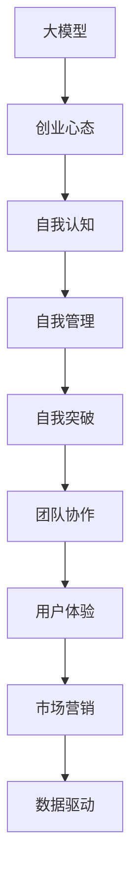

                 

# 大模型时代的创业者创业心态修炼秘诀：自我认知、自我管理与自我突破

> 关键词：
1. **自我认知**：理解自身优势与不足，明确创业方向与目标。
2. **自我管理**：高效规划时间、资源，掌握管理团队的能力。
3. **自我突破**：面对挑战，勇于创新，不断追求技术突破。
4. **团队协作**：建立高效的团队文化，提升团队凝聚力。
5. **用户体验**：以用户为中心，持续优化产品与服务。
6. **市场营销**：精准定位，精准投放，提升品牌影响力。
7. **数据驱动**：利用数据进行决策，提升创业效率。

## 1. 背景介绍

随着大模型的蓬勃发展，创业者面临的挑战和机遇并存。自我认知、自我管理与自我突破，是每一个在大模型时代希望成功的创业者必须修炼的核心素养。大模型时代的创业者需要具备广泛的知识视野，灵活应变的能力，以及长远的战略眼光。

### 1.1 问题由来
在大模型时代，创业环境的复杂性不断提升，市场竞争日益激烈。创业者不仅要面对技术创新的挑战，还需兼顾商业模式的创新和市场拓展。同时，大模型的广泛应用也为创业者提供了新的机遇，比如自动生成内容、个性化推荐、智能客服等。如何在大模型时代找到自己的定位，实现创业梦想，成为了每个创业者需要思考的问题。

### 1.2 问题核心关键点
在大模型时代，创业者的核心挑战和机遇主要包括：
1. **技术认知**：理解大模型的原理和应用场景。
2. **商业模式创新**：利用大模型创造新的商业模式。
3. **团队建设与管理**：构建高效的团队，并有效管理团队。
4. **市场拓展**：精准定位目标市场，有效拓展市场。
5. **数据驱动决策**：利用数据分析进行商业决策。

本文将系统性地探讨大模型时代的创业者如何修炼自我认知、自我管理和自我突破的能力，帮助创业者更好地应对挑战，抓住机遇，实现创业梦想。

## 2. 核心概念与联系

### 2.1 核心概念概述

在阐述具体方法之前，我们先明确一些核心概念，并理解它们之间的联系：

1. **大模型**：如BERT、GPT等预训练语言模型，具备处理大规模自然语言数据的能力，并能够进行多任务学习。
2. **创业心态**：创业者面对挑战时的心理素质，包括激情、韧性、开放性等。
3. **自我认知**：创业者对自己的认识，包括兴趣、技能、优势和不足。
4. **自我管理**：创业者如何规划自己的时间、资源和团队，提升效率。
5. **自我突破**：创业者在面对技术难题和市场挑战时，如何创新突破，不断进步。

这些概念之间存在相互影响和支撑的关系，理解它们之间的联系，对于构建成功的创业心态至关重要。

### 2.2 核心概念原理和架构的 Mermaid 流程图



这个图表展示了大模型与创业心态之间的联系。创业者通过理解大模型的原理和应用，进行自我认知，管理团队，突破技术难题，协作团队，提升用户体验，进行市场拓展，并利用数据驱动决策。

## 3. 核心算法原理 & 具体操作步骤

### 3.1 算法原理概述

在大模型时代，创业者需要理解和应用大模型的原理，并根据这些原理进行自我认知、自我管理和自我突破。具体而言，创业者需要：

1. **学习大模型技术**：理解大模型的训练流程、模型结构、应用场景等。
2. **分析市场趋势**：利用大模型分析市场数据，了解行业发展趋势。
3. **优化商业模式**：根据大模型的能力，创新商业模式。

### 3.2 算法步骤详解

**Step 1: 学习大模型基础**

创业者首先需要全面了解大模型的基础原理，包括模型架构、训练流程、优化方法等。可以通过以下方式进行学习：
1. **在线课程**：如Coursera、edX等平台上的深度学习课程。
2. **书籍**：如《深度学习》、《Transformers从原理到实践》等。
3. **论文**：阅读最新的大模型研究论文，掌握前沿技术。

**Step 2: 分析市场趋势**

利用大模型进行市场分析，可以更精准地把握市场趋势。具体步骤包括：
1. **数据收集**：收集市场数据，如用户反馈、竞争对手情况等。
2. **数据分析**：使用大模型进行文本分析，提取市场趋势和热点。
3. **决策支持**：根据分析结果，制定市场策略和决策。

**Step 3: 优化商业模式**

利用大模型的能力，创业者可以优化现有的商业模式，并探索新的商业模式。具体步骤包括：
1. **用户体验优化**：利用大模型进行用户行为分析，优化产品设计。
2. **个性化推荐**：利用大模型进行个性化推荐，提升用户体验。
3. **智能客服**：利用大模型开发智能客服系统，提升服务效率。

### 3.3 算法优缺点

**优点**：
1. **提升效率**：利用大模型分析数据，可以快速发现市场趋势，优化商业模式。
2. **降低成本**：减少了传统市场调研和商业分析的复杂度和成本。

**缺点**：
1. **数据隐私**：大模型需要大量的数据训练，涉及到用户隐私保护问题。
2. **技术门槛高**：大模型技术复杂，需要较高的技术门槛。

### 3.4 算法应用领域

大模型技术在多个领域都有应用，包括：
1. **金融科技**：利用大模型进行风险评估和投资决策。
2. **零售电商**：利用大模型进行商品推荐和个性化营销。
3. **医疗健康**：利用大模型进行疾病诊断和患者管理。

## 4. 数学模型和公式 & 详细讲解 & 举例说明

### 4.1 数学模型构建

大模型的训练过程可以用数学模型表示。假设大模型为 $M_{\theta}$，其中 $\theta$ 为模型的参数。训练目标为最小化损失函数 $\mathcal{L}(\theta)$。

$$
\mathcal{L}(\theta) = \frac{1}{N}\sum_{i=1}^N \ell(M_{\theta}(x_i), y_i)
$$

其中 $\ell$ 为损失函数，$x_i$ 为输入数据，$y_i$ 为标签。

### 4.2 公式推导过程

以BERT为例，其训练过程可以表示为：
1. 初始化模型参数 $\theta$。
2. 前向传播：
   $$
   h_i = M_{\theta}(x_i)
   $$
3. 计算损失：
   $$
   \ell(h_i, y_i) = \log(\sigma(h_i^T w_1 y_i + b_1) + (1-\sigma(h_i^T w_2 y_i + b_2))
   $$
4. 反向传播更新参数：
   $$
   \frac{\partial \mathcal{L}(\theta)}{\partial \theta} = \sum_{i=1}^N \nabla_{\theta}\ell(h_i, y_i)
   $$

### 4.3 案例分析与讲解

以BertForSequenceClassification为例，其代码实现如下：

```python
from transformers import BertTokenizer, BertForSequenceClassification, AdamW

tokenizer = BertTokenizer.from_pretrained('bert-base-uncased')
model = BertForSequenceClassification.from_pretrained('bert-base-uncased', num_labels=2)
optimizer = AdamW(model.parameters(), lr=2e-5)

# 训练数据准备
train_dataset = ...

# 模型训练
for epoch in range(epochs):
    for batch in train_dataset:
        # 前向传播
        input_ids = batch['input_ids']
        attention_mask = batch['attention_mask']
        labels = batch['labels']
        outputs = model(input_ids, attention_mask=attention_mask, labels=labels)
        loss = outputs.loss

        # 反向传播和参数更新
        optimizer.zero_grad()
        loss.backward()
        optimizer.step()

    # 评估模型
    evaluate(model, test_dataset)
```

这个例子展示了使用BERT进行文本分类任务的微调过程。

## 5. 项目实践：代码实例和详细解释说明

### 5.1 开发环境搭建

1. **安装Python**：下载并安装Python 3.x版本，并配置环境变量。
2. **安装必要的库**：安装TensorFlow、PyTorch等深度学习库。
3. **配置GPU环境**：安装NVIDIA的CUDA和cuDNN库，配置环境变量。

### 5.2 源代码详细实现

以TensorFlow为例，大模型的训练代码如下：

```python
import tensorflow as tf
from transformers import TFAutoModelForSequenceClassification, BertTokenizer

tokenizer = BertTokenizer.from_pretrained('bert-base-uncased')
model = TFAutoModelForSequenceClassification.from_pretrained('bert-base-uncased', num_labels=2)
optimizer = tf.keras.optimizers.Adam(learning_rate=2e-5)

# 训练数据准备
train_dataset = ...

# 模型训练
for epoch in range(epochs):
    for batch in train_dataset:
        # 前向传播
        input_ids = batch['input_ids']
        attention_mask = batch['attention_mask']
        labels = batch['labels']
        outputs = model(input_ids, attention_mask=attention_mask, training=True)
        loss = tf.reduce_mean(tf.keras.losses.sparse_categorical_crossentropy(labels, outputs.logits))

        # 反向传播和参数更新
        optimizer.minimize(loss)

    # 评估模型
    evaluate(model, test_dataset)
```

### 5.3 代码解读与分析

1. **数据准备**：使用BertTokenizer将文本转换为模型可接受的格式。
2. **模型加载**：使用TFAutoModelForSequenceClassification加载预训练模型。
3. **优化器选择**：选择Adam优化器，并设置学习率。
4. **模型训练**：使用for循环进行多轮训练，每轮使用while循环迭代训练批次。
5. **模型评估**：在测试集上进行模型评估，输出准确率等指标。

### 5.4 运行结果展示

训练结果的展示可以包括：
1. **损失函数变化图**：
   ```python
   import matplotlib.pyplot as plt
   plt.plot(losses)
   plt.show()
   ```

2. **模型准确率变化图**：
   ```python
   plt.plot(accuracy)
   plt.show()
   ```

3. **模型输出结果**：
   ```python
   predictions = model.predict(test_dataset)
   print(predictions)
   ```

## 6. 实际应用场景

### 6.1 智能客服系统

在大模型时代，智能客服系统可以更高效地处理客户咨询。通过利用大模型进行文本分类和生成，智能客服可以准确理解客户意图，并提供个性化回复。

### 6.2 金融舆情监测

利用大模型进行金融舆情监测，可以实时监控市场动向，预测股市趋势。通过分析社交媒体、新闻等数据，及时发现负面信息，辅助金融决策。

### 6.3 个性化推荐系统

大模型可以用于个性化推荐系统，根据用户历史行为和兴趣，推荐相关商品。通过分析用户评论、浏览记录等数据，提升推荐效果。

### 6.4 未来应用展望

未来，大模型技术将进一步拓展应用场景，如医疗诊断、法律咨询、安全监控等。通过深度学习和自然语言处理技术，大模型可以提供更加精准、高效的服务，推动社会进步。

## 7. 工具和资源推荐

### 7.1 学习资源推荐

1. **《深度学习》**：Ian Goodfellow等人著，介绍了深度学习的基础理论和应用。
2. **《Transformers从原理到实践》**：Hugging Face博客，详细介绍了大模型原理和应用。
3. **Coursera深度学习课程**：斯坦福大学Andrew Ng教授开设的深度学习课程，系统讲解深度学习理论和实践。

### 7.2 开发工具推荐

1. **TensorFlow**：Google开源的深度学习框架，适合大规模模型训练。
2. **PyTorch**：Facebook开源的深度学习框架，支持动态计算图，易于使用。
3. **Jupyter Notebook**：交互式Python开发环境，适合进行模型训练和调试。

### 7.3 相关论文推荐

1. **《Attention is All You Need》**：谷歌DeepMind团队，提出Transformer模型，开启了大模型时代。
2. **《BERT: Pre-training of Deep Bidirectional Transformers for Language Understanding》**：Google团队，提出BERT模型，用于文本预训练和理解。
3. **《GPT-3》**：OpenAI团队，提出GPT-3模型，展示了大模型的强大语言生成能力。

## 8. 总结：未来发展趋势与挑战

### 8.1 研究成果总结

大模型技术的发展，为创业者提供了新的机遇。利用大模型进行市场分析、产品优化和个性化推荐，可以提升创业效率，优化商业模式。然而，大模型也面临着数据隐私、技术门槛等问题，需要创业者进行综合考虑。

### 8.2 未来发展趋势

1. **技术进步**：大模型的参数量和计算能力将不断提升，应用范围将进一步扩大。
2. **商业模式创新**：基于大模型的个性化推荐、智能客服等新商业模式将不断涌现。
3. **市场拓展**：大模型可以应用于更多的垂直行业，提升服务质量和用户体验。

### 8.3 面临的挑战

1. **技术门槛高**：大模型技术复杂，需要较高的技术门槛。
2. **数据隐私**：大模型需要大量的数据训练，涉及到用户隐私保护问题。
3. **资源消耗大**：大模型训练和推理需要大量的计算资源和存储空间。

### 8.4 研究展望

未来，大模型技术的发展将进一步提升创业者的创业效率和商业能力。创业者需要不断学习和掌握大模型技术，提升自身的技术素养和管理能力，才能在大模型时代取得成功。

## 9. 附录：常见问题与解答

**Q1: 大模型技术如何降低创业成本？**

A: 大模型技术可以通过自动化数据处理和模型优化，降低传统人工调研和手动调参的复杂度和成本。

**Q2: 大模型训练和推理有哪些常见问题？**

A: 大模型训练和推理面临资源消耗大、过拟合等问题。需要采用分布式训练、模型压缩等技术进行优化。

**Q3: 大模型如何保护用户隐私？**

A: 可以采用差分隐私、联邦学习等技术，保护用户隐私和数据安全。

**Q4: 如何提高大模型的效率？**

A: 采用混合精度训练、模型剪枝等技术，降低计算成本，提升模型效率。

**Q5: 大模型如何进行多任务学习？**

A: 可以通过多任务学习，提高大模型的泛化能力和应用场景的覆盖范围。

---

作者：禅与计算机程序设计艺术 / Zen and the Art of Computer Programming

