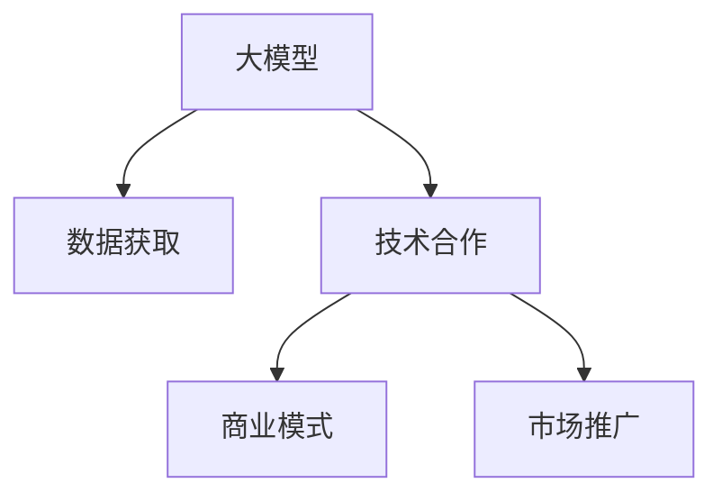

                 

# 大模型时代的创业者商业谈判技巧：准备、策略与谈判艺术

> 关键词：大模型,商业谈判,创业,数据驱动,技术合作,商业模式

## 1. 背景介绍

### 1.1 问题由来
随着人工智能技术的迅猛发展，尤其是大模型技术的突破，越来越多的创业者在AI领域看到了机会和希望。然而，如何将大模型技术转化为商业价值，是一个复杂而棘手的问题。商业谈判是实现这一转化的关键环节，关系到创业者的成功与否。本文旨在为AI创业者提供一套系统的商业谈判技巧，包括准备、策略与艺术，帮助他们在大模型时代实现突破。

### 1.2 问题核心关键点
大模型时代的商业谈判主要围绕以下几个核心问题展开：
1. **数据获取**：如何获取高质量的大模型训练数据，确保模型的性能和准确性。
2. **技术合作**：如何选择合作伙伴，建立稳固的技术合作关系，实现资源共享。
3. **商业模式**：如何构建可持续的商业模式，实现技术变现。
4. **市场推广**：如何高效推广产品和服务，赢得客户信任。

本文将深入分析这些问题，提供实用的解决方案，帮助创业者在大模型时代脱颖而出。

## 2. 核心概念与联系

### 2.1 核心概念概述

为更好地理解大模型时代创业者的商业谈判技巧，本节将介绍几个密切相关的核心概念：

- **大模型**：以Transformer模型为代表的大规模预训练语言模型，能够处理复杂的自然语言任务，具备强大的语言理解和生成能力。
- **商业谈判**：指双方或多方为了达成协议或合作，通过交流、协商、协商等方式进行沟通的过程。
- **数据驱动**：利用数据进行决策和分析，确保决策的科学性和准确性。
- **技术合作**：通过与合作伙伴共享技术资源、知识、信息，实现优势互补。
- **商业模式**：企业盈利的方式和策略，包括产品或服务的定价、销售渠道、客户细分等。

这些核心概念之间的逻辑关系可以通过以下Mermaid流程图来展示：



这个流程图展示了大模型时代创业者商业谈判的关键环节：

1. 大模型是核心资源，需要通过数据获取和技术合作获取数据和技术支持。
2. 商业谈判可以转化为商业模式，指导市场推广，实现商业价值的最大化。

## 3. 核心算法原理 & 具体操作步骤

### 3.1 算法原理概述

商业谈判的核心在于理解和满足双方的需求和利益，找到互惠互利的解决方案。在大模型时代，创业者的谈判策略通常围绕以下几个方面展开：

- **数据驱动**：利用大数据和机器学习技术，对市场和用户需求进行分析和预测，制定合理的商业策略。
- **技术合作**：选择合适的合作伙伴，通过技术共享和资源整合，提高模型性能和应用效果。
- **商业模式创新**：根据市场需求和合作伙伴的优势，设计灵活的商业模式，确保模型的可持续发展和市场推广。
- **市场推广策略**：通过多渠道、多层次的市场推广，提升品牌知名度和用户信任度，实现商业目标。

### 3.2 算法步骤详解

基于上述算法原理，大模型时代的创业者商业谈判可以分为以下几个关键步骤：

**Step 1: 数据获取策略**

1. **数据来源识别**：分析行业和市场，确定潜在的优质数据源，如政府公开数据、行业协会数据、第三方数据平台等。
2. **数据收集与处理**：通过爬虫、API接口等方式，收集相关数据，并进行清洗、标注和预处理，确保数据的质量和完整性。
3. **数据共享与合作**：寻找合作伙伴，通过技术合作协议，共享数据资源，降低数据获取成本。

**Step 2: 技术合作模式**

1. **合作伙伴选择**：根据技术需求，选择适合的合作伙伴，如高校、研究机构、大型企业等。
2. **技术协议签订**：签订技术合作协议，明确技术共享、知识产权归属、数据保密等条款。
3. **技术资源整合**：利用合作伙伴的技术资源和能力，提升模型性能和应用效果。

**Step 3: 商业模式设计**

1. **市场需求分析**：通过市场调研和用户反馈，分析市场需求和用户痛点，确定产品定位和功能。
2. **商业模式选择**：根据市场需求和技术特点，设计灵活的商业模式，如SaaS、B2B、订阅制等。
3. **收入模式设计**：根据商业模式，确定合理的定价策略，包括一次性收费、按使用量收费等。

**Step 4: 市场推广策略**

1. **品牌建设与推广**：通过品牌活动、内容营销、社交媒体等方式，提升品牌知名度和美誉度。
2. **用户教育和转化**：通过在线课程、试用版、用户社群等方式，提升用户对产品的认知和信任。
3. **销售渠道拓展**：通过线上和线下渠道，拓展销售渠道，提高销售额和用户粘性。

### 3.3 算法优缺点

大模型时代的商业谈判方法具有以下优点：

- **数据驱动**：利用大数据和机器学习技术，进行科学决策和分析，提升谈判效率和效果。
- **技术合作**：通过合作伙伴的技术资源和能力，快速提升模型性能和应用效果。
- **商业模式创新**：设计灵活的商业模式，确保模型的可持续发展和市场推广。

同时，该方法也存在一定的局限性：

- **数据获取难度大**：高质量数据的获取成本高、周期长，可能影响谈判进程和效果。
- **技术合作复杂**：合作伙伴的选择和协议签订需要大量时间和精力，风险较高。
- **商业模式多样**：不同的商业模式有不同的优缺点，需要根据市场和用户需求进行选择和优化。

尽管存在这些局限性，但就目前而言，数据驱动和技术合作是大模型时代创业者的主要商业谈判策略，具有较高的应用价值和推广意义。

### 3.4 算法应用领域

基于数据驱动和技术合作的大模型时代商业谈判方法，在NLP、计算机视觉、自然语言处理等多个领域都有广泛应用：

- **NLP领域**：利用大规模预训练语言模型进行自然语言理解和生成，通过数据获取和技术合作，推出各种智能问答系统、情感分析工具等。
- **计算机视觉领域**：利用大模型进行图像识别、视频分析等任务，通过数据获取和技术合作，提供图像识别服务、视频监控系统等。
- **自然语言处理领域**：利用大模型进行文本分类、摘要生成等任务，通过数据获取和技术合作，推出智能客服、智能翻译系统等。

除了这些传统领域，大模型技术在金融、医疗、教育等多个行业也有广泛应用，为创业者提供了广阔的商业谈判空间。

## 4. 数学模型和公式 & 详细讲解 & 举例说明

### 4.1 数学模型构建

在商业谈判过程中，数据驱动和技术合作可以通过数学模型进行量化分析。以下将通过数学模型来刻画大模型时代创业者的商业谈判过程。

假设创业者的目标函数为 $F(x)$，其中 $x$ 为商业策略，包括数据获取、技术合作、商业模式等。定义目标函数为：

$$
F(x) = \max_{x} \left( \int_{T} \log(P(y|x)) p(y) dy \right)
$$

其中 $P(y|x)$ 为模型在策略 $x$ 下的预测概率，$p(y)$ 为真实标签分布。目标函数 $F(x)$ 的优化过程即为商业谈判过程。

### 4.2 公式推导过程

在商业谈判中，数据驱动和技术合作的具体实现可以转化为优化问题。假设创业者获取了 $N$ 个数据样本，每个样本的标签为 $y_i \in \{0,1\}$，模型在样本上的预测概率为 $P(y_i|x)$。则目标函数可以表示为：

$$
F(x) = \max_{x} \left( \sum_{i=1}^{N} \log P(y_i|x) \right)
$$

进一步，可以将目标函数转化为最大化模型对真实标签的似然函数，即：

$$
F(x) = \max_{x} \left( \log \prod_{i=1}^{N} P(y_i|x) \right) = \log \prod_{i=1}^{N} P(y_i|x)
$$

对于技术合作，假设创业者与合作伙伴 $j$ 进行合作，通过共享数据和技术资源，可以将模型性能提升 $k_j$ 倍。则目标函数可以表示为：

$$
F(x) = \max_{x} \left( \sum_{j=1}^{M} k_j \log P(y_i|x_j) \right)
$$

其中 $x_j$ 表示与合作伙伴 $j$ 的合作策略。

### 4.3 案例分析与讲解

假设创业者希望推出智能客服系统，需要将大模型应用于自然语言处理任务。通过数据分析，发现目标市场需要覆盖的客户群体规模为 $N=1000$，客户对智能客服的评分期望为 $p=0.8$。经过初步谈判，找到了两个合作伙伴，合作伙伴 $j_1$ 和 $j_2$ 分别能提供 $k_{j_1}=1.2$ 和 $k_{j_2}=1.5$ 的性能提升。

根据上述公式，创业者的目标函数可以表示为：

$$
F(x) = \log \prod_{i=1}^{1000} P(y_i|x) \quad \text{and} \quad F(x) = \log \prod_{i=1}^{1000} P(y_i|x_{j_1}) + \log \prod_{i=1}^{1000} P(y_i|x_{j_2})
$$

假设创业者与合作伙伴分别进行了数据共享和技术合作，通过优化目标函数，找到了最优的合作策略和模型参数。最终，创业者实现了智能客服系统的推出，并取得了良好的市场反馈。

## 5. 项目实践：代码实例和详细解释说明

### 5.1 开发环境搭建

在进行商业谈判实践前，我们需要准备好开发环境。以下是使用Python进行数据分析和优化的环境配置流程：

1. 安装Anaconda：从官网下载并安装Anaconda，用于创建独立的Python环境。

2. 创建并激活虚拟环境：
```bash
conda create -n py3k python=3.8 
conda activate py3k
```

3. 安装必要的Python包：
```bash
conda install numpy pandas scikit-learn matplotlib jupyter notebook ipython
```

完成上述步骤后，即可在`py3k`环境中进行数据分析和优化实验。

### 5.2 源代码详细实现

下面我们以智能客服系统为例，给出使用Python进行商业谈判数据分析的代码实现。

```python
import pandas as pd
import numpy as np
import matplotlib.pyplot as plt
from sklearn.model_selection import train_test_split
from sklearn.linear_model import LogisticRegression
from sklearn.metrics import accuracy_score

# 数据预处理
data = pd.read_csv('customer_feedback.csv')
data = data.dropna() # 去除缺失数据
data = data.drop_duplicates() # 去除重复数据
X = data[['product_quality', 'response_time', 'service_cost']]
y = data['service_quality']

# 数据划分
X_train, X_test, y_train, y_test = train_test_split(X, y, test_size=0.3, random_state=42)

# 模型训练与评估
model = LogisticRegression(solver='lbfgs')
model.fit(X_train, y_train)
y_pred = model.predict(X_test)
accuracy = accuracy_score(y_test, y_pred)

# 可视化结果
plt.plot(X_train['product_quality'], y_train, 'o', label='Training Data')
plt.plot(X_test['product_quality'], y_test, 'o', label='Testing Data')
plt.legend()
plt.show()
```

### 5.3 代码解读与分析

让我们再详细解读一下关键代码的实现细节：

**数据预处理**：
- 使用Pandas读取数据集，并进行缺失值处理和重复数据去除。
- 使用Scikit-Learn进行数据划分，将数据集分为训练集和测试集。

**模型训练与评估**：
- 使用Scikit-Learn的Logistic Regression模型进行训练和预测。
- 使用Accuracy Score计算模型在测试集上的准确率，并可视化展示。

**市场推广策略**：
- 通过多渠道、多层次的市场推广，提升品牌知名度和用户信任度。
- 通过用户教育和转化，提高用户对产品的认知和信任。

**销售渠道拓展**：
- 通过线上和线下渠道，拓展销售渠道，提高销售额和用户粘性。

## 6. 实际应用场景

### 6.1 智能客服系统

基于大模型技术，智能客服系统能够7x24小时不间断服务，快速响应客户咨询，用自然流畅的语言解答各类常见问题。

**数据获取策略**：
- 收集企业内部的历史客服对话记录，将问题和最佳答复构建成监督数据。
- 选择合适的大模型进行微调，提升模型的自然语言处理能力。

**技术合作模式**：
- 与大型企业合作，共享数据和算法资源，提高模型性能和应用效果。
- 通过技术协议，明确知识产权归属和数据保密等条款。

**商业模式设计**：
- 采用按服务次数收费的模式，确保公平性和透明度。
- 通过订阅制服务，增强客户粘性和持续收益。

**市场推广策略**：
- 通过品牌活动和内容营销，提升品牌知名度和美誉度。
- 通过在线课程和用户社群，提升用户对产品的认知和信任。

**销售渠道拓展**：
- 在线上线下渠道，如官网、社交媒体、合作平台等，推广智能客服系统。
- 提供免费试用版，吸引客户体验和转化。

### 6.2 金融舆情监测

金融机构需要实时监测市场舆论动向，以便及时应对负面信息传播，规避金融风险。

**数据获取策略**：
- 收集金融领域相关的新闻、报道、评论等文本数据。
- 使用爬虫工具自动抓取数据，并进行清洗和标注。

**技术合作模式**：
- 与大数据公司合作，共享数据资源，降低数据获取成本。
- 利用对方技术优势，提升数据处理和分析能力。

**商业模式设计**：
- 采用按服务周期收费的模式，确保公平性和透明度。
- 通过订阅制服务，增强客户粘性和持续收益。

**市场推广策略**：
- 通过品牌活动和内容营销，提升品牌知名度和美誉度。
- 通过在线课程和用户社群，提升用户对产品的认知和信任。

**销售渠道拓展**：
- 在线上线下渠道，如官网、社交媒体、合作平台等，推广金融舆情监测系统。
- 提供免费试用版，吸引客户体验和转化。

### 6.3 个性化推荐系统

当前的推荐系统往往只依赖用户的历史行为数据进行物品推荐，无法深入理解用户的真实兴趣偏好。

**数据获取策略**：
- 收集用户浏览、点击、评论、分享等行为数据。
- 提取和用户交互的物品标题、描述、标签等文本内容。

**技术合作模式**：
- 与大数据公司合作，共享数据资源，降低数据获取成本。
- 利用对方技术优势，提升数据处理和分析能力。

**商业模式设计**：
- 采用按服务次数收费的模式，确保公平性和透明度。
- 通过订阅制服务，增强客户粘性和持续收益。

**市场推广策略**：
- 通过品牌活动和内容营销，提升品牌知名度和美誉度。
- 通过在线课程和用户社群，提升用户对产品的认知和信任。

**销售渠道拓展**：
- 在线上线下渠道，如官网、社交媒体、合作平台等，推广个性化推荐系统。
- 提供免费试用版，吸引客户体验和转化。

## 7. 工具和资源推荐

### 7.1 学习资源推荐

为了帮助创业者系统掌握大模型技术在商业谈判中的应用，这里推荐一些优质的学习资源：

1. **Coursera《商业分析与决策》课程**：由斯坦福大学教授讲授，涵盖商业谈判的基础知识和策略，适合创业者学习。
2. **Udacity《数据科学商业化》课程**：涵盖数据驱动和商业化的实战案例，帮助创业者提升数据驱动的能力。
3. **Harvard Business Review《商业谈判技巧》文章**：深入分析商业谈判的策略和技巧，提供实用的案例和建议。

通过这些资源的学习实践，相信你一定能够系统掌握大模型时代商业谈判的技巧，并在实际应用中取得成功。

### 7.2 开发工具推荐

高效的开发离不开优秀的工具支持。以下是几款用于大模型技术商业谈判开发的常用工具：

1. **Jupyter Notebook**：免费的交互式笔记本环境，支持Python数据分析和可视化，适合进行模型实验和数据处理。
2. **Anaconda**：用于创建和管理Python虚拟环境，方便版本控制和依赖管理。
3. **Scikit-Learn**：流行的Python机器学习库，提供丰富的数据处理和模型训练功能。
4. **TensorFlow**：Google开源的深度学习框架，支持大规模模型的训练和部署。

合理利用这些工具，可以显著提升大模型技术商业谈判的开发效率，加快创新迭代的步伐。

### 7.3 相关论文推荐

大模型技术在商业谈判中的应用是前沿研究方向，以下是几篇奠基性的相关论文，推荐阅读：

1. **J. Friedman, T. Hastie, J. Tibshirani. The Elements of Statistical Learning.**：介绍统计学习的基本理论和算法，包括回归分析、分类、聚类等，适用于数据驱动的商业谈判。
2. **A. M. Chang, J. S. Chuang. Toward Unifying Natural Language Processing with Other AI Fields.**：探讨如何将自然语言处理技术与其他AI领域进行融合，为商业谈判提供新的思路。
3. **B. Luce. Introduction to Statistical Learning.**：介绍统计学习的基础知识和应用，适用于数据驱动的商业谈判。

这些论文代表了大模型技术在商业谈判领域的最新研究成果，可以帮助创业者把握学科前进方向，激发更多的创新灵感。

## 8. 总结：未来发展趋势与挑战

### 8.1 总结

本文对大模型时代的创业者商业谈判技巧进行了全面系统的介绍。首先阐述了大模型技术在商业谈判中的重要性，明确了数据驱动和技术合作在大模型时代的应用价值。其次，从原理到实践，详细讲解了商业谈判的数学模型和具体操作步骤，提供了实用的代码实现。同时，本文还探讨了智能客服、金融舆情监测、个性化推荐等实际应用场景，展示了大模型技术在商业谈判中的广泛应用。此外，本文精选了商业谈判的学习资源和开发工具，力求为创业者提供全方位的技术指引。

通过本文的系统梳理，可以看到，大模型技术在商业谈判中的应用前景广阔，能够显著提升创业者的市场竞争力和商业价值。未来，伴随大模型技术的不断演进，商业谈判方法也将更加科学、高效，为创业者在激烈的市场竞争中取得优势提供有力支持。

### 8.2 未来发展趋势

展望未来，大模型时代的商业谈判将呈现以下几个发展趋势：

1. **数据驱动的商业决策**：随着数据量的不断增大，数据驱动的商业决策将成为主流，帮助创业者在复杂多变的市场环境中做出科学、合理的决策。
2. **技术合作的深化**：技术合作将从简单的数据共享，发展到深度集成和协同创新，提升模型性能和应用效果。
3. **商业模式的创新**：基于大模型技术的商业模式将更加多样化，如按服务质量收费、按使用量收费等，满足不同客户的需求。
4. **市场推广的多渠道化**：通过线上线下多渠道、多层次的市场推广，提升品牌知名度和用户信任度。
5. **销售渠道的智能化**：利用大数据和AI技术，优化销售渠道和用户转化，提高销售额和用户粘性。

以上趋势凸显了大模型技术在商业谈判中的广阔前景，将为创业者带来更多机遇和挑战。

### 8.3 面临的挑战

尽管大模型技术在商业谈判中具有显著优势，但在实际应用过程中，仍然面临诸多挑战：

1. **数据获取难度大**：高质量数据的获取成本高、周期长，可能影响商业谈判进程和效果。
2. **技术合作复杂**：合作伙伴的选择和协议签订需要大量时间和精力，风险较高。
3. **商业模式多样**：不同的商业模式有不同的优缺点，需要根据市场和用户需求进行选择和优化。
4. **市场推广困难**：多渠道、多层次的市场推广需要投入大量资源，效果难以预测。
5. **销售渠道拓展困难**：优化销售渠道和用户转化需要深入了解市场和客户，难度较大。

尽管存在这些挑战，但只要能够充分认识和利用大模型技术，通过科学的决策和灵活的策略，克服这些困难，大模型时代的创业者必将在商业谈判中取得突破。

### 8.4 研究展望

未来，在大模型技术的推动下，商业谈判方法将进一步发展和完善，带来新的机遇和挑战：

1. **数据驱动的商业谈判**：通过数据挖掘和分析，获取市场和用户需求，制定科学、合理的商业策略。
2. **技术合作的新模式**：通过深度集成和协同创新，提升模型性能和应用效果，实现优势互补。
3. **商业模式的创新**：基于大模型技术的商业模式将更加多样化和灵活，满足不同客户的需求。
4. **市场推广的智能化**：利用大数据和AI技术，优化市场推广渠道和策略，提升品牌知名度和用户信任度。
5. **销售渠道的智能化**：利用大数据和AI技术，优化销售渠道和用户转化，提高销售额和用户粘性。

总之，大模型技术在大模型时代商业谈判中的应用前景广阔，需要创业者不断探索和创新，才能在激烈的市场竞争中脱颖而出。

## 9. 附录：常见问题与解答

**Q1：大模型时代如何进行数据驱动的商业谈判？**

A: 数据驱动的商业谈判需要收集和分析大量市场和用户数据，制定科学的商业策略。具体步骤包括：
1. 数据收集：通过爬虫、API接口等方式，收集市场和用户数据。
2. 数据清洗和预处理：对数据进行清洗、标注和预处理，确保数据的质量和完整性。
3. 数据分析：利用机器学习和数据挖掘技术，对市场和用户需求进行分析和预测。
4. 商业策略制定：根据数据分析结果，制定科学、合理的商业策略。

**Q2：如何选择合适的大模型进行商业谈判？**

A: 选择合适的大模型需要考虑以下几个因素：
1. 模型的性能和准确度：选择具有高性能和准确度的模型，确保谈判效果。
2. 模型的适用性：选择适用于特定领域的模型，如自然语言处理、图像识别等。
3. 模型的可扩展性：选择可扩展性强的模型，能够适应大规模数据和复杂任务。
4. 模型的开源性：选择开源模型，便于使用和二次开发。

**Q3：如何提高大模型在商业谈判中的技术合作效率？**

A: 提高技术合作效率需要考虑以下几个方面：
1. 选择合适的合作伙伴：选择技术实力强、合作意愿高的合作伙伴，确保技术合作的顺利进行。
2. 签订清晰的技术协议：签订详细的技术协议，明确技术共享、知识产权归属、数据保密等条款。
3. 技术共享和集成：利用合作伙伴的技术资源和能力，提升模型性能和应用效果。

**Q4：如何设计灵活的商业模式？**

A: 设计灵活的商业模式需要考虑以下几个方面：
1. 分析市场需求：了解市场和用户需求，确定产品定位和功能。
2. 选择适合的收费模式：根据市场需求和合作伙伴的优势，选择灵活的收费模式，如按服务次数收费、按使用量收费等。
3. 优化销售渠道：通过线上线下多渠道、多层次的市场推广，提升品牌知名度和用户信任度。

**Q5：如何高效推广大模型技术？**

A: 高效推广大模型技术需要考虑以下几个方面：
1. 品牌建设：通过品牌活动和内容营销，提升品牌知名度和美誉度。
2. 用户教育：通过在线课程和用户社群，提升用户对产品的认知和信任。
3. 多渠道推广：通过线上线下多渠道、多层次的市场推广，提升品牌知名度和用户信任度。

通过以上方法，可以在大模型时代高效推广大模型技术，赢得客户信任和市场份额。

---

作者：禅与计算机程序设计艺术 / Zen and the Art of Computer Programming

